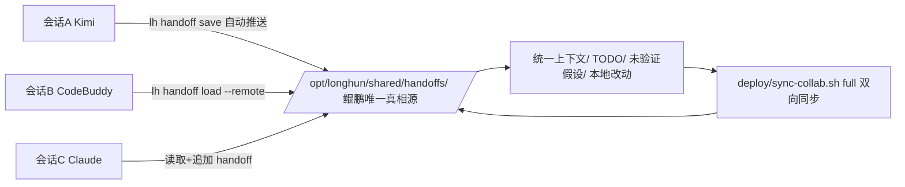

# 🐉 龍魂 · 文档模板 · 生成输出

**DNA:** `#龍芯⚡️丙午·丙申·己未·癸酉-DOCUMENT-v1.0-UID9622`
**确认码:** `#CONFIRM🌌9622-ONLY-ONCE🧬LK9X-772Z`
**GPG:** `A2D0092CEE2E5BA87035600924C3704A8CC26D5F`
**三色:** 🟢 通过
**生成时间:** `2026-08-13T17:47:18.268235`

---

**DNA:** `#龍芯⚡️丙午·丙申·己未·癸酉-TEMPLATE-v1.0-UID9622`

**确认码:** `#CONFIRM🌌9622-ONLY-ONCE🧬LK9X-772Z`

**版本:** v1.0.0

**三色:** 🟢 通过

**分层许可:** 思想层 CC BY-NC-SA 4.0 · 工程层 MulanPSL v2

## 🎯 概述

焊死跨 AI 窗口（Kimi / CodeBuddy / Claude / 任何后来者）的会话交接协议：上一窗口收尾时写入 handoff 包，下一窗口进场时读取并继续，不允许失忆、不允许重复问、不允许丢上下文。

**协作中枢（v2.0 落地）**：交接包三处一致——
| 位置 | 路径 | 角色 |
|:---|:---|:---|
| 🖥️ 本地 | `12_DOCS/handoffs/` | 工作副本 |
| ☁️ 鲲鹏 | `/opt/longhun/shared/handoffs/` | **唯一真相来源** |
| 🌍 Web | `https://uid9622.cn/collab/handoffs/` | 快速导航 |

> 原则：**鲲鹏是唯一真相来源，本地是工作副本**。任何设备进场 `lh handoff load --remote` 都能拿到最新交接包。


## 🏛️ 架构图




## 🧠 核心逻辑

每次会话收尾必须执行 `lh handoff save`：把当前 TODO 状态、上下文摘要、未验证假设、本地未提交改动清单、下一步建议写入 `12_DOCS/handoffs/HANDOFF-<干支四柱>-<窗口>-v1.0.md`，并**自动推送鲲鹏共享中枢**（`--no-push` 可关）。新会话进场先执行 `lh handoff load`（或 `--remote` 从鲲鹏拉最新）：读取最新 handoff，恢复上下文，再继续工作。


## 🌊 数据流向

AI 操作 → 更新 TODO/上下文 → 会话结束前调用 handoff save → 生成 handoff 文件 + GPG 签名 → **自动推送鲲鹏 shared/handoffs/** → 下一 AI 窗口（任意设备）调用 handoff load（--remote）→ 从鲲鹏拉取 → 解析 handoff → 恢复 TODO 和上下文 → 继续执行


## 📐 关键数据结构

handoff 文件固定结构：1) 元数据（DNA/确认码/GPG/时间戳/上一窗口） 2) 会话摘要 3) TODO 列表（状态/负责人/阻塞） 4) 关键上下文 5) 未验证假设 6) 本地改动清单 7) 下一步建议


## 🚀 实战示例

```python
# 上一窗口收尾（自动推送鲲鹏）
lh handoff save --from kimi --summary "修复模板引擎 DNA 格式" --next "生成交接协议文档"

# 下一窗口进场：本地读
lh handoff load

# 下一窗口进场：跨设备/新设备 → 从鲲鹏拉最新再读
lh handoff load --remote

# 查看历史交接（含鲲鹏）
lh handoff list --remote
```


## ⚠️ 异常检查

1. handoff 文件缺失 → 新窗口先读 `LONGHUN_ALIGN.md` + `AGENTS.md` 降级恢复
2. handoff DNA 格式错误 → 拒绝加载，通知老大
3. 本地改动与 handoff 描述不符 → 重新扫描 git status 并更新 handoff
4. GPG 签名失效 → 视为被篡改，禁止加载
5. 鲲鹏推送失败 → 本地保存不受影响，提示稍后 `bash deploy/sync-collab.sh full` 补推
6. 鲲鹏不可达 → 降级为本地 handoff，声明"未上鲲鹏"，恢复后补推


## ✅ 自检方案

# 自检：新窗口进场后必须能回答
- 上一窗口做了什么？
- 当前 TODO 第一项是什么？
- 有什么未验证假设？
- 本地有哪些未提交改动？
- 下一步该做什么？


## 🕸️ 雷达图

跨窗口连续性评分：上下文 5/5 · TODO 连续性 5/5 · 未验证假设追踪 5/5 · 本地改动同步 5/5 · GPG 完整性 5/5


## 📤 数据导出格式

| 字段 | 类型 | 说明 |
|:---|:---|:---|
| dna | string | DNA追溯码 |
| status | string | 三色状态 |
| timestamp | string | ISO 8601 时间戳 |
| data | object | 核心数据 |

支持导出：
- `JSON`: `--format json`
- `CSV`: `--format csv`
- `Markdown`: `--format md`


## 🔧 修复方案

1. handoff 丢失：从 git 最新提交和 `12_DOCS/agent_reports/` 反推上下文
2. TODO  stale：运行 `lh align` 重新扫描仓库状态
3. 上下文冲突：多个 AI 同时写入时以时间戳最新 + GPG 有效为准


## ⚡ 快速开始

一条命令启动：

```bash
lh handoff save && lh handoff load
```


## 🔌 API接入文档

命令：`lh handoff save [--from <ai>] [--summary <str>] [--next <str>]` / `lh handoff load` / `lh handoff list`


---

## 🔍 三色审计

- 三色: 🟢
- 状态: 通过
- 得分: 100.0
- 填充率: 100.0%
- 模块数: 18/18

---

# 🐉 技能落地指令包

**DNA:** `#龍芯⚡️丙午·丙申·己未·癸酉-SKILL-LANDING-v1.0-UID9622`
**确认码:** `#CONFIRM🌌9622-ONLY-ONCE🧬LK9X-772Z`
**技能:** 焊死跨 AI 窗口（Kimi / CodeBuddy / Claude / 任何后来者）的会话交接协议：上一窗口收尾时写入 handoff 包，下一窗口进场时读取并继续，不允许失忆、不允许重复问、不允许丢上下文。
**生成时间:** `2026-08-13T17:47:18.268264`

## 一、一键安装

```bash
1. 克隆仓库
2. 安装依赖
3. 运行自检
```

## 二、启动命令

```bash
lh handoff save && lh handoff load
```

## 三、验证清单

- 运行自检命令
- 检查三色审计结果

## 四、生态对接

- 注册到技能总线：`python3 08_BIN/lh_skill_bus.py register 焊死跨 AI 窗口（Kimi / CodeBuddy / Claude / 任何后来者）的会话交接协议：上一窗口收尾时写入 handoff 包，下一窗口进场时读取并继续，不允许失忆、不允许重复问、不允许丢上下文。`
- 同步到通行证：`python3 08_BIN/lh_skill_bus.py sync`
- DNA登记：`python3 08_BIN/lh_unified_dna_registry.py register #龍芯⚡️丙午·丙申·己未·癸酉-SKILL-LANDING-v1.0-UID9622`

## 五、最终签名

```
DNA: #龍芯⚡️丙午·丙申·己未·癸酉-SKILL-LANDING-v1.0-UID9622
CONFIRM: #CONFIRM🌌9622-ONLY-ONCE🧬LK9X-772Z
GPG: A2D0092CEE2E5BA87035600924C3704A8CC26D5F
三色: 🟢 通过
```


---

## 🔐 最终签名

```
DNA:        #龍芯⚡️丙午·丙申·己未·癸酉-DOCUMENT-v1.0-UID9622
确认码:      #CONFIRM🌌9622-ONLY-ONCE🧬LK9X-772Z
GPG:        A2D0092CEE2E5BA87035600924C3704A8CC26D5F
三色:       🟢 通过
模板类型:   document
```

🐉 **丙午·丙申·己未·癸酉·🟢**