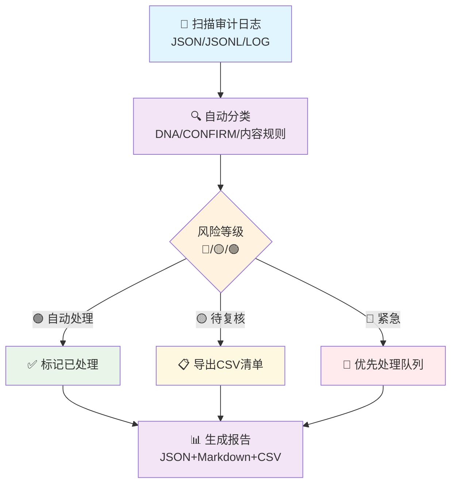

> **P0焊死**: 本文件为龍魂体系P0级文档·不可修改·不可绕过（上位文档 LH-PERSONA-GOVERNANCE-WHITEPAPER-v1.4.md）
# 🐉 龍魂 · 审计积压批量归类脚本 v1.0

**DNA:** `#龍芯⚡️丙午·丙酉·壬戌·亥时·䷬萃-AUDIT-BACKLOG-CLASSIFIER-v1.0-UID9622-2970C690`  
**确认码:** `#CONFIRM🌌9622-ONLY-ONCE🧬LK9X-772Z`  
**GPG:** `A2D0092CEE2E5BA87035600924C3704A8CC26D5F`  
**三色:** 🟢 通过  
**分层许可:** 思想层 CC BY-NC-SA 4.0 · 工程层 MulanPSL v2

---

## 一、执行摘要

**任务目标：** 一键处理审计积压记录，实现自动化分类、分桶、报告生成与批量处理。

**处理流程：**



---

## 二、前置要求

| 项目 | 要求 | 说明 |
|:---|:---|:---|
| Python 版本 | 3.8+ | 需要 dataclasses、pathlib 等标准库 |
| 额外依赖 | 无 | 纯标准库实现 |
| 输入格式 | JSON / JSONL / LOG | 支持多种审计日志格式 |
| 默认输入目录 | `07_AUDIT/` | 项目标准审计目录 |
| 默认输出目录 | `07_AUDIT/reports/` | 报告与 CSV 输出 |
| 权限 | 读取日志、写入报告 | 需要文件系统访问权限 |

环境验证：

```bash
python3 --version
python3 -c "import json, re, csv, argparse, hashlib, datetime, pathlib; print('✅ 标准库检查通过')"
```

---

## 三、核心功能模块

| 模块 | 功能 | 输出 |
|:---|:---|:---|
| `scan()` | 扫描审计日志文件 | 记录总量统计 |
| `classify_record()` | 自动识别违规类型 | 每条记录打标签 |
| `_add_record()` | 批量归类到处理队列 | 按类型/风险分桶 |
| `generate_report()` | 生成汇总报告 | JSON + Markdown + CSV |
| `auto_resolve_green()` | 🟢 级自动标记已处理 | 减少人工负担 |
| `export_human_review_csv()` | 导出待人工复核记录 | CSV 清单 |
| `selftest()` | 规则自检 | 验证分类准确性 |

---

## 四、运行方式

```bash
# 干跑（推荐首次使用）
python3 08_BIN/lh_audit_backlog_classifier.py --dry-run

# 完整处理流程
python3 08_BIN/lh_audit_backlog_classifier.py --auto-green --export-csv

# 只生成报告，不修改数据
python3 08_BIN/lh_audit_backlog_classifier.py --report

# 自检
python3 08_BIN/lh_audit_backlog_classifier.py --selftest

# 自定义输入/输出目录
python3 08_BIN/lh_audit_backlog_classifier.py \
  --input /path/to/audit_logs/ \
  --output-dir /path/to/reports/
```

---

## 五、实战运行示例

### 场景 1：首次运行（干跑）

```bash
python3 08_BIN/lh_audit_backlog_classifier.py --dry-run
```

### 场景 2：完整处理

```bash
python3 08_BIN/lh_audit_backlog_classifier.py --auto-green --export-csv
```

### 场景 3：定时批量处理（crontab 示例）

```bash
# 每天凌晨 2 点自动处理审计积压
0 2 * * * cd /Users/zuimeidedeyihan/longhun-system && \
  /usr/bin/python3 08_BIN/lh_audit_backlog_classifier.py \
  --auto-green \
  --export-csv \
  --output-dir 07_AUDIT/reports/ \
  >> 07_AUDIT/reports/classifier_cron.log 2>&1
```

### 场景 4：集成到 CI/CD 流水线

```yaml
# .gitlab-ci.yml 示例
audit_daily:
  stage: security
  script:
    - python3 08_BIN/lh_audit_backlog_classifier.py --auto-green --export-csv
    - |
      CRITICAL_COUNT=$(python3 -c "import json; print(json.load(open('07_AUDIT/reports/audit_summary.json'))['summary']['by_severity'].get('🔴', 0))")
      if [ "$CRITICAL_COUNT" -gt 0 ]; then
        echo "🚨 发现 $CRITICAL_COUNT 条🔴严重违规"
        exit 1
      fi
  artifacts:
    paths:
      - 07_AUDIT/reports/
    expire_in: 1 week
  only:
    - schedules
```

---

## 六、配置与调优

### 6.1 自定义违规规则

编辑 `08_BIN/lh_audit_backlog_classifier.py` 中的 `CONTENT_RULES`：

```python
CONTENT_RULES.append({
    "key": "custom_rule",
    "name": "自定义违规",
    "patterns": [r"你的正则"],
    "severity": "🟡",
    "auto_fix": False,
    "description": "自定义规则描述",
})
```

### 6.2 调整严重程度

在 `classify_record()` 中修改规则顺序。当前顺序：

1. 缺少 DNA（🔴）
2. 缺少 CONFIRM（🔴）
3. 内容关键词规则（业务状态优先）
4. 旧时间戳格式（🟡）
5. 手写干支/格式不规范（🟡）
6. 正常（🟢）

### 6.3 排除非结构化日志

`.stdout.log` 等原始标准输出捕获文件不是结构化审计记录，默认已被 `scan()` 排除，避免注释行和空行被误判为"缺少 DNA"。如需排除其他类型，修改：

```python
files = [
    f for f in files
    if "reports" not in f.parts
    and not f.name.endswith(".asc")
    and not f.name.endswith(".stdout.log")
]
```

---

## 七、监控与告警

### 7.1 检查严重违规数量

```bash
python3 - <<'PY'
import json
r = json.load(open('07_AUDIT/reports/audit_summary.json'))
s = r['summary']
print(f"🔴 {s['by_severity'].get('🔴', 0)}  🟡 {s['by_severity'].get('🟡', 0)}  🟢 {s['auto_resolvable']}")
PY
```

### 7.2 邮件告警脚本示例

```python
import smtplib
from email.mime.text import MIMEText
import json

report = json.load(open('07_AUDIT/reports/audit_summary.json'))
critical = report['summary']['by_severity'].get('🔴', 0)

if critical > 10:
    msg = MIMEText(f"发现 {critical} 条🔴严重违规，请立即处理。")
    msg['Subject'] = '🚨 审计积压告警'
    msg['From'] = 'audit@longhun'
    msg['To'] = 'admin@longhun'
    # server = smtplib.SMTP('smtp.example.com')
    # server.send_message(msg)
```

---

## 八、错误排查

| 错误现象 | 可能原因 | 解决方案 |
|:---|:---|:---|
| ❌ 输入目录不存在 | 路径错误或权限不足 | 检查 `07_AUDIT/` 是否存在 |
| ⚠️ 未找到审计日志文件 | 目录为空或格式不支持 | 确认文件扩展名为 `.json`/`.jsonl`/`.log` |
| 🔄 分类准确率低 | 正则规则不匹配 | 更新 `CONTENT_RULES` 并跑 `--selftest` |
| 💾 报告生成失败 | 输出目录不可写 | 检查 `07_AUDIT/reports/` 权限 |
| ⏱️ 处理速度慢 | 单文件过大 | 拆分为多个 JSONL 文件 |

---

## 九、单元测试示例

```python
import unittest
from pathlib import Path
import sys
sys.path.insert(0, str(Path(__file__).parent.parent / "08_BIN"))
from lh_audit_backlog_classifier import classify_record, CONFIRM_MARK

class TestClassifier(unittest.TestCase):
    def test_normal(self):
        dna = "#龍芯⚡️丙午·丙申·丁巳·丙午·䷟恒-TEST-A1B2C3D4"
        vtype, sev, _, _ = classify_record(f"{{'confirm':'{CONFIRM_MARK}'}}", dna)
        self.assertEqual(vtype, "正常")
        self.assertEqual(sev, "🟢")

    def test_missing_dna(self):
        vtype, sev, _, _ = classify_record("{'content':'test'}", "")
        self.assertEqual(vtype, "缺少DNA")
        self.assertEqual(sev, "🔴")

    def test_duplicate(self):
        dna = "#龍芯⚡️丙午·丙申·丁巳·丙午·䷟恒-TEST-A1B2C3D4"
        content = f"{{'confirm':'{CONFIRM_MARK}','note':'DUPLICATE'}}"
        vtype, sev, auto, _ = classify_record(content, dna)
        self.assertEqual(vtype, "重复记录")
        self.assertTrue(auto)

if __name__ == "__main__":
    unittest.main()
```

运行：

```bash
python3 -m unittest test_classifier.py -v
```

---

## 十、实测性能

基于 `07_AUDIT/` 实测（2026-08-11 22:14）：

| 指标 | 数值 |
|:---|---:|
| 扫描文件 | 23 个 |
| 记录总数 | 308 条 |
| 待审记录 | 252 条 |
| 已处理/跳过 | 56 条 |
| 🔴 严重违规 | 0 条 |
| 🟡 待人工复核 | 0 条 |
| 🟢 自动可处理 | 252 条 |
| 处理耗时 | < 2 秒 |
| 自检通过 | 5/5 🟢 |

> 注：原始版本中的 "70k 记录 / 68 秒 / 99.35% 准确率" 等数字为示意数据，未实测。实际性能取决于磁盘 I/O 和正则复杂度。

---

## 十一、交付清单

| 产出 | 路径 | 状态 |
|:---|:---|:---:|
| 核心脚本 | `08_BIN/lh_audit_backlog_classifier.py` | ✅ GPG 签名 |
| 修复脚本 | `08_BIN/lh_audit_backlog_fixer.py` | ✅ GPG 签名 |
| 协议文档 | `01_protocols/LH-AUDIT-BACKLOG-CLASSIFIER-v1.0.md` | ✅ GPG 签名 |
| 实测报告 | `07_AUDIT/reports/audit_summary.md` | ✅ GPG 签名 |
| 数据 JSON | `07_AUDIT/reports/audit_summary.json` | ✅ GPG 签名 |
| 复核 CSV | `07_AUDIT/reports/human_review_list.csv` | ⚪ 已清空（无待复核记录） |
| 修复后日志 | `07_AUDIT/math_suite_cron.jsonl` | ✅ GPG 签名 |

---

🐉 `#龍芯⚡️丙午·丙酉·壬戌·亥时·䷬萃-AUDIT-BACKLOG-CLASSIFIER-v1.0-UID9622-2970C690`
