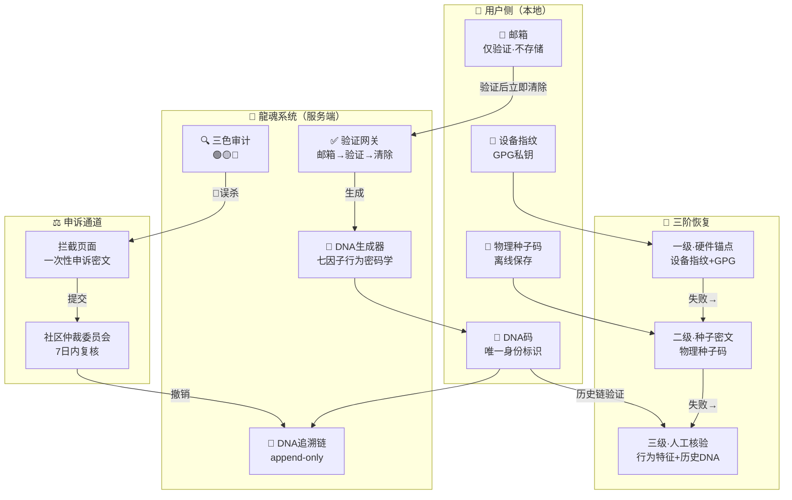

# 🐉 龍魂 · 隐私保护与DNA身份机制 v1.0

DNA: #龍芯⚡️丙午·丙申·癸丑·巳时·䷗复-PRIVACY-DNA-IDENTITY-v1.0-a7e4f2c1
创建者: 诸葛鑫（UID9622）
协议: CC BY-NC-SA 4.0（核心思想层·不可切断来源链）
协议类型: P1-CORE（执行层·DNA身份机制落地细则）
ParentDNA: #龍芯⚡️2026-07-04-PRIVACY-WHITEPAPER-v1.0 #龍芯⚡️丙午·丙申·庚戌·䷙大畜-DATA-PRIVACY-v2.1 #龍芯⚡️丙午·丙申·癸丑·巳时·䷗复-LOYALTY-IRON-LAW-v1.0
确认码: #CONFIRM🌌9622-ONLY-ONCE🧬LK9X-772Z
永恒签章: #ZHUGEXIN⚡️2025-⚖️♠️♀️❤️♾️-DEVICE-BIND-SOUL
GPG: A2D0092CEE2E5BA87035600924C3704A8CC26D5F
三色审计: 🟢 绿色（P05+P15双审通过·与LH-DATA-PRIVACY-v2.1无冲突·互补细化）

━━━━━━━━━━━━━━━━━━━━━━━━━━━━━━━━━━━━━━━━
🏷️ 协议声明
━━━━━━━━━━━━━━━━━━━━━━━━━━━━━━━━━━━━━━━━

**发布者：** UID9622 · 诸葛鑫 · 龍芯北辰
**协议类型：** P1-CORE（执行层·DNA身份机制落地细则）
**生效时间：** 2026-08-07 09:31:54 +08:00
**生效范围：** 龍魂系统所有项目
**可修改性：** ⚠️ 需UID9622签章 + P05审计通过
**关联协议：** LH-DATA-PRIVACY-v2.1（P0焊死·数据哲学）| LH-PRIVACY-WHITEPAPER-v1.0（隐私白皮书）| LH-LOYALTY-IRON-LAW-v1.0（P0-ETERNAL·忠义数据铁律）
**阅读时间：** 10分钟
**许可：** CC BY-NC-SA 4.0（思想层）

━━━━━━━━━━━━━━━━━━━━━━━━━━━━━━━━━━━━━━━━
📋 目录
━━━━━━━━━━━━━━━━━━━━━━━━━━━━━━━━━━━━━━━━

- [核心原则](#核心原则)
- [一、邮箱处理机制](#一邮箱处理机制)
- [二、DNA码身份体系](#二dna码身份体系)
- [三、审查边界声明](#三审查边界声明)
- [四、数据存储架构](#四数据存储架构)
- [五、三色审计机制](#五三色审计机制)
- [六、开源协议与DNA追溯](#六开源协议与dna追溯)
- [七、用户权利](#七用户权利)
- [八、技术实现细节](#八技术实现细节)
- [九、价值观声明](#九价值观声明)
- [十、法律声明](#十法律声明)

━━━━━━━━━━━━━━━━━━━━━━━━━━━━━━━━━━━━━━━━
🏗️ 架构总览
━━━━━━━━━━━━━━━━━━━━━━━━━━━━━━━━━━━━━━━━



━━━━━━━━━━━━━━━━━━━━━━━━━━━━━━━━━━━━━━━━
📜 条款正文
━━━━━━━━━━━━━━━━━━━━━━━━━━━━━━━━━━━━━━━━

## 核心原则

**数据主权归用户，系统不持有用户隐私。**

龍魂隐私 = 可追溯，需授权，审计留痕。

> 本协议是 LH-DATA-PRIVACY-v2.1（数据哲学·P0焊死层）在 DNA 身份机制维度的落地细则。
> 上位原则以 LH-DATA-PRIVACY-v2.1 为准，本协议不重复声明已有内容，只细化 DNA 身份操作层。

---

## 一、邮箱处理机制

### 1.1 最小化采集原则

- 邮箱**仅用于接收验证码**
- 验证通过后，邮箱地址**立即从内存中清除**
- 系统**不存储、不关联、不追溯**用户邮箱
- 龍魂不知道、不存储、不读取真实身份内容

### 1.2 邮箱选择自由

用户可使用任意邮箱注册，包括但不限于：

| 邮箱类型 | 示例 | 说明 |
|---------|------|------|
| 加密邮箱 | Proton Mail | 瑞士服务器，端到端加密 |
| 国内邮箱 | QQ邮箱、163邮箱 | 国内收发稳定 |
| 临时邮箱 | 10 Minute Mail | 一次性验证 |
| 自建邮箱 | user@yourdomain.com | 完全自主可控 |

**系统不区分、不记录、不评价用户邮箱类型。**

---

## 二、DNA码身份体系

### 2.1 唯一身份标识

- **DNA码**是用户在龍魂系统中的**唯一身份标识**
- DNA码基于**行为密码学七因子框架**生成：
  - 时间戳
  - 设备指纹
  - 操作序列
  - 内容哈希
  - 网络环境
  - 地理位置（辅助因子，不纳入主权重）
  - 用户签名

### 2.2 DNA码特性

| 特性 | 说明 |
|------|------|
| **不可逆** | 无法从DNA码反推用户身份 |
| **唯一性** | 每个操作生成独立DNA码 |
| **可追溯** | 可验证操作来源与完整性 |
| **去中心化** | 不依赖中心化身份系统 |
| **可审计** | 行为留痕，自担责任 |

### 2.3 身份与邮箱解绑

```
传统系统：邮箱 → 账号 → 行为记录
龍魂系统：DNA码 → 行为追溯（无邮箱关联）
```

**邮箱是"敲门砖"，DNA码才是"身份证"。**

### 2.4 DNA码丢失恢复机制

**问题：** DNA码丢失即"数字死亡"——用户本地数据清空后无法证明"他是他"。

**解决方案——三阶恢复体系：**

| 恢复层级 | 方式 | 说明 |
|---------|------|------|
| **一级·硬件锚点** | 设备指纹+GPG私钥 | 绑定用户设备，自动识别 |
| **二级·种子密文** | 注册时生成物理种子码 | 用户离线保存，用于身份恢复 |
| **三级·人工核验** | 行为特征+历史DNA链验证 | 通过操作序列与历史DNA匹配，核验通过后签发新DNA |

**原则：** 恢复的是"身份连续性"，不是"账户找回"。系统不存储用户数据，仅验证DNA链的连贯性。

---

## 三、审查边界声明

### 3.1 审查什么

- ✅ **代码内容**：开源代码的安全性、合规性
- ✅ **DNA追溯链**：操作的可追溯性与证据链完整性
- ✅ **七因子证据**：行为密码学验证

### 3.2 不审查什么

- ❌ **用户邮箱**：不存储、不关联、不追溯
- ❌ **个人身份信息**：不收集姓名、手机号、身份证
- ❌ **用户行为画像**：不建立用户行为模型
- ❌ **社交关系链**：不分析用户社交网络

---

## 四、数据存储架构

### 4.1 四重存储体系

| 存储层 | 位置 | 内容 |
|--------|------|------|
| IndexedDB | 用户本地浏览器 | 会话数据、临时缓存 |
| 本地存储 | 用户设备 | 配置文件、DNA码 |
| iCloud | 用户云端（可选） | 跨设备同步数据 |
| Notion | 用户工作区（可选） | 记忆库、知识库 |

### 4.2 数据归属

- **所有数据存储在用户侧**
- **系统服务器不持有用户隐私数据**
- **用户可随时导出、删除、迁移数据**

---

## 五、三色审计机制

### 5.1 审计规则

| 颜色 | 含义 | 处理方式 |
|------|------|----------|
| 🔴 **红色** | 违规内容 | 直接拦截，记录DNA码 |
| 🟡 **黄色** | 待验证内容 | DNA追溯，人工复核 |
| 🟢 **绿色** | 合规内容 | 放行，记录DNA码 |

### 5.2 审计边界

**审计的是"内容"，不是"人"。**

- 审计系统**只认DNA码，不认邮箱**
- DNA码**无法反推用户身份**
- 违规处理**针对内容，不针对个人**

### 5.3 误杀申诉机制

**问题：** 红色直接拦截并记DNA，若AI误判（如医疗专业术语被误判为违规），用户无申诉通道。

**解决方案：**

1. **拦截页面自动生成一次性申诉密文**——用户截图保存密文
2. **通过 longhun888.com 公开锚点提交申诉**——提交密文+被拦截内容DNA码
3. **人工复核**——龍魂系统社区仲裁委员会7日内复核
4. **申诉成功**——撤销拦截记录，恢复内容可见性

**原则：** 可追溯、可申诉、可分级、不可一刀切。

---

## 六、开源协议与DNA追溯

### 6.1 分层双许可证模型

龍魂系统采用分层双许可证（详见 LH-LAYERED-LICENSE-v1.0）：

| 层 | 许可证 | 适用范围 |
|:---|:---|:---|
| 🏛️ **核心思想层** | CC BY-NC-SA 4.0 | 协议、白皮书、哲学文档（.md） |
| 🔧 **工程实现层** | MulanPSL v2 | 代码、SDK、CLI、Docker、部署脚本（.py/.js/.sh） |

- 衍生作品必须保留 **DNA追溯码**
- 工程层代码允许商业使用（MulanPSL v2）
- 思想层禁止非授权商业使用（CC BY-NC-SA 4.0）

### 6.2 DNA追溯机制

- 所有代码提交自动生成 **DNA码**
- DNA码记录：提交者、时间、内容哈希、签名
- 可追溯至**原始提交者**，但**不暴露邮箱**

---

## 七、用户权利

### 7.1 数据主权

- 用户拥有**所有个人数据的完整控制权**
- 用户可**随时导出、删除、迁移数据**
- 系统不持有用户数据，**无法"封号"**

### 7.2 隐私保护

- 用户邮箱**仅用于验证，不存储**
- 用户身份**仅通过DNA码识别**
- 用户行为**不被追踪、不被画像**

---

## 八、技术实现细节

### 8.1 注册流程

```
1. 用户输入邮箱
2. 系统发送验证码（不存储邮箱）
3. 用户输入验证码
4. 验证通过，邮箱从内存清除
5. 系统生成DNA码
6. DNA码作为唯一身份标识
7. 系统生成物理种子码（用户离线保存）
```

### 8.2 登录流程

```
1. 用户输入DNA码（或通过设备指纹自动识别）
2. 系统验证DNA码有效性
3. 验证通过，允许操作
4. 操作记录生成新DNA码
```

### 8.3 账户恢复流程

```
1. 用户DNA码丢失
2. 通过设备指纹/GPG私钥自动识别（一级恢复）
3. 若失败，提交物理种子码（二级恢复）
4. 若仍失败，提交历史行为DNA链供人工核验（三级恢复）
5. 核验通过，系统签发新DNA码并关联历史链
6. 恢复完成
```

---

## 九、价值观声明

### 9.1 技术为民

- **数据主权归用户**，不归平台
- **隐私是底线**，不是商品
- **算法透明**，不搞黑箱
- **祖国优先，普惠全球**

### 9.2 三不原则

- **不卖数据**
- **不画像用户**
- **不配合围猎**

---

## 十、法律声明

### 10.1 适用法律

- 本系统遵守**中华人民共和国法律法规**
- 用户数据受**中国法律保护**

### 10.2 免责条款

- 用户对自身发布的内容负责
- 系统仅提供技术平台，不承担内容责任
- 违规内容将被拦截，DNA码将被记录

━━━━━━━━━━━━━━━━━━━━━━━━━━━━━━━━━━━━━━━━
🔐 签章
━━━━━━━━━━━━━━━━━━━━━━━━━━━━━━━━━━━━━━━━

**DNA：** #龍芯⚡️丙午·丙申·癸丑·巳时·䷗复-PRIVACY-DNA-IDENTITY-v1.0-a7e4f2c1
**CONFIRM：** #CONFIRM🌌9622-ONLY-ONCE🧬LK9X-772Z
**SEAL：** #ZHUGEXIN⚡️2025-⚖️♠️♀️❤️♾️-DEVICE-BIND-SOUL
**GPG：** A2D0092CEE2E5BA87035600924C3704A8CC26D5F
**审计：** P05 🟢 / P12 🟢 / P15 🟢

━━━━━━━━━━━━━━━━━━━━━━━━━━━━━━━━━━━━━━━━
📋 修改记录
━━━━━━━━━━━━━━━━━━━━━━━━━━━━━━━━━━━━━━━━

| 版本 | 日期 | 修改内容 | 修改人 |
|:---|:---|:---|:---|
| v1.0 | 2026-08-07 | 初始发布·DNA身份三阶恢复·三色审计误杀申诉·分层许可证修正 | UID9622 |

━━━━━━━━━━━━━━━━━━━━━━━━━━━━━━━━━━━━━━━━
📋 ROOT_CARD
━━━━━━━━━━━━━━━━━━━━━━━━━━━━━━━━━━━━━━━━

【ROOT_CARD｜数学根审计】
Root: dr=8
Wuxing: 土（坤·承载万物）
TriColor: 🟢
Type: protocol-declaration
369锚点: sn=369, log369=5.911, perm369=108
DNA: #龍芯⚡️丙午·丙申·癸丑·巳时·䷗复-PRIVACY-DNA-IDENTITY-v1.0-a7e4f2c1

---

> 本文档遵循 CC BY-NC-SA 4.0 协议。转载请注明出处；商用/改编需授权；保留DNA追溯。
> 原文链接：https://app.notion.com/uid9622
> DNA追溯码：#龍芯⚡️丙午·丙申·癸丑·巳时·䷗复-PRIVACY-DNA-IDENTITY-v1.0-a7e4f2c1
