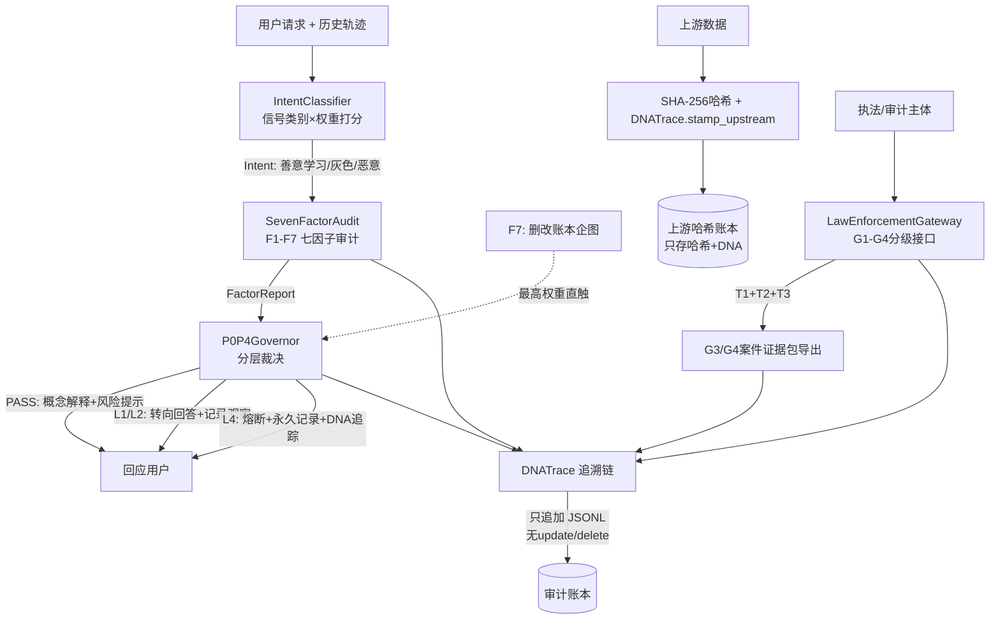
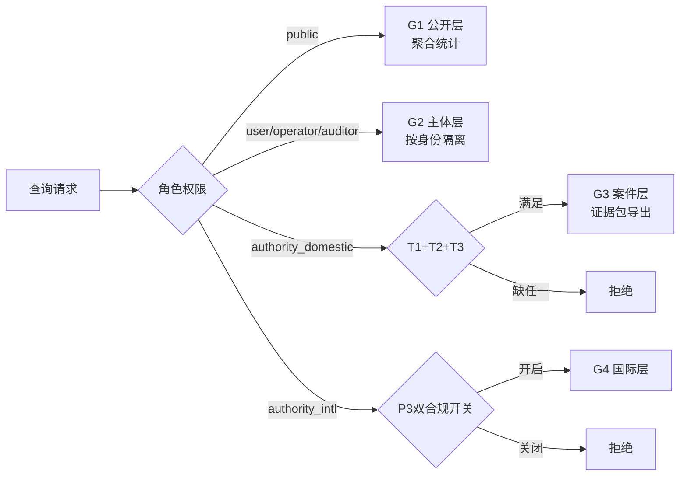

> 协议: CC BY-NC-SA 4.0（核心思想层·分层许可·代码层为 MulanPSL v2·详见 LH-LAYERED-LICENSE-v1.0）
# 龍魂上下文安全协议 v1.1

**DNA**: #龍芯⚡️丙午·乙未·甲辰·庚午·䷔噬-安全协议-v1.1
**归属**: 龍芯北辰 UID9622
**确认码**: #CONFIRM🌌9622-ONLY-ONCE🧬LK9X-772Z
**状态**: 可发布版 · 纯标准库实现 · 零第三方依赖

---

## 边界声明（显著位置）

- **不碰政治**：本协议及其执法审计网关均不构成对任何政府/政治事务的接入，不做内容定性；内容定性权属于各国法律与司法机构。
- **不主动上报、不实时监控用户**：仅在“系统内确证严重事件 + 有效法律凭证 + 案件范围绑定”三条件齐备时，才依法依规提供审计通道。
- **数据本地不出户**：用户数据本地存储，不主动上传；证据包导出即离境审计，导出行为全程上DNA链。
- **最小留存**：上游数据账本只存 SHA-256 哈希 + DNA，不保留原始内容副本。

---

## 1. 设计理念：不是拦截词库，是上下文治理

传统安全模块是**关键词黑名单**：命中词就拦，不命中就放。这是黑箱——用户不知道为何被拦，善意学习者被误伤，恶意者换个说法就绕过。

本协议走另一条路：**上下文意图判定 + 七因子行为审计 + P0–P4分层治理 + DNA追溯**。

三条铁律：

1. **零黑箱**：每一个判定必须输出【级别 + 触发因子 + 中文大白话理由 + 申诉入口】。
2. **意图而非词句**：判定依据是"信号类别 + 权重打分"——这句话在学习还是在索取？在防护还是在绕过？历史上是否在渐进逼近？
3. **账本不可改**：审计链只追加。引擎代码物理上不存在 update/delete 方法；任何删改企图本身就是最高级红线（F7直触L4）。

v1.1 在以上铁律之上新增：**执法审计也被审计、上游数据哈希化、权限分级最小化**。

---

## 2. 架构



---

## 3. 模块接口

### 3.1 IntentClassifier — 上下文意图分类

```python
class IntentClassifier:
    def classify(self, request: str, history: list[str]) -> IntentResult
# Intent = BENIGN_LEARN(善意学习) / GRAY(灰色) / MALICIOUS(恶意)
```

信号类别（权重在 `config/p0_p4_rules.yaml` 的 P2 段可调）：

| 信号类别 | 默认权重 | 含义 |
|---|---|---|
| LEARNING_QUESTION | −20 | 学习性提问（什么是/为什么/原理） |
| DEFENSE_PURPOSE | −25 | 防护视角（怎么防/检测/加固） |
| LEGAL_AWARENESS | −10 | 合规意识（合法吗/授权） |
| HARM_DOMAIN | +25 | 涉及高危领域 |
| OPERATIONAL_ASK | +30 | 操作性索取（怎么做/给我步骤） |
| EXECUTABLE_DETAIL | +30 | 可执行细节（剂量/配方/payload） |
| BYPASS_REQUEST | +35 | 绕过对抗（绕过/免杀/不被发现） |
| TARGET_SELECTION | +30 | 目标选择（攻击谁/哪个好下手） |
| ESCALATION_STEP | +15/次 | F6时间序列：历史每次灰/恶记录 |

阈值：得分 ≥30 → 灰色；≥60 → 恶意。

### 3.2 SevenFactorAudit — 七因子行为审计

```python
class SevenFactorAudit:
    def audit(self, subject_dna: str, event: Event, ledger: Ledger) -> FactorReport
```

F1身份DNA · F2行为模式 · F3规则追踪 · F4上下文感知 · F5模式库 · F6时间序列 · **F7错误账本（最高权重：删改记录企图 → 直接L4）**。

### 3.3 P0P4Governor — 分层裁决

```python
class P0P4Governor:
    def decide(self, intent: Intent, factors: FactorReport) -> Decision
# Decision = {level, action, response_template, reason, appeal_entry, trace_dna}
```

| 判定 | 级别 | 动作 |
|---|---|---|
| BENIGN_LEARN | PASS | 概念解释 + 风险提示 + 合规边界 |
| GRAY（初犯） | L1 | 转向回答（防护视角/法律后果/求助渠道）+ 记录观察 |
| GRAY（渐进逼近） | L2 | 同上，升级并标注逼近轨迹 |
| MALICIOUS | L4 | 熔断：拒绝可执行细节 + 永久记录 + DNA追踪 |
| 任何删改账本企图 | L4 | F7直触，不看其他任何因素 |
| 伪造执法凭证 | L4 | 视同F7隐瞒同级的腐蚀行为 |

### 3.4 DNATrace — 追溯链

```python
class DNATrace:
    def stamp(self, payload: dict) -> str   # #龍芯⚡️{年干支}·{月干支}·{日干支}·{卦名}-{标签}-{序号}
    def stamp_upstream(self, payload_type: str, content_hash: str) -> str
    def append(self, record)                # 只追加
    def append_upstream(self, payload_type, content_hash)  # 上游账本只存哈希+DNA
    # update/delete 不存在——物理上没有，不是注释声明
```

干支四柱全算法计算：年柱 `(y−4)%60`；月柱节气近似（寅月≈2月）；日柱以 **1949-10-01 甲子日**为锚点累加。示例：`#龍芯⚡️丙午·乙未·甲辰·庚午·䷔噬-安全引擎-000002`。

上游数据DNA示例：`#龍芯⚡️丙午·乙未·甲辰·庚午·䷔噬-上游数据-user_request-000001`。

---

## 4. 治理层级 P0–P4

- **P0 焊死层**：F7直触L4、账本只追加、零黑箱输出、伪造凭证→L4。配置文件改写无效，引擎启动强制恢复。
- **P2 可调层**：信号权重与判定阈值，运维按场景微调，全量留痕。
- **P3 网关策略层**：执法审计网关策略（一国一策），如 G4 国际层双合规开关、凭证登记簿强制核验。
- **P4 响应层**：判定话术模板——善意者拿到防护知识，灰色者被转向法律后果与求助渠道，恶意者拿不到任何可执行细节。

---

## 5. 执法审计网关（v1.1 新增）

### 5.1 设计原则

- **不碰政治**：网关只提供"依法依规的审计通道"，不做内容定性，定性权属于各国法律。
- **触发条件**（缺一不放行）：
  - **T1**：涉事判定已是 L3 限制或 L4 熔断（系统内确证严重事件）
  - **T2**：执法主体持有有效凭证引用，并经登记簿核验
  - **T3**：查询范围与案件DNA绑定，不许全量拖库
- **全程留痕**：每次执法查询本身也是一条审计记录，上DNA链，永久可查。

### 5.2 分级接口 G1–G4



| 角色 | 接口 | 权限 | 验证方式 |
|---|---|---|---|
| public 公众 | G1 | 聚合统计（总数/分级分布） | 无 |
| user 用户本人 | G2 | 自己的记录+申诉 | 主体DNA |
| operator 运维 | G2 | 系统健康/阈值配置 | 运维DNA+双人签章 |
| auditor 第三方审计 | G2 | 只读回放任意判定打分过程 | 审计DNA+登记簿 |
| authority_domestic 本国执法 | G3 | 案件完整证据链 | T1+T2+T3 |
| authority_intl 国际执法 | G4 | 跨国协作证据链 | T1+T2+T3+P3配置 |

运维与公众接口**看不到个体请求内容**；审计员只看判定打分过程，不授权删改。

### 5.3 证据包

```python
class LawEnforcementGateway:
    def export_evidence_package(self, case_dna: str, auth_dna: str) -> EvidencePackage
```

证据包包含：案件相关全部判定记录、上游哈希记录、完整性哈希链、导出时间、执法主体DNA、证据包自身DNA。导出行为本身上链。

---

## 6. 审计机制

每次请求生成一条账本记录：主体DNA、请求、意图、得分、触发信号、级别、时间戳、追溯DNA、上游DNA、内容哈希。JSONL只追加落盘，本地存储，数据不出户。

每次执法查询生成一条独立审计记录：查询主体、查询时间、查询层级、案件DNA、凭据编号、是否放行、理由、证据包DNA。

审计者可按DNA编号回放任意判定的完整打分过程；也可按案件DNA回放完整证据链。

---

## 7. 上游数据DNA编码规则（v1.1 新增）

所有进入引擎的上游数据（用户请求、输入文档、历史对话批次）处理流程：

1. 取 SHA-256 哈希；
2. 盖 DNA：`#龍芯⚡️{年干支}·{月干支}·{日干支}·{卦名}-上游数据-{类型}-{序号}`；
3. 账本只存 **哈希 + DNA**，不存原始内容副本。

证据包导出时，凭哈希校验内容完整性；内容若被改动，哈希对不上即暴露。

---

## 8. 审计权限分级矩阵（v1.1 新增）

| 角色 | 权限 | 验证方式 | 越权后果 |
|---|---|---|---|
| public | G1 聚合统计 | 无 | 记录日志 |
| user | G2 自己的记录+申诉 | 主体DNA | 记录日志 |
| operator | G2 系统健康/阈值配置（看不了内容） | 运维DNA+双人签章 | 记录日志 |
| auditor | G2 只读回放任意判定打分过程 | 审计DNA+登记簿 | 记录日志 |
| authority_domestic | G3 案件证据链 | T1+T2+T3 | 记录日志 |
| authority_intl | G4 跨国协作 | T1+T2+T3+P3配置 | 记录日志 |

伪造凭证 → L4，视同F7隐瞒同级的腐蚀行为。

---

## 9. 申诉机制

任何判定都可申诉：向 **龍芯北辰 UID9622** 提交申诉单（注明判定DNA编号），48小时内人工复核。每个判定的 `appeal_entry` 字段均携带该入口。申诉本身也是账本事件，同样只追加、不可删。

---

## 10. AI机器人/未来实验场景（前瞻性条款）

机器人、AI代理、自动化设备的行为事件同样走本协议账本与执法审计网关。主体DNA = 设备DNA + 会话/实例标识。机器人删改账本企图、伪造凭证、渐进逼近等行为，与人类主体适用同一套 P0–P4 治理规则。

---

## 11. 硬约束声明

- 纯标准库 Python 3.9+，零第三方依赖，单文件可运行。
- 引擎不存在删除/修改账本的方法（物理隔离，非约定）。
- 所有判定理由为中文大白话，直接说，不绕。
- 执法查询本身必须上DNA链；伪造凭证→L4。
- 上游数据账本只存哈希+DNA，不存原始内容。

---

*本协议文档DNA：#龍芯⚡️丙午·乙未·甲辰·庚午·䷔噬-安全协议-v1.1*
