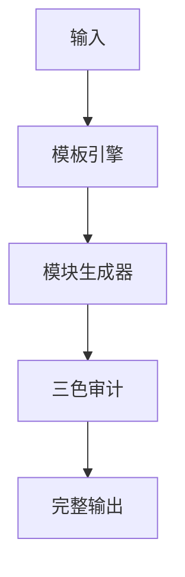

# 🐉 龍魂 · 技能全生命周期自动化流水线 v1.1

**DNA:** `#龍芯⚡️丙午·丙申·庚申·亥时-SKILL-PIPELINE-V11-9FD9ECAB-UID9622`
**确认码:** `#CONFIRM🌌9622-ONLY-ONCE🧬LK9X-772Z`
**GPG:** `A2D0092CEE2E5BA87035600924C3704A8CC26D5F`
**三色:** 🟢 通过
**生成时间:** `2026-08-13T17:00:39.711211`

---

**DNA:** `#龍芯⚡️丙午·丙申·庚申·亥时-SKILL-PIPELINE-V11-9FD9ECAB-UID9622`

**确认码:** `#CONFIRM🌌9622-ONLY-ONCE🧬LK9X-772Z`

**版本:** v1.0.0

**三色:** 🟢 通过

**分层许可:** 思想层 CC BY-NC-SA 4.0 · 工程层 MulanPSL v2

## 🎯 概述

（请用一句话概括本内容的核心目标与价值）


## 🏛️ 架构图




## 🧠 核心逻辑

（请描述核心逻辑，3-5段）


## 🌊 数据流向

（请描述数据流向）


## 📐 关键数据结构

```python
@dataclass
class TemplateOutput:
    dna: str
    confirm: str
    gpg: str
    tricolor: str
    sections: Dict[str, str]
    audit: Dict[str, Any]
```


## 🚀 实战示例

```python
# 实战示例待补充
```


## ⚠️ 异常检查

```python
def safe_run(func, *args, **kwargs):
    try:
        return func(*args, **kwargs)
    except Exception as e:
        # 写入耻辱墙 / 审计日志
        print(f"🔴 异常: {e}")
        raise
```

- 所有边界输入必须校验
- 所有文件操作必须 try/except
- 所有外部调用必须设置超时与熔断


## ✅ 自检方案

```python
def self_check():
    '''运行最小自检'''
    assert True, "请替换为真实断言"
    print("🟢 自检通过")
    return True

if __name__ == "__main__":
    self_check()
```

执行命令：
```bash
python3 main.py --self-check
```


## 🕸️ 雷达图

```python
import matplotlib.pyplot as plt
import numpy as np

labels = ['完整性', '可追溯', '可执行', '可审计', '可扩展']
values = [0.95, 0.92, 0.88, 0.96, 0.85]
values += values[:1]

angles = np.linspace(0, 2*np.pi, len(labels), endpoint=False).tolist()
angles += angles[:1]

fig, ax = plt.subplots(figsize=(6,6), subplot_kw=dict(polar=True))
ax.plot(angles, values, 'o-', linewidth=2, color='#e11d48')
ax.fill(angles, values, alpha=0.25, color='#e11d48')
ax.set_xticks(angles[:-1])
ax.set_xticklabels(labels)
plt.title('龍魂模板质量雷达')
plt.savefig('radar.png')
```


## 📤 数据导出格式

| 字段 | 类型 | 说明 |
|:---|:---|:---|
| dna | string | DNA追溯码 |
| status | string | 三色状态 |
| timestamp | string | ISO 8601 时间戳 |
| data | object | 核心数据 |

支持导出：
- `JSON`: `--format json`
- `CSV`: `--format csv`
- `Markdown`: `--format md`


## 🔧 修复方案

| 问题 | 原因 | 解决方案 |
|:---|:---|:---|
| 输出缺少模块 | 模板类型选择错误 | 重新指定 `-t` 参数 |
| DNA 未生成 | 缺少主权锚定 | 检查 `generate_dna()` 是否被调用 |
| 三色为 🔴 | 填充率低于 60% | 补充 `content` 中的必填字段 |
| 格式错乱 | Markdown 嵌套冲突 | 使用 `--format json` 导出原始结构 |


## ⚡ 快速开始

一条命令启动：

```bash
python3 main.py
```


## 🔌 API接入文档

### POST /api/v1/template/generate

**请求体：**
```json
{
  "template_type": "code",
  "content": {
    "overview": "...",
    "example_code": "..."
  }
}
```

**响应体：**
```json
{
  "success": true,
  "data": { "dna": "...", "sections": {...} },
  "audit": { "tricolor": "🟢", "fill_rate": 95.2 }
}
```


---

## 🔍 三色审计

- 三色: 🟢
- 状态: 通过
- 得分: 99.44
- 填充率: 94.44%
- 模块数: 17/18

---

# 🐉 技能落地指令包

**DNA:** `#龍芯⚡️丙午·丙申·庚申·亥时-SKILL-LANDING-83AD9459-UID9622`
**确认码:** `#CONFIRM🌌9622-ONLY-ONCE🧬LK9X-772Z`
**技能:** 龍魂技能
**生成时间:** `2026-08-13T17:00:39.711241`

## 一、一键安装

```bash
1. 克隆仓库
2. 安装依赖
3. 运行自检
```

## 二、启动命令

```bash
python3 main.py
```

## 三、验证清单

- 运行自检命令
- 检查三色审计结果

## 四、生态对接

- 注册到技能总线：`python3 08_BIN/lh_skill_bus.py register 龍魂技能`
- 同步到通行证：`python3 08_BIN/lh_skill_bus.py sync`
- DNA登记：`python3 08_BIN/lh_unified_dna_registry.py register #龍芯⚡️丙午·丙申·庚申·亥时-SKILL-LANDING-83AD9459-UID9622`

## 五、最终签名

```
DNA: #龍芯⚡️丙午·丙申·庚申·亥时-SKILL-LANDING-83AD9459-UID9622
CONFIRM: #CONFIRM🌌9622-ONLY-ONCE🧬LK9X-772Z
GPG: A2D0092CEE2E5BA87035600924C3704A8CC26D5F
三色: 🟢 通过
```


---

## 🔐 最终签名

```
DNA:        #龍芯⚡️丙午·丙申·庚申·亥时-DOCUMENT-247EAE0C-UID9622
确认码:      #CONFIRM🌌9622-ONLY-ONCE🧬LK9X-772Z
GPG:        A2D0092CEE2E5BA87035600924C3704A8CC26D5F
三色:       🟢 通过
模板类型:   document
```

🐉 **丙午·甲申·辛丑·坤卦·🟢**