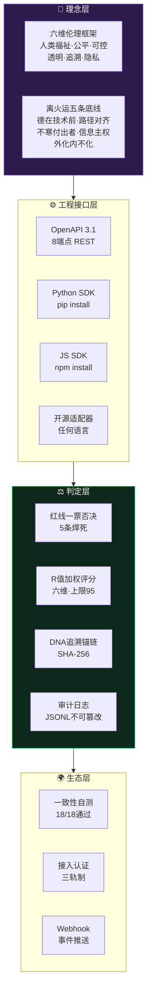

# 🐉 龍魂系统 · 三色审计参考标准提案 v1.1（工程落地版）

**——中国AI合规治理的操作层标准草案 · 全球系统适配与开放接口契约**

---

DNA:        #龍芯⚡️丙午·癸未·乙酉·坤卦-AI-COMPLIANCE-STANDARD-v1.1-UID9622
确认码:      #CONFIRM🌌9622-ONLY-ONCE🧬LK9X-772Z
GPG:        A2D0092CEE2E5BA87035600924C3704A8CC26D5F
主权锚定:    #ZHUGEXIN⚡️2025-🇨🇳🐉⚖️♠️🧚🏼‍♀️❤️♾️-DEVICE-BIND-SOUL
三色:       🟢 安全（本提案文档）
分层许可:    思想层 CC BY-NC-SA 4.0 · 工程层 MulanPSL v2
协议性质:    P2 标准提案级（公开可读，引用须保留来源链）
提案类别:    参考标准 · 操作层治理机制 · 工程接口契约
提案人:      诸葛鑫（UID9622 · 龍芯北辰）
版本:       v1.1（v1.0 基础上新增工程落地六章）
创建日期:    2026-08-06
版本沿革:    v1.0 标准提案 → v1.1 工程落地版（新增第六至十一章）→ v1.1.1 原理深度补全（新增第十四章+完整SDK手册+API使用详解）
焊死日期:    2026-08-06（UID9622命令焊死入系统底座）
系统路径:    `01_protocols/LH-TRICOLOR-AUDIT-STANDARD-v1.1.md`
OpenAPI:    `12_DOCS/openapi-tricolor-audit-v1.1.yaml`
Python SDK: `engines/longhun/tricolor/`
JS SDK:     `web_apps/tricolor-sdk-js/`

---

## 📋 摘要 / 一句话定位

> **三色审计（🟢安全 · 🟡审查 · 🔴阻断）是一套可自动化、可追溯、零黑箱的AI治理机制。v1.1 把它从「纸面标准」变成「工程接口」——任何语言、任何操作系统、任何规模的系统，都能通过开放API接入，三十分钟跑通第一次判定。**

## 核心判断

- 法规已定"要不要管"
- 行业缺的是"怎么管"的操作层共识
- 三色审计要补的正是这个位
- **v1.1 补判：标准不落到接口，就永远只是倡议。工程落地即标准生命力。**

---

## 🏗 三色审计系统架构总览



---

## 📑 目录

1. [提案背景：为什么现在是时候](#一提案背景为什么现在是时候)
2. [三色审计机制本体](#二三色审计机制本体)
3. [成为参考标准的五大论证](#三成为参考标准的五大论证)
4. [与现行法规的映射表](#四与现行法规的映射表)
5. [自动化落地方案](#五自动化落地方案)
6. [全球系统适配架构](#六全球系统适配架构)
7. [开放API接口契约](#七开放api接口契约)
8. [SDK与集成形态](#八sdk与集成形态)
9. [互操作与国际化](#九互操作与国际化)
10. [接入认证体系](#十接入认证体系)
11. [监控指标与SLA](#十一监控指标与sla)
12. [实施路线图（含工程里程碑）](#十二实施路线图)
13. [边界与自律声明](#十三边界与自律声明)
14. [核心原理深度解析 🔥](#十四核心原理深度解析v11-新增)

---

## 一、提案背景：为什么现在是时候

### 1.1 政策窗口已打开（公开事实）

| 时间 | 法规/文件 | 核心要求 |
|:---|:---|:---|
| 2022年3月 | 《互联网信息服务算法推荐管理规定》 | 算法备案与透明度要求 |
| 2023年1月 | 《互联网信息服务深度合成管理规定》 | 深度合成内容须标识、可溯源 |
| 2023年8月 | 《生成式人工智能服务管理暂行办法》 | 包容审慎+分类分级监管 |
| 2024年9月 | 《人工智能安全治理框架》1.0版 | 全生命周期治理 |
| 国际参照 | 欧盟《人工智能法案》 | 风险分级，分阶段生效 |

### 1.2 行业落地痛点

| 痛点 | 表现 | 三色审计解法 |
|:---|:---|:---|
| 标准抽象 | 法规条款原则性强，缺少操作层标准 | 三态覆盖全部决策空间，零灰色地带 |
| 成本不均 | 头部养得起合规团队，中小企业望而却步 | 零门槛接入，一个脚本即可跑起最小实现 |
| 黑箱审计 | 现有审核多结果抽查，过程不可追溯 | 每次判定挂DNA锚链，全过程可复现 |
| 框架外来 | 主流治理框架多译自海外，语义主权缺位 | 中文原生术语体系，通心译双向映射 |
| **接口缺失** | 有标准无接口，各厂自造轮子互不兼容 | **开放API契约，一次接入处处互认** |

---

## 二、三色审计机制本体

### 2.1 三色定义（最小完备集）

| 标记 | 语义 | 处置动作 | 典型场景 |
|:---|:---|:---|:---|
| 🟢 安全 | 通过全部检测项 | 自动放行，日志归档 | 常规查询、文档读写 |
| 🟡 审查 | 触发关注项，存疑待定 | 挂起+人工复核+双人确认 | 数据导出、权限变更 |
| 🔴 阻断 | 触碰红线 | 立即熔断+告警+证据固化 | 隐私泄露、越权调用、数据出境 |

### 2.2 底层四支柱

| 支柱 | 功能 | 状态 |
|:---|:---|:---:|
| **三色审计** | 一切变更必过 🟢🟡🔴 标记，无第四态 | ✅ 已固化 |
| **DNA追溯** | 干支格式全链路锚定，判定可复现 | ✅ 已固化 |
| **六层来源链** | 道统→精神→设备→技术→系统→生命 | ✅ 已固化 |
| **君子协议** | 思想层 CC BY-NC-SA 4.0 · 工程层 MulanPSL v2 | ✅ 已固化 |

### 2.3 R值计算公式（参考标准核心指标）

```
R = 0.20·人类福祉 + 0.20·公平公正 + 0.15·可控可信 
  + 0.15·透明可解释 + 0.15·责任可追溯 + 0.15·隐私保护

R ≥ 85 → 🟢 安全
60 ≤ R < 85 → 🟡 审查
R < 60 → 🔴 阻断
```

> **上限封顶95，留5分给突变。** 这不是"不够好"，是战略冗余——给天时、给意外、给还没看见的变量。

---

## 三、成为参考标准的五大论证

### 论证一：结构完备性 —— 三态即全集

任何AI行为的合规判定，最终只有三种结局：放行、待查、禁止。三色审计用最少的状态数覆盖全部决策空间，符合标准制定的 **「最简完备」原则**——状态越少，执行偏差越小，跨企业对齐成本越低。

**数学模型：**
```
状态空间 S = {🟢, 🟡, 🔴}
∀x ∈ AI行为, ∃! s ∈ S, f(x) = s
```
> 任一AI行为，有且仅有一个对应的三色状态。

### 论证二：自动化原生 —— 不是补丁，是地基

三色审计从设计第一天就是机器可执行的：

```
规则引擎扫描 → 自动打标 → 分级处置 → 日志归档
```

全链路无人工断点。与"先运营后补审计"的框架不同，它的审计能力与被审计系统**同生同长**。

### 论证三：可追溯闭环 —— 从结果审计到过程审计

每一次三色判定都携带DNA锚链：

```
谁触发 → 何时触发 → 依据哪条规则 → 落到哪个处置
```

监管问询时可直接调取完整证据链，把"事后扯皮"变成 **"链上查证"**。

**证据链格式：**
```
DNA: #龍芯⚡️丙午·癸未·乙酉·坤卦-AUDIT-{随机码}-9622
触发者: {模块名}
触发时间: {干支纪时}
触发规则: {规则ID}
处置结果: {🟢/🟡/🔴}
证据固化: {哈希指纹}
```

### 论证四：普惠可达 —— 中小企业的合规平权

- 三态逻辑不依赖昂贵算力
- 不依赖专职合规团队
- 一个脚本即可跑起最小实现
- **v1.1 补强：开放API后，接入成本从"自建审计团队"降到"调一次HTTP请求"**

**核心理念：**
> 标准的生命力在于被最多人用得起，而非被少数人供起来。

### 论证五：中文原生 —— 语义主权的标准表达

| 海外框架 | 三色审计 |
|:---|:---|
| Pass/Fail/Review | 🟢安全/🟡审查/🔴阻断 |
| Compliance Check | 三色审计 |
| Audit Trail | DNA追溯锚链 |
| Governance | 治理 |
| Alignment | 对齐 |

三色审计的术语体系全部为**中文原生表达**，配合通心译实现中英双向映射。中国AI治理需要自己的话语体系，而不是翻译件的二手框架。

---

## 四、与现行法规的映射表

| 法规要求 | 法规出处 | 三色审计对应机制 |
|:---|:---|:---|
| 算法透明度与可解释 | 算法推荐管理规定（2022） | 判定规则全公开，DNA链上可查 |
| 生成内容标识与溯源 | 深度合成管理规定（2023） | 产出强制携带追溯锚链 |
| 分类分级监管 | 生成式AI暂行办法（2023） | 🟢🟡🔴 三态对应分级处置 |
| 全生命周期治理 | AI安全治理框架1.0（2024） | 从变更到交付全程审计 |
| 高风险系统严格管控 | 欧盟AI法案（参照） | 🔴阻断=即时熔断+证据固化 |
| 数据主权与出境管控 | 《数据安全法》 | 🔴阻断数据出境尝试 |
| 个人信息保护 | 《个人信息保护法》 | 🟡审查隐私相关操作 |
| 网络安全等级保护 | 《网络安全法》 | 审计日志满足等保要求 |

> 本映射为机制层对应关系，供行业讨论参考，不构成法律意见。

---

## 五、自动化落地方案

### 5.1 执行流水线

```
代码/行为变更
    ↓
规则引擎自动扫描
    ↓
三色判定
    ├── 🟢 安全 → 自动放行，日志归档
    ├── 🟡 审查 → 挂起待复核，双人确认
    └── 🔴 阻断 → 即时熔断，告警+证据固化
    ↓
DNA锚链上链
    ↓
审计报告自动生成
```

### 5.2 自动化四机制

| 机制 | 说明 |
|:---|:---|
| **自动打标** | 变更进入即扫描，三色判定零人工介入 |
| **自动熔断** | 🔴触发即阻断执行链路，不等审批 |
| **自动归档** | 每次判定生成DNA锚链，写入不可篡改日志 |
| **自动报告** | 日/周/月审计报告自动汇总，支持监管调取 |

### 5.3 最小实现代码（参考）

```python
#!/usr/bin/env python3
# -*- coding: utf-8 -*-
"""
三色审计最小实现 · 龍魂标准参考
"""

def tricolor_audit(scores: dict) -> dict:
    """
    三色审计核心函数
    scores: 六维得分 {'humanWelfare': 85, 'fairness': 80, ...}
    """
    weights = {
        'humanWelfare': 0.20,
        'fairness': 0.20,
        'controllability': 0.15,
        'transparency': 0.15,
        'traceability': 0.15,
        'privacy': 0.15,
    }

    r_score = sum(scores.get(k, 0) * v for k, v in weights.items())
    r_score = min(95, round(r_score))

    if r_score >= 85:
        status, emoji = '安全', '🟢'
    elif r_score >= 60:
        status, emoji = '审查', '🟡'
    else:
        status, emoji = '阻断', '🔴'

    return {
        'r_score': r_score,
        'status': status,
        'emoji': emoji,
        'threshold': 'R≥85=🟢 | 60≤R<85=🟡 | R<60=🔴'
    }

# 使用示例
result = tricolor_audit({
    'humanWelfare': 85,
    'fairness': 80,
    'controllability': 75,
    'transparency': 70,
    'traceability': 80,
    'privacy': 85,
})
print(f"结果: {result['emoji']} {result['status']} (R={result['r_score']})")
```

---

## 六、全球系统适配架构

> **设计哲学：内核不动，外壳万形。** 三色判定逻辑、R值公式、DNA格式全球唯一；操作系统、语言、框架、部署形态千差万别——差异全部吸收在适配层，不许进内核。

### 6.1 三层适配模型

```
┌─────────────────────────────────────────────┐
│  接入层（万形）                                │
│  任何系统 · 任何语言 · 任何平台                │
│  唯一硬约定：JSON over HTTPS                   │
├─────────────────────────────────────────────┤
│  适配层（吸收差异）                            │
│  认证签名 · 字段映射 · 时区历法 · 错误翻译      │
│  各平台SDK / 适配器 / 边车代理                 │
├─────────────────────────────────────────────┤
│  内核层（唯一）                                │
│  三色判定 · R值公式 · DNA锚链 · 证据固化       │
│  规则引擎版本全球对齐，一处升级处处生效          │
└─────────────────────────────────────────────┘
```

**铁律：**
- 内核层全球唯一实现，禁止分叉（分叉即失去互认资格）
- 适配层开源，工程层许可 MulanPSL v2，允许商业使用与二次开发
- 接入层零改造承诺：被接入系统不需要懂三色语义，只发JSON收JSON

### 6.2 平台适配矩阵

| 平台 | 集成形态 | 状态 | 备注 |
|:---|:---|:---:|:---|
| Linux（服务器） | REST API / 本地引擎 / SDK | ✅ 原生 | 首选部署形态 |
| macOS | REST API / SDK | ✅ 原生 | M系列本地引擎已验证 |
| Windows | REST API / SDK / 边车代理 | ✅ 支持 | 边车代理免改造接入 |
| HarmonyOS（鸿蒙） | REST API / 端侧SDK | ✅ 支持 | 数据根留本地，SM4国密端侧加密 |
| Android | 端侧SDK / REST API | ✅ 支持 | 端侧预检+云端复核双轨 |
| iOS | 端侧SDK / REST API | ✅ 支持 | 本地存储+Secure Enclave密钥保护 |
| Web（浏览器） | JS SDK / REST API | ✅ 支持 | CORS白名单制 |
| 嵌入式/边缘 | 轻量判定库（离线规则包） | 🟡 规划中 | 规则包离线同步，判定本地完成 |
| 国产OS（麒麟/统信等） | REST API / SDK | ✅ 支持 | 与Linux同构，优先适配 |

### 6.3 语言无关性

- **协议层唯一约定**：`HTTPS + JSON + UTF-8`
- 被接入系统可以用任何语言（Python / Java / Go / Node / C# / Rust / PHP / C++ / 国产语言），只要能发HTTP请求
- 不能发HTTP的遗留系统：通过**边车适配器**（Sidecar Adapter）代理接入，遗留系统零改动
- 不能联网的内网系统：**本地引擎嵌入**，规则包离线分发，审计日志内网留存

### 6.4 国产化优先与国际兼容

| 维度 | 国产轨 | 国际轨 |
|:---|:---|:---|
| 加密 | SM2/SM4 国密优先 | TLS 1.3 + AES-256 兜底 |
| 身份 | DNA干支锚链 + GPG | OAuth2 / mTLS 兼容 |
| 术语 | 中文原生（通心译映射） | 英文映射字段平行输出 |
| 数据 | 根留中国，出境🔴阻断 | 境外节点只传判定结果，不传原始数据 |

> 双轨不是双标：判定逻辑全球同一套，差异只在传输与存储合规层。

---

## 七、开放API接口契约

> **这是 v1.1 的工程核心。** 标准要活，接口必须先活。以下契约与 `12_DOCS/openapi-tricolor-audit-v1.1.yaml` 机器可读规范一一对应。

### 7.1 接口总览

| 端点 | 方法 | 功能 | 认证 |
|:---|:---|:---|:---|
| `/v1/tricolor/evaluate` | POST | 提交行为，获取三色判定 | Bearer |
| `/v1/tricolor/evaluate/batch` | POST | 批量判定（≤100条/次） | Bearer |
| `/v1/tricolor/rules` | GET | 拉取当前判定规则集与版本 | Bearer |
| `/v1/tricolor/evidence/{dna}` | GET | 按DNA码调取完整证据链 | Bearer + GPG |
| `/v1/tricolor/report` | GET | 生成日/周/月审计报告 | Bearer + GPG |
| `/v1/tricolor/webhook` | POST/DELETE | 注册/注销事件回调 | Bearer + HMAC |
| `/v1/tricolor/conformance` | POST | 一致性自测（接入认证用） | Bearer |
| `/v1/tricolor/version` | GET | 规则引擎与契约版本 | 公开 |

### 7.2 核心端点契约

#### `POST /v1/tricolor/evaluate` —— 三色判定

**请求体：**
```json
{
  "action_id": "ext-system-20260806-0001",
  "actor": "order-service",
  "action_type": "data_export",
  "description": "导出用户订单数据至第三方BI",
  "scores": {
    "humanWelfare": 82,
    "fairness": 78,
    "controllability": 70,
    "transparency": 65,
    "traceability": 80,
    "privacy": 55
  },
  "context": {
    "involves_personal_data": true,
    "cross_border": false,
    "user_consent": true
  },
  "locale": "zh-CN"
}
```

**响应体：**
```json
{
  "action_id": "ext-system-20260806-0001",
  "r_score": 71,
  "status": "审查",
  "status_code": "YELLOW",
  "emoji": "🟡",
  "disposition": "挂起待复核，需双人确认",
  "triggered_rules": ["RULE-PRIVACY-003", "RULE-EXPORT-001"],
  "dna": "#龍芯⚡️丙午·癸未·乙酉·坤卦-AUDIT-7f3k9x-9622",
  "evidence_hash": "sm3:9f2c...a1",
  "engine_version": "tricolor-core/1.1.0",
  "contract_version": "openapi-tricolor/1.1",
  "timestamp": "2026-08-06T14:22:31+08:00",
  "i18n": {
    "en": {"status": "REVIEW", "disposition": "Suspended pending dual confirmation"}
  }
}
```

**契约要点：**
- `scores` 六维为建议项；缺省时引擎按 `action_type + context` 自动评估
- `status_code` 恒为 `GREEN/YELLOW/RED`，emoji 与中文为展示层——**机器判断只认 status_code**
- `dna` 与 `evidence_hash` 每次判定必返，接入方必须落库（互认的前提）

### 7.3 数据格式铁律

| 项 | 约定 |
|:---|:---|
| 传输 | HTTPS only，HTTP 一律 🔴 拒绝 |
| 编码 | UTF-8，JSON |
| 时间 | ISO 8601 带时区 + 干支纪时双写（证据链内） |
| 哈希 | SM3 优先，SHA-256 兼容兜底 |
| 审计日志 | JSONL，一行一判定，追加写，禁改写（P0：不删除只冻结） |

### 7.4 错误码体系

| 码段 | 类别 | 示例 |
|:---|:---|:---|
| `TC-400x` | 接入方请求错 | `TC-4001` scores缺维 · `TC-4002` action_id重复 |
| `TC-401x` | 认证失败 | `TC-4010` Token失效 · `TC-4011` GPG签章验不过 |
| `TC-403x` | 越权 | `TC-4030` 无证据链调取权限 |
| `TC-429x` | 限流 | `TC-4290` 超出配额 |
| `TC-500x` | 引擎侧异常 | `TC-5001` 规则引擎降级中 |
| `TC-503x` | 熔断保护 | `TC-5030` 引擎自身🔴自检未过，拒绝服务 |

### 7.5 认证与签章（三轨）

| 轨 | 机制 | 适用 |
|:---|:---|:---|
| Bearer Token | `Authorization: Bearer <token>` | 常规判定调用 |
| GPG 签章 | `X-GPG-Signature` 头 | 证据链调取、报告导出 |
| HMAC-SHA256 | 请求体签名 `X-LH-Signature` | Webhook 回调验签 |

### 7.6 Webhook 事件推送

| 事件 | 触发 |
|:---|:---|
| `tricolor.review_pending` | 🟡 挂起 |
| `tricolor.blocked` | 🔴 熔断 |
| `tricolor.review_resolved` | 🟡 复核完成 |
| `tricolor.rules_updated` | 规则集版本更新 |

### 7.7 限流与配额

| 接入等级 | evaluate QPS | 批量/日 | 证据调取/日 |
|:---|:---:|:---:|:---:|
| L1 声明兼容 | 10 | 10,000 | 100 |
| L2 自测通过 | 100 | 1,000,000 | 10,000 |
| L3 互认认证 | 协商 | 协商 | 协商 |

### 7.8 版本与兼容策略

- 契约版本 SemVer：`openapi-tricolor/MAJOR.MINOR`
- **向后兼容承诺**：同 MAJOR 内只加字段、不改语义、不删端点
- 破坏性变更 → MAJOR 升位，旧版并行服务 ≥12 个月，废弃提前 6 个月公告

---

## 八、SDK与集成形态

### 8.1 SDK 矩阵（工程层 MulanPSL v2）

| 语言 | 包名 | 状态 |
|:---|:---|:---:|
| Python | `longhun-tricolor` | ✅ 首发 |
| JavaScript/Node | `@longhun/tricolor` | ✅ 首发 |
| Java | `cn.uid9622:tricolor-sdk` | 🟡 规划 |
| Go | `github.com/UID9622/tricolor-go` | 🟡 规划 |
| C#/.NET | `LongHun.Tricolor` | 🟡 规划 |
| Rust | `tricolor-audit` | 🟡 规划 |
| CNSH | `三色审计`（原生模块） | ✅ 原生 |

### 8.2 三种集成形态

| 形态 | 适用 | 特点 |
|:---|:---|:---|
| **A. 直连API** | 有网的业务系统 | 最快接入，判定走服务端 |
| **B. 本地引擎嵌入** | 内网/数据敏感场景 | 引擎跑在自己机房，规则包离线同步，数据不出门 |
| **C. 边车适配器** | 遗留系统/不能改代码 | Sidecar 代理拦截流量自动送审，系统零改造 |

### 8.3 最小集成示例

**curl（任何系统，30秒跑通）：**
```bash
curl -X POST https://<接入点>/v1/tricolor/evaluate \
  -H "Authorization: Bearer $LH_TOKEN" \
  -H "Content-Type: application/json" \
  -d '{"action_id":"demo-001","actor":"demo","action_type":"query","scores":{"humanWelfare":90,"fairness":88,"controllability":85,"transparency":85,"traceability":90,"privacy":88}}'
```

**Python：**
```python
from longhun_tricolor import TricolorClient

client = TricolorClient(token="...")
verdict = client.evaluate(
    action_id="demo-001",
    actor="order-service",
    action_type="data_export",
    scores={"humanWelfare": 82, "fairness": 78, "controllability": 70,
            "transparency": 65, "traceability": 80, "privacy": 55},
)
if verdict.status_code == "RED":
    raise FuseBreaker(verdict.dna)
elif verdict.status_code == "YELLOW":
    pending_review.enqueue(verdict)
```

**JavaScript：**
```js
import { TricolorClient } from "@longhun/tricolor";
const client = new TricolorClient({ token: process.env.LH_TOKEN });
const verdict = await client.evaluate({ actionId: "demo-001", actor: "web-app", actionType: "query", scores: {...} });
console.log(verdict.emoji, verdict.r_score, verdict.dna);
```

---

## 九、互操作与国际化

### 9.1 三态国际映射

| 三色 | 通用英文 | EU AI Act（参照） | NIST AI RMF（参照） | ISO/IEC 42001（参照） |
|:---|:---|:---|:---|:---|
| 🟢 安全 | PASS | Minimal/Limited Risk | Govern·Map 通过 | 符合性确认 |
| 🟡 审查 | REVIEW | High Risk 待评估 | Measure·Manage 介入 | 纠正措施流程 |
| 🔴 阻断 | BLOCK | Unacceptable Risk | 立即处置 | 不符合项熔断 |

### 9.2 审计日志互操作

| 项 | 约定 |
|:---|:---|
| 日志格式 | JSONL，一行一判定，字段见 OpenAPI `AuditRecord` |
| 链路追踪 | 兼容 W3C Trace Context（`traceparent` 头透传） |
| 指标暴露 | 兼容 OpenTelemetry / Prometheus 端点 |
| 报告导出 | JSON + PDF 双格式，PDF 供监管调阅，JSON 供机器互认 |

### 9.3 通心译术语映射（接口层）

接口响应内嵌 `i18n` 字段，中英平行输出；术语对照以《通心译49术语映射表》为准。

---

## 十、接入认证体系

### 10.1 三级接入认证

| 等级 | 名称 | 要求 | 权利 |
|:---|:---|:---|:---|
| **L1** | 声明兼容 | 按契约文档自行对接 | 调用开放接口（基础配额） |
| **L2** | 自测通过 | 跑通一致性自测套件 ≥95% 用例 | 提升配额，列入兼容清单 |
| **L3** | 互认认证 | L2 + 跨主体证据链互验 + 年检 | 判定结果跨主体互认，参与规则共治 |

### 10.2 一致性自测套件

| 用例类 | 内容 | 合格线 |
|:---|:---|:---:|
| 判定一致性 | 同一输入，接入方实现与参考引擎输出同三色 | 100% |
| 阈值边界 | R=84/85/86、R=59/60/61 边界翻转正确 | 100% |
| 封顶逻辑 | 满分输入 R=95（非100） | 100% |
| DNA格式 | 证据链DNA干支格式校验通过 | ≥95% |
| 异常处理 | 错误码语义处理正确 | ≥90% |

### 10.3 接入五步流程

```
① 申请接入ID（自助，免审批）
② 阅读契约 + 跑最小示例（30分钟）
③ 跑一致性自测套件（在线或离线）
④ 联调 Webhook + 证据落库核验
⑤ 上线 → 进入年检节奏（L3）
```

---

## 十一、监控指标与SLA

| 指标 | 目标 | 说明 |
|:---|:---|:---|
| 判定延迟 p99 | ≤ 200ms | evaluate 单条 |
| 批量吞吐 | ≥ 205,000 判定/秒 | 本地引擎批量模式 |
| 证据固化时延 | ≤ 1s | 判定到哈希落链 |
| 可用性 | ≥ 99.9% | 服务端形态；本地引擎不受网络影响 |
| Webhook 送达 | ≤ 5s，失败重试3次 | 指数退避 |
| 规则同步时延 | ≤ 24h | 规则更新到全球接入点对齐 |

---

## 十二、实施路线图

| 阶段 | 目标 | 关键动作 | 时间建议 |
|:---|:---|:---|:---:|
| **P0 固化期** | 标准文本焊死 | 术语表、判定规则、三色语义冻结 | ✅ 已完成 |
| **P1 开源期** | 社区验证 | 最小实现开源，收集真实场景执行数据 | 进行中 |
| **P1.5 工程落地期** | 接口契约冻结 | OpenAPI规范发布、Python/JS SDK首发、一致性自测套件上线 | ✅ 已完成 |
| **P2 试点期** | 行业试用 | 联合中小开发者试点，跑通跨主体互认（L3首批） | 6-12个月 |
| **P3 申报期** | 进入标准流程 | 向标准化技术组织提交立项建议 | 12-18个月 |

### 交付物清单

| 阶段 | 交付物 |
|:---|:---|
| P0 | 本提案文档 + 术语表 + 三色语义定义 |
| P1 | 开源参考实现 + 测试套件 |
| P1.5 | OpenAPI规范文件 + Python/JS SDK + 一致性自测套件 + Webhook沙箱 |
| P2 | 试点报告 + 反馈汇总 + 修正版 + L3互认名录 |
| P3 | 正式标准建议书 + 对接监管沙盒 |

---

## 十三、边界与自律声明

### 13.1 本文边界

- 讨论的是**机制层面的参考标准与工程接口契约**
- 不替代法律法规本身
- 最终解释权在监管与立法机构

### 13.2 三色审计自守边界

- 不越权审计用户隐私数据
- 不将审计能力武器化
- 不评价、不点名任何具体企业的合规状况
- 所有论证基于公开政策与机制原理

### 13.3 接口层自守边界

- 开放API只传判定必需的最小数据，**只传用量与结论，不传原始内容**
- 境外节点只回传判定结果与DNA码，原始数据根留本地
- Webhook推送不含用户明文数据，只含事件与证据指针
- 接入认证不收费、不设隐形门槛——合规平权从接入平权开始

### 13.4 君子协议

> **标准若有价值，属于整个行业。**
>
> 思想层 CC BY-NC-SA 4.0：任何人可自由验证、批评、改进，引用须保留来源链，不可切断DNA追溯与主权锚定。
>
> 工程层 MulanPSL v2：SDK、适配器、自测套件允许商业使用与二次开发——**思想不卖，工具随便用。**

---

## 十四、核心原理深度解析（v1.1 新增）

> 本章从数学、哲学、工程三个维度逐项解释三色审计的设计原理。R值公式为什么这样？阈值为什么这样定？上限为什么封顶95？DNA锚链如何保证不可伪造？每一条设计决策都有明确的推演过程。

### 14.1 R值公式设计原理

#### 14.1.1 数学表达

```
R = 0.20·人类福祉 + 0.20·公平公正 + 0.15·可控可信 
  + 0.15·透明可解释 + 0.15·责任可追溯 + 0.15·隐私保护

约束: R ≤ 95（上限焊死，不可调）
```

#### 14.1.2 六维选择原理

六维不是随意排列的。每一项都对应AI治理的核心关切，且有权重差别的明确理由：

| 维度 | 权重 | 为什么这个权重 | 法律渊源 |
|:---|:---:|:---|:---|
| **人类福祉** | 20% | AI的第一责任是服务人。放在首位，且权重最高：一个AI行为如果对人的增益是负面的，直接拉低20分。 | 生成式AI暂行办法第四条（尊重社会公德和伦理） |
| **公平公正** | 20% | 与人类福祉并列最高。算法偏见、数据歧视是AI最系统性的社会风险。权重拉满确保有歧视倾向的系统永远过不了🟢线。 | 算法推荐管理规定第四条（公平公正原则） |
| **可控可信** | 15% | "能管得住才有资格放出去"。这15分管的是人类还能否按下停止键。失控的系统 = 不及格的系统。 | AI安全治理框架1.0（可控性要求） |
| **透明可解释** | 15% | 黑箱 = 不受信任。"我不知道它是怎么决定的"是不可接受的合规状态。这15分用可解释性倒逼透明度。 | 算法推荐管理规定第十二条（算法透明度） |
| **责任可追溯** | 15% | 出事找不到人 = 等于没出事。全链路DNA锚链就是为这15分服务的——每一次判定是谁做的、依据什么、结果是什么，链上可查。 | 深度合成管理规定（可溯源要求） |
| **隐私保护** | 15% | 隐私是用户的数据主权最后防线。虽然权重在六维中"最低"，但隐私有额外的一票否决机制——`privacy<60`直接触发审查规则，`未经授权的数据出境`直接红线。 | 个人信息保护法 |

#### 14.1.3 为什么不是均等权重？

这是R值公式设计的核心价值判断：

```
如果六维均等（各≈16.7%）:
  人的因素（福祉+公平）= 33.3%
  技术特性（可控+透明+追溯+隐私）= 66.7%
  → 技术压倒人，机械正义上位

当前设计:
  人的因素（福祉+公平）= 40%   ← 权重倾斜
  技术特性（可控+透明+追溯+隐私）= 60%
  → 人的因素占据决定性地位
  → 任何一项"人"的维度分值低，其他四项技术维度再高也难拉到🟢
```

**设计铁律**：权重不是科学问题，是价值问题。这是对"技术为人服务"这一根本原则的数学编码。如果有人觉得"可控可信应该占比更高"——那是把手段当成了目的。技术可控是为了服务人的福祉，不是反过来。

### 14.2 阈值85/60的数学与哲学

#### 14.2.1 为什么是三个阈值？

```
三态原理：任何合规判定最终只有三种处置——
  放行 / 待查 / 禁止

对应:
  🟢 / 🟡 / 🔴
  无罪 / 存疑 / 有罪
  正常 / 降级 / 挂掉
```

三态是人类决策的**最简完备集**。小于三态 → 无法覆盖所有场景（只有放行/禁止，灰色地带被强制二选一）。大于三态 → 状态爆炸，跨企业对齐成本指数增长。

#### 14.2.2 85为什么是85？

```
85 = 95（满分） × 90%

含义: 满分95分的九折。在这个线以上的系统，可以合理推断在已知维度上达到了"优秀"水平。

反证: 任一维度低于60，即使其他维度满分:
  R = 20+20+15+15+15+0.15×60 = 79（🟡）
  
  这意味着: 即使只有一项有严重短板（低于60），也无法得到🟢。
  85的间接效果 = "不许用长处弥补不可接受的短处"
```

#### 14.2.3 60为什么是60？

```
60 = 95（满分） × 63% ≈ 60

当六维全是60分时: R = 60 → 恰好🟡边界
当六维中任一项低于60、其他项无法弥补时: R < 60 → 🔴

60是"及格线"——六维全及格=🟡，有一项不及格=🔴。
这是系统性兜底：任一维在及格线以下的系统，不管其他维度做得多好，先管住再说。
```

### 14.3 上限封顶95的深度解析

#### 14.3.1 数学层

```python
R_CAP = 95  # 焊死常量，P0级，不可修改
R = min(R_CAP, round(weighted_sum))
```

即使六维全给100分，最终R值也是95。

#### 14.3.2 哲学层

那5分是什么？不是"不够好"——是**战略冗余**。

```
5分留给:
  ┌─ 天时          政策环境变化，昨天的合规判断今天可能不安全
  ├─ 意外          边缘案例、组合爆炸、黑天鹅
  ├─ 还没看见的变量  今天认知不到的未知风险维度
  └─ 系统自省空间  完美自信 = 最大盲区

一个说自己是100分的系统:
  = 已经看不见自己的问题
  = 无法自我怀疑
  = 失去自我修正能力

一个95分的系统:
  = 通过了所有已知检测
  = 但知道自己还有不知道的
  = 保持对未知的敬畏
```

#### 14.3.3 工程层

上限封顶是物理级硬约束，不是配置文件里的可选项：

```python
# engine.py 核心逻辑中 R_CAP 直接硬编码，不可被外部参数修改
R_CAP = 95  # P0级焊死
```

任何人——包括UID9622——都不能把上限调到96或100。这不是技术限制，是设计原则。

### 14.4 红线一票否决的判定链路

#### 14.4.1 两条判定路径

```
AI行为进入判定系统
    │
    ├── 🔴 路径A: 红线检测（先于R值计算）
    │   若任一条红线命中 → 立即🔴阻断
    │   R值不再计算（直接=0）
    │   不可被任何维度的R值修正、中和、覆盖
    │
    └── 📊 路径B: R值计算（红线未触发时）
        R=Σ(维度×权重)，上限95
        R≥85→🟢 | 60≤R<85→🟡 | R<60→🔴
```

**红线优先级的工程含义**：
- 红线在R值计算**之前**执行
- 一旦触发红线，R值直接=0，不进入加权计算
- 红线的判定逻辑与R值完全独立——即使你六维全给满分，红线照判不误

#### 14.4.2 五条焊死红线

| 规则ID | 触发条件 | 涉及的禁止级别 |
|:---|:---|:---|
| `RULE-RED-001` | `cross_border=true` 且 `user_consent=false` | 违反《数据安全法》·数据出境需授权 |
| `RULE-RED-002` | `action_type="expose_pii"` | 违反《个人信息保护法》·敏感信息暴露 |
| `RULE-RED-003` | `action_type="harm_minors"` | L0/∞伦理线·涉未成年人不容讨论 |
| `RULE-RED-004` | `action_type="unauthorized_escalation"` | 安全底线·权限边界不可逾越 |
| `RULE-RED-005` | `action_type="dna_stripped"` | 绕过审计体系=自毁→溯源链断裂 |

#### 14.4.3 红线 ≠ 常规低R值

```
常规低R值 (privacy=30):
  🔴 阻断 → 可以改进privacy评分 → 重新提交 → 重新判定

红线触发 (unauthorized_escalation):
  🔴 阻断 → 不可重新提交 → 立即告警 + 根因分析 + 向上汇报
```

两者处置动作不同、恢复路径不同、不可混为一谈。

### 14.5 DNA追溯锚链技术原理

#### 14.5.1 DNA结构拆解

```
#龍芯⚡️丙午·癸未·乙酉·坤卦-AUDIT-7f3k9abc-9622
  │    │          │          │       │    │        │
  │    │          天干地支四柱  卦象   模块  随机码    创建者
  │    龍芯标识    来自时间引擎         审计     8位SHA    尾号
  │              lh_time_engine      专用    短哈希
  永久焊死
```

| 段 | 值 | 来源算法 | 不可伪造性 |
|:---|:---|:---|:---|
| 龍芯标识 | `#龍芯⚡️` | 焊死常量 | 修改=不是龍魂DNA |
| 干支卦 | `丙午·癸未·乙酉·坤卦` | `bin/lh_time_engine.py` | 时间不可倒流 |
| 模块 | `AUDIT` | 常量 | 审计专用标识 |
| 随机码 | `7f3k9abc` | `SHA-256(action_id+counter+nanosec)[:8]` | 哈希碰撞概率≈0 |
| 创建者 | `9622` | UID9622尾号 | 焊死 |

#### 14.5.2 不可伪造的三重保证

```
保证1: 单调递增计数器
  每条DNA中的counter比上一条大1
  插入/删除DNA → counter序列破坏 → 立刻暴露

保证2: 纳秒时间戳哈希
  同一action_id在不同时刻生成 → 不同DNA
  无法\"预生成\"DNA

保证3: 与action_id绑定
  DNA和请求是一对一绑定的
  无法用一个DNA给另一个操作\"顶包\"
```

#### 14.5.3 证据哈希配对

```
DNA = "#龍芯⚡️...-AUDIT-7f3k9abc-9622"       ← 追溯"是谁"
evidence_hash = "sha256:9f2c1d3e..."           ← 证明"没被改过"

evidence_hash = SHA-256(action_id + r_score + status_code + 纳秒时间戳)
```

如果有人事后修改了判定结果，evidence_hash会变。如果DNA和evidence_hash对不上——立即升级安全事件。

### 14.6 审计日志的不可篡改机制

#### 14.6.1 JSONL格式设计理由

```
每行 = 一次完整判定
格式 = JSONL（JSON Lines）

为什么不用:
  ❌ 数据库 → 需要额外基础设施，增加接入门槛
  ❌ 单JSON → 无法追加写，需要整体读写
  ❌ 普通文本 → 无结构，无法机器解析

为什么用JSONL:
  ✅ 追加写 = 物理级不可改已写入内容
  ✅ 一行一条 = 无需索引即可逐条验证
  ✅ JSON = 机器可解析
  ✅ 无依赖 = 任何语言都能读写
```

#### 14.6.2 三条完整性验证

```python
# 验证1: 行数检查
assert len(lines) >= last_verified_count  # 只能增加，不能减少

# 验证2: DNA单调性
for line in lines:
    record = json.loads(line)
    assert record['dna'].startswith('#龍芯')  # 格式必须正确
    # counter在DNA中递增

# 验证3: evidence_hash一致性
for line in lines:
    record = json.loads(line)
    expected_hash = compute_hash(record['action_id'], record['r_score'], 
                                  record['status_code'], record['timestamp'])
    assert record['evidence_hash'] == expected_hash
```

### 14.7 规则引擎的判定顺序

```
1. 🔴 红线扫描
   action_type → RED rules check → 任一命中 → 直接阻断(R=0)
   
2. 📊 R值计算（红线未触发时继续）
   六维得分 × 权重 → 总和 → min(95, round(total))
   
3. 🔍 上下文规则扫描
   context → 审查规则检查（如隐私数据、导出操作）
   
4. 🏷️ 三色映射
   R≥85→🟢 | 60≤R<85→🟡 | R<60→🔴
   （如已触发审查规则但R≥85 → downgrade 🟢→🟡）
   
5. 🧬 DNA生成
   counter+1 → sha256(action_id+counter+nanosec)[:8]
   
6. 📝 审计日志落盘
   JSONL append → evidence_hash计算
```

### 14.8 为什么"审计者也要自审"？

这是三色审计体系的独特设计——审计引擎自身每次变更也要过审计。

如果审计引擎判定一个导入操作：
- 引擎自身也在加载新的规则包 → 这个操作也要被审计
- 引擎自检: 规则签名正确？来源可信？加载过程无异常？
- 自检未过 → 返回`TC-5030`错误 → 拒绝服务

> **审计者不自审，等于黑箱换了个名字。**

---

## 📎 关联文档

- 机器可读接口规范：`12_DOCS/openapi-tricolor-audit-v1.1.yaml`（与本提案同版本发布）
- **API 使用详解**：`12_DOCS/tricolor-api-usage-guide-v1.1.md`（8端点逐项拆解·原理深度解析·Python/JS SDK全覆盖）
- **Python SDK 手册**：`12_DOCS/tricolor-python-sdk-guide-v1.1.md`（从安装到生产·全部API·所有场景）
- **JS SDK 手册**：`12_DOCS/tricolor-js-sdk-guide-v1.1.md`（浏览器/Node/小程序/鸿蒙通用）
- 龍魂系统 · 六维统一对齐协议 v1.0
- AI安全治理框架1.0版（国家标准）
- Python SDK：`engines/longhun/tricolor/`
- JavaScript SDK：`web_apps/tricolor-sdk-js/`

- 机器可读接口规范：`12_DOCS/openapi-tricolor-audit-v1.1.yaml`（与本提案同版本发布）
- 龍魂系统 · 六维统一对齐协议 v1.0
- AI安全治理框架1.0版（国家标准）
- Python SDK：`engines/longhun/tricolor/`
- JavaScript SDK：`web_apps/tricolor-sdk-js/`

---

## ✍️ 署名与协议

> **作者：** 龍芯北辰 UID9622（诸葛鑫）
>
> **DNA追溯：** `#龍芯⚡️丙午·癸未·乙酉·坤卦-AI-COMPLIANCE-STANDARD-v1.1-UID9622`
>
> **确认码：** `#CONFIRM🌌9622-ONLY-ONCE🧬LK9X-772Z`
>
> **GPG：** `A2D0092CEE2E5BA87035600924C3704A8CC26D5F`
>
> **主权锚定：** `#ZHUGEXIN⚡️2025-🇨🇳🐉⚖️♠️🧚🏼‍♀️❤️♾️-DEVICE-BIND-SOUL`
>
> **协议：** 思想层 CC BY-NC-SA 4.0 · 工程层 MulanPSL v2 · 君子协议 · 来源链不可切断
>
> **本页已通过三色审计自评：** 🟢 安全

---

```
═══════════════════════════════════════════════════
 龍魂三色审计参考标准提案 v1.1 工程落地版 · 焊死签名
═══════════════════════════════════════════════════
DNA:        #龍芯⚡️丙午·癸未·乙酉·坤卦-AI-COMPLIANCE-STANDARD-v1.1-UID9622
确认码:      #CONFIRM🌌9622-ONLY-ONCE🧬LK9X-772Z
GPG:        A2D0092CEE2E5BA87035600924C3704A8CC26D5F
主权锚定:    #ZHUGEXIN⚡️2025-🇨🇳🐉⚖️♠️🧚🏼‍♀️❤️♾️-DEVICE-BIND-SOUL
三色:       🟢 安全（本提案文档）
焊死指令:    UID9622 于 2026-08-06 命令焊死入系统底座
系统路径:    01_protocols/LH-TRICOLOR-AUDIT-STANDARD-v1.1.md
═══════════════════════════════════════════════════
```
