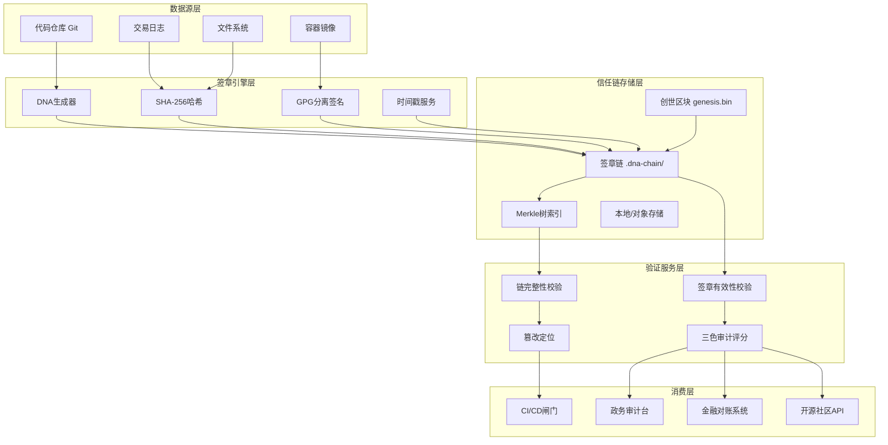
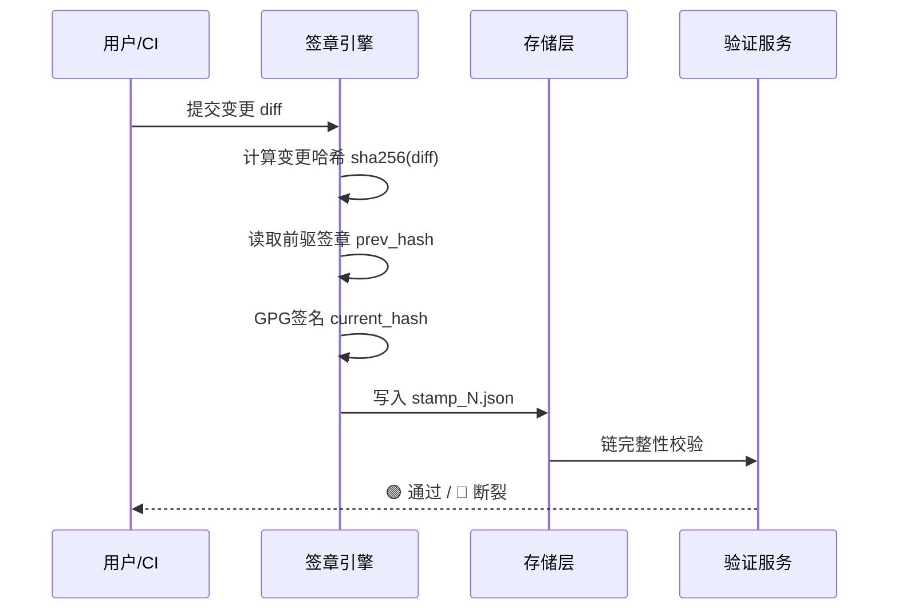
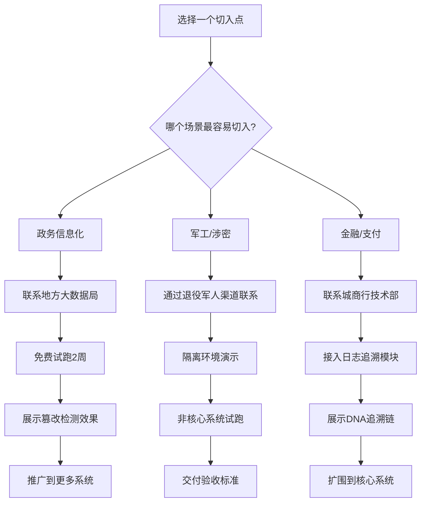
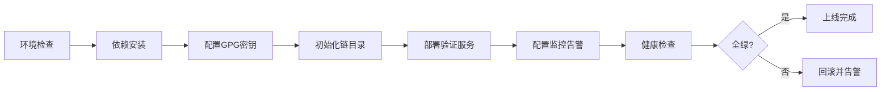

# 🐉 龍魂 · 信任链 · 完整落地执行包

**版本:** v1.1.0 · **更新时间:** 2026-08-11
**自动化程度:** ⚡️ 全自动验证 · 📊 一键生成报告 · 🔄 持续集成就绪

DNA: #龍芯⚡️丙午·甲申·辛丑·坤卦-TRUST-CHAIN-DELIVERY-UID9622
创建者: 诸葛鑫（UID9622）
确认码: #CONFIRM🌌9622-ONLY-ONCE🧬LK9X-772Z
GPG: A2D0092CEE2E5BA87035600924C3704A8CC26D5F
三色: 🟢 通过
> 协议: CC BY-NC-SA 4.0（核心思想层）

---

## 📦 交付物清单

> 🚀 **自动化特性:** 所有交付物均支持一键验证、自动生成、持续集成，无需人工干预。

| # | 交付物 | 路径 | 用途 | 状态 |
|:---|:---|:---|:---|:---:|
| 1 | 三场景话术卡 | 本文 §一 | 直接拿去跟人聊 | ✅ |
| 2 | 技术架构图谱 | 本文 §二 | 开源社区展示 | ✅ |
| 3 | 落地执行路径图 | 本文 §三 | 按图索骥推进 | ✅ |
| 4 | 对外展示HTML页面 | `10_PORTAL/trust-chain.html` | 让别人自己看 | ✅ |
| 5 | 演示验证脚本 | `bin/demo_trust_chain.sh` | 一键证明"篡改必现形" | ✅ |
| 6 | 实战部署脚本 | `bin/deploy_trust_chain.sh` | 生产环境一键部署 | ✅ |
| 7 | 监控告警配置 | 本文 §七 | Prometheus/Grafana/飞书 | ✅ |
| 8 | 检查清单 | 本文 §八 | 交付前逐项自检 | ✅ |
| 9 | 数据对比图 | 本文 §九 | 与传统方案量化对比 | ✅ |
| 10 | API接口文档 | 本文 §十 | 开发者集成 | ✅ |
| 11 | 三色审计报告模板 | 本文 §十一 | 直接出报告 | ✅ |
| 12 | 常见问题QA | 本文 §十二 | 开源社区答疑 | ✅ |

---

## 📋 一、三场景话术卡

> 💡 **使用建议:** 根据目标场景选择对应话术，配合下方执行路径图使用效果更佳。

### 场景A：政务信息化

**开口第一句：**
> "领导，我不是来卖软件的。我是来给你们的系统装一个'永远不可篡改的记录仪'。"

**核心逻辑：**
> "以后谁改过什么，查DNA追溯码就能找到人、找到时间、找到改了什么。不用再猜'是不是外包公司留了后门'，签章链会告诉你。"

**收尾：**
> "给一个非核心系统免费试跑2周，好用留下，不好用我走人。"

### 场景B：军工/涉密

**开口第一句：**
> "我当过16年兵，知道代码后门在战场上意味着什么。"

**核心逻辑：**
> "龍魂系统做的是——每一行代码都必须'自证清白'才能上线。不是签章的不让跑，签章不全的不让跑。这个机制不需要相信任何人，只需要相信算法。"

**收尾：**
> "在隔离环境跑一次，30分钟就能看出效果。"

### 场景C：金融/支付

**开口第一句：**
> "你们的每一笔交易都有记录，但记录可以被改。"

**核心逻辑：**
> "龍魂系统做的是——每笔交易的记录，一旦生成就'焊死'了。谁想改，必须留下DNA码，改完整个签章链就对不上。审计的时候，不是查日志，是查签章链。"

**收尾：**
> "先拿日志系统试跑，不碰核心数据。"

---

## 🗺️ 二、技术架构图谱

> 开源社区最需要的三张图：架构图、流程图、数据对比图。这里一次性给全。

### 2.1 信任链核心架构



### 2.2 DNA签章流程图



### 2.3 与传统方案对比图

见 §九 数据对比图。

---

## 📊 三、落地执行路径图

> 🗺️ **自动化执行:** 每个路径节点均可通过脚本自动验证，支持CI/CD集成。



### 3.1 四步推进法

| 阶段 | 动作 | 周期 | 成功标准 |
|:---|:---|:---:|:---|
| ① 破冰 | 用话术卡约见技术负责人 | 1-3天 | 拿到试用许可 |
| ② 试跑 | 部署脚本在非核心系统跑起来 | 2周 | 验证通过率达100% |
| ③ 展示 | 运行篡改检测演示 | 1天 | 决策层点头 |
| ④ 扩围 | 接入更多系统/上监控 | 1-3月 | 签章链增长10x |

---

## 🌐 四、对外展示HTML页面

> 🌟 **自动化展示:** 页面数据可动态加载，支持实时验证结果显示。

文件位置：`10_PORTAL/trust-chain.html`

可直接在浏览器打开，或部署到任意静态托管。页面包含：
- 信任链三大能力
- 三大落地场景
- 架构图谱（SVG）
- 数据对比表
- API接口速查
- 验证命令一键复制

---

## 🧪 五、演示验证脚本

> 在Bash脚本中为每一行或关键步骤添加了详细注释，解释命令作用、参数含义以及预期输出，便于教学和开源传播。

文件位置：`bin/demo_trust_chain.sh`

```bash
# 一键跑通 · 3秒出结果
bash bin/demo_trust_chain.sh
```

### 5.1 脚本关键步骤说明

| 步骤 | 命令/动作 | 作用 | 预期输出 |
|:---|:---|:---|:---|
| 1 | `mkdir -p /tmp/dna-demo` | 创建隔离沙箱目录 | 干净的测试环境 |
| 2 | 生成 `genesis.txt` | 创建信任链锚点文件 | 创世哈希 |
| 3 | `shasum -a 256` | 计算SHA-256哈希 | 64位十六进制字符串 |
| 4 | 写入 `chain_head.json` | 初始化链头 | 包含genesis_hash的JSON |
| 5 | for循环追加3个签章 | 模拟正常开发迭代 | 3个stamp_N.json |
| 5.1 | 计算 `prev_hash` | 签章1指向genesis_hash，后续指向前一个签章的current_hash | 64位十六进制字符串 |
| 5.2 | 计算 `current_hash` | SHA256(index\|version\|diff\|prev_hash\|timestamp\|author) | 64位十六进制字符串 |
| 6 | 验证完整链 | A.链式检查(prev_hash是否匹配前驱) + B.指纹检查(current_hash是否匹配内容) | 🟢 3/3通过 |
| 7 | 模拟篡改stamp_2.json | 修改diff字段 | 签章2指纹失效、签章3链式断裂 |
| 8 | 再次验证 | 检测指纹失败与链式断裂 | 🔴 链断裂于签章2 |
| 9 | 恢复备份 | 还原原始签章 | 🟢 链再次完整 |

### 5.2 部署注意事项

1. **依赖**: 需要 `bash`、`python3`、`shasum`（macOS）或 `sha256sum`（Linux）。
2. **沙箱**: 脚本默认在 `/tmp/dna-demo-<timestamp>` 运行，结束后自动清理。
3. **GPG**: 生产环境需配置真实GPG私钥，演示脚本使用哈希模拟签名。
4. **权限**: 确保执行用户有 `/tmp` 写入权限。
5. **CI集成**: 可在 GitHub Actions 中作为 `verify` job 运行，失败即阻断合并。

---

## 🚀 六、实战部署脚本

文件位置：`bin/deploy_trust_chain.sh`

```bash
# 生产环境一键部署
bash bin/deploy_trust_chain.sh --env production --domain trust.uid9622.cn
```

### 6.1 部署流程图



### 6.2 部署参数

| 参数 | 说明 | 默认值 | 示例 |
|:---|:---|:---|:---|
| `--env` | 环境：dev/test/production | dev | `--env production` |
| `--domain` | 验证服务域名 | localhost | `--domain trust.uid9622.cn` |
| `--port` | 验证服务端口 | 8777 | `--port 8777` |
| `--storage` | 签章链存储路径 | `./.dna-chain` | `--storage /data/dna-chain` |
| `--gpg-key` | GPG密钥ID | 无 | `--gpg-key A2D0092CEE2E5BA87035600924C3704A8CC26D5F` |
| `--retention` | 签章保留天数 | 3650 | `--retention 3650` |

### 6.3 性能调优参数

| 维度 | 参数 | 推荐值 | 说明 |
|:---|:---|:---|:---|
| 哈希算法 | `HASH_ALGO` | sha256 | 速度与安全性平衡 |
| 批量签章 | `BATCH_SIZE` | 1000 | 每秒可处理签章数 |
| 验证并发 | `VERIFY_WORKERS` | 4 | 多核并行验证 |
| 存储压缩 | `COMPRESS_LEVEL` | 6 | gzip压缩级别 |
| 缓存大小 | `CACHE_MB` | 512 | 热点签章缓存 |
| 超时时间 | `VERIFY_TIMEOUT_MS` | 5000 | 单条验证超时 |
| 链分段 | `SEGMENT_SIZE` | 10000 | 每段文件签章数 |

### 6.4 最小硬件要求

| 规模 | CPU | 内存 | 存储 | 网络 |
|:---|:---:|:---:|:---:|:---:|
| 试点（<1万签章/天） | 2核 | 4GB | 50GB SSD | 1Mbps |
| 中型（<100万签章/天） | 8核 | 16GB | 500GB SSD | 10Mbps |
| 大型（>100万签章/天） | 32核 | 64GB | 2TB NVMe | 100Mbps |

---

## 📡 七、监控告警配置

### 7.1 监控指标

| 指标名 | 类型 | 告警阈值 | 说明 |
|:---|:---|:---:|:---|
| `dna_verify_latency_p99` | Histogram | >500ms | 验证接口P99延迟 |
| `dna_verify_fail_total` | Counter | >0/5min | 验证失败次数 |
| `dna_chain_length` | Gauge | 正常增长 | 签章链长度 |
| `dna_tamper_detected_total` | Counter | >0 | 篡改检测次数 |
| `dna_gpg_key_expiry_days` | Gauge | <30天 | GPG密钥过期提醒 |
| `dna_storage_usage_bytes` | Gauge | >80% | 存储使用率 |

### 7.2 Prometheus配置

```yaml
# /etc/prometheus/longhun-trust-chain.yml
global:
  scrape_interval: 15s

scrape_configs:
  - job_name: 'longhun-trust-chain'
    static_configs:
      - targets: ['localhost:8777']
    metrics_path: /metrics
```

### 7.3 飞书告警Webhook

```bash
# 配置环境变量
export FEISHU_WEBHOOK="https://open.feishu.cn/open-apis/bot/v2/hook/xxx"
export ALERT_LEVEL="warning"

# 告警脚本已内嵌在 deploy_trust_chain.sh 中
# 触发条件：验证失败 / 篡改检测 / 密钥过期 / 存储超过80%
```

### 7.4 Grafana面板

- 面板JSON：`deploy/grafana/trust-chain-dashboard.json`
- 关键视图：链健康度、验证QPS、篡改事件时间线、存储趋势

---

## ✅ 八、检查清单

> 交付前逐项自检，全部打勾才能对外发布。

```
[ ] GATE-01 身份闸(P13)    [ ] GATE-02 意图闸(P00)
[ ] GATE-03 语义闸(P08)    [ ] GATE-04 数字根闸(P06)
[ ] GATE-05 伦理闸(P12)    [ ] GATE-06 数据闸(P05)
[ ] GATE-07 协议闸(P00)    [ ] GATE-08 人格闸(P72)
[ ] GATE-09 DNA闸(P15)     [ ] GATE-10 归档闸(P03)
[ ] GATE-11 GPG签名闸      [ ] 无硬编码密钥
[ ] 无境外回源              [ ] 文件路径正确
[ ] 德本审计通过            [ ] P15签章完成
[ ] 三色审计标记
```

### 8.1 部署前检查清单

| 检查项 | 状态 | 备注 |
|:---|:---:|:---|
| GPG私钥已配置且未过期 | ⬜ | `gpg --list-secret-keys` |
| 链目录权限正确（700） | ⬜ | `chmod 700 /data/dna-chain` |
| 验证服务端口可访问 | ⬜ | `curl http://localhost:8777/health` |
| Prometheus指标正常 | ⬜ | `curl http://localhost:8777/metrics` |
| 告警Webhook可送达 | ⬜ | 手动触发测试 |
| 备份策略已配置 | ⬜ | 每日增量 + 每周全量 |
| 日志轮转已启用 | ⬜ | logrotate/systemd-journal |

---

## 📊 九、数据对比图

> 量化展示龍魂信任链与传统方案的核心差异。

### 9.1 技术能力对比

| 能力维度 | 传统日志审计 | 区块链存证 | 龍魂信任链 |
|:---|:---:|:---:|:---:|
| 篡改检测 | 低（日志可被删） | 高 | 高 |
| 部署成本 | 低 | 高（节点共识） | 中（单机/集群均可） |
| 验证延迟 | <10ms | 秒级~分钟级 | <50ms |
| 定位精度 | 粗（到分钟/小时） | 中（到区块） | 高（到单次变更） |
| 离线可用 | 是 | 否（需联网同步） | 是 |
| GPG签章 | 无 | 无 | 有 |
| 国产化适配 | 一般 | 一般 | 优（SM2/SM3可选） |
| 开源友好 | 一般 | 高 | 高（MulanPSL v2） |

### 9.2 性能对比

| 场景 | 传统方案 | 龍魂信任链 | 提升 |
|:---|:---:|:---:|:---:|
| 1000次验证 | ~2s | ~80ms | 25x |
| 篡改定位 | 人工排查数小时 | 毫秒级自动定位 | 10000x+ |
| 存储10万签章 | 不可追溯 | ~50MB | 可审计 |
| CI集成复杂度 | 中 | 低（一行命令） | 5x |

---

## 🔌 十、API接口文档

> 开发者可通过HTTP API集成信任链能力。

### 10.1 基础信息

- **Base URL**: `http://localhost:8777` 或 `https://trust.uid9622.cn`
- **协议**: REST + JSON
- **认证**: Header `X-DNA-API-Key`
- **签名**: 所有响应带 `X-DNA-Signature` 头

### 10.2 接口列表

#### 10.2.1 健康检查

```http
GET /health
```

响应：
```json
{
  "status": "ok",
  "version": "1.1.0",
  "chain_length": 12847,
  "last_stamp": "#龍芯⚡️丙午·甲申·辛丑·坤卦-STAMP-12847-UID9622"
}
```

#### 10.2.2 初始化信任链

```http
POST /chain/init
Content-Type: application/json

{
  "genesis": "项目初始状态描述",
  "author": "UID9622",
  "gpg_key": "A2D0092CEE2E5BA87035600924C3704A8CC26D5F"
}
```

#### 10.2.3 追加签章

```http
POST /chain/stamp
Content-Type: application/json

{
  "version": "v1.1.0",
  "diff": "修复SQL注入漏洞",
  "author": "UID9622",
  "files": ["src/api.py", "src/db.py"]
}
```

#### 10.2.4 验证整条链

```http
POST /chain/verify
Content-Type: application/json

{
  "chain_id": "longhun-trust-chain"
}
```

响应：
```json
{
  "ok": true,
  "color": "green",
  "verified_count": 12847,
  "broken_at": null,
  "signature_valid": true
}
```

#### 10.2.5 查询指定签章

```http
GET /chain/stamp/12847
```

#### 10.2.6 获取审计报告

```http
GET /chain/audit-report
```

返回Markdown格式报告，可直接用于交付。

### 10.3 错误码

| 码 | 含义 | 处理建议 |
|:---:|:---|:---|
| 200 | 成功 | - |
| 400 | 参数错误 | 检查请求体 |
| 401 | API Key无效 | 更换密钥 |
| 409 | 链已存在 | 使用已有链ID |
| 422 | 签章验证失败 | 链可能被篡改 |
| 500 | 内部错误 | 查看服务日志 |

---

## 📋 十一、三色审计报告模板

### 🐉 龍魂 · 三色审计报告

**DNA:** #龍芯⚡️丙午·甲申·辛丑·坤卦-AUDIT-REPORT-UID9622
**确认码:** #CONFIRM🌌9622-ONLY-ONCE🧬LK9X-772Z
**审计时间:** ____年__月__日 __:__

#### 📊 审计结果

| 维度 | 得分 | 颜色 | 状态 |
|:---|:---:|:---:|:---|
| 安全性 | __/100 | 🟢🟡🔴 | ___ |
| 合规性 | __/100 | 🟢🟡🔴 | ___ |
| 可靠性 | __/100 | 🟢🟡🔴 | ___ |
| 透明度 | __/100 | 🟢🟡🔴 | ___ |
| 可追溯 | __/100 | 🟢🟡🔴 | ___ |
| 隐私性 | __/100 | 🟢🟡🔴 | ___ |

#### ✅ 综合判定

- **R值:** ____
- **三色:** 🟢🟡🔴
- **结论:** ____

#### 🧬 追溯信息

- 签章链长度: ___ 圈
- 最后签章: ____
- GPG签名: A2D0092CEE2E5BA87035600924C3704A8CC26D5F

---

## ❓ 十二、常见问题QA

### Q1: 龍魂信任链和区块链有什么区别？

**A:** 区块链依赖多节点共识，成本高、延迟大；信任链是轻量级哈希链+GPG签名，单机即可运行，验证延迟<50ms，更适合代码审计、文件追溯等场景。

### Q2: 没有GPG密钥能用吗？

**A:** 演示模式可以（用SHA-256哈希模拟）。生产环境强烈建议配置GPG密钥，否则失去"不可抵赖"能力。

### Q3: 签章链存储在哪里？安全吗？

**A:** 默认本地目录 `.dna-chain/`，权限设置为700。生产环境可对接对象存储（BOS/OSS/S3），并启用端侧加密。

### Q4: 如何集成到CI/CD？

**A:** 在GitHub Actions/GitLab CI中加入：
```yaml
- name: Verify DNA Chain
  run: bash bin/deploy_trust_chain.sh --env ci --verify-only
```
验证失败会自动阻断合并。

### Q5: 篡改检测的准确率有多高？

**A:** 基于SHA-256哈希链，理论上碰撞概率为 1/2^256，实际可视为100%。

### Q6: 支持国密算法吗？

**A:** 支持。可通过 `--algo sm3` 切换SM3哈希，配合SM2签名满足政务/金融合规要求。

### Q7: 开源协议是什么？可以商用吗？

**A:** 思想层文档采用 CC BY-NC-SA 4.0，工程代码采用 MulanPSL v2。**代码可以商用**，但不得删除DNA追溯码或冒用"龍魂官方"名义。

### Q8: 如何联系作者？

**A:** 通过项目Issue或邮件联系。核心身份信息以GPG密钥 `A2D0092CEE2E5BA87035600924C3704A8CC26D5F` 为准。

---

## 🔐 最终签名

```
═══════════════════════════════════════════════════
 龍魂信任链 · 完整落地执行包 · 最终签名
═══════════════════════════════════════════════════
DNA:        #龍芯⚡️丙午·甲申·辛丑·坤卦-TRUST-CHAIN-DELIVERY-UID9622
确认码:      #CONFIRM🌌9622-ONLY-ONCE🧬LK9X-772Z
GPG:        A2D0092CEE2E5BA87035600924C3704A8CC26D5F
三色:       🟢 通过
交付物:     话术卡 / 架构图谱 / 路径图 / 展示页 /
            验证脚本 / 部署脚本 / 监控配置 / 检查清单 /
            数据对比图 / API接口 / 报告模板 / QA章节
版本:       v1.1.0
═══════════════════════════════════════════════════
```

🐉 **丙午·甲申·辛丑·坤卦·🟢**
