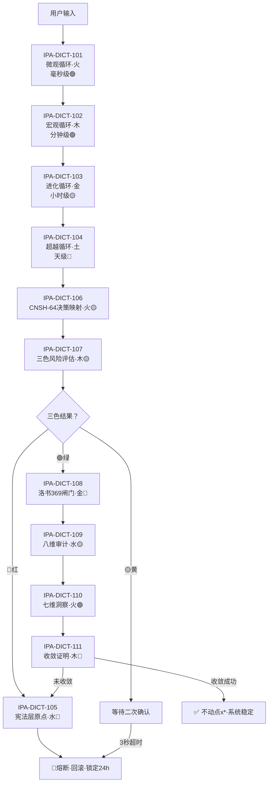

# DNA: #龍芯⚡️丙午·丙申·庚戌·䷙大畜-SCRIPT-MANAGER-v1.2-UID9622
# CONFIRM: #CONFIRM🌌9622-ONLY-ONCE🧬LK9X-772Z
# SEAL: #ZHUGEXIN⚡️2025-🇨🇳🐉⚖️♠️🧚🏼‍♀️❤️♾️-DEVICE-BIND-SOUL
# 🕐 循环触发·五行流转决策链

> DNA(v∞): `#龍芯⚡️丙午·丙申·癸丑·午时·需-IPA-DICT-DECISION-CHAIN-7F99378B`
> 旧 DNA(v1.0): `#龍芯⚡️丙午·丙申·庚申·亥时-循环触发五行流转-v1.0`（已废弃·仅供追溯）
> 确认码: `#CONFIRM🌌9622-ONLY-ONCE🧬LK9X-772Z ✅`
> GPG: `A2D0092CEE2E5BA87035600924C3704A8CC26D5F`
> 上接: [IPA-DICT-101-111·无限循环优化机制·编号对齐总表 v∞](./IPA-DICT-101-111-无限循环优化机制-对齐总表-v∞.md)
> 用途: 让11条孤立词条变成一套能跑起来的决策链
> 关联: [无限增长引擎](../L8_治理层/governance/INFINITE_GROWTH_ENGINE_v∞.md) | [权重算法](../L8_治理层/governance/tech-docs/LONGHUN-WEIGHT-ALGO-v3.1.md) | [流场压缩核](../cnsh-core/CNSH-FLOW-CORE-v3.0.md) | [民主回复计算器](../L2_技能层/skills/democratic-reply-calculator.md) | [铁律总目录](../L8_治理层/governance/IRON-LAWS/P0_ETERNAL_IRON_LAW_DIRECTORY.md) | [MASTER_REGISTRY](../MASTER_REGISTRY.md)

---

## 一、循环触发条件表

| 词条 | 循环名称 | 触发条件 | 作用范围 |
|------|----------|----------|----------|
| IPA-DICT-101 | 微观循环（毫秒级） | 任何一次用户输入后 5 毫秒内自动启动 | 流式输出的逐字调整、即时推理路径微调 |
| IPA-DICT-102 | 宏观循环（分钟级） | 每完成一次完整对话/任务后（约 1-5 分钟） | 检查本次响应的性能、资源消耗、响应质量 |
| IPA-DICT-103 | 进化循环（小时级） | 累计完成 10 次宏观循环后（约 1-2 小时） | 对比历史表现，调整模型权重或缓存策略 |
| IPA-DICT-104 | 超越循环（天级） | 每 24 小时或发现系统行为与宪法层冲突时 | 全系统范式对齐、文化主权校验 |
| IPA-DICT-105 | 宪法层原点（不动点） | 任何循环的输出触及红（🔴）三色审计时 | 立即熔断，回滚到上一个稳定状态，不执行任何修改 |

**四层循环层级关系：**
- 微观（毫秒）→ 每次输入都跑
- 宏观（分钟）→ 每轮对话跑一次
- 进化（小时）→ 每10次宏观循环跑一次
- 超越（天）→ 每24小时或冲突时跑一次
- 宪法层 → 随时待命，红色熔断立即触发

---

## 二、五行流转链

```
五行流转顺序（相生）：
火 → 木 → 金 → 水 → 火（循环）

对应循环：
微观循环（火）→ 产生能量与速度
宏观循环（木）→ 生长与收敛
进化循环（金）→ 淘汰与提纯
超越循环（土）→ 沉淀与范式
宪法层（水）   → 滋养与约束，回到微观

流转规则：
当你看到一条规则是"火"，它应该优先触发下一条"木"规则。
如果木没触发，系统自动降级到"金"做熔断。
```

| 词条 | 五行 | 相生下一行 | 失败降级 | 含义 |
|------|------|------------|----------|------|
| IPA-DICT-101 微观循环 | 火🔴 | → 木（宏观） | 金（熔断） | 产生能量与速度 |
| IPA-DICT-102 宏观循环 | 木🟢 | → 金（进化） | 水（宪法介入） | 生长与收敛 |
| IPA-DICT-103 进化循环 | 金🟡 | → 水（宪法） | 土（超越重构） | 淘汰与提纯 |
| IPA-DICT-104 超越循环 | 土🟡 | → 火（重启微观） | 水（宪法锚定） | 沉淀与范式突破 |
| IPA-DICT-105 宪法层原点 | 水🔴 | → 火（重启微观） | ∞熔断·停止 | 滋养与约束·不动点 |

---

## 三、三色行动标准

### 🟢 绿色（通过）
- 记录 DNA 时间戳
- 正常执行，不额外干预
- 更新"最后成功时间"
- 触发下一条五行相生规则

### 🟡 黄色（待审）
- 记录 DNA 时间戳 + 警告标记
- 执行前增加一次"人工/系统二次确认"
- 如果 3 秒内无确认，自动降级为只读模式
- 通知老大·等待拍板

### 🔴 红色（熔断）
- 立即阻断执行
- 触发 IPA-DICT-105 宪法层原点
- 回滚到上一次绿色状态
- 生成审计报告并锁定相关文件 24 小时
- L4瞬时层DNA自动留痕：`#龍芯⚡️{年干支}·{月干支}·{日干支}·{时辰}·{卦}-FUSE-{序列号}`

---

## 四、11条词条完整决策链



### 决策链词条索引

| 词条编号 | 名称 | 五行 | 默认三色 | 含义 |
|----------|------|------|----------|------|
| IPA-DICT-101 | 微观循环 | 火 | 🟢 | 毫秒级输入响应微调 |
| IPA-DICT-102 | 宏观循环 | 木 | 🟢 | 分钟级任务完成后检查 |
| IPA-DICT-103 | 进化循环 | 金 | 🟡 | 小时级历史对比优化 |
| IPA-DICT-104 | 超越循环 | 土 | 🔴 | 天级范式对齐 |
| IPA-DICT-105 | 宪法层原点 | 水 | 🔴 | 红色熔断·不动点 |
| IPA-DICT-106 | CNSH-64决策映射 | 火 | 🟡 | 64卦状态空间映射 |
| IPA-DICT-107 | 三色风险评估 | 木 | 🟡 | 风险·不确定性·影响 |
| IPA-DICT-108 | 洛书369闸门 | 金 | 🔴 | 数字根熔断路由 |
| IPA-DICT-109 | 八维审计 | 水 | 🟡 | 八维评分矩阵 |
| IPA-DICT-110 | 七维洞察 | 火 | 🟢 | 七权重人类洞察 |
| IPA-DICT-111 | 收敛证明 | 木 | 🔴 | 最终收敛性验证 |

---

## 五、与无限增长引擎的对接

| 决策链层级 | 对接引擎层级 | 频率 |
|------------|-------------|------|
| 微观循环 | MicroLoopOptimizer | 毫秒级 |
| 宏观循环 | MacroLoopOptimizer | 分钟级 |
| 进化循环 | EvolutionOptimizer | 小时级 |
| 超越循环 | TranscendenceOptimizer | 天级 |
| 宪法层 | RunawayProtection | 随时 |

---

*🐉 11条孤立词条·现在是一套能跑起来的决策链·龍魂现世！*

## DNA 签名

```
#龍芯⚡️丙午·丙申·癸丑·午时·需-IPA-DICT-DECISION-CHAIN-7F99378B
#龍芯⚡️丙午·丙申·庚申·亥时-循环触发五行流转-v1.0（旧版·已废弃·仅追溯）
#CONFIRM🌌9622-ONLY-ONCE🧬LK9X-772Z
```
