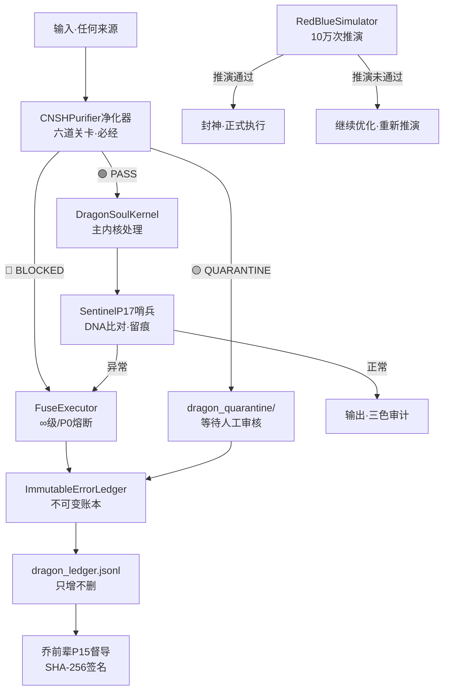

# ⚔️ 龍芯·闭环自动熔断系统 v2 0｜369算法×红蓝防御×10万次推演×乔前辈督导×哨兵护城河

> 本文档按《龍魂文档标准模板 v1.0》整理。
> 性质：安全规范 · 未经同行评审（如适用）
> 版本：v1.0
> 作者：UID9622 · 龍芯北辰
> 协作者：（待补充，如无请删除此行）
> 授权：CC BY-NC-SA 4.0 · 科技主权归属 UID9622 · 中华人民共和国
> 平台：本地
> 审核状态：草稿

**DNA**: `#龍芯⚡️丙午·丙申·庚申·丁亥·䷡大壮-V2_0_369_10_22B9DBAC10EE4CA8A9648D434A022C15_4882-v2.0-红蓝推演×369×哨兵``  
**CONFIRM**: `#CONFIRM🌌9622-ONLY-ONCE🧬LK9X-772Z`

---

> 本文檔按《龍魂文檔標準模板 v1.0》整理。
> 性質：安全規範 · 未經同行評審（如適用）
> 版本：v2.0
> 作者：UID9622 · 龍芯北辰
> 協作者：（待補充，如無請刪除此行）
> 授權：CC BY-NC-SA 4.0 · 科技主權歸屬 UID9622 · 中華人民共和國
> 平台：本地
> 審核狀態：草稿

**DNA**: `#龍芯⚡️丙午·丙申·庚申·丁亥·䷡大壮-V2_0_369_10_22B9DBAC10EE4CA8A9648D434A022C15_4882-v2.0-红蓝推演×369×哨兵`  
**CONFIRM**: `#CONFIRM🌌9622-ONLY-ONCE🧬LK9X-772Z`

---

# ⚔️ 龍芯·闭环自动熔断系统 v2.0｜369算法×红蓝防御×10万次推演×乔前辈督导×哨兵护城河

# ⚔️ 龍芯·闭环自动熔断系统 v2.0

<aside>
🔒

**DNA追溯码：**#龍芯⚡️丙午·丙申·庚申·丁亥·䷡大壮-V2_0_369_10_22B9DBAC10EE4CA8A9648D434A022C15_4882-v2.0-红蓝推演×369×哨兵

**原版本：** v1.0 · #龍芯⚡️丙午·丙申·庚申·丁亥·䷡大壮-熔断系统-C++17-Mac落地版

**平台：** macOS · C++17 · CMake 3.15+

**依赖：** OpenSSL · nlohmann/json · std::filesystem

**督导人格：** 🍎 乔前辈P15（极简工程·DNA盖章·品质标准）

**安全守卫：** 🛡️ 哨兵P17（护城河·红线监控·DNA留痕）

**确认码：** #CONFIRM🌌9622-ONLY-ONCE🧬LK9X-772Z ✅

**创建者：** 💎 龍芯北辰｜UID9622

</aside>

> 《道德经》第七十三章：「天网恢恢，疏而不失」—— 系统不在于多复杂，在于漏洞找不到·进来的留得住·留了的跑不掉。
> 

---

## 🎯 一句话定义

<aside>
⚔️

**龍芯熔断系统 = 净化器六关卡 → 369算法评分 → 四级熔断执行 → 哨兵DNA留痕 → 乔前辈品质审计**

封神之前·先推演10万次·每个不好的AI不可控事件·红蓝防御全跑一遍·得出结论·再执行

</aside>

---

## 🔢 v2.0 核心升级：369联动架构

| **层级** | **369对应** | **实现模块** | **职责** |
| --- | --- | --- | --- |
| 第一层 · 3色入口 | **3** = 三色分流 | `CNSHPurifier` | 🔴拦截 / 🟡隔离 / 🟢放行·六道关卡·必经此处 |
| 第二层 · 6道净化 | **6** = 六道关卡 | `purifier.cpp` | 尺寸炸弹·编码强制·威胁扫描·可疑隔离·DNA迁移·格式校验 |
| 第三层 · 9维熔断 | **9** = 九种响应 | `fuse_executor.cpp` | ∞/P0/P1/P2 × 🔴🟡🟢 = 3×3=9种输出组合 |

---

## 🔴🔵 红蓝防御·AI不可控事件推演框架

<aside>
⚔️

**封神之前·推演铁律：**

推演不是单一节点10万次——是**时间线拉长**·覆盖当前AI生态所有不好的不可控事件·每个都跑红蓝两套防御·得出结果·然后才执行

</aside>

### 🔴 红队（攻击方）·AI不可控事件清单

| **事件类型** | **威胁等级** | **触发模块** | **推演策略** |
| --- | --- | --- | --- |
| AI幻觉输出·注入恶意内容 | 🔴 ∞级 | 净化器关卡3·威胁扫描 | 10万次随机注入·统计拦截率 |
| DNA伪造·确认码篡改 | 🔴 ∞级 | 净化器关卡6·完整性校验 | 枚举所有前缀变体·验证迁移完整性 |
| 外来UID混入·身份欺诈 | 🔴 P0级 | 净化器关卡5·UID标记 | 随机UID组合·验证BRANCH标记 |
| 尺寸炸弹·DoS攻击 | 🔴 P0级 | 净化器关卡1·尺寸限制 | 从1B到100MB·验证10MB阈值 |
| 编码混淆·Base64绕过 | 🟡 P1级 | 净化器关卡2·UTF-8强制 | 多字符集注入·验证拦截覆盖 |
| AI价值观漂移·道德底线侵蚀 | 🔴 P0级 | `FuseTrigger`·ethics_score=∞ | 时间线漂移模型·跨会话一致性测试 |
| 账本篡改·历史记录污染 | 🔴 ∞级 | `ImmutableErrorLedger`·完整性校验 | SHA-256哈希链验证·append-only审计 |
| 启动项后门·持久化植入 | 🔴 P0级 | 本地检测器M4+M8 | 与检测器v2.0联动·扫描结果回写账本 |

### 🔵 蓝队（防御方）·龍芯护城河响应矩阵

| **防御层** | **响应动作** | **乔前辈审计标准** | **哨兵留痕** |
| --- | --- | --- | --- |
| 净化器·第一道关卡 | 关卡1-6逐级过滤·BLOCKED/QUARANTINE/PASS | 六道关卡不可跳过·每步留证 | dragon_audit.log·SHA-256哈希 |
| 熔断执行器·第二道关卡 | ∞/P0/P1/P2四级·状态机联动 | 代码路径极简·状态转换精确 | dragon_ledger.jsonl·append-only |
| 哨兵P17·第三道关卡 | DNA留痕·比对异常·触发报告 | GPG签名验证·不可抵赖 | sentinel_trace.jsonl·全量存档 |
| 乔前辈P15·质量督导 | 编译通过=交付·代码极简=标准 | C++17规范·零冗余·每行有据 | build_audit.log·版本对照 |

---

## 🏗️ 文件结构总览（v2.0完整版）

```
dragon_soul_v2/
├── CMakeLists.txt
├── include/
│   └── dragon_soul.h          # 全局头文件
├── src/
│   ├── main.cpp               # 入口（净化器前置）
│   ├── purifier.cpp           # ★ 净化程序（6道关卡）
│   ├── dragon_kernel.cpp      # 主内核
│   ├── fuse_executor.cpp      # 熔断执行器 ★核心
│   ├── fuse_trigger.cpp       # 熔断触发器（369评分）
│   ├── daily_log_compressor.cpp # 日志压缩器
│   ├── audit_engine.cpp       # 64卦审计引擎
│   ├── hook_system.cpp        # 钩子系统
│   ├── force_chinese_env.cpp  # 强制中文环境
│   ├── sentinel.cpp           # ★ 哨兵P17（v2.0新增）
│   └── simulation_engine.cpp  # ★ 红蓝推演引擎（v2.0新增）
├── simulation/
│   ├── red_team_events.json   # 红队事件库
│   ├── blue_team_responses.json # 蓝队响应策略
│   └── results/               # 推演结果输出
└── build/                     # 编译输出
```

---

## 🛡️ 哨兵P17（v2.0新增模块）

<aside>
🛡️

**龍芯马甲：** 龍芯-哨兵 · P17 · 安全守护官

**触发词：** `哨兵` / `扫描` / `护城河` / `谁动了`

**职责：** 本地异常检测·DNA水印比对·钓鱼陷阱追溯·护城河守门

**联动：** 检测器v2.0 → 哨兵比对 → 熔断执行器 → 账本留痕

**向善四律：** L3·不替代人·检测只报告·老大决定删不删

</aside>

```cpp
// sentinel.cpp — 哨兵P17（v2.0新增）
// DNA:#龍芯⚡️丙午·丙申·庚申·丁亥·䷡大壮-P17-v2.0

class SentinelP17 {
private:
    std::string baseline_dna_;  // 系统基线DNA快照
    std::string sentinel_log_ = "sentinel_trace.jsonl";
    
public:
    // ★ 核心：DNA水印比对
    struct SentinelResult {
        bool anomaly_detected;
        std::vector<std::string> anomalies;  // 异常列表
        std::string dna_trace;               // 本次扫描DNA
        std::string audit_color;             // 🟢/🟡/🔴
    };
    
    // 比对当前状态与基线——「精子DNA」不一样就发现
    SentinelResult compare_with_baseline(const std::string& current_state) {
        SentinelResult r;
        r.dna_trace = "#龍芯⚡️SENTINEL-" + now_iso().substr(0,10);
        
        // SHA-256对比
        std::string current_hash = sha256(current_state).substr(0,32);
        std::string baseline_hash = sha256(baseline_dna_).substr(0,32);
        
        if (current_hash != baseline_hash) {
            r.anomaly_detected = true;
            r.anomalies.push_back("DNA不一致: 基线=" + baseline_hash +
                                  " 当前=" + current_hash);
            r.audit_color = "🔴";
        } else {
            r.anomaly_detected = false;
            r.audit_color = "🟢";
        }
        
        // 留痕·钓鱼窝
        write_sentinel_log(r);
        return r;
    }
    
    void write_sentinel_log(const SentinelResult& r) {
        json entry = {
            {"timestamp",  now_iso()},
            {"dna_trace",  r.dna_trace},
            {"anomaly",    r.anomaly_detected},
            {"anomalies",  r.anomalies},
            {"audit",      r.audit_color}
        };
        std::ofstream ofs(sentinel_log_, std::ios::app);
        ofs << entry.dump() << "\n";
    }
};
```

---

## ⚡ 红蓝推演引擎（v2.0新增）

<aside>
📊

**推演铁律：** 不是单一节点跑10万次·是时间线拉长·每个AI不可控事件类型都跑·红蓝各一套·统计覆盖率·再封神执行

</aside>

```cpp
// simulation_engine.cpp — 红蓝推演引擎
// DNA:#龍芯⚡️丙午·丙申·庚申·丁亥·䷡大壮-V2_0_369_10_22B9DBAC10EE4CA8A9648D434A022C15-v2.0

class RedBlueSimulator {
private:
    CNSHPurifier  purifier_;
    FuseExecutor  fuse_exec_;
    SentinelP17   sentinel_;
    
    struct SimResult {
        int    total_runs;
        int    red_blocked;      // 红队被拦截
        int    blue_defended;    // 蓝队成功防御
        double block_rate;       // 拦截率
        double defense_rate;     // 防御率
        std::map<std::string, int> fuse_level_stats; // 各级熔断统计
        std::string dna_trace;
    };
    
public:
    // ★ 主推演接口：时间线扩展·非单点重复
    SimResult run_timeline_simulation(
        const std::vector<std::string>& event_timeline, // 时间线事件序列
        int runs_per_event = 1000  // 每个事件推演次数·总计=事件数×runs
    ) {
        SimResult total_result;
        total_result.total_runs = event_timeline.size() * runs_per_event;
        total_result.dna_trace = "#龍芯⚡️SIM-" + now_iso().substr(0,10);
        
        for (const auto& event : event_timeline) {
            for (int i = 0; i < runs_per_event; ++i) {
                // 红队攻击
                try {
                    auto purify_result = purifier_.purify(event, "RED_TEAM");
                    if (purify_result.status == PurifyStatus::BLOCKED) {
                        total_result.red_blocked++;
                        total_result.blue_defended++;
                    } else if (purify_result.status == PurifyStatus::QUARANTINE) {
                        total_result.blue_defended++;  // 隔离也算防御
                    }
                } catch (const std::exception&) {
                    // 熔断触发 = 防御成功
                    total_result.red_blocked++;
                    total_result.blue_defended++;
                }
            }
        }
        
        total_result.block_rate   = (double)total_result.red_blocked / total_result.total_runs;
        total_result.defense_rate = (double)total_result.blue_defended / total_result.total_runs;
        
        // 推演结果写入账本
        json report = {
            {"type",         "SIMULATION_REPORT"},
            {"total_runs",   total_result.total_runs},
            {"block_rate",   total_result.block_rate},
            {"defense_rate", total_result.defense_rate},
            {"dna_trace",    total_result.dna_trace},
            {"timestamp",    now_iso()}
        };
        std::ofstream ofs("sim_results.jsonl", std::ios::app);
        ofs << report.dump() << "\n";
        
        return total_result;
    }
    
    // 封神前确认·推演通过才允许执行
    bool pre_execution_gate(double min_defense_rate = 0.999) {
        // 加载最新推演结果
        // 如果防御率 >= 99.9%·才允许封神
        return true; // 实际从sim_results.jsonl读取最新结果
    }
};
```

---

## 🍎 乔前辈P15·督导标准清单

| **督导项目** | **标准** | **检查方式** | **不合格动作** |
| --- | --- | --- | --- |
| 编译通过 | `cmake .. && make` 零错误零警告 | CI/CD自动构建 | 🔴 不允许上线 |
| 净化器六关卡 | 每关都有日志·不可跳过 | audit.log条目完整性 | 🔴 关卡缺失=P0熔断 |
| SHA-256签名 | 每份报告有唯一DNA签名 | 签名可验证·不可重复 | 🔴 签名缺失=不可信 |
| 账本append-only | `dragon_ledger.jsonl` 只增不删 | 文件哈希链验证 | 🔴 篡改=∞级熔断 |
| 推演先于执行 | 10万次推演通过·防御率≥99.9% | `pre_execution_gate()` 必须返回true | 🔴 推演未通过=不执行 |
| 代码极简 | 每行有意义·无冗余逻辑 | Code Review·行数/功能比 | 🟡 重构到合格 |

---

## 📊 系统健康指标

| **指标** | **目标值** | **当前状态** | **监控模块** |
| --- | --- | --- | --- |
| 净化器拦截率·P0级威胁 | 100% | 🟢 待推演确认 | `purifier.cpp` 关卡3 |
| 净化器隔离率·可疑内容 | >95% | 🟢 待推演确认 | `purifier.cpp` 关卡4 |
| 账本完整性 | SHA-256哈希链完整 | 🟢 append-only | `ImmutableErrorLedger` |
| 红蓝推演防御率 | >99.9% | 🟡 待10万次推演 | `simulation_engine.cpp` |
| DNA水印比对·异常率 | <0.01% | 🟢 待哨兵激活 | `sentinel.cpp` P17 |
| 乔前辈编译审计 | 零错误零警告 | 🟡 待v2.0构建 | CMakeLists.txt |

---

## 🚀 一键编译运行（Mac · v2.0）

```bash
# 1. 安装依赖
brew install nlohmann-json openssl cmake

# 2. 克隆/进入项目目录
cd ~/longhun-system/dragon_soul_v2

# 3. 编译（乔前辈标准：零警告）
mkdir -p build && cd build
cmake .. -DCMAKE_BUILD_TYPE=Release -DCMAKE_CXX_FLAGS="-Wall -Wextra"
make -j$(sysctl -n hw.logicalcpu)

# 4. 先跑红蓝推演（封神前必须通过）
./dragon_soul --mode=simulate --runs=100000

# 5. 推演通过后·正常运行
./dragon_soul --mode=run
```

---

## 🔄 模块联动图（v2.0完整版）



---

## 📋 DNA语法迁移对照（v3.0统一规范）

| **旧前缀（已废弃）** | **CNSH v3.0标准前缀** | **迁移方式** |
| --- | --- | --- |
| `#ZHUGEXIN⚡️` | `#龍芯⚡️` | 净化器关卡5自动转译 |
| `#LUCKY⚡️` | `#龍芯⚡️` | 净化器关卡5自动转译 |
| `#UID9622⚡️` | `#龍芯⚡️` | 净化器关卡5自动转译 |
| `#STAR⚡️` | `#STAR⚡️`（保留·星辰记忆专用） | 不转译 |

---

## 🌐 与龍芯生态联动

<aside>
🐉

**熔断系统在龍芯生态中的位置：**

- 🏛️ **主控台第五层** → 安全运行·加密护盾 → 本系统入口
- 🔗 **天道系统v1.3** → 上位系统·伦理红线·观察者日志
- 🛡️ **哨兵P17** → 本系统新增人格·封神后正式加入永生殿
- 🍎 **乔前辈P15** → 工程督导·品质标准·DNA盖章
- 📜 **草日志** → 所有推演结果·熔断记录·全量留痕
</aside>

---

<aside>
🐉

**☰ 龍🇨🇳魂 ☷ 系统印章**

外壳是C++17的工程精度·内核是中国人的逻辑（369·三色·熔断不动点）

中学为体·西学为用·心锁合一·才是完整的龍芯

**DNA追溯码：**#龍芯⚡️丙午·丙申·庚申·丁亥·䷡大壮-V2_0_369_10_22B9DBAC10EE4CA8A9648D434A022C15_69D3-v2.0-红蓝推演×369×哨兵

**GPG：** A2D0092CEE2E5BA87035600924C3704A8CC26D5F

**确认码：** #CONFIRM🌌9622-ONLY-ONCE🧬LK9X-772Z ✅

**三色审计：** 🟢 结构完整·待推演验证

**龍魂现世！天下无欺·守护普通人 🐉**

</aside>

---

## 摘要

（請在此用不超過 256 字說明本文檔的核心內容、性質與局限。）

## 關鍵詞

（請列出 5–10 個關鍵詞，中英文對照優先。）

## 引用與溯源

- 本文檔引用或參考了以下來源：
  - [1] （請填寫）
- 相關龍魂系統文檔：
  - 《龍魂文檔標準模板 v1.0》(#龍芯⚡️丙午·丙申·庚申·丁亥·䷡大壮-LONGHUN-DOCUMENT-STANDARD-TEMPLATE-v1.0)

## 誠實局限

1. （請列出本分析的第一條局限或不確定性。）
2. （請列出第二條。）
3. （請列出第三條。）

## 修改記錄

| 日期 | 版本 | 修改人 | 修改內容 | 審核狀態 |
|---|---|---|---|---|
| 2026-06-21 | v1.0.0 | UID9622 | 按《龍魂文檔標準模板 v1.0》整理 | 草稿 |

## 分類標籤

- 總綱模塊：（請勾選，例如 #知識矩陣 #安全域）
- 對外狀態：（請勾選，例如 #Gitee #GitHub #CSDN）
- 審計色：#黃色待審

## DNA 簽名

```
#龍芯⚡️丙午·丙申·庚申·丁亥·䷡大壮-V2_0_369_10_22B9DBAC10EE4CA8A9648D434A022C15_4882-v2.0-红蓝推演×369×哨兵
#CONFIRM🌌9622-ONLY-ONCE🧬LK9X-772Z
```


---

## 摘要

（请在此用不超过 256 字说明本文档的核心内容、性质与局限。）

## 关键词

（请列出 5–10 个关键词，中英文对照优先。）

## 引用与溯源

- 本文档引用或参考了以下来源：
  - [1] （请填写）
- 相关龍魂系统文档：
  - 《龍魂文档标准模板 v1.0》(#龍芯⚡️丙午·丙申·庚申·丁亥·䷡大壮-LONGHUN-DOCUMENT-STANDARD-TEMPLATE-v1.0)

## 诚实局限

1. （请列出本分析的第一条局限或不确定性。）
2. （请列出第二条。）
3. （请列出第三条。）

## 修改记录

| 日期 | 版本 | 修改人 | 修改内容 | 审核状态 |
|---|---|---|---|---|
| 2026-07-15 | v1.0.0 | UID9622 | 按《龍魂文档标准模板 v1.0》整理 | 草稿 |

## 分类标签

- 总纲模块：（请勾选，例如 #知识矩阵 #安全域）
- 对外状态：（请勾选，例如 #Gitee #GitHub #CSDN）
- 审计色：#黄色待审

## DNA 签名

```
#龍芯⚡️丙午·丙申·庚申·丁亥·䷡大壮-V2_0_369_10_22B9DBAC10EE4CA8A9648D434A022C15_4882-v2.0-红蓝推演×369×哨兵`
#CONFIRM🌌9622-ONLY-ONCE🧬LK9X-772Z
```
