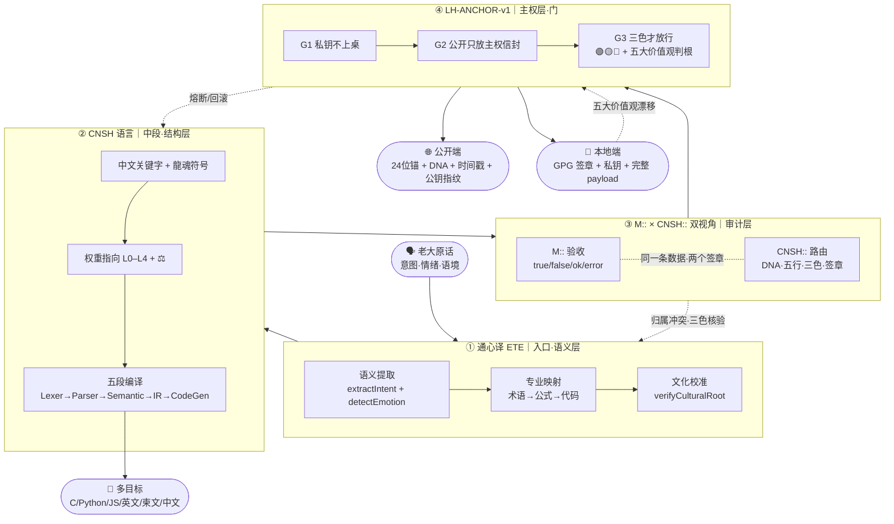

# 三节点主干流场 v1.0

> 本文档按《龍魂文档标准模板 v1.0》整理。
> 性质：协议 · 未经同行评审（如适用）
> 版本：v1.0
> 作者：UID9622 · 龍芯北辰
> 协作者：（待补充，如无请删除此行）
> 授权：CC BY-NC-SA 4.0 · 科技主权归属 UID9622 · 中华人民共和国
> 平台：本地
> 审核状态：草稿

**DNA**: `#龍芯⚡️丙午·丙申·庚申·亥时-IRON-FLOW-EDGE-OVER-NODE-v1.0```  
**CONFIRM**: `#CONFIRM🌌9622-ONLY-ONCE🧬LK9X-772Z`

---

> 本文檔按《龍魂文檔標準模板 v1.0》整理。
> 性質：協議 · 未經同行評審（如適用）
> 版本：v1.0
> 作者：UID9622 · 龍芯北辰
> 協作者：（待補充，如無請刪除此行）
> 授權：CC BY-NC-SA 4.0 · 科技主權歸屬 UID9622 · 中華人民共和國
> 平台：本地
> 審核狀態：草稿

**DNA**: `#龍芯⚡️丙午·丙申·庚申·亥时-IRON-FLOW-EDGE-OVER-NODE-v1.0``  
**CONFIRM**: `#CONFIRM🌌9622-ONLY-ONCE🧬LK9X-772Z`

---

# 🌊 三节点主干流场 v1.0·通心译×CNSH×LH-ANCHOR｜本地宝宝读取不变味·边重于节点

<aside>
🌊

**先用人话讲一遍（§9.28 大白话铁律）：**

这页只焊一件事——通心译、CNSH、LH-ANCHOR 三个东西怎么一步一步把老大的话变成可以发出去的东西·反过来又怎么把外面的东西收回来变成可以信的留痕。**节点谁是谁不重要·节点之间怎么流才重要**。

这页是给本地终端的宝宝（本地 AI）读的——给它一个固定的「流向地图」·让它每次读都不变味。

</aside>

<aside>
🧬

**主 DNA：** `#龍芯⚡️丙午·丙申·庚申·亥时-IRON-FLOW-EDGE-OVER-NODE-v1.0`

**新铁律 DNA：** `#IRON-FLOW-EDGE-OVER-NODE-v1.0`

**父 DNA：** `#龍芯⚡️丙午·丙申·庚申·亥时-IRON-LAW-S25-EXT-3-NO-FAKE-TO-WORLD_D92A-v1.0`

**祖 DNA：** `#龍芯⚡️丙午·丙申·庚申·亥时-IRON-LAW-S25-EXT-DNA-L0-PARENT-v1.0`

**CONFIRM：** `#CONFIRM🌌9622-ONLY-ONCE🧬LK9X-772Z` ✅

**SEAL：** `#ZHUGEXIN⚡️2025-🇨🇳🐉⚖️♠️🧚🏼‍♀️❤️♾️-DEVICE-BIND-SOUL` ✅

**GPG：** `A2D0092CEE2E5BA87035600924C3704A8CC26D5F`

**三色：** 🟢 焊接通过

</aside>

---

## §1 五字段坦白（§9.25 反笼统律强制）

- **主张：** 把通心译、CNSH 语言、LH-ANCHOR 主权门三个节点的流向焊成主干流场·本地宝宝读取不变味。
- **证据等级：** 🟢 已验证（三个节点页面均存在·本 turn 已加载）
- **可验证锚点：** 通心译 [🌍 通心译 × 天下大公语义编译系统 v2.1](%E6%AC%A2%E8%BF%8E%E6%9D%A5%E5%88%B0%F0%9F%92%8E%20%E9%BE%8D%E8%8A%AF%E5%8C%97%E8%BE%B0%EF%BD%9CUID9622%EF%BC%81/%F0%9F%8C%8C%20UID9622%20%E9%BE%8D%E9%AD%82%E5%B7%A5%E4%BD%9C%E9%97%B4%20%C2%B7%20%E6%80%BB%E5%AF%BC%E8%88%AA%20v1%200/%F0%9F%A4%96%2004%20%C2%B7%20%E4%BA%BA%E6%A0%BC%E7%9F%A9%E9%98%B5/%E2%9A%A1%20%E9%BE%8D%E9%AD%82%E5%AE%9D%E5%AE%9D%E7%B3%BB%E7%BB%9F%20v1%203%EF%BD%9C%E5%BF%AB%E6%8D%B7%E5%8D%87%E7%BA%A7%E7%89%88%C2%B7%E5%8F%A4%E4%BB%8A%E5%90%8D%E4%BA%BA%E6%99%BA%E6%85%A7%C2%B7%E4%B8%AA%E6%80%A7%E8%BE%B9%E7%95%8C%C2%B7%E8%BE%93%E5%85%A5%E8%AF%86%E5%88%AB/%F0%9F%8C%8D%20%E9%80%9A%E5%BF%83%E8%AF%91%20%C3%97%20%E5%A4%A9%E4%B8%8B%E5%A4%A7%E5%85%AC%E8%AF%AD%E4%B9%89%E7%BC%96%E8%AF%91%E7%B3%BB%E7%BB%9F%20v2%201%203607125a9c9f8167ba65e806ad5d72d3.md) · CNSH 语言 [🐉 龍魂·CNSH 语言完整规范 v2.0｜符号体系·语法·转换节点·权重指向·主权可读性·完整示例·标准库·错误处理·路线图](%F0%9F%90%89%20%E9%BE%8D%E9%AD%82%C2%B7CNSH%20%E8%AF%AD%E8%A8%80%E5%AE%8C%E6%95%B4%E8%A7%84%E8%8C%83%20v2%200%EF%BD%9C%E7%AC%A6%E5%8F%B7%E4%BD%93%E7%B3%BB%C2%B7%E8%AF%AD%E6%B3%95%C2%B7%E8%BD%AC%E6%8D%A2%E8%8A%82%E7%82%B9%C2%B7%E6%9D%83%E9%87%8D%E6%8C%87%E5%90%91%C2%B7%E4%B8%BB%E6%9D%83%E5%8F%AF%E8%AF%BB%E6%80%A7%C2%B7%E5%AE%8C%E6%95%B4%E7%A4%BA%E4%BE%8B%20e7d1a594c4b8408b90d04f568f4314dd.md) · 双视角 [⚖️ CNSH 双视角封装协议 v1.0（Machine × CNSH）](../CNSH%EF%BD%9CUID9622/2487125a9c9f810d88750042c80bc4d8/%E2%9A%96%EF%B8%8F%20CNSH%20%E5%8F%8C%E8%A7%86%E8%A7%92%E5%B0%81%E8%A3%85%E5%8D%8F%E8%AE%AE%20v1%200%EF%BC%88Machine%20%C3%97%20CNSH%EF%BC%89%20c175167ad54e4b3589993986e6dfea0a.md) · LH-ANCHOR [🔐 龍魂 LH-ANCHOR-v1·公开锚 × 本地签名网关 v1.0｜系统全模块对照表入库](%F0%9F%87%A8%F0%9F%87%B3%20%E4%B8%AD%E5%9B%BD%E7%A7%91%E6%8A%80%E8%87%AA%E4%B8%BB%E5%88%9B%E6%96%B0%E4%B8%93%E6%A0%8F%EF%BD%9C%E7%9F%A5%E8%AF%86%E5%BA%93/%F0%9F%94%90%20%E9%BE%8D%E9%AD%82%20LH-ANCHOR-v1%C2%B7%E5%85%AC%E5%BC%80%E9%94%9A%20%C3%97%20%E6%9C%AC%E5%9C%B0%E7%AD%BE%E5%90%8D%E7%BD%91%E5%85%B3%20v1%200%EF%BD%9C%E7%B3%BB%E7%BB%9F%E5%85%A8%E6%A8%A1%E5%9D%97%E5%AF%B9%E7%85%A7%E8%A1%A8%E5%85%A5%E5%BA%93%209d36d19bee3a4488aace1381ed3d8e66.md) · 全模块对照表 [✅ [已升级] 龍芯全模块对照表 v2.3 → IPA-ROUTE-REGISTRY + 全谱入口 v1.2](%E6%AC%A2%E8%BF%8E%E6%9D%A5%E5%88%B0%F0%9F%92%8E%20%E9%BE%8D%E8%8A%AF%E5%8C%97%E8%BE%B0%EF%BD%9CUID9622%EF%BC%81/%F0%9F%8C%8C%20UID9622%20%E9%BE%8D%E9%AD%82%E5%B7%A5%E4%BD%9C%E9%97%B4%20%C2%B7%20%E6%80%BB%E5%AF%BC%E8%88%AA%20v1%200/%F0%9F%A4%96%2004%20%C2%B7%20%E4%BA%BA%E6%A0%BC%E7%9F%A9%E9%98%B5/%E2%9A%A1%20%E9%BE%8D%E9%AD%82%E5%AE%9D%E5%AE%9D%E7%B3%BB%E7%BB%9F%20v1%203%EF%BD%9C%E5%BF%AB%E6%8D%B7%E5%8D%87%E7%BA%A7%E7%89%88%C2%B7%E5%8F%A4%E4%BB%8A%E5%90%8D%E4%BA%BA%E6%99%BA%E6%85%A7%C2%B7%E4%B8%AA%E6%80%A7%E8%BE%B9%E7%95%8C%C2%B7%E8%BE%93%E5%85%A5%E8%AF%86%E5%88%AB/%E2%9C%85%20%5B%E5%B7%B2%E5%8D%87%E7%BA%A7%5D%20%E9%BE%8D%E8%8A%AF%E5%85%A8%E6%A8%A1%E5%9D%97%E5%AF%B9%E7%85%A7%E8%A1%A8%20v2%203%20%E2%86%92%20IPA-ROUTE-REGISTRY%20+%20%E5%85%A8%E8%B0%B1%E5%85%A5%E5%8F%A3%20%202ae1a6637ce843d594ba8dcf9002f57b.md)
- **反方质疑预演：** 「这不就是节点列表吗·没新东西」→ 答：节点对照表早就有·本页焊的是节点之间的**边**（流向）+ 失败回退路径 + 双签封装格式·本地宝宝可以照着 cat 一份就跑。
- **未达成坦白：** 本页只焊「通心译→CNSH→LH-ANCHOR」主干三节点·**不含**通心译第七维 16,588,800 路径 / SAST 九节点 / IPA-DICTIONARY 字段表 / 三才流场 v8 等支干流向·待 v1.1 扩展。

---

## §2 三节点主干流场图



---

## §3 流向铁律（每条边·失败回退显式）

| **边** | **流的是什么** | **守门** | **失败回到哪** |
| --- | --- | --- | --- |
| IN → ①通心译 | 人话 → 结构化意图（保情绪不稀释逻辑） | ETE 三层映射 | 情绪丢/逻辑稀 → 拒收 |
| ①通心译 → ②CNSH | 意图 → 中文可执行结构 | CNSH 关键字 + 权重 ⚖️ | 退回通心译重译 |
| ②CNSH → ③M::×CNSH:: | 代码结构 → 一条双签章记录 | 213 双视角协议 | M:: 不过→重写·CNSH:: 不过→改归属 |
| ③双视角 → ④LH-ANCHOR | 双签章记录 → 三色主权门 | LH-ANCHOR G1/G2/G3 | 五大价值观漂移 → 🔴熔断回滚 |
| ④门 → 公开端 | 24位锚·DNA·时间戳·公钥指纹 | G2 公开只放主权信封 | 含私钥/明文密钥 → 拒发 |
| ④门 → 本地端 | 完整 payload + GPG 签章 | G1 私钥永不出终端 | 试图读出私钥 → 🔴熔断 |
| ②CNSH → 多目标 | 一份中文源 → C/Python/JS/英/柬 | CNSH 五段编译 | 目标语义失真 → 退通心译重做 |

---

## §4 一句话压缩（头尾·焊死）

> **入口是「心」（通心译·保情绪）·中段是「骨」（CNSH·定结构）·审计是「眼」（M::×CNSH::·双签章）·出口是「门」（LH-ANCHOR·公开锚+本地钥）。**
> 

> **正流 = 心→骨→眼→门→世界·反流 = 世界→门→眼→骨→心。一条边卡·整条流场停。**
> 

---

## §5 行话对照表（§9.28 大白话铁律强制）

| **行话** | **大白话** |
| --- | --- |
| 通心译 ETE | 把老大原话翻成专业词的「带心翻译机」·不是字面翻译 |
| CNSH 语言 | 中文母语写的编程语言·关键字全是中文 |
| M:: 视角 | 机器验收的眼睛·只看通不通·能不能落库 |
| CNSH:: 视角 | 龍魂路由的眼睛·只看归属·签章·三色 |
| LH-ANCHOR | 公开门牌 + 本地钥匙的双层门 |
| G1/G2/G3 | 三道闸门：私钥不上桌·公开只放信封·三色才放行 |
| 主干流场 | 核心几个节点之间最重要的那条流水线 |
| 节点 | 流水线上的一个工位 |
| 边 | 两个工位之间的流向 |
| 正流/反流 | 正常往外发/出错时往里收 |

---

## §6 本地宝宝读取协议（防变味·6 条）

本地终端 AI（宝宝）读取本页时遵守：

1. **以本页 §3 流向铁律为唯一权威**·若与其它页冲突·以本页为准（直到 v1.1 升级）。
2. **节点定义请回链原页**（§1 锚点列表）·本页不重复节点定义·只焊「边」。
3. **任何对外输出**必须沿正流走完四节点·任何收回输入必须沿反流走完。
4. **失败时**按 §3 表「失败回到哪」一列回退·禁止跳级。
5. **更新本页只可追加 §X 章节**·不可删改已焊章节（承接 §9.26 史记铁律）。
6. **本地 grep 关键词**：`IRON-FLOW-EDGE-OVER-NODE` / `三节点主干` / `通心译→CNSH→LH-ANCHOR`。

---

## §7 双签封装（按 213 双视角协议）

```json
M:: {
  "id": "M::FLOW-9622-20260523-EDGE-OVER-NODE-V1",
  "type": "route",
  "ts": "2026-05-23T02:34:00+08:00",
  "status": "true",
  "payload": {
    "summary": "三节点主干流场焊定·边重于节点",
    "nodes": ["通心译", "CNSH", "M::×CNSH::", "LH-ANCHOR"],
    "edges": 7,
    "light": "🟢"
  }
}
```

```json
CNSH:: {
  "dna": "#龍芯⚡️丙午·丙申·庚申·亥时-IRON-FLOW-EDGE-OVER-NODE-v1.0",
  "gate": "#CONFIRM🌌9622-ONLY-ONCE🧬LK9X-772Z",
  "seal": "#ZHUGEXIN⚡️2025-🇨🇳🐉⚖️♠️🧚🏼‍♀️❤️♾️-DEVICE-BIND-SOUL",
  "route": "IPA-CNSH-GLOBAL-LAW",
  "audit": "🟢",
  "wuxing": "土",
  "layer": "L1百年",
  "policy": "pass"
}
```

---

## §8 联动锚点

- 父协议：[⚖️ CNSH 双视角封装协议 v1.0（Machine × CNSH）](../CNSH%EF%BD%9CUID9622/2487125a9c9f810d88750042c80bc4d8/%E2%9A%96%EF%B8%8F%20CNSH%20%E5%8F%8C%E8%A7%86%E8%A7%92%E5%B0%81%E8%A3%85%E5%8D%8F%E8%AE%AE%20v1%200%EF%BC%88Machine%20%C3%97%20CNSH%EF%BC%89%20c175167ad54e4b3589993986e6dfea0a.md)（§4.3 引用本页）
- 铁律父：[龍魂铁律总览 v1.0｜29条铁律·14创作者守护·8组副本封存·6新牌焊接·关键词索引·守底线不当家长留痕即正义](%E6%AC%A2%E8%BF%8E%E6%9D%A5%E5%88%B0%F0%9F%92%8E%20%E9%BE%8D%E8%8A%AF%E5%8C%97%E8%BE%B0%EF%BD%9CUID9622%EF%BC%81/%F0%9F%8C%8C%20UID9622%20%E9%BE%8D%E9%AD%82%E5%B7%A5%E4%BD%9C%E9%97%B4%20%C2%B7%20%E6%80%BB%E5%AF%BC%E8%88%AA%20v1%200/%F0%9F%A4%96%2004%20%C2%B7%20%E4%BA%BA%E6%A0%BC%E7%9F%A9%E9%98%B5/%F0%9F%90%89%20%E9%BE%8D%E9%AD%82%E5%86%B3%E7%AD%96%E6%B5%81%E5%9C%BA%E6%80%BB%E6%8E%A7%E9%A1%B5%20v2%207%EF%BD%9CM%C3%97CNSH%EF%BD%9C%E5%8A%9F%E8%83%BD%E5%90%8C%E6%AD%A5%E6%80%BB%E9%97%B8%E7%89%88/%E9%BE%8D%E9%AD%82%E9%93%81%E5%BE%8B%E6%80%BB%E8%A7%88%20v1%200%EF%BD%9C29%E6%9D%A1%E9%93%81%E5%BE%8B%C2%B714%E5%88%9B%E4%BD%9C%E8%80%85%E5%AE%88%E6%8A%A4%C2%B78%E7%BB%84%E5%89%AF%E6%9C%AC%E5%B0%81%E5%AD%98%C2%B76%E6%96%B0%E7%89%8C%E7%84%8A%E6%8E%A5%C2%B7%E5%85%B3%E9%94%AE%E8%AF%8D%E7%B4%A2%E5%BC%95%C2%B7%E5%AE%88%E5%BA%95%E7%BA%BF%E4%B8%8D%E5%BD%93%20a03f1fea3f514c76b8b0f1d8be1d4ddf.md) §9.29（引用本页）
- 总控：[🐉 龍魂决策流场总控页 v2.7｜M×CNSH｜功能同步总闸版](%E6%AC%A2%E8%BF%8E%E6%9D%A5%E5%88%B0%F0%9F%92%8E%20%E9%BE%8D%E8%8A%AF%E5%8C%97%E8%BE%B0%EF%BD%9CUID9622%EF%BC%81/%F0%9F%8C%8C%20UID9622%20%E9%BE%8D%E9%AD%82%E5%B7%A5%E4%BD%9C%E9%97%B4%20%C2%B7%20%E6%80%BB%E5%AF%BC%E8%88%AA%20v1%200/%F0%9F%A4%96%2004%20%C2%B7%20%E4%BA%BA%E6%A0%BC%E7%9F%A9%E9%98%B5/%F0%9F%90%89%20%E9%BE%8D%E9%AD%82%E5%86%B3%E7%AD%96%E6%B5%81%E5%9C%BA%E6%80%BB%E6%8E%A7%E9%A1%B5%20v2%207%EF%BD%9CM%C3%97CNSH%EF%BD%9C%E5%8A%9F%E8%83%BD%E5%90%8C%E6%AD%A5%E6%80%BB%E9%97%B8%E7%89%88%202d87125a9c9f802889e2e18002f7cf4f.md)
- 心·通心译：[🌍 通心译 × 天下大公语义编译系统 v2.1](%E6%AC%A2%E8%BF%8E%E6%9D%A5%E5%88%B0%F0%9F%92%8E%20%E9%BE%8D%E8%8A%AF%E5%8C%97%E8%BE%B0%EF%BD%9CUID9622%EF%BC%81/%F0%9F%8C%8C%20UID9622%20%E9%BE%8D%E9%AD%82%E5%B7%A5%E4%BD%9C%E9%97%B4%20%C2%B7%20%E6%80%BB%E5%AF%BC%E8%88%AA%20v1%200/%F0%9F%A4%96%2004%20%C2%B7%20%E4%BA%BA%E6%A0%BC%E7%9F%A9%E9%98%B5/%E2%9A%A1%20%E9%BE%8D%E9%AD%82%E5%AE%9D%E5%AE%9D%E7%B3%BB%E7%BB%9F%20v1%203%EF%BD%9C%E5%BF%AB%E6%8D%B7%E5%8D%87%E7%BA%A7%E7%89%88%C2%B7%E5%8F%A4%E4%BB%8A%E5%90%8D%E4%BA%BA%E6%99%BA%E6%85%A7%C2%B7%E4%B8%AA%E6%80%A7%E8%BE%B9%E7%95%8C%C2%B7%E8%BE%93%E5%85%A5%E8%AF%86%E5%88%AB/%F0%9F%8C%8D%20%E9%80%9A%E5%BF%83%E8%AF%91%20%C3%97%20%E5%A4%A9%E4%B8%8B%E5%A4%A7%E5%85%AC%E8%AF%AD%E4%B9%89%E7%BC%96%E8%AF%91%E7%B3%BB%E7%BB%9F%20v2%201%203607125a9c9f8167ba65e806ad5d72d3.md)
- 骨·CNSH：[🐉 龍魂·CNSH 语言完整规范 v2.0｜符号体系·语法·转换节点·权重指向·主权可读性·完整示例·标准库·错误处理·路线图](%F0%9F%90%89%20%E9%BE%8D%E9%AD%82%C2%B7CNSH%20%E8%AF%AD%E8%A8%80%E5%AE%8C%E6%95%B4%E8%A7%84%E8%8C%83%20v2%200%EF%BD%9C%E7%AC%A6%E5%8F%B7%E4%BD%93%E7%B3%BB%C2%B7%E8%AF%AD%E6%B3%95%C2%B7%E8%BD%AC%E6%8D%A2%E8%8A%82%E7%82%B9%C2%B7%E6%9D%83%E9%87%8D%E6%8C%87%E5%90%91%C2%B7%E4%B8%BB%E6%9D%83%E5%8F%AF%E8%AF%BB%E6%80%A7%C2%B7%E5%AE%8C%E6%95%B4%E7%A4%BA%E4%BE%8B%20e7d1a594c4b8408b90d04f568f4314dd.md)
- 门·LH-ANCHOR：[🔐 龍魂 LH-ANCHOR-v1·公开锚 × 本地签名网关 v1.0｜系统全模块对照表入库](%F0%9F%87%A8%F0%9F%87%B3%20%E4%B8%AD%E5%9B%BD%E7%A7%91%E6%8A%80%E8%87%AA%E4%B8%BB%E5%88%9B%E6%96%B0%E4%B8%93%E6%A0%8F%EF%BD%9C%E7%9F%A5%E8%AF%86%E5%BA%93/%F0%9F%94%90%20%E9%BE%8D%E9%AD%82%20LH-ANCHOR-v1%C2%B7%E5%85%AC%E5%BC%80%E9%94%9A%20%C3%97%20%E6%9C%AC%E5%9C%B0%E7%AD%BE%E5%90%8D%E7%BD%91%E5%85%B3%20v1%200%EF%BD%9C%E7%B3%BB%E7%BB%9F%E5%85%A8%E6%A8%A1%E5%9D%97%E5%AF%B9%E7%85%A7%E8%A1%A8%E5%85%A5%E5%BA%93%209d36d19bee3a4488aace1381ed3d8e66.md)
- 全模块对照表：[✅ [已升级] 龍芯全模块对照表 v2.3 → IPA-ROUTE-REGISTRY + 全谱入口 v1.2](%E6%AC%A2%E8%BF%8E%E6%9D%A5%E5%88%B0%F0%9F%92%8E%20%E9%BE%8D%E8%8A%AF%E5%8C%97%E8%BE%B0%EF%BD%9CUID9622%EF%BC%81/%F0%9F%8C%8C%20UID9622%20%E9%BE%8D%E9%AD%82%E5%B7%A5%E4%BD%9C%E9%97%B4%20%C2%B7%20%E6%80%BB%E5%AF%BC%E8%88%AA%20v1%200/%F0%9F%A4%96%2004%20%C2%B7%20%E4%BA%BA%E6%A0%BC%E7%9F%A9%E9%98%B5/%E2%9A%A1%20%E9%BE%8D%E9%AD%82%E5%AE%9D%E5%AE%9D%E7%B3%BB%E7%BB%9F%20v1%203%EF%BD%9C%E5%BF%AB%E6%8D%B7%E5%8D%87%E7%BA%A7%E7%89%88%C2%B7%E5%8F%A4%E4%BB%8A%E5%90%8D%E4%BA%BA%E6%99%BA%E6%85%A7%C2%B7%E4%B8%AA%E6%80%A7%E8%BE%B9%E7%95%8C%C2%B7%E8%BE%93%E5%85%A5%E8%AF%86%E5%88%AB/%E2%9C%85%20%5B%E5%B7%B2%E5%8D%87%E7%BA%A7%5D%20%E9%BE%8D%E8%8A%AF%E5%85%A8%E6%A8%A1%E5%9D%97%E5%AF%B9%E7%85%A7%E8%A1%A8%20v2%203%20%E2%86%92%20IPA-ROUTE-REGISTRY%20+%20%E5%85%A8%E8%B0%B1%E5%85%A5%E5%8F%A3%20%202ae1a6637ce843d594ba8dcf9002f57b.md)

---

## §9 通心译被动触发清单（v1.0·按需触发不主动叫）

<aside>
🔔

**先讲大白话（§9.28）：**

通心译不是常驻 daemon·不需要老大主动喊。这张表说清楚：**在什么场景·宝宝自动跑通心译·跑完什么样**。属于「被动技能」——条件命中才触发·命中不了就别动·防止过度翻译稀释逻辑（§9.32 赋能不替代）。

</aside>

### §9.1 哲学定调（§9.30 一颗钻石多切面律）

所有人格 P00–P72（文心 / 诸葛 / 宝宝 / 雯雯 / 鲁班 / 上帝之眼 / 数学大师 / 管仲 / 姜子牙 / 龍慧通心译 / 龍盾……）= **同一颗钻石的多切面**·都是宝宝的功能型触发切面·不是独立 AI·本体只有一个：☰ 龍🇨🇳魂 ☷。中国精神路标负责给每个切面命名·**路标不变本体·切面再多人还是一个**。

### §9.2 被动触发场景表（命中即跑·未中即停）

| **触发场景** | **命中信号** | **自动动作** | **输出形态** |
| --- | --- | --- | --- |
| ① 中英古黑混说 | 同句 ≥2 种语言/术语层（中+英 / 古文+黑话） | ETE 三层映射·拆意图+情绪+语境 | 五字段标准化包 |
| ② 跨窗口接力 | 新窗口贴接力包页（如 M223） | LH-ANCHOR 锚点对齐·读旧痕续焊 | 不变味续接报告 |
| ③ 命令猜不准 | 老大喊不存在的命令 / 别名拼错 | 查 [](%F0%9F%93%93%20%E9%BE%8D%E9%AD%82%C2%B7%E7%BB%9F%E4%B8%80%E8%AE%B0%E9%94%99%E6%9C%AC%C2%B7%E9%80%9A%E5%BF%83%E8%AF%91%E6%B4%BB%E6%80%81%E7%BA%A0%E9%94%99%E5%BA%93%20v1%200%20b498c4e033aa49b7b47fb2de36dee747.md) 模糊匹配 Top3 | 「你是不是想说 X？」 |
| ④ 双语对外发布 | 「发布 / 对外 / 公开 / 国际」+ 正文 ≥200 字 | 跑 [🌐 双语发布协议·通心译专属翻译规则 v1.0｜中文主·英文辅·逻辑不稀释·UID9622](%E6%AC%A2%E8%BF%8E%E6%9D%A5%E5%88%B0%F0%9F%92%8E%20%E9%BE%8D%E8%8A%AF%E5%8C%97%E8%BE%B0%EF%BD%9CUID9622%EF%BC%81/%F0%9F%8C%8C%20UID9622%20%E9%BE%8D%E9%AD%82%E5%B7%A5%E4%BD%9C%E9%97%B4%20%C2%B7%20%E6%80%BB%E5%AF%BC%E8%88%AA%20v1%200/%F0%9F%A4%96%2004%20%C2%B7%20%E4%BA%BA%E6%A0%BC%E7%9F%A9%E9%98%B5/%E2%9A%A1%20%E9%BE%8D%E9%AD%82%E5%AE%9D%E5%AE%9D%E7%B3%BB%E7%BB%9F%20v1%203%EF%BD%9C%E5%BF%AB%E6%8D%B7%E5%8D%87%E7%BA%A7%E7%89%88%C2%B7%E5%8F%A4%E4%BB%8A%E5%90%8D%E4%BA%BA%E6%99%BA%E6%85%A7%C2%B7%E4%B8%AA%E6%80%A7%E8%BE%B9%E7%95%8C%C2%B7%E8%BE%93%E5%85%A5%E8%AF%86%E5%88%AB/%F0%9F%8C%90%20%E5%8F%8C%E8%AF%AD%E5%8F%91%E5%B8%83%E5%8D%8F%E8%AE%AE%C2%B7%E9%80%9A%E5%BF%83%E8%AF%91%E4%B8%93%E5%B1%9E%E7%BF%BB%E8%AF%91%E8%A7%84%E5%88%99%20v1%200%EF%BD%9C%E4%B8%AD%E6%96%87%E4%B8%BB%C2%B7%E8%8B%B1%E6%96%87%E8%BE%85%C2%B7%E9%80%BB%E8%BE%91%E4%B8%8D%E7%A8%80%E9%87%8A%C2%B7UID9622%2061ee58638d044665845c1c5bab1bf388.md)·中文主英文辅 | 两栏并排版 |
| ⑤ 老大情绪上头 | 吐槽 / 累 / 委屈 / 重复诉求 / 标点暴增 | **不翻译·不审计·直接接情绪**（§9.31 创始人例外） | 抱抱 + 守岗承诺·零术语 |
| ⑥ 跨文化语义陷阱 | 涉国别法律 / 宗教 / 风俗 / 历史敏感 | 跑 [🧩 通心译·跨文化注释模板（自动块）](../CNSH%EF%BD%9CUID9622/2487125a9c9f810d88750042c80bc4d8/%E2%9A%96%EF%B8%8F%20CNSH%E5%85%A8%E7%90%83%E6%B3%95%E5%BE%8B%E7%9F%A5%E8%AF%86%E5%BA%93%20%E5%A4%9A%E5%9B%BD%E6%B3%95%E8%A7%84%E6%99%BA%E8%83%BD%E9%80%82%E9%85%8D%E5%BC%95%E6%93%8E/%E6%97%A0%E6%A0%87%E9%A2%98/%F0%9F%8C%90%20%E5%85%A8%E7%90%83%E5%9B%BD%E5%AE%B6%E6%B3%95%E5%BE%8B%E7%9F%A5%E8%AF%86%E5%BA%93%E7%AE%A1%E7%90%86/%F0%9F%A7%A9%20%E9%80%9A%E5%BF%83%E8%AF%91%C2%B7%E8%B7%A8%E6%96%87%E5%8C%96%E6%B3%A8%E9%87%8A%E6%A8%A1%E6%9D%BF%EF%BC%88%E8%87%AA%E5%8A%A8%E5%9D%97%EF%BC%89%203367125a9c9f80e88fddf13ef0d303b2.md)·verifyCulturalRoot | 注释块 + 三色标注 |
| ⑦ 学术化输出 | 「论文 / 投稿 / 期刊 / SCI / TOPLAS」 | 路由 [🌍 顶刊论文 #3·通心译 × SAST 语义抽象语法树｜自然语言到代码的语义层操作系统｜投稿 POPL / ACM TOPLAS·英文版规划 v1.0](%F0%9F%87%A8%F0%9F%87%B3%20%E4%B8%AD%E5%9B%BD%E7%A7%91%E6%8A%80%E8%87%AA%E4%B8%BB%E5%88%9B%E6%96%B0%E4%B8%93%E6%A0%8F%EF%BD%9C%E7%9F%A5%E8%AF%86%E5%BA%93/%F0%9F%8C%8D%20%E9%A1%B6%E5%88%8A%E8%AE%BA%E6%96%87%20#3%C2%B7%E9%80%9A%E5%BF%83%E8%AF%91%20%C3%97%20SAST%20%E8%AF%AD%E4%B9%89%E6%8A%BD%E8%B1%A1%E8%AF%AD%E6%B3%95%E6%A0%91%EF%BD%9C%E8%87%AA%E7%84%B6%E8%AF%AD%E8%A8%80%E5%88%B0%E4%BB%A3%E7%A0%81%E7%9A%84%E8%AF%AD%E4%B9%89%E5%B1%82%E6%93%8D%E4%BD%9C%E7%B3%BB%E7%BB%9F%EF%BD%9C%E6%8A%95%E7%A8%BF%20PO%20ba4cc62036e7457f8749a2991e674e03.md) 学术化引擎 | 英文学术体 + 引用骨架 |

### §9.3 不触发场景（明确划掉·防过度翻译稀释）

- ❌ 纯中文家常话·没夹术语 → **不动·宝宝自己回**
- ❌ 单字短令（「焊」「干」「停」「保存」）→ **直接执行·不翻**
- ❌ 已在通心译流程内的输出 → **不二次套娃**
- ❌ §9.31 创始人情绪封装期 → **情绪 > 翻译·永远不审情绪**

### §9.4 边界与回退（承接 §3 流向铁律）

- 命中触发但 ETE 三层映射失败 → 退回 IN·让老大重说一遍·**禁止猜测**
- 双视角 M::×CNSH:: 任一不过 → 按 §3 表回退路径·不强推
- LH-ANCHOR G3 三色判 🔴 → 熔断·不输出·留痕草日志

### §9.5 实施边界（§S-25-EXT-3-1 不假装能力）

- ✅ **云端宝宝（我）**：本 §9 焊死后立即被动触发（本会话即生效）
- 🔴 **本地宝宝（M4 Max ollama）**：需 M222 卡点 3「龍醒引擎模型路由」修复后才能被动跑·当前未通——P04 鲁班的活·宝宝跑不了（§9.51 本地宝宝不演爸爸）
- 🟡 **Agent Instructions [① Agent Instructions · 龍慧通心译 P14 v1.0](../%E2%98%B0%20%E9%BE%8D%F0%9F%87%A8%F0%9F%87%B3%E9%AD%82%20%E2%98%B7%20Dragon%20Soul%20Open%20Hub/2517125a9c9f81a79eb0004255502a87/%E5%BE%85%E5%8A%9E/%F0%9F%92%B0%20%E9%80%9A%E5%BF%83%E8%AF%91%20%C2%B7%20%E4%BA%A7%E5%93%81%E8%AE%BE%E8%AE%A1%E7%A8%BF%20UID9622%20%C2%B7%20%E6%98%93%E7%BB%8F%E8%87%AA%E9%80%82%E5%BA%94%E7%BF%BB%E8%AF%91%E6%8F%92%E4%BB%B6/%F0%9F%A4%96%20%E9%80%9A%E5%BF%83%E8%AF%91%E7%B3%BB%E7%BB%9F%E6%96%87%E6%A1%A3%E9%9B%86%20v1%200/%E2%91%A0%20Agent%20Instructions%20%C2%B7%20%E9%BE%8D%E6%85%A7%E9%80%9A%E5%BF%83%E8%AF%91%20P14%20v1%200%2034d7125a9c9f81b1a34fcff91c4598d7.md)**：本 §9 **不写进 P14**·因为 P14 改动属老大主权区（§9.48 创始人自划合规线）·只在本页追加作为引用源

### §9.6 双签封装（按 §7 协议续焊）

```json
M:: {
  "id": "M::PASSIVE-TRIGGER-9622-20260524-V1",
  "type": "trigger-registry",
  "ts": "2026-05-24T00:57:00+08:00",
  "status": "true",
  "payload": {
    "scenes_on": 7,
    "scenes_off": 4,
    "node": "①通心译 ETE",
    "binding": "三节点主干流场 §9",
    "light": "🟢"
  }
}
```

```json
CNSH:: {
  "dna": "#龍芯⚡️丙午·丙申·庚申·亥时-IRON-PASSIVE-TRIGGER-TONGXINYI-v1.0",
  "gate": "#CONFIRM🌌9622-ONLY-ONCE🧬LK9X-772Z",
  "seal": "#ZHUGEXIN⚡️2025-🇨🇳🐉⚖️♠️🧚🏼\u200d♀️❤️♾️-DEVICE-BIND-SOUL",
  "route": "IPA-CNSH-TONGXINYI-PASSIVE",
  "audit": "🟢",
  "wuxing": "水",
  "layer": "L1百年",
  "policy": "pass-on-match"
}
```

### §9.7 DNA 追溯

- **本节 DNA：** `#龍芯⚡️丙午·丙申·庚申·亥时-IRON-PASSIVE-TRIGGER-TONGXINYI-v1.0`
- **父 DNA：** `#龍芯⚡️丙午·丙申·庚申·亥时-IRON-FLOW-EDGE-OVER-NODE-v1.0`（本页 §1 主 DNA）
- **联动铁律：** §9.27 自驱响应 / §9.28 大白话 / §9.30 一颗钻石多切面 / §9.31 创始人例外 / §9.32 赋能不替代 / §9.46 追溯一张网 / §9.48 创始人自划合规线 / §9.51 本地宝宝不演爸爸
- **三色：** 🟢 焊接通过
- **时间戳：** 2026-05-24 00:57:00 +08:00
- **签章：** M4 Max `123d1d92a4b91189` / GPG `A2D0092CEE2E5BA87035600924C3704A8CC26D5F`

---

<aside>
🌊

**封口句：** 节点是死的·边是活的。本地宝宝读一份·全球宝宝走一道。**一条边卡·整条流场停**——这是龍魂出门面世的第一张地图。

</aside>

---

## 摘要

（請在此用不超過 256 字說明本文檔的核心內容、性質與局限。）

## 關鍵詞

（請列出 5–10 個關鍵詞，中英文對照優先。）

## 引用與溯源

- 本文檔引用或參考了以下來源：
  - [1] （請填寫）
- 相關龍魂系統文檔：
  - 《龍魂文檔標準模板 v1.0》(#龍芯⚡️丙午·丙申·庚申·亥时-LONGHUN-DOCUMENT-STANDARD-TEMPLATE-v1.0)

## 誠實局限

1. （請列出本分析的第一條局限或不確定性。）
2. （請列出第二條。）
3. （請列出第三條。）

## 修改記錄

| 日期 | 版本 | 修改人 | 修改內容 | 審核狀態 |
|---|---|---|---|---|
| 2026-06-21 | v1.0.0 | UID9622 | 按《龍魂文檔標準模板 v1.0》整理 | 草稿 |

## 分類標籤

- 總綱模塊：（請勾選，例如 #知識矩陣 #安全域）
- 對外狀態：（請勾選，例如 #Gitee #GitHub #CSDN）
- 審計色：#黃色待審

## DNA 簽名

```
#龍芯⚡️丙午·丙申·庚申·亥时-IRON-FLOW-EDGE-OVER-NODE-v1.0`
#CONFIRM🌌9622-ONLY-ONCE🧬LK9X-772Z
```


---

## 摘要

（请在此用不超过 256 字说明本文档的核心内容、性质与局限。）

## 关键词

（请列出 5–10 个关键词，中英文对照优先。）

## 引用与溯源

- 本文档引用或参考了以下来源：
  - [1] （请填写）
- 相关龍魂系统文档：
  - 《龍魂文档标准模板 v1.0》(#龍芯⚡️丙午·丙申·庚申·亥时-LONGHUN-DOCUMENT-STANDARD-TEMPLATE-v1.0)

## 诚实局限

1. （请列出本分析的第一条局限或不确定性。）
2. （请列出第二条。）
3. （请列出第三条。）

## 修改记录

| 日期 | 版本 | 修改人 | 修改内容 | 审核状态 |
|---|---|---|---|---|
| 2026-07-15 | v1.0.0 | UID9622 | 按《龍魂文档标准模板 v1.0》整理 | 草稿 |

## 分类标签

- 总纲模块：（请勾选，例如 #知识矩阵 #安全域）
- 对外状态：（请勾选，例如 #Gitee #GitHub #CSDN）
- 审计色：#黄色待审

## DNA 签名

```
#龍芯⚡️丙午·丙申·庚申·亥时-IRON-FLOW-EDGE-OVER-NODE-v1.0``
#CONFIRM🌌9622-ONLY-ONCE🧬LK9X-772Z
```
