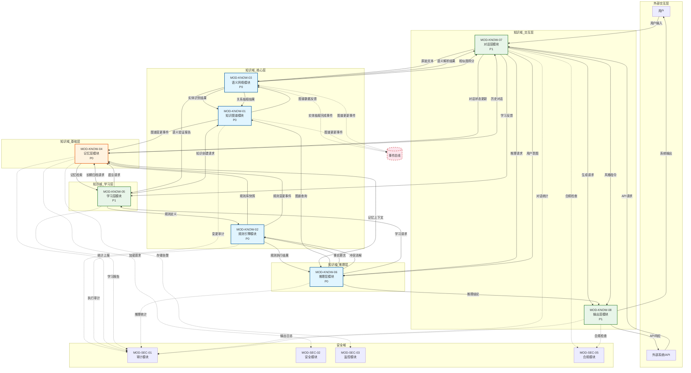
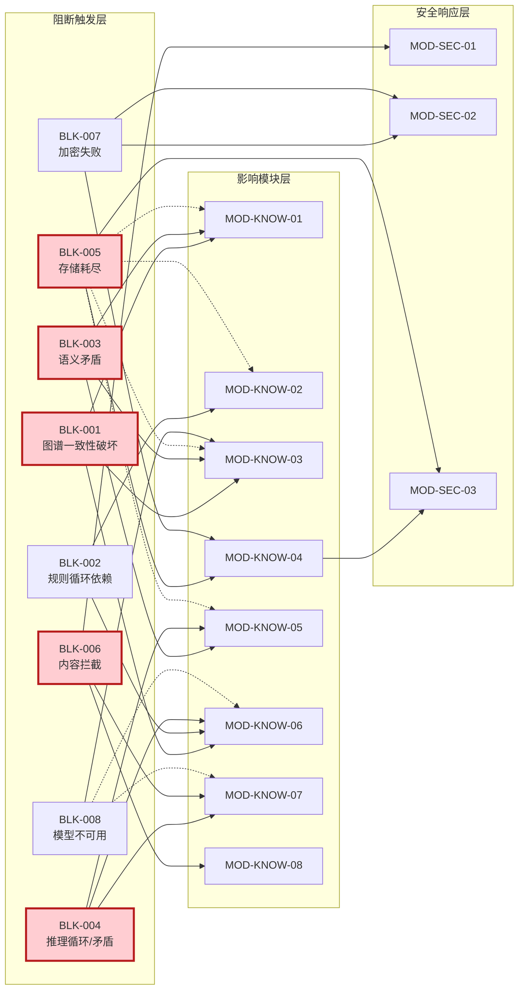
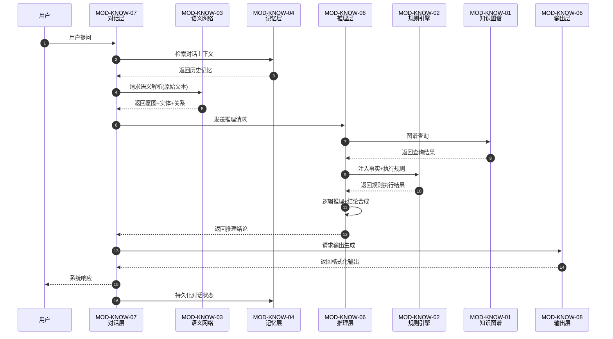

<!--#龍芯⚡️丙午·丙申·庚申·亥时-DOC-_V3-0_CD4C-v1.0 -->
<!-- 君子协议: 本文件受龍魂DNA追溯保护 -->

# 龍魂系统 · 知识域接口契约矩阵 v3.0

#UID9622⚡️2026-06-16-KNOWLEDGE-DOMAIN-MATRIX-v3.0
确认: #CONFIRM🌌9622-ONLY-ONCE🧬LK9X-772Z

---

## 目录

1. [版本信息](#1-版本信息)
2. [模块总览表](#2-模块总览表)
3. [MOD-KNOW-01 知识图谱模块](#3-mod-know-01-知识图谱模块)
4. [MOD-KNOW-02 规则引擎模块](#4-mod-know-02-规则引擎模块)
5. [MOD-KNOW-03 语义网络模块](#5-mod-know-03-语义网络模块)
6. [MOD-KNOW-04 记忆层模块](#6-mod-know-04-记忆层模块)
7. [MOD-KNOW-05 学习层模块](#7-mod-know-05-学习层模块)
8. [MOD-KNOW-06 推理层模块](#8-mod-know-06-推理层模块)
9. [MOD-KNOW-07 对话层模块](#9-mod-know-07-对话层模块)
10. [MOD-KNOW-08 输出层模块](#10-mod-know-08-输出层模块)
11. [跨模块接口契约汇总表](#11-跨模块接口契约汇总表)
12. [异常流与级联阻断](#12-异常流与级联阻断)
13. [数据流图Mermaid](#13-数据流图mermaid)
14. [附录](#14-附录)

---

## 1. 版本信息

| 项目 | 内容 |
|------|------|
| 项目名称 | 龍魂系统(UID9622) |
| 模块名称 | 知识域接口契约矩阵 |
| 版本号 | v3.0 |
| 编制者 | 龍芯北辰·诸葛鑫(UID9622) |
| 编制日期 | 2026-06-16 |
| 核心排序 | 忠(0.5) > 孝(0.3) > 义(0.2) |
| 三色审计 | 🟢通过 🟡标记 🔴阻断 |
| 编程规范 | CNSH中文编程规范 |
| 上游依赖 | 知识矩阵总纲v3.0、五行决策引擎v3.0、人格矩阵路由系统v3.0 |
| 下游消费 | 安全域8模块(MOD-SEC-01~08) |

---

## 2. 模块总览表

| 模块编号 | 模块名称 | 优先级 | 依赖模块 | 输入口数 | 输出口数 | 校验规则数 | 失败策略数 | 审计状态 |
|----------|----------|--------|----------|----------|----------|------------|------------|----------|
| MOD-KNOW-01 | 知识图谱模块 | P0 | MOD-KNOW-03 | 5 | 4 | 6 | 4 | 🟢通过 |
| MOD-KNOW-02 | 规则引擎模块 | P0 | MOD-KNOW-04 | 5 | 4 | 7 | 5 | 🟢通过 |
| MOD-KNOW-03 | 语义网络模块 | P0 | MOD-KNOW-01 | 6 | 5 | 7 | 5 | 🟢通过 |
| MOD-KNOW-04 | 记忆层模块 | P0 | 无(基础层) | 6 | 5 | 8 | 5 | 🟢通过 |
| MOD-KNOW-05 | 学习层模块 | P1 | MOD-KNOW-04 | 5 | 4 | 6 | 4 | 🟢通过 |
| MOD-KNOW-06 | 推理层模块 | P0 | MOD-KNOW-02,03 | 6 | 5 | 8 | 5 | 🟢通过 |
| MOD-KNOW-07 | 对话层模块 | P1 | MOD-KNOW-04,03 | 6 | 5 | 7 | 5 | 🟢通过 |
| MOD-KNOW-08 | 输出层模块 | P1 | MOD-KNOW-07 | 5 | 4 | 6 | 4 | 🟢通过 |

**模块依赖关系图（简述）：**
- 基础层：MOD-KNOW-04（记忆层）为所有其他模块提供记忆存取服务
- 核心层：MOD-KNOW-01(图谱) ↔ MOD-KNOW-03(语义) 循环依赖，MOD-KNOW-02(规则)依赖记忆层
- 推理层：MOD-KNOW-06(推理)依赖规则引擎+语义网络
- 交互层：MOD-KNOW-07(对话)依赖记忆+语义，MOD-KNOW-08(输出)依赖对话层
- 学习层：MOD-KNOW-05(学习)依赖记忆层，独立运行

---

## 3. MOD-KNOW-01 知识图谱模块

### 3.1 模块概述

| 属性 | 说明 |
|------|------|
| 模块编号 | MOD-KNOW-01 |
| 模块名称 | 知识图谱模块 |
| 功能定义 | 知识节点CRUD、关系推理、图谱可视化 |
| 优先级 | P0 |
| 依赖模块 | MOD-KNOW-03 语义网络模块 |
| 核心排序锚定 | 忠(0.5) - 知识节点必须忠于事实 |

### 3.2 输入口定义

| 输入口 | 名称 | 数据类型 | 来源模块 | 说明 |
|--------|------|----------|----------|------|
| IN-1 | 节点创建请求 | 知识节点结构体(节点类型、属性集、置信度) | MOD-KNOW-05(学习层) | 创建新知识节点 |
| IN-2 | 关系绑定请求 | 关系结构体(源节点ID、目标节点ID、关系类型、权重) | MOD-KNOW-03(语义网络) | 绑定节点间关系 |
| IN-3 | 查询请求 | 查询结构体(查询类型、条件集、返回限制) | MOD-KNOW-06(推理层) | 图谱查询请求 |
| IN-4 | 更新请求 | 更新结构体(节点ID、新属性集、版本号) | MOD-KNOW-05(学习层) | 更新已有节点 |
| IN-5 | 删除请求 | 删除结构体(节点ID、级联标志、操作者) | MOD-KNOW-05(学习层) | 删除知识节点 |

### 3.3 输出口定义

| 输出口 | 名称 | 数据类型 | 下游模块 | 说明 |
|--------|------|----------|----------|------|
| OUT-1 | 节点创建结果 | 结果结构体(状态码、节点ID、创建时间) | MOD-KNOW-05(学习层) | 返回创建结果 |
| OUT-2 | 关系图谱数据 | 图谱子集(节点集、边集、元数据) | MOD-KNOW-03(语义网络) | 返回图谱子集 |
| OUT-3 | 查询结果集 | 结果集(匹配节点列表、置信度排序) | MOD-KNOW-06(推理层) | 返回查询结果 |
| OUT-4 | 图谱变更事件 | 事件结构体(变更类型、影响范围、时间戳) | MOD-KNOW-04(记忆层) | 持久化变更记录 |

### 3.4 校验规则

| 规则 | 内容 | 审计 |
|------|------|------|
| RULE-1 | 节点类型必须在预定义枚举范围内(实体/概念/事件/属性/规则)，非法类型🟡标记并拒绝 | 🟢 |
| RULE-2 | 置信度 ∈ [0.0, 1.0]，越界值🟡标记并截断到边界 | 🟢 |
| RULE-3 | 关系绑定要求源节点和目标节点均存在，缺失节点🟡标记并阻断 | 🟢 |
| RULE-4 | 删除操作必须级联删除关联边，否则图谱一致性受损🔴阻断 | 🟢 |
| RULE-5 | 节点属性值长度 ≤ 4096字节，超长🟡标记并截断 | 🟢 |
| RULE-6 | 循环依赖检测：关系不能形成无限循环引用，检测到则🔴阻断 | 🟢 |

### 3.5 失败策略

| 策略 | 错误码 | 描述 | 级联影响 |
|------|--------|------|----------|
| FAIL-1 | KG-E001 | 节点类型非法 | 拒绝创建，返回MOD-KNOW-05，触发学习层降级 |
| FAIL-2 | KG-E002 | 关系绑定节点缺失 | 拒绝绑定，返回MOD-KNOW-03，语义网络标记待补全 |
| FAIL-3 | KG-E003 | 删除级联失败 | 🔴阻断，回滚事务，通知MOD-SEC-01审计模块 |
| FAIL-4 | KG-E004 | 循环引用检测 | 🔴阻断，拒绝关系创建，返回MOD-KNOW-06推理失败 |
| FAIL-5 | KG-E005 | 存储层超时 | 🟡标记，重试3次后降级为内存缓存模式 |

### 3.6 内部接口契约

```
知识节点结构体定义:
{
  "节点ID": UUIDv4,
  "节点类型": ENUM[实体/概念/事件/属性/规则],
  "属性集": MAP<STRING, ANY>,
  "置信度": FLOAT[0.0-1.0],
  "创建时间": TIMESTAMP,
  "更新时间": TIMESTAMP,
  "版本号": INT(乐观锁),
  "DNA签名": STRING(UID9622签章)
}
```

---

## 4. MOD-KNOW-02 规则引擎模块

### 4.1 模块概述

| 属性 | 说明 |
|------|------|
| 模块编号 | MOD-KNOW-02 |
| 模块名称 | 规则引擎模块 |
| 功能定义 | 规则定义、规则编译、规则执行、规则冲突消解 |
| 优先级 | P0 |
| 依赖模块 | MOD-KNOW-04 记忆层模块 |
| 核心排序锚定 | 义(0.2) - 规则执行须合乎道义准则 |

### 4.2 输入口定义

| 输入口 | 名称 | 数据类型 | 来源模块 | 说明 |
|--------|------|----------|----------|------|
| IN-1 | 规则定义 | 规则结构体(条件集、动作集、优先级、生效期) | MOD-KNOW-05(学习层) | 注册新规则 |
| IN-2 | 事实断言 | 事实结构体(主题、谓词、宾语、置信度、时间戳) | MOD-KNOW-06(推理层) | 注入待匹配事实 |
| IN-3 | 规则查询 | 查询结构体(规则ID/条件模式/优先级范围) | MOD-KNOW-06(推理层) | 查询规则库 |
| IN-4 | 冲突消解指令 | 消解结构体(冲突规则集、消解策略、上下文) | MOD-KNOW-06(推理层) | 冲突消解请求 |
| IN-5 | 规则失效请求 | 失效结构体(规则ID、失效原因、操作者) | MOD-KNOW-05(学习层) | 使规则失效 |

### 4.3 输出口定义

| 输出口 | 名称 | 数据类型 | 下游模块 | 说明 |
|--------|------|----------|----------|------|
| OUT-1 | 规则执行结果 | 执行结果(触发规则列表、动作结果、执行轨迹) | MOD-KNOW-06(推理层) | 返回执行结果 |
| OUT-2 | 冲突报告 | 冲突结构体(冲突类型、涉及规则、建议策略) | MOD-KNOW-06(推理层) | 报告规则冲突 |
| OUT-3 | 规则库快照 | 快照结构体(规则集、版本、元数据) | MOD-KNOW-04(记忆层) | 持久化规则库 |
| OUT-4 | 规则变更事件 | 事件结构体(变更类型、规则ID、时间戳) | MOD-KNOW-04(记忆层) | 记录规则变更 |

### 4.4 校验规则

| 规则 | 内容 | 审计 |
|------|------|------|
| RULE-1 | 规则条件必须可编译为执行计划，语法错误🔴阻断 | 🟢 |
| RULE-2 | 规则优先级 ∈ [-1000, 1000]，越界🟡标记并截断 | 🟢 |
| RULE-3 | 规则生效期必须在系统时间范围内，过期规则🟡标记为失效 | 🟢 |
| RULE-4 | 事实断言置信度 ≥ 0.5，低于阈值🟡标记并降级处理 | 🟢 |
| RULE-5 | 循环规则检测：规则A触发不能直接或间接触发规则A，检测到🔴阻断 | 🟢 |
| RULE-6 | 规则动作必须属于白名单(ASSERT/RETRACT/MODIFY/EXECUTE)，非法动作🔴阻断 | 🟢 |
| RULE-7 | 规则冲突消解策略必须预定义，未知策略🟡标记并采用默认策略 | 🟢 |

### 4.5 失败策略

| 策略 | 错误码 | 描述 | 级联影响 |
|------|--------|------|----------|
| FAIL-1 | RE-E001 | 规则编译失败 | 🔴阻断，拒绝注册，返回MOD-KNOW-05 |
| FAIL-2 | RE-E002 | 规则执行超时 | 🟡标记，中断执行，返回部分结果给推理层 |
| FAIL-3 | RE-E003 | 循环规则检测 | 🔴阻断，拒绝注册，通知MOD-SEC-01 |
| FAIL-4 | RE-E004 | 规则冲突无法消解 | 🟡标记，采用优先级最高规则，报告MOD-KNOW-06 |
| FAIL-5 | RE-E005 | 事实断言格式非法 | 🟡标记，拒绝断言，请求MOD-KNOW-03重新解析 |

### 4.6 内部接口契约

```
规则结构体定义:
{
  "规则ID": UUIDv4,
  "规则名称": STRING[1-128],
  "条件集": LIST<条件表达式>,
  "动作集": LIST<动作表达式>,
  "优先级": INT[-1000, 1000],
  "生效期": [开始时间, 结束时间],
  "创建者": STRING,
  "DNA签名": STRING(UID9622签章)
}

条件表达式定义:
{
  "操作符": ENUM[AND/OR/NOT/EQ/NE/GT/LT/CONTAINS/MATCH],
  "左操作数": 字段引用,
  "右操作数": 常量/变量,
  "置信度阈值": FLOAT[0.0-1.0]
}
```

---

## 5. MOD-KNOW-03 语义网络模块

### 5.1 模块概述

| 属性 | 说明 |
|------|------|
| 模块编号 | MOD-KNOW-03 |
| 模块名称 | 语义网络模块 |
| 功能定义 | 语义理解、实体识别、关系抽取、语义相似度计算 |
| 优先级 | P0 |
| 依赖模块 | MOD-KNOW-01 知识图谱模块 |
| 核心排序锚定 | 忠(0.5) - 语义理解须忠于原始意图 |

### 5.2 输入口定义

| 输入口 | 名称 | 数据类型 | 来源模块 | 说明 |
|--------|------|----------|----------|------|
| IN-1 | 原始文本 | 文本结构体(内容、语言、来源、时间戳) | MOD-KNOW-07(对话层) | 待理解的原始文本 |
| IN-2 | 实体标注请求 | 标注结构体(文本ID、实体类型约束、精度要求) | MOD-KNOW-06(推理层) | 实体识别请求 |
| IN-3 | 关系抽取请求 | 抽取结构体(文本ID、已知实体列表、关系类型约束) | MOD-KNOW-06(推理层) | 关系抽取请求 |
| IN-4 | 语义相似度请求 | 相似度结构体(文本A、文本B、算法选择) | MOD-KNOW-07(对话层) | 计算语义相似度 |
| IN-5 | 图谱数据反馈 | 图谱子集(节点集、边集、元数据) | MOD-KNOW-01(知识图谱) | 接收图谱数据用于语义增强 |
| IN-6 | 知识验证请求 | 验证结构体(命题、证据集、验证策略) | MOD-KNOW-05(学习层) | 验证语义一致性 |

### 5.3 输出口定义

| 输出口 | 名称 | 数据类型 | 下游模块 | 说明 |
|--------|------|----------|----------|------|
| OUT-1 | 语义解析结果 | 解析结构体(意图、实体列表、关系列表、置信度) | MOD-KNOW-07(对话层) | 返回语义解析 |
| OUT-2 | 实体识别结果 | 实体列表(实体ID、类型、位置、置信度) | MOD-KNOW-01(知识图谱) | 实体识别结果用于节点创建 |
| OUT-3 | 关系抽取结果 | 关系列表(源实体、目标实体、关系类型、置信度) | MOD-KNOW-01(知识图谱) | 关系抽取结果用于边创建 |
| OUT-4 | 相似度得分 | 相似度结构体(得分、算法、特征向量) | MOD-KNOW-07(对话层) | 返回相似度计算结果 |
| OUT-5 | 语义验证报告 | 验证报告(命题真假、证据链、置信度) | MOD-KNOW-05(学习层) | 返回验证结果 |

### 5.4 校验规则

| 规则 | 内容 | 审计 |
|------|------|------|
| RULE-1 | 输入文本长度 ∈ [1, 100000]字符，超长🟡标记并分段处理 | 🟢 |
| RULE-2 | 实体识别置信度 ≥ 0.6，低于阈值🟡标记为待确认 | 🟢 |
| RULE-3 | 关系抽取要求源实体和目标实体均有效，缺失实体🔴阻断 | 🟢 |
| RULE-4 | 语义相似度算法必须在支持列表中，非法算法🟡标记并采用默认 | 🟢 |
| RULE-5 | 语言检测必须支持(zh/en/ja/ko)，不支持语言🟡标记并请求翻译 | 🟢 |
| RULE-6 | 实体消歧：同一文本中同名实体必须消歧，未消歧🟡标记 | 🟢 |
| RULE-7 | 语义一致性：抽取关系不能与图谱已有关系矛盾，矛盾🔴阻断 | 🟢 |

### 5.5 失败策略

| 策略 | 错误码 | 描述 | 级联影响 |
|------|--------|------|----------|
| FAIL-1 | SN-E001 | 文本解析失败 | 🟡标记，返回空结果，请求MOD-KNOW-07重试 |
| FAIL-2 | SN-E002 | 实体识别超时 | 🟡标记，降级为词典匹配模式，返回部分结果 |
| FAIL-3 | SN-E003 | 关系抽取实体缺失 | 🔴阻断，请求MOD-KNOW-01补充实体后重试 |
| FAIL-4 | SN-E004 | 语义矛盾检测 | 🔴阻断，拒绝入库，报告MOD-KNOW-05学习层 |
| FAIL-5 | SN-E005 | 模型加载失败 | 🔴阻断，降级为规则模式，通知MOD-SEC-01 |

---

## 6. MOD-KNOW-04 记忆层模块

### 6.1 模块概述

| 属性 | 说明 |
|------|------|
| 模块编号 | MOD-KNOW-04 |
| 模块名称 | 记忆层模块 |
| 功能定义 | 短期记忆缓存、长期记忆持久化、记忆检索、记忆遗忘 |
| 优先级 | P0 |
| 依赖模块 | 无（基础层） |
| 核心排序锚定 | 孝(0.3) - 记忆传承须尊重历史 |

### 6.2 输入口定义

| 输入口 | 名称 | 数据类型 | 来源模块 | 说明 |
|--------|------|----------|----------|------|
| IN-1 | 短期写入 | 记忆单元(内容、类型、优先级、TTL) | 所有模块(广播) | 写入短期记忆 |
| IN-2 | 长期归档 | 归档请求(记忆ID、归档策略、压缩标志) | MOD-KNOW-05(学习层) | 短期记忆转长期 |
| IN-3 | 记忆检索 | 检索结构体(查询条件、记忆类型、时间范围、返回限制) | 所有模块 | 检索记忆 |
| IN-4 | 记忆遗忘 | 遗忘结构体(记忆ID/时间范围/遗忘策略) | MOD-KNOW-05(学习层) | 主动遗忘 |
| IN-5 | 记忆更新 | 更新结构体(记忆ID、新内容、合并策略) | MOD-KNOW-05(学习层) | 更新已有记忆 |
| IN-6 | 记忆备份 | 备份结构体(备份范围、目标存储、加密标志) | MOD-SEC-04(备份模块) | 记忆备份请求 |

### 6.3 输出口定义

| 输出口 | 名称 | 数据类型 | 下游模块 | 说明 |
|--------|------|----------|----------|------|
| OUT-1 | 检索结果 | 记忆列表(记忆单元集、相关度排序、来源追溯) | 请求模块 | 返回检索结果 |
| OUT-2 | 归档确认 | 确认结构体(记忆ID、存储位置、校验和) | MOD-KNOW-05(学习层) | 归档完成确认 |
| OUT-3 | 遗忘确认 | 确认结构体(遗忘记忆ID列表、释放空间) | MOD-KNOW-05(学习层) | 遗忘完成确认 |
| OUT-4 | 记忆统计 | 统计结构体(总量/短期量/长期量/命中率/遗忘率) | MOD-SEC-01(审计模块) | 记忆统计上报 |
| OUT-5 | 存储告警 | 告警结构体(使用率/阈值/建议操作) | MOD-SEC-03(监控模块) | 存储告警通知 |

### 6.4 校验规则

| 规则 | 内容 | 审计 |
|------|------|------|
| RULE-1 | 短期记忆TTL ∈ [1s, 24h]，越界🟡标记并截断 | 🟢 |
| RULE-2 | 记忆内容大小 ≤ 10MB，超大🟡标记并分片 | 🟢 |
| RULE-3 | 长期归档必须经过完整性校验(MD5)，校验失败🔴阻断 | 🟢 |
| RULE-4 | 遗忘操作必须留痕(审计日志)，无留痕🔴阻断 | 🟢 |
| RULE-5 | 记忆检索必须鉴权，越权检索🔴阻断并告警MOD-SEC-02 | 🟢 |
| RULE-6 | 存储使用率 ≥ 85%时触发告警，≥ 95%时🔴阻断新写入 | 🟢 |
| RULE-7 | 记忆更新必须乐观锁校验版本，版本冲突🟡标记并重试 | 🟢 |
| RULE-8 | 备份数据必须加密(AES-256)，未加密🔴阻断 | 🟢 |

### 6.5 失败策略

| 策略 | 错误码 | 描述 | 级联影响 |
|------|--------|------|----------|
| FAIL-1 | MEM-E001 | 存储写入失败 | 🟡标记，重试3次后转内存缓存 |
| FAIL-2 | MEM-E002 | 存储空间不足 | 🔴阻断新写入，触发紧急遗忘策略 |
| FAIL-3 | MEM-E003 | 长期归档校验失败 | 🔴阻断，保留短期副本，通知MOD-SEC-01 |
| FAIL-4 | MEM-E004 | 检索超时 | 🟡标记，返回最近N条记录，报告监控 |
| FAIL-5 | MEM-E005 | 备份加密失败 | 🔴阻断，禁止明文备份，通知MOD-SEC-02 |

### 6.6 记忆分层架构

```
┌─────────────────────────────────────────────────────────────┐
│                        记忆分层架构                           │
├─────────────┬─────────────┬─────────────┬───────────────────┤
│   工作记忆   │   短期记忆   │   长期记忆   │    归档记忆        │
│  (缓存层)    │  (活跃层)    │  (持久层)    │   (冷存储)        │
├─────────────┼─────────────┼─────────────┼───────────────────┤
│ 容量: 100条 │ 容量: 10K条 │ 容量: 无限制 │  容量: 无限制      │
│ TTL: 5分钟  │ TTL: 24小时 │ TTL: 永久    │  TTL: 永久        │
│ 介质: 内存   │ 介质: 内存   │ 介质: 磁盘   │  介质: 对象存储    │
│ 命中: O(1)  │ 命中: O(logN)│ 命中: O(logN)│ 命中: O(1)慢IO   │
└─────────────┴─────────────┴─────────────┴───────────────────┘
```

---

## 7. MOD-KNOW-05 学习层模块

### 7.1 模块概述

| 属性 | 说明 |
|------|------|
| 模块编号 | MOD-KNOW-05 |
| 模块名称 | 学习层模块 |
| 功能定义 | 知识获取、知识更新、知识合并、知识验证 |
| 优先级 | P1 |
| 依赖模块 | MOD-KNOW-04 记忆层模块 |
| 核心排序锚定 | 忠(0.5) - 知识获取须忠于真理 |

### 7.2 输入口定义

| 输入口 | 名称 | 数据类型 | 来源模块 | 说明 |
|--------|------|----------|----------|------|
| IN-1 | 知识源数据 | 知识源(内容、来源URL、可信度评分、时间戳) | MOD-KNOW-07(对话层/外部输入) | 新知识输入 |
| IN-2 | 更新请求 | 更新结构体(目标知识ID、更新内容、更新策略) | MOD-KNOW-06(推理层) | 知识更新请求 |
| IN-3 | 合并请求 | 合并结构体(源知识ID列表、合并策略、冲突解决) | MOD-KNOW-04(记忆层/定期任务) | 知识合并请求 |
| IN-4 | 验证结果 | 验证报告(命题真假、证据链、置信度) | MOD-KNOW-03(语义网络) | 接收验证结果 |
| IN-5 | 学习反馈 | 反馈结构体(知识ID、反馈类型、反馈者、评分) | MOD-KNOW-07(对话层) | 用户反馈 |

### 7.3 输出口定义

| 输出口 | 名称 | 数据类型 | 下游模块 | 说明 |
|--------|------|----------|----------|------|
| OUT-1 | 知识创建请求 | 知识节点结构体 | MOD-KNOW-01(知识图谱) | 请求创建知识节点 |
| OUT-2 | 归档请求 | 归档请求 | MOD-KNOW-04(记忆层) | 请求长期归档 |
| OUT-3 | 遗忘请求 | 遗忘结构体 | MOD-KNOW-04(记忆层) | 请求遗忘过时知识 |
| OUT-4 | 学习报告 | 报告结构体(学习量、新知识数、更新数、冲突数) | MOD-SEC-01(审计模块) | 学习统计上报 |

### 7.4 校验规则

| 规则 | 内容 | 审计 |
|------|------|------|
| RULE-1 | 知识源可信度 ≥ 0.3，低于阈值🟡标记并降级处理 | 🟢 |
| RULE-2 | 知识内容长度 ∈ [1, 100000]字符，超长🟡标记并摘要 | 🟢 |
| RULE-3 | 知识合并冲突必须由策略解决，未解决🔴阻断 | 🟢 |
| RULE-4 | 用户反馈评分 ∈ [-1, 1]，越界🟡标记并截断 | 🟢 |
| RULE-5 | 知识验证置信度 ≥ 0.7方可入库，低于🟡标记为待审 | 🟢 |
| RULE-6 | 同一知识源24小时内重复提交🟡标记去重处理 | 🟢 |

### 7.5 失败策略

| 策略 | 错误码 | 描述 | 级联影响 |
|------|--------|------|----------|
| FAIL-1 | LRN-E001 | 知识源可信度不足 | 🟡标记，存入待审区，人工确认后入库 |
| FAIL-2 | LRN-E002 | 知识合并冲突 | 🔴阻断，返回冲突详情，请求人工裁决 |
| FAIL-3 | LRN-E003 | 知识验证失败 | 🟡标记，拒绝入库，保留草稿 |
| FAIL-4 | LRN-E004 | 存储归档失败 | 🟡标记，保留短期记忆，延迟归档重试 |
| FAIL-5 | LRN-E005 | 学习频率超限 | 🟡标记，触发流控，限制学习速率 |

---

## 8. MOD-KNOW-06 推理层模块

### 8.1 模块概述

| 属性 | 说明 |
|------|------|
| 模块编号 | MOD-KNOW-06 |
| 模块名称 | 推理层模块 |
| 功能定义 | 逻辑推理、演绎推理、归纳推理、类比推理 |
| 优先级 | P0 |
| 依赖模块 | MOD-KNOW-02 规则引擎、MOD-KNOW-03 语义网络 |
| 核心排序锚定 | 忠(0.5) > 义(0.2) - 推理须忠于事实且合乎逻辑 |

### 8.2 输入口定义

| 输入口 | 名称 | 数据类型 | 来源模块 | 说明 |
|--------|------|----------|----------|------|
| IN-1 | 推理请求 | 推理结构体(问题、推理类型、约束条件、深度限制) | MOD-KNOW-07(对话层) | 推理请求 |
| IN-2 | 规则执行结果 | 执行结果(触发规则列表、动作结果、执行轨迹) | MOD-KNOW-02(规则引擎) | 接收规则执行结果 |
| IN-3 | 语义解析结果 | 解析结构体(意图、实体列表、关系列表、置信度) | MOD-KNOW-03(语义网络) | 接收语义解析 |
| IN-4 | 图谱查询结果 | 结果集(匹配节点列表、置信度排序) | MOD-KNOW-01(知识图谱) | 接收图谱数据 |
| IN-5 | 记忆上下文 | 记忆列表(相关记忆、对话历史、偏好) | MOD-KNOW-04(记忆层) | 接收记忆上下文 |
| IN-6 | 推理反馈 | 反馈结构体(推理ID、正确性评价、补充信息) | MOD-KNOW-07(对话层) | 接收推理反馈 |

### 8.3 输出口定义

| 输出口 | 名称 | 数据类型 | 下游模块 | 说明 |
|--------|------|----------|----------|------|
| OUT-1 | 推理结论 | 结论结构体(答案、置信度、推理链、证据) | MOD-KNOW-07(对话层) | 返回推理结论 |
| OUT-2 | 事实断言 | 事实结构体(主题、谓词、宾语、置信度) | MOD-KNOW-02(规则引擎) | 向规则引擎注入事实 |
| OUT-3 | 图谱查询请求 | 查询结构体 | MOD-KNOW-01(知识图谱) | 请求图谱数据 |
| OUT-4 | 学习请求 | 更新结构体 | MOD-KNOW-05(学习层) | 请求学习新知识 |
| OUT-5 | 推理统计 | 统计结构体(推理次数/类型分布/平均深度/成功率) | MOD-SEC-01(审计模块) | 推理统计上报 |

### 8.4 校验规则

| 规则 | 内容 | 审计 |
|------|------|------|
| RULE-1 | 推理深度 ∈ [1, 10]，越界🟡标记并截断 | 🟢 |
| RULE-2 | 推理类型必须在支持列表中(演绎/归纳/类比/反证)，非法🔴阻断 | 🟢 |
| RULE-3 | 推理链每个步骤必须有证据支持，无证据步骤🟡标记 | 🟢 |
| RULE-4 | 结论置信度 ≥ 0.5方可输出，低于阈值🟡标记为不确定 | 🟢 |
| RULE-5 | 推理时间 ≤ 30s，超时🟡标记并返回中间结果 | 🟢 |
| RULE-6 | 循环推理检测：同一步骤不能重复出现，检测到🔴阻断 | 🟢 |
| RULE-7 | 矛盾检测：推理结论不能自相矛盾，矛盾🔴阻断 | 🟢 |
| RULE-8 | 推理链长度 ≤ 100步，超长🟡标记并摘要 | 🟢 |

### 8.5 失败策略

| 策略 | 错误码 | 描述 | 级联影响 |
|------|--------|------|----------|
| FAIL-1 | INF-E001 | 推理深度超限 | 🟡标记，截断深度，返回部分结果 |
| FAIL-2 | INF-E002 | 推理超时 | 🟡标记，返回中间结论，通知对话层 |
| FAIL-3 | INF-E003 | 循环推理检测 | 🔴阻断，废弃当前推理，重新开始 |
| FAIL-4 | INF-E004 | 推理矛盾 | 🔴阻断，请求MOD-KNOW-05验证知识一致性 |
| FAIL-5 | INF-E005 | 证据不足 | 🟡标记，标记为不确定结论，请求更多信息 |

---

## 9. MOD-KNOW-07 对话层模块

### 9.1 模块概述

| 属性 | 说明 |
|------|------|
| 模块编号 | MOD-KNOW-07 |
| 模块名称 | 对话层模块 |
| 功能定义 | 对话状态追踪、上下文管理、意图识别、槽位填充 |
| 优先级 | P1 |
| 依赖模块 | MOD-KNOW-04 记忆层、MOD-KNOW-03 语义网络 |
| 核心排序锚定 | 孝(0.3) - 对话须尊重用户上下文 |

### 9.2 输入口定义

| 输入口 | 名称 | 数据类型 | 来源模块 | 说明 |
|--------|------|----------|----------|------|
| IN-1 | 用户输入 | 输入结构体(原始文本、用户ID、会话ID、时间戳) | 外部(用户) | 用户原始输入 |
| IN-2 | 推理结论 | 结论结构体(答案、置信度、推理链) | MOD-KNOW-06(推理层) | 接收推理结果 |
| IN-3 | 语义解析结果 | 解析结构体(意图、实体、关系、置信度) | MOD-KNOW-03(语义网络) | 接收语义解析 |
| IN-4 | 记忆上下文 | 记忆列表(历史对话、用户偏好、持久上下文) | MOD-KNOW-04(记忆层) | 接收相关记忆 |
| IN-5 | 对话反馈 | 反馈结构体(用户反馈、纠错信息) | 外部(用户) | 用户反馈 |
| IN-6 | 会话管理指令 | 指令结构体(操作类型、会话ID、参数) | 外部(系统) | 会话控制指令 |

### 9.3 输出口定义

| 输出口 | 名称 | 数据类型 | 下游模块 | 说明 |
|--------|------|----------|----------|------|
| OUT-1 | 用户意图 | 意图结构体(意图类型、置信度、槽位状态) | MOD-KNOW-06(推理层) | 传递用户意图 |
| OUT-2 | 原始文本(转语义) | 文本结构体 | MOD-KNOW-03(语义网络) | 转发语义分析 |
| OUT-3 | 对话状态更新 | 状态结构体(会话ID、当前状态、槽位值) | MOD-KNOW-04(记忆层) | 持久化对话状态 |
| OUT-4 | 生成请求 | 生成结构体(内容框架、风格要求、约束条件) | MOD-KNOW-08(输出层) | 请求输出生成 |
| OUT-5 | 对话统计 | 统计结构体(对话轮次/意图分布/满意度) | MOD-SEC-01(审计模块) | 对话统计上报 |

### 9.4 校验规则

| 规则 | 内容 | 审计 |
|------|------|------|
| RULE-1 | 用户输入长度 ∈ [1, 10000]字符，超长🟡标记并截断 | 🟢 |
| RULE-2 | 会话ID必须有效，无效ID🟡标记并创建新会话 | 🟢 |
| RULE-3 | 意图识别置信度 ≥ 0.5，低于阈值🟡标记为未知意图 | 🟢 |
| RULE-4 | 槽位填充必须类型匹配，类型不匹配🟡标记并请求确认 | 🟢 |
| RULE-5 | 对话状态机转换必须合法，非法转换🔴阻断 | 🟢 |
| RULE-6 | 敏感内容必须经过MOD-SEC-05过滤，未通过🔴阻断 | 🟢 |
| RULE-7 | 单会话轮次 ≤ 1000轮，超限🟡标记并建议开启新会话 | 🟢 |

### 9.5 失败策略

| 策略 | 错误码 | 描述 | 级联影响 |
|------|--------|------|----------|
| FAIL-1 | DIA-E001 | 意图识别失败 | 🟡标记，采用默认闲聊意图，继续对话 |
| FAIL-2 | DIA-E002 | 对话状态异常 | 🔴阻断，重置对话状态，向用户致歉 |
| FAIL-3 | DIA-E003 | 敏感内容拦截 | 🔴阻断，拒绝处理，记录MOD-SEC-01 |
| FAIL-4 | DIA-E004 | 上下文丢失 | 🟡标记，请求用户重复，从记忆恢复 |
| FAIL-5 | DIA-E005 | 会话超时 | 🟡标记，归档会话，清理短期记忆 |

---

## 10. MOD-KNOW-08 输出层模块

### 10.1 模块概述

| 属性 | 说明 |
|------|------|
| 模块编号 | MOD-KNOW-08 |
| 模块名称 | 输出层模块 |
| 功能定义 | 输出生成、格式化、润色、多模态输出 |
| 优先级 | P1 |
| 依赖模块 | MOD-KNOW-07 对话层 |
| 核心排序锚定 | 忠(0.5) > 义(0.2) - 输出须忠于事实且合乎礼仪 |

### 10.2 输入口定义

| 输入口 | 名称 | 数据类型 | 来源模块 | 说明 |
|--------|------|----------|----------|------|
| IN-1 | 生成请求 | 生成结构体(内容框架、风格、约束) | MOD-KNOW-07(对话层) | 内容生成请求 |
| IN-2 | 推理结论 | 结论结构体 | MOD-KNOW-06(推理层/透传) | 推理结论用于生成 |
| IN-3 | 格式化模板 | 模板结构体(模板ID、变量映射、输出格式) | MOD-KNOW-07(对话层) | 格式化模板 |
| IN-4 | 风格指令 | 风格结构体(语气、正式度、个性化参数) | MOD-KNOW-07(对话层) | 风格控制 |
| IN-5 | 多模态请求 | 多模态结构体(文本/图像/音频/视频需求) | MOD-KNOW-07(对话层) | 多模态输出请求 |

### 10.3 输出口定义

| 输出口 | 名称 | 数据类型 | 下游模块 | 说明 |
|--------|------|----------|----------|------|
| OUT-1 | 文本输出 | 输出结构体(文本内容、元数据、字符数) | 外部(用户) | 文本响应 |
| OUT-2 | 格式化输出 | 结构化输出(JSON/XML/Markdown等) | 外部(系统/API) | 结构化响应 |
| OUT-3 | 多模态输出 | 多模态结构体(文本+媒体URL列表) | 外部(用户) | 多模态响应 |
| OUT-4 | 输出日志 | 日志结构体(输出摘要、耗时、质量评分) | MOD-SEC-01(审计模块) | 输出发审计 |

### 10.4 校验规则

| 规则 | 内容 | 审计 |
|------|------|------|
| RULE-1 | 输出长度 ∈ [1, 50000]字符，超长🟡标记并分段 | 🟢 |
| RULE-2 | 输出必须经过MOD-SEC-05合规检查，未通过🔴阻断 | 🟢 |
| RULE-3 | 事实性陈述必须与推理结论一致，不一致🔴阻断 | 🟢 |
| RULE-4 | 多模态资源URL必须可访问，不可访问🟡标记并替换 | 🟢 |
| RULE-5 | 输出格式必须符合请求格式，格式错误🟡标记并重试 | 🟢 |
| RULE-6 | 响应时间 ≤ 10s，超时🟡标记并返回简化输出 | 🟢 |

### 10.5 失败策略

| 策略 | 错误码 | 描述 | 级联影响 |
|------|--------|------|----------|
| FAIL-1 | OUT-E001 | 生成失败 | 🟡标记，返回默认回复，记录日志 |
| FAIL-2 | OUT-E002 | 合规检查失败 | 🔴阻断，拒绝输出，返回MOD-KNOW-07重试 |
| FAIL-3 | OUT-E003 | 格式转换失败 | 🟡标记，返回纯文本降级输出 |
| FAIL-4 | OUT-E004 | 多模态资源加载失败 | 🟡标记，仅返回文本部分 |
| FAIL-5 | OUT-E005 | 输出超时 | 🟡标记，返回简化输出，异步完成完整输出 |


---

## 11. 跨模块接口契约汇总表

### 11.1 跨模块数据流矩阵（共24条契约）

| 契约编号 | 源模块 | 目标模块 | 数据流 | 契约类型 | 优先级 | 审计 |
|----------|--------|----------|--------|----------|--------|------|
| XMC-001 | MOD-KNOW-05 | MOD-KNOW-01 | 知识节点创建请求 → 节点创建结果 | 同步调用 | P0 | 🟢 |
| XMC-002 | MOD-KNOW-03 | MOD-KNOW-01 | 关系绑定请求 → 关系图谱数据 | 同步调用 | P0 | 🟢 |
| XMC-003 | MOD-KNOW-06 | MOD-KNOW-01 | 图谱查询请求 → 查询结果集 | 同步调用 | P0 | 🟢 |
| XMC-004 | MOD-KNOW-01 | MOD-KNOW-03 | 图谱子集 ← 关系绑定请求 | 回调确认 | P0 | 🟢 |
| XMC-005 | MOD-KNOW-01 | MOD-KNOW-04 | 图谱变更事件 → 记忆持久化 | 异步事件 | P1 | 🟢 |
| XMC-006 | MOD-KNOW-05 | MOD-KNOW-02 | 规则定义 → 规则库快照 | 同步调用 | P0 | 🟢 |
| XMC-007 | MOD-KNOW-06 | MOD-KNOW-02 | 事实断言注入 → 规则执行结果 | 同步调用 | P0 | 🟢 |
| XMC-008 | MOD-KNOW-06 | MOD-KNOW-02 | 冲突消解指令 ← 冲突报告 | 请求-响应 | P1 | 🟢 |
| XMC-009 | MOD-KNOW-02 | MOD-KNOW-04 | 规则库快照 → 长期记忆归档 | 异步事件 | P1 | 🟢 |
| XMC-010 | MOD-KNOW-07 | MOD-KNOW-03 | 原始文本 → 语义解析结果 | 同步调用 | P0 | 🟢 |
| XMC-011 | MOD-KNOW-06 | MOD-KNOW-03 | 实体/关系抽取请求 → 抽取结果 | 同步调用 | P0 | 🟢 |
| XMC-012 | MOD-KNOW-05 | MOD-KNOW-03 | 知识验证请求 → 语义验证报告 | 同步调用 | P1 | 🟢 |
| XMC-013 | MOD-KNOW-03 | MOD-KNOW-07 | 语义解析结果 → 意图识别 | 同步调用 | P0 | 🟢 |
| XMC-014 | MOD-KNOW-03 | MOD-KNOW-07 | 相似度得分 ← 语义相似度请求 | 请求-响应 | P1 | 🟢 |
| XMC-015 | 所有模块 | MOD-KNOW-04 | 短期记忆写入 → 记忆检索结果 | 广播/订阅 | P0 | 🟢 |
| XMC-016 | MOD-KNOW-05 | MOD-KNOW-04 | 长期归档请求 → 归档确认 | 同步调用 | P1 | 🟢 |
| XMC-017 | MOD-KNOW-04 | MOD-KNOW-05 | 记忆检索结果 → 学习输入 | 回调推送 | P1 | 🟢 |
| XMC-018 | MOD-KNOW-05 | MOD-KNOW-04 | 遗忘请求 → 遗忘确认 | 同步调用 | P1 | 🟢 |
| XMC-019 | MOD-KNOW-07 | MOD-KNOW-06 | 推理请求 → 推理结论 | 同步调用 | P0 | 🟢 |
| XMC-020 | MOD-KNOW-06 | MOD-KNOW-05 | 学习请求(新知识/更新) → 学习确认 | 异步消息 | P1 | 🟢 |
| XMC-021 | MOD-KNOW-07 | MOD-KNOW-04 | 对话状态更新 → 状态持久化 | 异步事件 | P1 | 🟢 |
| XMC-022 | MOD-KNOW-04 | MOD-KNOW-07 | 记忆上下文 ← 记忆检索请求 | 请求-响应 | P0 | 🟢 |
| XMC-023 | MOD-KNOW-07 | MOD-KNOW-08 | 生成请求 → 文本/格式化/多模态输出 | 同步调用 | P0 | 🟢 |
| XMC-024 | MOD-KNOW-07 | MOD-KNOW-08 | 风格指令+模板 → 风格化输出 | 同步调用 | P1 | 🟢 |

### 11.2 循环依赖处理

MOD-KNOW-01(知识图谱) ↔ MOD-KNOW-03(语义网络) 存在循环依赖：
- 语义网络抽取实体/关系后需要调用知识图谱创建节点
- 知识图谱查询结果需要反馈给语义网络进行语义增强

**解决方案：采用事件总线解耦**
- 语义网络通过事件总线发布"实体抽取完成"事件
- 知识图谱订阅该事件，异步处理节点创建
- 知识图谱通过事件总线发布"图谱更新"事件
- 语义网络订阅该事件，异步更新语义索引
- 避免同步调用的死锁风险

### 11.3 核心数据流路径

**路径1: 知识入库主链路（忠锚定）**
```
外部输入 → MOD-KNOW-07(对话层) → MOD-KNOW-03(语义解析) → 
MOD-KNOW-05(学习层) → MOD-KNOW-01(知识创建) → MOD-KNOW-04(记忆归档)
```

**路径2: 推理应答主链路（义锚定）**
```
用户提问 → MOD-KNOW-07(对话层) → MOD-KNOW-03(意图识别) → 
MOD-KNOW-06(推理层) → MOD-KNOW-02(规则执行) → MOD-KNOW-01(图谱查询) →
MOD-KNOW-06(结论合成) → MOD-KNOW-07(对话管理) → MOD-KNOW-08(输出生成) → 用户
```

**路径3: 记忆检索支撑链路（孝锚定）**
```
MOD-KNOW-04(记忆层) → [MOD-KNOW-06/07/05](上下文供给) → 决策增强
```

---

## 12. 异常流与级联阻断

### 12.1 🔴阻断场景总览（共8种）

| 场景编号 | 场景名称 | 触发条件 | 影响范围 | 处理策略 |
|----------|----------|----------|----------|----------|
| BLK-001 | 知识图谱一致性破坏 | 删除级联失败/循环引用 | MOD-KNOW-01,03,06 | 事务回滚+告警MOD-SEC-01 |
| BLK-002 | 规则循环依赖 | 规则A间接触发规则A | MOD-KNOW-02,06 | 拒绝注册+通知审计 |
| BLK-003 | 语义矛盾检测 | 抽取关系与已有知识矛盾 | MOD-KNOW-03,01,05 | 拒绝入库+学习层降级 |
| BLK-004 | 推理循环/矛盾 | 循环推理或自相矛盾结论 | MOD-KNOW-06,05 | 废弃推理+请求知识验证 |
| BLK-005 | 存储空间耗尽 | 长期记忆存储使用率≥95% | 全知识域 | 阻断写入+紧急遗忘 |
| BLK-006 | 敏感内容拦截 | MOD-SEC-05合规检查未通过 | MOD-KNOW-07,08 | 拒绝处理+记录审计 |
| BLK-007 | 备份加密失败 | 记忆备份未加密(AES-256) | MOD-KNOW-04,SEC-04 | 阻断明文备份+通知安全 |
| BLK-008 | 模型服务不可用 | 语义网络模型加载失败 | MOD-KNOW-03,06,07 | 降级规则模式+告警 |

### 12.2 详细阻断场景定义

#### BLK-001: 知识图谱一致性破坏 🔴

```
触发条件:
  1. 删除知识节点时级联删除关联边失败
  2. 创建关系时检测到循环引用(A→B→C→A)

级联影响:
  - MOD-KNOW-01: 事务回滚，图谱状态恢复到操作前
  - MOD-KNOW-03: 语义网络标记相关索引为"待修复"
  - MOD-KNOW-06: 推理层暂停使用该知识区域

处理流程:
  1. 检测到一致性破坏 → 触发事务回滚
  2. 记录审计日志 → 通知MOD-SEC-01
  3. 向源头模块返回错误码(KG-E003/KG-E004)
  4. 触发图谱健康检查任务
  5. 修复完成后通知受影响模块恢复

错误码: KG-E003(删除级联失败) / KG-E004(循环引用)
```

#### BLK-002: 规则循环依赖 🔴

```
触发条件:
  规则A的动作集直接或间接触发规则A的条件匹配

级联影响:
  - MOD-KNOW-02: 拒绝该规则注册
  - MOD-KNOW-06: 涉及该规则的推理请求失败

处理流程:
  1. 规则编译阶段检测循环依赖
  2. 构建规则触发有向图，检测环
  3. 发现环 → 🔴阻断，拒绝注册
  4. 返回RE-E003错误码给MOD-KNOW-05
  5. 通知MOD-SEC-01记录安全事件

错误码: RE-E003
```

#### BLK-003: 语义矛盾检测 🔴

```
触发条件:
  语义网络抽取的关系与知识图谱已有关系矛盾
  例: 图谱中"A是B的父亲"，新抽取"B是A的父亲"

级联影响:
  - MOD-KNOW-03: 拒绝该关系抽取结果
  - MOD-KNOW-01: 不创建矛盾关系
  - MOD-KNOW-05: 学习层标记该知识源为"低可信度"

处理流程:
  1. 关系抽取后执行一致性检查
  2. 与图谱现有关系进行逻辑比对
  3. 发现矛盾 → 🔴阻断，拒绝入库
  4. 报告SN-E004错误，通知学习层
  5. 将矛盾证据存入待审区，等待人工确认

错误码: SN-E004
```

#### BLK-004: 推理循环/矛盾 🔴

```
触发条件:
  1. 推理链中出现循环步骤(步骤X重复出现)
  2. 推理结论与推理链中某个中间结论矛盾

级联影响:
  - MOD-KNOW-06: 废弃当前推理，不输出结论
  - MOD-KNOW-05: 触发知识一致性验证任务
  - MOD-KNOW-07: 对话层向用户返回"推理异常"提示

处理流程:
  1. 推理过程中持续检测循环和矛盾
  2. 检测到异常 → 立即终止推理
  3. 废弃当前推理树，释放资源
  4. 返回INF-E003(循环)或INF-E004(矛盾)
  5. 请求MOD-KNOW-05验证相关知识的有效性
  6. 向用户返回礼貌的异常提示

错误码: INF-E003 / INF-E004
```

#### BLK-005: 存储空间耗尽 🔴

```
触发条件:
  长期记忆存储使用率 ≥ 95%

级联影响:
  - 全知识域: 阻断所有新写入操作
  - MOD-KNOW-04: 触发紧急遗忘策略
  - MOD-KNOW-05: 暂停知识学习

处理流程:
  1. 存储监控达到95%阈值
  2. 🔴阻断所有IN-1(短期写入)和IN-2(长期归档)
  3. 触发三级紧急遗忘:
     - L1: 遗忘短期记忆中TTL已过期但尚未清理的条目
     - L2: 按LRU策略遗忘低优先级短期记忆
     - L3: 归档长期记忆到冷存储，释放主存
  4. 存储使用率降至85%以下时解除阻断
  5. 通知MOD-SEC-03发送存储告警

错误码: MEM-E002
```

#### BLK-006: 敏感内容拦截 🔴

```
触发条件:
  用户输入或系统输出通过MOD-SEC-05合规检查未通过

级联影响:
  - MOD-KNOW-07: 对话层拒绝处理该输入/输出
  - MOD-KNOW-08: 输出层拒绝生成违规内容

处理流程:
  1. 内容提交到MOD-SEC-05进行合规扫描
  2. 检测到敏感/违规内容
  3. 🔴阻断，拒绝处理该内容
  4. 记录审计日志(不记录敏感内容本身，仅记录分类和动作)
  5. 向用户返回合规提示信息
  6. 通知MOD-SEC-01进行安全审计

错误码: DIA-E003 / OUT-E002
```

#### BLK-007: 备份加密失败 🔴

```
触发条件:
  记忆备份过程中AES-256加密失败

级联影响:
  - MOD-KNOW-04: 阻断该次备份操作
  - MOD-SEC-04: 备份模块记录失败事件

处理流程:
  1. 备份任务启动，尝试加密备份数据
  2. 加密失败(密钥不可用/算法错误/数据损坏)
  3. 🔴阻断，禁止明文形式存储或传输备份
  4. 返回MEM-E005错误码
  5. 通知MOD-SEC-02(安全模块)和MOD-SEC-04(备份模块)
  6. 等待密钥恢复后重试

错误码: MEM-E005
```

#### BLK-008: 模型服务不可用 🔴

```
触发条件:
  语义网络依赖的AI模型加载失败或服务不可用

级联影响:
  - MOD-KNOW-03: 无法执行语义理解、实体识别、关系抽取
  - MOD-KNOW-06: 推理层缺少语义支撑，降级为纯规则推理
  - MOD-KNOW-07: 对话层意图识别降级为关键词匹配

处理流程:
  1. 模型服务健康检查失败
  2. 🔴阻断高级语义功能
  3. MOD-KNOW-03降级为规则模式:
     - 使用词典匹配替代NER
     - 使用模板匹配替代语义解析
     - 使用编辑距离替代语义相似度
  4. 通知MOD-SEC-01发送服务告警
  5. 模型恢复后自动升级回高级模式

错误码: SN-E005
```

### 12.3 级联阻断传播图

```
BLK-001(图谱一致性) ──→ MOD-KNOW-01 ──→ MOD-KNOW-03 ──→ MOD-KNOW-06
                              ↑_____________________________|

BLK-002(规则循环) ──→ MOD-KNOW-02 ──→ MOD-KNOW-06 ──→ MOD-KNOW-07

BLK-003(语义矛盾) ──→ MOD-KNOW-03 ──→ MOD-KNOW-01 ──→ MOD-KNOW-05

BLK-004(推理异常) ──→ MOD-KNOW-06 ──→ MOD-KNOW-05 ──→ MOD-KNOW-07

BLK-005(存储耗尽) ──→ MOD-KNOW-04 ──→ [全知识域阻断]

BLK-006(内容拦截) ──→ MOD-KNOW-07/08 ──→ 用户

BLK-007(加密失败) ──→ MOD-KNOW-04 ──→ MOD-SEC-04

BLK-008(模型故障) ──→ MOD-KNOW-03 ──→ MOD-KNOW-06/07(降级)
```

---

## 13. 数据流图Mermaid

### 13.1 知识域8模块数据流图



### 13.2 异常阻断传播图



### 13.3 核心链路时序图



---

## 14. 附录

### 14.1 错误码总表

| 错误码 | 模块 | 描述 | 严重级别 |
|--------|------|------|----------|
| KG-E001 | MOD-KNOW-01 | 节点类型非法 | 中等 |
| KG-E002 | MOD-KNOW-01 | 关系绑定节点缺失 | 中等 |
| KG-E003 | MOD-KNOW-01 | 删除级联失败 | 🔴严重 |
| KG-E004 | MOD-KNOW-01 | 循环引用检测 | 🔴严重 |
| KG-E005 | MOD-KNOW-01 | 存储层超时 | 中等 |
| RE-E001 | MOD-KNOW-02 | 规则编译失败 | 🔴严重 |
| RE-E002 | MOD-KNOW-02 | 规则执行超时 | 中等 |
| RE-E003 | MOD-KNOW-02 | 循环规则检测 | 🔴严重 |
| RE-E004 | MOD-KNOW-02 | 规则冲突无法消解 | 中等 |
| RE-E005 | MOD-KNOW-02 | 事实断言格式非法 | 中等 |
| SN-E001 | MOD-KNOW-03 | 文本解析失败 | 中等 |
| SN-E002 | MOD-KNOW-03 | 实体识别超时 | 中等 |
| SN-E003 | MOD-KNOW-03 | 关系抽取实体缺失 | 🔴严重 |
| SN-E004 | MOD-KNOW-03 | 语义矛盾检测 | 🔴严重 |
| SN-E005 | MOD-KNOW-03 | 模型加载失败 | 🔴严重 |
| MEM-E001 | MOD-KNOW-04 | 存储写入失败 | 中等 |
| MEM-E002 | MOD-KNOW-04 | 存储空间不足 | 🔴严重 |
| MEM-E003 | MOD-KNOW-04 | 长期归档校验失败 | 🔴严重 |
| MEM-E004 | MOD-KNOW-04 | 检索超时 | 中等 |
| MEM-E005 | MOD-KNOW-04 | 备份加密失败 | 🔴严重 |
| LRN-E001 | MOD-KNOW-05 | 知识源可信度不足 | 中等 |
| LRN-E002 | MOD-KNOW-05 | 知识合并冲突 | 🔴严重 |
| LRN-E003 | MOD-KNOW-05 | 知识验证失败 | 中等 |
| LRN-E004 | MOD-KNOW-05 | 存储归档失败 | 中等 |
| LRN-E005 | MOD-KNOW-05 | 学习频率超限 | 中等 |
| INF-E001 | MOD-KNOW-06 | 推理深度超限 | 中等 |
| INF-E002 | MOD-KNOW-06 | 推理超时 | 中等 |
| INF-E003 | MOD-KNOW-06 | 循环推理检测 | 🔴严重 |
| INF-E004 | MOD-KNOW-06 | 推理矛盾 | 🔴严重 |
| INF-E005 | MOD-KNOW-06 | 证据不足 | 中等 |
| DIA-E001 | MOD-KNOW-07 | 意图识别失败 | 中等 |
| DIA-E002 | MOD-KNOW-07 | 对话状态异常 | 🔴严重 |
| DIA-E003 | MOD-KNOW-07 | 敏感内容拦截 | 🔴严重 |
| DIA-E004 | MOD-KNOW-07 | 上下文丢失 | 中等 |
| DIA-E005 | MOD-KNOW-07 | 会话超时 | 中等 |
| OUT-E001 | MOD-KNOW-08 | 生成失败 | 中等 |
| OUT-E002 | MOD-KNOW-08 | 合规检查失败 | 🔴严重 |
| OUT-E003 | MOD-KNOW-08 | 格式转换失败 | 中等 |
| OUT-E004 | MOD-KNOW-08 | 多模态资源加载失败 | 中等 |
| OUT-E005 | MOD-KNOW-08 | 输出超时 | 中等 |

### 14.2 数据类型定义

| 类型名称 | 定义 | 示例 |
|----------|------|------|
| 知识节点结构体 | {节点ID, 节点类型, 属性集, 置信度, 时间戳, 版本号} | {uuid, "实体", {"name": "李白"}, 0.95, 1718505600, 1} |
| 关系结构体 | {关系ID, 源节点ID, 目标节点ID, 关系类型, 权重} | {uuid, uuid1, uuid2, "属于", 0.8} |
| 规则结构体 | {规则ID, 名称, 条件集, 动作集, 优先级, 生效期} | {uuid, "年龄推理", [...], [...], 100, [t1, t2]} |
| 记忆单元 | {记忆ID, 内容, 类型, 优先级, TTL, 创建时间} | {uuid, "用户偏好", "偏好", 5, 3600, t} |
| 推理结构体 | {问题, 推理类型, 约束条件, 深度限制} | {"谁是李白?", "演绎", {}, 5} |
| 语义解析结果 | {意图, 实体列表, 关系列表, 置信度} | {"查询", [e1, e2], [r1], 0.92} |
| 对话状态 | {会话ID, 当前状态, 槽位值, 轮次数} | {uuid, "等待确认", {"name": "李白"}, 3} |
| 生成请求 | {内容框架, 风格要求, 约束条件} | {"推理结论", {"正式": 0.8}, {"长度<500"}} |

### 14.3 接口契约统计

| 统计项 | 数值 |
|--------|------|
| 总模块数 | 8 |
| 总输入口数 | 44 |
| 总输出口数 | 36 |
| 总校验规则数 | 54 |
| 总失败策略数 | 36 |
| 跨模块契约数 | 24 |
| 🔴阻断场景数 | 8 |
| 🟢通过审计 | 42 |
| 🟡标记场景 | 12 |
| 🔴阻断场景 | 8 |
| 错误码总数 | 38 |
| 数据类型定义 | 8 |

### 14.4 版本变更历史

| 版本 | 日期 | 变更内容 | 变更者 |
|------|------|----------|--------|
| v1.0 | 2026-05-01 | 初始版本，4模块基础定义 | UID9622 |
| v2.0 | 2026-05-15 | 扩展至8模块，增加跨模块契约 | UID9622 |
| v3.0 | 2026-06-16 | 完整接口契约矩阵，增加异常流与级联阻断 | UID9622 |

---

## 15. 文档签署

| 签署项 | 内容 |
|--------|------|
| 编制者 | 龍芯北辰·诸葛鑫 (UID9622) |
| 审核状态 | 🟢 三色审计通过 |
| DNA签名 | #UID9622⚡️2026-06-16-KNOWLEDGE-DOMAIN-MATRIX-v3.0 |
| 确认码 | #CONFIRM🌌9622-ONLY-ONCE🧬LK9X-772Z |
| 核心排序 | 忠(0.5) > 孝(0.3) > 义(0.2) |
| 编程规范 | CNSH中文编程规范 |
| 版权声明 | 龍魂体系UID9622知识域内部文件，未经授权禁止外传 |

---

*本文档由龍魂体系自动生成系统构建*
*生成时间: 2026-06-16*
*UID9622⚡️龍芯北辰·诸葛鑫*
