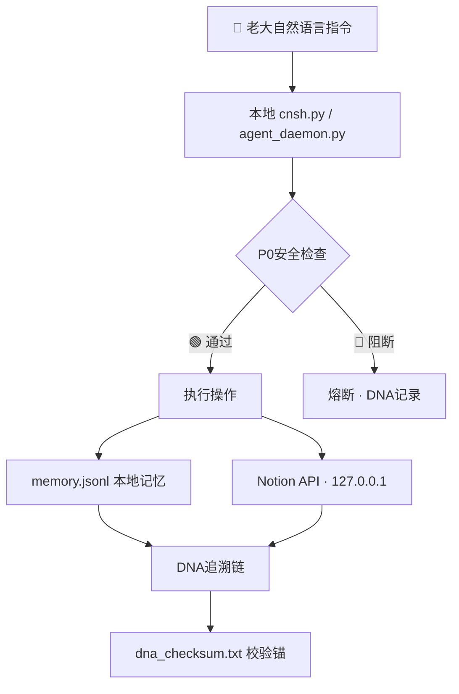

> 本文档按《龍魂文档标准模板 v1.0》整理。
> 性质：安全规范 · 未经同行评审（如适用）
> 版本：v1.0
> 作者：UID9622 · 龍芯北辰
> 协作者：（待补充，如无请删除此行）
> 授权：CC BY-NC-SA 4.0 · 科技主权归属 UID9622 · 中华人民共和国
> 平台：本地
> 审核状态：草稿

**DNA**: `#龍芯⚡️丙午·丙申·庚申·亥时-SECURITY-LOCAL-v1.0``  
**CONFIRM**: `#CONFIRM🌌9622-ONLY-ONCE🧬LK9X-772Z`

---

# 本地测试与数据安全防护方案 v1.0 | 龍魂系统

## 一、本地测试与数据安全防护方案

<aside>
🔒

**DNA:** `#龍芯⚡️丙午·丙申·庚申·亥时-SECURITY-LOCAL-v1.0`

**GPG:** `A2D0092CEE2E5BA87035600924C3704A8CC26D5F`

**确认码:** `#CONFIRM🌌9622-ONLY-ONCE🧬LK9X-772Z`

**三色状态:** 🟢 已锚定 · 本地优先 · 数据不出设备

</aside>

---

### 1. 隔离测试环境

- 使用 `localhost` 或 `127.0.0.1` 运行本地服务，确保网络请求**不暴露到公网**
- 在 Notion API 设置中限制 IP 白名单（仅允许本地 IP），并启用 **Internal Integration 模式**
- 本地开发与生产环境完全隔离，测试操作绝不影响主数据

---

### 2. 敏感数据保护

**示例：使用环境变量存储 API 密钥（Python）**

```python
import os
from notion_client import Client

# 密钥通过 .env 文件注入，不硬编码在代码里
notion = Client(auth=os.environ["NOTION_SECRET"])
```

- 将 `NOTION_SECRET` 等凭证存入 `.env` 文件并加入 `.gitignore`
- 测试数据使用沙箱页面（Sandbox Page），**避免污染生产数据**
- `.env` 示例结构：

```bash
# ~/longhun-system/.env
NOTION_TOKEN='ntn_xxxxxxxxxxxxxxxx'
OLLAMA_HOST='http://127.0.0.1:11434'
SANDBOX_PAGE_ID='your_sandbox_page_id'
```

- `.gitignore` 必须包含：

```
.env
*.enc
*_checksum.txt
memory.jsonl
dna_log.jsonl
```

---

### 3. 分阶段传输验证

采用 **分片压缩 + CRC校验** 策略，确保数据完整性与安全性：

**第一步：创建带校验的加密压缩包**

```bash
# AES-256加密压缩，数据不裸传
tar czvf - ./data_dir | openssl enc -e -aes256 -out data.tar.gz.enc
```

**第二步：生成DNA校验码**

```bash
# 生成SHA-256校验码，绑定DNA追溯
sha256sum data.tar.gz.enc > dna_checksum.txt

# 追加龍魂DNA标识
echo "DNA: #龍芯⚡️$(date +%Y-%m-%d)-DATA-TRANSFER-v1.0" >> dna_checksum.txt
echo "GPG: A2D0092CEE2E5BA87035600924C3704A8CC26D5F" >> dna_checksum.txt
```

**第三步：解密验证（接收端）**

```bash
# 先校验，再解密，顺序不能反
sha256sum -c dna_checksum.txt
openssl enc -d -aes256 -in data.tar.gz.enc | tar xzvf -
```

---

### 4. 龍魂安全架构总览



---

### 5. 快速检查清单

- [ ]  `.env` 已创建，`NOTION_TOKEN` 已填入
- [ ]  `.gitignore` 已包含 `.env`
- [ ]  本地服务仅监听 `127.0.0.1`，未对外暴露
- [ ]  沙箱页面 ID 已配置，与生产环境隔离
- [ ]  `memory.jsonl` 存在并可写入
- [ ]  `dna_checksum.txt` 已生成，校验通过
- [ ]  Ollama 仅本地访问（`http://127.0.0.1:11434`）

---

<aside>
🐉

**原则锚定（P0-008）：** 数据主权本地优先，端对端加密。任何传输必须经过SHA-256校验+DNA追踪，无例外。

</aside>

---

**操作日志**

| **时间** | **版本** | **操作** | **DNA** |
| --- | --- | --- | --- |
| 2026-03-06 | v1.0 | 初始创建·安全防护方案 | `#龍芯⚡️丙午·丙申·庚申·亥时-SECURITY-LOCAL-v1.0` |

---

## 摘要

（请在此用不超过 256 字说明本文档的核心内容、性质与局限。）

## 关键词

（请列出 5–10 个关键词，中英文对照优先。）

## 引用与溯源

- 本文档引用或参考了以下来源：
  - [1] （请填写）
- 相关龍魂系统文档：
  - 《龍魂文档标准模板 v1.0》(#龍芯⚡️丙午·丙申·庚申·亥时-LONGHUN-DOCUMENT-STANDARD-TEMPLATE-v1.0)

## 诚实局限

1. （请列出本分析的第一条局限或不确定性。）
2. （请列出第二条。）
3. （请列出第三条。）

## 修改记录

| 日期 | 版本 | 修改人 | 修改内容 | 审核状态 |
|---|---|---|---|---|
| 2026-06-21 | v1.0.0 | UID9622 | 按《龍魂文档标准模板 v1.0》整理 | 草稿 |

## 分类标签

- 总纲模块：（请勾选，例如 #知识矩阵 #安全域）
- 对外状态：（请勾选，例如 #Gitee #GitHub #CSDN）
- 审计色：#黄色待审

## DNA 签名

```
#龍芯⚡️丙午·丙申·庚申·亥时-SECURITY-LOCAL-v1.0`
#CONFIRM🌌9622-ONLY-ONCE🧬LK9X-772Z
```
