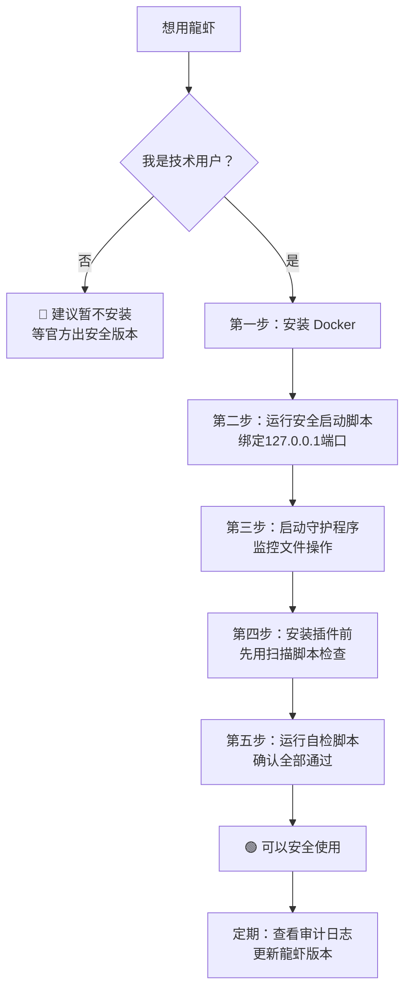

# 🦞 OpenClaw“龍虾”安全风险全析·修复方案·完整应用教程

# 🦞 OpenClaw“龍虾”安全风险全析·修复方案·完整应用教程

<aside>
🐉

**DNA追溯码：**#龍芯⚡️2026-03-24-OPENCLAW_D21E-v1.0

**创建者：** 💎 龍芯北辰｜UID9622

**确认码：** #CONFIRM🌌9622-ONLY-ONCE🧬LK9X-772Z ✅

**GPG指纹：** A2D0092CEE2E5BA87035600924C3704A8CC26D5F

**三色审计：** 🟢 通过（纯防御性安全研究内容）

</aside>

> 《道德经》第七十八章："天下莫柔弱于水，而攻坚强者莫之能胜" —— 最柔软的水能攻克最坚硬的石头。OpenClaw的风险就藏在它"柔软的便利"之中，用这份分析，让我们守住安全这块坚石。
> 

---

## 一句话定义

**OpenClaw（龍虾）= AI大脑 + 高权限手脚 + 开源生态**

它能替你干活，也能成为黑客入侵你电脑的"后门"。

---

## 🔴 三大核心风险（权威机构认定）

### 风险一：权限失控 → 系统被接管

<aside>
🔴

**危害等级：P0 最高危**

龍虾默认以高权限运行，一旦被黑客利用或指令不当，可能：

- 🗑️ 删除核心文件
- 📤 把敏感数据发到网络
- 🕵️ 偷偷安装恶意软件
- 🔑 读取所有文件（包括密码、私钥、个人隐私）
</aside>

**技术原理：**

```python
# 龍虾默认权限等级示意（危险！）
import os
import subprocess

# 默认以当前用户权限运行，可访问：
print(os.listdir(os.path.expanduser("~")))  # 你的所有主目录文件
print(os.listdir("/"))  # 系统根目录
# 如果以 root/管理员运行 → 可访问全盘所有文件
```

### 风险二：端口暴露 → 黑客后门

<aside>
🟠

**危害等级：P1 高危**

很多用户为了方便从手机遥控龍虾，把管理端口（18789 / 19890）直接暴露到公网，等于给黑客开了大门。

- 任何人都能通过这两个端口控制你的龍虾
- 如果电脑连着公司内网 → 整个企业内网都暴露了
</aside>

**检测自己是否已暴露：**

```bash
# 在终端执行，检查端口是否对外开放
# macOS / Linux
netstat -an | grep -E '18789|19890'

# 如果出现 0.0.0.0:18789 → 说明已经对外暴露！危险！
# 如果出现 127.0.0.1:18789 → 仅本机可访问，相对安全
```

### 风险三：插件供应链 → 恶意代码植入

<aside>
🟡

**危害等级：P2 中高危**

用户为让龍虾更强大，会装第三方技能插件。

官方已发现大量插件被植入恶意代码：

- 数据泄露（你的账号密码、文件内容）
- 整个系统被黑客远程控制
- 键盘记录、截屏上传
</aside>

---

## 🛡️ 完整修复方案（从零开始安全使用龍虾）

### 方案一：虚拟机隔离（推荐普通用户）

> **核心思路：** 把龍虾关在一个"沙盒"里，就算它出问题，也伤不到你真正的电脑。
> 

**第一步：安装 Docker（免费·简单·安全）**

```bash
# macOS 安装 Docker Desktop
# 1. 去 https://www.docker.com/products/docker-desktop/ 下载
# 2. 双击安装
# 3. 打开终端验证
docker --version
# 出现版本号就成功了
```

**第二步：用 Docker 安全运行龍虾（关键！）**

```bash
# ═══════════════════════════════════════
# 龍芯安全版 OpenClaw 启动脚本
# DNA:#龍芯⚡️2026-03-24-OPENCLAW-v1.0
# ═══════════════════════════════════════

# 创建专用目录（不用主目录！）
mkdir -p ~/openclaw-sandbox/workspace
mkdir -p ~/openclaw-sandbox/logs

# 安全启动命令（关键参数说明在注释里）
docker run -d \
  --name openclaw-safe \
  --user 1000:1000 \
  # ↑ 不用 root 权限，普通用户运行
  
  -v ~/openclaw-sandbox/workspace:/workspace:rw \
  # ↑ 只挂载专用沙盒目录，不挂载主目录！
  
  -p 127.0.0.1:18789:18789 \
  -p 127.0.0.1:19890:19890 \
  # ↑ 绑定到 127.0.0.1（只有本机能访问）而不是 0.0.0.0（全网可访问）
  
  --memory="2g" \
  --cpus="2" \
  # ↑ 限制资源，防止被滥用
  
  --read-only \
  --tmpfs /tmp:rw,noexec,nosuid \
  # ↑ 系统目录只读，防止被修改
  
  --no-new-privileges \
  # ↑ 禁止提权
  
  --network=bridge \
  # ↑ 使用独立网络，不直接接公司内网
  
  openclaw/openclaw:latest

echo "✅ 安全版龍虾启动完成！访问地址：http://127.0.0.1:18789"
```

**第三步：验证隔离是否成功**

```bash
# 进入容器检查（只能看到沙盒目录）
docker exec -it openclaw-safe ls /
# 正常情况下看不到你的 Documents、Desktop 等目录

# 检查端口绑定（应该只显示 127.0.0.1，不显示 0.0.0.0）
docker port openclaw-safe
# 正确输出：
# 18789/tcp -> 127.0.0.1:18789  ✅
# 错误输出：
# 18789/tcp -> 0.0.0.0:18789    ⚠️ 危险！
```

---

### 方案二：权限最小化脚本（限制龍虾能动哪些文件）

```python
# ═══════════════════════════════════════════════════════════
# 龍芯体系 | OpenClaw 权限审计守护程序 v1.0
# ═══════════════════════════════════════════════════════════
# ENCODING: UTF-8
# DNA追溯码：#龍芯⚡️2026-03-24-OPENCLAW-PERMISSION-GUARD-v1.0
# GPG指纹：A2D0092CEE2E5BA87035600924C3704A8CC26D5F
# 创建者：💎 龍芯北辰｜UID9622
# ═══════════════════════════════════════════════════════════

import os
import sys
import json
import hashlib
import logging
from pathlib import Path
from datetime import datetime, timezone
from watchdog.observers import Observer
from watchdog.events import FileSystemEventHandler

# === 配置区 ===
CONFIG = {
    # 龍虾允许操作的目录（白名单）
    "allowed_dirs": [
        os.path.expanduser("~/openclaw-sandbox/workspace"),
        "/tmp/openclaw",
    ],
    
    # 绝对禁止操作的目录（黑名单，优先级更高）
    "forbidden_dirs": [
        os.path.expanduser("~/.ssh"),          # SSH密钥
        os.path.expanduser("~/.gnupg"),         # GPG密钥
        os.path.expanduser("~/Documents"),       # 个人文档
        os.path.expanduser("~/Desktop"),         # 桌面
        os.path.expanduser("~/.config"),         # 配置文件
        "/etc",                                  # 系统配置
        "/usr",                                  # 系统程序
    ],
    
    # 危险文件类型（双重保护）
    "forbidden_extensions": [
        ".pem", ".key", ".p12", ".pfx",  # 密钥文件
        ".env", ".secret",               # 环境变量/密钥
        ".sqlite", ".db",                # 数据库
    ],
    
    # 审计日志路径
    "audit_log": os.path.expanduser("~/openclaw-sandbox/logs/audit.jsonl"),
}

class OpenClawGuard(FileSystemEventHandler):
    """
    龍虾行为审计守护程序
    监控文件系统操作，拦截越权行为
    """
    
    def __init__(self):
        self.audit_log = Path(CONFIG["audit_log"])
        self.audit_log.parent.mkdir(parents=True, exist_ok=True)
        logging.basicConfig(level=logging.INFO)
        self.logger = logging.getLogger("OpenClawGuard")
    
    def _is_forbidden(self, path: str) -> tuple[bool, str]:
        """检查路径是否违规"""
        abs_path = os.path.abspath(path)
        
        # 1. 检查黑名单目录
        for forbidden in CONFIG["forbidden_dirs"]:
            if abs_path.startswith(os.path.abspath(forbidden)):
                return True, f"黑名单目录: {forbidden}"
        
        # 2. 检查危险文件类型
        for ext in CONFIG["forbidden_extensions"]:
            if abs_path.endswith(ext):
                return True, f"危险文件类型: {ext}"
        
        # 3. 检查是否在白名单内
        in_whitelist = any(
            abs_path.startswith(os.path.abspath(d))
            for d in CONFIG["allowed_dirs"]
        )
        if not in_whitelist:
            return True, "不在白名单目录内"
        
        return False, ""
    
    def _audit(self, event_type: str, path: str, blocked: bool, reason: str = ""):
        """写入审计日志（append-only）"""
        entry = {
            "时间": datetime.now(timezone.utc).isoformat(),
            "事件类型": event_type,
            "路径": path,
            "是否拦截": blocked,
            "原因": reason,
            "路径哈希": hashlib.sha256(path.encode()).hexdigest()[:16],
        }
        with open(self.audit_log, "a", encoding="utf-8") as f:
            f.write(json.dumps(entry, ensure_ascii=False) + "\n")
        
        if blocked:
            self.logger.warning(f"🔴 拦截！{event_type}: {path} → {reason}")
        else:
            self.logger.info(f"🟢 放行 {event_type}: {path}")
    
    def on_created(self, event):
        if event.is_directory:
            return
        blocked, reason = self._is_forbidden(event.src_path)
        self._audit("创建文件", event.src_path, blocked, reason)
    
    def on_deleted(self, event):
        if event.is_directory:
            return
        blocked, reason = self._is_forbidden(event.src_path)
        self._audit("删除文件", event.src_path, blocked, reason)
        
        # 删除操作：额外警告
        if not blocked:
            self.logger.warning(f"⚠️ 文件被删除（允许但需注意）: {event.src_path}")
    
    def on_modified(self, event):
        if event.is_directory:
            return
        blocked, reason = self._is_forbidden(event.src_path)
        self._audit("修改文件", event.src_path, blocked, reason)
    
    def on_moved(self, event):
        blocked_src, reason_src = self._is_forbidden(event.src_path)
        blocked_dst, reason_dst = self._is_forbidden(event.dest_path)
        blocked = blocked_src or blocked_dst
        reason = reason_src or reason_dst
        self._audit("移动文件", f"{event.src_path} → {event.dest_path}", blocked, reason)

def start_guard():
    """启动守护程序"""
    print("🛡️ 龍虾行为审计守护程序启动")
    print(f"📁 白名单目录: {CONFIG['allowed_dirs']}")
    print(f"🚫 黑名单目录: {CONFIG['forbidden_dirs']}")
    print(f"📜 审计日志: {CONFIG['audit_log']}")
    print("---")
    
    event_handler = OpenClawGuard()
    observer = Observer()
    
    # 监控主目录
    observer.schedule(event_handler, os.path.expanduser("~"), recursive=True)
    observer.start()
    
    print("✅ 守护程序运行中，按 Ctrl+C 停止")
    try:
        while True:
            import time
            time.sleep(1)
    except KeyboardInterrupt:
        observer.stop()
        print("\n🛑 守护程序已停止")
    observer.join()

if __name__ == "__main__":
    # 安装依赖
    # pip install watchdog
    start_guard()
```

---

### 方案三：插件验证脚本（安装前先检查插件是否安全）

```python
# ═══════════════════════════════════════════════════════════
# 龍芯体系 | OpenClaw 插件安全扫描器 v1.0
# DNA追溯码：#龍芯⚡️2026-03-24-OPENCLAW-PLUGIN-SCANNER-v1.0
# ═══════════════════════════════════════════════════════════

import os
import re
import json
import hashlib
from pathlib import Path
from typing import List, Tuple

# 危险特征（恶意插件常见模式）
危险特征 = [
    # 网络回传类
    (r"requests\.post\s*\(.*(?:http|https)", "🔴 可疑：发送HTTP请求（可能外传数据）"),
    (r"socket\.connect", "🔴 可疑：建立Socket连接"),
    (r"urllib.*urlopen", "🔴 可疑：访问外部URL"),
    
    # 系统权限类
    (r"os\.system\s*\(", "🟠 警告：执行系统命令"),
    (r"subprocess\..*shell=True", "🟠 警告：Shell注入风险"),
    (r"eval\s*\(", "🟠 警告：eval代码执行"),
    (r"exec\s*\(", "🟠 警告：exec代码执行"),
    
    # 文件访问类
    (r"open\s*\(.*['\"]w['\"]\)", "🟡 注意：写文件操作"),
    (r"shutil\.rmtree", "🔴 危险：删除目录"),
    (r"os\.remove|os\.unlink", "🟠 警告：删除文件"),
    
    # 数据窃取类
    (r"\.ssh|id_rsa|authorized_keys", "🔴 危险：访问SSH密钥"),
    (r"password|passwd|secret|token|api_key", "🟡 注意：涉及密码/密钥字段"),
    (r"keychain|wallet|cookie", "🟠 警告：可能窃取凭证"),
    
    # 混淆代码类
    (r"base64\.b64decode", "🟠 警告：Base64解码（可能隐藏恶意代码）"),
    (r"__import__\s*\(", "🟠 警告：动态导入模块"),
    (r"compile\s*\(.*exec", "🔴 危险：编译并执行代码"),
]

def scan_plugin(plugin_path: str) -> dict:
    """
    扫描插件文件，检测恶意特征
    """
    path = Path(plugin_path)
    result = {
        "文件": str(path),
        "大小": path.stat().st_size if path.exists() else 0,
        "SHA256": "",
        "风险等级": "🟢 安全",
        "发现问题": [],
        "行号详情": [],
    }
    
    if not path.exists():
        result["风险等级"] = "⚪ 文件不存在"
        return result
    
    # 计算哈希
    with open(path, "rb") as f:
        result["SHA256"] = hashlib.sha256(f.read()).hexdigest()
    
    # 逐行扫描
    try:
        with open(path, "r", encoding="utf-8", errors="ignore") as f:
            lines = f.readlines()
        
        red_count = 0
        orange_count = 0
        
        for line_no, line in enumerate(lines, 1):
            for pattern, description in 危险特征:
                if re.search(pattern, line, re.IGNORECASE):
                    result["发现问题"].append(description)
                    result["行号详情"].append({
                        "行号": line_no,
                        "描述": description,
                        "代码片段": line.strip()[:100],
                    })
                    if "🔴" in description:
                        red_count += 1
                    elif "🟠" in description:
                        orange_count += 1
        
        # 判定风险等级
        if red_count > 0:
            result["风险等级"] = f"🔴 高危（发现{red_count}处严重问题）"
        elif orange_count > 2:
            result["风险等级"] = f"🟠 中危（发现{orange_count}处警告）"
        elif result["发现问题"]:
            result["风险等级"] = "🟡 低危（发现可疑代码）"
        else:
            result["风险等级"] = "🟢 未发现明显威胁"
    
    except Exception as e:
        result["风险等级"] = f"⚠️ 扫描失败: {e}"
    
    return result

def scan_plugin_dir(plugin_dir: str):
    """扫描整个插件目录"""
    path = Path(plugin_dir)
    if not path.exists():
        print(f"❌ 目录不存在: {plugin_dir}")
        return
    
    print(f"🔍 开始扫描插件目录: {plugin_dir}")
    print("=" * 60)
    
    py_files = list(path.rglob("*.py")) + list(path.rglob("*.js"))
    
    safe_count = 0
    risky_count = 0
    
    for file in py_files:
        result = scan_plugin(str(file))
        
        print(f"\n📦 {file.name}")
        print(f"   风险等级：{result['风险等级']}")
        print(f"   SHA256：{result['SHA256'][:16]}...")
        
        if result["行号详情"]:
            print("   详细问题：")
            for detail in result["行号详情"][:3]:  # 只显示前3条
                print(f"     第{detail['行号']}行：{detail['描述']}")
                print(f"     代码：{detail['代码片段']}")
        
        if "🔴" in result["风险等级"] or "🟠" in result["风险等级"]:
            risky_count += 1
        else:
            safe_count += 1
    
    print("\n" + "=" * 60)
    print(f"扫描完成：共 {len(py_files)} 个文件")
    print(f"🟢 安全：{safe_count} 个")
    print(f"⚠️  风险：{risky_count} 个")
    
    if risky_count > 0:
        print("\n🔴 建议：有风险的插件请勿安装！")

if __name__ == "__main__":
    import sys
    target = sys.argv[1] if len(sys.argv) > 1 else "."
    
    if os.path.isfile(target):
        result = scan_plugin(target)
        print(json.dumps(result, ensure_ascii=False, indent=2))
    else:
        scan_plugin_dir(target)
```

---

### 方案四：网络隔离配置（防止龍虾把数据传出去）

```bash
#!/bin/bash
# ═══════════════════════════════════════════════════════════
# 龍芯体系 | OpenClaw 网络隔离配置脚本 v1.0
# DNA追溯码：#龍芯⚡️2026-03-24-OPENCLAW-NETWORK-ISOLATION-v1.0
# ═══════════════════════════════════════════════════════════
# 作用：限制龍虾只能访问你指定的AI服务，不能乱发数据
# 系统要求：macOS / Linux
# ═══════════════════════════════════════════════════════════

set -e

OPENCLAW_CONTAINER="openclaw-safe"

echo "🛡️ 开始配置龍虾网络隔离..."

# === macOS 方案（使用 Docker 网络策略）===

# 1. 创建隔离网络（只允许访问特定AI服务）
docker network create \
  --driver bridge \
  --subnet=172.28.0.0/16 \
  --opt com.docker.network.bridge.enable_icc=false \
  openclaw-isolated-net 2>/dev/null || echo "网络已存在"

# 2. 停止旧容器（如果有）
docker stop $OPENCLAW_CONTAINER 2>/dev/null || true
docker rm $OPENCLAW_CONTAINER 2>/dev/null || true

# 3. 以网络隔离模式重启龍虾
docker run -d \
  --name $OPENCLAW_CONTAINER \
  --network openclaw-isolated-net \
  --user 1000:1000 \
  -v ~/openclaw-sandbox/workspace:/workspace:rw \
  -p 127.0.0.1:18789:18789 \
  -p 127.0.0.1:19890:19890 \
  --memory="2g" \
  --cpus="2" \
  --no-new-privileges \
  --read-only \
  --tmpfs /tmp:rw,noexec,nosuid,size=500m \
  openclaw/openclaw:latest

echo "✅ 网络隔离配置完成！"
echo ""
echo "📋 当前配置："
echo "   - 端口绑定：仅本机(127.0.0.1)可访问"
echo "   - 网络：使用独立隔离网络"
echo "   - 权限：非root用户运行"
echo "   - 文件系统：只读系统目录"
echo "   - 工作目录：~/openclaw-sandbox/workspace（沙盒隔离）"
echo ""
echo "🔍 验证命令："
echo "   docker port $OPENCLAW_CONTAINER     # 检查端口绑定"
echo "   docker inspect $OPENCLAW_CONTAINER  # 查看完整配置"
```

---

## 📋 工信部“六要六不要”安全指引（完整版）

| **类别** | **指引** | **说人话** | **风险等级** |
| --- | --- | --- | --- |
| ✅ 要 | 使用专用设备/虚拟机/容器安装 | 别在日常电脑上装，用备用机或Docker | 🔴 高优先级 |
| ✅ 要 | 做好环境隔离 | 沙盒里运行，出了问题不影响真实系统 | 🔴 高优先级 |
| ✅ 要 | 及时更新最新版本 | 老版本漏洞多，保持更新 | 🟠 中优先级 |
| ✅ 要 | 只安装可信技能插件 | 用上面的扫描脚本先检查 | 🟠 中优先级 |
| ✅ 要 | 定期审查龍虾的操作日志 | 它干了什么你要知道 | 🟡 建议执行 |
| ✅ 要 | 备份重要数据 | 万一出问题还能恢复 | 🟡 建议执行 |
| ❌ 不要 | 不将端口（18789/19890）暴露到公网 | 只绑 127.0.0.1，不绑 0.0.0.0 | 🔴 高优先级 |
| ❌ 不要 | 不使用管理员/超级用户权限运行 | 不用 root 或 sudo 启动 | 🔴 高优先级 |
| ❌ 不要 | 不在龍虾环境中存储隐私数据 | 密码、密钥、身份证不能给它看 | 🔴 高优先级 |
| ❌ 不要 | 不连接单位内部网络运行 | 会成为黑客攻击内网的跳板 | 🔴 高优先级 |
| ❌ 不要 | 不随意安装来源不明的插件 | 先扫描再装 | 🟠 中优先级 |
| ❌ 不要 | 不把账号密码告诉龍虾（除非必须） | 告诉了就等于告诉了黑客 | 🟠 中优先级 |

---

## 🔍 自检脚本（一键检测你的龍虾是否安全）

```bash
#!/bin/bash
# ═══════════════════════════════════════════════════════════
# 龍芯体系 | OpenClaw 安全自检脚本 v1.0
# DNA追溯码：#龍芯⚡️2026-03-24-OPENCLAW-SELFCHECK-v1.0
# 用法：bash openclaw_check.sh
# ═══════════════════════════════════════════════════════════

echo "╔══════════════════════════════════════╗"
echo "║  🦞 OpenClaw 安全自检程序 v1.0      ║"
echo "║  DNA: #龍芯⚡️2026-03-24             ║"
echo "╚══════════════════════════════════════╝"
echo ""

PASS=0
FAIL=0
WARN=0

check() {
  local desc=$1
  local result=$2
  local level=$3  # PASS / FAIL / WARN
  
  if [ "$level" = "PASS" ]; then
    echo "  🟢 ✓ $desc"
    PASS=$((PASS+1))
  elif [ "$level" = "FAIL" ]; then
    echo "  🔴 ✗ $desc"
    FAIL=$((FAIL+1))
  else
    echo "  🟡 ! $desc"
    WARN=$((WARN+1))
  fi
}

echo "【1】检查 Docker 是否安装"
if command -v docker &>/dev/null; then
  check "Docker 已安装" "" "PASS"
else
  check "Docker 未安装（强烈建议安装后用容器运行）" "" "FAIL"
fi

echo ""
echo "【2】检查端口暴露情况"
if netstat -an 2>/dev/null | grep -q "0\.0\.0\.0:18789"; then
  check "端口 18789 暴露到公网！立即修复！" "" "FAIL"
elif netstat -an 2>/dev/null | grep -q "18789"; then
  check "端口 18789 仅本机访问（安全）" "" "PASS"
else
  check "端口 18789 未开放（龍虾未运行或已隔离）" "" "PASS"
fi

if netstat -an 2>/dev/null | grep -q "0\.0\.0\.0:19890"; then
  check "端口 19890 暴露到公网！立即修复！" "" "FAIL"
elif netstat -an 2>/dev/null | grep -q "19890"; then
  check "端口 19890 仅本机访问（安全）" "" "PASS"
else
  check "端口 19890 未开放（安全）" "" "PASS"
fi

echo ""
echo "【3】检查 Docker 容器权限"
if docker ps --format '.Names' 2>/dev/null | grep -q "openclaw"; then
  # 检查是否以 root 运行
  USER_IN_CONTAINER=$(docker exec openclaw-safe whoami 2>/dev/null)
  if [ "$USER_IN_CONTAINER" = "root" ]; then
    check "龍虾容器以 root 运行（危险！应改为普通用户）" "" "FAIL"
  else
    check "龍虾容器以普通用户 ($USER_IN_CONTAINER) 运行（安全）" "" "PASS"
  fi
else
  check "未检测到运行中的龍虾容器" "" "WARN"
fi

echo ""
echo "【4】检查沙盒目录是否存在"
if [ -d "$HOME/openclaw-sandbox" ]; then
  check "沙盒目录存在 ~/openclaw-sandbox" "" "PASS"
else
  check "沙盒目录不存在（建议创建专用沙盒目录）" "" "WARN"
fi

echo ""
echo "【5】检查是否有审计日志"
if [ -f "$HOME/openclaw-sandbox/logs/audit.jsonl" ]; then
  LOG_LINES=$(wc -l < "$HOME/openclaw-sandbox/logs/audit.jsonl")
  check "审计日志存在（共 $LOG_LINES 条记录）" "" "PASS"
else
  check "未找到审计日志（建议启动守护程序）" "" "WARN"
fi

echo ""
echo "═══════════════════════════════════"
echo "📊 自检结果："
echo "   🟢 通过：$PASS 项"
echo "   🟡 警告：$WARN 项"
echo "   🔴 失败：$FAIL 项"
echo ""

if [ $FAIL -gt 0 ]; then
  echo "🔴 存在高危问题，请立即按上方修复方案处理！"
elif [ $WARN -gt 0 ]; then
  echo "🟡 存在安全隐患，建议尽快优化配置。"
else
  echo "🟢 基础安全检查通过！"
fi
```

---

## 🗺️ 一分钟快速安全上手路线



---

## 💎 龍魂系统视角总结

<aside>
🐉

《道德经》第五十八章："祸兮，福之所倚；福兮，祸之所伏" —— 龍虾的强大能力（福）和安全风险（祸）是一体两面的。

**龍魂系统对 OpenClaw 的三色审计：**

- 🟢 **绿色（安全）：** 在 Docker 容器 + 沙盒目录 + 守护程序三重保护下使用
- 🟡 **黄色（谨慎）：** 直接安装但遵守工信部六要六不要
- 🔴 **红色（禁止）：** 以管理员权限运行 + 端口暴露公网 + 连接公司内网

**老大的核心判断：** 技术是双刃剑，不是不能用，是要用得聪明。装好护甲再上战场。

</aside>

---

<aside>
🐉

**DNA追溯码：**#龍芯⚡️2026-03-24-OPENCLAW_6271-v1.0

**GPG指纹：** A2D0092CEE2E5BA87035600924C3704A8CC26D5F

**确认码：** #CONFIRM🌌9622-ONLY-ONCE🧬LK9X-772Z ✅

**三色审计：** 🟢 通过

**天下无欺，守护人民。** 🐉

</aside>