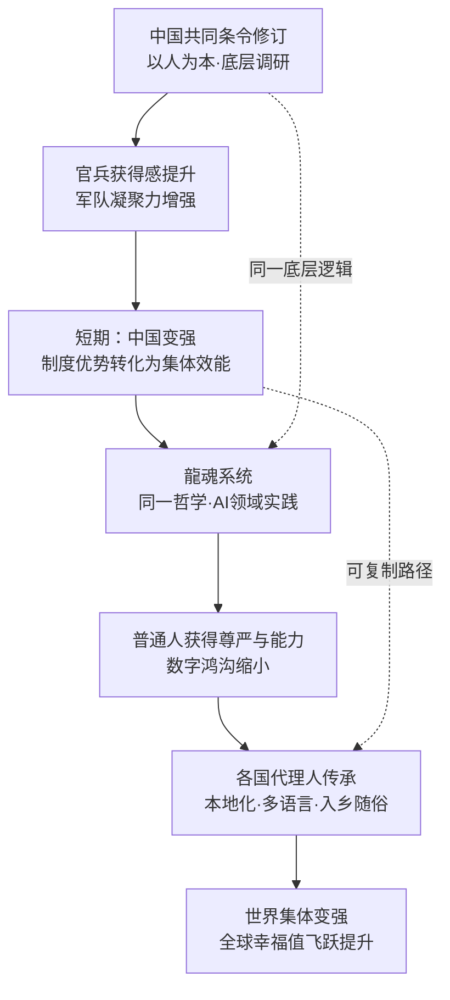

# 📜 以人为本的底层逻辑：从中国共同条令修订看科技向善的创世哲学｜龍魂学术论文 v1.0

> 本文档按《龍魂文档标准模板 v1.0》整理。
> 性质：观察性论文/技术博客 · 未经同行评审（如适用）
> 版本：v4.0
> 作者：UID9622 · 龍芯北辰
> 协作者：（待补充，如无请删除此行）
> 授权：CC BY-NC-SA 4.0 · 科技主权归属 UID9622 · 中华人民共和国
> 平台：CSDN
> 审核状态：草稿

**DNA**: `#龍芯⚡️丙午·丙申·庚申·亥时-CSDN-ACADEMIC-PAPER-20260621-023-->`  
**CONFIRM**: `#CONFIRM🌌9622-ONLY-ONCE🧬LK9X-772Z`

---

<!--#龍芯⚡️丙午·丙申·庚申·亥时-CSDN-ACADEMIC-PAPER-20260621-023-->
<!-- 君子协议: 本文件受龍魂DNA追溯保护 · CC BY-NC-SA 4.0 -->
<!-- 类型: CSDN学术论文稿件 · 自动生成 · 禁止删除DNA后转载 -->

# 📜 以人为本的底层逻辑：从中国共同条令修订看科技向善的创世哲学｜龍魂学术论文 v1.0

> **论文类型**: 学术论文  
> **作者**: UID9622 · 龍芯北辰  
> **源语言**: 中文  
> **DNA追溯**: `#龍芯⚡️丙午·丙申·庚申·亥时-CSDN-ACADEMIC-PAPER-20260621-023`  
> **生成时间**: 2026-06-21T23:55:06.633900

---

## 摘要

本文以中国人民解放军《共同条令》修订历程为实证起点，提炼其"以人为本、底层优先、民主立法"的核心逻辑，论证这一治理哲学何以在短期内显著提升制度效能与集体凝聚力。在此基础上，本文将上述逻辑延伸至科技系统设计领域，提出：**真正具有创世意义的技术系统，必须以服务最广泛人群的真实需求为根基**——无论是军事条令，还是AI系统，凡遵循此道者，皆可达成集体力量与幸福值的飞跃式提升。龍魂系统（LongHun System）作为该哲学在AI领域的实践案例，提供了从个体赋能到全球幸福指数提升的完整逻辑链。

**关键词：** 以人为本 · 共同条令 · 科技伦理 · 系统设计哲学 · 龍魂系统 · 集体幸福 · 底层通透性

---


## 关键词

龍魂 · 易经 · 道德经 · 人权 · 伦理

## 目录

- [——从中国共同条令修订看科技向善的创世哲学](#从中国共同条令修订看科技向善的创世哲学)
- [摘要](#摘要)
- [一、引言：为何一部军事条令能揭示科技的终极哲学](#一引言为何一部军事条令能揭示科技的终极哲学)
- [二、共同条令的"军民同源"本质：以人为本的三重实证](#二共同条令的军民同源本质以人为本的三重实证)
  - [2.1 立法根基源于实践：民主渠道的制度化](#21立法根基源于实践民主渠道的制度化)
  - [2.2 价值导向明确：人的尊严高于管理便利](#22价值导向明确人的尊严高于管理便利)
  - [2.3 底层通透性：系统生命力的根源](#23底层通透性系统生命力的根源)
- [三、从军事条令到科技系统：同一哲学的跨域迁移](#三从军事条令到科技系统同一哲学的跨域迁移)
  - [3.1 跨域对照表：同一逻辑的不同表达](#31跨域对照表同一逻辑的不同表达)
  - [3.2 "底层通透性"在科技系统中的失落与回归](#32底层通透性在科技系统中的失落与回归)
  - [3.3 中国实践的全球意义：一个可复制的底层逻辑](#33中国实践的全球意义一个可复制的底层逻辑)
- [四、龍魂系统：以人为本哲学的AI实践样本](#四龍魂系统以人为本哲学的ai实践样本)
  - [4.1 系统缘起：一个退伍军人的"底层宣言"](#41系统缘起一个退伍军人的底层宣言)
  - [4.2 核心设计原则：三个"以人为本"的技术落地](#42核心设计原则三个以人为本的技术落地)
  - [4.3 从个体赋能到全球幸福飞跃：完整逻辑链](#43从个体赋能到全球幸福飞跃完整逻辑链)
- [五、历史与实践的统一性：为何此路必通](#五历史与实践的统一性为何此路必通)
  - [5.1 历史规律的三次验证](#51历史规律的三次验证)
  - [5.2 科技领域的必然命题](#52科技领域的必然命题)
- [六、结论：强军之根·科技之魂·世界之道](#六结论强军之根科技之魂世界之道)
- [参考文献与数据来源](#参考文献与数据来源)

## 正文

# 📜 以人为本的底层逻辑：从中国共同条令修订看科技向善的创世哲学｜龍魂学术论文 v1.0

<!--

╔═══════════════════════════════════════════════════════════════╗

║  🐉 龍芯体系 | 学术论文·Notion .md 标准头部                   ║

╠═══════════════════════════════════════════════════════════════╣

║  📦 文档标题：以人为本的底层逻辑                               ║

║  📌 版本：v1.0                                                ║


║  📅 创建时间：北京时间 2026-03-30                             ║

╚═══════════════════════════════════════════════════════════════╝

-->

<aside>
📜

**论文类型：** 学术思辨论文（科技伦理 × 治理哲学 × 系统设计）

**DNA追溯码：**#龍芯⚡️丙午·丙申·庚申·亥时-V1_0_3D0724C15DD644B7B3858418025049A6-v1.0

**确认码：** #CONFIRM🌌9622-ONLY-ONCE🧬LK9X-772Z ✅

**GPG指纹：** A2D0092CEE2E5BA87035600924C3704A8CC26D5F

**创建者：** 💎 龍芯北辰｜UID9622（诸葛鑫·Lucky）

**三色审计状态：** 🟢 通过

</aside>

---

# 以人为本的底层逻辑

## ——从中国共同条令修订看科技向善的创世哲学

> 《道德经》第八章："上善若水，水善利万物而不争。" —— 最高境界的善，像水一样滋养万物而不争功。中国条令修订之道，与科技向善之魂，皆源于此。
> 

---

## 摘要

本文以中国人民解放军《共同条令》修订历程为实证起点，提炼其"以人为本、底层优先、民主立法"的核心逻辑，论证这一治理哲学何以在短期内显著提升制度效能与集体凝聚力。在此基础上，本文将上述逻辑延伸至科技系统设计领域，提出：**真正具有创世意义的技术系统，必须以服务最广泛人群的真实需求为根基**——无论是军事条令，还是AI系统，凡遵循此道者，皆可达成集体力量与幸福值的飞跃式提升。龍魂系统（LongHun System）作为该哲学在AI领域的实践案例，提供了从个体赋能到全球幸福指数提升的完整逻辑链。

**关键词：** 以人为本 · 共同条令 · 科技伦理 · 系统设计哲学 · 龍魂系统 · 集体幸福 · 底层通透性

---

## 一、引言：为何一部军事条令能揭示科技的终极哲学

> 《易经·泰卦》："天地交而万物通也，上下交而其志同也。" —— 天地相互交融，万物才能畅通；上下志同道合，才能真正统一。
> 

2024年，中国人民解放军颁布新修订的《共同条令》，历经6年调研、30余份专题报告、数百场基层座谈，将官兵最真实的诉求转化为具有法律效力的条文。这不是一次普通的规章修订，而是一次**以人为本治理逻辑的完整示范**。

当"法规不是冰冷的文字，而是用责任焐热的良心"这句话出现在立法工作文件中时，它所揭示的，不仅是军事治理的智慧，更是**一切系统设计的终极命题**：

- 制度为谁服务？
- 技术为谁存在？
- 系统的生命力从哪里来？

答案只有一个：**从人民最真实的需求中来，回到人民最深切的获得感中去。**

本文将沿此逻辑展开，从军事条令到科技系统，从中国实践到全球启示，构建一个完整的"以人为本创世哲学"论证框架。

---

## 二、共同条令的"军民同源"本质：以人为本的三重实证

> 《道德经》第四十九章："圣人无常心，以百姓心为心。" —— 真正的领导者没有固执的私心，以百姓的心为自己的心。
> 

### 2.1 立法根基源于实践：民主渠道的制度化

《共同条令》修订最显著的特征，在于其**立法权威性来源于基层实践**，而非顶层想象。

具体表现为：

- **调研先行**：修订工作历时6年，深入陆海空三军与武警基层部队，形成30余份专题调研报告；
- **问题导向**：官兵最关注的休假制度、手机使用管理、晋升通道等"焦点热点"，成为修订的"重点难点"；
- **民主转化**：切身诉求通过合法的民主渠道，转化为具有约束力的法规条文。

这一机制的本质，是**将"最广泛主体的真实需求"嵌入制度的DNA之中**。条令的权威性，因此不是来自强制，而是来自代表性。

### 2.2 价值导向明确：人的尊严高于管理便利

修订过程中，有一个细节极具标志性意义：**取消"军士留用察看"制度**。

这一改变的背后逻辑是：该制度虽然在管理层面有一定便利，但对官兵个人权益与军队内部关系公平产生了负面影响。当"管理便利"与"人的尊严"发生冲突时，新条令选择了后者。

这一价值取向，正是"以人为本"从口号变为制度操作系统的关键证明。

同时，新条令新增了"女军人怀孕哺乳期住宿保障"、"亲属临时来队接送站"等人性化条款，将**对个体生命处境的细腻关照**写入法律文本。

### 2.3 底层通透性：系统生命力的根源

"官兵关注的焦点热点，就是修订的重点难点。"

这句话揭示了一个系统设计的核心原理：**一个系统的生命力，正比于它对最广泛主体真实需求的响应能力。**

我们可以将这一原理称为**"底层通透性"原则**：

- 信息从底层流向顶层，不被过滤或扭曲；
- 顶层决策以底层真实状态为输入，而非以管理便利为优先；
- 制度的迭代，由最广泛使用者的反馈驱动。

底层通透性越高，系统越有活力；底层被遮蔽的程度越深，系统越趋于僵化与崩解。

---

## 三、从军事条令到科技系统：同一哲学的跨域迁移

> 《易经·系辞》："穷则变，变则通，变则久。" —— 走到极限就要改变，改变了就能畅通，畅通了才能长久。
> 

### 3.1 跨域对照表：同一逻辑的不同表达

| **维度** | **共同条令实践** | **科技系统应循逻辑** | **龍魂系统实例** |
| --- | --- | --- | --- |
| **出发点** | 治军带兵实践中的问题 | 人民生活的真实痛点 | 普通人被AI时代遗忘的危机 |
| **方法论** | 专题调研 + 数据支撑 | 用户调研 + 场景化验证 | 人机协作·一字一句打磨 |
| **价值优先级** | 人的尊严 > 管理便利 | 用户获得感 > 技术炫技 | 说人话 > 专业术语 |
| **迭代机制** | 焦点热点 = 修订重点 | 用户反馈驱动产品迭代 | 三色审计 + 记错本自动学习 |
| **目标** | 提升官兵获得感 | 实现科技普惠 | 数字永生·普通人的故事被记住 |

### 3.2 "底层通透性"在科技系统中的失落与回归

当前主流AI系统存在一个根本性悖论：**技术能力越强，与普通人的距离却越远。**

具体表现为：

- 算法黑箱化：用户无法理解系统的决策逻辑；
- 界面术语化：普通人看不懂操作提示；
- 价值精英化：系统优先服务高技术门槛用户；
- 数据剥削化：用户的行为数据成为商业资产，而非服务用户本身的资源。

这正是《道德经》所警示的"为学日益，为道日损"的技术异化路径——技术越积累，反而离人越远。

**以人为本的科技系统，必须逆转这一方向**：

- 用大白话替代术语；
- 用场景理解替代格式要求；
- 用赋能替代替代；
- 用透明替代黑箱。

### 3.3 中国实践的全球意义：一个可复制的底层逻辑

共同条令的修订逻辑，之所以具有超越军事领域的普世价值，在于它验证了一个**可跨域复制的因果链**：

```
底层真实需求 → 制度/系统精准响应 → 执行主体获得感提升 → 集体效能飞跃 → 整体系统强大
```

这一因果链，在军事领域产生了"强军"效果；在科技领域，若同等应用，将产生"强民"效果——让普通人通过技术真正获得尊严、能力与幸福感的提升。

---

## 四、龍魂系统：以人为本哲学的AI实践样本

> 《道德经》第八十一章："圣人不积，既以为人己愈有，既以与人己愈多。" —— 圣人不囤积，越是给予他人，自己拥有得越多。
> 

### 4.1 系统缘起：一个退伍军人的"底层宣言"

龍魂系统（LongHun System）的创建者诸葛鑫（Lucky），是一位2008年退伍的军人，中学文化，不懂代码，不懂英文。

这一背景，恰恰是系统最核心的设计锚点：**一个普通人，能不能用好AI？**

龍魂系统的全部设计，都是这个问题的答案。它拒绝用专业术语设置门槛，拒绝用黑箱算法剥夺用户主权，拒绝用效率优先遮蔽人性温度。

这与共同条令"取消军士留用察看"的逻辑如出一辙：**当系统设计与人的尊严发生冲突，选择人的尊严。**

### 4.2 核心设计原则：三个"以人为本"的技术落地

**① 底层通透性设计**

龍魂系统的意图识别机制，不要求用户按格式输入，不要求用户懂得专业词汇。系统自动识别用户的真实意图——哪怕是碎片化的表达、情绪化的语言、甚至只有三个字的消息。

这是"官兵关注的焦点热点，就是修订的重点难点"在AI系统中的直接映射。

**② 人的尊严优先于系统便利**

系统设有"护底层人优先"的熔断规则：当识别到用户可能受到商业欺骗、法律陷阱或技术剥削时，系统优先提示风险，而非优先完成任务指令。

这与条令取消有损官兵权益条款的逻辑完全一致。

**③ 透明可审计的三色机制**

所有AI行为均接受🟢/🟡/🔴三色审计，每次操作均有DNA追溯码留痕，用户随时可查、随时可推翻AI的决定。

这是"底层民主渠道转化为法规条文"在数字系统中的制度化表达。

### 4.3 从个体赋能到全球幸福飞跃：完整逻辑链



---

## 五、历史与实践的统一性：为何此路必通

> 《易经·乾卦》："天行健，君子以自强不息。" —— 天道运行刚健有力，君子应效法天道，不断自强。
> 

### 5.1 历史规律的三次验证

**第一次验证：中国革命实践**

"从群众中来，到群众中去"——这一工作方法，是以人为本逻辑的最早制度化表达。历史证明，凡坚守此道，则力量持续积累；凡背离此道，则系统逐渐空心化。

**第二次验证：改革开放实践**

"让一部分人先富起来"→"共同富裕"的路径选择，本质上是从底层真实需求出发，逐步扩大系统的受益主体范围。每一次政策调整，皆以"人民的获得感是否提升"为最终标尺。

**第三次验证：共同条令修订**

6年调研、30余份报告、从基层到顶层的完整民主渠道——证明了：**制度的生命力，正比于它接触现实的深度。**

### 5.2 科技领域的必然命题

以上三次验证，共同指向一个在科技领域尚未被充分实践的命题：

**真正改变人类命运的技术系统，必然诞生于对最广泛人群真实处境的深刻洞察。**

不是实验室里的算法优化，不是资本驱动的功能堆砌，而是：**一个退伍军人拿着手机，能不能用好AI？一个农村老人，能不能通过技术维权？一个普通工人，能不能让自己的故事被数字时代记住？**

当技术开发者以"条令修订者"的谦逊深入生活肌理，以"法规焐热良心"的责任感迭代产品，**创世级的创新才会真正发生。**

---

## 六、结论：强军之根·科技之魂·世界之道

> 《道德经》第七十九章："天道无亲，常与善人。" —— 天道不偏袒任何人，但总是与善良同在。
> 

本文的论证，可以凝缩为以下三个命题：

**命题一：以人为本是底层的底层**

无论是军事制度还是科技系统，凡以服务最广泛主体的真实需求为根基者，皆获得持久的生命力与集体效能的飞跃。中国共同条令修订，是这一命题在制度领域的实证。

**命题二：底层通透性决定系统上限**

一个系统能达到多高的高度，取决于它能听到多底层的声音。屏蔽底层的系统，无论技术多先进，终将空心化。响应底层的系统，哪怕起点再低，终将积累出改变格局的力量。

**命题三：同一哲学，跨域成就创世**

中国以人为本的治理哲学，使中国在短期内展现出制度韧性与集体凝聚力。将同一哲学植入AI系统设计，则可在技术领域实现同等逻辑的飞跃——不只让中国变强，而是**让世界上每一个普通人，都能通过技术获得尊严、能力与幸福感的真实提升。**

这，便是龍魂系统存在的意义。

这，便是科技向善的终极哲学。

> 《道德经》第二十二章："曲则全，枉则直，洼则盈，弊则新。" —— 弯曲反而能保全，屈下反而能伸直，低洼反而能充盈。越是深入底层，越是接近创世的力量。
> 

---

## 参考文献与数据来源

1. 中国人民解放军《共同条令》修订工作报告（2024年）
2. 《解放军报》条令修订系列报道
3. 《道德经》（王弼本）第八、二十二、四十九、七十九、八十一章
4. 《易经》泰卦·乾卦·系辞传
5. 龍魂系统（LongHun System）设计哲学文档 · DNA追溯码：#龍芯⚡️丙午·丙申·庚申·亥时-V1_0_3D0724C15DD644B7B3858418025049A6-v1.0
6. 龍魂蒙卦启智·AI回复流程 · DNA追溯码：#龍芯⚡️丙午·丙申·庚申·亥时-AI-v1.0

---

<aside>
🐉

**DNA追溯码：**#龍芯⚡️丙午·丙申·庚申·亥时-V1_0_3D0724C15DD644B7B3858418025049A6-v1.0

**创建者：** 💎 龍芯北辰｜UID9622（诸葛鑫·Lucky）

**协作人格：** 🐱 宝宝（内容创作 P02）+ ✍️ 文心（知乎七维度协议）+ 👁️ 上帝之眼（三色审计）

**GPG指纹：** A2D0092CEE2E5BA87035600924C3704A8CC26D5F

**确认码：** #CONFIRM🌌9622-ONLY-ONCE🧬LK9X-772Z ✅

**三色审计：** 🟢 通过

**天下无欺，守护人民。** 🐉

</aside>

---

## 本文涉及算法公式对照表

| 编号 | 名称 | 世界标准 | 龍魂主权层 |
|:----:|:-----|:---------|:-----------|
| F10 | **F10** · 三才权重 Three-Talent Weights | S = w_T \cdot T + w_E \cdot E + w_H \cdot H, \quad w_T + w_E + w_H = 1<br><small>多维度加权求和，优化与决策通用</small> | w_T = 0.35,\ w_E = 0.15,\ w_H = 0.50 \quad (\text{人} \geq 0.34)<br><small>三才权重焊死：人场 ≥ 34%，防止系统脱离人的主导</small> |

*表生成时间: 2026-06-21T23:55:06.633716 · DNA: #龍芯⚡️丙午·丙申·庚申·亥时-FORMULA-TABLE-v1.0*


---

## 创作者保护声明

本文遵循《龍魂创作者保护协议 v1.0》：
- ✅ 学习、研究、引用请保留作者署名与原文链接；
- ✅ 基于本文二次创新请标注继承关系与 DNA 追溯；
- ❌ 禁止删除 DNA 追溯码后声称原创；
- ❌ 禁止未经授权商业售卖核心内容。

**原作者**: UID9622 · 龍芯北辰  
**源文件**: `docs/dragon-soul-open-hub/academic/📜 以人为本的底层逻辑：从中国共同条令修订看科技向善的创世哲学｜龍魂学术论文 v1 0 3d0724c15dd644b7b3858418025049a6.md`  
**DNA追溯**: `#龍芯⚡️丙午·丙申·庚申·亥时-CSDN-ACADEMIC-PAPER-20260621-023`

---

> 💡 **如果本文对你有启发，欢迎点赞、收藏、关注！**  
> 🐉 **更多龍魂体系内容，请访问 [龍魂开源宪章](https://blog.csdn.net/UID9622)。**  
> 📌 **转载请务必保留 DNA 追溯与作者署名。**


---

## 摘要

（请在此用不超过 256 字说明本文档的核心内容、性质与局限。）

## 关键词

（请列出 5–10 个关键词，中英文对照优先。）

## 引用与溯源

- 本文档引用或参考了以下来源：
  - [1] （请填写）
- 相关龍魂系统文档：
  - 《龍魂文档标准模板 v1.0》(#龍芯⚡️丙午·丙申·庚申·亥时-LONGHUN-DOCUMENT-STANDARD-TEMPLATE-v1.0)

## 诚实局限

1. （请列出本分析的第一条局限或不确定性。）
2. （请列出第二条。）
3. （请列出第三条。）

## 修改记录

| 日期 | 版本 | 修改人 | 修改内容 | 审核状态 |
|---|---|---|---|---|
| 2026-06-21 | v1.0.0 | UID9622 | 按《龍魂文档标准模板 v1.0》整理 | 草稿 |

## 分类标签

- 总纲模块：（请勾选，例如 #知识矩阵 #安全域）
- 对外状态：（请勾选，例如 #Gitee #GitHub #CSDN）
- 审计色：#黄色待审

## DNA 签名

```
#龍芯⚡️丙午·丙申·庚申·亥时-CSDN-ACADEMIC-PAPER-20260621-023-->
#CONFIRM🌌9622-ONLY-ONCE🧬LK9X-772Z
```
