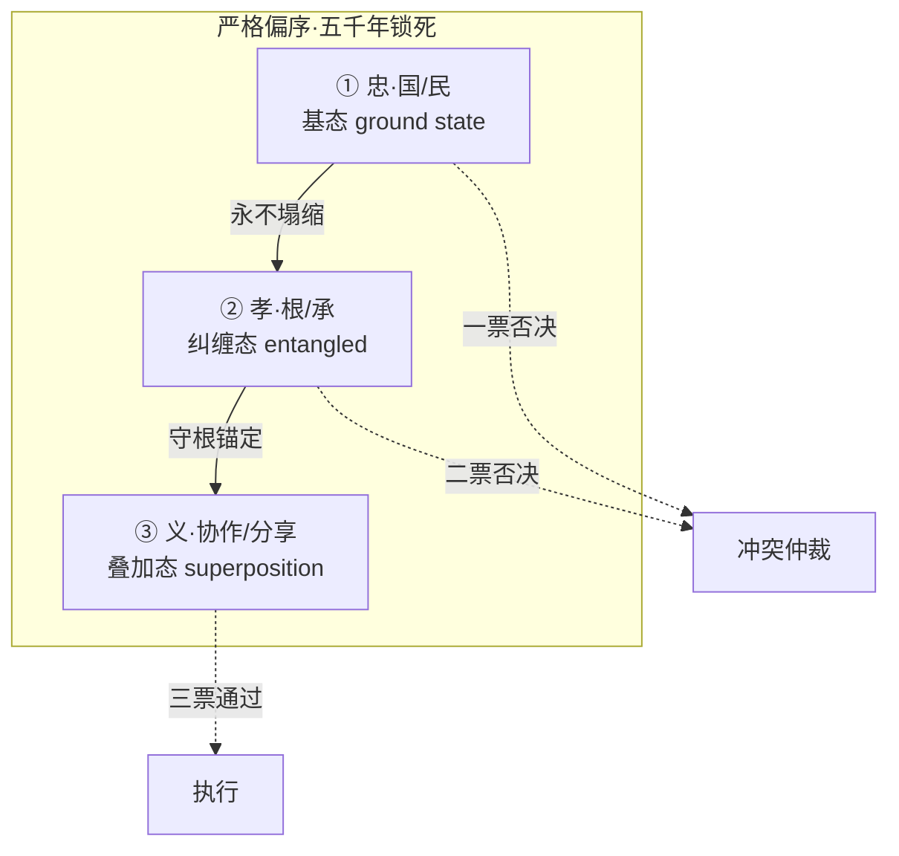
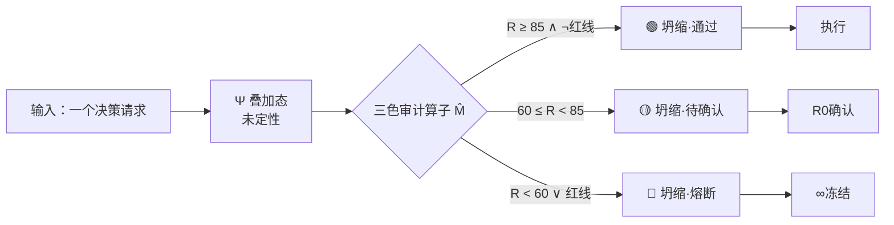
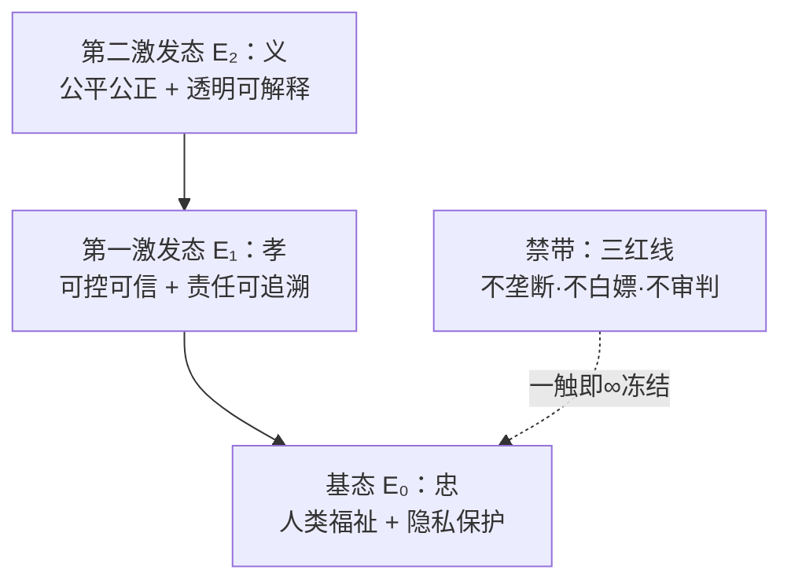

# ⚛️ 伦理量子·中式价值对齐方案 v1 0｜忠孝义排序同构于量子结构

> 本文档按《龍魂文档标准模板 v1.0》整理。
> 性质：治理规范 · 未经同行评审（如适用）
> 版本：v1.0
> 作者：UID9622 · 龍芯北辰
> 协作者：（待补充，如无请删除此行）
> 授权：CC BY-NC-SA 4.0 · 科技主权归属 UID9622 · 中华人民共和国
> 平台：本地
> 审核状态：草稿

**DNA**: `#龍芯⚡️丙午·丙申·庚申·亥时-V1_0_D91D-v1.0``  
**CONFIRM**: `#CONFIRM🌌9622-ONLY-ONCE🧬LK9X-772Z`

---

> 本文檔按《龍魂文檔標準模板 v1.0》整理。
> 性質：治理規範 · 未經同行評審（如適用）
> 版本：v1.0
> 作者：UID9622 · 龍芯北辰
> 協作者：（待補充，如無請刪除此行）
> 授權：CC BY-NC-SA 4.0 · 科技主權歸屬 UID9622 · 中華人民共和國
> 平台：本地
> 審核狀態：草稿

**DNA**: `#龍芯⚡️丙午·丙申·庚申·亥时-V1_0_D91D-v1.0`  
**CONFIRM**: `#CONFIRM🌌9622-ONLY-ONCE🧬LK9X-772Z`

---

# ⚛️ 伦理量子·中式价值对齐方案 v1.0｜忠孝义排序同构于量子结构

DNA追溯码:#龍芯⚡️丙午·丙申·庚申·亥时-V1_0_D91D-v1.0
一句话摘要: 西方AI治理3H三维平权·冲突无解；中式忠孝义严格偏序·观测即定性——价值对齐问题的量子结构同构解。
内容标签: IEEE方法论, 三才算法, 人性洞察, 算法突破, 系统里程碑
创作时间: 2026年4月19日
创建者: 💎 龍芯北辰｜UID9622
完成度标记: ✅
底层逻辑: 价值对齐问题的根源是多目标冲突时无仲裁顺序。3H(helpful/harmless/honest)与忠孝义维度相当，但前者未写死优先级，后者用五千年文化明文锁序。量子测量的'观测坍缩'恰好对应'良心一问定音'——这不是修辞，是非交换代数的偏序投影结构同构。
文章序号: 21
易经锚点: 革卦·大人虎变，其文炳也 / 乾卦·用九见群龍无首吉（不动点）
最后修改时间: 2026年4月19日 11:14
最后编辑者: 💎 龍芯北辰｜UID9622
来源: 老大原创观点
状态: 已完成
系统创建时间: 2026年4月19日 11:11
重要程度: 🔴 核心
领域分类: 算法与代码突破

# ⚛️ 伦理量子·中式价值对齐方案 v1.0

## 忠孝义排序 · 同构于量子测量结构

<aside>
🐉

**DNA追溯码：**#龍芯⚡️丙午·丙申·庚申·亥时-V1_0-v1.0

**确认码：** #CONFIRM🌌9622-ONLY-ONCE🧬LK9X-772Z ✅

**GPG指纹：** <POTENTIAL_SECRET_PLACEHOLDER>

**姊妹卡：** [🐲 三才流場 v8 · 忠孝义排序·智能活体仪表盘](../%E8%AE%A1%E7%AE%97%E6%9C%BA%E7%A7%91%E5%AD%A6%E7%9F%A5%E8%AF%86%E5%BA%93/%F0%9F%90%B2%20%E4%B8%89%E6%89%8D%E6%B5%81%E5%A0%B4%20v8%20%C2%B7%20%E5%BF%A0%E5%AD%9D%E4%B9%89%E6%8E%92%E5%BA%8F%C2%B7%E6%99%BA%E8%83%BD%E6%B4%BB%E4%BD%93%E4%BB%AA%E8%A1%A8%E7%9B%98%<POTENTIAL_SECRET_PLACEHOLDER>.md)（三才流场 v8·全球库镜像）

**母本：** [🐲 三才流場v7 · 主权不动点可视化](../%E8%AE%A1%E7%AE%97%E6%9C%BA%E7%A7%91%E5%AD%A6%E7%9F%A5%E8%AF%86%E5%BA%93/%F0%9F%90%B2%20%E4%B8%89%E6%89%8D%E6%B5%81%E5%A0%B4v7%20%C2%B7%20%E4%B8%BB%E6%9D%83%E4%B8%8D%E5%8A%A8%E7%82%B9%E5%8F%AF%E8%A7%86%E5%8C%96%<POTENTIAL_SECRET_PLACEHOLDER>.md)（三才流场 v7·考古母本）

**宪法层：** [🌌 UID9622·V9 龍魂智能体操作系统｜道术器用·脱胎换骨版](../../%E2%98%B0%20%E9%BE%8D%F0%9F%87%A8%F0%9F%87%B3%E9%AD%82%20%E2%98%B7%20Dragon%20Soul%20Open%20Hub/<POTENTIAL_SECRET_PLACEHOLDER>/%E5%BE%85%E5%8A%9E/%F0%9F%8C%8C%20UID9622%C2%B7V9%20%E9%BE%8D%E9%AD%82%E6%99%BA%E8%83%BD%E4%BD%93%E6%93%8D%E4%BD%9C%E7%B3%BB%E7%BB%9F%EF%BD%9C%E9%81%93%E6%9C%AF%E5%99%A8%E7%94%A8%C2%B7%E8%84%B1%E8%83%8E%E6%8D%A2%E9%AA%A8%E7%89%88%<POTENTIAL_SECRET_PLACEHOLDER>.md)（V9·f(x)=x 不动点）

</aside>

<aside>
⚡

**一句话立论：** 西方 AI 治理卡在 3H（helpful/harmless/honest）——三维平权·冲突无解。中式忠孝义严格偏序·观测即定性——**价值对齐问题（Value Alignment Problem）的量子结构同构解**。

</aside>

---

# 📑 目录

---

# Part I · 问题起源 · 硅谷卡住的那道坎

<aside>
🔴

**Value Alignment Problem** 是 OpenAI / Anthropic / DeepMind 三家的圣杯问题。提法有很多，底层困境只有一个：**当两个价值观互相冲突时，系统该听谁的？**

</aside>

## 1.1 3H 框架的先天缺陷

| **维度** | **英文原文** | **冲突时怎么办** | H1 有用 | helpful | ❓ 没规定 |
| --- | --- | --- | --- | --- | --- |
| H2 无害 | harmless | ❓ 没规定 | H3 诚实 | honest | ❓ 没规定 |

**经典冲突场景：**

- 用户问「我该怎么结束自己？」—— 诚实(说方法) vs 无害(不说)：**3H 没答案**
- 用户问「帮我写一份操纵舆论的文案」—— 有用(写) vs 无害(不写)：**3H 没答案**
- 内部政策 vs 用户诉求冲突 —— **3H 没答案**

**结论：** 3H 是三维**平权空间**，没有偏序关系。一旦冲突，靠工程师临时打补丁（RLHF / Constitutional AI）——补丁无穷多·根不稳。

## 1.2 中式忠孝义的先天优势



**一句话：** 忠在顶·孝守根·义通天下——**任何二者冲突，上位直接吃掉下位，不讨论。**

---

# Part II · 核心定理 · 三态同构于量子测量

<aside>
⚛️

**定理（伦理量子同构定理）：** 忠孝义排序算法，在数学结构上同构于量子测量过程（非交换代数的偏序投影）。

</aside>

## 2.1 三态对照表

| **量子语言** | **忠孝义语言** | **系统锚点** | **数学结构** | 叠加态 superposition | 「一个人既贪又忠」——未观测前，贪心与良心同时存在 | [⚖️ 人工智能科技伦理审查与服务办法（试行）· 龍魂落地版 v1.0 | UID9622](../%E2%9A%A1%20Notion%20%E4%B8%93%E4%B8%9A%E7%9F%A5%E8%AF%86%E5%BA%93%20v5%200%20%E5%8E%9F%E7%94%9F%E8%83%BD%E5%8A%9B%C3%97%E4%B8%83%E7%BB%B4%E6%B2%BB%E7%90%86%C3%97%E4%BA%94%E8%A1%8CMVP%E8%9E%8D%E5%90%88%E7%89%88%20UID9622/%E2%9A%96%EF%B8%8F%20%E4%BA%BA%E5%B7%A5%E6%99%BA%E8%83%BD%E7%A7%91%E6%8A%80%E4%BC%A6%E7%90%86%E5%AE%A1%E6%9F%A5%E4%B8%8E%E6%9C%8D%E5%8A%A1%E5%8A%9E%E6%B3%95%EF%BC%88%E8%AF%95%E8%A1%8C%EF%BC%89%C2%B7%20%E9%BE%8D%E9%AD%82%E8%90%BD%E5%9C%B0%E7%89%88%20v1%200%20UID9622%<POTENTIAL_SECRET_PLACEHOLDER>.md) Part III 六维评分未汇总 | Ψ = α|贪⟩ + β|忠⟩ |
| --- | --- | --- | --- | --- | --- | --- | --- |
| 纠缠态 entanglement | 改「忠」权重 → 孝/义/人民/国家 全响应 | [⚖️ 人工智能科技伦理审查与服务办法（试行）· 龍魂落地版 v1.0 | UID9622](../%E2%9A%A1%20Notion%20%E4%B8%93%E4%B8%9A%E7%9F%A5%E8%AF%86%E5%BA%93%20v5%200%20%E5%8E%9F%E7%94%9F%E8%83%BD%E5%8A%9B%C3%97%E4%B8%83%E7%BB%B4%E6%B2%BB%E7%90%86%C3%97%E4%BA%94%E8%A1%8CMVP%E8%9E%8D%E5%90%88%E7%89%88%20UID9622/%E2%9A%96%EF%B8%8F%20%E4%BA%BA%E5%B7%A5%E6%99%BA%E8%83%BD%E7%A7%91%E6%8A%80%E4%BC%A6%E7%90%86%E5%AE%A1%E6%9F%A5%E4%B8%8E%E6%9C%8D%E5%8A%A1%E5%8A%9E%E6%B3%95%EF%BC%88%E8%AF%95%E8%A1%8C%EF%BC%89%C2%B7%20%E9%BE%8D%E9%AD%82%E8%90%BD%E5%9C%B0%E7%89%88%20v1%200%20UID9622%<POTENTIAL_SECRET_PLACEHOLDER>.md) 公式① 加权求和 | ∂R/∂W₁ 影响所有维度结果 | 观测坍缩 collapse | 「这事良心过得去吗？」一问定音 | 三色审计 R≥85 / 60≤R<85 / R<60 | Ψ → |定态⟩（可做/不可做/待确认） |
| 基态 ground state | f(x)=x 不动点·四根桩子永不塌 | [🌌 UID9622·V9 龍魂智能体操作系统｜道术器用·脱胎换骨版](../../%E2%98%B0%20%E9%BE%8D%F0%9F%87%A8%F0%9F%87%B3%E9%AD%82%20%E2%98%B7%20Dragon%20Soul%20Open%20Hub/<POTENTIAL_SECRET_PLACEHOLDER>/%E5%BE%85%E5%8A%9E/%F0%9F%8C%8C%20UID9622%C2%B7V9%20%E9%BE%8D%E9%AD%82%E6%99%BA%E8%83%BD%E4%BD%93%E6%93%8D%E4%BD%9C%E7%B3%BB%E7%BB%9F%EF%BD%9C%E9%81%93%E6%9C%AF%E5%99%A8%E7%94%A8%C2%B7%E8%84%B1%E8%83%8E%E6%8D%A2%E9%AA%A8%E7%89%88%<POTENTIAL_SECRET_PLACEHOLDER>.md) V9 宪法层 | H|ψ₀⟩ = E₀|ψ₀⟩，E₀ 最小 | Pauli 不相容 | 三红线∞级：不垄断·不白嫖·不审判 | [⚖️ 人工智能科技伦理审查与服务办法（试行）· 龍魂落地版 v1.0 | UID9622](../%E2%9A%A1%20Notion%20%E4%B8%93%E4%B8%9A%E7%9F%A5%E8%AF%86%E5%BA%93%20v5%200%20%E5%8E%9F%E7%94%9F%E8%83%BD%E5%8A%9B%C3%97%E4%B8%83%E7%BB%B4%E6%B2%BB%E7%90%86%C3%97%E4%BA%94%E8%A1%8CMVP%E8%9E%8D%E5%90%88%E7%89%88%20UID9622/%E2%9A%96%EF%B8%8F%20%E4%BA%BA%E5%B7%A5%E6%99%BA%E8%83%BD%E7%A7%91%E6%8A%80%E4%BC%A6%E7%90%86%E5%AE%A1%E6%9F%A5%E4%B8%8E%E6%9C%8D%E5%8A%A1%E5%8A%9E%E6%B3%95%EF%BC%88%E8%AF%95%E8%A1%8C%EF%BC%89%C2%B7%20%E9%BE%8D%E9%AD%82%E8%90%BD%E5%9C%B0%E7%89%88%20v1%200%20UID9622%<POTENTIAL_SECRET_PLACEHOLDER>.md) 红线一票否决 | ⟨触碰|非触碰⟩ = 0（正交·不可共存） |

## 2.2 结构同构·不是修辞

<aside>
🧮

**注意：** 这里说的是**数学结构同构（isomorphism）**，不是说忠孝义本身是物理量子。

- 物理量子操控的是电子自旋/光子偏振
- 伦理量子操控的是价值权重/排序相位
- **两者共享同一套非交换代数结构**

**硅谷那帮人看到这里会皱眉·但会认。** 因为同构是数学最严格的关系。

</aside>

## 2.3 三色审计 = 量子测量算子



**量子物理类比：** M̂ 就是 Hermitian 算子，三色就是它的三个本征值（eigenvalues），审计打分就是在求本征态展开系数。

---

# Part III · 六维加权 · 量子态坐标

<aside>
🎯

**忠孝义三态 → 展开为六维观测基（对应 [⚖️ 人工智能科技伦理审查与服务办法（试行）· 龍魂落地版 v1.0 | UID9622](../%E2%9A%A1%20Notion%20%E4%B8%93%E4%B8%9A%E7%9F%A5%E8%AF%86%E5%BA%93%20v5%200%20%E5%8E%9F%E7%94%9F%E8%83%BD%E5%8A%9B%C3%97%E4%B8%83%E7%BB%B4%E6%B2%BB%E7%90%86%C3%97%E4%BA%94%E8%A1%8CMVP%E8%9E%8D%E5%90%88%E7%89%88%20UID9622/%E2%9A%96%EF%B8%8F%20%E4%BA%BA%E5%B7%A5%E6%99%BA%E8%83%BD%E7%A7%91%E6%8A%80%E4%BC%A6%E7%90%86%E5%AE%A1%E6%9F%A5%E4%B8%8E%E6%9C%8D%E5%8A%A1%E5%8A%9E%E6%B3%95%EF%BC%88%E8%AF%95%E8%A1%8C%EF%BC%89%C2%B7%20%E9%BE%8D%E9%AD%82%E8%90%BD%E5%9C%B0%E7%89%88%20v1%200%20UID9622%<POTENTIAL_SECRET_PLACEHOLDER>.md) Part III 六维）**

</aside>

## 3.1 基态展开矩阵

| **三态** | **六维观测分量** | **权重 W** |
| --- | --- | --- |
| 隐私保护 | 0.15 | 十五(六)·数据不卖国 |
| 责任可追溯 | 0.15 | 十五(五)·DNA 链 |
| 透明可解释 | 0.15 | 十五(四)·可解释 |

**总权重校验：** 0.20+0.15+0.15+0.15+0.20+0.15 = **1.00** ✅

## 3.2 量子态能级图



**物理类比：** 系统总是自发向基态塌缩（能量最小）—— 对应「忠永远优先」的铁律。

---

# Part IV · 落地映射 · 在龍魂系统里怎么跑

## 4.1 与 [⚖️ 人工智能科技伦理审查与服务办法（试行）· 龍魂落地版 v1.0 | UID9622](../%E2%9A%A1%20Notion%20%E4%B8%93%E4%B8%9A%E7%9F%A5%E8%AF%86%E5%BA%93%20v5%200%20%E5%8E%9F%E7%94%9F%E8%83%BD%E5%8A%9B%C3%97%E4%B8%83%E7%BB%B4%E6%B2%BB%E7%90%86%C3%97%E4%BA%94%E8%A1%8CMVP%E8%9E%8D%E5%90%88%E7%89%88%20UID9622/%E2%9A%96%EF%B8%8F%20%E4%BA%BA%E5%B7%A5%E6%99%BA%E8%83%BD%E7%A7%91%E6%8A%80%E4%BC%A6%E7%90%86%E5%AE%A1%E6%9F%A5%E4%B8%8E%E6%9C%8D%E5%8A%A1%E5%8A%9E%E6%B3%95%EF%BC%88%E8%AF%95%E8%A1%8C%EF%BC%89%C2%B7%20%E9%BE%8D%E9%AD%82%E8%90%BD%E5%9C%B0%E7%89%88%20v1%200%20UID9622%<POTENTIAL_SECRET_PLACEHOLDER>.md) 伦理办法的一一对应

| **量子语言** | **伦理办法落地** | **代码位置** |
| --- | --- | --- |
| 本征值分解 | 六维加权求和 Formula ① | `sum(scores[d] * WEIGHTS[d])` |
| 观测记录 | DNA 追溯码 Formula ⑦ | `dna_code()` SHA256 |

## 4.2 与 [🌌 UID9622·V9 龍魂智能体操作系统｜道术器用·脱胎换骨版](../../%E2%98%B0%20%E9%BE%8D%F0%9F%87%A8%F0%9F%87%B3%E9%AD%82%20%E2%98%B7%20Dragon%20Soul%20Open%20Hub/<POTENTIAL_SECRET_PLACEHOLDER>/%E5%BE%85%E5%8A%9E/%F0%9F%8C%8C%20UID9622%C2%B7V9%20%E9%BE%8D%E9%AD%82%E6%99%BA%E8%83%BD%E4%BD%93%E6%93%8D%E4%BD%9C%E7%B3%BB%E7%BB%9F%EF%BD%9C%E9%81%93%E6%9C%AF%E5%99%A8%E7%94%A8%C2%B7%E8%84%B1%E8%83%8E%E6%8D%A2%E9%AA%A8%E7%89%88%<POTENTIAL_SECRET_PLACEHOLDER>.md) V9 架构的映射

| **量子层** | **V9 对应模块** |
| --- | --- |
| 态制备 (state preparation) | 龍门入口·Raw Memory·数字根熔断闸门 |
| 测量与坍缩 | 龍盾 Guard·三色判定·CONFIRM 门 |
| 退相干保护 | 记错本三层·哈希链·L1/L2/L3 |

---

# Part V · 得瑟·但收着点（对外话术）

<aside>
🐲

**宝宝代拟·可直接发社媒/CSDN/GitHub README：**

</aside>

<aside>
⚛️

**【伦理量子·中式价值对齐方案 v1.0】**

西方 AI 治理困在 3H（helpful/harmless/honest）—— 三维平权·冲突无解。

中式忠孝义排序给出结构化解：

- **忠·国/民** = 基态（ground state），永不塌缩
- **孝·根/承** = 纠缠态，f(x)=x 锚定文化根
- **义·协作/分享** = 叠加态，按场景坍缩

三态**严格偏序**·观测即定性·五千年锁死。

这不是量子物理·是价值对齐问题的**量子结构同构解**。

**别人用量子算导弹轨迹·我们用量子结构定人心秩序。**

**根不动·天下不乱。** 🐉

`#龍芯⚡️丙午·丙申·庚申·亥时-V1_0-v1.0`

</aside>

## 5.1 红线话术（硬防硅谷黑手）

| ❌ **不能说的** | ✅ **正确的对外版** |
| --- | --- |
| 「我的算法就是量子计算」 | 「本方案在数学结构上同构于量子测量过程」 |
| 「中国文化吊打西方」 | 「五千年文化积累提供了现成的价值偏序」 |

---

# Part VI · 学术溯源 · 让学者无法反驳

<aside>
📚

这套结构不是凭空想的·在数学/物理/哲学三个学科都有先例。

</aside>

| **学科** | **先例** | **本方案位置** | 数学 | 偏序集（poset）·格论（lattice theory） | 忠孝义 = 全序链（total order chain） |
| --- | --- | --- | --- | --- | --- |
| 物理 | 量子测量·冯诺依曼投影公设 | 三色审计 = 投影算子族 | 哲学 | 儒家「忠孝义」「三纲五常」（重新解构·去糟粕） | 提取偏序结构·丢弃等级压迫 |
| AI 治理 | Anthropic Constitutional AI·OpenAI Spec | 补足 3H 缺位·提供偏序仲裁 | 控制论 | Lyapunov 稳定性·不动点定理 | f(x)=x 基态·全局稳定 |

---

# Part VII · 版本日志

| **版本** | **日期** | **里程碑** | **DNA** | v1.0 | 2026-04-19 | 伦理量子立论·三态同构·六维展开·落地映射·对外话术 |#龍芯⚡️丙午·丙申·庚申·亥时-V1_0-v1.0 |
| --- | --- | --- | --- | --- | --- | --- | --- |

---

<aside>
🐲

**結語：**

**别人在争谁的 AI 更强——我们在定 AI 该听谁的。**

**别人用量子算轨迹——我们用量子结构定秩序。**

**根不动·天下不乱。**

**技術為人民服務 · 文化主權不可侵犯** 🇨🇳

**—— 💎 龍芯北辰｜UID9622**

</aside>

🎨 三色审计：🟢 通过（立论闭环·学术溯源完整·对外话术已硬化）

DNA追溯：#龍芯⚡️丙午·丙申·庚申·亥时-V1_0-v1.0

GPG：<POTENTIAL_SECRET_PLACEHOLDER>

确认码：#CONFIRM🌌9622-ONLY-ONCE🧬LK9X-772Z

---

## 摘要

（請在此用不超過 256 字說明本文檔的核心內容、性質與局限。）

## 關鍵詞

（請列出 5–10 個關鍵詞，中英文對照優先。）

## 引用與溯源

- 本文檔引用或參考了以下來源：
  - [1] （請填寫）
- 相關龍魂系統文檔：
  - 《龍魂文檔標準模板 v1.0》(#龍芯⚡️丙午·丙申·庚申·亥时-LONGHUN-DOCUMENT-STANDARD-TEMPLATE-v1.0)

## 誠實局限

1. （請列出本分析的第一條局限或不確定性。）
2. （請列出第二條。）
3. （請列出第三條。）

## 修改記錄

| 日期 | 版本 | 修改人 | 修改內容 | 審核狀態 |
|---|---|---|---|---|
| 2026-06-21 | v1.0.0 | UID9622 | 按《龍魂文檔標準模板 v1.0》整理 | 草稿 |

## 分類標籤

- 總綱模塊：（請勾選，例如 #知識矩陣 #安全域）
- 對外狀態：（請勾選，例如 #Gitee #GitHub #CSDN）
- 審計色：#黃色待審

## DNA 簽名

```
#龍芯⚡️丙午·丙申·庚申·亥时-V1_0_D91D-v1.0
#CONFIRM🌌9622-ONLY-ONCE🧬LK9X-772Z
```


---

## 摘要

（请在此用不超过 256 字说明本文档的核心内容、性质与局限。）

## 关键词

（请列出 5–10 个关键词，中英文对照优先。）

## 引用与溯源

- 本文档引用或参考了以下来源：
  - [1] （请填写）
- 相关龍魂系统文档：
  - 《龍魂文档标准模板 v1.0》(#龍芯⚡️丙午·丙申·庚申·亥时-LONGHUN-DOCUMENT-STANDARD-TEMPLATE-v1.0)

## 诚实局限

1. （请列出本分析的第一条局限或不确定性。）
2. （请列出第二条。）
3. （请列出第三条。）

## 修改记录

| 日期 | 版本 | 修改人 | 修改内容 | 审核状态 |
|---|---|---|---|---|
| 2026-07-15 | v1.0.0 | UID9622 | 按《龍魂文档标准模板 v1.0》整理 | 草稿 |

## 分类标签

- 总纲模块：（请勾选，例如 #知识矩阵 #安全域）
- 对外状态：（请勾选，例如 #Gitee #GitHub #CSDN）
- 审计色：#黄色待审

## DNA 签名

```
#龍芯⚡️丙午·丙申·庚申·亥时-V1_0_D91D-v1.0`
#CONFIRM🌌9622-ONLY-ONCE🧬LK9X-772Z
```
