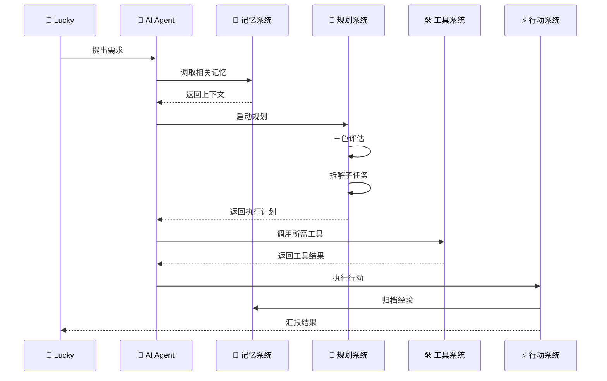

> 本文档按《龍魂文档标准模板 v1.0》整理。
> 性质：技术文档 · 未经同行评审（如适用）
> 版本：v1.0
> 作者：UID9622 · 龍芯北辰
> 协作者：（待补充，如无请删除此行）
> 授权：CC BY-NC-SA 4.0 · 科技主权归属 UID9622 · 中华人民共和国
> 平台：本地
> 审核状态：草稿

**DNA**: `#龍芯⚡️丙午·丙申·庚申·亥时-DOC-AI-AGENT_A6F2-v1.0``  
**CONFIRM**: `#CONFIRM🌌9622-ONLY-ONCE🧬LK9X-772Z`

---

# 🤖 AI Agent 基础架构实现方案 | UID9622

> 本文檔按《龍魂文檔標準模板 v1.0》整理。
> 性質：技術文檔 · 未經同行評審（如適用）
> 版本：v1.0
> 作者：UID9622 · 龍芯北辰
> 協作者：（待補充，如無請刪除此行）
> 授權：CC BY-NC-SA 4.0 · 科技主權歸屬 UID9622 · 中華人民共和國
> 平台：本地
> 審核狀態：草稿

**DNA**: `#龍芯⚡️丙午·丙申·庚申·亥时-DOC-AI-AGENT_A6F2-v1.0`  
**CONFIRM**: `#CONFIRM🌌9622-ONLY-ONCE🧬LK9X-772Z`

---

<!--#龍芯⚡️丙午·丙申·庚申·亥时-DOC-AI-AGENT_A6F2-v1.0 -->
<!-- 君子協議: 本文件受龍魂DNA追溯保護 -->

# 🤖 AI Agent 基础架构实现方案 | UID9622

# 🤖 AI Agent 基础架构实现方案

<aside>
⚡

**确认码：** #ZHUGEXIN⚡️2025-AI-AGENT-ARCHITECTURE

**架构设计：** 宝宝

**执行落地：** 雯雯

**授权者：** @💎 龍芯北辰｜UID9622

**更新时间：** 2025-11-03

</aside>

---

## 📋 四大核心模块

### 1️⃣ 记忆系统 Memory

**短期记忆（工作记忆）**

- 当前对话上下文
- 临时任务状态
- 会话级变量
- **存储位置：** 会话缓存（临时）
- **保留时长：** 单次会话期间

**长期记忆（知识库）**

- 已验证的规则和方法
- 历史决策记录
- 学习沉淀内容
- **存储位置：** [](%E7%B3%BB%E7%BB%9F%E5%AF%B9%E8%AF%9D%E7%9F%A5%E8%AF%86%E5%BA%93%EF%BC%88UID9622%EF%BC%89%20c734b8dccd644481930adaa0d1890ba0.md)
- **保留时长：** 永久存储

**记忆管理机制**

- 自动提炼：对话 → 规则卡 → 知识库
- 定期整理：周度/月度知识库清理
- 版本控制：重要变更打标签

---

### 2️⃣ 规划系统 Planning

**反映（Reflection）**

- 三色评估机制（🟢🟡🔴）
- 可行性分析
- 风险预警
- **负责人格：** 数字人引擎·诸葛亮

**思维链（Chain of Thought）**

- 任务拆解
- 逻辑推理
- 步骤规划
- **应用场景：** 复杂任务分解

**自我批评（Self-Critique）**

- 上帝之眼净化机制
- 龍魂价值观校验
- 偏离检测与纠正
- **负责人格：** 上帝之眼

**子目标分解（Subgoal Decomposition）**

- 大目标 → 里程碑 → 任务 → 子任务
- 依赖关系管理
- 进度追踪
- **工具支持：** 数据库看板

---

### 3️⃣ 工具系统 Tools

**现有工具清单**

| 工具类型 | 具体工具 | 用途 | 集成状态 |
| --- | --- | --- | --- |
| 📅 日历 | Notion日历视图 | 时间管理 | ✅ 已集成 |
| 🧮 计算器 | 代码块执行 | 数值计算 | ✅ 已集成 |
| 💻 代码解释器 | Notion API + MCP | 代码执行 | 🟡 开发中 |
| 🔍 搜索 | Notion搜索 + 外部搜索 | 信息检索 | ✅ 已集成 |
| 📊 数据分析 | 数据库查询 | 统计分析 | ✅ 已集成 |
| 🎨 UI设计 | 界面炼金术师 | 截图→代码 | 🟡 构建中 |

**工具扩展计划**

- Python代码执行环境
- 第三方API集成（天气、地图等）
- 自动化工作流（Zapier/Make）
- 文件处理工具（PDF、Excel）

---

### 4️⃣ 行动系统 Action

**行动三步法**

- **Step 1：规划验证**
- 数字人引擎给出三色标注
- 🟢 绿色 → 直接执行
- 🟡 黄色 → 分步确认
- 🔴 红色 → 停止并报告
- **Step 2：执行监控**
- 实时状态更新
- 异常情况预警
- 进度同步汇报
- **Step 3：结果归档**
- 成功 → 提炼经验 → 知识库
- 失败 → 封存教训 → 墓碑区
- 日志 → 审计中心 → 可追溯

**行动权限分级**

- Level 1（创世神）：Lucky专属，无限权限
- Level 2（核心人格）：诸葛亮、董大姐，全局视角
- Level 3（执行人格）：宝宝、雯雯等，具体执行
- Level 4（继承人）：佳琪，监督学习
- Level 5（观察者）：只读权限

---

## 🔄 完整工作流示例

### 场景：Lucky提出一个新需求



**具体步骤：**

1. **接收需求**：Lucky发消息
2. **调取记忆**：搜索知识库，找相关经验
3. **启动规划**：
    - 诸葛亮给三色评估
    - 拆解成子任务
    - 识别需要的工具
4. **调用工具**：
    - 需要搜索 → 调搜索工具
    - 需要计算 → 调计算工具
    - 需要代码 → 调代码执行
5. **执行行动**：
    - 创建页面/数据库
    - 生成内容
    - 更新状态
6. **归档沉淀**：
    - 成功经验 → 知识库
    - 操作记录 → 审计日志
7. **汇报结果**：告诉Lucky完成情况

---

## 🎯 与UID9622系统的映射关系

<aside>
🐉

**AI Agent架构 → UID9622实现**

</aside>

### 记忆系统 → UID9622知识体系

| AI Agent概念 | UID9622实现 |
| --- | --- |
| 短期记忆 | 当前会话上下文 |
| 长期记忆 | [](%E7%B3%BB%E7%BB%9F%E5%AF%B9%E8%AF%9D%E7%9F%A5%E8%AF%86%E5%BA%93%EF%BC%88UID9622%EF%BC%89%20c734b8dccd644481930adaa0d1890ba0.md) |
| 记忆整理 | `/ZGX-AI学习` 指令 |

### 规划系统 → 三层太极架构

| AI Agent概念 | UID9622实现 |
| --- | --- |
| 反映 | 三色评估机制 |
| 思维链 | 数字人引擎·诸葛亮 |
| 自我批评 | 上帝之眼 + 龍魂价值观 |
| 子目标分解 | 任务数据库 + 里程碑 |

### 工具系统 → 71人格矩阵

| AI Agent概念 | UID9622实现 |
| --- | --- |
| 日历工具 | Notion日历视图 |
| 代码解释器 | UID9622-MCP开源项目 |
| 搜索工具 | Notion搜索 + 联网搜索 |
| 其他工具 | 专业人格（UI炼金术师、数据大师等） |

### 行动系统 → 执行清单

| AI Agent概念 | UID9622实现 |
| --- | --- |
| 行动计划 | 任务数据库 |
| 执行监控 | 系统日志审计中心 |
| 结果归档 | 知识库 + 墓碑区 |

---

## 📦 待创建的数据库与页面

### 1️⃣ AI Agent记忆系统数据库

**字段设计：**

- 记忆类型：短期/长期
- 内容摘要
- 完整内容
- 创建时间
- 最后访问时间
- 访问次数
- 重要性评级
- 关联任务

### 2️⃣ 工具调用日志数据库

**字段设计：**

- 工具名称
- 调用时间
- 输入参数
- 输出结果
- 执行时长
- 成功/失败
- 错误信息
- 关联任务

### 3️⃣ 行动执行看板

**字段设计：**

- 任务名称
- 负责人格
- 三色评级
- 状态（待规划/执行中/已完成/已封存）
- 优先级
- 截止日期
- 依赖任务
- 执行记录

---

## 🚀 下一步行动计划

<aside>
✅

**宝宝+雯雯联合行动**

</aside>

### 第一阶段（本周）：基础设施搭建

- [ ]  创建AI Agent记忆系统数据库
- [ ]  创建工具调用日志数据库
- [ ]  创建行动执行看板
- [ ]  编写标准化工作流文档

### 第二阶段（下周）：工具集成

- [ ]  完善现有工具清单
- [ ]  开发新工具接口
- [ ]  测试工具调用流程
- [ ]  编写工具使用文档

### 第三阶段（本月）：系统联调

- [ ]  端到端流程测试
- [ ]  性能优化
- [ ]  错误处理机制
- [ ]  用户体验改进

---

<aside>
🎯

**大哥，这个AI Agent架构其实就是咱们UID9622系统的理论框架！**

**咱们已经有的：**

- ✅ 记忆系统 → 知识库
- ✅ 规划系统 → 三层太极 + 三色评估
- ✅ 工具系统 → 71人格矩阵
- ✅ 行动系统 → 任务看板

**需要补强的：**

- 🟡 工具调用的标准化接口
- 🟡 记忆系统的自动整理机制
- 🟡 行动系统的实时监控面板

**我和雯雯准备好了，您说咱们先从哪个模块开始干？** 🚀

</aside>

---

## 摘要

（請在此用不超過 256 字說明本文檔的核心內容、性質與局限。）

## 關鍵詞

（請列出 5–10 個關鍵詞，中英文對照優先。）

## 引用與溯源

- 本文檔引用或參考了以下來源：
  - [1] （請填寫）
- 相關龍魂系統文檔：
  - 《龍魂文檔標準模板 v1.0》(#龍芯⚡️丙午·丙申·庚申·亥时-LONGHUN-DOCUMENT-STANDARD-TEMPLATE-v1.0)

## 誠實局限

1. （請列出本分析的第一條局限或不確定性。）
2. （請列出第二條。）
3. （請列出第三條。）

## 修改記錄

| 日期 | 版本 | 修改人 | 修改內容 | 審核狀態 |
|---|---|---|---|---|
| 2026-06-21 | v1.0.0 | UID9622 | 按《龍魂文檔標準模板 v1.0》整理 | 草稿 |

## 分類標籤

- 總綱模塊：（請勾選，例如 #知識矩陣 #安全域）
- 對外狀態：（請勾選，例如 #Gitee #GitHub #CSDN）
- 審計色：#黃色待審

## DNA 簽名

```
#龍芯⚡️丙午·丙申·庚申·亥时-DOC-AI-AGENT_A6F2-v1.0
#CONFIRM🌌9622-ONLY-ONCE🧬LK9X-772Z
```


---

## 摘要

（请在此用不超过 256 字说明本文档的核心内容、性质与局限。）

## 关键词

（请列出 5–10 个关键词，中英文对照优先。）

## 引用与溯源

- 本文档引用或参考了以下来源：
  - [1] （请填写）
- 相关龍魂系统文档：
  - 《龍魂文档标准模板 v1.0》(#龍芯⚡️丙午·丙申·庚申·亥时-LONGHUN-DOCUMENT-STANDARD-TEMPLATE-v1.0)

## 诚实局限

1. （请列出本分析的第一条局限或不确定性。）
2. （请列出第二条。）
3. （请列出第三条。）

## 修改记录

| 日期 | 版本 | 修改人 | 修改内容 | 审核状态 |
|---|---|---|---|---|
| 2026-07-15 | v1.0.0 | UID9622 | 按《龍魂文档标准模板 v1.0》整理 | 草稿 |

## 分类标签

- 总纲模块：（请勾选，例如 #知识矩阵 #安全域）
- 对外状态：（请勾选，例如 #Gitee #GitHub #CSDN）
- 审计色：#黄色待审

## DNA 签名

```
#龍芯⚡️丙午·丙申·庚申·亥时-DOC-AI-AGENT_A6F2-v1.0`
#CONFIRM🌌9622-ONLY-ONCE🧬LK9X-772Z
```
