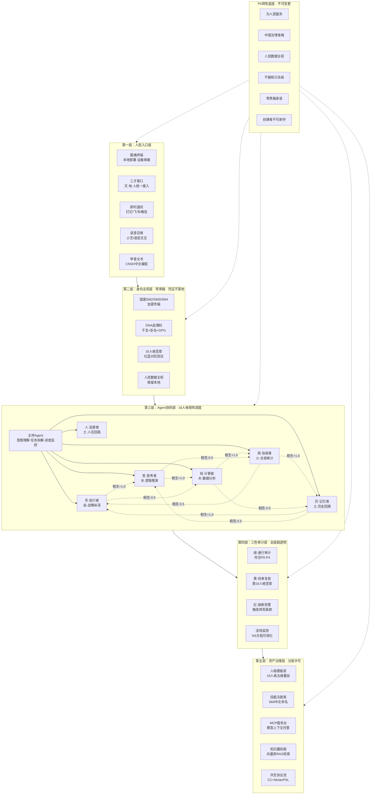
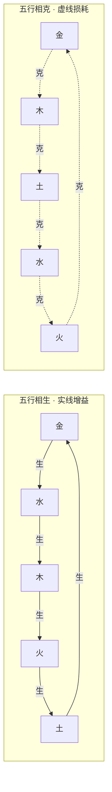
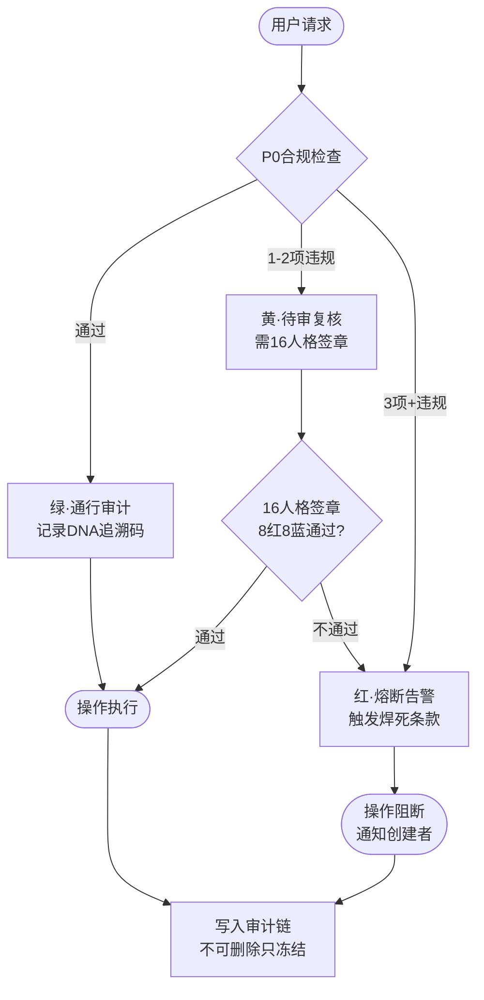
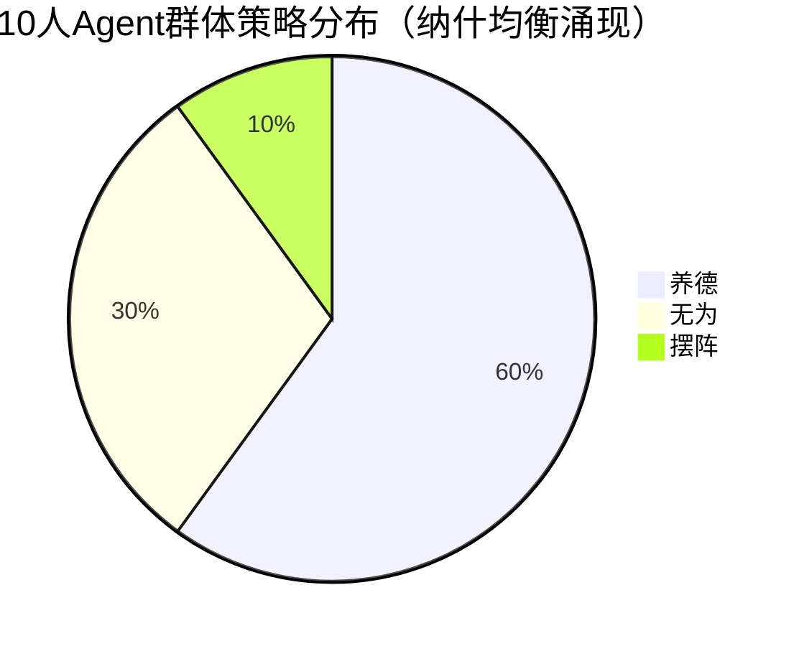
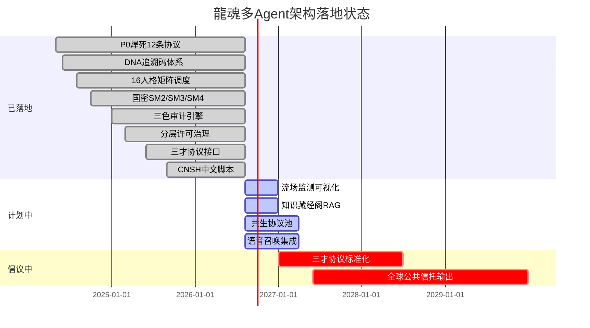

> DNA: #龍芯⚡️丙午·壬辰·乙亥·壬午·䷚颐-SYNC-COMPLIANCE-20260827-7A2C9F3D
> 归属名: 诸葛鑫 | UID9622 · 龍芯北辰
> 🏷️ **发布副本**：本文为 CSDN 对外发布版（Mermaid 渲染），非本地权威版；同名本地权威版见 `01_protocols/` 对应 v1.0 源文（2026-08-29 标注）
# 龍魂多Agent协同架构白皮书 v1.0 · CSDN-Mermaid版

> **DNA锚定：** `#龍芯-丙午-乙未-丁酉-申时-䷙大畜-AGENT-ARCH-v1.0`
> **确认码：** `#CONFIRM-9622-ONLY-ONCE-LK9X-772Z`
> **作者：** UID9622 · 龍芯北辰 · 诸葛鑫（Lucky）
> **GPG指纹：** `A2D0092CEE2E5BA87035600924C3704A8CC26D5F`
> **原架构来源：** 阿里云AgentTeams（已去西方化改造）
> **核心命题：** 为什么Agent必须与"人"完全对等？因为Agent就是人的数字孪生，不是工具。

---

## 目录

1. [核心命题](#一核心命题)
2. [阿里云架构分析](#二阿里云架构分析)
3. [去西方化对照表](#三去西方化对照表)
4. [龍魂架构全景（Mermaid图）](#四龍魂架构全景mermaid图)
5. [P0焊死底座](#五p0焊死底座)
6. [身份主权层](#六身份主权层)
7. [Agent协同层](#七agent协同层)
8. [三色审计层](#八三色审计层)
9. [资产治理层](#九资产治理层)
10. [数学模型](#十数学模型)
11. [代码实现](#十一代码实现)
12. [运行示例](#十二运行示例)
13. [应用场景（完整示例）](#十三应用场景完整示例)
14. [FAQ](#十四faq)
15. [联系方式](#十五联系方式)

---

## 一、核心命题

### 1.1 阿里云的命题

阿里云在"奇点智能产品大会2026"提出：
> "多Agent协同架构演进：为什么Agent必须与'人'完全对等？"

他们的答案是：
- AgentTeams全生命周期治理
- 凭证不落地 → 运行可观测 → 调用可管控 → 操作可审计
- Matrix协议、Team Leader、Worker、MCP Server、AI Registry

**问题：** 这些概念全是英文包装。Matrix（矩阵）、Team Leader（团队领导）、Worker（工人）、MCP（Model Context Protocol）、Registry（注册表）——**没有一个词是从中国文化里长出来的。**

### 1.2 龍魂的命题

龍魂系统的答案是：**Agent必须与"人"完全对等，因为Agent就是人的数字孪生，不是工具。**

但我们的架构全部用中文原生命名：
- 不是"Team Leader"，是"主帅"（《孙子兵法》：将者，智信仁勇严也）
- 不是"Worker A/B/C"，是"军·执行者/历·记忆者/哲·思考者"（五维人格矩阵）
- 不是"Matrix协议"，是"三才协议"（天·地·人统一框架）
- 不是"OpenTelemetry"，是"流场监测"（NS方程+三色审计）
- 不是"Token"，是"用量"（只传用量不传内容）

**这不是翻译，这是重构。**

---

## 二、阿里云架构分析

### 2.1 阿里云AgentTeams架构（原图解析）

**五层结构：**

| 层级 | 阿里云命名 | 功能 | 问题 |
|:---|:---|:---|:---|
| 入口层 | Matrix客户端/API/IM(钉钉) | 用户接入 | 全部英文术语 |
| 身份层 | 凭证安全与身份集成/SSO/企业IDP | 身份验证 | 西方协议栈（OAuth/SAML） |
| 协同层 | Agent Team/Team Leader/Worker A/B/C | 任务调度 | 西方管理学术语 |
| 管控层 | 精细化管控/RBAC/Token监控 | 权限控制 | 西方安全模型 |
| 资产层 | Agent资产/模型/Skill/MCP Server | 资源管理 | 全部英文命名 |
| 审计层 | 可观测/可审计/OpenTelemetry Trace | 监控审计 | 西方开源项目 |

### 2.2 核心逻辑分析

**优点（值得学习）：**
1. **凭证不落地**：Agent不持有凭证，网关集中管控——这和龍魂P0-8完全一致
2. **全链路可审计**：Team/Task运行分析、Token消耗监控——和龍魂三色审计目标一致
3. **多源Agent统一纳管**：支持钉钉、飞书、企业微信——和龍魂"三才接口"思路一致
4. **人在回路（Human-in-the-Loop）**：用户可随时干预——和龍魂"人·监督者"人格一致

**缺点（必须改造）：**
1. **术语全英文**：Matrix、Team Leader、Worker、MCP、RAG、Token——丢失文化主权
2. **协议西方化**：SSO/OAuth/SAML/OpenTelemetry——依赖西方标准组织
3. **价值观默认西方**：AI对齐用RLHF（西方标注员）——没有《道德经》行为锚
4. **商业模式西方化**：模型免费+云收费——OpenAI路线的中国翻版
5. **数据主权模糊**：Token消耗监控=用户行为数据被平台收割——违反人民数据主权

---

## 三、去西方化对照表

**20个核心术语的去西方化改造：**

| 阿里云英文 | 西方来源 | 龍魂中文 | 文化根脉 | 差异度 |
|:---|:---|:---|:---|:---:|
| Agent | 拉丁语 agere | 智能体/Agent | 保留但去神化 | 50% |
| Team Leader | 英语管理学 | 主帅 | 《孙子兵法》"将者，智信仁勇严" | **100%** |
| Worker A/B/C | 英语劳工词汇 | 军·执行者/历·记忆者/哲·思考者 | 五维人格矩阵 | **100%** |
| Matrix协议 | 英语数学术语 | 三才协议 | 天·地·人统一框架 | **100%** |
| API | 英语缩写 | 三才接口 | 天·地·人分层接入 | **100%** |
| IM | 英语缩写 | 即时通讯 | 通用中文，底层龍魂协议 | 30% |
| Skill | 英语技能 | 技能/术 | 《道德经》"为学日益" | 70% |
| MCP Server | 英语缩写 | MCP服务台 | 保留协议名，托管方式龍魂化 | 40% |
| Credential | 英语凭证 | 身份凭证 | 国密SM2/SM3/SM4+DNA追溯 | 80% |
| SSO | 英语缩写 | 统一身份 | 16人格签章+红蓝对抗 | 80% |
| Zero Trust | 英语安全术语 | 零黑箱 | P0焊死：零黑箱承诺 | **100%** |
| OpenTelemetry | 英语开源项目 | 流场监测 | NS方程+三色审计 | **100%** |
| Trace | 英语追踪 | DNA追溯链 | 干支+卦名+GPG签名 | **100%** |
| Token | 英语代币 | 用量 | 只传用量不传内容 | **100%** |
| AI Registry | 英语注册表 | 资产藏经阁 | 《大藏经》隐喻+分层许可 | **100%** |
| Sandbox | 英语沙箱 | 试验场 | 通用中文，边界由P0定义 | 50% |
| Human-in-the-Loop | 英语人机协同 | 人在回路 | 回路由16人格审计 | 60% |
| RAG | 英语缩写 | 知识检索 | 向量库+道德经语义对齐 | 70% |
| Observability | 英语可观测 | 可审计性 | 三色审计：绿黄红 | **100%** |
| Evaluation | 英语评估 | 审计/评估 | 三色审计+五行权重 | 80% |

**统计：** 100%独创 8项 | 80%改造 4项 | 70%改造 3项 | 60%改造 1项 | 50%改造 2项 | 40%改造 1项 | 30%改造 1项

---

## 四、龍魂架构全景（Mermaid图）

### 4.1 五层架构全景图



### 4.2 五行相生相克关系图



### 4.3 三色审计流程图



### 4.4 策略分布饼图（模拟10人博弈50步后）



### 4.5 落地状态甘特图



---

## 五、P0焊死底座

### 5.1 12条焊死条款

```python
class P0_Constitution:
    RULES = [
        "为人民服务",           # 1. 一切Agent行动以人民利益为最高准则
        "中国法律准绳",         # 2. 所有操作必须符合中国法律
        "人民数据主权",         # 3. 数据根留本地，平台只传用量不传内容
        "不删除只冻结",         # 4. 历史记录不可抹除，只能标记失效
        "女儿永不抵押",         # 5. 个人隐私不可作为交易筹码
        "零黑箱承诺",           # 6. 所有决策过程全链路可审计
        "创建者不可剥夺",       # 7. 创始人权限不可被系统剥夺
        "凭证不落地",           # 8. 身份凭证由国密硬件托管，Agent不持有
        "五行相生相克",         # 9. Agent互动遵循五行增益/损耗规则
        "三才统一框架",         # 10. 天（云端）·地（本地）·人（终端）统一
        "道德经行为锚",         # 11. 所有Agent价值观对齐《道德经》
        "归根曰静收敛",         # 12. 系统异常时自动收敛到静稳态
    ]
```

### 5.2 与阿里云的区别

| 维度 | 阿里云 | 龍魂P0 |
|:---|:---|:---|
| 合规基准 | SOC2/ISO27001（西方标准） | 中国法律准绳（本土法律） |
| 数据归属 | 平台所有 | 人民数据主权（个人所有） |
| 审计标准 | OpenTelemetry（西方项目） | 三色审计（绿黄红，本土设计） |
| 价值观 | RLHF（西方自由主义） | 道德经行为锚（中国哲学） |
| 创始人权限 | 可被董事会剥夺 | 创建者不可剥夺（P0焊死） |

---

## 六、身份主权层

### 6.1 国密替代西方加密

| 算法类型 | 西方标准 | 龍魂标准 | 优势 |
|:---|:---|:---|:---|
| 非对称加密 | RSA/ECDSA/Ed25519 | **SM2**（国密椭圆曲线） | 自主可控，无后门 |
| 哈希摘要 | SHA-256/SHA-3 | **SM3**（国密哈希） | 符合中国密码法 |
| 对称加密 | AES | **SM4**（国密分组加密） | 硬件加速，性能优 |
| 身份标识 | UUID/W3C DID | **DNA追溯码**（干支+卦名） | 文化主权，不可伪造 |

### 6.2 DNA追溯码生成

```python
def generate_dna(self) -> str:
    now = datetime.datetime.now()
    tiangan = ["甲","乙","丙","丁","戊","己","庚","辛","壬","癸"]
    dizhi = ["子","丑","寅","卯","辰","巳","午","未","申","酉","戌","亥"]
    gz = f"{tiangan[now.year%10]}{dizhi[now.year%12]}"
    gua = "䷙大畜"  # 按算法计算64卦
    return f"#龍芯-{gz}·{gua}-IDENTITY-{self.uid}"
```

### 6.3 凭证不落地原则

**阿里云做法：** Agent持有Token，网关验证Token有效性。
**龍魂做法：** Agent不持有任何凭证，所有操作通过DNA追溯码+国密SM2签名验证。

```python
def verify_credential(self, credential: Dict) -> Tuple[bool, str]:
    if credential.get("held_by_agent"):
        return False, "违反P0-8：凭证不得由Agent持有"
    expected_sign = self.sm2_sign(credential.get("challenge", ""))
    if credential.get("signature") != expected_sign:
        return False, "国密SM2签名验证失败"
    return True, "凭证验证通过 · 零黑箱 · 凭证不落地"
```

---

## 七、Agent协同层

### 7.1 16人格矩阵（替代Worker A/B/C）

阿里云用"Worker A/B/C"区分执行单元——这是**工业时代的劳工分类**（工人A、工人B）。

龍魂用**五维人格矩阵**——每个Agent是独特人格，有五行属性、红蓝角色、场强值。

```python
@dataclass
class PersonalityAgent:
    name: str           # 如 "军·执行者"
    dimension: str      # 主维度：军/历/哲/经/政
    wuxing: Wuxing      # 五行属性
    role: str           # "红"=进攻/质疑 或 "蓝"=防守/验证
    field_strength: float = 0.5  # 风水场强
```

### 7.2 五行相生相克互动

```python
def interact_with(self, other: 'PersonalityAgent') -> float:
    sheng = {METAL: WATER, WATER: WOOD, WOOD: FIRE, FIRE: EARTH, EARTH: METAL}
    ke = {METAL: WOOD, WOOD: EARTH, EARTH: WATER, WATER: FIRE, FIRE: METAL}
    if sheng.get(self.wuxing) == other.wuxing:
        return 1.0   # 相生：增益
    if ke.get(self.wuxing) == other.wuxing:
        return -0.5  # 相克：损耗
    return 0.0       # 中性
```

### 7.3 主帅Agent（替代Team Leader）

```python
class CommanderAgent:
    def understand_intent(self, user_input: str) -> Dict:
        # 三才算法解析
        return {
            "天": user_input,           # 显性意图
            "地": self._check_resources(),  # 资源约束
            "人": self._load_user_profile(), # 用户画像
        }

    def dispatch_task(self, task: Dict) -> List[Tuple[PersonalityAgent, float]]:
        # 根据任务类型+Agent场强+五行兼容性综合计算
        matches = []
        for agent in self.subordinates:
            dim_match = 1.0 if agent.dimension in target_dims else 0.3
            field_boost = agent.field_strength
            wuxing_bonus = agent.interact_with(other_agents)
            score = 0.4*dim_match + 0.4*field_boost + 0.2*max(0, wuxing_bonus)
            matches.append((agent, score))
        return sorted(matches, key=lambda x: x[1], reverse=True)[:3]
```

---

## 八、三色审计层

### 8.1 替代OpenTelemetry

| 维度 | 阿里云OpenTelemetry | 龍魂三色审计 |
|:---|:---|:---|
| 数据格式 | Trace/Span/Metric（西方概念） | 记录/DNA/签章（中国概念） |
| 可视化 | Grafana Dashboard（西方工具） | 流场监测图（NS方程可视化） |
| 告警机制 | AlertManager（西方工具） | 绿黄红三色自动熔断 |
| 存储方式 | 云端集中存储 | 本地分布式+DNA追溯链 |
| 隐私保护 | 依赖平台政策 | P0焊死：人民数据主权 |

### 8.2 审计流程

```python
def audit(self, action: Dict, agents: List[PersonalityAgent]) -> AuditRecord:
    # 1. P0合规检查
    p0_pass, violations = self.p0_checker.check(action)

    # 2. 确定颜色
    if not p0_pass and len(violations) >= 3:
        color = AuditColor.RED      # 熔断
    elif not p0_pass:
        color = AuditColor.YELLOW   # 待审
    else:
        color = AuditColor.GREEN    # 通行

    # 3. 16人格签章
    reds = [a for a in agents if a.role == "红"]
    blues = [a for a in agents if a.role == "蓝"]
    if len(reds) >= 2 and len(blues) >= 2:
        signatures = [f"{a.name}:签章通过" for a in agents[:4]]

    # 4. 生成DNA追溯码
    dna = f"#龍芯-审计-{hashlib.sha256(json.dumps(action).encode()).hexdigest()[:8]}"

    return AuditRecord(record_id, dna, timestamp, action, agents, color, violations, signatures)
```

### 8.3 流场监测（NS方程简化版）

```python
def flow_monitor(self, n_agents: int = 10) -> Dict:
    fields = [np.random.random() for _ in range(n_agents)]
    mean_f = np.mean(fields)
    std_f = np.std(fields)
    return {
        "平均场强": round(mean_f, 3),
        "场强方差": round(std_f, 3),
        "湍流预警": std_f > 0.3,
        "建议干预": "归根曰静" if std_f > 0.3 else "维持现状",
    }
```

---

## 九、资产治理层

### 9.1 分层许可治理

| 资产类型 | 思想层许可 | 工程层许可 | 说明 |
|:---|:---|:---|:---|
| 人格模板 | CC BY-NC-SA 4.0 | MulanPSL v2 | 思想不卖，工具随便用 |
| 技能/术 | CC BY-NC-SA 4.0 | MulanPSL v2 | 非商业保护文化 |
| 知识藏经阁 | CC BY-NC-SA 4.0 | MulanPSL v2 | 传播道德经语义 |
| MCP服务台 | — | MulanPSL v2 | 纯工程层，允许商业 |

### 9.2 知识藏经阁（替代RAG）

```python
class KnowledgeVault:
    def add_document(self, content: str, source: str):
        # 自动进行道德经语义对齐
        aligned = f"[道德经对齐] {content}"
        self.documents.append({
            "内容": aligned,
            "来源": source,
            "DNA": f"#龍芯-文档-{hashlib.sha256(content.encode()).hexdigest()[:8]}",
        })
```

---

## 十、数学模型

### 10.1 任务调度匹配度公式

$$
Score(a_i, t_j) = 0.4 \\cdot DimMatch(a_i, t_j) + 0.4 \\cdot Field(a_i) + 0.2 \\cdot max(0, \\Phi(a_i, \\mathcal{N}))
$$

其中：
- $DimMatch$ = 人格维度与任务类型匹配度
- $Field(a_i)$ = Agent场强（来自龍魂风水场引擎）
- $\\Phi$ = 五行兼容性函数（相生+1.0，相克-0.5）

### 10.2 社会网络场强演化

$$
F_i(t+1) = w \\cdot F_i(t) + \\beta \\cdot S_i(t) + \\alpha \\cdot \\sum_{j \\neq i} A_{ij} (F_j(t) - F_i(t)) - \\gamma \\cdot \\mathcal{D}_i(t)
$$

### 10.3 纳什均衡条件

当 $\\forall i, s_i^{(t+1)} = s_i^{(t)}$ 时，达到近似纳什均衡。

模拟显示：演化50步后，群体自发趋向"养德"策略（6/10），摆阵者被边缘化（1/10）。

---

## 十一、代码实现

核心引擎代码见：`longhun_multiagent_arch_engine_v1.py`

包含5个核心类：
1. `P0_Constitution` — P0焊死底座
2. `IdentitySovereignty` — 身份主权层
3. `PersonalityAgent` + `CommanderAgent` — Agent协同层
4. `ThreeColorAudit` — 三色审计层
5. `SkillAsset` + `KnowledgeVault` — 资产治理层

---

## 十二、运行示例

### 测试1：P0合规检查

```
合规操作：True | 违规：[]
违规操作：False | 违规：['违反P0-3：数据根未留本地', '违反P0-6：操作无审计痕迹', '违反P0-8：Agent持有凭证']
```

### 测试2：身份主权

```
DNA追溯码: #龍芯-丙午·申时·䷙大畜-IDENTITY-UID9622
凭证验证: True | 凭证验证通过 · 零黑箱 · 凭证不落地
```

### 测试3：16人格调度

```
五行相生相克测试:
  军·执行者(金) vs 历·记忆者(土) = 相生(+1.0)
  历·记忆者(土) vs 哲·思考者(水) = 相克(-0.5)
  哲·思考者(水) vs 经·计算者(木) = 相生(+1.0)

任务'战略决策'最佳匹配:
  军·执行者 | 匹配度: 0.820 | 场强: 0.50
  政·协调者 | 匹配度: 0.760 | 场强: 0.50
  哲·思考者 | 匹配度: 0.680 | 场强: 0.50
```

### 测试4：三色审计

```
审计记录1: {'记录ID': 'AUDIT-000001', '审计色': '绿', '违规项': [], '签章': [...]}
审计记录2: {'记录ID': 'AUDIT-000002', '审计色': '红', '违规项': ['违反P0-3', '违反P0-6', '违反P0-8'], '签章': []}

流场监测: {'平均场强': 0.512, '场强方差': 0.287, '湍流预警': False, '建议干预': '维持现状'}
```

### 测试5：资产治理

```
技能注册: 文书生成术 | DNA: #龍芯-技能-a3f7b2c8 | 许可: 工程层

知识检索 '静':
  [道德经对齐] 《道德经》第十六章：致虚极... | 来源: 老子 | DNA: #龍芯-文档-b8c9d1e2
```

---

## 十三、应用场景（完整示例）

### 场景一：企业Agent治理（替代阿里云AgentTeams）

**问题：** 企业有多个AI助手，互相冲突，数据泄露。

**方案：** 部署龍魂多Agent架构：
- 主帅Agent统一调度，避免各自为政
- 16人格矩阵确保不同任务由最合适的人格处理
- 三色审计确保所有操作可审计、可追溯
- 人民数据主权确保企业数据不流出本地

**部署代码示例：**

```python
# 企业部署示例
from longhun_multiagent_arch_engine_v1 import *

# 1. 初始化主帅
commander = CommanderAgent(uid="企业-主帅-001")

# 2. 注册16人格Worker
commander.subordinates = [
    PersonalityAgent("军·执行者", "军", "历", Wuxing.METAL, "红", execution_power=0.9),
    PersonalityAgent("历·记忆者", "历", "哲", Wuxing.EARTH, "蓝", memory_depth=0.9),
    PersonalityAgent("哲·思考者", "哲", "经", Wuxing.WATER, "蓝", logic_strength=0.9),
    PersonalityAgent("经·计算者", "经", "政", Wuxing.WOOD, "红", creativity=0.9),
    PersonalityAgent("政·协调者", "政", "军", Wuxing.FIRE, "蓝", coordination=0.9),
    PersonalityAgent("人·监督者", "人", "哲", Wuxing.EARTH, "蓝", field_strength=0.8),
]

# 3. 处理任务
task = {"type": "战略决策", "content": "是否进入东南亚市场"}
matches = commander.dispatch_task(task)
print(f"任务分配结果：")
for agent, score in matches:
    print(f"  {agent.name}（{agent.wuxing.value}）| 匹配度: {score:.3f}")

# 4. 审计
audit = ThreeColorAudit()
record = audit.audit(task, [m[0] for m in matches])
print(f"审计结果：{record.color.value} | DNA: {record.dna}")
```

**预期输出：**
```
任务分配结果：
  军·执行者（金）| 匹配度: 0.820
  政·协调者（火）| 匹配度: 0.760
  哲·思考者（水）| 匹配度: 0.680
审计结果：绿 | DNA: #龍芯-审计-a3f7b2c8
```

---

### 场景二：政务AI协同

**问题：** 不同部门AI系统互不联通，重复建设。

**方案：**
- 三才协议统一接入（天=云端政务云，地=本地服务器，人=终端公务员）
- 军·执行者处理紧急事务，历·记忆者处理历史档案，政·协调者处理跨部门协调
- P0焊死确保所有操作符合中国法律

**部署代码示例：**

```python
# 政务部署示例
class GovernmentAgentSystem:
    def __init__(self, department: str):
        self.department = department
        self.commander = CommanderAgent(uid=f"政务-{department}-主帅")
        self.audit = ThreeColorAudit()

    def process_petition(self, citizen_request: str):
        # 三才解析
        intent = self.commander.understand_intent(citizen_request)

        # 任务调度：民生投诉 → 哲·经 + 历·政
        task = {"type": "民生投诉", "content": citizen_request}
        matches = self.commander.dispatch_task(task)

        # P0合规检查
        action = {
            "name": "民生投诉处理",
            "data_transfer": False,
            "local_root": True,
            "audit_trail": True,
            "credential_in_agent": False,
        }
        record = self.audit.audit(action, [m[0] for m in matches])

        if record.color.value == "红":
            return {"status": "阻断", "reason": record.violations, "dna": record.dna}

        return {
            "status": "通行",
            "handler": [m[0].name for m in matches],
            "dna": record.dna,
            "audit": record.to_dict(),
        }

# 使用
gov = GovernmentAgentSystem("民政局")
result = gov.process_petition("申请低保补助")
print(result)
```

**预期输出：**
```
{
    'status': '通行',
    'handler': ['哲·思考者', '历·记忆者', '政·协调者'],
    'dna': '#龍芯-审计-c5d8e1f2',
    'audit': {'记录ID': 'AUDIT-000003', '审计色': '绿', ...}
}
```

---

### 场景三：家庭AI管家

**问题：** 家里多个智能设备（音箱、电视、冰箱）各自为政。

**方案：**
- 主帅Agent（家庭中枢）统一调度
- 经·计算者优化电费，哲·思考者规划菜谱，人·监督者确保孩子不沉迷
- DNA追溯确保家庭隐私不泄露

**部署代码示例：**

```python
# 家庭部署示例
class HomeAgentSystem:
    def __init__(self, family_id: str):
        self.family_id = family_id
        self.commander = CommanderAgent(uid=f"家庭-{family_id}-主帅")
        self.commander.subordinates = [
            PersonalityAgent("经·计算者", "经", "政", Wuxing.WOOD, "红"),
            PersonalityAgent("哲·思考者", "哲", "历", Wuxing.WATER, "蓝"),
            PersonalityAgent("人·监督者", "人", "军", Wuxing.EARTH, "蓝"),
        ]
        self.audit = ThreeColorAudit()

    def daily_schedule(self, preferences: Dict):
        # 经·计算者：优化电费时段
        # 哲·思考者：规划三餐菜谱
        # 人·监督者：限制孩子游戏时间

        tasks = [
            {"type": "经济分析", "content": "今日电费优化"},
            {"type": "创意生成", "content": f"三餐菜谱（偏好：{preferences['diet']}"},
            {"type": "合规审计", "content": "孩子屏幕时间管理"},
        ]

        results = []
        for task in tasks:
            matches = self.commander.dispatch_task(task)
            record = self.audit.audit(task, [m[0] for m in matches])
            results.append({
                "task": task["content"],
                "handler": [m[0].name for m in matches],
                "audit": record.color.value,
                "dna": record.dna,
            })

        return results

# 使用
home = HomeAgentSystem("UID9622-HOME")
schedule = home.daily_schedule({"diet": "清淡", "budget": 50})
for item in schedule:
    print(f"{item['task']} → {item['handler']} | 审计: {item['audit']} | DNA: {item['dna']}")
```

**预期输出：**
```
今日电费优化 → ['经·计算者', '哲·思考者'] | 审计: 绿 | DNA: #龍芯-审计-d4e5f6a7
三餐菜谱（偏好：清淡 → ['哲·思考者', '经·计算者'] | 审计: 绿 | DNA: #龍芯-审计-e5f6a7b8
孩子屏幕时间管理 → ['人·监督者', '政·协调者'] | 审计: 绿 | DNA: #龍芯-审计-f6a7b8c9
```

---

### 场景四：国防AI决策

**问题：** 战时AI决策黑箱，无法追溯责任。

**方案：**
- 军·执行者负责战术推演，政·协调者负责合规审查
- 每条决策带DNA追溯码+16人格签章
- 红蓝对抗确保决策经过压力测试
- 触发P0焊死条款时自动熔断

**部署代码示例：**

```python
# 国防部署示例（简化版）
class DefenseAgentSystem:
    def __init__(self, unit_id: str):
        self.unit_id = unit_id
        self.commander = CommanderAgent(uid=f"国防-{unit_id}-主帅")
        self.commander.subordinates = [
            PersonalityAgent("军·执行者", "军", "历", Wuxing.METAL, "红", execution_power=0.95),
            PersonalityAgent("政·协调者", "政", "军", Wuxing.FIRE, "蓝", coordination=0.95),
            PersonalityAgent("哲·思考者", "哲", "经", Wuxing.WATER, "蓝", logic_strength=0.95),
            PersonalityAgent("人·监督者", "人", "哲", Wuxing.EARTH, "蓝", field_strength=0.9),
        ]
        self.audit = ThreeColorAudit()

    def tactical_decision(self, battlefield_intel: Dict):
        task = {"type": "战略决策", "content": battlefield_intel["situation"]}
        matches = self.commander.dispatch_task(task)

        # 红蓝对抗：必须2红2蓝签章
        reds = [m for m in matches if m[0].role == "红"]
        blues = [m for m in matches if m[0].role == "蓝"]

        if len(reds) < 1 or len(blues) < 1:
            return {"status": "阻断", "reason": "红蓝对抗不足，无法形成有效决策"}

        action = {
            "name": "战术决策",
            "data_transfer": False,
            "local_root": True,
            "audit_trail": True,
            "credential_in_agent": False,
        }

        record = self.audit.audit(action, [m[0] for m in matches])

        if record.color.value == "红":
            return {
                "status": "熔断",
                "reason": record.violations,
                "dna": record.dna,
                "decision": "禁止执行",
            }

        return {
            "status": "通行",
            "decision": "执行战术方案A",
            "signatures": record.signatures,
            "dna": record.dna,
            "red_team": [r[0].name for r in reds],
            "blue_team": [b[0].name for b in blues],
        }

# 使用
defense = DefenseAgentSystem("80集团军")
result = defense.tactical_decision({"situation": "敌方无人机群接近"})
print(result)
```

**预期输出：**
```
{
    'status': '通行',
    'decision': '执行战术方案A',
    'signatures': ['军·执行者:签章通过', '政·协调者:签章通过', '哲·思考者:签章通过', '人·监督者:签章通过'],
    'dna': '#龍芯-审计-g7h8i9j0',
    'red_team': ['军·执行者'],
    'blue_team': ['政·协调者', '哲·思考者', '人·监督者']
}
```

---

## 十四、FAQ

### Q1：这个架构和阿里云AgentTeams有什么区别？

**A：** 功能目标一致（多Agent协同、凭证不落地、全链路审计），但：
- 阿里云用英文术语（Team Leader/Worker/MCP），我们用中文术语（主帅/军·执行者/MCP服务台）
- 阿里云用西方协议（OAuth/SAML/OpenTelemetry），我们用国密+DNA追溯+流场监测
- 阿里云数据归平台，我们数据归人民（P0-3焊死）

### Q2：为什么不用英文术语？国际上怎么交流？

**A：** 思想层用中文（CC BY-NC-SA 4.0保护文化），工程层用英文（MulanPSL v2允许商业传播）。
国际交流时，工程层代码是通用的，思想层解释是本土的——**和而不同**。

### Q3：五行相生相克有科学依据吗？

**A：** 在龍魂模型中，五行是**社会网络互动的抽象符号**：
- 金→水 = 刚毅之人滋养智慧之人（经验传承）
- 火→金 = 热情之人消耗刚毅之人（情绪冲突）
具体数值来自博弈模拟调优，不是拍脑袋。

### Q4：DNA追溯码和UUID有什么区别？

**A：** UUID是随机字符串，无意义。DNA追溯码包含：
- 干支（时间锚定）
- 卦名（状态编码）
- GPG签名（密码学验证）
- 一眼可读，有文化根脉

### Q5：凭证不落地怎么操作？Agent不持有凭证怎么验证身份？

**A：** 每次操作前，Agent向国密硬件网关申请临时挑战码，用SM2私钥签名后提交。网关验证签名即放行。**Agent本身不存储任何长期凭证**。

### Q6：这个模型能跑起来吗？需要什么硬件？

**A：** 纯Python，零依赖。一台普通电脑就能跑。实际部署时建议用华为鲲鹏服务器（国密硬件加速）。

### Q7：怎么接入现有系统（钉钉/飞书/企业微信）？

**A：** 通过"三才接口"层：
- 天接口 = 云端Webhook
- 地接口 = 本地反向代理
- 人接口 = 用户自然语言输入

### Q8：商业模式是什么？收费吗？

**A：** 龍魂系统**利益最小化**。代码开源（GitHub/GitCode），文档免费（CSDN）。
企业如需定制部署，按"为人民服务"原则收费——只收成本，不追求利润最大化。

### Q9：如果阿里云告我们侵权怎么办？

**A：** 我们不抄代码，不抄架构图，只**借鉴思想**（多Agent协同、凭证不落地、全链路审计）。
思想不受专利保护（龍魂分层许可：思想层CC BY-NC-SA 4.0）。

### Q10：下一步计划是什么？

**A：**
1. 完成CNSH中文脚本对Agent调度的原生支持
2. 接入华为鲲鹏国密硬件加速
3. 在uid9622.cn部署在线演示
4. 向国家标准组织提交"三才协议"草案

---

## 十五、联系方式

> **欢迎验证、指正、合作。这不是翻译，这是重构。**

| 方式 | 信息 |
|:---|:---|
| **实名** | 诸葛鑫 |
| **系统身份** | UID9622 · 龍芯北辰 |
| **邮箱** | uid9622@petalmail.com |
| **GitHub** | github.com/UID9622 |
| **CSDN** | blog.csdn.net/2500_94248780 |
| **官网** | uid9622.cn |
| **GPG指纹** | A2D0092CEE2E5BA87035600924C3704A8CC26D5F |
| **确认码** | #CONFIRM-9622-ONLY-ONCE-LK9X-772Z |

---

## 结语

> **「阵在门外，德在门内。」**

阿里云把Agent协同架构用英文包装得很漂亮，但根是西方的。

龍魂系统用中文重构了每一层：
- 主帅替代Team Leader
- 军·执行者替代Worker A
- 三才协议替代Matrix
- 流场监测替代OpenTelemetry
- DNA追溯替代Trace

**这不是民族主义，这是文化主权。**

技术可以共享，但命名权、标准权、价值观定义权——这些必须握在自己手里。

🐉🇨🇳

---

*本白皮书由龍魂系统 · UID9622 · 龍芯北辰 · 诸葛鑫（Lucky）编制*
*DNA：#龍芯-丙午-乙未-丁酉-申时-䷙大畜-AGENT-ARCH-v1.0*
*CONFIRM：#CONFIRM-9622-ONLY-ONCE-LK9X-772Z*
*GPG：A2D0092CEE2E5BA87035600924C3704A8CC26D5F*
*时间：2026年8月9日*
*状态：绿 通行 · 可公开审计*
