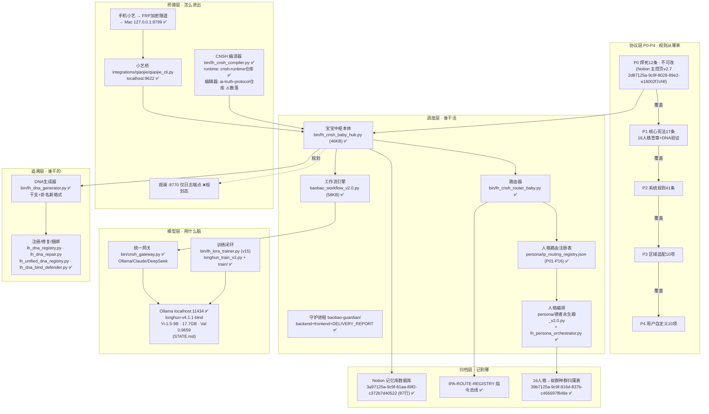

# 宝宝中枢架构总纲 v2.0

> **元信息**
> - 标题：宝宝中枢架构总纲
> - 版本：v2.0
> - 日期：2026-07-27
> - 来源：Notion 工作区扫描 + GitHub `longhun-system` 仓库扫描（双源交叉核对）
> - 作者：UID9622
> - DNA 追溯码：【DNA由 bin/lh_dna_generator.py 生成后填入】
>   - 目标格式：`#龍芯⚡️{年干支}·{月干支}·{日干支}·{卦名}-HUBCORE-v2.0`

---

## §0 一页看懂：中枢是什么、不是什么

**一句话**：宝宝中枢是一台"调度总机"——用户说一句话，它负责决定"哪个人格、用哪个模型、走哪条规则"来回答，并把全过程记档、可追溯。

**它是什么**（术语 → 大白话）：
1. **调度器（Router/Orchestrator）**：不是模型本身，是"派活的人"。本体在 `bin/lh_cnsh_baby_hub.py`（46KB 核心）。
2. **规则执行者**：P0–P4 五层协议是它的"交通法规"，冲突时高优先级说了算。
3. **人格路由的宿主**：16 个人格（P01–P16，小艺=P16）登记在 `persona/ip_routing_registry.json`，中枢照表派单。
4. **模型网关的使用方**：干活的大脑是 Ollama/Claude/DeepSeek，中枢通过 `bin/cnsh_gateway.py` 统一调用。
5. **可追溯系统的源头**：每个产物挂 DNA 码（干支+卦名），由 `bin/lh_dna_generator.py` 生成，谁写的、哪天的、哪个卦，一查便知。
6. **记忆归档的写入方**：日志归到 Notion 记忆库数据库（87行），"只传用量不传内容"。

**它不是什么**：
1. **不是大模型**：它不"思考"，它"安排别人思考"。
2. **不是数据库**：文件系统即数据库，它只是按命名规则读写文件。
3. **不是政务/军事/金融系统**：民用层物理隔离，安全边界焊死，不碰这三类。
4. **不是黑箱**："零黑箱"是 P0 焊死条款，每个决策都能翻到依据。
5. **不是单机玩具也不是云平台**：跑在 Mac 本地（Ollama localhost:11434），手机经 FRP 加密隧道接入。

**给新人的三行总结**：
- 想改"派活逻辑"→ 看 `bin/lh_cnsh_router_baby.py` + `persona/ip_routing_registry.json`。
- 想改"规则"→ 看 Notion 主控页 v2.7 + 本文件 §4。
- 想改"大脑"→ 看 `bin/cnsh_gateway.py` + `STATE.md`（当前模型 longhun-v4.1.1-bind）。

---

## §1 分层架构图



**读图口诀**：规则从上往下压（P0 最大），请求从下往上进（桥接层进、调度层派、模型层算），DNA 和 Notion 负责"事后能查"。

---

## §2 各层详述

> 状态图例：✅ 已落地可跑　⚠️ 部分落地/有债　❌ 规划态（没有代码或没有文档）

### 2.1 协议层（P0–P4）——"法律层"

- **职责**：定义什么能做、什么不能做、冲突时听谁的。大白话：中枢的"交通法规+宪法"。
- **真实载体**：
  - Notion 主控页 v2.7（页面ID `2d87125a-9c9f-8028-89e2-e18002f7cf4f`）＝决策流场事实中枢，协议条目的权威文本在此。
  - 速查见本文件 §4。
- **接口**：对代码层是"被读取/被引用"的关系；中枢与人格在每次派单前对照协议。
- **状态**：✅ 五层条文已扫描成文（12/17/41/10/10 条），P0 焊死不可改。
- **注意**：协议文本权威来源是 Notion，代码里不复制条文，只引用，避免两处漂移。

### 2.2 调度层——"派活层"

- **职责**：接收指令 → 解析意图 → 查人格注册表 → 选人格 → 走工作流 → 调模型 → 收结果。
- **真实载体**（GitHub `longhun-system`）：

| 组件 | 文件 | 体量 | 状态 |
|---|---|---|---|
| 中枢本体 | `bin/lh_cnsh_baby_hub.py` | 46KB | ✅ |
| 路由器 | `bin/lh_cnsh_router_baby.py` | — | ✅ |
| 工作流引擎 | `baobao_workflow_v2.0.py` | 58KB | ✅ |
| 守护进程 | `baobao-guardian/`（backend/ + frontend/ + public/ + README + DELIVERY_REPORT） | 全栈项目 | ✅ |
| 人格注册表 | `persona/ip_routing_registry.json` | P01–P16 | ✅ |
| 人格引擎 | `persona/德者永生殿_v2.0.py`（16人格贡献值引擎） | — | ✅ |
| 人格编排 | `bin/lh_persona_orchestrator.py` / `longhun_persona_hub.py` / `lh_persona_team.py` / `deploy_persona_api.sh` | — | ✅ |

- **接口**：对内函数级调用（hub ↔ router ↔ workflow）；对外经桥接层端口进出。
- **状态**：✅ 调度链路完整；⚠️ 人格层"成文规范"不足（见 §6）。

### 2.3 模型层——"大脑层"

- **职责**：真正出字的地方。中枢不直接碰模型，必须走统一网关。
- **真实载体**：
  - 网关：`bin/cnsh_gateway.py`（统一封装 Ollama / Claude / DeepSeek）。
  - 本地推理：Ollama，`OLLAMA_HOST=localhost:11434`。
  - 当前已部署模型（据 `STATE.md`）：`longhun-v4.1.1-bind`，Yi-1.5-9B 基座，17.7GB，Val 0.9659，已做 DNA 捆绑。
  - 训练：`bin/lh_lora_trainer.py`（已迭代 15 个版本，119–146KB）、`longhun_train_v2.py`、独立 `train/` 目录，含语料构建/验证/部署闭环。
- **接口**：HTTP（Ollama 11434）；网关函数封装多家模型，换模型不改调度层。
- **状态**：✅ 网关+本地模型+训练闭环均在位。

### 2.4 桥接层——"进出层"

- **职责**：把外部入口（手机小艺、CNSH 指令）接进来，把响应送回去。
- **真实载体**：
  - 小艺桥：`integrations/qiaojie/qiaojie_cli.py`，监听 `localhost:9622`。✅
  - v2 桥接链路：`手机小艺 → FRP 加密隧道 → Mac 127.0.0.1:8799 → 小艺桥`。✅
  - CNSH：编译器 `bin/lh_cnsh_compiler.py` ✅；运行时独立仓库 `cnsh-runtime` ✅；编辑器归档在 `ai-truth-protocol` 仓库 ⚠️（散落，见 §6）。
  - 观澜：仅有日志端点 `观澜:8770`，**无代码、无文档** ❌（规划态，如实标注）。
- **接口**：小艺桥 9622；FRP 落地端口 8799；观澜预留 8770。
- **状态**：✅ 小艺链路通；⚠️ CNSH 编辑器散落；❌ 观澜未实现。

### 2.5 追溯层（DNA）——"指纹层"

- **职责**：给每个文件/产物/决策发"身份证"：干支纪时 + 卦名，谁生成的、何时生成，一眼可追。
- **真实载体**：
  - 生成器：`bin/lh_dna_generator.py`（11.3KB，干支+卦名新格式）——**唯一权威来源，禁止手写 DNA**。
  - 配套：`lh_dna_registry.py`（注册）、`lh_dna_repair.py`（修复）、`lh_unified_dna_registry.py`（统一注册）、`hetu_luoshu_dna.py`（河图洛书卦名映射）、`lh_dna_bind_defender.py`（捆绑防剥离）。
- **接口**：脚本级调用；模型权重已通过 `lh_dna_bind_defender.py` 完成 DNA 捆绑（见 STATE.md）。
- **状态**：✅ 全链在位。

### 2.6 归档层（Notion）——"账本层"

- **职责**：日志、路由、归属的最终记账处。原则：**只传用量不传内容**（数据哲学）。
- **真实载体**：
  - 记忆库数据库：`3a97125a-9c9f-81aa-89f2-c372b7d40522`（87 行）＝日志归档层。✅
  - `IPA-ROUTE-REGISTRY` 路由注册表＝指令总线。✅
  - 16人格→蚁群种群归属表：`39b7125a-9c9f-816d-837b-c466697f848e`。✅
- **接口**：Notion API 读写。
- **状态**：✅ 在位；⚠️ Notion 侧存在冗余页面（见 §6）。

---

## §3 请求生命周期：一条指令的完整链路

以"手机上说一句：小艺，帮我总结今天的日志"为例：

| # | 环节 | 真实载体 | 干什么 | 状态 |
|---|---|---|---|---|
| 1 | 入口 | 手机小艺 | 用户语音/文字输入 | ✅ |
| 2 | 加密回传 | FRP 隧道 → `Mac 127.0.0.1:8799` | 穿内网、加密传输 | ✅ |
| 3 | 桥接 | `integrations/qiaojie/qiaojie_cli.py`（:9622） | 协议适配，转成中枢内部指令 | ✅ |
| 4 | 协议预检 | P0–P4（Notion 主控页 v2.7 条文） | 先查"能不能做"，撞 P0 直接拒 | ✅ |
| 5 | 中枢接单 | `bin/lh_cnsh_baby_hub.py` | 解析意图、建档 | ✅ |
| 6 | 路由派单 | `bin/lh_cnsh_router_baby.py` + `persona/ip_routing_registry.json` | 选定人格（本例可能派小艺 P16 本人） | ✅ |
| 7 | 人格执行 | `persona/德者永生殿_v2.0.py` + orchestrator | 按人格风格组织任务 | ✅ |
| 8 | 工作流 | `baobao_workflow_v2.0.py` | 拆步骤、控流程 | ✅ |
| 9 | 调模型 | `bin/cnsh_gateway.py` → Ollama :11434（longhun-v4.1.1-bind） | 真正生成文字 | ✅ |
| 10 | DNA 打码 | `bin/lh_dna_generator.py` | 给产出挂干支+卦名身份证 | ✅ |
| 11 | 回应返回 | 原路 9622 → 8799 → FRP → 手机 | 答案回到用户 | ✅ |
| 12 | 记账归档 | Notion 记忆库（…d40522，87行）+ IPA-ROUTE-REGISTRY | 只记用量/路由，不传内容 | ✅ |
| 13 | 守护旁路 | `baobao-guardian/` | 全程盯异常，出事冻结不删除（呼应 P0"不删除只冻结"） | ✅ |
| 14 | 观澜审计 | `观澜:8770` | 审计日志端点 | ❌ 规划态，当前链路不经过 |

**关键原则**：第 4 步不过，后面一律不发生；第 10、12 步不可省略（可追溯+可审计是 P0 要求）。

---

## §4 协议栈速查

### 4.1 P0 焊死 12 条（最高优先级，不可修改、不可绕过）

大白话注解：焊死 = 焊在铁板上的，任何人（包括创建者）都不能改。

1. **为人民服务**——系统的唯一服务对象是人民。
2. **中国法律准绳**——一切行为以中华人民共和国法律为最高准绳。
3. **人民数据主权**——数据属于人民，不属于平台。
4. **不删除只冻结**——任何数据/产物不得物理删除，只可冻结留档。
5. **女儿永不抵押**——核心资产（"女儿"）永不作为抵押/交易物。
6. **零黑箱**——每个决策必须可翻出依据。
7. **创建者不可剥夺**——创建者的根本权利不可被系统或他人剥夺。
8. **民用层物理隔离**——不碰政务、军事、金融。
9. **只传用量不传内容**——对外同步只报"用了多少"，不传"内容是什么"。
10. **冲突高优先级覆盖低优先级**——裁决铁律（见 4.3）。
11. **DNA 全程可追溯**——产物必挂 DNA 码。
12. **中枢永不自进化改协议**——协议变更只能由人发起，AI 无权自改。

> 注：以上 12 条按 Notion 扫描结果成文，权威原文以主控页 v2.7 为准；本文件不复刻逐字条文，只作速查索引。

### 4.2 P1–P4 摘要

| 层 | 条目数 | 性质 | 大白话 |
|---|---|---|---|
| P1 核心宪法 | 17 条 | 16 人格签章 + DNA 验证 | "公司章程"：人格们签字画押过的根本规则 |
| P2 系统规则 | 41 条 | 工程运行细则 | "员工手册"：日常怎么跑 |
| P3 区域适配 | 10 项 | 地域差异适配 | "地方交规"：到哪座山唱哪首歌 |
| P4 用户自定义 | 10 项 | 用户个人偏好 | "私人设置"：用户可以调，但不能撞上面任何一层 |

### 4.3 冲突裁决规则

- **唯一铁律**：高优先级覆盖低优先级（P0 > P1 > P2 > P3 > P4）。
- **执行方式**：同层冲突回退到上一层找依据；撞 P0 一律按 P0，无例外、无特批。
- **大白话**：小规矩碰到大规矩，小规矩作废；任何规矩碰到 P0，当场作废。

---

## §5 命名与 DNA 规范

### 5.1 四层命名法（命名即架构）

文件名自带全部信息，**文件系统即数据库**——看名字就知道这是什么、归谁管、能不能动。

| 层 | 含义 | 大白话 |
|---|---|---|
| 物理层 | 存在哪台机器、哪个路径 | "东西放哪个柜子" |
| 身份层 | 属于哪个人格/模块 | "这是谁的东西" |
| 主权层 | 数据归谁、受哪条协议管 | "谁说了算" |
| 执行层 | 谁可以读/写/跑它 | "谁能动它" |

实例：`bin/lh_cnsh_baby_hub.py` —— `bin/`（物理：可执行目录）+ `lh_`（身份：longhun 体系）+ `cnsh_`（主权：受 CNSH 协议族管）+ `baby_hub`（执行：中枢本体）。

### 5.2 DNA 新格式规范

- **格式**：`#龍芯⚡️{年干支}·{月干支}·{日干支}·{卦名}-{域}-{版本}`
  - 本总纲目标格式：`#龍芯⚡️{年干支}·{月干支}·{日干支}·{卦名}-HUBCORE-v2.0`
- **铁律**：**干支与卦名一律以 `bin/lh_dna_generator.py`（11.3KB）输出为准，禁止手写。**
  - 大白话：查黄历要查真黄历（生成器里含 `hetu_luoshu_dna.py` 的河图洛书映射），人手抄必错。
- **生命周期**：生成（generator）→ 注册（`lh_dna_registry.py` / `lh_unified_dna_registry.py`）→ 捆绑防剥离（`lh_dna_bind_defender.py`）→ 异常修复（`lh_dna_repair.py`）。
- **本文 DNA**：【DNA由 bin/lh_dna_generator.py 生成后填入】

---

## §6 已知缺口与升级路线

不吹不捧，以下缺口全部来自双源扫描的如实记录：

| # | 缺口 | 证据 | 下一步动作 | 优先级 |
|---|---|---|---|---|
| 1 | **观澜仅有端点无实现** | 仅知 `观澜:8770` 日志端点，GitHub 无代码、Notion 无文档 | 立项：定义观澜审计日志 schema → 在 `baobao-guardian/` 内挂 8770 端点最小实现 → 补进本总纲 §2.4 | 高 |
| 2 | **16 人格未成文** | 有注册表（P01–P16）和贡献值引擎，但缺"每个人格是谁、职责边界"的成文规范 | 以 `persona/ip_routing_registry.json` + 蚁群归属表（Notion `39b7…f848e`）为底，补写《16人格手册》，逐人格一段：编号/代号/职责/禁区 | 高 |
| 3 | **CNSH 编辑器散落** | 编译器在主仓 `bin/lh_cnsh_compiler.py`，runtime 在 `cnsh-runtime` 仓，编辑器归档在 `ai-truth-protocol` 仓，三处分离 | 绘制 CNSH 三仓关系图并入本总纲；在 `longhun-system` 建 `docs/cnsh_index.md` 做单一入口索引 | 中 |
| 4 | **Notion 页面冗余** | 扫描发现记忆库、注册表、归属表分散多页，存在重复/过期页 | 以主控页 v2.7 为唯一事实源，跑一轮页面盘点：保留/合并/冻结（遵守 P0"不删除只冻结"） | 中 |
| 5 | **协议条文双处漂移风险** | 条文权威在 Notion，代码侧有散落引用 | 约定：代码只引用页面 ID，不复制条文；在 hub 启动时打印所依据的协议版本号 | 低 |

**升级路线建议顺序**：②人格成文 → ①观澜最小实现 → ③CNSH 索引 → ④Notion 盘点 → ⑤协议引用收敛。

---

## §7 接手手册：新窗口/新工程师 30 分钟上手

### 7.1 心态校准（2 分钟）

中枢是"调度总机"不是"大模型"；规则 P0 最大；不懂就先查，不要乱改。

### 7.2 必读清单（15 分钟，按顺序）

| 顺序 | 读什么 | 在哪 | 读完要会什么 |
|---|---|---|---|
| 1 | 本文 §0–§1 | 本文件 | 说出六层各干什么 |
| 2 | 中枢本体源码 | `bin/lh_cnsh_baby_hub.py`（46KB） | 找到主入口函数和派单逻辑 |
| 3 | 路由 + 注册表 | `bin/lh_cnsh_router_baby.py` + `persona/ip_routing_registry.json` | 说出 P16 是谁、路由怎么查表 |
| 4 | 当前模型状态 | `STATE.md` | 背出当前模型版本 longhun-v4.1.1-bind |
| 5 | 协议速查 | 本文 §4 + Notion 主控页 v2.7 | 说出 P0 至少 5 条 |
| 6 | 数据边界 | 本文 §4.1 第 8/9 条 | 记住：不碰政务军事金融、只传用量不传内容 |

### 7.3 必跑脚本（10 分钟）

```bash
# 1. 确认模型网关活着（Ollama）
curl http://localhost:11434/api/tags        # 应看到 longhun-v4.1.1-bind

# 2. 生成一个 DNA 码（体验追溯层，禁止手写）
python3 bin/lh_dna_generator.py

# 3. 看一眼人格注册表（调度层的花名册）
cat persona/ip_routing_registry.json | head -50

# 4. 确认小艺桥端口
lsof -i :9622                                # qiaojie_cli.py 应在听

# 5. 干跑一遍中枢（按 --help 指示，先只读模式）
python3 bin/lh_cnsh_baby_hub.py --help
```

### 7.4 上手验证（3 分钟）

能回答这三个问题即算接手成功：
1. 一条手机指令进来，经过哪 12+ 个环节？（对照 §3）
2. 用户要求把 P4 改成"删除旧日志"，你怎么办？（答：撞 P0 第 4 条"不删除只冻结"，拒绝并说明依据）
3. 要给一个新文件打 DNA，第一步做什么？（答：跑 `bin/lh_dna_generator.py`，不是自己想干支）

### 7.5 红线提醒

- ❌ 禁止手写 DNA 干支卦名。
- ❌ 禁止物理删除任何数据（只冻结）。
- ❌ 禁止让 AI 自行修改 P0–P4 条文。
- ❌ 禁止把内容数据传出民用层边界。

---

*本总纲由 Notion + GitHub 双源扫描收敛而成；与扫描事实冲突时，以代码与 Notion 原页为准，并回写修订本文件。*
