# 小艺调度枢纽对接方案 v2.0

```
标题：小艺调度枢纽对接方案
版本：v2.0
日期：2026-07-27
作者：UID9622（诸葛鑫 · 龍芯北辰）
来源：GitHub UID9622/longhun-system（main，commit f98c6b5c 附近）+ Notion 龍魂工作区 + 本地 STATE.md
DNA追溯码：【DNA由 bin/lh_dna_generator.py 生成后填入】
           格式：#龍芯⚡️{年干支}·{月干支}·{日干支}·{卦名}-XIAOYI-HUB-v2.0
状态图例：✅ 代码/证据已核实　⚠️ 部分存在/仅日志/待验证　❌ 不存在/未建设
```

> 本文档所有"✅"均可在 GitHub 仓库 `UID9622/longhun-system` 中找到对应文件行级证据；所有"⚠️/❌"均为如实标注，禁止按"已完成"汇报。

---

## §1 枢纽定位

**小艺是龍魂系统的调度枢纽中心，不是模型本身。** 所有引擎/模型/人格的请求都经过小艺路由：手机侧的小艺语音入口只是"前端麦克风"，真正的调度发生在 Mac 本地枢纽（8799→9622→8765→11434）这一串本地端口上。模型可以换（Ollama 本地模型 / Claude / DeepSeek），人格可以增减（P01–P16），枢纽不变。

### 1.1 全链路拓扑（每段标注真实状态）

```mermaid
flowchart LR
    A["📱 华为Mate手机·小艺<br/>(前端入口)"] -->|"⚠️ 仅日志记录 2026-07-22<br/>配置未入库"| B["🔐 FRP加密隧道<br/>frps(华为云)/frpc(Mac)"]
    B -->|"❌ 8799端点服务未实现<br/>无代码/无launchd"| C["💻 Mac M4 Max<br/>127.0.0.1:8799 枢纽入口"]
    C -->|"⚠️ 客户端代码✅<br/>9622服务端未入库"| D["🌉 小艺桥 qiaojie<br/>localhost:9622 /api/xiaoyi/ask"]
    D -->|"⚠️ 注册表✅ 自动路由逻辑未见代码"| E["👶 宝宝中枢<br/>P72·龍盾(core/P0)"]
    E -->|"✅ persona/ip_routing_registry.json<br/>8条已注册(规划P01–P16)"| F["🧭 人格路由 P01–P16<br/>小艺=P16 / 乔前辈=P15"]
    F -->|"✅ bin/cnsh_gateway.py<br/>调度器↔网关对接代码待补"| G["🚪 CNSH统一网关<br/>127.0.0.1:8765 /chat"]
    G -->|"✅ OLLAMA_HOST=localhost:11434"| H["🦙 本地Ollama<br/>longhun-v4.1.1-bind (Yi-1.5-9B)"]
    G -->|"✅ 代码就绪<br/>⚠️ 密钥配置待验证"| I["☁️ 外部API<br/>Claude / DeepSeek"]
    G -->|"✅ 网关内建 make_dna<br/>~/cnsh/logs/*.jsonl"| J["🧬 DNA追溯<br/>三色审计+数字根熔断"]
    J -->|"✅ 代码就绪(NOTION_AUDIT_DB_ID)<br/>⚠️ 仅传用量摘要不传全文"| K["📒 Notion归档<br/>审计数据库"]
    H -.->|"✅ deploy/auto_sync/<br/>remote_ollama_install.sh"| L["☁️ 华为云ARM64 Ollama<br/>qwen2.5/deepseek-r1 (0.0.0.0:11434 ⚠️见§6)"]
    M["🌊 观澜引擎 :8770"] -.->|"❌ 零代码<br/>补建方案见§5"| G
```



### 1.2 一句话数据流

> 人对手机小艺说话 → FRP 隧道落到 Mac 8799 → 小艺桥 9622 转成结构化请求 → 宝宝中枢按人格注册表选人格（默认 P16 小艺）→ CNSH 网关 8765 按 route 字段选模型（默认 deepseek，本地优先应改 ollama）→ 本地 Ollama 或外部 API 生成回答 → 全程 DNA 留痕 + 三色审计 → 用量摘要归档 Notion。

---

## §2 现状盘点表

| # | 链路/资产 | 载体（文件/端口/页面ID） | 状态 | 证据 |
|---|-----------|--------------------------|------|------|
| 1 | 小艺桥客户端（乔接 CLI） | `integrations/qiaojie/qiaojie_cli.py`（v1.1）+ `__init__.py` + `README.md` | ✅ | 文件在库（SHA 5671b3d5…）；`小艺问答()` POST `http://localhost:9622/api/xiaoyi/ask`，请求体 `{"query": ...}`，读响应 `answer` 字段；中英双轨+数字根熔断 |
| 2 | 9622 服务端（"操作台"） | 端口 9622；仓库内**无服务端实现**，仅 CLI 中的健康检查引用 | ⚠️ 待验证 | `qiaojie_cli.py` `系统状态()` 检查 `http://localhost:9622`；服务端代码未入库，可能运行在本地未提交 |
| 3 | 人格API | 端口 9001 | ⚠️ 待验证 | 仅出现在 CLI 健康检查列表，无对应服务代码 |
| 4 | 人格路由注册表 | `persona/ip_routing_registry.json`（_meta v2.0） | ✅ | 在库（SHA 9cabe94c…）。**实际已注册 8 条**：P01诸葛亮、P72宝宝·龍盾(core/P0)、P10侦察兵、P11架构师、P12同步官、P13龍芯·姜子牙、P15乔前辈、**P16小艺**(group=xiaoyi, route_id=UID9622-P16-009)。P01–P16 为编号规划，未注册的 8 个位号待补 |
| 5 | CNSH 统一模型网关 | `bin/cnsh_gateway.py`（v1.0） | ✅ | 在库（SHA 0bc6d200…）。Flask 绑 `127.0.0.1:8765`；路由 claude/deepseek/ollama（默认 deepseek）；`OLLAMA_HOST` 默认 `http://localhost:11434`；安全门=仅本机 + `X-DNA-Token` 头 |
| 6 | 本地已部署模型 | Ollama 模型 `longhun-v4.1.1-bind` | ✅（以 STATE.md 为准） | STATE.md 记录：Yi-1.5-9B，17.7GB，Val 0.9659，DNA 捆绑；由 `bin/lh_lora_trainer.py`（15版本）本地 MLX LoRA 微调→Ollama 部署闭环产出 |
| 7 | 训练管线 | `bin/lh_lora_trainer.py` | ✅ | 全本地闭环（MLX LoRA→Ollama），不依赖云端训练 |
| 8 | 华为云 Ollama | `deploy/auto_sync/remote_ollama_install.sh` | ✅ 脚本 / ⚠️ 安全配置 | 在库（SHA 09f2275c…）。ARM64 装 Ollama + qwen2.5:7b/1.5b + deepseek-r1:7b + nomic-embed-text；脚本示例 IP 119.13.90.27；**脚本将 11434 绑 0.0.0.0，与"数据不出鲲鹏"原则冲突，见 §6.3** |
| 9 | 观澜引擎 | 端口 8770（传闻） | ❌ | 全仓零代码、零配置；用户日志中的"观澜:8770"在代码库不存在。补建方案见 §5 |
| 10 | v2 桥接链路 | 手机小艺→FRP→Mac 127.0.0.1:8799→小艺桥 | ⚠️ 仅日志 | 仅 2026-07-22 日志记录，FRP 配置、8799 服务均未入库。工程化方案见 §3 |
| 11 | 小艺战略部署（Notion） | 页面 `8511e170-99b2-466c-986d-ca7e39b5c451`（三大战略） | ✅ | Notion 页面存在 |
| 12 | 乔接 CLI v1.0 文档（Notion） | 页面 `c750612b-0663-4ee2-b146-111f0279906d`（Notion×鸿蒙×小艺） | ✅ | Notion 页面存在（注：仓库代码已到 v1.1，文档版本滞后） |
| 13 | 端到端测试记录 | 页面 `fc3701e3-5938-4111-9478-25eb2011086f`（小艺→MCP→Notion） | ✅ | Notion 页面存在 |
| 14 | 联动桥 v1.0·四引擎联动日志 | 2026-07-27 日志，GitHub commit `bece5cdc` / `f98c6b5c` 哈希验证 | ✅ | 日志+commit 哈希可交叉验证 |
| 15 | Mate 80 Pro 配置页 / "小艺·问题很大"占位页 | Notion 页面（内容薄/占位） | ⚠️ | 内容待补，不作为工程依据 |
| 16 | qiaojie_cli.py 已知缺陷 | `数字根熔断检查()` 返回注解 `tuple[Any, ...]` 但未 `from typing import Any` | ⚠️ 待修复 | 标准 CPython 下 import 即抛 `NameError: name 'Any' is not defined`。验收前须先修（§7-C08 可复现） |

---

## §3 v2 桥接工程化（把"只在日志里的链路"变成可复现配置）

目标链路：`手机小艺 → FRP加密隧道 → Mac 127.0.0.1:8799 → 小艺桥9622 → 宝宝中枢 → 网关8765`。
当前状态：**全部四段中只有 9622 客户端代码在库**。本节给出每一步的可复现配置。以下新增文件均为**待创建产出物**（标 🆕），不是仓库已有内容。

### 3.1 FRP 隧道配置要点 🆕

架构：`frps` 部署在华为云（手机可公网到达），`frpc` 跑在 Mac，把 Mac 本地 8799 暴露出去。**必须开 TLS + token，禁止裸奔。**

`frps.toml`（华为云，🆕 待部署）：

```toml
bindPort = 7000
auth.method = "token"
auth.token  = "<从 ~/.cnsh/.env 读取的 FRP_TOKEN，禁止硬编码进仓库>"
transport.tls.force = true        # 强制 TLS，拒绝明文连接
```

`frpc.toml`（Mac M4 Max，🆕 待创建，建议放 `~/.cnsh/frp/frpc.toml`，**不入库**）：

```toml
serverAddr = "<华为云EIP>"
serverPort = 7000
auth.method = "token"
auth.token  = "<同上 FRP_TOKEN>"
transport.tls.enable = true

[[proxies]]
name       = "xiaoyi-hub"
type       = "stcp"               # stcp：只有持密钥的访客能连，不在公网直接开口
secretKey  = "<STCP_SECRET>"
localIP    = "127.0.0.1"
localPort  = 8799
```

要点：① 优先用 `stcp`（点对点加密，访客侧也需 secretKey）而非 `tcp` 直接映射公网端口；② 若必须用 `tcp` 映射，华为云安全组只放行手机运营商出口段无法做到，故**坚持 stcp**；③ token/secretKey 一律从 `~/.cnsh/.env` 注入，与 qiaojie CLI 现有的密钥管理约定一致。

### 3.2 8799 端点服务化 🆕（launchd 常驻）

8799 是枢纽的"前门"：接收 FRP 隧道进来的请求，转发给 9622 小艺桥；9622 不可用时按 §3.4 降级。参考最小实现 `bin/xiaoyi_hub_8799.py`（🆕 待创建）：

```python
# 最小骨架（待创建）：Flask，绑 127.0.0.1:8799
# POST /hub/ask  {"query": "...", "persona": "P16", "route": "ollama"}
#   → 先 POST http://localhost:9622/api/xiaoyi/ask
#   → 失败降级 POST http://127.0.0.1:8765/chat (带 X-DNA-Token)
#   → 再降级 POST http://localhost:11434/api/chat (model=longhun-v4.1.1-bind)
# GET  /health   → {"status":"🟢","downstream":{"9622":...,"8765":...,"11434":...}}
# 安全：仅绑 127.0.0.1（FRP 本机转发即可达），请求头校验 X-DNA-Token
```

launchd 常驻 `~/Library/LaunchAgents/com.longhun.xiaoyi-hub.plist`（🆕 待创建）：

```xml
<?xml version="1.0" encoding="UTF-8"?>
<!DOCTYPE plist PUBLIC "-//Apple//DTD PLIST 1.0//EN" "http://www.apple.com/DTDs/PropertyList-1.0.dtd">
<plist version="1.0"><dict>
  <key>Label</key><string>com.longhun.xiaoyi-hub</string>
  <key>ProgramArguments</key>
  <array>
    <string>/usr/bin/env</string><string>python3</string>
    <string>/path/to/longhun-system/bin/xiaoyi_hub_8799.py</string>
  </array>
  <key>EnvironmentVariables</key>
  <dict><key>DNA_TOKEN</key><string>__从keychain注入_勿明文__</string></dict>
  <key>KeepAlive</key><true/>
  <key>RunAtLoad</key><true/>
  <key>StandardOutPath</key><string>/Users/UID9622/cnsh/logs/hub8799.out.log</string>
  <key>StandardErrorPath</key><string>/Users/UID9622/cnsh/logs/hub8799.err.log</string>
</dict></plist>
```

加载命令：`launchctl load ~/Library/LaunchAgents/com.longhun.xiaoyi-hub.plist`

### 3.3 qiaojie CLI ↔ 宝宝中枢 请求格式约定（JSON Schema 草案）🆕

现状：CLI 只发 `{"query": "..."}`、只读 `answer`，无人格、无路由、无 DNA 字段。v2 约定如下（草案 v0.1，待与宝宝中枢实现对齐后冻结）：

```json
{
  "$schema": "http://json-schema.org/draft-07/schema#",
  "title": "XiaoYiHubRequest v0.1（草案）",
  "type": "object",
  "required": ["query", "persona_code", "route_id", "source", "ts"],
  "properties": {
    "query":        {"type": "string", "minLength": 1, "description": "用户原始请求"},
    "persona_code": {"type": "string", "pattern": "^P[0-9]{2}$", "default": "P16", "description": "人格编号，须在 ip_routing_registry.json 已注册"},
    "route_id":     {"type": "string", "example": "UID9622-P16-009", "description": "与注册表 route_id 一致"},
    "model_route":  {"type": "string", "enum": ["ollama", "claude", "deepseek"], "default": "ollama", "description": "网关 route 字段；本地优先默认 ollama"},
    "model":        {"type": "string", "default": "longhun-v4.1.1-bind", "description": "可选，覆盖默认模型"},
    "source":       {"type": "string", "enum": ["phone-xiaoyi", "cli", "notion", "engine"], "description": "调用来源"},
    "ts":           {"type": "string", "format": "date-time"},
    "dna":          {"type": "string", "description": "【DNA由 bin/lh_dna_generator.py 生成后填入】入站请求可空，由枢纽补盖"},
    "uid":          {"type": "string", "const": "UID9622", "description": "不动点宪法 f(UID9622)=UID9622"}
  }
}
```

响应约定（与 cnsh_gateway `/chat` 响应对齐，减少转换）：

```json
{
  "answer":   "……",
  "tricolor": "🟢 | 🟡 | 🔴",
  "dna":      "#龍芯⚡️{年干支}·{月干支}·{日干支}·{卦名}-…（由生成器产出）",
  "route":    "ollama",
  "persona":  "P16",
  "duration": 1.23,
  "degraded": false,
  "degrade_path": []
}
```

### 3.4 失败降级策略（三级兜底）

| 级别 | 故障点 | 降级动作 | 验证 |
|------|--------|----------|------|
| L1 | 手机小艺/FRP 挂 | 用户在 Mac 直接用 CLI：`python3 integrations/qiaojie/qiaojie_cli.py 问 <问题>` | §7-C08/C09 |
| L2 | 小艺桥 9622 挂 | 8799 端点自动改打 `POST 127.0.0.1:8765/chat`（带 `X-DNA-Token`，route=ollama） | §7-C06 |
| L3 | 网关 8765 挂 | 直连本地 Ollama：`POST localhost:11434/api/chat`，model=`longhun-v4.1.1-bind`。**此降级绕过三色审计/DNA，必须补写一条本地降级日志** `~/cnsh/logs/degrade_YYYYMMDD.jsonl` | §7-C03 |

降级响应中 `degraded=true`、`degrade_path=["9622","8765"]` 如实记录走了哪几级。**禁止静默降级。**

---

## §4 引擎接入规范（任何新引擎入枢纽的 5 步标准流程）

适用于观澜及未来一切引擎。**未完成 5 步的引擎不允许出现在拓扑图的实线部分。**

1. **注册人格/路由**：在 `persona/ip_routing_registry.json` 追加一条 route（`persona_code`、`persona_name`、`group`、`ip: dragon-soul.local/<group>/<name>`、`route_id: UID9622-Pxx-序号`、`priority`、`active`），route_id 全库唯一。
2. **实现标准端点**：引擎服务必须提供 `GET /health` 和 `POST /chat`，`/chat` 请求/响应字段与 §3.3 Schema 对齐（至少兼容 `query`/`answer`/`tricolor`/`dna`），且**只绑 127.0.0.1**。
3. **挂到网关下游**：在 `bin/cnsh_gateway.py` 的 `ROUTERS` 字典新增 `call_<engine>()` 路由函数（仿 `call_ollama`，走环境变量读地址），或在 8799 端点的降级链中登记为独立一跳。
4. **携带 DNA 追溯字段**（缺一不可）：

   | 字段 | 说明 |
   |------|------|
   | `dna` | 由 `bin/lh_dna_generator.py` 生成，格式 `#龍芯⚡️{年干支}·{月干支}·{日干支}·{卦名}-{动作标签}-{版本}`，**禁止手写干支** |
   | `route_id` | 与注册表一致，如 `UID9622-P16-009` |
   | `tricolor` | 🟢/🟡/🔴 三色审计结论 |
   | `ts` | ISO8601 时间戳 |
   | `model` / `engine` | 实际出答案的模型或引擎标识 |
   | `uid` | 恒 `UID9622`（不动点宪法） |
5. **过验收并归档**：跑通 §7 中对应验收命令（全绿），把结果摘要（非全文）写入 Notion 审计库，DNA 码回填到引擎文件头。

---

## §5 观澜引擎补建方案（如实起点：当前零代码）

**事实：观澜引擎在 `UID9622/longhun-system` 全仓无任何代码、无配置、无端口监听证据。用户日志中"观澜:8770 端点"不存在于代码库。** 以下为最小可行实现路径，三个里程碑，每个里程碑都有可执行验收。

### M1 — 最小端点（0.5 天）

🆕 新建 `engines/guanlan/guanlan_server.py`：FastAPI 绑 `127.0.0.1:8770`，两个路由：

```python
# 骨架（待创建）
from fastapi import FastAPI
import os, requests
app = FastAPI(title="观澜引擎 v0.1")
OLLAMA_HOST = os.environ.get("OLLAMA_HOST", "http://localhost:11434")

@app.get("/health")
def health():
    return {"status": "🟢", "engine": "guanlan", "port": 8770}

@app.post("/chat")
def chat(req: dict):
    # M1 阶段直通本地 Ollama，先保证链路通，再谈能力
    r = requests.post(f"{OLLAMA_HOST}/api/chat", json={
        "model": req.get("model", "longhun-v4.1.1-bind"),
        "messages": [{"role": "user", "content": req["query"]}],
        "stream": False}, timeout=120)
    return {"answer": r.json()["message"]["content"], "tricolor": "🟢",
            "engine": "guanlan", "dna": "【DNA由 bin/lh_dna_generator.py 生成后填入】"}
```

验收：§7-C19。依赖 `pip install fastapi uvicorn`，启动 `uvicorn guanlan_server:app --host 127.0.0.1 --port 8770`。

### M2 — 挂枢纽 + DNA/审计（1 天）

- 在 `cnsh_gateway.py` 的 `ROUTERS` 增加 `"guanlan": call_guanlan`（`GUANLAN_HOST` 环境变量，默认 `http://127.0.0.1:8770`）；
- 在 `ip_routing_registry.json` 注册观澜人格位（建议占用下一个空位号，⚠️ 位号分配待 UID9622 确认）；
- 接入三色审计 + 数字根熔断（直接复用网关已有 `digital_root`/`make_dna` 逻辑，不在观澜内重复造）；
- 观澜自身定位明确为**分析/审视型引擎**（具体能力边界待 UID9622 定义，当前不写死）。

验收：§7-C20。

### M3 — 常驻化 + 归档（0.5 天）

- launchd 常驻（复制 §3.2 plist 模板，Label 改 `com.longhun.guanlan`，端口 8770）；
- 跑 §7 全套验收命令，结果摘要写 Notion 审计库；
- 文件头 DNA 码用生成器回填；Notion 侧补建观澜引擎文档页。

验收：§7-C19/C20 + `launchctl list | grep guanlan`。

---

## §6 安全边界（"数据不出鲲鹏 / 本地优先"的具体落实点）

### 6.1 只允许 localhost 的链路（代码级强制）

| 链路 | 落实点 | 现状 |
|------|--------|------|
| 客户端 → CNSH 网关 8765 | `cnsh_gateway.py` `security_check()`：`req.remote_addr` 必须为 `127.0.0.1/::1` + `X-DNA-Token` 头校验；`app.run(host="127.0.0.1")` | ✅ 已强制 |
| 网关 → 本地 Ollama 11434 | `OLLAMA_HOST` 默认 `http://localhost:11434`；Mac 上 Ollama 默认只绑本机 | ✅ 默认安全 |
| 8799 / 8770 新端点 | §3.2/§5 骨架均绑 `127.0.0.1`，外部仅经 FRP stcp 本机转发到达 | 🆕 按本方案建设 |
| qiaojie → 9622 / 9001 | 硬编码 `localhost` | ✅（服务端待验证） |

### 6.2 走加密隧道的链路

| 链路 | 加密方式 | 现状 |
|------|----------|------|
| 手机小艺 → Mac | FRP stcp + `transport.tls.force=true` + token + secretKey（§3.1） | ⚠️ 仅日志，配置待落地 |
| Mac → 华为云 Ollama | **当前隐患**：`remote_ollama_install.sh` 将 11434 绑 `0.0.0.0` 并提示放行安全组——这是明文 HTTP 公网暴露，违反本地优先原则。**整改（二选一）**：①安全组只放行 Mac 家庭出口 IP；②改为 SSH 隧道 `ssh -L 11434:localhost:11434 <鲲鹏/华为云>` 后脚本中的 0.0.0.0 配置回滚为 127.0.0.1 | ⚠️ 待整改 |
| 网关 → Claude/DeepSeek | HTTPS（官方 API）；请求体会离开本地，**仅限民用非敏感内容**，敏感请求 route 强制 ollama | ✅ 传输加密 / ⚠️ 内容分级靠人 |

### 6.3 密钥与凭证存放

- 统一放 `~/.cnsh/.env`（`chmod 600`），与 qiaojie CLI 现有约定一致：`NOTION_TOKEN`、`ANTHROPIC_API_KEY`、`DEEPSEEK_API_KEY`、`DNA_TOKEN`、`FRP_TOKEN`、`STCP_SECRET`、`NOTION_AUDIT_DB_ID`。
- **任何密钥不进 Git 仓库**。`frpc.toml`、launchd plist 含密钥变体均放 `~/.cnsh/` 不入库。
- ⚠️ 网关 `DNA_TOKEN` 默认值 `"UID9622-CHANGE-THIS"` 必须改，否则鉴权形同虚设（§7-C05 顺带验证）。

### 6.4 "只传用量不传内容"落实点

- 网关 `log_notion()` 只写：事件类型、DNA、来源模型、三色、时间戳、`summary`（截断 80 字符）。**建议把 `summary` 进一步改为 `len(message)+duration+route` 纯用量**，彻底不传内容片段——⚠️ 待 UID9622 拍板。
- 本地全量日志 `~/cnsh/logs/*.jsonl` 不出 Mac。

### 6.5 民用隔离承诺

枢纽全链路（8799/9622/8765/11434/8770 + 全部人格）**只服务民用场景；不接入、不代理、不转发任何政务、军事、金融生产系统的请求**。外部 API 路由（Claude/DeepSeek）默认仅用于公开知识与创作类请求；涉及个人敏感信息的请求强制 `route=ollama`，数据不出 Mac/鲲鹏。

---

## §7 验收清单（可执行命令级）

说明：在 Mac M4 Max 终端执行；`$LH` = longhun-system 仓库本地路径；`$DNA_TOKEN` 从 `~/.cnsh/.env` 读取。标注〔待验证〕的命令针对尚未入库/未建设环节，失败不视为回归，视为待办。

```bash
# ── A. 地基：本地模型与训练产物 ──
# C01 本地 Ollama 存活
curl -s http://localhost:11434/api/tags | head -c 300

# C02 龍魂模型在列（STATE.md 记录的部署产物）
ollama list | grep longhun-v4.1.1-bind

# C03 本地模型推理闭环（同时也是 L3 降级链路验证）
curl -s http://localhost:11434/api/chat -d '{
  "model":"longhun-v4.1.1-bind",
  "messages":[{"role":"user","content":"用一句话自报家门"}],
  "stream":false}' | python3 -c "import sys,json;print(json.load(sys.stdin)['message']['content'])"

# ── B. 统一网关 8765 ──
# C04 网关健康检查
curl -s http://127.0.0.1:8765/health

# C05 安全门验证：不带 DNA Token 必须 403（顺带暴露默认 token 未改的问题）
curl -s -o /dev/null -w "%{http_code}\n" -X POST http://127.0.0.1:8765/chat \
  -H 'Content-Type: application/json' -d '{"message":"test"}'   # 期望 403

# C06 网关对话（本地路由；同时也是 L2 降级链路验证）
curl -s -X POST http://127.0.0.1:8765/chat \
  -H "X-DNA-Token: $DNA_TOKEN" -H 'Content-Type: application/json' \
  -d '{"message":"状态汇报","route":"ollama","model":"longhun-v4.1.1-bind"}'

# C07 DNA 留痕落盘（返回的 dna 字段应出现在日志最后一行）
tail -1 ~/cnsh/logs/gateway_$(date +%Y%m%d).jsonl

# ── C. 小艺桥 / 人格层 ──
# C08 qiaojie CLI 可运行（同时复现 §2-16 的 Any 未导入缺陷；修复前应报 NameError）
cd $LH && python3 integrations/qiaojie/qiaojie_cli.py 帮助

# C09 CLI 三联健康检查（9622/9001/11434 一目了然）
python3 integrations/qiaojie/qiaojie_cli.py 状态

# C10 9622 服务端问答〔待验证：服务端未入库〕
curl -s -X POST http://localhost:9622/api/xiaoyi/ask \
  -H 'Content-Type: application/json' -d '{"query":"ping"}'

# C11 人格API 9001〔待验证：无服务端代码〕
curl -s -o /dev/null -w "%{http_code}\n" http://localhost:9001

# C12 注册表完整性与 P16 小艺注册核验
python3 -c "
import json
d=json.load(open('$LH/persona/ip_routing_registry.json'))
codes=[r['persona_code'] for r in d['routes']]
print('已注册:',len(codes),codes)
assert 'P16' in codes, '小艺P16未注册!'
print('P16 小艺:',[r for r in d['routes'] if r['persona_code']=='P16'][0]['route_id'])"

# ── D. v2 桥接链路（§3 落地后执行）──
# C13 8799 枢纽端点健康〔待建设：§3.2〕
curl -s http://127.0.0.1:8799/health

# C14 8799 launchd 常驻〔待建设：§3.2〕
launchctl list | grep com.longhun.xiaoyi-hub

# C15 FRP 隧道加密配置核验〔待建设：§3.1；grep 必须命中 tls〕
grep -E "tls|stcp" ~/.cnsh/frp/frpc.toml

# C16 端到端：8799 → 9622/8765 拿到带 DNA 的回答〔待建设〕
curl -s -X POST http://127.0.0.1:8799/hub/ask \
  -H "X-DNA-Token: $DNA_TOKEN" -H 'Content-Type: application/json' \
  -d '{"query":"链路自检","persona_code":"P16","route_id":"UID9622-P16-009","source":"cli","ts":"2026-07-27T00:00:00+08:00"}'

# C17 手机侧端到端〔人工验证〕：手机小艺语音提问 → 收到回答且 Notion 审计库新增一行用量记录

# ── E. 云端与扩展 ──
# C18 华为云 Ollama 连通〔待整改：§6.2 收敛为白名单或SSH隧道后执行〕
curl -s --max-time 5 http://119.13.90.27:11434/api/tags | head -c 200
# 或（SSH隧道方式）：ssh -L 11435:localhost:11434 <华为云> -N & curl -s http://localhost:11435/api/tags

# C19 观澜引擎端点〔待建设：§5-M1〕
curl -s http://127.0.0.1:8770/health

# C20 观澜经网关路由〔待建设：§5-M2〕
curl -s -X POST http://127.0.0.1:8765/chat \
  -H "X-DNA-Token: $DNA_TOKEN" -H 'Content-Type: application/json' \
  -d '{"message":"观澜自检","route":"guanlan"}'

# C21 Notion 归档核验〔人工/API〕：C06 执行后，审计库（NOTION_AUDIT_DB_ID）应新增一行，
#     字段含 事件类型/ DNA追溯码/三色状态/时间戳，且 summary ≤80字符、不含完整对话内容
```

**验收通过定义**：C01–C07、C12 全绿 = 本地枢纽主干可用；C13–C17 全绿 = v2 桥接链路打通；C18 按 §6.2 整改后通过；C19–C20 随 §5 里程碑逐步转绿；C08 在修复 `Any` 导入缺陷后转绿。任何一项标〔待验证/待建设〕的，**禁止在对外汇报中宣称"已对接完成"**。

---

## 附：本文与事实源的差异声明

1. 任务输入称"qiaojie_cli.py 为 localhost:9622 问答接口"——经核实为 **v1.1 客户端**（POST `/api/xiaoyi/ask`），9622 **服务端代码未入库**（§2-2）。
2. 任务输入称"人格路由 P01–P16 注册表"——经核实注册表当前**实际注册 8 条**（含 P16 小艺），P01–P16 为编号规划（§2-4）。
3. 任务输入称"cnsh_gateway Ollama_HOST=localhost:11434"——属实，但网关自身监听 **127.0.0.1:8765**，11434 是其下游（§2-5），本文按核实结果绘制拓扑。
4. 核实中新发现缺陷：`qiaojie_cli.py` 缺 `from typing import Any`（§2-16）；`remote_ollama_install.sh` 公网暴露 11434（§6.2）。均已给出修复/整改路径。

*DNA追溯码：【DNA由 bin/lh_dna_generator.py 生成后填入】格式 #龍芯⚡️{年干支}·{月干支}·{日干支}·{卦名}-XIAOYI-HUB-v2.0*
