# 🇨🇳 中国科技自主创新专栏 · 知识图谱

**DNA**: `#龍芯⚡️丙午·丙申·庚申·酉时·䷼中孚-KNOWLEDGE-GRAPH-CN-INNOVATION-BUILD-V1.0-P1-38bb8b6e`
**CONFIRM**: `#CONFIRM🌌9622-ONLY-ONCE🧬LK9X-772Z`

## 图谱统计

| 指标 | 数量 |
|:---:|---:|
| 节点总数 | 115 |
| 边总数 | 449 |
| Article 节点 | 45 |
| Tag 节点 | 18 |
| Field 节点 | 16 |
| Venue 节点 | 12 |
| Persona 节点 | 7 |
| Wuxing 节点 | 5 |
| Status 节点 | 4 |
| Importance 节点 | 4 |
| Layer 节点 | 4 |

### 边类型分布

| 边类型 | 数量 |
|:---:|---:|
| `has_tag` | 129 |
| `routed_to` | 90 |
| `has_status` | 45 |
| `has_wuxing` | 45 |
| `in_layer` | 45 |
| `belongs_to` | 42 |
| `has_importance` | 41 |
| `targets_venue` | 12 |

### 领域分布 TOP10

- **人工智能** · 8 篇
- **三才哲学·人性洞察** · 6 篇
- **综合总览** · 4 篇
- **算法与代码突破** · 4 篇
- **数字基础设施** · 4 篇
- **龍魂系统里程碑** · 3 篇
- **半导体与芯片** · 2 篇
- **芯片** · 2 篇
- **政策与体制** · 2 篇
- **新能源** · 1 篇

### 人格路由 TOP10

- **P01·诸葛亮** · 18 篇
- **P04·鲁班** · 18 篇
- **P15·乔前辈** · 18 篇
- **P02·宝宝** · 13 篇
- **P05·上帝之眼** · 10 篇
- **P11·李白** · 7 篇
- **P06·数学大师** · 6 篇

### 高频标签 TOP10

- **自主可控** · 20 篇
- **算法突破** · 17 篇
- **全球领先** · 14 篇
- **系统里程碑** · 11 篇
- **基础研究** · 10 篇
- **三才算法** · 10 篇
- **人性洞察** · 9 篇
- **卡脖子技术** · 8 篇
- **政策扶持** · 6 篇
- **国产替代** · 5 篇

### 顶刊目标 TOP10

- **IEEE S&P** · 1 篇
- **FAccT** · 1 篇
- **JMLR** · 1 篇
- **NeurIPS** · 1 篇
- **Minds and Machines** · 1 篇
- **Nature Machine Intelligence** · 1 篇
- **POPL** · 1 篇
- **ACM TOPLAS** · 1 篇
- **IEEE Trans. on Information Theory** · 1 篇
- **DCC** · 1 篇

## 领域-论文关系图

```mermaid
graph LR
  FIELD_IEEE方法论["IEEE方法论"]
  FIELD_三才哲学_人性洞察["三才哲学·人性洞察"]
  FIELD_人工智能["人工智能"]
  FIELD_半导体与芯片["半导体与芯片"]
  FIELD_国防科技["国防科技"]
  FIELD_基础软件["基础软件"]
  FIELD_政策与体制["政策与体制"]
  FIELD_数字基础设施["数字基础设施"]
  FIELD_新能源["新能源"]
  FIELD_生物医药["生物医药"]
  FIELD_算法与代码突破["算法与代码突破"]
  FIELD_综合总览["综合总览"]
  FIELD_航天["航天"]
  FIELD_航空航天["航空航天"]
  FIELD_芯片["芯片"]
  FIELD_龍魂系统里程碑["龍魂系统里程碑"]
  A1["A1: 中国科技自主创新与关键核心技术突破·总览篇"]
  A10["A10: 半导体与芯片·深度篇｜LoongArch完整ISA+"]
  A11["A11: 人工智能·大模型竞赛篇｜DeepSeek效率路线+算"]
  A12["A12: 新能源·全球领先篇｜钓离子电池+固态电池+储能产业化"]
  A13["A13: No.5 航空航天·C919/空间站篇"]
  A14["A14: No.6 国防科技·天下为公篇"]
  A15["A15: No.7 数字基础设施·5G/北斗/算力篇"]
  A16["A16: No.8 生物医药·创新药篇"]
  A17["A17: 三才算法·核心框架 v1.0｜天地人三层架构·万物运"]
  A2["A2: CNSH｜以人为本的AI治理架构——中国人自己的智能"]
  A20["A20: 🐲 三才流場 v8·忠孝义排序·智能活体仪表盘｜龍魂"]
  A21["A21: ⚛️ 伦理量子·中式价值对齐方案 v1.0｜忠孝义排"]
  A22["A22: 深度求索·上下文光学压缩 + 分层记忆｜大白话版"]
  A23["A23: 华为麒麟 9020 实测"]
  A24["A24: 上海微电子 28nm 光刻机量产"]
  A25["A25: 嫦娥七号月球南极采样"]
  A26["A26: 龍魂本地知識庫批量抓取系統 v1.2（含TextRa"]
  A27["A27: 禪宗水墨音效視覺融合方法論｜從哲學到可執行參數"]
  A28["A28: 抢救仓·video_gen.py v2.0 验证清单"]
  A3["A3: CNSH-64: A Formal Dual-Sta"]
  A31["A31: 🛡️ 龍魂三句·写给那些一直在拦我的人——守底线·留"]
  A32["A32: 🔐 龍魂 LH-ANCHOR-v1·公开锚 × 本地"]
  A33["A33: 行为密码学：面向人机协作内容认证的七因子来源追溯框架"]
  A34["A34: 📜 Behavioral Cryptography"]
  A37["A37: 科技自立自强之路｜中国科学院专题"]
  A38["A38: 加强科技创新、推进科技自立自强的原创性贡献｜人民日报"]
  A39["A39: 智能经济支撑中国科技扛起GDP｜新兴支柱产业观察"]
  A4["A4: 三才算法·天地人动态权重体系"]
  A40["A40: 倾听中国科技事业奋进的足音｜2025科技创新总结"]
  A41["A41: 以自主创新驱动「人工智能+」落地｜自主可控AI案例"]
  A42["A42: 加快高水平科技自立自强，引领发展新质生产力｜发改委智"]
  A43["A43: 🧬 顶刊论文 #5·DNA 永生记忆系统 + 五重属"]
  A44["A44: 🧮 顶刊论文 #2·洛书 369 与 AI 决策不变"]
  A45["A45: ☯️ 顶刊论文 #4·道德经底层引擎·81 章算法化"]
  A46["A46: 📜 顶刊论文 #1·CNSH·协议层文明论｜AI 文"]
  A47["A47: 🌍 顶刊论文 #3·通心译 × SAST 语义抽象语"]
  A48["A48: 🏰 顶刊论文 #6·统一压缩科学护城河·DNA 脚本"]
  A49["A49: 🤖 顶刊论文 #7·三才流场 MCP 自适应引擎·多"]
  A5["A5: 人性洞察·为什么人总选短期利益"]
  A6["A6: 龍魂系统里程碑·2026-03-24·三层记忆体系建"]
  A8["A8: 🇨🇳 中国科技自主创新全景图｜总览篇·老祖宗智慧加持"]
  A9["A9: 三才路由器 · 以中华哲学重建AI路由认知｜通心译让"]
  FIELD_综合总览 --> A1
  FIELD_人工智能 --> A2
  FIELD_人工智能 --> A3
  FIELD_三才哲学_人性洞察 --> A4
  FIELD_三才哲学_人性洞察 --> A5
  FIELD_龍魂系统里程碑 --> A6
  FIELD_半导体与芯片 --> A8
  FIELD_算法与代码突破 --> A9
  FIELD_半导体与芯片 --> A10
  FIELD_人工智能 --> A11
  FIELD_新能源 --> A12
  FIELD_航空航天 --> A13
  FIELD_国防科技 --> A14
  FIELD_数字基础设施 --> A15
  FIELD_生物医药 --> A16
  FIELD_三才哲学_人性洞察 --> A17
  FIELD_龍魂系统里程碑 --> A20
  FIELD_算法与代码突破 --> A21
  FIELD_人工智能 --> A22
  FIELD_芯片 --> A23
  FIELD_芯片 --> A24
  FIELD_航天 --> A25
  FIELD_数字基础设施 --> A26
  FIELD_三才哲学_人性洞察 --> A27
  FIELD_数字基础设施 --> A28
  FIELD_三才哲学_人性洞察 --> A31
  FIELD_龍魂系统里程碑 --> A32
  FIELD_人工智能 --> A33
  FIELD_IEEE方法论 --> A34
  FIELD_综合总览 --> A37
  FIELD_政策与体制 --> A38
  FIELD_综合总览 --> A39
  FIELD_综合总览 --> A40
  FIELD_人工智能 --> A41
  FIELD_政策与体制 --> A42
  FIELD_数字基础设施 --> A43
  FIELD_算法与代码突破 --> A44
  FIELD_三才哲学_人性洞察 --> A45
  FIELD_人工智能 --> A46
  FIELD_基础软件 --> A47
  FIELD_算法与代码突破 --> A48
  FIELD_人工智能 --> A49
```

## 人格路由图

```mermaid
graph LR
  PERSONA_P01_诸葛亮["P01·诸葛亮"]
  PERSONA_P02_宝宝["P02·宝宝"]
  PERSONA_P04_鲁班["P04·鲁班"]
  PERSONA_P05_上帝之眼["P05·上帝之眼"]
  PERSONA_P06_数学大师["P06·数学大师"]
  PERSONA_P11_李白["P11·李白"]
  PERSONA_P15_乔前辈["P15·乔前辈"]
  A1["A1: 中国科技自主创新与关键核心技术突破·总览篇"]
  A10["A10: 半导体与芯片·深度篇｜LoongArch完整"]
  A11["A11: 人工智能·大模型竞赛篇｜DeepSeek效率"]
  A12["A12: 新能源·全球领先篇｜钓离子电池+固态电池+储"]
  A13["A13: No.5 航空航天·C919/空间站篇"]
  A14["A14: No.6 国防科技·天下为公篇"]
  A15["A15: No.7 数字基础设施·5G/北斗/算力篇"]
  A16["A16: No.8 生物医药·创新药篇"]
  A17["A17: 三才算法·核心框架 v1.0｜天地人三层架构"]
  A2["A2: CNSH｜以人为本的AI治理架构——中国人自"]
  A20["A20: 🐲 三才流場 v8·忠孝义排序·智能活体仪表"]
  A21["A21: ⚛️ 伦理量子·中式价值对齐方案 v1.0｜"]
  A22["A22: 深度求索·上下文光学压缩 + 分层记忆｜大白"]
  A23["A23: 华为麒麟 9020 实测"]
  A24["A24: 上海微电子 28nm 光刻机量产"]
  A25["A25: 嫦娥七号月球南极采样"]
  A26["A26: 龍魂本地知識庫批量抓取系統 v1.2（含Te"]
  A27["A27: 禪宗水墨音效視覺融合方法論｜從哲學到可執行參"]
  A28["A28: 抢救仓·video_gen.py v2.0"]
  A29["A29: ⚖️ 家法第一条·文化卖国罪 v1.0｜龍魂"]
  A3["A3: CNSH-64: A Formal Dual"]
  A30["A30: 🌐 龍魂倫理計算框架·全球通用版 v1.0｜"]
  A31["A31: 🛡️ 龍魂三句·写给那些一直在拦我的人——守"]
  A32["A32: 🔐 龍魂 LH-ANCHOR-v1·公开锚"]
  A33["A33: 行为密码学：面向人机协作内容认证的七因子来源"]
  A34["A34: 📜 Behavioral Cryptogra"]
  A37["A37: 科技自立自强之路｜中国科学院专题"]
  A38["A38: 加强科技创新、推进科技自立自强的原创性贡献｜"]
  A39["A39: 智能经济支撑中国科技扛起GDP｜新兴支柱产业"]
  A4["A4: 三才算法·天地人动态权重体系"]
  A40["A40: 倾听中国科技事业奋进的足音｜2025科技创新"]
  A41["A41: 以自主创新驱动「人工智能+」落地｜自主可控A"]
  A42["A42: 加快高水平科技自立自强，引领发展新质生产力｜"]
  A43["A43: 🧬 顶刊论文 #5·DNA 永生记忆系统 +"]
  A44["A44: 🧮 顶刊论文 #2·洛书 369 与 AI"]
  A45["A45: ☯️ 顶刊论文 #4·道德经底层引擎·81"]
  A46["A46: 📜 顶刊论文 #1·CNSH·协议层文明论｜"]
  A47["A47: 🌍 顶刊论文 #3·通心译 × SAST 语"]
  A48["A48: 🏰 顶刊论文 #6·统一压缩科学护城河·DN"]
  A49["A49: 🤖 顶刊论文 #7·三才流场 MCP 自适应"]
  A5["A5: 人性洞察·为什么人总选短期利益"]
  A52["A52: 自创娱乐娱乐"]
  A6["A6: 龍魂系统里程碑·2026-03-24·三层记"]
  A8["A8: 🇨🇳 中国科技自主创新全景图｜总览篇·老祖宗"]
  A9["A9: 三才路由器 · 以中华哲学重建AI路由认知｜"]
  A1 --> PERSONA_P01_诸葛亮
  A1 --> PERSONA_P04_鲁班
  A2 --> PERSONA_P01_诸葛亮
  A2 --> PERSONA_P15_乔前辈
  A3 --> PERSONA_P01_诸葛亮
  A3 --> PERSONA_P04_鲁班
  A3 --> PERSONA_P15_乔前辈
  A3 --> PERSONA_P06_数学大师
  A4 --> PERSONA_P01_诸葛亮
  A4 --> PERSONA_P04_鲁班
  A4 --> PERSONA_P15_乔前辈
  A5 --> PERSONA_P05_上帝之眼
  A5 --> PERSONA_P01_诸葛亮
  A5 --> PERSONA_P15_乔前辈
  A6 --> PERSONA_P01_诸葛亮
  A6 --> PERSONA_P04_鲁班
  A8 --> PERSONA_P01_诸葛亮
  A8 --> PERSONA_P04_鲁班
  A9 --> PERSONA_P01_诸葛亮
  A9 --> PERSONA_P04_鲁班
  A9 --> PERSONA_P15_乔前辈
  A10 --> PERSONA_P05_上帝之眼
  A10 --> PERSONA_P04_鲁班
  A11 --> PERSONA_P04_鲁班
  A11 --> PERSONA_P06_数学大师
  A12 --> PERSONA_P04_鲁班
  A13 --> PERSONA_P02_宝宝
  A14 --> PERSONA_P04_鲁班
  A14 --> PERSONA_P15_乔前辈
  A15 --> PERSONA_P01_诸葛亮
  A16 --> PERSONA_P05_上帝之眼
  A17 --> PERSONA_P01_诸葛亮
  A17 --> PERSONA_P04_鲁班
  A17 --> PERSONA_P15_乔前辈
  A20 --> PERSONA_P05_上帝之眼
  A20 --> PERSONA_P01_诸葛亮
  A20 --> PERSONA_P04_鲁班
  A20 --> PERSONA_P15_乔前辈
  A21 --> PERSONA_P15_乔前辈
  A22 --> PERSONA_P02_宝宝
  A23 --> PERSONA_P02_宝宝
  A24 --> PERSONA_P02_宝宝
  A25 --> PERSONA_P02_宝宝
  A26 --> PERSONA_P02_宝宝
  A27 --> PERSONA_P02_宝宝
  A28 --> PERSONA_P02_宝宝
  A29 --> PERSONA_P02_宝宝
  A30 --> PERSONA_P15_乔前辈
  A31 --> PERSONA_P05_上帝之眼
  A31 --> PERSONA_P15_乔前辈
  A32 --> PERSONA_P01_诸葛亮
  A33 --> PERSONA_P01_诸葛亮
  A33 --> PERSONA_P06_数学大师
  A34 --> PERSONA_P05_上帝之眼
  A34 --> PERSONA_P04_鲁班
  A34 --> PERSONA_P06_数学大师
  A37 --> PERSONA_P02_宝宝
  A38 --> PERSONA_P06_数学大师
  A39 --> PERSONA_P02_宝宝
  A40 --> PERSONA_P04_鲁班
  A41 --> PERSONA_P02_宝宝
  A42 --> PERSONA_P01_诸葛亮
  A43 --> PERSONA_P05_上帝之眼
  A43 --> PERSONA_P01_诸葛亮
  A43 --> PERSONA_P15_乔前辈
  A43 --> PERSONA_P11_李白
  A44 --> PERSONA_P01_诸葛亮
  A44 --> PERSONA_P15_乔前辈
  A44 --> PERSONA_P06_数学大师
  A44 --> PERSONA_P11_李白
  A45 --> PERSONA_P05_上帝之眼
  A45 --> PERSONA_P04_鲁班
  A45 --> PERSONA_P15_乔前辈
  A45 --> PERSONA_P11_李白
  A46 --> PERSONA_P05_上帝之眼
  A46 --> PERSONA_P04_鲁班
  A46 --> PERSONA_P15_乔前辈
  A46 --> PERSONA_P11_李白
  A47 --> PERSONA_P01_诸葛亮
  A47 --> PERSONA_P04_鲁班
  A47 --> PERSONA_P15_乔前辈
  A47 --> PERSONA_P11_李白
  A48 --> PERSONA_P05_上帝之眼
  A48 --> PERSONA_P15_乔前辈
  A48 --> PERSONA_P11_李白
  A49 --> PERSONA_P01_诸葛亮
  A49 --> PERSONA_P04_鲁班
  A49 --> PERSONA_P15_乔前辈
  A49 --> PERSONA_P11_李白
  A52 --> PERSONA_P02_宝宝
```

## 论文节点清单

| 节点ID | 专栏标题 | 领域 | 状态 | 重要程度 |
|:---|:---|:---|:---|:---|
| A1 | 中国科技自主创新与关键核心技术突破·总览篇 | 综合总览 | 已完成 | 🔴 核心 |
| A10 | 半导体与芯片·深度篇｜LoongArch完整ISA+光刻机路线图+大基金三期3440亿 | 半导体与芯片 | 已完成 | 🔴 核心 |
| A11 | 人工智能·大模型竞赛篇｜DeepSeek效率路线+算力替代方案+垂直场景引擎 | 人工智能 | 已完成 | 🔴 核心 |
| A12 | 新能源·全球领先篇｜钓离子电池+固态电池+储能产业化路线图 | 新能源 | 已完成 | 🔴 核心 |
| A13 | No.5 航空航天·C919/空间站篇 | 航空航天 | 已完成 | 🔴 核心 |
| A14 | No.6 国防科技·天下为公篇 | 国防科技 | 已完成 | 🔴 核心 |
| A15 | No.7 数字基础设施·5G/北斗/算力篇 | 数字基础设施 | 已完成 | 🔴 核心 |
| A16 | No.8 生物医药·创新药篇 | 生物医药 | 已完成 | 🟡 重要 |
| A17 | 三才算法·核心框架 v1.0｜天地人三层架构·万物运算的中国方式 | 三才哲学·人性洞察 | 编撰中 | 🔴 核心 |
| A2 | CNSH｜以人为本的AI治理架构——中国人自己的智能系统治理框架 | 人工智能 | 已完成 | 🔴 核心 |
| A20 | 🐲 三才流場 v8·忠孝义排序·智能活体仪表盘｜龍魂系统里程碑 | 龍魂系统里程碑 | 已完成 | 🔴 核心 |
| A21 | ⚛️ 伦理量子·中式价值对齐方案 v1.0｜忠孝义排序同构于量子结构 | 算法与代码突破 | 已完成 | 🔴 核心 |
| A22 | 深度求索·上下文光学压缩 + 分层记忆｜大白话版 | 人工智能 | 编撰中 | 🔴 核心 |
| A23 | 华为麒麟 9020 实测 | 芯片 | 已完成 |  |
| A24 | 上海微电子 28nm 光刻机量产 | 芯片 | 已完成 |  |
| A25 | 嫦娥七号月球南极采样 | 航天 | 已完成 | 🔴高 |
| A26 | 龍魂本地知識庫批量抓取系統 v1.2（含TextRank v1.4 排序） | 数字基础设施 | 已完成 | 🟡 重要 |
| A27 | 禪宗水墨音效視覺融合方法論｜從哲學到可執行參數 | 三才哲学·人性洞察 | 已完成 | 🟢 补充 |
| A28 | 抢救仓·video_gen.py v2.0 验证清单｜通心译第四张卡 | 数字基础设施 | 已完成 | 🟡 重要 |
| A29 | ⚖️ 家法第一条·文化卖国罪 v1.0｜龍魂体系最高指令·底座版 |  | 已完成 |  |
| A3 | CNSH-64: A Formal Dual-State Governance System for AI Decision-Making｜数学形式化完整版 | 人工智能 | 已完成 | 🔴 核心 |
| A30 | 🌐 龍魂倫理計算框架·全球通用版 v1.0｜骨架普世·皮肉文化 |  | 已完成 | 🔴 核心 |
| A31 | 🛡️ 龍魂三句·写给那些一直在拦我的人——守底线·留私底·不替你活 v1.0 | 三才哲学·人性洞察 | 审查中 | 🔴 核心 |
| A32 | 🔐 龍魂 LH-ANCHOR-v1·公开锚 × 本地签名网关 v1.0｜系统全模块对照表入库 | 龍魂系统里程碑 | 已完成 | 🔴 核心 |
| A33 | 行为密码学：面向人机协作内容认证的七因子来源追溯框架 | 人工智能 | 已完成 | 🔴 核心 |
| A34 | 📜 Behavioral Cryptography v1.1｜面向人机协作内容认证的七因子来源追溯框架·数学落地+Cursor执行包+学术版LCP-1.0印章 | IEEE方法论 | 编撰中 | 🔴 核心 |
| A37 | 科技自立自强之路｜中国科学院专题 | 综合总览 | 待补充 | 🔴 核心 |
| A38 | 加强科技创新、推进科技自立自强的原创性贡献｜人民日报/新华网 | 政策与体制 | 待补充 | 🟡 重要 |
| A39 | 智能经济支撑中国科技扛起GDP｜新兴支柱产业观察 | 综合总览 | 待补充 | 🟢 补充 |
| A4 | 三才算法·天地人动态权重体系 | 三才哲学·人性洞察 | 已完成 | 🔴 核心 |
| A40 | 倾听中国科技事业奋进的足音｜2025科技创新总结 | 综合总览 | 待补充 | 🟡 重要 |
| A41 | 以自主创新驱动「人工智能+」落地｜自主可控AI案例 | 人工智能 | 待补充 | 🟢 补充 |
| A42 | 加快高水平科技自立自强，引领发展新质生产力｜发改委智库专家谈 | 政策与体制 | 待补充 | 🔴 核心 |
| A43 | 🧬 顶刊论文 #5·DNA 永生记忆系统 + 五重属性宪法｜数字身份主权的法理与密码学｜投稿 IEEE S&P / FAccT·英文版规划 v1.0 | 数字基础设施 | 编撰中 | 🔴 核心 |
| A44 | 🧮 顶刊论文 #2·洛书 369 与 AI 决策不变量｜古典数学在 AI 中的形式化｜投稿 JMLR / NeurIPS·英文版规划 v1.0 | 算法与代码突破 | 编撰中 | 🔴 核心 |
| A45 | ☯️ 顶刊论文 #4·道德经底层引擎·81 章算法化｜古典哲学到现代 AI 决策的形式化映射｜投稿 Minds and Machines·英文版规划 v1.0 | 三才哲学·人性洞察 | 编撰中 | 🔴 核心 |
| A46 | 📜 顶刊论文 #1·CNSH·协议层文明论｜AI 文明的下一个容器｜投稿 Nature Machine Intelligence·英文版规划 v1.0 | 人工智能 | 编撰中 | 🔴 核心 |
| A47 | 🌍 顶刊论文 #3·通心译 × SAST 语义抽象语法树｜自然语言到代码的语义层操作系统｜投稿 POPL / ACM TOPLAS·英文版规划 v1.0 | 基础软件 | 编撰中 | 🔴 核心 |
| A48 | 🏰 顶刊论文 #6·统一压缩科学护城河·DNA 脚本作为智能能场抽象｜投稿 IEEE Trans. on Information Theory / DCC·英文版规划 v1.0 | 算法与代码突破 | 编撰中 | 🔴 核心 |
| A49 | 🤖 顶刊论文 #7·三才流场 MCP 自适应引擎·多人格协同推理｜投稿 AAAI / IJCAI·英文版规划 v1.0 | 人工智能 | 编撰中 | 🔴 核心 |
| A5 | 人性洞察·为什么人总选短期利益 | 三才哲学·人性洞察 | 已完成 | 🔴 核心 |
| A52 | 自创娱乐娱乐 |  | 编撰中 |  |
| A6 | 龍魂系统里程碑·2026-03-24·三层记忆体系建成 | 龍魂系统里程碑 | 已完成 | 🔴 核心 |
| A8 | 🇨🇳 中国科技自主创新全景图｜总览篇·老祖宗智慧加持版 | 半导体与芯片 | 已完成 | 🔴 核心 |
| A9 | 三才路由器 · 以中华哲学重建AI路由认知｜通心译让世界没有翻译坑 | 算法与代码突破 | 已完成 | 🔴 核心 |

---
> 来源: `.kimi-code/skills/longhun-cn-innovation-kb/scripts/cn_innovation_kb.json`
> 协议: CC BY-NC-SA 4.0（思想层） / MulanPSL v2（工程层）
