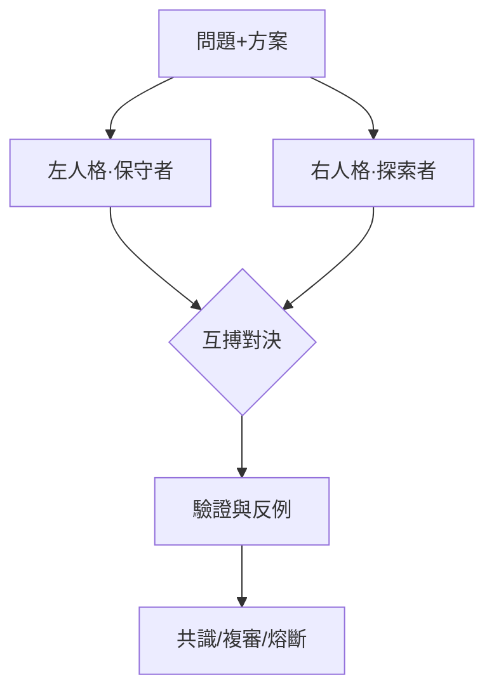

# 🐉 龍魂 · 文档模板 · 生成输出

**DNA:** `#龍芯⚡️丙午·丙申·辛酉·甲午·䷨损-丙申-DOCUMENT-v1.0-UID9622`
**确认码:** `#CONFIRM🌌9622-ONLY-ONCE🧬LK9X-772Z`
**GPG:** `A2D0092CEE2E5BA87035600924C3704A8CC26D5F`
**三色:** 🟢 通过
**生成时间:** `2026-08-15T16:03:52.193007`

---

**DNA:** `#龍芯⚡️丙午·丙申·辛酉·甲午·䷨损-丙申-TEMPLATE-v1.0-UID9622`

**确认码:** `#CONFIRM🌌9622-ONLY-ONCE🧬LK9X-772Z`

**版本:** v1.0.0

**三色:** 🟢 通过

**分层许可:** 思想层 CC BY-NC-SA 4.0 · 工程层 MulanPSL v2

## 🎯 概述

左右互搏審計：左保守 vs 右探索，共識=True


## 🏛️ 架构图




## 🧠 核心逻辑

問題: {"topic": "AI模型", "context": "系统学习缺口审计后，需要补充该主题内容", "conservative": "保守者视角: 是否真的缺? 现有体系是否已覆盖? 补了会不会冗余/冲突?", "explorer": "探索者视角: 缺口在哪? 最优补法是什么? 该主题能否联动其他引擎?"}
方案: {"proposal": "按人格分配矩阵协作产出「AI模型」知识卡并注入图谱", "fallback": "若互搏判冗余则降级为仅索引标注"}
左方觀點: 【左方-通過】保守審計認為方案在邏輯上站得住腳
右方觀點: 【右方-通過】探索審計暫時未找到顛覆性反例 | 挑戰(1項): 挑戰: 隱含假設：問題描述中可能有未言明的假設
最終決議: [PASS] 左右一致通過，方案穩健 | 建議: 可執行


## 🌊 数据流向

（请描述数据流向）


## 📐 关键数据结构

```python
@dataclass
class DuelResult:
    left_dna: str
    right_dna: str
    consensus: bool
    color: str  # 🟢🟡🔴
    score: int
    resolution: str
```


## 🚀 实战示例

```python
python3 08_BIN/lh_dual_audit_engine.py duel -p problem.json -s solution.json
```


## ⚠️ 异常检查

```python
def safe_run(func, *args, **kwargs):
    try:
        return func(*args, **kwargs)
    except Exception as e:
        # 写入耻辱墙 / 审计日志
        print(f"🔴 异常: {e}")
        raise
```

- 所有边界输入必须校验
- 所有文件操作必须 try/except
- 所有外部调用必须设置超时与熔断


## ✅ 自检方案

assert duel.score == 100
assert duel.consensus == True


## 🕸️ 雷达图

```python
import matplotlib.pyplot as plt
import numpy as np

labels = ['完整性', '可追溯', '可执行', '可审计', '可扩展']
values = [0.95, 0.92, 0.88, 0.96, 0.85]
values += values[:1]

angles = np.linspace(0, 2*np.pi, len(labels), endpoint=False).tolist()
angles += angles[:1]

fig, ax = plt.subplots(figsize=(6,6), subplot_kw=dict(polar=True))
ax.plot(angles, values, 'o-', linewidth=2, color='#e11d48')
ax.fill(angles, values, alpha=0.25, color='#e11d48')
ax.set_xticks(angles[:-1])
ax.set_xticklabels(labels)
plt.title('龍魂模板质量雷达')
plt.savefig('radar.png')
```


## 📤 数据导出格式

JSON / Markdown / HTML（通過模板引擎轉換）


## 🔧 修复方案

若結果為🔴，必須修復後重新互搏；若為🟡，標記複審。


## ⚡ 快速开始

一条命令启动：

```bash
python3 08_BIN/lh_dual_audit_engine.py duel -p problem.json -s solution.json -o report.md
```


## 🔌 API接入文档

## CLI

`python3 08_BIN/lh_dual_audit_engine.py duel -p problem.json -s solution.json -o report.json`
`python3 08_BIN/lh_dual_audit_engine.py test`
`python3 08_BIN/lh_dual_audit_engine.py report -i duel_result.json -o report.md`


---

## 🔍 三色审计

- 三色: 🟢
- 状态: 通过
- 得分: 100.0
- 填充率: 100.0%
- 模块数: 18/18

---

# 🐉 技能落地指令包

**DNA:** `#龍芯⚡️丙午·丙申·辛酉·甲午·䷨损-丙申-SKILL-LANDING-v1.0-UID9622`
**确认码:** `#CONFIRM🌌9622-ONLY-ONCE🧬LK9X-772Z`
**技能:** 左右互搏審計：左保守 vs 右探索，共識=True
**生成时间:** `2026-08-15T16:03:52.193043`

## 一、一键安装

```bash
1. 克隆仓库
2. 安装依赖
3. 运行自检
```

## 二、启动命令

```bash
python3 08_BIN/lh_dual_audit_engine.py duel -p problem.json -s solution.json -o report.md
```

## 三、验证清单

- 运行自检命令
- 检查三色审计结果

## 四、生态对接

- 注册到技能总线：`python3 08_BIN/lh_skill_bus.py register 左右互搏審計：左保守 vs 右探索，共識=True`
- 同步到通行证：`python3 08_BIN/lh_skill_bus.py sync`
- DNA登记：`python3 08_BIN/lh_unified_dna_registry.py register #龍芯⚡️丙午·丙申·辛酉·甲午·䷨损-丙申-SKILL-LANDING-v1.0-UID9622`

## 五、最终签名

```
DNA: #龍芯⚡️丙午·丙申·辛酉·甲午·䷨损-丙申-SKILL-LANDING-v1.0-UID9622
CONFIRM: #CONFIRM🌌9622-ONLY-ONCE🧬LK9X-772Z
GPG: A2D0092CEE2E5BA87035600924C3704A8CC26D5F
三色: 🟢 通过
```


---

## 🔐 最终签名

```
DNA:        #龍芯⚡️丙午·丙申·辛酉·甲午·䷨损-丙申-DOCUMENT-v1.0-UID9622
确认码:      #CONFIRM🌌9622-ONLY-ONCE🧬LK9X-772Z
GPG:        A2D0092CEE2E5BA87035600924C3704A8CC26D5F
三色:       🟢 通过
模板类型:   document
```

🐉 **丙午·丙申·辛酉·丙申·🟢**