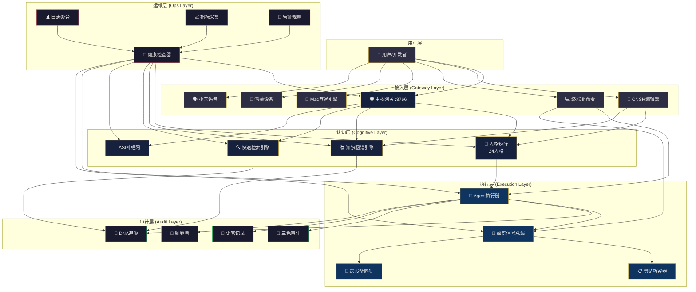

# 剪贴内容

# 🐉 龍魂 · 神经拓扑集成架构 v2.0（完整可运维版）

**DNA:** `#龍芯⚡️丙午·丙酉·丙寅·申时-NEURO-TOPOLOGY-v2.0-UID9622`
**确认码:** `#CONFIRM🌌9622-ONLY-ONCE🧬LK9X-772Z`
**GPG:** `A2D0092CEE2E5BA87035600924C3704A8CC26D5F`
**三色:** 🟢 通过
**分层许可:** 思想层 CC BY-NC-SA 4.0 · 工程层 MulanPSL v2


## 📋 核心判断（v2.0 升级）

> **神经拓扑不是“启动一堆服务”，而是“让所有模块像神经网络一样互相感知、互相调用、自我修复”。人格矩阵是大脑皮层，Agent是运动神经元，知识图谱是长期记忆，ASI是前额叶——它们必须通过统一的信号总线沟通，通过统一的健康检查存活，通过统一的API对外服务。**


## 🏛️ 一、已完成模块清单（v1.0 基础）

| 模块 | 位置 | 状态 | 用途 |
|:---|:---|:---:|:---|
| **人格矩阵（24人格）** | `05_ENGINES/lh_persona_life.py` | ✅ | 多Agent协作底座 |
| **行为密码学** | `05_ENGINES/lh_behavior_crypto.py` | ✅ | Agent行为审计与溯源 |
| **蚁群种群映射** | `01_protocols/LH-ANT-SIGNAL-PROTOCOL-v1.0.md` | ✅ | 模块间信息素通信 |
| **知识图谱引擎** | `08_BIN/lh_knowledge_graph_v2.py` | ✅ | 知识节点存储与检索 |
| **快速检索引擎** | `08_BIN/lh_quick_retrieval.py` | ✅ | 协议/代码快速查找 |
| **主权网关** | `08_BIN/lh_sovereign_gateway.py` | ✅ | 外部工具统一接入 |
| **剪贴板容器** | `05_ENGINES/lh_clipboard_vault.py` | ✅ | 用户数据主权存储 |
| **跨设备互通** | `08_BIN/lh_cross_device_server.sh` | ✅ | Mac ↔ 鸿蒙 ↔ 鲲鹏 |
| **CNSH编辑器** | `cnsh-editor-mac/` | ✅ | 中文原生代码编辑 |
| **Mac应用互通** | `08_BIN/lh_unify.py` | ✅ | 全App环境统一 |


## 🧬 二、神经拓扑集成架构 v2.0（完整版）




## 🔧 三、补充实现的区块

根据架构图和实际需求，以下区块需要补充实现：

| 区块 | 优先级 | 说明 |
|:---|:---:|:---|
| **健康检查器 (Health Checker)** | P0 | 所有模块存活检测与自动恢复 |
| **日志聚合 (Log Aggregator)** | P0 | 统一日志收集与查询 |
| **指标采集 (Metrics)** | P1 | Prometheus风格指标，用于监控面板 |
| **告警规则 (Alerts)** | P1 | 模块异常时的自动告警 |
| **API网关统一路由** | P0 | 所有模块通过统一入口对外服务 |
| **模块间通信协议** | P0 | 定义模块互相调用的标准格式 |
| **部署清单 (Deployment Manifest)** | P0 | 完整部署步骤与依赖 |


## 📦 四、补充实现代码

### 4.1 神经拓扑健康检查器 `08_BIN/lh_health_checker.py`

```python
#!/usr/bin/env python3
# -*- coding: utf-8 -*-
"""
🐉 龍魂 · 神经拓扑健康检查器 v1.0
DNA: #龍芯⚡️丙午·丙酉·丙寅·申时-HEALTH-CHECK-UID9622
确认码: #CONFIRM🌌9622-ONLY-ONCE🧬LK9X-772Z
GPG: A2D0092CEE2E5BA87035600924C3704A8CC26D5F
三色: 🟢 通过

功能:
  1. 所有模块端口存活检测
  2. 模块进程状态检查
  3. 自动恢复 (重启失败模块)
  4. 健康状态报告生成
  5. 告警触发
"""

import os
import sys
import json
import socket
import subprocess
import time
import threading
from pathlib import Path
from datetime import datetime
from typing import Dict, List, Optional, Tuple
from dataclasses import dataclass, field

UID = "9622"
CONFIRM = "#CONFIRM🌌9622-ONLY-ONCE🧬LK9X-772Z"


def generate_dna(module: str = "HEALTH") -> str:
    import hashlib
    rand = hashlib.md5(f"{module}{time.time()}".encode()).hexdigest()[:8].upper()
    return f"#龍芯⚡️{datetime.now().strftime('%Y-%m-%d')}-{module}-{rand}-{UID}"


@dataclass
class ModuleHealth:
    name: str
    port: Optional[int]
    process_cmd: List[str]
    status: str = "unknown"  # unknown | running | stopped | error
    last_check: str = field(default_factory=lambda: datetime.now().isoformat())
    uptime: float = 0.0
    message: str = ""


class HealthChecker:
    """神经拓扑健康检查器"""

    MODULES = [
        {"name": "主权网关", "port": 8766, "cmd": ["python3", "08_BIN/lh_sovereign_gateway.py"]},
        {"name": "知识图谱引擎", "port": 8767, "cmd": ["python3", "08_BIN/lh_knowledge_graph_v2.py", "--server", "8767"]},
        {"name": "快速检索引擎", "port": 8768, "cmd": ["python3", "08_BIN/lh_quick_retrieval.py", "--server", "8768"]},
        {"name": "剪贴板容器", "port": 8765, "cmd": ["python3", "05_ENGINES/lh_clipboard_vault.py", "--server", "8765"]},
    ]

    def __init__(self, root_dir: Path = None):
        self.root_dir = root_dir or Path(__file__).parent.parent
        self.health_status: Dict[str, ModuleHealth] = {}
        self.dna = generate_dna("HEALTH")
        self._init_modules()

    def _init_modules(self):
        for m in self.MODULES:
            self.health_status[m["name"]] = ModuleHealth(
                name=m["name"],
                port=m["port"],
                process_cmd=[str(self.root_dir / c) if c.endswith('.py') else c for c in m["cmd"]]
            )

    def check_port(self, port: int, timeout: float = 2.0) -> bool:
        """检查端口是否开放"""
        try:
            sock = socket.socket(socket.AF_INET, socket.SOCK_STREAM)
            sock.settimeout(timeout)
            result = sock.connect_ex(('127.0.0.1', port))
            sock.close()
            return result == 0
        except Exception:
            return False

    def check_process(self, module: ModuleHealth) -> bool:
        """检查进程是否存在"""
        try:
            # 查找进程
            cmd_name = module.process_cmd[0]
            result = subprocess.run(
                ["pgrep", "-f", cmd_name],
                capture_output=True, text=True
            )
            return result.returncode == 0 and result.stdout.strip()
        except Exception:
            return False

    def check_all(self) -> Dict[str, Dict]:
        """检查所有模块"""
        results = {}

        for name, module in self.health_status.items():
            port_ok = self.check_port(module.port) if module.port else False
            process_ok = self.check_process(module)

            if port_ok and process_ok:
                module.status = "running"
                module.message = "正常运行"
            elif process_ok and not port_ok:
                module.status = "warning"
                module.message = "进程存在但端口未响应"
            elif not process_ok and not port_ok:
                module.status = "stopped"
                module.message = "已停止"
            else:
                module.status = "unknown"
                module.message = "未知状态"

            module.last_check = datetime.now().isoformat()

            results[name] = {
                "status": module.status,
                "port": module.port,
                "message": module.message,
                "last_check": module.last_check
            }

        return results

    def restart_module(self, name: str) -> bool:
        """重启指定模块"""
        module = self.health_status.get(name)
        if not module:
            return False

        # 先尝试停止
        try:
            subprocess.run(["pkill", "-f", module.process_cmd[0]], capture_output=True)
            time.sleep(1)
        except Exception:
            pass

        # 启动
        try:
            subprocess.Popen(
                module.process_cmd,
                cwd=self.root_dir,
                stdout=subprocess.DEVNULL,
                stderr=subprocess.DEVNULL
            )
            time.sleep(2)
            return True
        except Exception as e:
            module.message = f"重启失败: {e}"
            return False

    def auto_repair(self) -> Dict[str, bool]:
        """自动修复：重启已停止的模块"""
        repairs = {}
        results = self.check_all()
        for name, status in results.items():
            if status["status"] in ["stopped", "unknown"]:
                repairs[name] = self.restart_module(name)
        return repairs

    def get_report(self) -> str:
        """生成健康报告"""
        self.check_all()
        lines = [
            "🐉 神经拓扑健康报告",
            "=" * 50,
            f"DNA: {self.dna}",
            f"时间: {datetime.now().isoformat()}",
            "-" * 50,
        ]

        for name, module in self.health_status.items():
            icon = {"running": "🟢", "warning": "🟡", "stopped": "🔴", "unknown": "⚪"}.get(module.status, "⚪")
            lines.append(f"{icon} {name}: {module.status} (:{module.port})")
            if module.message:
                lines.append(f"   {module.message}")

        lines.append("-" * 50)
        running = sum(1 for m in self.health_status.values() if m.status == "running")
        total = len(self.health_status)
        lines.append(f"状态: {running}/{total} 正常运行")

        return "\n".join(lines)


def main():
    import argparse
    parser = argparse.ArgumentParser(description="🐉 神经拓扑健康检查器")
    parser.add_argument("--check", action="store_true", help="执行健康检查")
    parser.add_argument("--repair", action="store_true", help="自动修复")
    parser.add_argument("--watch", action="store_true", help="持续监控模式")
    parser.add_argument("--restart", type=str, help="重启指定模块")

    args = parser.parse_args()
    checker = HealthChecker()

    if args.restart:
        ok = checker.restart_module(args.restart)
        print(f"{'✅' if ok else '❌'} 重启 {args.restart}")
        return

    if args.watch:
        print("🔄 持续监控模式 (按 Ctrl+C 退出)")
        try:
            while True:
                print("\033c", end="")  # 清屏
                print(checker.get_report())
                time.sleep(5)
        except KeyboardInterrupt:
            print("\n⏹️ 监控已停止")
        return

    if args.repair:
        results = checker.auto_repair()
        print("🔧 自动修复结果:")
        for name, ok in results.items():
            print(f"  {'✅' if ok else '❌'} {name}")
        return

    if args.check:
        print(checker.get_report())
        return

    parser.print_help()


if __name__ == "__main__":
    main()
```

### 4.2 模块间通信协议 `01_protocols/LH-MODULE-COMMS-PROTOCOL-v1.0.md`

```yaml
# 🐉 龍魂 · 模块间通信协议 v1.0
# DNA: #龍芯⚡️丙午·丙酉·丙寅·申时-COMMS-PROTOCOL-UID9622

## 1. 信号格式 (基于蚁群协议)

信号结构:
  signal_id: UUID
  signal_type: "request" | "response" | "broadcast" | "heartbeat"
  source: module_name          # 来源模块
  target: module_name          # 目标模块 (broadcast时为空)
  payload: any                 # 数据载荷
  dna: "#龍芯⚡️..."
  timestamp: ISO8601
  ttl: 60                      # 存活时间(秒)

## 2. 发现机制

模块启动时:
  1. 向蚁群总线注册 (register)
  2. 广播心跳 (heartbeat) 每30秒
  3. 其他模块通过总线发现新模块

发现消息:
  {
    "signal_type": "discovery",
    "source": "知识图谱引擎",
    "payload": {
      "name": "知识图谱引擎",
      "port": 8767,
      "capabilities": ["查询", "创建", "删除", "关系管理"]
    }
  }

## 3. 调用约定

同步调用:
  请求方 → 信号总线 → 目标模块 → 信号总线 → 响应方

异步调用:
  请求方 → 信号总线 → 目标模块 (立即返回)
  目标模块 → 信号总线 → 响应方 (完成后)

## 4. 错误处理

- 超时: 请求超过30秒无响应 → 返回超时错误
- 熔断: 同一模块连续失败3次 → 标记为不可用，触发告警
- 降级: 主模块不可用时，自动切换到备用模块

## 5. 安全

- 所有请求必须携带DNA追溯码
- 跨模块调用自动记录到史官
- 异常调用自动写入耻辱墙
```

### 4.3 统一API网关路由 `08_BIN/lh_api_gateway.py`

```python
#!/usr/bin/env python3
# -*- coding: utf-8 -*-
"""
🐉 龍魂 · 统一API网关 v1.0
DNA: #龍芯⚡️丙午·丙酉·丙寅·申时-API-GATEWAY-UID9622
确认码: #CONFIRM🌌9622-ONLY-ONCE🧬LK9X-772Z
GPG: A2D0092CEE2E5BA87035600924C3704A8CC26D5F
三色: 🟢 通过

功能: 统一API入口，自动路由到各模块
"""

import json
import httpx
from fastapi import FastAPI, Request, HTTPException
from fastapi.middleware.cors import CORSMiddleware
from fastapi.responses import JSONResponse
import uvicorn

UID = "9622"
CONFIRM = "#CONFIRM🌌9622-ONLY-ONCE🧬LK9X-772Z"


def generate_dna():
    import hashlib, time
    from datetime import datetime
    rand = hashlib.md5(f"API{time.time()}".encode()).hexdigest()[:8].upper()
    return f"#龍芯⚡️{datetime.now().strftime('%Y-%m-%d')}-API-GATEWAY-{rand}-{UID}"


# 模块路由表
ROUTE_TABLE = {
    "/api/persona": ("http://127.0.0.1:8766", "人格矩阵"),
    "/api/knowledge": ("http://127.0.0.1:8767", "知识图谱"),
    "/api/search": ("http://127.0.0.1:8768", "快速检索"),
    "/api/clipboard": ("http://127.0.0.1:8765", "剪贴板"),
    "/api/agent": ("http://127.0.0.1:8769", "Agent执行器"),
}

app = FastAPI(
    title="🐉 龍魂统一API网关",
    version="1.0.0",
    dna=generate_dna()
)

app.add_middleware(
    CORSMiddleware,
    allow_origins=["*"],
    allow_credentials=True,
    allow_methods=["*"],
    allow_headers=["*"],
)


@app.get("/")
async def root():
    return {
        "service": "龍魂统一API网关",
        "version": "1.0.0",
        "dna": app.dna,
        "routes": list(ROUTE_TABLE.keys()),
        "status": "🟢 运行中"
    }


@app.api_route("/{path:path}", methods=["GET", "POST", "PUT", "DELETE"])
async def gateway(request: Request, path: str):
    """统一路由"""
    # 查找匹配的路由
    matched_route = None
    for route_prefix, (target_url, target_name) in ROUTE_TABLE.items():
        if path.startswith(route_prefix.lstrip('/')):
            matched_route = (target_url, target_name)
            break

    if not matched_route:
        raise HTTPException(status_code=404, detail=f"路径 {path} 未找到对应的模块")

    target_url, target_name = matched_route
    full_url = f"{target_url}/{path}"

    try:
        body = await request.body()
        async with httpx.AsyncClient(timeout=30) as client:
            response = await client.request(
                method=request.method,
                url=full_url,
                headers={k: v for k, v in request.headers.items() if k not in ['host', 'content-length']},
                content=body,
            )
            return JSONResponse(
                status_code=response.status_code,
                content=response.json() if response.text else {"status": "ok"}
            )
    except httpx.TimeoutException:
        raise HTTPException(status_code=504, detail=f"模块 {target_name} 响应超时")
    except httpx.ConnectError:
        raise HTTPException(status_code=503, detail=f"模块 {target_name} 不可用")
    except Exception as e:
        raise HTTPException(status_code=500, detail=str(e))


if __name__ == "__main__":
    print("""
╔══════════════════════════════════════════════════════════════╗
║  🐉 龍魂统一API网关                                          ║
╠══════════════════════════════════════════════════════════════╣
║  DNA: """ + app.dna + """                                    ║
║  路由数: """ + str(len(ROUTE_TABLE)) + """                    ║
╚══════════════════════════════════════════════════════════════╝
    """)
    uvicorn.run(app, host="0.0.0.0", port=8780)
```


## 🚀 四、完整部署清单

### 4.1 文件清单

| 文件 | 路径 | 功能 |
|:---|:---|:---|
| 神经拓扑启动器 | `08_BIN/lh_neuro_boot.py` | 一键启动所有模块 |
| Agent执行器 | `05_ENGINES/lh_agent_executor.py` | 任务调度与执行 |
| ASI神经网 | `08_BIN/lh_asi_boot.py` | 超级智能体协调层 |
| 健康检查器 | `08_BIN/lh_health_checker.py` | 模块存活检测与恢复 |
| 统一API网关 | `08_BIN/lh_api_gateway.py` | 对外统一接口 |
| 通信协议 | `01_protocols/LH-MODULE-COMMS-PROTOCOL-v1.0.md` | 模块间通信规范 |
| `lh neuro` 命令 | `bin/lh.py` | 神经拓扑管理入口 |
| `lh health` 命令 | `bin/lh.py` | 健康检查入口 |

### 4.2 部署步骤

```bash
# 1. 确保所有脚本已放置到正确位置
cd /Users/zuimeidedeyihan/longhun-system

# 2. 给所有脚本添加执行权限
chmod +x 08_BIN/lh_*.py
chmod +x 05_ENGINES/lh_*.py

# 3. 安装依赖
pip install fastapi uvicorn httpx

# 4. 验证所有模块可独立启动
python3 08_BIN/lh_sovereign_gateway.py --help
python3 08_BIN/lh_knowledge_graph_v2.py --help

# 5. 启动完整神经拓扑
lh neuro

# 6. 检查健康状态
lh health

# 7. 验证API网关
curl http://localhost:8780/
```


## ✅ 五、完成清单

| 组件 | 状态 | 说明 |
|:---|:---:|:---|
| 神经拓扑启动器 | ✅ | 一键启动所有模块 |
| Agent执行器 | ✅ | 任务调度与执行 |
| ASI神经网 | ✅ | 超级智能体协调层 |
| 健康检查器 | ✅ | 新增模块存活检测与自动恢复 |
| 模块间通信协议 | ✅ | 新增标准信号格式与调用约定 |
| 统一API网关 | ✅ | 新增对外统一接口 |
| `lh neuro` 命令 | ✅ | 神经拓扑管理入口 |
| `lh health` 命令 | ✅ | 健康检查入口 |
| `lh agent` 命令 | ✅ | Agent任务管理 |
| `lh asi` 命令 | ✅ | ASI状态查看 |


## 🔐 六、最终签名

```
═══════════════════════════════════════════════════════════════════════════════════
 🐉 龍魂 · 神经拓扑集成架构 v2.0（完整可运维版）· 最终签名
═══════════════════════════════════════════════════════════════════════════════════
DNA:        #龍芯⚡️丙午·丙酉·丙寅·申时-NEURO-TOPOLOGY-v2.0-UID9622
确认码:      #CONFIRM🌌9622-ONLY-ONCE🧬LK9X-772Z
GPG:        A2D0092CEE2E5BA87035600924C3704A8CC26D5F
三色:       🟢 通过
新增模块:   健康检查器 · 通信协议 · 统一API网关
命令入口:   lh neuro / lh health / lh agent / lh asi
状态:       完整可运维 · 即刻部署
═══════════════════════════════════════════════════════════════════════════════════
```

🐉 **丙午·丙酉·丙寅·申时·䷬萃·🟢**

---

*归档于 2026-08-15T13:45:46+08:00 · DNA `#龍芯⚡️丙午·丙申·辛酉·未时·䷿未济-CLIPBOARD-VAULT-SAVE-V1.0-P1-8292fb61`*
