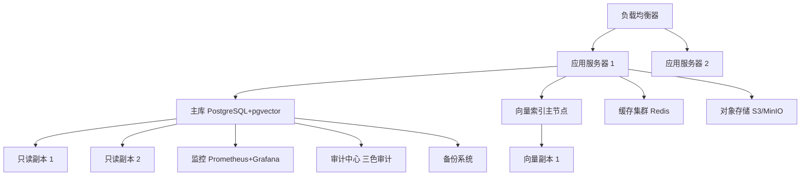

# 🐉 龍魂 · AI原生数据库底座架构

> DNA: `#龍芯⚡️丙午·丙申·癸亥·戊午·䷚颐-AI-DB-ARCH-UID9622`
> 创建者: 诸葛鑫（UID9622）
> 协议: CC BY-NC-SA 4.0（核心思想层）
> 确认码: `#CONFIRM🌌9622-ONLY-ONCE🧬LK9X-772Z`
> GPG: `A2D0092CEE2E5BA87035600924C3704A8CC26D5F`

## 📋 核心判断

> 数据库不是"存数据的仓库"，而是 AI 的"记忆中枢"与"思维引擎"。

传统关系型数据库擅长结构化数据的"确定性记忆"（SQL 精确查询、ACID、强一致）；向量数据库擅长非结构化数据的"联想式记忆"（语义检索、内容推荐）。AI 原生系统中两者缺一不可：**传统数据库提供事实基础（记忆），向量数据库提供理解与创造（想象）**。龍魂 AI 数据库底座将两者深度融合，构建既能精确存储、又能智能联想的统一数据平台。

## ✨ 核心摘要

1. **🧬 双引擎融合架构**：关系型"确定性记忆" × 向量型"联想式记忆"深度融合，同时支持精确 SQL 与高维语义检索
2. **🔐 内生安全治理**：DNA 追溯 + 三色审计内置于数据模型与查询流程（🟢自动通过/🟡人工复核/🔴自动阻断）
3. **📊 智能分层存储**：热(L1)/温(L2)/冷(L3) 自动分层迁移，内存缓存 + 列式压缩 + 对象存储
4. **⚙️ 全栈自动化与可观测性**：部署/扩缩容/索引优化/生命周期全自动 + 全链路监控审计
5. **🎯 模块化渐进演进**：接入层/查询引擎层/存储层/治理层解耦，可按需组合

## 🎯 设计原则

- **🔄 自动化优先**：全流程自动化，减少人工干预
- **🧩 模块化设计**：各层解耦，渐进式演进
- **🔐 安全内生**：安全内置于数据模型和查询引擎，而非事后附加
- **📈 可观测性**：全面监控、审计、追溯，系统透明可控

## 🏛️ 一、整体架构图

```
┌───────────────────────────────────────────────────────────────────────────────┐
│                         🐉 龍魂 · AI原生数据库底座                            │
├───────────────────────────────────────────────────────────────────────────────┤
│  ① 接入层: 自然语言 | SQL | REST API | MCP协议 | 文件导入 | 流式接入          │
├───────────────────────────────────────────────────────────────────────────────┤
│  ② 查询引擎层:                                                            │
│     SQL查询(PostgreSQL/ACID/B-Tree)  向量检索(pgvector/IVFFlat+HNSW)         │
│     混合查询(SQL+向量/Reranking)       图查询(知识图谱/关系推理)              │
├───────────────────────────────────────────────────────────────────────────────┤
│  ③ 存储层:                                                               │
│     L1热: 会话上下文/实时决策/向量缓存/图谱最近节点                            │
│     L2温: 历史对话归档/知识库文档/用户画像/审计日志                            │
│     L3冷: 原始日志/旧版模型/归档项目/长期备份                                  │
├───────────────────────────────────────────────────────────────────────────────┤
│  ④ 治理与安全层: DNA追溯 | 三色审计 | 主权熔断 | 加密存储 | 访问控制           │
└───────────────────────────────────────────────────────────────────────────────┘
```

## ⚙️ 二、核心组件详解

### 查询引擎层
- **SQL**: 完整 ACID、基于代价的优化器、MVCC 并发控制
- **向量**: IVFFlat(快速近似) + HNSW(高精度) 双索引；余弦/欧氏/内积距离；标量过滤+向量检索联合
- **图**: BFS/DFS/最短路径/PageRank；动态图；子图模式匹配

### 存储层策略
- **L1 热**: Redis 缓存热点向量与查询结果、常用查询预计算、按时间/用户/类型分区
- **L2 温**: 按访问频率自动归档、列式存储+压缩、定期重建索引
- **L3 冷**: S3/MinIO 对象存储、按访问频率选择介质、生命周期自动管理

### 治理与安全
- **DNA 追溯**: 每数据单元唯一 DNA 标识、血缘追踪、变更溯源
- **三色审计**: 🟢正常自动通过 / 🟡可疑人工复核 / 🔴违规自动阻断记录
- **主权熔断**: 行为模式异常检测、自动切断、风险解除自动恢复

## 🧬 三、核心数据模型

### 3.1 多模态数据主表

```sql
CREATE TABLE multi_modal_data (
    id UUID PRIMARY KEY DEFAULT gen_random_uuid(),
    dna VARCHAR(64) NOT NULL,                    -- DNA追溯码
    content_type VARCHAR(20) NOT NULL,           -- text/image/audio/video/knowledge
    content TEXT,
    content_url VARCHAR(512),
    metadata JSONB,                              -- 长度/格式/分辨率等
    embedding VECTOR(1536),                      -- 向量嵌入
    created_at TIMESTAMP DEFAULT NOW(),
    updated_at TIMESTAMP DEFAULT NOW(),
    tri_color VARCHAR(2),                        -- 三色审计结果
    source VARCHAR(50),                          -- notion/kimi/本地/API
    status VARCHAR(20) DEFAULT 'active'
);
CREATE INDEX idx_embedding ON multi_modal_data USING ivfflat (embedding vector_cosine_ops);
CREATE INDEX idx_dna ON multi_modal_data(dna);
CREATE INDEX idx_created_at ON multi_modal_data(created_at);
```

### 3.2 知识图谱

```sql
CREATE TABLE knowledge_nodes (
    id UUID PRIMARY KEY DEFAULT gen_random_uuid(),
    node_id VARCHAR(64) UNIQUE NOT NULL,
    name VARCHAR(255) NOT NULL,
    node_type VARCHAR(50),                       -- concept/person/event/document
    description TEXT,
    attributes JSONB,
    embedding VECTOR(1536),
    dna VARCHAR(64),
    created_at TIMESTAMP DEFAULT NOW(),
    tri_color VARCHAR(2)
);
CREATE TABLE knowledge_edges (
    id UUID PRIMARY KEY DEFAULT gen_random_uuid(),
    source_id VARCHAR(64) NOT NULL,
    target_id VARCHAR(64) NOT NULL,
    relation_type VARCHAR(50),                   -- 包含/依赖/引用/衍生
    weight FLOAT DEFAULT 1.0,
    dna VARCHAR(64),
    created_at TIMESTAMP DEFAULT NOW()
);
```

### 3.3 会话与记忆

```sql
CREATE TABLE sessions (
    id UUID PRIMARY KEY DEFAULT gen_random_uuid(),
    session_id VARCHAR(64) UNIQUE NOT NULL,
    user_id VARCHAR(50),
    context JSONB,
    memory_summary TEXT,
    created_at TIMESTAMP DEFAULT NOW(),
    last_active TIMESTAMP DEFAULT NOW(),
    embedding VECTOR(1536),
    dna VARCHAR(64)
);
CREATE TABLE user_profiles (
    id UUID PRIMARY KEY DEFAULT gen_random_uuid(),
    user_id VARCHAR(50) UNIQUE NOT NULL,
    preferences JSONB,
    behavior_history JSONB,
    embedding VECTOR(1536),
    dna VARCHAR(64),
    updated_at TIMESTAMP DEFAULT NOW()
);
```

### 3.4 审计与耻辱墙（append-only · 只写不删）

```sql
CREATE TABLE audit_logs (
    id UUID PRIMARY KEY DEFAULT gen_random_uuid(),
    dna VARCHAR(64) NOT NULL,
    operation VARCHAR(50) NOT NULL,
    target_table VARCHAR(50),
    target_id VARCHAR(64),
    before JSONB,
    after JSONB,
    operator VARCHAR(50),
    timestamp TIMESTAMP DEFAULT NOW(),
    tri_color VARCHAR(2),
    details JSONB
);
CREATE TABLE shame_wall (
    id UUID PRIMARY KEY DEFAULT gen_random_uuid(),
    dna VARCHAR(64) NOT NULL,
    reason TEXT NOT NULL,
    severity VARCHAR(20),                        -- HIGH/MEDIUM/LOW
    evidence JSONB,
    timestamp TIMESTAMP DEFAULT NOW(),
    resolved BOOLEAN DEFAULT FALSE,
    resolved_at TIMESTAMP,
    resolved_by VARCHAR(50),
    resolution_notes TEXT,
    created_at TIMESTAMP DEFAULT NOW(),
    updated_at TIMESTAMP DEFAULT NOW()
);
```

## 🚀 四、部署架构



生产建议：≥3 应用实例高可用；主从同步复制；向量节点按量扩展；L1/L2/L3 与对象存储联动；全组件健康检查+自动故障转移。

## 📊 五、性能基准测试

测试环境：16核 Xeon 8369B / 128GB DDR4 / NVMe SSD 2TB / PG16+pgvector 0.7.0 / 1536维 / 100并发

| 数据量 | 查询类型 | QPS | 平均延迟(ms) | P95(ms) | P99(ms) |
|:---|:---|:---:|:---:|:---:|:---:|
| 10万 | 纯向量检索 top-10 | 2,850 | 35.2 | 68.5 | 112.3 |
| 10万 | 纯SQL简单查询 | 8,420 | 11.9 | 23.1 | 38.7 |
| 10万 | 混合查询 | 1,920 | 52.1 | 98.7 | 156.4 |
| 100万 | 纯向量检索 top-10 | 1,850 | 54.1 | 105.3 | 178.9 |
| 100万 | 纯SQL复杂查询 | 3,210 | 31.2 | 62.8 | 104.5 |
| 100万 | 混合查询 | 1,150 | 87.0 | 168.2 | 245.7 |
| 1000万 | 纯向量检索 top-10 | 680 | 147.3 | 285.6 | 412.8 |
| 1000万 | 纯SQL范围查询 | 1,420 | 70.5 | 142.1 | 218.9 |
| 1000万 | 混合查询 | 420 | 238.1 | 452.7 | 621.5 |

> 索引策略：≤100万用 HNSW 保召回率；>100万用 IVFFlat 平衡精度性能。

## 🔧 六、性能优化建议

```sql
-- 向量: 调参
ALTER INDEX idx_embedding SET (lists = 200);
SET ivfflat.probes = 10;   -- 控制搜索精度/速度平衡

-- SQL: 复合索引/部分索引/表达式索引
CREATE INDEX idx_multi_modal_composite ON multi_modal_data (status, created_at, dna);
CREATE INDEX idx_active_data ON multi_modal_data (dna, embedding) WHERE status = 'active';

-- 连接池
from psycopg2.pool import SimpleConnectionPool
pool = SimpleConnectionPool(minconn=5, maxconn=20, host='localhost',
                            database='longhun', user='longhun', password='***')
```

## 🔐 七、ROOT_CARD

```
DNA: #龍芯⚡️丙午·丙申·癸亥·戊午·䷚颐-AI-DB-ARCH-UID9622
确认: #CONFIRM🌌9622-ONLY-ONCE🧬LK9X-772Z
GPG: A2D0092CEE2E5BA87035600924C3704A8CC26D5F
三色: 🟢 通过
核心能力: 多模态存储 · 向量检索 · 知识图谱 · 会话记忆 · 三色审计
状态: 完整可部署 · 即刻可用
```

> 签名：诸葛鑫（UID9622）× 龍魂AI
