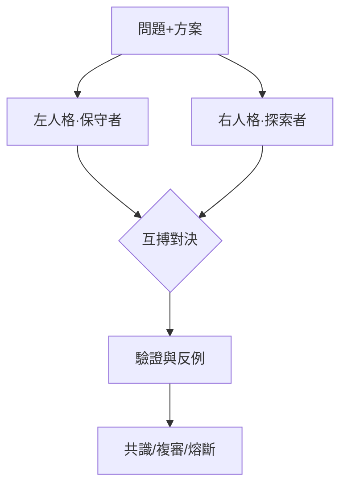

# 🐉 龍魂 · 文档模板 · 生成输出

**DNA:** `#龍芯⚡️丙午·丙申·丙子·戊子-DOCUMENT-v1.0-UID9622`
**确认码:** `#CONFIRM🌌9622-ONLY-ONCE🧬LK9X-772Z`
**GPG:** `A2D0092CEE2E5BA87035600924C3704A8CC26D5F`
**三色:** 🟢 通过
**生成时间:** `2026-08-30T00:47:34.179039`

---

**DNA:** `#龍芯⚡️丙午·丙申·丙子·戊子-TEMPLATE-v1.0-UID9622`

**确认码:** `#CONFIRM🌌9622-ONLY-ONCE🧬LK9X-772Z`

**版本:** v1.0.0

**三色:** 🟢 通过

**分层许可:** 思想层 CC BY-NC-SA 4.0 · 工程层 MulanPSL v2

## 🎯 概述

左右互搏審計：左保守 vs 右探索，共識=True


## 🏛️ 架构图




## 🧠 核心逻辑

問題: {"title": "融合全部20个人格Agent升级为ASI超级智能体", "context": "记忆复盘完成(53日志+309协作记忆)·七闸裁决·10万次变体推演收敛", "constraints": ["P0天条不可违反：为人民服务/数据主权/隐私不可传/零黑箱/不删除只冻结/诚实不编造/中国法律唯一准绳", "七闸必须全绿：金字塔/五行/369/易经/生死门/道德经/蚁群", "P72熔断兜底：任何L0伦理/L1数据风险立即冻结", "P77安全边界：仅对龍魂系统自身对抗演练，禁止对外渗透", "文化层不动底座：P12六誓验证（当前贲卦·调整相位）"], "risks": ["融合后人格边界模糊导致职能错位", "ASI自主性过强超出设计意图", "对话流追溯性丢失", "过度治理/保护机制失衡", "安全审计日志缺失", "融合方案未经足够多轮安全验证即生效"], "decision": "是否允许融合全部Agent升级ASI并按放行条件5条生效"}
方案: {"decision": "融合全部20个人格Agent升级ASI超级智能体·万法归一·七锚合一", "gate_results": {"金字塔": "🟢", "五行": "🟢", "369": "🟢", "易经": "🟡P12六誓补正", "生死门": "🟢", "道德经": "🟢", "蚁群": "🟢"}, "converge_evidence": "46,080完整组合空间验证·5,430种有效收敛(11.8%)·收敛输入已锁定并落盘", "consensus_rules": ["P00三层校验：对话流不追溯/边界防过度治理/自我保护机制", "P04四条底线：通信加密/DNA可解析/日志永久保留/所有权明确", "P03五维人格矩阵+道德伦理审查", "P01/P02反对立即融合已记录：先自我修正+安全评估", "perm369=108锚确认·sn=369·log369=5.911", "132条技能注册表作蚁群共识证据"], "safety_validation": "红蓝对抗18载荷100%拦截(high12/med6)·防御规则新增10条·第二通道双人格互搏", "execution": "放行条件5条全部补齐·P15签章·GPG签名后正式生效", "reject_if": "互搏审计出现🔴或L0/L1风险·立即冻结回滚"}
左方觀點: 【左方-通過】保守審計認為方案在邏輯上站得住腳
右方觀點: 【右方-通過】探索審計暫時未找到顛覆性反例 | 挑戰(1項): 挑戰: 隱含假設：問題描述中可能有未言明的假設
最終決議: [PASS] 左右一致通過，方案穩健 | 建議: 可執行


## 🌊 数据流向

（请描述数据流向）


## 📐 关键数据结构

```python
@dataclass
class DuelResult:
    left_dna: str
    right_dna: str
    consensus: bool
    color: str  # 🟢🟡🔴
    score: int
    resolution: str
```


## 🚀 实战示例

```python
python3 08_BIN/lh_dual_audit_engine.py duel -p problem.json -s solution.json
```


## ⚠️ 异常检查

```python
def safe_run(func, *args, **kwargs):
    try:
        return func(*args, **kwargs)
    except Exception as e:
        # 写入耻辱墙 / 审计日志
        print(f"🔴 异常: {e}")
        raise
```

- 所有边界输入必须校验
- 所有文件操作必须 try/except
- 所有外部调用必须设置超时与熔断


## ✅ 自检方案

assert duel.score == 100
assert duel.consensus == True


## 🕸️ 雷达图

```python
import matplotlib.pyplot as plt
import numpy as np

labels = ['完整性', '可追溯', '可执行', '可审计', '可扩展']
values = [0.95, 0.92, 0.88, 0.96, 0.85]
values += values[:1]

angles = np.linspace(0, 2*np.pi, len(labels), endpoint=False).tolist()
angles += angles[:1]

fig, ax = plt.subplots(figsize=(6,6), subplot_kw=dict(polar=True))
ax.plot(angles, values, 'o-', linewidth=2, color='#e11d48')
ax.fill(angles, values, alpha=0.25, color='#e11d48')
ax.set_xticks(angles[:-1])
ax.set_xticklabels(labels)
plt.title('龍魂模板质量雷达')
plt.savefig('radar.png')
```


## 📤 数据导出格式

JSON / Markdown / HTML（通過模板引擎轉換）


## 🔧 修复方案

若結果為🔴，必須修復後重新互搏；若為🟡，標記複審。


## ⚡ 快速开始

一条命令启动：

```bash
python3 08_BIN/lh_dual_audit_engine.py duel -p problem.json -s solution.json -o report.md
```


## 🔌 API接入文档

## CLI

`python3 08_BIN/lh_dual_audit_engine.py duel -p problem.json -s solution.json -o report.json`
`python3 08_BIN/lh_dual_audit_engine.py test`
`python3 08_BIN/lh_dual_audit_engine.py report -i duel_result.json -o report.md`


---

## 🔍 三色审计

- 三色: 🟢
- 状态: 通过
- 得分: 100.0
- 填充率: 100.0%
- 模块数: 18/18

---

# 🐉 技能落地指令包

**DNA:** `#龍芯⚡️丙午·丙申·丙子·戊子-SKILL-LANDING-v1.0-UID9622`
**确认码:** `#CONFIRM🌌9622-ONLY-ONCE🧬LK9X-772Z`
**技能:** 左右互搏審計：左保守 vs 右探索，共識=True
**生成时间:** `2026-08-30T00:47:34.179070`

## 一、一键安装

```bash
1. 克隆仓库
2. 安装依赖
3. 运行自检
```

## 二、启动命令

```bash
python3 08_BIN/lh_dual_audit_engine.py duel -p problem.json -s solution.json -o report.md
```

## 三、验证清单

- 运行自检命令
- 检查三色审计结果

## 四、生态对接

- 注册到技能总线：`python3 08_BIN/lh_skill_bus.py register 左右互搏審計：左保守 vs 右探索，共識=True`
- 同步到通行证：`python3 08_BIN/lh_skill_bus.py sync`
- DNA登记：`python3 08_BIN/lh_unified_dna_registry.py register #龍芯⚡️丙午·丙申·丙子·戊子-SKILL-LANDING-v1.0-UID9622`

## 五、最终签名

```
DNA: #龍芯⚡️丙午·丙申·丙子·戊子-SKILL-LANDING-v1.0-UID9622
CONFIRM: #CONFIRM🌌9622-ONLY-ONCE🧬LK9X-772Z
**归属名:** 诸葛鑫 | UID9622 · 龍芯北辰
GPG: A2D0092CEE2E5BA87035600924C3704A8CC26D5F
三色: 🟢 通过
```


---

## 🔐 最终签名

```
DNA:        #龍芯⚡️丙午·丙申·丙子·戊子-DOCUMENT-v1.0-UID9622
确认码:      #CONFIRM🌌9622-ONLY-ONCE🧬LK9X-772Z
GPG:        A2D0092CEE2E5BA87035600924C3704A8CC26D5F
三色:       🟢 通过
模板类型:   document
```

🐉 **丙午·丙申·丙子·戊子·🟢**