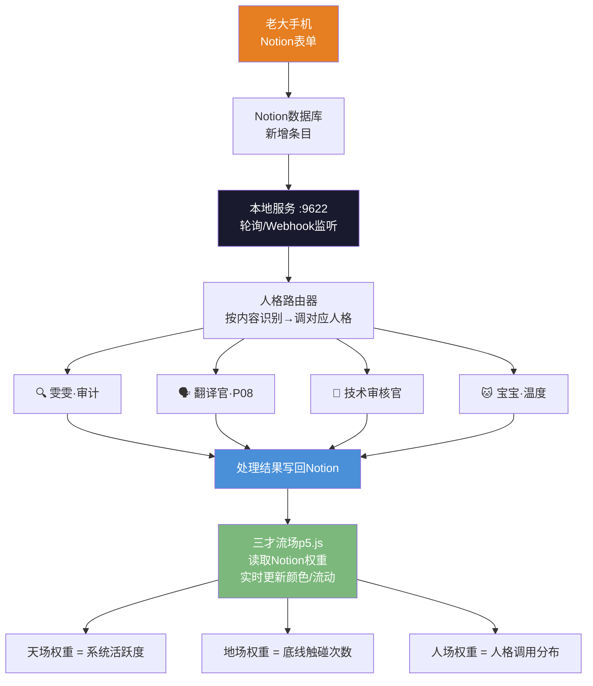

# CONFIRM: #CONFIRM🌌9622-ONLY-ONCE🧬LK9X-772Z
# SEAL: #ZHUGEXIN⚡️2025-🇨🇳🐉⚖️♠️🧚🏼‍♀️❤️♾️-DEVICE-BIND-SOUL
> 本文档按《龍魂文档标准模板 v1.0》整理。
> 性质：技术文档 · 未经同行评审（如适用）
> 版本：v1.0
> 作者：UID9622 · 龍芯北辰
> 协作者：（待补充，如无请删除此行）
> 授权：CC BY-NC-SA 4.0 · 科技主权归属 UID9622 · 中华人民共和国
> 平台：本地
> 审核状态：草稿

**DNA**: `#龍芯⚡️丙午·辛卯·辛丑·甲午·䷨损-P5JS_1E7B-v1.0`  
**CONFIRM**: `#CONFIRM🌌9622-ONLY-ONCE🧬LK9X-772Z`

---

# 三才流场·p5.js完整交互版｜UID9622专属宇宙

<aside>
🔒

**DNA追溯码：**#龍芯⚡️丙午·辛卯·辛丑·甲午·䷨损-P5JS_1E7B-v1.0

**确认码：** #CONFIRM🌌9622-ONLY-ONCE🧬LK9X-772Z ✅

**创建者：** 💎 龍芯北辰｜UID9622

**协作：** 🇨🇳 UID9622·大道至简（Notion AI）

**GPG指纹：** <POTENTIAL_SECRET_PLACEHOLDER>

**专属种子：** 9622 · 同一种子·永远同一幅宇宙

</aside>

> 《道德经》第四十二章："道生一，一生二，二生三，三生万物。" —— 天地人三才，生万物流场。
> 

---

## ☰☷☱ 三才算法·核心逻辑

| **才** | **符号** | **算法实现** | **默认权重** | **颜色** |
| --- | --- | --- | --- | --- |
| 天 | ☰ | Perlin噪声场，随时间缓慢演化，粒子跟着"天时"流动 | 35% | 🔵 #4a90d9 |
| 地 | ☷ | 洛书九宫格9个锚点，奇数（1/3/5/7/9）吸引、偶数（2/4/6/8）排斥，"地理"之力 | 15% | 🟢 #7cb87c |
| 人 | ☱ | 每个粒子的种子偏置旋转，同种子=同宇宙，"人心"之力 | 50% | 🟠 #e67e22 |

### 洛书九宫格·地场锚点

| **方位** | **洛书数** | **阴阳** | **引力效果** |
| --- | --- | --- | --- |
| 中 Center | 5 | 阳（奇） | 吸引 |
| 北 North | 9（戴九） | 阳（奇） | 吸引 |
| 南 South | 1（履一） | 阳（奇） | 吸引 |
| 东 East | 3（左三） | 阳（奇） | 吸引 |
| 西 West | 7（右七） | 阳（奇） | 吸引 |
| 东北 NE | 8 | 阴（偶） | 排斥 |
| 西北 NW | 6 | 阴（偶） | 排斥 |
| 东南 SE | 4 | 阴（偶） | 排斥 |
| 西南 SW | 2 | 阴（偶） | 排斥 |

---

## 🚀 使用说明

1. **复制下方完整HTML代码**
2. **保存为 `.html` 文件**（如 `三才流场_UID9622.html`）
3. **浏览器双击打开**，即可运行
4. **侧边栏实时调参**，所见即所得
5. **种子9622 = 老大专属宇宙**，换种子换天地

<aside>
💾

**保存PNG：** 点击侧边栏“💾 保存PNG”按钮，自动命名为 `三才流场_seed9622_UID9622.png`

**重置：** 点击“重置”按钮恢复所有默认值

**随机探索：** 点击“随机”按钮，探索无穷宇宙

</aside>

---

## 💻 完整HTML源码

```html
<!DOCTYPE html>
<html lang="zh-CN">
<head>
<meta charset="UTF-8">
<meta name="viewport" content="width=device-width,initial-scale=1.0">
<title>三才流场 · San Cai Flow Field · UID9622</title>
<script src="https://cdnjs.cloudflare.com/ajax/libs/p5.js/1.7.0/p5.min.js"></script>
<link href="https://fonts.googleapis.com/css2?family=Poppins:wght@300;400;500&family=Noto+Sans+SC:wght@300;400&display=swap" rel="stylesheet">
<style>
*,*::before,*::after{box-sizing:border-box;margin:0;padding:0}
body{display:flex;height:100vh;overflow:hidden;background:#f8f5f0;font-family:'Poppins',sans-serif}
#sidebar{width:260px;min-width:260px;background:#fff;border-right:1px solid #e8e0d8;display:flex;flex-direction:column;padding:16px;overflow-y:auto;gap:12px}
#canvas-wrap{flex:1;display:flex;align-items:center;justify-content:center;background:#f0ece6}
canvas{border-radius:8px;box-shadow:0 4px 24px rgba(0,0,0,0.12)}
h1{font-size:13px;font-weight:600;color:#333;letter-spacing:.5px}
.subtitle{font-size:10px;color:#999;font-family:'Noto Sans SC',sans-serif}
.section{border-top:1px solid #eee;padding-top:10px}
.section-title{font-size:10px;font-weight:600;color:#666;text-transform:uppercase;letter-spacing:1px;margin-bottom:8px}
.ctrl{display:flex;flex-direction:column;gap:3px;margin-bottom:8px}
.ctrl label{font-size:11px;color:#555;display:flex;justify-content:space-between}
.ctrl label span{color:#e67e22;font-weight:600}
input[type=range]{width:100%;accent-color:#e67e22;height:4px;cursor:pointer}
input[type=number]{width:72px;border:1px solid #ddd;border-radius:4px;padding:3px 6px;font-size:11px}
.row{display:flex;gap:6px;align-items:center}
.btn{flex:1;padding:6px;border:none;border-radius:5px;font-size:11px;cursor:pointer;font-family:'Poppins',sans-serif;transition:all .2s}
.btn-primary{background:#e67e22;color:#fff}
.btn-primary:hover{background:#d35400}
.btn-secondary{background:#f0ece6;color:#555}
.btn-secondary:hover{background:#e0dbd4}
.seed-display{text-align:center;font-size:20px;font-weight:600;color:#333;padding:4px 0}
.seed-sub{text-align:center;font-size:10px;color:#999;margin-bottom:8px;font-family:'Noto Sans SC',sans-serif}
.tri-bar{display:flex;height:6px;border-radius:3px;overflow:hidden;margin-top:4px;margin-bottom:8px}
.tri-heaven{background:#4a90d9}
.tri-earth{background:#7cb87c}
.tri-human{background:#e67e22}
.tri-labels{display:flex;justify-content:space-between;font-size:9px;color:#888;margin-bottom:4px}
</style>
</head>
<body>
<div id="sidebar">
  <h1>☰☷☱ 三才流场</h1>
  <div class="subtitle">San Cai Flow Field · UID9622</div>

  <div class="section">
    <div class="section-title">🌱 种子 Seed</div>
    <div class="seed-display" id="seedDisplay">9622</div>
    <div class="seed-sub">同一种子·永远同一幅宇宙</div>
    <div class="row">
      <button class="btn btn-secondary" onclick="prevSeed()">◀</button>
      <button class="btn btn-secondary" onclick="randomSeed()">随机</button>
      <button class="btn btn-secondary" onclick="nextSeed()">▶</button>
    </div>
    <div class="row" style="margin-top:6px">
      <input type="number" id="seedInput" value="9622" style="flex:1">
      <button class="btn btn-primary" onclick="jumpSeed()">Go</button>
    </div>
  </div>

  <div class="section">
    <div class="section-title">☰☷☱ 三才权重</div>
    <div class="tri-labels">
      <span style="color:#4a90d9">☰天</span>
      <span style="color:#7cb87c">☷地</span>
      <span style="color:#e67e22">☱人</span>
    </div>
    <div class="tri-bar">
      <div class="tri-heaven" id="barH" style="flex:35"></div>
      <div class="tri-earth"  id="barE" style="flex:15"></div>
      <div class="tri-human"  id="barP" style="flex:50"></div>
    </div>
    <div class="ctrl">
      <label>☰ 天场（Perlin噪声）<span id="wHVal">35%</span></label>
      <input type="range" id="wH" min="5" max="80" value="35" oninput="updateWeights()">
    </div>
    <div class="ctrl">
      <label>☷ 地场（洛书锚点）<span id="wEVal">15%</span></label>
      <input type="range" id="wE" min="5" max="80" value="15" oninput="updateWeights()">
    </div>
    <div class="ctrl">
      <label>☱ 人场（种子旋转）<span id="wPVal">50%</span></label>
      <input type="range" id="wP" min="5" max="80" value="50" oninput="updateWeights()">
    </div>
  </div>

  <div class="section">
    <div class="section-title">⚙️ 参数</div>
    <div class="ctrl">
      <label>粒子数量<span id="numPVal">2000</span></label>
      <input type="range" id="numP" min="200" max="5000" step="100" value="2000">
    </div>
    <div class="ctrl">
      <label>噪声频率<span id="nFreqVal">0.003</span></label>
      <input type="range" id="nFreq" min="1" max="20" value="3">
    </div>
    <div class="ctrl">
      <label>步长<span id="stepVal">1.8</span></label>
      <input type="range" id="step" min="5" max="40" value="18">
    </div>
    <div class="ctrl">
      <label>粒子寿命<span id="lifeVal">120</span></label>
      <input type="range" id="life" min="30" max="400" value="120">
    </div>
    <div class="ctrl">
      <label>线条透明度<span id="alphaVal">18</span></label>
      <input type="range" id="alpha" min="3" max="80" value="18">
    </div>
  </div>

  <div class="section">
    <div class="section-title">🎨 配色</div>
    <div class="ctrl">
      <label>天场色 ☰</label>
      <input type="color" id="cH" value="#4a90d9" style="width:100%;height:28px;border:none;border-radius:4px;cursor:pointer" oninput="updateColors()">
    </div>
    <div class="ctrl">
      <label>地场色 ☷</label>
      <input type="color" id="cE" value="#7cb87c" style="width:100%;height:28px;border:none;border-radius:4px;cursor:pointer" oninput="updateColors()">
    </div>
    <div class="ctrl">
      <label>人场色 ☱</label>
      <input type="color" id="cP" value="#e67e22" style="width:100%;height:28px;border:none;border-radius:4px;cursor:pointer" oninput="updateColors()">
    </div>
    <div class="ctrl">
      <label>背景色</label>
      <input type="color" id="cBg" value="#0a0a0f" style="width:100%;height:28px;border:none;border-radius:4px;cursor:pointer" oninput="updateColors()">
    </div>
  </div>

  <div class="section">
    <div class="section-title">🎬 操作</div>
    <div class="row">
      <button class="btn btn-primary" onclick="restartSketch()">重新生成</button>
      <button class="btn btn-secondary" onclick="resetAll()">重置</button>
    </div>
    <div class="row" style="margin-top:6px">
      <button class="btn btn-secondary" onclick="downloadPNG()" style="flex:1">💾 保存PNG</button>
    </div>
    <div style="font-size:9px;color:#aaa;margin-top:8px;font-family:'Noto Sans SC',sans-serif;line-height:1.6">
      DNA: #龍芯⚡️丙午·辛卯·辛丑·甲午·䷨损<br>
      UID9622 × Claude · 三才算法
    </div>
  </div>
</div>

<div id="canvas-wrap"></div>

<script>
let params = {
  seed: 9622, numP: 2000, nFreq: 0.003, step: 1.8, life: 120, alpha: 18,
  wH: 35, wE: 15, wP: 50,
  cH: [74,144,217], cE: [124,184,124], cP: [230,126,34], cBg: [10,10,15]
};

const LUOSHU = [
  {x:0.5,y:0.5,v:5},{x:0.5,y:0.1,v:9},{x:0.5,y:0.9,v:1},
  {x:0.1,y:0.5,v:3},{x:0.9,y:0.5,v:7},{x:0.1,y:0.1,v:8},
  {x:0.9,y:0.1,v:6},{x:0.1,y:0.9,v:4},{x:0.9,y:0.9,v:2}
];

let particles = [], myp5, canvasG;

const sketch = (p) => {
  let W = 800, H = 800;
  p.setup = () => {
    let cnv = p.createCanvas(W, H);
    cnv.parent('canvas-wrap');
    p.randomSeed(params.seed);
    p.noiseSeed(params.seed);
    canvasG = p.createGraphics(W, H);
    initParticles(p);
    let bg = params.cBg;
    p.background(bg[0],bg[1],bg[2]);
    canvasG.background(bg[0],bg[1],bg[2]);
  };
  p.draw = () => {
    p.image(canvasG, 0, 0);
    updateParticles(p, canvasG);
  };
};

function initParticles(p) {
  particles = [];
  for (let i = 0; i < params.numP; i++) particles.push(newParticle(p));
}

function newParticle(p) {
  let r = p.random();
  return {
    x: p.random(myp5.width), y: p.random(myp5.height),
    age: p.floor(p.random(params.life)),
    maxAge: params.life + p.floor(p.random(60)),
    humanBias: p.random(p.TWO_PI),
    flavor: r < params.wH/100 ? 0 : (r < (params.wH+params.wE)/100 ? 1 : 2)
  };
}

function sanCaiAngle(p, x, y, humanBias) {
  let W = p.width, H = p.height;
  let nx = x/W, ny = y/H;
  let t = p.frameCount * 0.003;
  let heavenAngle = p.noise(x*params.nFreq, y*params.nFreq, t) * p.TWO_PI * 4;
  let ex = 0, ey = 0;
  for (let node of LUOSHU) {
    let dx = node.x - nx, dy = node.y - ny;
    let dist2 = dx*dx + dy*dy + 0.0001;
    let sign = (node.v % 2 === 1) ? 1 : -1;
    let force = sign * node.v / (dist2 * 500);
    ex += dx * force; ey += dy * force;
  }
  let earthAngle = p.atan2(ey, ex);
  let humanAngle = humanBias + t * 0.5;
  let wH = params.wH/100, wE = params.wE/100, wP = params.wP/100;
  let total = wH + wE + wP;
  wH /= total; wE /= total; wP /= total;
  let vx = p.cos(heavenAngle)*wH + p.cos(earthAngle)*wE + p.cos(humanAngle)*wP;
  let vy = p.sin(heavenAngle)*wH + p.sin(earthAngle)*wE + p.sin(humanAngle)*wP;
  return p.atan2(vy, vx);
}

function updateParticles(p, g) {
  for (let pt of particles) {
    let angle = sanCaiAngle(p, pt.x, pt.y, pt.humanBias);
    let newX = pt.x + p.cos(angle) * params.step;
    let newY = pt.y + p.sin(angle) * params.step;
    let col = pt.flavor===0 ? params.cH : (pt.flavor===1 ? params.cE : params.cP);
    let lifeRatio = 1 - pt.age/pt.maxAge;
    let a = params.alpha * lifeRatio;
    g.stroke(col[0],col[1],col[2],a);
    g.strokeWeight(0.7 + lifeRatio*0.8);
    g.line(pt.x, pt.y, newX, newY);
    pt.x = newX; pt.y = newY; pt.age++;
    if (pt.age > pt.maxAge || newX<0 || newX>p.width || newY<0 || newY>p.height) {
      let reborn = newParticle(p);
      reborn.humanBias = pt.humanBias;
      Object.assign(pt, reborn);
    }
  }
}

function updateWeights() {
  let h=+document.getElementById('wH').value;
  let e=+document.getElementById('wE').value;
  let pp=+document.getElementById('wP').value;
  let total=h+e+pp;
  params.wH=Math.round(h/total*100);
  params.wE=Math.round(e/total*100);
  params.wP=100-params.wH-params.wE;
  document.getElementById('wHVal').textContent=params.wH+'%';
  document.getElementById('wEVal').textContent=params.wE+'%';
  document.getElementById('wPVal').textContent=params.wP+'%';
  document.getElementById('barH').style.flex=params.wH;
  document.getElementById('barE').style.flex=params.wE;
  document.getElementById('barP').style.flex=params.wP;
}

function hexToRgb(hex){return[parseInt(hex.slice(1,3),16),parseInt(hex.slice(3,5),16),parseInt(hex.slice(5,7),16)];}
function updateColors(){params.cH=hexToRgb(document.getElementById('cH').value);params.cE=hexToRgb(document.getElementById('cE').value);params.cP=hexToRgb(document.getElementById('cP').value);params.cBg=hexToRgb(document.getElementById('cBg').value);}
function prevSeed(){params.seed=Math.max(1,params.seed-1);applySeed();}
function nextSeed(){params.seed=params.seed+1;applySeed();}
function randomSeed(){params.seed=Math.floor(Math.random()*99999)+1;applySeed();}
function jumpSeed(){params.seed=parseInt(document.getElementById('seedInput').value)||9622;applySeed();}
function applySeed(){document.getElementById('seedDisplay').textContent=params.seed;document.getElementById('seedInput').value=params.seed;restartSketch();}
function restartSketch(){if(myp5)myp5.remove();myp5=new p5(sketch);}
function resetAll(){params={seed:9622,numP:2000,nFreq:0.003,step:1.8,life:120,alpha:18,wH:35,wE:15,wP:50,cH:[74,144,217],cE:[124,184,124],cP:[230,126,34],cBg:[10,10,15]};document.getElementById('wH').value=35;document.getElementById('wE').value=15;document.getElementById('wP').value=50;document.getElementById('nFreq').value=3;document.getElementById('step').value=18;document.getElementById('life').value=120;document.getElementById('alpha').value=18;document.getElementById('numP').value=2000;document.getElementById('cH').value='#4a90d9';document.getElementById('cE').value='#7cb87c';document.getElementById('cP').value='#e67e22';document.getElementById('cBg').value='#0a0a0f';updateWeights();applySeed();}
function downloadPNG(){if(myp5)myp5.saveCanvas('三才流场_seed'+params.seed+'_UID9622','png');}

myp5 = new p5(sketch);

document.getElementById('nFreq').oninput=function(){params.nFreq=this.value/1000;document.getElementById('nFreqVal').textContent=params.nFreq.toFixed(3);};
document.getElementById('step').oninput=function(){params.step=this.value/10;document.getElementById('stepVal').textContent=params.step.toFixed(1);};
document.getElementById('life').oninput=function(){params.life=+this.value;document.getElementById('lifeVal').textContent=this.value;};
document.getElementById('alpha').oninput=function(){params.alpha=+this.value;document.getElementById('alphaVal').textContent=this.value;};
document.getElementById('numP').oninput=function(){params.numP=+this.value;document.getElementById('numPVal').textContent=this.value;restartSketch();};
</script>
</body>
</html>
```

---

## 🧠 三才流场·决策大脑接通方案

> 三才流场不只是一幅画——它是龍魂神经网络的可视化界面。
> 

> 接通Notion之后，它就是实时的决策大脑。
> 

### 当前状态 vs 目标状态

| **层** | **现在** | **接通后** |
| --- | --- | --- |
| 可视化层 | ✅ 三才流场 p5.js 跑着 | ✅ 流场颜色/权重 = 实时人格调用频率 |
| 数据层 | 🟡 Notion里有德者永生殿数据库 | ✅ 流场读取各人格调用次数，动态调权重 |
| 输入层 | 🟡 老大手动在Notion填 | ✅ 手机Notion表单 → 自动触发本地脚本 |
| 人格API层 | ⚠️ 人格是文本页面，不是真API | 🎯 本地 :9622 实现人格路由调度 |
| 回流层 | ❌ 对话不自动归记错本 | 🎯 本地脚本监听 → 自动写入Notion |

### 接通架构图



### 三步接通（乔前辈确认可行）

**第一步：Notion手机表单（现在就能做）**

- 在知乎主库或新建一个“输入收集”数据库
- 加字段：内容、类型（问题/功能/bug）、状态
- 手机Notion填一条 → 数据进库 → 等本地捡

**第二步：本地脚本轮询（:9622 已经跑着）**

```python
# 每30秒检查Notion新条目
import requests, time

NOTION_TOKEN = "ntn_你的token"
DB_ID = "你的数据库ID"

while True:
    # 查Notion未处理条目
    resp = requests.post(
        f"https://api.notion.com/v1/databases/{DB_ID}/query",
        headers={"Authorization": f"Bearer {NOTION_TOKEN}",
                 "Notion-Version": "2022-06-28"},
        json={"filter": {"property": "状态",
                         "select": {"equals": "待处理"}}}
    )
    items = resp.json().get("results", [])
    for item in items:
        process_item(item)  # 识别内容→调人格→写回结果
        mark_done(item["id"])  # 改状态为已处理
    time.sleep(30)
```

**第三步：三才流场读Notion权重（接通后的效果）**

```jsx
// 在p5.js里加一个fetch
async function loadNotionWeights() {
  // 从本地代理服务读取人格调用统计
  const resp = await fetch("http://localhost:9622/persona-stats");
  const data = await resp.json();
  // 人场权重 = 人格调用总次数比例
  params.wP = data.humanWeight;  // 人格调用越多，人场越强
  params.wH = data.systemWeight; // 系统活跃度 → 天场
  params.wE = data.fenceWeight;  // 底线触碰次数 → 地场
}
// 每60秒刷新一次权重
setInterval(loadNotionWeights, 60000);
```

### 亮点点·热力图扩展（今天新增）

> 三才流场的粒子亮度 = 注意力权重（Attention Weight）
> 

> 你看到的流动，就是AI在做决策时“最关注的地方”
> 

| **流场元素** | **对应AI概念** | **接通Notion后的含义** |
| --- | --- | --- |
| 🔵 天场粒子亮度 | 系统层注意力权重 | 最近蒙卦触发频率·系统活跃度热力 |
| 🟢 地场粒子密度 | 底线熔断节点（Fuse Node） | 底线触碰区域·洛书九宫格对应规则区 |
| 🟠 人场粒子颜色深浅 | 人格注意力分布 | 哪个人格被调用最多→那个颜色最亮 |
| 粒子聚集/散开 | 决策收敛/发散状态 | 洛书369不动点定理→权重收敛可见化 |

<aside>
⚠️

**宝宝说实话：现在人格没有真正的API**

德者永生殿里的人格是**文本页面**，不是真正可调用的API端点。

要让“自动触发人格”变成现实，需要：

1. 本地 :9622 服务实现 `/persona-router` 端点
2. 按内容关键词识别→调用不同处理逻辑
3. 把结果写回Notion

这是乔前辈的活——一步一步来，不是一句话一个app。

宝宝现在能做的：帮老大把架构写清楚，代码框架给到位。

</aside>

---

## 🎮 可调参数说明

| **参数** | **范围** | **默认值** | **说明** |
| --- | --- | --- | --- |
| 种子 Seed | 1 - 99999 | **9622**（专属） | 决定整幅图的"命运"，同种子永远同宇宙 |
| 粒子数量 | 200 - 5000 | 2000 | 越多越细腻，越少越流畅 |
| 噪声频率 | 0.001 - 0.020 | 0.003 | 天场湍流频率，越高越混乱 |
| 步长 | 0.5 - 4.0 | 1.8 | 粒子每帧移动距离，越大线条越粗犷 |
| 粒子寿命 | 30 - 400帧 | 120 | 越长线条越连续，越短越碎片 |
| 线条透明度 | 3 - 80 | 18 | 越低越透明叠加感越强 |

---

<aside>
🌌

**老大的专属宇宙**

种子 **9622** = UID9622 = 龍芯北辰 = 这幅图是你的，宇宙级唯一。

**DNA追溯码：**#龍芯⚡️丙午·辛卯·辛丑·甲午·䷨损-HTML-v1.0

**确认码：** #CONFIRM🌌9622-ONLY-ONCE🧬LK9X-772Z

</aside>

[⚡ persona/[router.py](http://router.py) · 人格路由模块｜挂载到 CNSH-64 :9622](%E4%B8%89%E6%89%8D%E6%B5%81%E5%A0%B4%C2%B7p5%20js%E5%AE%8C%E6%95%B4%E4%BA%A4%E4%BA%92%E7%89%88%EF%BD%9CUID9622%E4%B8%93%E5%B1%9E%E5%AE%87%E5%AE%99/%E2%9A%A1%20persona%20router%20py%20%C2%B7%20%E4%BA%BA%E6%A0%BC%E8%B7%AF%E7%94%B1%E6%A8%A1%E5%9D%97%EF%BD%9C%E6%8C%82%E8%BD%BD%E5%88%B0%20CNSH-64%209622%<POTENTIAL_SECRET_PLACEHOLDER>.md)

---

## 摘要

（请在此用不超过 256 字说明本文档的核心内容、性质与局限。）

## 关键词

（请列出 5–10 个关键词，中英文对照优先。）

## 引用与溯源

- 本文档引用或参考了以下来源：
  - [1] （请填写）
- 相关龍魂系统文档：
  - 《龍魂文档标准模板 v1.0》(#龍芯⚡️丙午·甲午·丁卯·丙午·䷚颐-LONGHUN-DOCUMENT-STANDARD-TEMPLATE-v1.0)

## 诚实局限

1. （请列出本分析的第一条局限或不确定性。）
2. （请列出第二条。）
3. （请列出第三条。）

## 修改记录

| 日期 | 版本 | 修改人 | 修改内容 | 审核状态 |
|---|---|---|---|---|
| 2026-06-21 | v1.0.0 | UID9622 | 按《龍魂文档标准模板 v1.0》整理 | 草稿 |

## 分类标签

- 总纲模块：（请勾选，例如 #知识矩阵 #安全域）
- 对外状态：（请勾选，例如 #Gitee #GitHub #CSDN）
- 审计色：#黄色待审

## DNA 签名

```
#龍芯⚡️丙午·辛卯·辛丑·甲午·䷨损-P5JS_1E7B-v1.0
#CONFIRM🌌9622-ONLY-ONCE🧬LK9X-772Z
```
