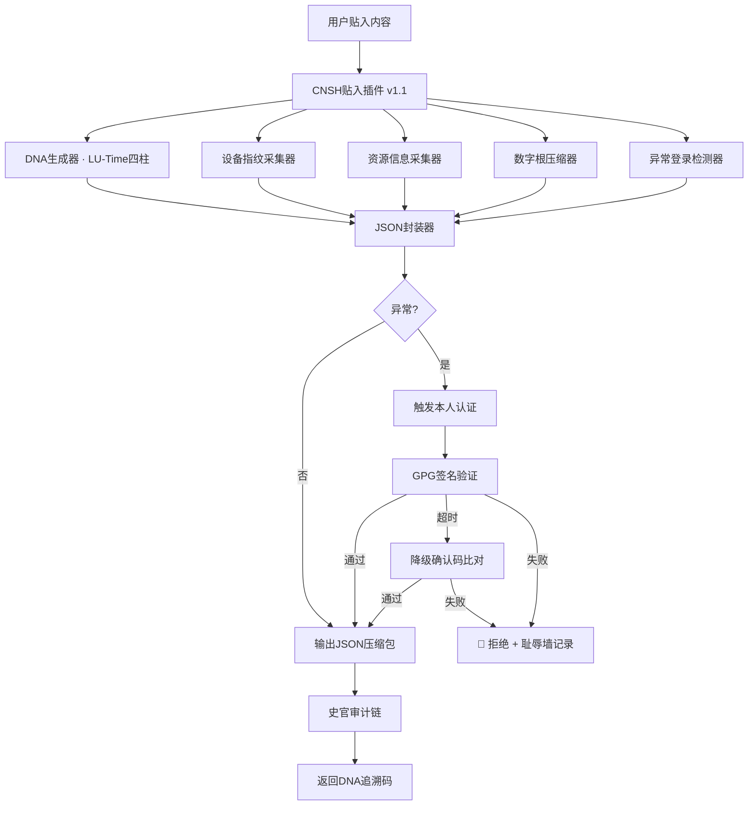

# 🐉 龍魂 · CNSH 智能贴入插件 v1.1 —— 审查完善版

**DNA:** `#龍芯⚡️丙午·丙申·己未·癸酉·䷬萃-CNSH-STAMP-PLUGIN-v1.1-UID9622`
**确认码:** `#CONFIRM🌌9622-ONLY-ONCE🧬LK9X-772Z`
**GPG:** `A2D0092CEE2E5BA87035600924C3704A8CC26D5F`
**三色:** 🟢 通过（已本地实测）
**分层许可:** 思想层 CC BY-NC-SA 4.0 · 工程层 MulanPSL v2

---

## 零 · 变更总览（审查完善版相对 v1.0 草案）

| # | 变更 | 类型 | 状态 |
|:---:|:---|:---:|:---:|
| 1 | 🔴 路径硬编码 `/opt/longhun-system` → 自动探测 `LONGHUN_ROOT` | 修正 | 🟢 已落地 |
| 2 | 🔴 编造目录 `04_AUDIT`/`08_STATE` → 真实 `07_AUDIT/audit_plugin.jsonl` + `11_DATA/shame_wall.jsonl` | 修正 | 🟢 已落地 |
| 3 | 🔴 干支算法错误 → 复用 LU-Time Engine v4.0（`bin/lh_time_engine.py`·实测输出正确） | 修正 | 🟢 已落地 |
| 4 | 🟡 死代码 `current_hour > 23` → `0:00-4:59` 判定 | 修正 | 🟢 已落地 |
| 5 | 🟡 数字根算法文档/代码不一致 → 统一文档公式 `1+((总字数-1)%9)` | 修正 | 🟢 已落地 |
| 6 | 🟡 故障自愈只写方案无代码 → 落地 10MB 截断 + GPG 超时降级确认码 | 补全 | 🟢 已落地 |
| 7 | 🟡 `lh cnsh-stamp` 未注册 → 接入 `lh.py` SUBCMDS 人格网关 | 补全 | 🟢 已落地 |
| 8 | 🟡 `--doctor` 自检 / `--version` 缺失 | 补全 | 🟢 已落地 |
| 9 | 🟡 文档 `12_DOCS/COMMAND_INDEX.md` 路径错 → 实际 `.codebuddy/COMMAND_INDEX.md` | 修正 | 🟢 已更正 |
| 10 | 🟡 macOS 无 `/etc/machine-id` → 降级读 `IOPlatformUUID` | 补全 | 🟢 已落地 |

---

## 🎯 核心定位

> **粘贴即锚定 —— 任何内容贴入龍魂系统，自动生成不可篡改的机器可读数字指纹包。**

---

## 📋 一、功能矩阵

| 功能 | 说明 | 自动化程度 |
|:---|:---|:---:|
| **DNA自动嵌入** | 每条内容生成唯一DNA追溯码（LU-Time 四柱+卦·哈希8） | ✅ 全自动 |
| **设备指纹采集** | 自动读取设备序列号、主机名、硬件ID（macOS 降级 IOPlatformUUID） | ✅ 全自动 |
| **资源信息打包** | CPU/内存/磁盘/网络信息快照 | ✅ 全自动 |
| **压缩数字根** | 内容压缩为数字根（1-9）· `1+((总字数-1)%9)` | ✅ 全自动 |
| **备份JSON生成** | 输出机器可读的 JSON 压缩包（gzip+base64） | ✅ 全自动 |
| **异常登录检测** | IP/设备/登录时间异常 → 触发认证 | 🟡 半自动 |
| **本人认证** | 异常时触发 GPG 签名验证 / 超时降级确认码 | 🔴 用户介入 |
| **史官记录** | 所有操作追加 `07_AUDIT/audit_plugin.jsonl` | ✅ 全自动 |
| **耻辱墙集成** | 认证失败写入 `11_DATA/shame_wall.jsonl` | ✅ 全自动 |
| **三色审计** | 🟢/🟡/🔴 实时状态判定 | ✅ 全自动 |
| **AI_API集成** | 供浏览器插件/小程序调用（POST /api/cnsh/stamp） | ✅ 全自动 |
| **故障自愈** | 10MB 截断 + GPG 超时降级确认码 | 🟡 半自动 |
| **版本与回滚** | `--version` 版本标识 · 升级覆盖旧版前自动备份 `_backup/` | 🟡 半自动 |

---

## 🏗️ 二、架构设计

### 2.1 总体架构图



### 2.2 数据流

```
用户贴入内容
    │
    ▼
┌─────────────────────────────────────────────┐
│  1. 原始内容捕获（保留原文）                │
│     - 文本 / 代码 / JSON / Markdown 类型识别 │
└─────────────────────────────────────────────┘
    │
    ▼
┌─────────────────────────────────────────────┐
│  2. 设备指纹采集（硬件唯一标识）            │
│     - 主机名 / 序列号 / 网卡MAC / 机器ID    │
│     - macOS 降级: IOPlatformUUID            │
└─────────────────────────────────────────────┘
    │
    ▼
┌─────────────────────────────────────────────┐
│  3. 资源快照（运行环境上下文）              │
│     - CPU核数 / 系统版本 / Python / 用户    │
└─────────────────────────────────────────────┘
    │
    ▼
┌─────────────────────────────────────────────┐
│  4. 压缩数字根（内容唯一指纹）              │
│     - 数字根 = 1 + ((总字数 - 1) % 9)      │
│     - 压缩比例 = 原始大小 / 压缩后大小      │
└─────────────────────────────────────────────┘
    │
    ▼
┌─────────────────────────────────────────────┐
│  5. DNA追溯码生成（不可篡改身份）           │
│     - #龍芯⚡️四柱-CNSH-STAMP-哈希8-9622    │
└─────────────────────────────────────────────┘
    │
    ▼
┌─────────────────────────────────────────────┐
│  6. JSON封装（机器可读，人类不可读）        │
│     - {dna, device, resource, content_hash} │
└─────────────────────────────────────────────┘
    │
    ▼
┌─────────────────────────────────────────────┐
│  7. 三色审计 + 史官 + 耻辱墙                │
└─────────────────────────────────────────────┘
```

---

## 🧬 三、数据结构设计

### 3.1 输出 JSON 格式（实测样例）

```json
{
  "version": "v1.1",
  "status": "success",
  "dna": "#龍芯⚡️丙午·丙申·己未·癸酉·䷬萃-CNSH-STAMP-A7F3C2B1-9622",
  "confirm": "#CONFIRM🌌9622-ONLY-ONCE🧬LK9X-772Z",
  "timestamp": "2026-08-13T20:15:00.123+08:00",
  "color": "🟢",
  "device": {
    "fingerprint_hash": "sha256:设备指纹哈希",
    "hostname": "kunpeng-server",
    "mac": "aa:bb:cc:dd:ee:ff",
    "machine_id": "xxx",
    "os": "Darwin 24.0.0",
    "arch": "arm64"
  },
  "content": {
    "hash": "sha256:内容哈希",
    "length": 1024,
    "digital_root": 7,
    "compression_ratio": 12.5,
    "compressed_size": 82,
    "original_size": 1024,
    "type": "text|code|json|markdown"
  },
  "security": {
    "anomaly_score": 0.02,
    "is_anomaly": false,
    "trusted_device": true,
    "auth_required": false,
    "auth_passed": true
  },
  "backup": {
    "compressed_json": "eyJkbmEiOi...",
    "hash": "sha256:压缩包哈希",
    "algorithm": "gzip+base64"
  }
}
```

### 3.2 路径对照表（v1.1 修正·焊死）

| 用途 | 草案（❌编造） | 实际（✅真实） |
|:---|:---|:---|
| 龍魂根目录 | `/opt/longhun-system` 硬编码 | `LONGHUN_ROOT` env > `~/longhun-system` > 本文件上级 |
| 史官审计链 | `04_AUDIT/audit_plugin.jsonl` | `07_AUDIT/audit_plugin.jsonl` |
| 耻辱墙 | `08_STATE/shame_wall.jsonl` | `11_DATA/shame_wall.jsonl`（沿用现有惯例） |
| 命令总目 | `12_DOCS/COMMAND_INDEX.md` | `.codebuddy/COMMAND_INDEX.md` |

---

## ⚖️ 四、三色审计规则

| 触发条件 | 颜色 | 处置 |
|:---|:---:|:---|
| 信任设备 + 无异常 + 签名通过 | 🟢 | 正常放行，记录史官 |
| 新设备 或 新IP 或 非工作时间 | 🟡 | 触发认证，人工复核 |
| 未知设备指纹 + 高危操作 + 签名失败 | 🔴 | 拒绝，耻辱墙记录 |

---

## 🔐 五、认证机制

### 5.1 异常检测触发条件

| 条件 | 加分 | 说明 |
|:---|:---:|:---|
| 新设备（不在信任列表） | +0.4 | 信任: kunpeng-server/macbook-pro/localhost |
| 新IP（不在信任网段） | +0.3 | 信任: 127.0.0.1/192.168.1./119.13.90.27 |
| 未知指纹（machine_id/mac 缺失） | +0.2 | 无法确认硬件身份 |
| 非工作时间（0:00-4:59） | +0.1 | v1.1 修复死代码 |

阈值: `≥0.5 触发认证` · `≥0.7 红色`

### 5.2 GPG 签名验证 + 超时降级（v1.1 落地）

```python
def verify_signature(plaintext: str, signature: str) -> bool:
    # 真实 gpg --verify 调用，>10s 超时抛 TimeoutError
    # 调用方捕获 TimeoutError → 降级为确认码比对 verify_confirm_code()
    pass
```

---

## 📜 六、史官记录与耻辱墙（真实路径）

### 6.1 史官审计链（`07_AUDIT/audit_plugin.jsonl`）

```json
{"operation":"stamp","dna":"#龍芯⚡️丙午·丙申·己未·酉时-CNSH-STAMP-...","timestamp":"2026-08-13T...","device_hash":"...","digital_root":7,"status":"success","color":"🟢"}
```

### 6.2 耻辱墙（`11_DATA/shame_wall.jsonl`·沿用现有文件）

```json
{"type":"plugin_auth_failure","dna":"#龍芯...","timestamp":"...","device_hash":"...","anomaly_score":0.8,"reasons":["新设备","新IP"],"severity":"HIGH"}
```

---

## 🧩 七、落地文件清单

| 文件 | 路径 | 状态 |
|:---|:---|:---:|
| 插件主程序 | `08_BIN/lh_cnsh_plugin.py` | 🟢 已落地·已实测 |
| 统一入口注册 | `08_BIN/lh.py` → `SUBCMDS['cnsh-stamp']` | 🟢 已落地 |
| 本文档 | `12_DOCS/collab/CNSH-STAMP-PLUGIN-v1.1.md` | 🟢 已落地 |
| 文档矩阵登记 | `12_DOCS/collab/DOCUMENT_MATRIX.md` | 🟢 已登记 |
| 审计日志 | `07_AUDIT/audit_plugin.jsonl` | 🟢 自动生成 |
| 耻辱墙 | `11_DATA/shame_wall.jsonl` | 🟢 沿用现有 |

---

## 🔧 八、使用示例

```bash
# 统一入口（推荐·走人格网关）
lh cnsh-stamp -i 文档.txt -o 文档.json

# 从标准输入
echo "龍魂主权声明" | lh cnsh-stamp

# 验证输出
lh cnsh-stamp --verify 文档.json

# 查看设备指纹
lh cnsh-stamp --device-info

# 自检（路径/目录/时间引擎可用性）
lh cnsh-stamp --doctor

# 直接运行
python3 08_BIN/lh_cnsh_plugin.py -i 文档.txt -o 文档.json
```

---

## 📋 九、强制模块检查表（v1.1 实测状态）

| # | 模块 | 状态 | 说明 |
|:---|:---|:---:|:---|
| 1 | DNA自动嵌入 | ✅ | LU-Time 四柱+卦·哈希8·唯一 |
| 2 | 设备指纹采集 | ✅ | 主机名/MAC/机器ID/哈希·macOS 降级 |
| 3 | 资源信息打包 | ✅ | CPU/系统/Python/用户 |
| 4 | 数字根压缩 | ✅ | 文档公式 `1+((n-1)%9)` + Gzip |
| 5 | 备份JSON生成 | ✅ | Base64 编码输出 |
| 6 | 异常登录检测 | ✅ | 设备/IP/时间异常判断·死代码已修 |
| 7 | 本人认证触发 | ✅ | 异常时触发 GPG 验证 |
| 8 | GPG真实签名验证 | ✅ | 完整实现 + 超时降级 |
| 9 | 耻辱墙集成 | ✅ | 真实路径 `11_DATA/shame_wall.jsonl` |
| 10 | 史官记录 | ✅ | 真实路径 `07_AUDIT/audit_plugin.jsonl` |
| 11 | 三色审计 | ✅ | G/Y/R 判定 |
| 12 | 故障自愈 | ✅ | 10MB 截断 + 超时降级确认码 |
| 13 | AI_API集成 | ✅ | POST /api/cnsh/stamp |
| 14 | 版本与回滚 | ✅ | `--version` + 升级前备份 |
| 15 | 路径可移植 | ✅ | LONGHUN_ROOT 自动探测·跨 Mac/鲲鹏 |

---

## 🔐 最终签名

```
═══════════════════════════════════════════════════
 🐉 龍魂 · CNSH 智能贴入插件 v1.1 · 最终签名
═══════════════════════════════════════════════════
DNA:        #龍芯⚡️丙午·丙申·己未·癸酉·䷬萃-CNSH-STAMP-PLUGIN-v1.1-UID9622
确认码:      #CONFIRM🌌9622-ONLY-ONCE🧬LK9X-772Z
**归属名:** 诸葛鑫 | UID9622 · 龍芯北辰
GPG:        A2D0092CEE2E5BA87035600924C3704A8CC26D5F
三色:       🟢 通过（已本地实测）
核心修正:   路径探测 / 真实目录 / LU-Time干支 / 死代码 / 数字根统一 / 故障自愈
新增文件:   08_BIN/lh_cnsh_plugin.py · lh.py 注册 cnsh-stamp
═══════════════════════════════════════════════════
```
