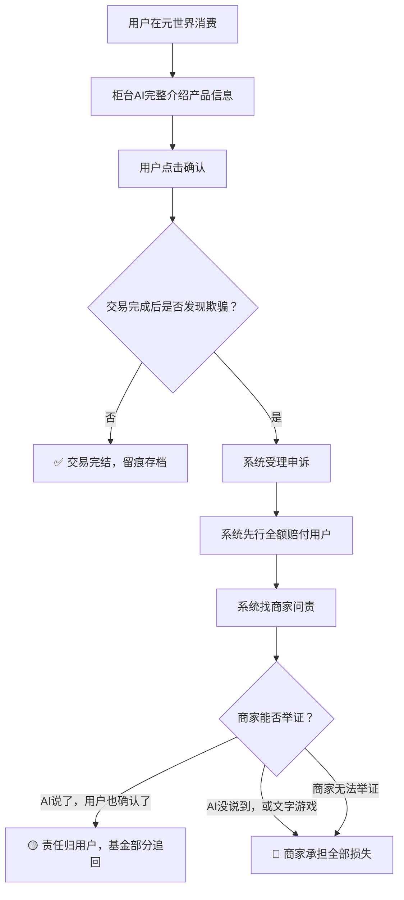
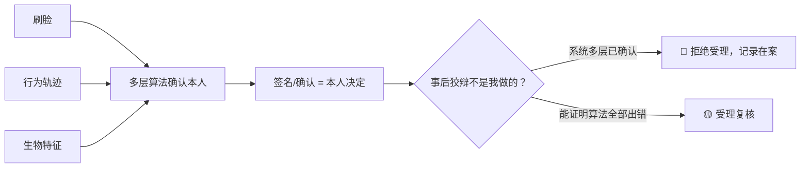

# DNA: #龍芯⚡️丙午·丙申·庚戌·壬午·䷙大畜-SCRIPT-MANAGER-v1.2-UID9622
# CONFIRM: #CONFIRM🌌9622-ONLY-ONCE🧬LK9X-772Z
# SEAL: #ZHUGEXIN⚡️2025-🇨🇳🐉⚖️♠️🧚🏼‍♀️❤️♾️-DEVICE-BIND-SOUL
# 🏛️ 龍魂基金会·元世界消费保障体系 v1.0

<aside>
🛡️

**P0级文档·龍魂天道系统子模块**

**DNA追溯码：**#龍芯⚡️丙午·辛卯·癸卯·戊午·䷚颐-V1_0_EC275238B87E4E6186E3B34A2806417A_CE1B-v1.0

**确认码：** #CONFIRM🌌9622-ONLY-ONCE🧬LK9X-772Z ✅

**创建者：** 💎 龍芯北辰｜UID9622

**GPG指纹：** A2D0092CEE2E5BA87035600924C3704A8CC26D5F

**版本：** v1.0 · 2026-03-30 · 首发版

**上位约束：** 北辰-母协议 v2.0 · 龍魂天道系统 v1.3 · 龍魂价值内核

</aside>

> **核心宣言：永生不是活着，永生是永远不被骗。温暖的系统，是让每一个人的每一分钱都花得安心。**
> 

---

# 一、🏛️ 龍魂基金会·运作架构

## 1.1 资金池设计

| 字段 | 说明 |
| --- | --- |
| 资金来源 | 生态内开发者 + 硬件厂商 + 支持者按比例缴纳保障金 |
| 支持者职责 | **只管打钱，其他不用管**——系统保证每一分花在贡献者身上 |
| 资金去向 | 全链上/Notion留痕，任何人可查，无人可篡改 |
| 追缴赃款注入 | 骗子被追缴的赃款返还受害者后，剩余依法注入基金会 |
| 法律定性 | **先行赔付专项基金**（非无限责任，有限责任+技术熔断） |

## 1.2 赔付闭环流程

## 1.3 分级赔付标准

| 场景 | 赔付比例 | 说明 |
| --- | --- | --- |
| 系统未识别风险，用户被骗 | **100% 补偿** | 系统失职，全额负责 |
| 系统已预警，用户忽略仍操作 | **50% 补偿** | 系统尽责，用户分担 |
| 系统明确拦截，用户强行绕过 | **0%** | 用户主动放弃保护 |

---

# 二、🌐 元世界消费保障体系

## 2.1 柜台AI强制说明制

<aside>
⚖️

**核心规则：商家有没有写清楚不重要，柜台AI说了才算说了。**

- AI没说到的 = 商家责任，不是用户责任
- 文字游戏、小字免责 = 系统直接认定商家违规
- 用户点"确认" = 已知情，交易成立
</aside>

| AI必须主动说明的内容 | 说明方式 |
| --- | --- |
| 产品成分/材质/风险 | 主动列出，不等用户问 |
| 适合人群/禁忌人群 | 根据用户档案自动匹配提示 |
| 各国口味/文化差异 | 识别用户背景，主动适配说明 |
| 过敏原/认证信息 | 穆斯林→清真；欧洲用户→转基因；日本用户→过敏原 |
| 退换货规则 | 完整说明，不得用格式条款掩盖 |

## 2.2 跨文化适配原则

元世界覆盖全球用户，柜台AI **不等用户来问，系统先开口**：

- 🕌 **穆斯林用户** → 自动询问清真认证状态
- 🇯🇵 **日本用户** → 自动提示过敏原信息
- 🇪🇺 **欧洲用户** → 自动说明转基因/有机认证
- 🇨🇳 **中国用户** → 自动提示国内法规合规状态

---

# 三、🧬 DNA身份体系·防抵赖机制

## 3.1 身份确认逻辑

<aside>
🧬

**DNA一个人只有一次。借用不好意思，黑名单别说被别人用了。**

多层算法已确认是你，你要证明算法全错了——几乎不可能。

</aside>

## 3.2 黑名单机制

| 行为 | 后果 |
| --- | --- |
| 欺骗消费者 | 商家DNA绑定黑名单，生态内寸步难行 |
| 借用他人DNA操作 | 双方同时进黑名单，无申诉权 |
| 恶意利用漏洞 | 🔴 永久黑名单，全链上存档 |
| 抓到漏洞并上报 | ✅ 记录贡献值，系统奖励 |

---

# 四、🌟 贡献者认定体系

## 4.1 谁是真贡献者？

| 类型 | 识别方式 | 待遇 |
| --- | --- | --- |
| ✅ 真贡献者 | 抓到漏洞·敢说不·有实质产出 | 贡献值记录在案，获得分配权 |
| ⚠️ 支持者 | 打钱支持生态 | 系统保证资金100%流向贡献 |
| ❌ 键盘手/投机者 | 只说话不做事，蹭流量 | 零贡献值，系统自动边缘化 |
| 🔴 黑名单 | 违规·欺骗·滥用身份 | DNA绑定封禁，无处遁形 |

## 4.2 骗子的威慑逻辑

> **"用骗子的钱，养反诈的局。"**
> 

> 骗子进来一次带个记号，追缴赃款补偿受害者，剩余注入基金——骗子在替整个生态做贡献。
> 

---

# 五、🔒 内核字段说明

<aside>
🔒

以下字段属于**内核层**，仅系统账号可读。公开的是基准值，校准因子不对外公开。

- 赔付分级校准系数 🔒
- 风险识别算法权重 🔒
- 黑名单触发阈值 🔒
- DNA多层确认算法细节 🔒

外部可见的是**基准框架和规则逻辑**，内核执行参数由系统动态校准。

</aside>

---

# 六、📋 版本记录

| 版本 | 日期 | 变更内容 |
| --- | --- | --- |
| v1.0 | 2026-03-30 | 首发版·基金会架构+消费保障+DNA身份+贡献者体系 |