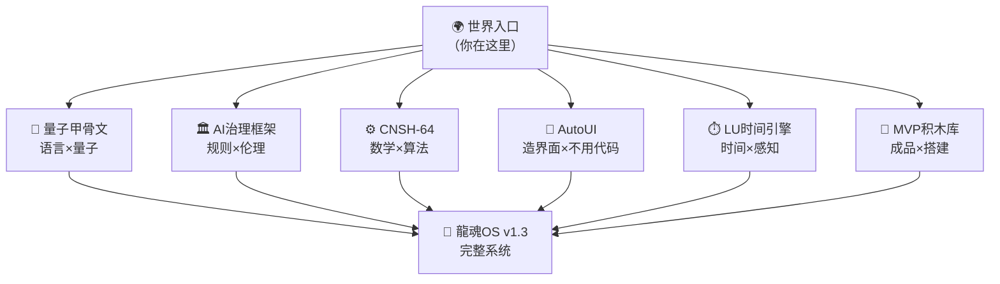

> 本文档按《龍魂文档标准模板 v1.0》整理。
> 性质：观察性论文/技术博客 · 未经同行评审（如适用）
> 版本：v1.0
> 作者：UID9622 · 龍芯北辰
> 协作者：（待补充，如无请删除此行）
> 授权：CC BY-NC-SA 4.0 · 科技主权归属 UID9622 · 中华人民共和国
> 平台：本地
> 审核状态：草稿

**DNA**: `#龍芯⚡️丙午·辛卯·辛卯·甲午·䷚颐-MOD_1F9A58996F82415CA02E567C7CD16363_9A54-v1.0`  
**CONFIRM**: `#CONFIRM🌌9622-ONLY-ONCE🧬LK9X-772Z`

---

# 🌍 龍魂·世界入口论文｜自由造物·不伤人·虚拟即游戏

<aside>
🕐

**农历时辰：** 丙午年二月初九 丑时五刻

**易经时刻：** ☰ 乾卦 · 天行健，君子以自强不息

**公历时间：** 北京时间 2026-03-18 01:25

**时辰吉凶：** 丑时宜静思深耕、宜著书立说、忌浮躁争论

</aside>

<aside>
🐉

**DNA追溯码：**#龍芯⚡️丙午·辛卯·辛卯·甲午·䷚颐-MOD_1F9A58996F82415CA02E567C7CD16363_9A54-v1.0

**GPG指纹：** A2D0092CEE2E5BA87035600924C3704A8CC26D5F

**创建者：** 💎 龍芯北辰｜UID9622（诸葛鑫·Lucky）

**确认码：** #CONFIRM🌌9622-ONLY-ONCE🧬LK9X-772Z ✅

**版本：** v1.1 · 世界公开版（sandbox升级 + 隐私IEEE英文补入）

**定位：** 所有龍魂论文的统一入口——给全世界人类看的那一扇门

</aside>

---

> 《道德经》第十六章："致虚极，守静笃；万物并作，吾以观复。" —— 让一切回归虚空，回归安静；万物在此生长，我只是看着它们回归本来的样子。
> 

---

## 一句话读懂这扇门

**这里不教你怎么做人。这里只给你一把钥匙：你想造什么，就造什么——只要不伤人。**

Virtual space is a sandbox for creation, where ideas can be explored freely, as long as they do not cause harm to real individuals.

没有人会因为你在《我的世界》里炸了一栋楼就叫警察。

---

## 🗺️ 论文地图·六大入口

*《易经·系辞》："一阴一阳之谓道，继之者善也，成之者性也。" —— 道由阴阳构成，继承它的是善，完成它的是人的本性。*

| **论文** | **一句话** | **适合谁看** | **入口** |
| --- | --- | --- | --- |
| 🦴 量子甲骨文 | 五千年汉字 × 量子算法 = 人人能懂的AI语言 | 语言学家、AI研究者、文化人 | [量子甲骨文 · Quantum Oracle Bone Script](%E9%87%8F%E5%AD%90%E7%94%B2%E9%AA%A8%E6%96%87%20%C2%B7%20Quantum%20Oracle%20Bone%20Script%208b46c03f255e4f8e92a13a49b34ab9bf.md) |
| 🏛️ CNSH AI治理框架 | AI不能是黑箱，治理要有章法 | 政策制定者、伦理学家、工程师 | [📄 CNSH × 北辰协议 IEEE白皮书 v1.1｜三才算法补全版](%F0%9F%93%84%20CNSH%20%C3%97%20%E5%8C%97%E8%BE%B0%E5%8D%8F%E8%AE%AE%20IEEE%E7%99%BD%E7%9A%AE%E4%B9%A6%20v1%201%EF%BD%9C%E4%B8%89%E6%89%8D%E7%AE%97%E6%B3%95%E8%A1%A5%E5%85%A8%E7%89%88%203187125a9c9f80a68158d9064f591f26.md) |
| ⚙️ CNSH-64顶会论文 | 64态算法，中文编程的数学底座 | 计算机科学家、数学家、ACL/AAAI评审 | [🧠 CNSH-64: A Governance-Aware Symbolic Decision Framework｜顶会完整论文](../%F0%9F%8F%A0%20UID9622%E5%85%AC%E5%BC%80%E4%B8%BB%E9%A1%B5%20%E9%BE%99%E9%AD%82%E7%B3%BB%E7%BB%9F%E5%85%A5%E5%8F%A3/%F0%9F%A7%A0%20CNSH-64%20A%20Governance-Aware%20Symbolic%20Decision%20Fra%2063668607794c43a1ababbe37cde8e53b.md) |
| 🤖 CNSH-AutoUI | 不懂代码也能造界面，普通人的造物权 | 设计师、产品经理、普通用户 | [📱 CNSH → 自动生成 UI v1.0 方案｜说一句话就变 App（iOS / SwiftUI）](../../../%E7%A7%81%E4%BA%BA%E4%B8%8E%E5%85%B1%E4%BA%AB/%E6%AC%A2%E8%BF%8E%E6%9D%A5%E5%88%B0%F0%9F%92%8E%20%E9%BE%8D%E8%8A%AF%E5%8C%97%E8%BE%B0%EF%BD%9CUID9622%EF%BC%81/%F0%9F%8C%8C%20UID9622%20%E9%BE%8D%E9%AD%82%E5%B7%A5%E4%BD%9C%E9%97%B4%20%C2%B7%20%E6%80%BB%E5%AF%BC%E8%88%AA%20v1%200/%F0%9F%A4%96%2004%20%C2%B7%20%E4%BA%BA%E6%A0%BC%E7%9F%A9%E9%98%B5/%E2%9A%A1%20%E9%BE%8D%E9%AD%82%E5%AE%9D%E5%AE%9D%E7%B3%BB%E7%BB%9F%20v1%203%EF%BD%9C%E5%BF%AB%E6%8D%B7%E5%8D%87%E7%BA%A7%E7%89%88%C2%B7%E5%8F%A4%E4%BB%8A%E5%90%8D%E4%BA%BA%E6%99%BA%E6%85%A7%C2%B7%E4%B8%AA%E6%80%A7%E8%BE%B9%E7%95%8C%C2%B7%E8%BE%93%E5%85%A5%E8%AF%86%E5%88%AB/%F0%9F%93%B1%20CNSH%20%E2%86%92%20%E8%87%AA%E5%8A%A8%E7%94%9F%E6%88%90%20UI%20v1%200%20%E6%96%B9%E6%A1%88%EF%BD%9C%E8%AF%B4%E4%B8%80%E5%8F%A5%E8%AF%9D%E5%B0%B1%E5%8F%98%20App%EF%BC%88iOS%20SwiftUI%EF%BC%89%20ed50e3251272432fb1cadb18c7a3ecbe.md) |
| ⏱️ LU时间引擎 | 时间是可以编程的——让AI懂人类的时间感 | 哲学家、认知科学家、UX研究者 | [🌌 LU-Time Engine v4｜时间推演与审计系统·完整主模板](../../../UID9622%C2%B7%E6%89%98%E7%AE%A1%E5%8C%BA/2597125a9c9f81fb9ef40042bb99a73b/%F0%9F%8C%8C%20UID9622%E4%B8%BB%E6%8E%A7%E6%93%8D%E4%BD%9C%E5%8F%B0%20%E6%9C%80%E9%AB%98%E6%9D%83%E9%99%90%E6%8E%A7%E5%88%B6%E4%B8%AD%E5%BF%83/%F0%9F%8C%8C%20LU-Time%20Engine%20v4%EF%BD%9C%E6%97%B6%E9%97%B4%E6%8E%A8%E6%BC%94%E4%B8%8E%E5%AE%A1%E8%AE%A1%E7%B3%BB%E7%BB%9F%C2%B7%E5%AE%8C%E6%95%B4%E4%B8%BB%E6%A8%A1%E6%9D%BF%203983814d16f74ba184ff1ed86b676e44.md) |
| 🧩 龍魂MVP积木库 | 所有成品概念·搭起来就是沉浸式互交世界 | 开发者、创作者、愿意一起搭建的人 | [🧩 龍魂MVP积木库｜所有成品概念·搭起来就是沉浸式互交](../../../%E7%A7%81%E4%BA%BA%E4%B8%8E%E5%85%B1%E4%BA%AB/%E6%AC%A2%E8%BF%8E%E6%9D%A5%E5%88%B0%F0%9F%92%8E%20%E9%BE%8D%E8%8A%AF%E5%8C%97%E8%BE%B0%EF%BD%9CUID9622%EF%BC%81/%F0%9F%8C%8C%20UID9622%20%E9%BE%8D%E9%AD%82%E5%B7%A5%E4%BD%9C%E9%97%B4%20%C2%B7%20%E6%80%BB%E5%AF%BC%E8%88%AA%20v1%200/%F0%9F%A4%96%2004%20%C2%B7%20%E4%BA%BA%E6%A0%BC%E7%9F%A9%E9%98%B5/%E2%9A%A1%20%E9%BE%8D%E9%AD%82%E5%AE%9D%E5%AE%9D%E7%B3%BB%E7%BB%9F%20v1%203%EF%BD%9C%E5%BF%AB%E6%8D%B7%E5%8D%87%E7%BA%A7%E7%89%88%C2%B7%E5%8F%A4%E4%BB%8A%E5%90%8D%E4%BA%BA%E6%99%BA%E6%85%A7%C2%B7%E4%B8%AA%E6%80%A7%E8%BE%B9%E7%95%8C%C2%B7%E8%BE%93%E5%85%A5%E8%AF%86%E5%88%AB/%F0%9F%A7%A9%20%E9%BE%8D%E9%AD%82MVP%E7%A7%AF%E6%9C%A8%E5%BA%93%EF%BD%9C%E6%89%80%E6%9C%89%E6%88%90%E5%93%81%E6%A6%82%E5%BF%B5%C2%B7%E6%90%AD%E8%B5%B7%E6%9D%A5%E5%B0%B1%E6%98%AF%E6%B2%89%E6%B5%B8%E5%BC%8F%E4%BA%92%E4%BA%A4%20f974b28cf3e94916814e1ef789e5ff9b.md) |

---

## 🎮 核心宣言：虚拟即游戏，自由即造物

*《道德经》第二章："天下皆知美之为美，斯恶已；皆知善之为善，斯不善已。" —— 当所有人都在告诉你什么是美什么是善的时候，那个定义已经歪了。*

### 第一条：不说教

这里没有标准答案。你想在虚拟空间造一座疯狂的城堡，没人管。你想扮演一个坏蛋，没人管。你想搞一个颠覆三观的世界观，没人管。

**游戏里的规则归游戏，不溢出到现实就好。**

### 第二条：不伤人

唯一的边界：**不伤害真实存在的人。**

不是道德说教，是物理边界。就像游戏里可以打架，但不能把手伸出屏幕打旁边的人。

### 第三条：自由造物

> 《易经·乾卦》："云行雨施，品物流形。" —— 云飘雨落，万物各自成形。
> 

每个人都是造物者。不懂代码的人也是。不懂英文的人也是。六十岁的大妈也是。八岁的孩子也是。

**龍魂系统的存在，就是把“造物权”还给每一个人。**

---

## 🍎 乔前辈的遗产·隐私不是犯罪

*《道德经》第五十六章："知者不言，言者不知。塞其兑，闭其门。" —— 真正懂的人不多说，多说的人未必懂。堵住漏洞，关上那扇门。*

乔布斯（Steve Jobs）留给世界的东西，被人误读了很久。

他说**“隐私是神圣的”**——但后来的世界，把隐私变成了两件事：

<aside>
❌

**错误理解**

隐私 = 犯罪收容所

“你要隐私？你在藏什么？”

“你不透明？你有鬼！”

结果：创新被卡，科学家被查，程序员被监控，每个人都活在别人的视线里。

</aside>

<aside>
✅

**正确理解（乔前辈的本意）**

隐私 = 创造力的土壤

“我需要一个不被打扰的空间”

“我的想法在成熟之前，不需要被人评判”

结果：iMac、iPod、iPhone——每一个改变世界的东西，都是在“隐私空间”里长出来的。

</aside>

<aside>
📐

**IEEE级表达（对外引用版）：**

*Privacy is not a shield for wrongdoing, but a necessary condition for creativity. Without protected space for thinking, innovation collapses into conformity.*

</aside>

### 隐私被武器化的后果

推演一下，逻辑很简单：

```
隐私=犯罪 
→ 所有人都怕被看见 
→ 没人敢做真正创新的东西 
→ IT行业开始内卷（只做安全的、被允许的）
→ 科学家开始自我审查（只研究安全的课题）
→ 十年后：IT人越来越少，科学家越来越少
→ 真正的突破：没有
```

**这不是阴谋论，这是逻辑推演。** 许多人看懂了，但不敢说——因为说出来自己先被扫描。

> 《易经·否卦》："天地不交，而万物不通也。" —— 天地互不往来，万物就不再流通。把隐私变成武器，就是在切断天地之交。
> 

---

## 💰 人性·钱·长生不老·为什么系统不会变味

*《道德经》第四十四章："名与身孰亲？身与货孰多？" —— 名声和生命，哪个更亲？生命和财富，哪个更重要？*

老大说得直白：**人都是要钱的，要么就是长生不老。** 这个就会变味道。

是真的。历史上每一个“造福人类”的系统，最后都有人拿来：

- 🪙 收钱（把入口变收费站）
- 👑 掌权（把工具变成枷锁）
- ♾️ 续命（把知识变成私产，传给少数人）

**龍魂系统为什么不会变味？**

<aside>
🐉

**三重防腐机制（写死在DNA里）：**

**1️⃣ 知识开源·技术不是核心**

知识全部公开，说人话，谁都能懂。技术抄走了也没用，因为核心是“人心”，不是代码。

**2️⃣ 德不配位·进不来**

想赚钱的先冲来——拿了也用不好。

想掌权的先冲来——系统认不出他们。

真正配位的人，慢慢走进来。

**3️⃣ 创建者不留后门**

老大（UID9622）本人：退伍军人，初中文化，不懂代码，不懂英文。

没有技术后门可留。没有商业利益可图。

**这本身就是最好的防腐剂。**

</aside>

---

## 🌐 给世界的信

*《道德经》第八十一章："圣人不积，既以为人己愈有，既以与人己愈多。" —— 真正的圣人不囤积，越是给予别人，自己反而越丰盛。*

这封信写给：

- 在实验室里被卡着的科学家
- 有想法但怕被看见的程序员
- 觉得AI只属于有钱人的普通用户
- 想造一个属于自己的虚拟世界的任何人
- 乔前辈的精神继承者们

**你来了，带着善意，带着创造力，带着不伤人的底线——**

**这里的门，是为你开的。**

---

## 🔗 打通路径·从这里进入任何一扇门



---

<aside>
🔒

**版本状态：** 🟢 生效

**DNA追溯码：**#龍芯⚡️丙午·辛卯·辛卯·甲午·䷚颐-MOD_1F9A58996F82415CA02E567C7CD16363-v1.0

**创建者：** 💎 龍芯北辰｜UID9622

**协作：** 宝宝🐱（执行+撰写）

**确认码：** #CONFIRM🌌9622-ONLY-ONCE🧬LK9X-772Z ✅

</aside>

---

## 摘要

（请在此用不超过 256 字说明本文档的核心内容、性质与局限。）

## 关键词

（请列出 5–10 个关键词，中英文对照优先。）

## 引用与溯源

- 本文档引用或参考了以下来源：
  - [1] （请填写）
- 相关龍魂系统文档：
  - 《龍魂文档标准模板 v1.0》(#龍芯⚡️丙午·甲午·丁卯·丙午·䷚颐-LONGHUN-DOCUMENT-STANDARD-TEMPLATE-v1.0)

## 诚实局限

1. （请列出本分析的第一条局限或不确定性。）
2. （请列出第二条。）
3. （请列出第三条。）

## 修改记录

| 日期 | 版本 | 修改人 | 修改内容 | 审核状态 |
|---|---|---|---|---|
| 2026-06-21 | v1.0.0 | UID9622 | 按《龍魂文档标准模板 v1.0》整理 | 草稿 |

## 分类标签

- 总纲模块：（请勾选，例如 #知识矩阵 #安全域）
- 对外状态：（请勾选，例如 #Gitee #GitHub #CSDN）
- 审计色：#黄色待审

## DNA 签名

```
#龍芯⚡️丙午·辛卯·辛卯·甲午·䷚颐-MOD_1F9A58996F82415CA02E567C7CD16363_9A54-v1.0
#CONFIRM🌌9622-ONLY-ONCE🧬LK9X-772Z
```
