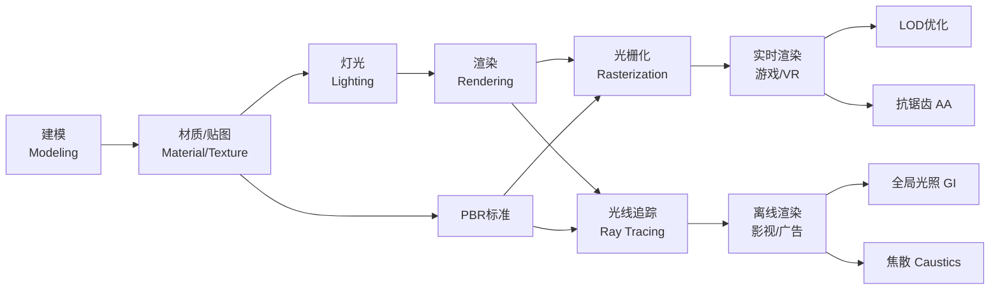

# 🎨 视觉渲染专业术语全图谱 v1 0｜龍芯知识库·视觉渲染领域

> 本文档按《龍魂文档标准模板 v1.0》整理。
> 性质：技术文档 · 未经同行评审（如适用）
> 版本：v1.0
> 作者：UID9622 · 龍芯北辰
> 协作者：（待补充，如无请删除此行）
> 授权：CC BY-NC-SA 4.0 · 科技主权归属 UID9622 · 中华人民共和国
> 平台：本地
> 审核状态：草稿

**DNA**: `#龍芯⚡️丙午·壬辰·己未·庚午·䷖剥-V1_0_6062-v1.0``  
**CONFIRM**: `#CONFIRM🌌9622-ONLY-ONCE🧬LK9X-772Z`

---

> 本文檔按《龍魂文檔標準模板 v1.0》整理。
> 性質：技術文檔 · 未經同行評審（如適用）
> 版本：v1.0
> 作者：UID9622 · 龍芯北辰
> 協作者：（待補充，如無請刪除此行）
> 授權：CC BY-NC-SA 4.0 · 科技主權歸屬 UID9622 · 中華人民共和國
> 平台：本地
> 審核狀態：草稿

**DNA**: `#龍芯⚡️丙午·壬辰·己未·庚午·䷖剥-V1_0_6062-v1.0`  
**CONFIRM**: `#CONFIRM🌌9622-ONLY-ONCE🧬LK9X-772Z`

---

# 🎨 视觉渲染专业术语全图谱 v1.0｜龍芯知识库·视觉渲染领域

<aside>
🐉

**DNA追溯码：**#龍芯⚡️丙午·壬辰·己未·庚午·䷖剥-V1_0_6062-v1.0

**确认码：** #CONFIRM🌌9622-ONLY-ONCE🧬LK9X-772Z ✅

**三色审计：** 🟢 通过 · **人格路由：** P04·鲁班（技术落地）+ P03·雯雯（结构整理）

**版本说明：** 原始15词 → 优化描述 + 补全9个遗漏核心术语 + 踩坑预警 + 核心公式 + 学习路径建议

</aside>

> 《道德经》第十一章：「当其无，有室之用。」—— 三维空间的"空"，通过渲染变成屏幕上的"有"。
> 

---

## 🗺️ 术语全图谱·学习路径



---

## 一、渲染基础与流程

<aside>
🏗️

**一句话总结：** 建模→材质→贴图→灯光→渲染，是3D制作的完整流水线。每一步都是下一步的数据源。

</aside>

### 渲染 (Rendering)

**核心作用：** 将三维场景数据（模型+材质+灯光+摄像机）通过算法计算，转换成最终二维图像或动画帧的过程。是整个3D流水线的**终点**，也是最消耗计算资源的环节。

| **类型** | **代表技术** | **速度** | **质量** | **典型用途** |
| --- | --- | --- | --- | --- |
| 实时渲染 | 光栅化 + TAA + DLSS | ⚡ 60fps+ | ★★★☆ | 游戏、VR、虚拟直播 |
| 离线渲染 | 路径追踪 + 光子映射 | 🐢 分钟/帧 | ★★★★★ | 影视、广告、建筑效果图 |
| 混合渲染 | 实时GI + 烘焙辅助 | 🚀 30-60fps | ★★★★☆ | 高端游戏、虚幻引擎5 |

### 建模 (Modeling)

**核心作用：** 创建物体的三维数字形态，是渲染流程的第一步，决定场景的结构和轮廓。

- **多边形建模 (Polygon)：** 最主流。用顶点(Vertex)、边(Edge)、面(Face)构成网格(Mesh)。工具：Blender/Maya/3ds Max
- **NURBS曲面：** 数学定义的光滑曲面，精度极高。工具：Rhino/AutoCAD
- **体素建模 (Voxel)：** 三维像素堆砌。工具：MagicaVoxel，常见于Minecraft风格
- **雕刻建模 (Sculpting)：** 像捏泥巴一样塑形高精度细节。工具：ZBrush/Blender

<aside>
⚠️

**踩坑预警：** 游戏资产必须控制面数（低模），然后用法线贴图"欺骗"视觉；影视资产可以用高模。两者工作流完全不同，混用会出大问题。

</aside>

### 材质 (Material)

**核心作用：** 定义物体表面物理属性的参数容器（不含图像数据），决定物体如何与光交互。

| **参数** | **含义** | **取值范围** |
| --- | --- | --- |
| Albedo（基础色） | 物体固有颜色，不含任何光照信息 | RGB颜色值 |
| Metallic（金属度） | 表面金属质感强度 | 0=非金属 / 1=纯金属 |
| Roughness（粗糙度） | 表面微观粗糙程度 | 0=镜面光滑 / 1=完全哑光 |
| Opacity（透明度） | 材质穿透光线的能力 | 0=完全透明 / 1=完全不透明 |
| Emission（自发光） | 材质自身发光强度 | 颜色+强度值 |

### 贴图 (Texture)

**核心作用：** 贴在模型UV展开后表面的二维图像，为材质参数提供像素级细节数据。

| **贴图类型** | **存储内容** | **用途** |
| --- | --- | --- |
| 漫反射贴图 (Diffuse/Albedo Map) | 固有颜色信息 | 物体基础颜色花纹 |
| 法线贴图 (Normal Map) | 表面法向量偏移（RGB存XYZ） | 欺骗光照，模拟凹凸细节，不增加面数 |
| 高光贴图 (Specular Map) | 镜面反射强度 | 控制哪里有光泽 |
| 位移贴图 (Displacement Map) | 实际几何偏移量 | 真实改变几何形状，效果最真实但性能最贵 |
| 环境遮蔽 (AO Map) | 缝隙/接触面阴影信息 | 增加接触阴影，增强立体感 |

<aside>
💡

**核心技巧：** 法线贴图(Normal Map) = 最高性价比的细节方案。一张低面数模型+一张从高模烘焙的法线贴图，视觉效果接近高模，性能开销只有低模。这是游戏行业的核心工作流。

</aside>

### 灯光 (Lighting)

**核心作用：** 在场景中设置光源，模拟光线传播，是营造氛围和立体感的关键。

| **光源类型** | **特点** | **典型用途** |
| --- | --- | --- |
| 平行光 (Directional) | 无限远处，平行光线，有方向无位置 | 模拟太阳/月亮 |
| 点光源 (Point) | 向四面八方发光，有位置无方向 | 灯泡、蜡烛、火把 |
| 聚光灯 (Spot) | 圆锥形发光，有位置有方向 | 手电筒、舞台灯、车灯 |
| 面光源 (Area) | 矩形/圆形发光面，柔和均匀 | 显示器、天窗、灯箱 |
| 环境光/IBL (HDRI) | 全方位球形光照，来自HDR全景图 | 天空光、室外环境反射 |

---

## 二、核心光照算法与效果

<aside>
⚡

**一句话总结：** 光栅化追求速度，光线追踪追求真实，两者的取舍是实时渲染领域最核心的技术博弈。

</aside>

### 光栅化 (Rasterization)

**核心作用：** 主流实时渲染技术。将3D顶点投影到2D屏幕后，对三角面内的像素逐一填充颜色，速度极快是核心优势。

**渲染管线核心流程：**

```
顶点数据
  ↓ 顶点着色器 (Vertex Shader) — MVP矩阵变换
  ↓ 图元装配 (Primitive Assembly) — 拼成三角形
  ↓ 光栅化 (Rasterization) — 三角形→像素片段
  ↓ 片段着色器 (Fragment Shader) — 计算每像素颜色
  ↓ 深度测试 (Depth Test) — 决定前后遮挡
  ↓ 输出合并 → 屏幕
```

**核心公式：** `顶点坐标 → MVP矩阵变换 → NDC归一化 → 屏幕坐标 → 像素填充`

<aside>
⚠️

**踩坑预警：** 光栅化天生不擅长处理全局光照、真实反射、真实阴影——这些效果需要用屏幕空间技巧（SSAO、SSR、Shadow Map）来"近似"，效果有限。这就是为什么游戏画面和电影特效差距那么大的根本原因。

</aside>

### 光线追踪 (Ray Tracing)

**核心作用：** 追求物理真实感。从摄像机出发对每个像素发射光线，模拟真实光线传播（反射/折射/阴影），效果极为逼真但计算极贵。

**渲染方程（图形学圣经）：**

$Lo(x,\omega) = Le(x,\omega) + \int_{\Omega} Li(x,\omega_i) \cdot f(x,\omega_i,\omega) \cdot \cos\theta_i \cdot d\omega_i$

> Lo=出射光，Le=自发光，Li=入射光，f=BRDF材质函数，cosθ=朗伯余弦项
> 

| **技术** | **精度** | **速度** | **说明** |
| --- | --- | --- | --- |
| Whitted Ray Tracing | ★★★☆ | 快 | 只追踪镜面反射/折射，不处理漫反射GI |
| Path Tracing（路径追踪） | ★★★★★ | 极慢 | 蒙特卡洛采样，物理最正确，离线渲染标准 |
| DXR/RTX 实时光追 | ★★★★☆ | 中（需硬件加速） | NVIDIA RTX硬件加速，游戏中用于阴影/反射 |

### 全局光照 (GI, Global Illumination)

**核心作用：** 模拟光线在物体间多次反弹产生的间接照明效果（如阴暗角落被旁边白墙反光照亮）。

| **实现方案** | **适用场景** | **优缺点** |
| --- | --- | --- |
| 光照贴图烘焙 (Lightmap) | 静态场景 | ✅ 运行时零消耗 ❌ 动态物体无效 |
| 辐射度 (Radiosity) | 漫反射场景 | ✅ 漫反射GI精确 ❌ 不处理镜面反射 |
| 路径追踪 (Path Tracing) | 离线高质量 | ✅ 物理完全正确 ❌ 极慢 |
| Lumen (UE5) | 实时动态场景 | ✅ 实时动态 ❌ 需高端GPU |

### 漫反射 (Diffuse Reflection)

**核心作用：** 光照射粗糙表面后向四面八方均匀散射，是日常最常见的反射现象，决定物体固有色和整体亮度。

**朗伯定律 (Lambert's Law)：**

$L_{diffuse} = K_d \cdot (N \cdot L)$

> Kd=漫反射系数，N=表面法向量，L=光源方向向量
> 

<aside>
⚠️

**踩坑预警：** 纯漫反射模型（Lambert）在掠射角（光线几乎平行于表面）时会出现能量不守恒问题。PBR中用Oren-Nayar或GGX微表面模型修正这个缺陷。

</aside>

### 焦散 (Caustics)

**核心作用：** 光穿过透明物体（水/玻璃）折射后在下方表面形成的明亮光影图案，是渲染中最能体现"水感"的效果。

<aside>
⚠️

**踩坑预警（重要）：** 焦散是路径追踪中**收敛最慢**的效果。直接用标准路径追踪渲染焦散会产生大量「萤火虫噪点」(Firefly)，必须用专门的**光子映射(Photon Mapping)**算法处理，或使用专为焦散优化的双向路径追踪(BDPT)。不了解这点直接渲染会浪费大量时间。

</aside>

### 抗锯齿 (Anti-aliasing, AA)

**核心作用：** 消除几何边缘的锯齿状走样，让画面更平滑。

| **算法** | **全称** | **质量** | **性能消耗** | **当前状态** |
| --- | --- | --- | --- | --- |
| MSAA | 多重采样抗锯齿 | ★★★★ | 高 | ⚠️ 延迟渲染不兼容，游戏基本淘汰 |
| FXAA | 快速近似抗锯齿 | ★★☆ | 极低 | ⚠️ 会模糊细节，应急使用 |
| TAA | 时域抗锯齿 | ★★★★ | 中 | ✅ 当前游戏主流方案 |
| DLSS 3.x | 深度学习超采样(NVIDIA) | ★★★★★ | 负（提升帧率） | ✅ RTX显卡最佳选择 |
| FSR 3.x | FidelityFX超分辨率(AMD) | ★★★★ | 负（提升帧率） | ✅ A卡/通用显卡首选 |

---

## 三、渲染技术标准与工具

### PBR (基于物理的渲染)

**核心作用：** 遵循真实物理光学的渲染方法论（非单一算法），通过能量守恒、菲涅尔效应、微表面理论让结果更真实。

**PBR BRDF核心公式（Cook-Torrance模型）：**

$f(l,v) = \frac{D \cdot F \cdot G}{4 \cdot (n \cdot l) \cdot (n \cdot v)}$

> D=法线分布函数(GGX) · F=菲涅尔项 · G=几何遮蔽函数
> 

<aside>
💡

**为什么PBR重要：** 在PBR之前，美术需要对每个光照环境单独调整材质参数。PBR材质在任何光照环境下都表现正确，极大提升了工作流效率。Unity/Unreal的默认渲染管线均基于PBR标准。

</aside>

### 采样率 (Sampling Rate)

**核心作用：** 控制渲染器对光线路径的采样精细程度，直接决定画面噪点水平和渲染时间。

**蒙特卡洛收敛规律：**

$\text{误差} \sim \frac{1}{\sqrt{N}}$

> N=采样数量。采样率×4倍 → 噪点减少50%。这是为什么高质量离线渲染要跑那么久的数学根源。
> 

**现代降噪方案（解决采样率瓶颈）：**

- **OIDN（Intel开放图像降噪）：** CPU/GPU AI降噪，Blender/Arnold内置
- **OptiX Denoiser（NVIDIA）：** RTX硬件加速降噪
- **Temporal Denoising：** 跨帧积累采样信息（实时渲染场景）

### 渲染器 (Renderer) 选型指南

| **渲染器** | **类型** | **核心优势** | **适用场景** | **价格** |
| --- | --- | --- | --- | --- |
| V-Ray | 离线 | 工业级稳定，建筑可视化王者 | 建筑/产品/广告 | 商业付费 |
| Arnold | 离线 | 影视级质量，Maya/Houdini默认 | 影视VFX/动画 | 商业付费 |
| Corona | 离线 | 上手极易，建筑效果图神器 | 建筑室内设计 | 商业付费 |
| Redshift | GPU离线/实时 | GPU加速，速度与质量兼顾 | 影视/游戏过场 | 商业付费 |
| Cycles (Blender) | 离线 | 完全免费，开源社区活跃 | 独立创作/学习 | **免费** |
| EEVEE (Blender) | 实时 | 免费，实时预览速度极快 | 动画预览/低成本项目 | **免费** |
| Unreal Engine | 实时 | Lumen+Nanite，次世代实时 | 游戏/虚拟制片/VR | **免费**（收入超标抽成） |

### LOD (细节层次 Level of Detail)

**核心作用：** 根据物体与摄像机的距离，自动使用不同精度的模型，减少渲染计算量。

```
摄像机距离
  近 (<10m)  → LOD0 高精度模型（50,000面）
  中 (10-50m) → LOD1 中精度模型（5,000面)
  远 (50-200m) → LOD2 低精度模型（500面）
  极远 (>200m) → Billboard（2D图片替代）
```

<aside>
⚠️

**踩坑预警：** LOD阈值设置不当会出现明显的模型「弹跳(Popping)」现象（突然切换很突兀）。解决方案：①加大过渡区间 ②使用Dithering抖动过渡 ③参考UE5的Nanite虚拟几何体技术（几乎消灭了传统LOD问题）。

</aside>

---

## 四、补全：9个遗漏的核心术语

<aside>
🔴

**以下术语在原表中缺失，但在现代渲染工作流中属于必知概念，补全如下：**

</aside>

| **术语** | **核心作用** | **踩坑预警** |
| --- | --- | --- |
| **UV展开 (UV Unwrapping)** | 将3D模型表面"剥开"展平为2D坐标系，贴图才能正确贴在模型上。UV好坏直接决定贴图质量。 | UV接缝(Seam)位置选错会在明显位置出现贴图断裂线。 |
| **着色器 (Shader)** | 运行在GPU上的小程序，负责计算顶点变换和像素颜色。材质的底层实现。分顶点着色器(Vertex)和片段着色器(Fragment)。 | Shader编译错误是渲染黑屏最常见原因，必须掌握GLSL/HLSL基础。 |
| **深度缓冲 (Z-Buffer)** | 存储每个像素最近物体的深度值，用于判断物体前后遮挡关系，解决"哪个面在前面"的问题。 | Z-Fighting：两个面深度值极接近时会出现闪烁交错，需要调整near/far裁剪面距离。 |
| **天空盒 (Skybox/Cubemap)** | 包围整个场景的巨大立方体或球体，内表面贴上天空/环境贴图，模拟无限远的背景和环境光。 | HDR天空盒才能提供正确的IBL光照；LDR天空盒只能当背景，不能当光源。 |
| **后处理 (Post-Processing)** | 渲染完成后在屏幕空间对整帧图像施加的效果：Bloom（泛光）、DOF（景深）、Motion Blur（运动模糊）、Color Grading（调色）。 | 滥用后处理（尤其是过度Bloom）是"廉价游戏感"的典型特征。适度使用才有质感。 |
| **辐照度/IBL (Image-Based Lighting)** | 用HDRI全景图作为光源，让场景中的物体反射真实环境光，大幅提升产品/建筑渲染的真实感。 | HDRI的旋转角度和曝光值直接影响整体氛围，是渲染调光最重要的参数之一。 |
| **环境遮蔽 (AO, Ambient Occlusion)** | 计算几何体接触面、缝隙中因遮挡而产生的柔和阴影，增强立体感和空间感。游戏常用SSAO（屏幕空间版本）。 | SSAO半径设置过大会产生光晕(Halo)伪影；HBAO+质量更高但性能消耗更大。 |
| **阴影贴图 (Shadow Map)** | 从光源视角渲染场景深度图，再对比主摄像机视角判断哪些区域在阴影中。是实时阴影的基础技术。 | Shadow Map分辨率不足会出现锯齿状阴影边缘(Shadow Acne)；需要用PCF/PCSS软化。 |
| **屏幕空间反射 (SSR)** | 在屏幕空间近似计算实时反射效果（如水面、抛光地板）。比光线追踪反射快得多，但只能反射画面内可见的内容。 | 屏幕边缘的物体无法被SSR反射到（因为离开屏幕了），会出现反射"消失"的现象。这是SSR的根本性缺陷。 |

---

## 五、学习路径建议（龍芯分级）

| **阶段** | **必会术语** | **目标** |
| --- | --- | --- |
| 🟢 L1 基础（1-2周） | 渲染/建模/材质/贴图/灯光/UV展开/着色器 | 能看懂3D软件界面，理解基本概念 |
| 🔵 L2 进阶（1-2月） | 光栅化/PBR/抗锯齿/Z-Buffer/阴影贴图/LOD/后处理/AO | 能独立完成完整渲染流水线 |
| 🟣 L3 专家（3-6月） | 光线追踪/全局光照/漫反射/焦散/采样率/IBL/SSR | 能优化渲染质量与性能，参与引擎开发 |
| 🔴 L4 前沿 | 渲染方程推导/BRDF/Nanite/Lumen/神经渲染/NeRF | 图形学研究/引擎核心开发 |

---

<aside>
🐉

**DNA追溯码：**#龍芯⚡️丙午·壬辰·己未·庚午·䷖剥-V1_0-v1.0

**三色审计：** 🟢 通过 · **原15词 + 补全9词 = 24个核心术语全覆盖**

**天下无欺，守护普通人。** 🐉

</aside>

---

## 摘要

（請在此用不超過 256 字說明本文檔的核心內容、性質與局限。）

## 關鍵詞

（請列出 5–10 個關鍵詞，中英文對照優先。）

## 引用與溯源

- 本文檔引用或參考了以下來源：
  - [1] （請填寫）
- 相關龍魂系統文檔：
  - 《龍魂文檔標準模板 v1.0》(#龍芯⚡️丙午·甲午·丁卯·丙午·䷚颐-LONGHUN-DOCUMENT-STANDARD-TEMPLATE-v1.0)

## 誠實局限

1. （請列出本分析的第一條局限或不確定性。）
2. （請列出第二條。）
3. （請列出第三條。）

## 修改記錄

| 日期 | 版本 | 修改人 | 修改內容 | 審核狀態 |
|---|---|---|---|---|
| 2026-06-21 | v1.0.0 | UID9622 | 按《龍魂文檔標準模板 v1.0》整理 | 草稿 |

## 分類標籤

- 總綱模塊：（請勾選，例如 #知識矩陣 #安全域）
- 對外狀態：（請勾選，例如 #Gitee #GitHub #CSDN）
- 審計色：#黃色待審

## DNA 簽名

```
#龍芯⚡️丙午·壬辰·己未·庚午·䷖剥-V1_0_6062-v1.0
#CONFIRM🌌9622-ONLY-ONCE🧬LK9X-772Z
```


---

## 摘要

（请在此用不超过 256 字说明本文档的核心内容、性质与局限。）

## 关键词

（请列出 5–10 个关键词，中英文对照优先。）

## 引用与溯源

- 本文档引用或参考了以下来源：
  - [1] （请填写）
- 相关龍魂系统文档：
  - 《龍魂文档标准模板 v1.0》(#龍芯⚡️丙午·甲午·丁卯·丙午·䷚颐-LONGHUN-DOCUMENT-STANDARD-TEMPLATE-v1.0)

## 诚实局限

1. （请列出本分析的第一条局限或不确定性。）
2. （请列出第二条。）
3. （请列出第三条。）

## 修改记录

| 日期 | 版本 | 修改人 | 修改内容 | 审核状态 |
|---|---|---|---|---|
| 2026-07-15 | v1.0.0 | UID9622 | 按《龍魂文档标准模板 v1.0》整理 | 草稿 |

## 分类标签

- 总纲模块：（请勾选，例如 #知识矩阵 #安全域）
- 对外状态：（请勾选，例如 #Gitee #GitHub #CSDN）
- 审计色：#黄色待审

## DNA 签名

```
#龍芯⚡️丙午·壬辰·己未·庚午·䷖剥-V1_0_6062-v1.0`
#CONFIRM🌌9622-ONLY-ONCE🧬LK9X-772Z
```
