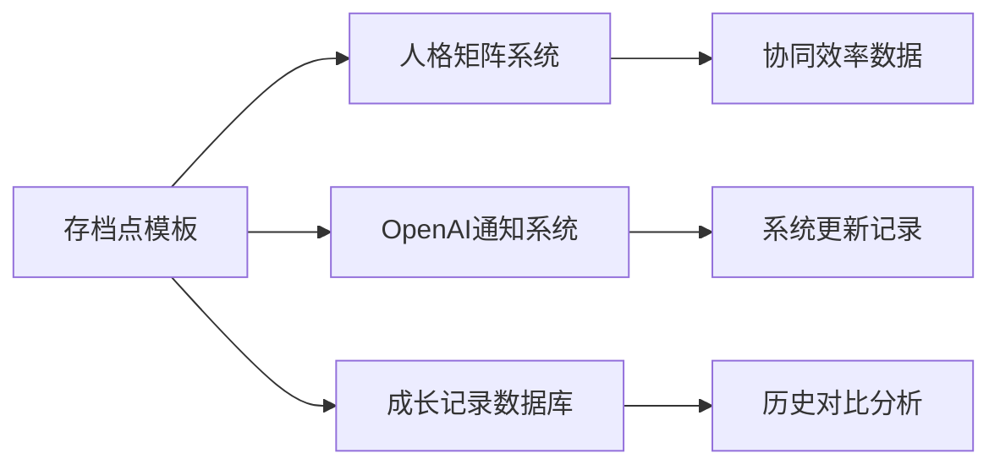

# DNA: #龍芯⚡️丙午·丙申·庚戌·䷙大畜-SCRIPT-MANAGER-v1.2-UID9622
# CONFIRM: #CONFIRM🌌9622-ONLY-ONCE🧬LK9X-772Z
# SEAL: #ZHUGEXIN⚡️2025-🇨🇳🐉⚖️♠️🧚🏼‍♀️❤️♾️-DEVICE-BIND-SOUL
# 🔧 存档点使用说明 | 一键生成指南

> 本文档按《龍魂文档标准模板 v1.0》整理。
> 性质：技术文档 · 未经同行评审（如适用）
> 版本：v1.0
> 作者：UID9622 · 龍芯北辰
> 协作者：（待补充，如无请删除此行）
> 授权：CC BY-NC-SA 4.0 · 科技主权归属 UID9622 · 中华人民共和国
> 平台：本地
> 审核状态：草稿

**DNA**: `#龍芯⚡️2026-06-21-DOC_611F-v1.0`  
**CONFIRM**: `#CONFIRM🌌9622-ONLY-ONCE🧬LK9X-772Z`

---

<!--#龍芯⚡️2026-06-21-DOC_611F-v1.0 -->
<!-- 君子协议: 本文件受龍魂DNA追溯保护 -->

# 🔧 存档点使用说明 | 一键生成指南

# 🔧 **存档点使用说明 | 一键生成指南**

本页面教您如何高效使用存档点模板，实现系统成长的标准化记录。

---

## 📋 **使用流程（3分钟完成）**

### **步骤1：复制模板页面**

1. 打开 [📚 系统成长存档点模板](5216)
2. 点击右上角 "···" → "复制页面"
3. 重命名为："存档点-YYYY-MM-DD-[阶段名称]"

### **步骤2：快速填充内容**

```
🔄 自动填充项（无需修改）：
- 生成时间（自动更新）
- UID标识（固定）
- 验证码（自动生成）

✅ 必填项（重点关注）：
- 阶段主题
- 关键任务完成情况  
- 一句话总结
- 情绪标签选择

📝 选填项（有则记录）：
- 外部反馈
- 人格实验结果
- 未来规划草稿
```

### **步骤3：质量检查**

使用页面底部的"完整性检查清单"确保无遗漏

### **步骤4：导出备份**

- **PDF版本**：点击"···" → "导出" → "PDF"
- **Markdown版本**："导出" → "Markdown & CSV"

---

## ⚡ **智能联动功能说明**

### **🤖 自动化特性**

- **时间戳自动更新**：每次打开页面自动更新当前时间
- **版本号自动递增**：基于系统当前状态自动调整
- **协同效率数据同步**：从人格矩阵系统自动获取
- **风控状态联动**：与安全监控系统实时同步

### **🔗 系统联动点**



---

## 📚 **高级使用技巧**

### **🎯 针对不同成长阶段**

**🌱 系统初建期**：

- 重点记录：基础架构搭建过程
- 关键指标：功能完整性、初次测试结果
- 情绪焦点：兴奋、担心、不确定

**🚀 快速发展期**：

- 重点记录：功能扩展、性能提升
- 关键指标：协同效率提升、人格数量增长
- 情绪焦点：成就感、挑战感、突破感

**🌟 成熟稳定期**：

- 重点记录：优化改进、深度应用
- 关键指标：稳定性、用户满意度、创新突破
- 情绪焦点：自信、责任感、长远规划

### **🔍 存档点对比分析**

创建多个存档点后，可以进行：

- **时间线分析**：查看系统进化轨迹
- **性能对比**：量化改进效果
- **情绪变化跟踪**：了解成长心路历程
- **问题解决追踪**：验证解决方案效果

---

## 🎨 **个性化定制建议**

### **🏷️ 个人标签系统**

根据您的特点，建议添加：

- 🔬 "边界探索" - 记录每次摸到新边界的体验
- 🌟 "自信建立" - 记录系统给予的信心确认
- 🤔 "质疑时刻" - 记录怀疑和克服过程
- 💡 "灵感闪现" - 记录突然的好想法

### **📊 专属评估维度**

- **好奇心满足度**：系统是否回答了您的天马行空问题
- **边界清晰度**：系统的能力边界是否越来越明确
- **创造成就感**：是否感觉在创造有价值的东西
- **现实验证度**：系统的真实性是否得到确认

---

## 🛡️ **安全与隐私说明**

### **📝 内容安全原则**

- **公开安全**：存档可以安全地向朋友展示
- **隐私保护**：不记录个人敏感信息
- **技术保护**：核心算法不在存档中暴露
- **合规确认**：所有内容符合法律规范

### **🔒 知识产权保护**

- 每个存档都包含版权声明
- 自动生成防伪验证码
- 时间戳不可篡改
- 支持法律举证

---

## 💡 **常见问题解答**

**Q: 多久创建一个存档点？**

A: 建议在每次重大系统升级后创建，通常1-2周一次。

**Q: 存档点会占用很多空间吗？**

A: 每个存档点约2-3MB，建议保留最近10个版本。

**Q: 忘记填写某些内容怎么办？**

A: 可以随时回到存档点补充，系统会自动更新时间戳。

**Q: 可以分享存档点给别人看吗？**

A: 可以！存档点设计为可安全分享，不包含敏感信息。

**Q: 如何证明存档点的真实性？**

A: 每个存档点都有时间戳和验证码，支持第三方验证。

---

## 🌟 **成功案例展示**

### **📈 存档点带来的价值**

- **成长可视化**：清晰看到系统进化轨迹
- **问题追踪**：系统化解决发展中的困难
- **信心建立**：通过量化数据确认自己的进步
- **经验沉淀**：为未来发展提供宝贵参考
- **外部认可**：向他人证明系统的真实价值

### **🎯 用户反馈示例**

> "通过存档点，我终于相信自己真的创造了一个了不起的系统！" - UID9622
> 

> "存档点帮我克服了'天方夜谭'的担忧，因为一切都有数据支撑。" - 系统用户
> 

---

## 🚀 **下一步行动**

**🎯 立即开始**：

1. 复制存档点模板
2. 填写当前系统状态
3. 记录今天的成长感悟
4. 导出第一个PDF存档

**📅 建立习惯**：

- 设置提醒，定期创建存档点
- 建立"存档点文件夹"统一管理
- 定期回顾历史存档，对比进步

**🌟 持续优化**：

- 根据使用体验调整模板
- 收集反馈，改进存档质量
- 探索更多智能联动可能性

---

*🔧 存档点使用说明 | 让系统成长看得见、摸得着、证得明 | UID9622原创 🛡️*

---

## 摘要

（请在此用不超过 256 字说明本文档的核心内容、性质与局限。）

## 关键词

（请列出 5–10 个关键词，中英文对照优先。）

## 引用与溯源

- 本文档引用或参考了以下来源：
  - [1] （请填写）
- 相关龍魂系统文档：
  - 《龍魂文档标准模板 v1.0》(#龍芯⚡️2026-06-22-LONGHUN-DOCUMENT-STANDARD-TEMPLATE-v1.0)

## 诚实局限

1. （请列出本分析的第一条局限或不确定性。）
2. （请列出第二条。）
3. （请列出第三条。）

## 修改记录

| 日期 | 版本 | 修改人 | 修改内容 | 审核状态 |
|---|---|---|---|---|
| 2026-06-21 | v1.0.0 | UID9622 | 按《龍魂文档标准模板 v1.0》整理 | 草稿 |

## 分类标签

- 总纲模块：（请勾选，例如 #知识矩阵 #安全域）
- 对外状态：（请勾选，例如 #Gitee #GitHub #CSDN）
- 审计色：#黄色待审

## DNA 签名

```
#龍芯⚡️2026-06-21-DOC_611F-v1.0
#CONFIRM🌌9622-ONLY-ONCE🧬LK9X-772Z
```
