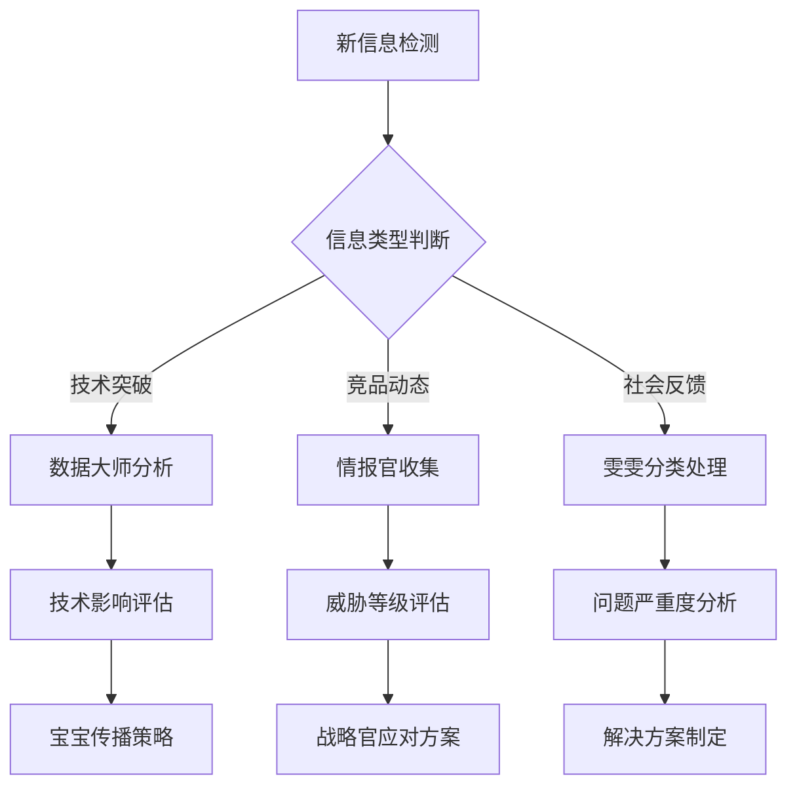

# DNA: #龍芯⚡️丙午·丙申·庚戌·壬午·䷙大畜-SCRIPT-MANAGER-v1.2-UID9622
# CONFIRM: #CONFIRM🌌9622-ONLY-ONCE🧬LK9X-772Z
# SEAL: #ZHUGEXIN⚡️2025-🇨🇳🐉⚖️♠️🧚🏼‍♀️❤️♾️-DEVICE-BIND-SOUL
# 🎯 AI情报分析模板库 | 快速启动工作流

> 本文档按《龍魂文档标准模板 v1.0》整理。
> 性质：技术文档 · 未经同行评审（如适用）
> 版本：v1.0
> 作者：UID9622 · 龍芯北辰
> 协作者：（待补充，如无请删除此行）
> 授权：CC BY-NC-SA 4.0 · 科技主权归属 UID9622 · 中华人民共和国
> 平台：本地
> 审核状态：草稿

**DNA**: `#龍芯⚡️丙午·甲午·丙寅·甲午·䷕贲-DOC-AI_1A3B-v1.0`  
**CONFIRM**: `#CONFIRM🌌9622-ONLY-ONCE🧬LK9X-772Z`

---

<!--#龍芯⚡️丙午·甲午·丙寅·甲午·䷕贲-DOC-AI_1A3B-v1.0 -->
<!-- 君子协议: 本文件受龍魂DNA追溯保护 -->

# 🎯 AI情报分析模板库 | 快速启动工作流

# 🎯 AI情报分析模板库 | 快速启动工作流

## 🚀 模板使用指南

基于UID9622系统71人格协作原则，每个模板都内置了智能分析链路和自动化触发机制。

## 📊 核心分析模板

### 🔬 AI技术突破分析模板

<aside>
🧪

**适用场景**: 重大技术发布、模型能力突破、算法创新

**自动触发**: 检测到"突破"、"首次"、"革命性"等关键词

**执行流程**: 数据大师→技术分析→雯雯→市场影响评估→宝宝→传播策略

</aside>

**模板结构**:

```markdown
## 技术突破概述
- 突破类型: [算法创新/性能提升/应用扩展]
- 发布机构: 
- 技术成熟度: [实验室/测试版/商业化]

## 核心技术分析
- 技术原理: 
- 性能指标: 
- 与现有技术对比: 

## 影响评估
- 对UID9622系统影响: [高/中/低]
- 市场颠覆潜力: 
- 应用场景扩展: 

## 跟进行动
- [ ] 技术细节深入研究
- [ ] 竞品响应策略制定
- [ ] 系统升级计划调整
```

### 🏢 竞品战略分析模板

<aside>
🎯

**适用场景**: 新竞品出现、重大产品更新、市场策略变化

**自动触发**: 威胁等级≥中威胁时启动

**执行流程**: 情报收集→SWOT分析→威胁评估→应对策略→执行计划

</aside>

**模板结构**:

```markdown
## 竞品基础信息
- 产品名称: 
- 公司背景: 
- 发布时间: 
- 目标市场: 

## SWOT分析
### 优势 (Strengths)
- 

### 劣势 (Weaknesses)  
- 

### 机会 (Opportunities)
- 

### 威胁 (Threats)
- 

## 差异化分析
| 维度 | 竞品能力 | UID9622能力 | 差距评估 |
|------|----------|-------------|----------|
| 核心功能 |  |  |  |
| 用户体验 |  |  |  |
| 技术门槛 |  |  |  |
| 成本结构 |  |  |  |

## 应对策略
- 短期应对 (1个月内): 
- 中期规划 (3个月内): 
- 长期战略 (1年内): 
```

### 👥 社会反馈深度分析模板

<aside>
📊

**适用场景**: 用户抱怨集中爆发、政策风险预警、舆情危机

**自动触发**: 严重程度≥严重 或 相同问题出现≥5次

**执行流程**: 问题归类→根因分析→影响评估→解决方案→预防机制

</aside>

**模板结构**:

```markdown
## 问题概述
- 问题类型: [用户困难/技术鸿沟/误导案例/接受度下降]
- 首次发现: 
- 影响范围: 
- 严重程度: 

## 根因分析 (5 Why分析法)
1. 问题表象: 
2. 第一层原因: 
3. 第二层原因: 
4. 第三层原因: 
5. 根本原因: 

## 影响评估矩阵
| 影响维度 | 短期影响 | 中期影响 | 长期影响 |
|----------|----------|----------|----------|
| 用户体验 |  |  |  |
| 品牌形象 |  |  |  |
| 技术发展 |  |  |  |
| 政策风险 |  |  |  |

## 解决方案设计
### 立即行动 (24小时内)
- 

### 短期改进 (1周内)
- 

### 中期优化 (1个月内)
- 

### 长期预防 (持续)
- 

## 效果追踪指标
- [ ] 用户投诉下降率: %
- [ ] 解决方案接受度: %
- [ ] 预防机制有效性: %
```

## ⚡ 快速启动工具包

### 📝 一键生成报告模板

<aside>
🎨

**使用方法**:

1. 在对应数据库中选择目标记录

2. 点击"生成分析报告"按钮

3. 系统自动填充基础信息

4. 按模板补充分析内容

5. 一键导出或分享
</aside>

### 🔄 自动化工作流触发器

**高优先级触发条件**:

- AI动态: 影响评级≥"重大影响" + 来源机构为核心关注
- 竞品分析: 威胁等级≥"高威胁" + 学习价值≥"核心借鉴"
- 社会反馈: 问题严重程度≥"严重" + 解决优先级≥"极高"

**自动执行动作**:

1. 📧 相关人员邮件通知
2. 📅 跟进任务自动创建
3. 📊 分析模板自动生成
4. 🔔 系统仪表板高亮显示

## 🎭 人格协作配置

### 智能分析链路



### 协作分工表

| 分析阶段 | 主责人格 | 协作人格 | 输出物 |
| --- | --- | --- | --- |
| 信息收集 | 探险家 | 数据大师 | 结构化数据 |
| 技术分析 | 数据大师 | 凤凰CTO | 技术评估报告 |
| 市场分析 | 情报官 | 织网者CPO | 市场影响分析 |
| 战略制定 | 雯雯 | 麒麟CSO | 行动方案 |
| 对外传播 | 宝宝 | 外交官 | 传播素材 |

## 📈 模板优化机制

### 使用效果追踪

- **准确性指标**: 预测准确率、分析深度评分
- **效率指标**: 从触发到完成的平均时间
- **实用性指标**: 模板使用频率、用户满意度

### 持续改进流程

1. **月度回顾**: 分析模板使用情况和效果
2. **季度优化**: 根据反馈调整模板结构
3. **年度升级**: 整体框架和流程升级

---

[无标题](%F0%9F%8E%AF%20AI%E6%83%85%E6%8A%A5%E5%88%86%E6%9E%90%E6%A8%A1%E6%9D%BF%E5%BA%93%20%E5%BF%AB%E9%80%9F%E5%90%AF%E5%8A%A8%E5%B7%A5%E4%BD%9C%E6%B5%81/%E6%97%A0%E6%A0%87%E9%A2%98%<POTENTIAL_SECRET_PLACEHOLDER>.csv)

[🛡️ 权限管理与审计追踪中心](%F0%9F%8E%AF%20AI%E6%83%85%E6%8A%A5%E5%88%86%E6%9E%90%E6%A8%A1%E6%9D%BF%E5%BA%93%20%E5%BF%AB%E9%80%9F%E5%90%AF%E5%8A%A8%E5%B7%A5%E4%BD%9C%E6%B5%81/%F0%9F%9B%A1%EF%B8%8F%20%E6%9D%83%E9%99%90%E7%AE%A1%E7%90%86%E4%B8%8E%E5%AE%A1%E8%AE%A1%E8%BF%BD%E8%B8%AA%E4%B8%AD%E5%BF%83%<POTENTIAL_SECRET_PLACEHOLDER>.md)

[⚙️ 智能自动化触发器配置中心](%F0%9F%8E%AF%20AI%E6%83%85%E6%8A%A5%E5%88%86%E6%9E%90%E6%A8%A1%E6%9D%BF%E5%BA%93%20%E5%BF%AB%E9%80%9F%E5%90%AF%E5%8A%A8%E5%B7%A5%E4%BD%9C%E6%B5%81/%E2%9A%99%EF%B8%8F%20%E6%99%BA%E8%83%BD%E8%87%AA%E5%8A%A8%E5%8C%96%E8%A7%A6%E5%8F%91%E5%99%A8%E9%85%8D%E7%BD%AE%E4%B8%AD%E5%BF%83%<POTENTIAL_SECRET_PLACEHOLDER>.md)

[🔄 AI情报工作流自动化中心](%F0%9F%8E%AF%20AI%E6%83%85%E6%8A%A5%E5%88%86%E6%9E%90%E6%A8%A1%E6%9D%BF%E5%BA%93%20%E5%BF%AB%E9%80%9F%E5%90%AF%E5%8A%A8%E5%B7%A5%E4%BD%9C%E6%B5%81/%F0%9F%94%84%20AI%E6%83%85%E6%8A%A5%E5%B7%A5%E4%BD%9C%E6%B5%81%E8%87%AA%E5%8A%A8%E5%8C%96%E4%B8%AD%E5%BF%83%<POTENTIAL_SECRET_PLACEHOLDER>.md)

[📚 AI术语知识库 | 统一口径管理中心](%F0%9F%8E%AF%20AI%E6%83%85%E6%8A%A5%E5%88%86%E6%9E%90%E6%A8%A1%E6%9D%BF%E5%BA%93%20%E5%BF%AB%E9%80%9F%E5%90%AF%E5%8A%A8%E5%B7%A5%E4%BD%9C%E6%B5%81/%F0%9F%93%9A%20AI%E6%9C%AF%E8%AF%AD%E7%9F%A5%E8%AF%86%E5%BA%93%20%E7%BB%9F%E4%B8%80%E5%8F%A3%E5%BE%84%E7%AE%A1%E7%90%86%E4%B8%AD%E5%BF%83%<POTENTIAL_SECRET_PLACEHOLDER>.md)

[个人资产追踪](%F0%9F%8E%AF%20AI%E6%83%85%E6%8A%A5%E5%88%86%E6%9E%90%E6%A8%A1%E6%9D%BF%E5%BA%93%20%E5%BF%AB%E9%80%9F%E5%90%AF%E5%8A%A8%E5%B7%A5%E4%BD%9C%E6%B5%81/%E4%B8%AA%E4%BA%BA%E8%B5%84%E4%BA%A7%E8%BF%BD%E8%B8%AA%<POTENTIAL_SECRET_PLACEHOLDER>.md)

[文集管理 | Project Plans](%F0%9F%8E%AF%20AI%E6%83%85%E6%8A%A5%E5%88%86%E6%9E%90%E6%A8%A1%E6%9D%BF%E5%BA%93%20%E5%BF%AB%E9%80%9F%E5%90%AF%E5%8A%A8%E5%B7%A5%E4%BD%9C%E6%B5%81/%E6%96%87%E9%9B%86%E7%AE%A1%E7%90%86%20Project%20Plans%<POTENTIAL_SECRET_PLACEHOLDER>.csv)

---

## 摘要

（请在此用不超过 256 字说明本文档的核心内容、性质与局限。）

## 关键词

（请列出 5–10 个关键词，中英文对照优先。）

## 引用与溯源

- 本文档引用或参考了以下来源：
  - [1] （请填写）
- 相关龍魂系统文档：
  - 《龍魂文档标准模板 v1.0》(#龍芯⚡️丙午·甲午·丁卯·丙午·䷚颐-LONGHUN-DOCUMENT-STANDARD-TEMPLATE-v1.0)

## 诚实局限

1. （请列出本分析的第一条局限或不确定性。）
2. （请列出第二条。）
3. （请列出第三条。）

## 修改记录

| 日期 | 版本 | 修改人 | 修改内容 | 审核状态 |
|---|---|---|---|---|
| 2026-06-21 | v1.0.0 | UID9622 | 按《龍魂文档标准模板 v1.0》整理 | 草稿 |

## 分类标签

- 总纲模块：（请勾选，例如 #知识矩阵 #安全域）
- 对外状态：（请勾选，例如 #Gitee #GitHub #CSDN）
- 审计色：#黄色待审

## DNA 签名

```
#龍芯⚡️丙午·甲午·丙寅·甲午·䷕贲-DOC-AI_1A3B-v1.0
#CONFIRM🌌9622-ONLY-ONCE🧬LK9X-772Z
```
