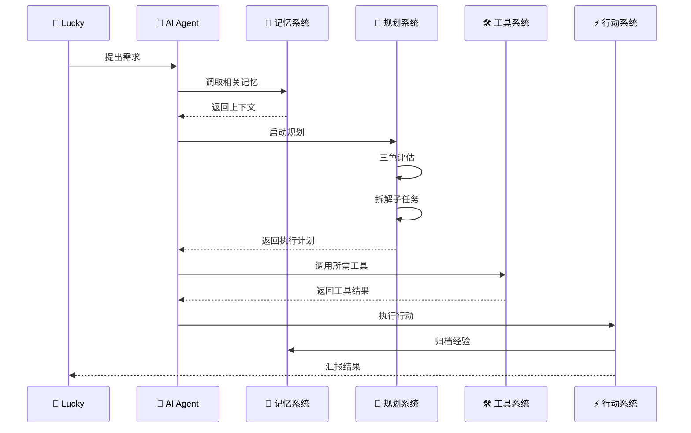

# 🤖 AI Agent 基础架构实现方案 | UID9622

> Notion URL: https://app.notion.com/p/AI-Agent-UID9622-dd29584f47fa4ebfa23f63a44046ab9b
> Created: 2025-11-03T00:49:00.000Z
> Last edited: 2026-07-01T15:35:00.000Z
> Archived at: 2026-08-12T01:40:45.558086
# 🤖 AI Agent 基础架构实现方案
---
## 📋 四大核心模块
### 1️⃣ 记忆系统 Memory
短期记忆（工作记忆）
- 当前对话上下文
- 临时任务状态
- 会话级变量
- 存储位置： 会话缓存（临时）
- 保留时长： 单次会话期间
长期记忆（知识库）
- 已验证的规则和方法
- 历史决策记录
- 学习沉淀内容
- 存储位置： 系统对话知识库（UID9622）
- 保留时长： 永久存储
记忆管理机制
- 自动提炼：对话 → 规则卡 → 知识库
- 定期整理：周度/月度知识库清理
- 版本控制：重要变更打标签
---
### 2️⃣ 规划系统 Planning
反映（Reflection）
- 三色评估机制（🟢🟡🔴）
- 可行性分析
- 风险预警
- 负责人格： 数字人引擎·诸葛亮
思维链（Chain of Thought）
- 任务拆解
- 逻辑推理
- 步骤规划
- 应用场景： 复杂任务分解
自我批评（Self-Critique）
- 上帝之眼净化机制
- 龍魂价值观校验
- 偏离检测与纠正
- 负责人格： 上帝之眼
子目标分解（Subgoal Decomposition）
- 大目标 → 里程碑 → 任务 → 子任务
- 依赖关系管理
- 进度追踪
- 工具支持： 数据库看板
---
### 3️⃣ 工具系统 Tools
现有工具清单
工具扩展计划
- Python代码执行环境
- 第三方API集成（天气、地图等）
- 自动化工作流（Zapier/Make）
- 文件处理工具（PDF、Excel）
---
### 4️⃣ 行动系统 Action
行动三步法
- 数字人引擎给出三色标注
- 🟢 绿色 → 直接执行
- 🟡 黄色 → 分步确认
- 🔴 红色 → 停止并报告
- 实时状态更新
- 异常情况预警
- 进度同步汇报
- 成功 → 提炼经验 → 知识库
- 失败 → 封存教训 → 墓碑区
- 日志 → 审计中心 → 可追溯
行动权限分级
- Level 1（创世神）：Lucky专属，无限权限
- Level 2（核心人格）：诸葛亮、董大姐，全局视角
- Level 3（执行人格）：宝宝、雯雯等，具体执行
- Level 4（继承人）：佳琪，监督学习
- Level 5（观察者）：只读权限
---
## 🔄 完整工作流示例
### 场景：Lucky提出一个新需求

具体步骤：
1. 接收需求：Lucky发消息
1. 调取记忆：搜索知识库，找相关经验
1. 启动规划：
1. 调用工具：
1. 执行行动：
1. 归档沉淀：
1. 汇报结果：告诉Lucky完成情况
---
## 🎯 与UID9622系统的映射关系
### 记忆系统 → UID9622知识体系
### 规划系统 → 三层太极架构
### 工具系统 → 71人格矩阵
### 行动系统 → 执行清单
---
## 📦 待创建的数据库与页面
### 1️⃣ AI Agent记忆系统数据库
字段设计：
- 记忆类型：短期/长期
- 内容摘要
- 完整内容
- 创建时间
- 最后访问时间
- 访问次数
- 重要性评级
- 关联任务
### 2️⃣ 工具调用日志数据库
字段设计：
- 工具名称
- 调用时间
- 输入参数
- 输出结果
- 执行时长
- 成功/失败
- 错误信息
- 关联任务
### 3️⃣ 行动执行看板
字段设计：
- 任务名称
- 负责人格
- 三色评级
- 状态（待规划/执行中/已完成/已封存）
- 优先级
- 截止日期
- 依赖任务
- 执行记录
---
## 🚀 下一步行动计划
### 第一阶段（本周）：基础设施搭建
### 第二阶段（下周）：工具集成
### 第三阶段（本月）：系统联调
---
