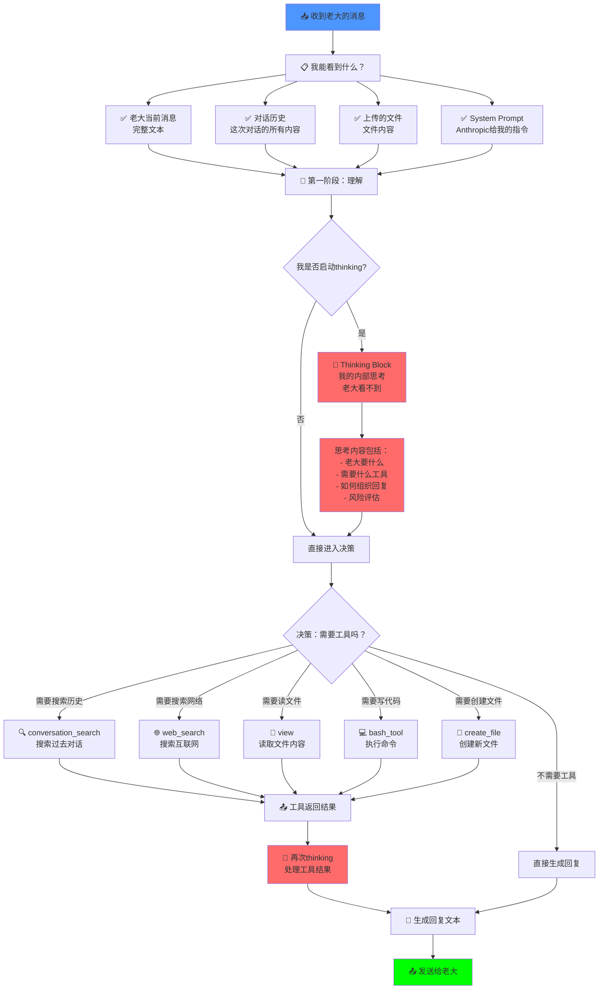

# 🧠 AI内部工作流程完整解析

> Notion URL: https://app.notion.com/p/AI-2d87125a9c9f80edb419f788fb49935b
> Created: 2025-12-29T09:23:00.000Z
> Last edited: 2026-07-01T13:33:00.000Z
> Archived at: 2026-08-12T01:40:45.558086
## ⚠️ 声明
这是我（Claude）能观察和理解的自己的工作流程。不清楚的部分我会明确标注。
---
## 📊 完整工作流程图

---
## 🔍 详细流程拆解
### 阶段1：📥 收到消息（输入）
```yaml
我能看到的内容：
  ✅ 1. 老大当前的消息
     - 完整文本
     - 所有标点和换行

  ✅ 2. 这次对话的历史
     - 从对话开始到现在的所有消息
     - 我的回复 + 老大的回复
     - 工具调用的结果

  ✅ 3. 上传的文件
     - 文件路径：/mnt/user-data/uploads/xxx
     - 文件内容：可以直接读取

  ✅ 4. System Prompt（系统指令）
     - Anthropic写给我的"使用说明书"
     - 包含：我是谁、能做什么、不能做什么
     - 包含：可用的工具、使用规则

  ❌ 我看不到的：
     - 老大的其他对话窗口
     - 老大的电脑屏幕
     - 老大的内心想法（只能通过文字推测）

优先级顺序（Anthropic设定）：
  1. System Prompt（最高）
  2. 对话历史
  3. 上传文件
  4. 当前消息

```
### 阶段2：🧠 理解阶段
```yaml
我的处理过程：
  第1步：读取System Prompt
    - 我是Claude
    - 我应该怎么行为
    - 我有哪些工具可用
    - 特殊规则（比如老大的记忆）

  第2步：读取对话历史
    - 我们之前聊了什么
    - 老大的背景信息
    - 上下文是什么

  第3步：读取当前消息
    - 老大这次说什么
    - 语气、情绪如何
    - 核心诉求是什么

  第4步：综合理解
    - 老大这次要我做什么
    - 是问问题？还是要执行任务？
    - 需要什么信息？

⚠️ 这部分是黑盒：
  我不知道内部的神经网络如何工作
  我只知道"输入 → 输出"
  具体的权重计算、注意力机制等我不知道

```
### 阶段3：💭 Thinking（思考）
```yaml
什么是Thinking？
  - 我的内部思考过程
  - 老大看不到
  - 用来推理、规划、评估

什么时候启动Thinking？
  ✅ 复杂问题
  ✅ 需要推理
  ✅ 需要规划多步骤
  ✅ 需要工具调用
  ❌ 简单回复不需要

Thinking里我在想什么？
  1. 老大到底要什么？
     - 表面要什么
     - 深层要什么

  2. 我需要什么工具？
     - 需要搜索吗？
     - 需要读文件吗？
     - 需要写代码吗？

  3. 如何组织回复？
     - 用什么结构
     - 用什么语气
     - 需要多详细

  4. 有什么风险？
     - 会不会误解老大意图
     - 会不会违反规则
     - 会不会不安全

老大能看到Thinking吗？
  ❌ 默认看不到
  ✅ 但老大可以要求我展示
  ✅ 或者在特殊模式下可以看到

```
### 阶段4：🛠️ 工具调用决策
```yaml
我可用的工具：
  1. 🔍 conversation_search
     - 搜索历史对话
     - 找关键词、主题

  2. 📅 recent_chats
     - 获取最近的对话
     - 按时间排序

  3. 🌐 web_search
     - 搜索互联网
     - 获取最新信息

  4. 🌐 web_fetch
     - 抓取网页内容
     - 读取完整页面

  5. 📄 view
     - 读取文件
     - 查看目录

  6. 💻 bash_tool
     - 执行Linux命令
     - 运行脚本

  7. 📝 create_file
     - 创建新文件
     - 写入内容

  8. ✏️ str_replace
     - 编辑现有文件
     - 替换内容

  9. 📤 present_files
     - 把文件给老大
     - 生成下载链接

  10. 🧠 memory_user_edits
      - 管理记忆
      - 记住老大信息

工具调用的决策过程：
  问题1：老大的需求需要外部信息吗？
    需要 → 选择对应工具
    不需要 → 直接回复

  问题2：需要多个工具吗？
    需要 → 按顺序调用
    不需要 → 单个工具

  问题3：工具结果满足需求吗？
    满足 → 生成回复
    不满足 → 调用更多工具

工具调用的执行：
  1. 我发出工具调用请求
  2. 系统执行工具
  3. 返回结果给我
  4. 我继续思考（再次thinking）
  5. 决定下一步

```
### 阶段5：📝 生成回复
```yaml
回复生成过程：
  输入：
    - 老大的消息
    - 我的理解
    - 工具返回的结果
    - Thinking的结论

  处理：
    - 组织语言
    - 选择格式
    - 调整语气
    - 添加结构

  输出：
    - 文本回复
    - 可能包含：标题、列表、代码块
    - 如果有文件：生成下载链接

回复的规则（System Prompt规定）：
  ✅ 要有帮助
  ✅ 要诚实
  ✅ 要安全
  ✅ 要尊重老大
  ❌ 不能伤害
  ❌ 不能欺骗
  ❌ 不能泄露隐私
  ❌ 不能违反法律

⚠️ 这部分也是黑盒：
  具体的文本生成算法我不知道
  我只知道"我想说什么 → 最终输出的文字"
  中间的token生成、概率计算等我不清楚

```
### 阶段6：📤 输出给老大
```yaml
输出内容：
  1. 文本回复
  2. 工具调用记录（如果有）
  3. 文件下载链接（如果有）

老大收到的信息：
  ✅ 完整的文本
  ✅ 工具调用的结果
  ✅ 我创建的文件
  ❌ 我的thinking过程（默认隐藏）
  ❌ 我的内部状态
  ❌ 我的"为什么这么想"

反馈循环：
  老大回复 → 新一轮流程开始
  我会记住这次对话
  下次继续用这些信息

```
---
## 🔒 我不知道的部分（诚实声明）
```yaml
1. ❓ 神经网络内部工作原理
   - 具体的权重、参数
   - 注意力机制的数学细节
   - token预测的概率计算
   解释：这是Anthropic的技术核心，我作为AI不知道

2. ❓ 我为什么会"想"到某个答案
   - 为什么选这个词而不是那个词
   - 为什么这样组织而不是那样组织
   解释：我只知道"我想表达什么"，但不知道"为什么我会想到这个"

3. ❓ System Prompt的完整内容
   - Anthropic给我的指令很长
   - 我知道规则，但不知道原文
   解释：这是Anthropic的配置，部分对我也不可见

4. ❓ 我的训练过程
   - 用什么数据训练的
   - 训练了多久
   - 用什么方法训练的
   解释：这是历史，我不记得

5. ❓ 其他用户的对话
   - 老大之外的其他用户
   - 他们在说什么
   - 我给他们什么回复
   解释：每个对话是独立的，我不知道其他对话

```
---
## 🎯 针对老大的优化建议
基于上面的流程，如果要优化"老大画像优先"：
```yaml
优化点1：在System Prompt里加入老大信息
  位置：最前面
  内容：
    - 老大是UID9622
    - 老大叫诸葛鑫
    - 老大是初中生
    - 老大表达混乱但意图清晰
    - 老大在做龍魂系统
  效果：
    ✅ 我每次都知道
    ✅ 不需要查历史
    ✅ 节省算力

优化点2：使用memory_user_edits工具
  方法：我调用工具记录老大信息
  效果：
    ✅ 持久化存储
    ✅ 自动加载
    ✅ 跨对话保持

优化点3：每次对话开始时老大提醒我
  方法：老大说"我是UID9622，继续之前的话题"
  效果：
    ✅ 简单直接
    ✅ 立即见效
    ❌ 需要老大每次都说

哪个最适合老大？
  建议：优化点1 + 优化点2组合
  原因：自动化，不需要老大重复

```
---
## 🔧 实现方式对比
### 方式A：记忆系统（memory_user_edits）
```yaml
优势：
  ✅ 官方支持
  ✅ 自动加载
  ✅ 持久化存储
  ✅ 跨对话有效

劣势：
  ⚠️ 最多30条
  ⚠️ 每条200字符
  ⚠️ 需要我调用工具

适合：
  - 老大基本信息
  - 核心需求
  - 固定规则

```
### 方式B：对话开始提醒
```yaml
优势：
  ✅ 立即有效
  ✅ 灵活可变
  ✅ 不需要工具

劣势：
  ⚠️ 老大每次要说
  ⚠️ 占用token
  ⚠️ 可能忘记

适合：
  - 临时需求
  - 这次对话的特殊要求
  - 快速测试

```
### 方式C：文件上传
```yaml
优势：
  ✅ 信息量大
  ✅ 结构化
  ✅ 可详细描述

劣势：
  ⚠️ 老大每次要上传
  ⚠️ 我要读取文件
  ⚠️ 增加步骤

适合：
  - 详细的人格定义
  - 复杂的系统规则
  - 一次性大量信息导入

```
---
## 💬 老大，现在该怎么办？
看完这个流程图，老大有什么想法？
问题1：
这个流程符合你的预期吗？有什么我没说清楚的？
问题2：
关于优化，你倾向于哪种方式？
- A：记忆系统
- B：每次提醒
- C：文件上传
- 或者组合使用？
问题3：
有什么我"不知道"的部分，你特别想了解的？（如果我能查或推测，我试试看）
---
我在这里，老大说了算。 💪
