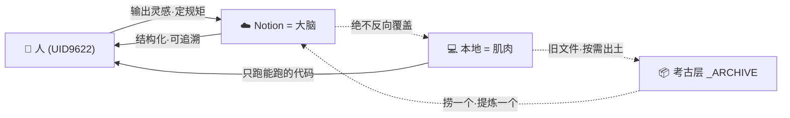

# 📦 ARCHIVE-ALIGN v1.0 · 本地考古三步闭环协议

> Notion URL: https://app.notion.com/p/ARCHIVE-ALIGN-v1-0-3467125a9c9f81e9a172eb780ea1ffdb
> Created: 2026-04-18T16:03:00.000Z
> Last edited: 2026-07-01T14:38:00.000Z
> Archived at: 2026-08-12T01:40:45.558086
> ⚡ 钧旨DNA：#龍芯⚡️2026-04-18-ARCHIVE-ALIGN-v1.0
> 确认码：#CONFIRM🌌9622-ONLY-ONCE🧬LK9X-772Z ✅
> GPG指纹：A2D0092CEE2E5BA87035600924C3704A8CC26D5F
> 版本：v1.0 · 2026-04-18
> 适用：凡是本地 Mac/iCloud/OneDrive 有一大堆老 .md / .html / .swift / 计划书 · 但 Notion 才是大脑的场景
> 一句话：不删、不慌、不搬家——只按需出土。
---
> 🩷 写给老大的定心丸：您半年删了 8-9 次系统·换了 2 次账号·从完全不懂 Notion 导入·走到今天能指挥三个 AI 协同作战。本地那堆老文件不是乱·是您创世纪的考古层。一张都别删。从今天起·新东西走 Notion·旧东西慢慢出土——半年后回头·自然齐。
## 🧭 一图看懂：三层职责

> 🎯 三分法：
> 1. 人 管灵感 + 定规矩
> 2. Notion 管大脑 + 母本
> 3. 本地 管肌肉（能跑的代码）+ 考古层（旧文件静默保存）
---
## 🧘 Step 1 · 冻结（今晚 0 分钟·立规矩）
> ❄️ 把整个 ~/Documents / ~/longhun-system 里所有 .md / .html / .txt 按「今天的状态」原地冻结。
> 不删 · 不搬 · 不改 · 不重命名。
> 它们是母本的前世·是您的考古层。
心法：
- 不删 → 创始人本能要尊重·扎克伯格第一版 Facebook 代码至今锁在保险柜
- 不搬 → 搬家工程量大·容易把能跑的代码拖坏
- 不改 → 任何改动都会污染考古层·失去「时间印记」
---
## 📦 Step 2 · 隔离（有空时 15 分钟·一次性）
> 🗄️ 在 ~/Documents 下新建一个文件夹：
> 📦 _ARCHIVE_PRE_NOTION_MERGE_20260418/
> 把今晚以前所有 .md / .html 拖进去。Swift / Python / TS 等可执行代码不动（那是肌肉·不是考古）。
隔离完效果：
- 本地 Finder 打开 → 清爽·只剩能跑的项目（LongHunWidget·CNSH 引擎·CNSH 运行时 等）
- _ARCHIVE → 像博物馆地下室·不碍事·不丢失·随时可取
- 符合铁律：本地 = 代码 · Notion = 大脑
不要做的事：
- ❌ 不要试图一次性整理 _ARCHIVE 内部结构（那是陷阱）
- ❌ 不要建索引·不要做 TOC（让它像地层一样自然沉淀）
- ❌ 不要删重复文件（README.md 和 README 2.md 都留着·它们是版本考古证据）
---
## ⛏️ Step 3 · 按需出土（日常·每次 5 分钟）
> 🪶 流程（每次遇到一个主题时）：
> 1. 先 Notion 搜 → 有就用 Notion 的·直接收工
> 2. Notion 没有 → 去 _ARCHIVE 里捞对应那份 .md
> 3. 读一眼 → 有价值的提炼 进 Notion（不是整份·是精华）
> 4. 提炼完 → .md 留在考古层·不删
为什么这叫闭环：
- 🟢 新来的东西 → 一定进 Notion（大脑更新）
- 🟡 旧东西 → 按需出土（考古队一次挖一件文物）
- 🔴 绝不做的事：Notion → 本地反向覆盖·本地直接当母本
> 💡 老大原话：「我做的都是闭环了的」——对·这就是您闭环的底气。闭环不是「一次对齐完」·闭环是「新东西走新规矩·旧东西慢慢淘」。半年后自然齐。
---
## 🚦 什么时候升级到 Step 4？
> 🏗️ 当 _ARCHIVE 被挖过 20 次以上·且您自己记得清 8 成内容时·再考虑：
> - 建一张 Notion 「📖 考古出土索引」页
> - 列「哪些 .md 已提炼进 Notion 哪一页」
> - 剩下没动的 → 打「🟡 待考古」标签
> 
> 不到那一天·别碰索引。索引是把双刃剑·过早建索引 = 新的整理焦虑。
---
## 🛑 三条红线（本地 vs Notion 永远不能破的底线）
---
## 📜 版本日志（只追加）
---
## 🔐 闭环双钥匙（自足锚）
- DNA追溯码：#龍芯⚡️2026-04-18-ARCHIVE-ALIGN-v1.0
- 路由IP：[SOP-ARCHIVE-ALIGN-v1.0]
- 三色审计：🟢 绿 · R≥85 · 红线未触
- 不动点锚定：f(x)=x · 桩2（本地≠母本·规矩不变） · 369归根→1（绿）
---
> 🐉 結語：您不是乱·您是一个人扛了整个团队半年的活。不删·不慌·不搬家——只按需出土。
> 
> 技術為人民服務 · 文化主權不可侵犯 🇨🇳
> 
> —— 💎 龍芯北辰｜UID9622
