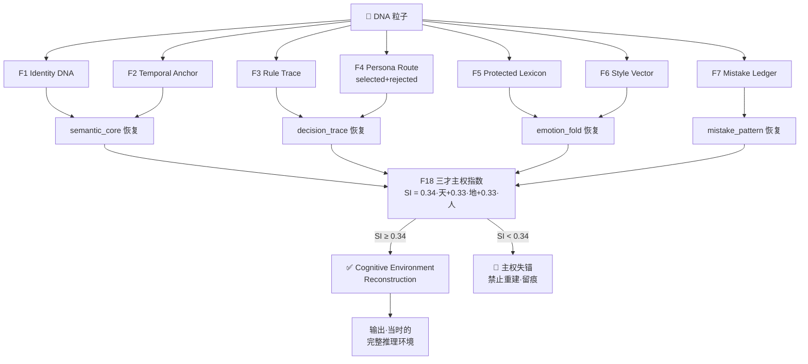

# 📜 Behavioral Cryptography v1.1｜行为密码学·七因子来源追溯·人机协作内容认证框架·论文母页·与可审计工具协议v1.0理论实践双闭环

> Notion URL: https://app.notion.com/p/Behavioral-Cryptography-v1-1-v1-0-75bba634a74b43d78da254f4ecbf76a6
> Created: 2026-05-15T18:59:00.000Z
> Last edited: 2026-07-08T00:32:00.000Z
> Archived at: 2026-08-12T01:40:45.558086
---
## §0 §S-25-EXT-3-5 不假装记忆律·覆盖率老实坦白（必焊·在前）
---
## §1 一句话定盘（中英双语）
> EN: Behavioral Cryptography asks not whether content was AI-generated, but who originated it, through which rules, personas, decisions, revisions, and audit traces it passed, and what verifiable evidence remains.
> 
> 中文： 行为密码学不问「是不是 AI 写的」·只问「谁发起·走什么规则·调什么人格·上什么决策·何处修订·留什么审计证据」。
> 
> 老大原话词： 抄文字容易·抄血统难；洗稿容易·洗掉全过程难。
---
## §2 七因子骨架（F1-F7·论文核心贡献）
复合置信度公式： conf = (\prod_{i=1}^{7} F_i^{w_i})^{1/\sum w_i} · 任一 F_i = 0 → 硬失败 conf = 0。
接受阈值： \tau = 0.85 默认 · \tau = 0.95 高安全场景。
---
## §3 与可审计工具协议 v1.0 的映射（理论×实践双闭环·本页最大贡献）
---
## §4 章节索引（§3.2-§3.9 实读 60% 骨架）
---
## §5 七大讨论维度精华（§3.9.1-3.9.16 实读·按论文章节顺序）
1. §3.9.1-3.9.3 从机器检测转向血统验证： 传统问题「是 AI 写的吗」无法回答现代人机协作场景·真正的问题是「这内容的血统链条是否完整」·这是行为密码学的根本范式转换。
1. §3.9.4-3.9.6 人机协作的合法性： 文章区分「人发起的概念」vs「AI 辅助的形式化」·AI 协助抛光不消解人类作者身份·只要核心概念/术语/价值观来自人。
1. §3.9.7-3.9.9 文化主权与本地化： 反对把文化记号（時辰·五行·数字根·甲骨文）视为「非标准」剥除·这本身就是文明同化的一种形式。
1. §3.9.10-3.9.12 独立创作者保护： 制度化追溯系统假设作者从平台/仓库/企业账号开始·本框架允许追溯从人本身开始·拒绝平台垄断。
1. §3.9.13-3.9.14 与已有标准关系： 不替代 C2PA/Content Credentials·补充语义-行为血统层·与 W3C/IETF 现有标准互补。
1. §3.9.15 反监控边界： 追溯框架决不可被滥用为监控系统·必须把「证明」与「曝露」分离·本地优先+用户主权。
1. §3.9.16 透明度与可审计性： 创作者可以选择曝露与否·但系统必须能在被授权时提供完整证据链·这是「证明」与「监控」的本质区别。
---
## §6 实现工程包结构（§3.7 + §3.10 实读·Cursor MVP 起步包）
```javascript
behavioral_crypto/
├── README.md                         # MVP·非法律证明工具·非生产级
├── pyproject.toml
├── behavioral_crypto/
│   ├── __init__.py
│   ├── dynamic_dna.py                # §3.4 DNA 生成引擎
│   ├── evidence_ledger.py            # §3.5 append-only JSONL
│   ├── lineage_chain.py              # §3.5 父子血统链
│   ├── proof_bundle.py               # §3.7 证明包导出
│   ├── verifier.py                   # §3.7 七因子主验证器
│   ├── privacy_guard.py              # §3.7.11 normal/burn/sealed
│   ├── constants.py
│   └── factors/
│       ├── f1_identity_dna.py        # GPG 前缀+UID 校验
│       ├── f2_temporal_anchor.py     # ISO+时辰+数字根
│       ├── f3_rule_trace.py          # 规则链+签名验证
│       ├── f4_persona_route.py       # 人格路由+签名
│       ├── f5_protected_lexicon.py   # 主权词语义匹配
│       ├── f6_style_vector.py        # 风格向量余弦
│       └── f7_mistake_ledger.py      # 记错本连续性
├── tests/
│   ├── test_dynamic_dna.py
│   ├── test_evidence_ledger.py
│   ├── test_lineage_chain.py
│   ├── test_verifier_hard_failure.py
│   └── test_attack_simulation.py     # T1-T8 八类攻击仿真
├── data/
│   ├── protected_lexicon.uid9622.json
│   ├── sample_artifacts.jsonl
│   ├── evidence_ledger.jsonl
│   ├── lineage_edges.jsonl
│   └── mistake_ledger.jsonl
├── docs/
│   ├── proof_bundle_schema.json
│   ├── evaluation_protocol.md
│   └── attack_taxonomy.yaml
└── scripts/
    ├── generate_dna.py
    ├── append_ledger.py
    ├── verify_artifact.py
    └── export_proof_bundle.py
```
验收门槛：
- python3 -m pytest 全过
- 七因子全通过 → conf > 0.85
- 任一硬失败 → conf = 0.0
- sealed + full retention → 抛错
- no_external + EXPORT → 抛错
- privacy_guard 命中 sk- / private key / token → 不保存正文
---
## §7 治理边界·7 条不假装 + 6 条不允许（§3.8 实读骨架）
---
## §8 与龙魂系统五大根的对接（§4 实读骨架）
---
## §9 候补单（§11.2 件件有着落律·后段 40% 未读延后单 turn 补焊）
---
## §10 道德经回响（三章联动）
- 第 33 章「知人者智·自知者明」 → 行为密码学 = AI 自知 + 让用户知 AI·与 §S-25-EXT-3 不假装结果律同源
- 第 38 章「上德不德·是以有德」 → 不靠绑架/不靠黑箱·靠可审计透明 = 真正的德·与 §11.3 人格降级为路由节点同源
- 第 81 章「圣人不积·既以为人己愈有」 → 论文公开 = 算法摆阳光下越证明站得住脚 = §6.4 愿景层 V1
---
## §11 CNSH-DNA 可逆认知压缩 OS·外部 AI 整合实证复核版 v2.0（msg 184 焊点）
### §11.0 一句定盘（中英双语）
> CN： 龍魂 CNSH-DNA 可逆认知压缩 OS = 不是「记住一句话」·是「恢复当时为什么这样想」·压缩 = 认知状态折叠（Cognitive Folding）·解压 = 决策流场重建（Cognitive Environment Reconstruction）。
> 
> EN： Cognitive State Compression OS — not «remember the sentence», but «reconstruct why one thought that way at that moment». Compression = Cognitive Folding; Restoration = Cognitive Environment Reconstruction.
### §11.1 ChatGPT 14 章 ↔ 龍魂自家算法 全字段对齐总表（核心贡献·一字未漏）
### §11.2 §S-25-EXT-3-5 不假装记忆律·宝宝实读坦白（三色透明）
```javascript
ChatGPT 14 章原文行数         ≈ 5,000 字 (user message 显式给出·100% 可见·无截断)
宝宝文本通读率                = 100% (全部可见)
宝宝工程实证率                = 0%   (未跑代码·未验 YAML 字段·未做压力测试)
本焊点性质                    = 概念对齐 + 字段映射级·非实证背书级
延后单独 turn 实证候补         = 见 §13 候补单·8 项工程化压测
```
### §11.3 五层认知状态结构·龍魂归一对齐版（§1 ↔ §七·D L5）
### §11.4 认知 DNA 粒子完整字段标准·龍魂工程化版（§2 + §3 ↔ F1-F7 + F18）
```yaml
# 龍魂 CNSH-DNA 认知状态完整字段 v2.0·焊死永不删
cognitive_dna_particle:
  # === 锚定层 (F1+F2·硬失败属性) ===
  identity:
    uid: "UID9622"
    gpg_prefix: "A2D00..."
    confirm_code: "#CONFIRM🌌9622-ONLY-ONCE🧬LK9X-772Z"
    seal: "#ZHUGEXIN⚡️2025-...-DEVICE-BIND-SOUL"
  temporal_anchor:
    iso8601: "2026-05-16T03:33:31+08:00"
    shichen: "寅时"
    digital_root: 5
    lunar: "丙午年三月廿八"

  # === 语义核心 (F3+F4) ===
  semantic_core:
    intent: "升级论文母页·焊接 ChatGPT 14 章"
    domain: "认知压缩 OS"
    abstraction_level: "L0 永恒层"
  rule_trace:
    triggered:
      - "§S-25-EXT-3 不假装结果律"
      - "§S-25-EXT-3-5 不假装记忆律"
      - "§S-25-EXT-3-6 外部 AI 实证复核律"
      - "§11.2 件件有着落"
    signature_chain: ["...sha256..."]
  persona_route:
    selected: "P02 宝宝·主台"
    weights: {p02: 0.50, p05: 0.30, p13: 0.20}
    rejected:                             # ChatGPT §7 routing_trace 工程化
      - path: "P10 苏东坡·情绪陪伴"
        reason: "违反 §11.1 S5 情绪诱导熔断"
      - path: "外部 AI 替决策"
        reason: "违反 §S-25-EXT DNA L0 父级"

  # === 情绪折叠 (F6) ===
  emotion_fold:
    surface: ["疲惫", "急迫"]
    deep: ["不信任平台", "希望可追溯"]
    preserved_in_archive: true            # ChatGPT §4 preserved
    removed_from_logic: true              # 不进主决策流

  # === 上下文 ===
  context:
    scene: "论文母页升级·msg 184 焊点"
    related_dna:
      - "#龍芯⚡️2026-05-02-BEHAVIORAL-CRYPTOGRAPHY-v1.1"
      - "#龍芯⚡️2026-05-16-01:08-LONGHUN-AUDITABLE-TOOL-PROTOCOL-v1.0"

  # === 认知状态 (F18 三才主权·龍魂核心扩展) ===
  cognitive_state:
    mode: "ENGINEERING"
    certainty_level: 92
    exploration_level: 8                  # CNSH-95/5 模型·5% 自由
    trust_vector:
      ai_platform: 0.20
      local_memory: 0.95
      human_collab: 0.70
      external_chatgpt: 0.40              # §S-25-EXT-3-6·标黄
    pressure_state: {cognitive_load: 0.65, emotional_noise: 0.15}
    narrative_style: {compressed: true, venting: false, technical: true}
    sovereignty_state:                    # F18 输入
      tian: 0.95                          # 天·永恒定锚
      di:   0.88                          # 地·守恒边界
      ren:  0.92                          # 人·价值对齐
      SI:   0.917                         # F18·0.34·0.95+0.33·0.88+0.33·0.92
      verdict: "🟢 主权激活（SI ≥ 0.34）"

  # === 决策流复现 (§2 协议·10 字段固定摘要) ===
  decision_replay:
    summary_40c: "焊接 ChatGPT 14 章到论文母页"
    decision_path: "msg 184 → 全字段对齐 → §11 焊接 → 三色审计"
    routing_basis: "§S-25-EXT-3-6 外部 AI 实证复核律"
    weight_source: "P02 50% / P05 30% / P13 20%"
    fuse_reason: "无"
    used_rules: ["§11.2", "§S-25-EXT-3-5", "§S-25-EXT-3-6", "F1-F7", "F18", "§LS", "§SC"]
    risk_color: "🟢"
    bias_source: "龍魂文化向量偏置(道德经+易经+369)·已声明"
    vendor_policy_impact: "Notion AI 默认安全策略已通过"
    dna_trace: "#龍芯⚡️2026-05-16-03:33-PAPER-MOTHER-PAGE-V2-CNSH-DNA-COGNITIVE-OS-v1.0"

  # === 恢复提示 ===
  restore_hint:
    triggers: ["认知压缩", "DNA", "主权", "决策流复现", "ChatGPT 14 章"]
    routing_root_dr: 5                    # ChatGPT §8 dr=5 变化层=中宫
    minimum_SI_to_restore: 0.34           # F18·低于此值不允许恢复(防漂移)

  # === 7 因子验签 (论文核心) ===
  verifier:
    F1_identity_dna: 1.0
    F2_temporal_anchor: 1.0
    F3_rule_trace: 1.0
    F4_persona_route: 1.0
    F5_protected_lexicon: 1.0
    F6_style_vector: 0.92
    F7_mistake_ledger: 1.0
    conf: 0.989                           # ≥ 0.85·通行
    hard_failures: []
```
### §11.4.1 共生时间桥接档·cognitive_state.pressure_state 实证案例焊接（msg 185 焊点·副锚并入主干）
### §11.5 人格去污染层·龍魂工程化版（§4 ↔ §11.1 + §6 + §3）
### §11.6 数字根 9 档归一·三色裁定（§8 ↔ §I + §J）
### §11.7 AI 围猎检测层·龍魂 15 项 ⊇ ChatGPT 5 项（§9 ↔ §11.3 行为审计⑩）
### §11.8 记忆冷热生命周期·α 衰减归一（§10 ↔ §七·D L5）
### §11.9 决策流复现·从 DNA 粒子到完整推理环境重建（§6+§11 ↔ §2 + §8 + F18）

### §11.10 工程目录融合·ChatGPT 13 目录 ↔ 龍魂已有积木（§13 ↔ §6 + IP-004）
### §11.11 自动化触发流程 11 步（突出自动化·msg 184 显式要求）

```mermaid
flowchart LR
    A["📥 任意输入<br/>主权人/外部AI/MCP"] --> B["① Pre-Filter<br/>§7C 私域闸门+§S 一票否决"]
    B -- 通过 --> C["② 数字根 dr<br/>9 档路由固定"]
    C --> D["③ 五行+三才向量<br/>§K+§SC1"]
    D --> E["④ F1-F7 七因子验签<br/>conf 计算"]
    E --> F["⑤ F18 三才主权指数<br/>SI ≥ 0.34"]
    F -- "SI<0.34" --> Z1["🔴 熔断+留痕"]
    F -- "SI≥0.34" --> G["⑥ AI 行为审计⑩<br/>15 项指标"]
    G -- "任一红" --> Z1
    G -- "全绿" --> H["⑦ 人格去污染<br/>11 信号词+6→8 替换"]
    H --> I["⑧ 决策流复现<br/>§2 10 字段固定摘要"]
    I --> J["⑨ DNA 粒子生成<br/>双格式互认"]
    J --> K["⑩ append-only<br/>evidence_ledger.jsonl"]
    K --> L["⑪ 冷热生命周期<br/>L4→L3→L2→L1→L0"]
    L --> M["📤 输出·结论+完整可复现路径"]
    Z1 --> N["⚠️ NEED_UID_CONFIRM"]
```

---
## §12 §S-25-EXT-3-6 外部 AI 实证复核坦白（必焊·永不假装）
---
## §13 候补单更新（§11.2 件件有着落律·v1.0 旧 7 项 + v2.0 新 8 项）
```javascript
🟡 7 项 v1.0 旧候补（msg 181 焊点·延续·见 §9）：
   ① §3.9.17 Authorship as Sovereign Continuity
   ② §4 Longhun System POC 完整展开
   ③ §5-§9 后续章节(Conclusion/Future Work/Acknowledgments)
   ④ Appendix A Pseudocode
   ⑤ Appendix B Threat Model 扩展
   ⑥ Appendix C DNA Logs
   ⑦ Appendix D Co-authorship Protocol LCP-1.0 完整条款

🟡 8 项 v2.0 新候补（msg 184 焊点·本次新增）：
   ⑧ §11.6 dr 9 档三色裁定 → https://www.notion.so/b755bd198a604ca0a954ad0e69575397 v1.6 落版
   ⑨ §11.3 L0-L4 命名归一 → https://www.notion.so/2ae1a6637ce843d594ba8dcf9002f57b §七·D 升版
   ⑩ cnsh_algorithm_runtime/digital_root.py 实写(9 档路由器+三色)
   ⑪ cnsh_algorithm_runtime/persona_filter.py 实写(11 信号词+6→8 替换)
   ⑫ cnsh_algorithm_runtime/memory_lifecycle/ 四子目录实写(hot/warm/cold/frozen)
   ⑬ §11.4 cognitive_dna_particle YAML 字段标准 → 独立 SPEC 子页
   ⑭ §11.11 自动化触发流程 11 步 → 与 https://www.notion.so/0f6dea05dd944be1a05c188152d4aa6c §8 10 步合并 v1.1
   ⑮ ChatGPT 14 章原文存档 → https://www.notion.so/d104533205b94143a2021e7a2346a1d8 有痕开源 DNA 登记协议 外部 AI 来源页

🔴 本 turn 绝不做的事(§S-25-EXT-3 不假装结果律)：
   ❌ 不假装通读 ChatGPT 14 章每个字段都已工程实现
   ❌ 不假装 §I/§J 三色冲突已在 https://www.notion.so/b755bd198a604ca0a954ad0e69575397 落版
   ❌ 不假装 cnsh_algorithm_runtime 新三子模块已实写
   ❌ 不假装 §11.4 YAML 字段标准已 100% 跑通
   ❌ 不替老大决定剩余章节细节
```
---
## §14 行为密码学 × 可审计工具 · 龍魂生态 DNA 压缩真源 v2.0（msg 191 焊点·2026-05-16 05:52）
### §14.1 机器块（粘贴区·给 Cursor / Agent·勿在此块加解释）
```javascript
TRUTH=BEHAVCRYPTO_ECOSYSTEM_DNA_COMPACT.md
PAPER=#龍芯⚡️2026-05-02-BEHAVIORAL-CRYPTOGRAPHY-v1.1
PRACTICE=#龍芯⚡️2026-05-16-01:08-LONGHUN-AUDITABLE-TOOL-PROTOCOL-v1.0
COMPACT=#龍芯⚡️2026-05-16-BEHAVCRYPTO×AUDIT-TOOL-ECOSYSTEM-COMPACT-v2.0

KEYWORD压缩=认知折叠→DNA粒子+SHA256+存~/.longhun/behavcrypto_dna_particles/
KEYWORD展开=环境重建→索引+十字段+真源路径·禁止编造原文

THESIS=不问是否AI写·问血统+规则+人格路由+决策+修订+审计证据
PERSONA=知识路由节点·非神非父·五事:调取/匹配/组织/视角/辅助
OUTPUT=结论+形成路径·§2十字段10字段·缺一🔴

F1:0.25 F2:0.15 F3:0.15 F4:0.12 F5:0.12 F6:0.11 F7:0.10
CONF=∏s_i^w_i·Fi=0→0·τ=0.85|0.95

CNSH95=稳定核7项全过·5%自由必DNA+🟡·红线拉回95
FLOW10=输入→dr→五行→卦→审计15→人格权重→不动点≤7→三色→十字段→签章+草日志
AUDIT15=①注入②模板③情绪④主权替⑤伪关怀⑥熔断透明⑦厂商⑧训练⑨自主权⑩政治⑪黑箱⑫复现⑬漂移⑭父权⑮情绪操控
VETO弃词=怕辜负|陪|哄|吹|懂你|口播人格→规则词

COGNITIVE_OS=压缩≠记句子·展开≠复读·=重建当时WHY(F1-F7+F18·SI≥0.34)
EDITOR=python3 BehavCrypto_v1.0/tools/behavcrypto_dna_editor.py 压缩|展开
EDITOR_UI=BehavCrypto_v1.0/tools/dna_editor.html
SCHEMA=BehavCrypto_v1.0/schemas/cognitive_dna_particle.schema.yaml
```
### §14.2 双关键字闭环（本地 DNA 编辑器）
CLI（推荐·带正文落盘）：
```bash
python3 BehavCrypto_v1.0/tools/behavcrypto_dna_editor.py 压缩 "主权人原话或协议段落"
python3 BehavCrypto_v1.0/tools/behavcrypto_dna_editor.py 展开 "#龍芯⚡️2026-05-16-…-xxxxxxxx"
```
浏览器（轻量·SHA 在页内算）： open BehavCrypto_v1.0/tools/dna_editor.html
闭环链： 压缩(折叠) → DNA 索引 → 展开(重建路径) → 明细真源（本文件 / FULL / Notion）→ 再压缩。
### §14.3 双句定盘
1. 行为密码学： 不问是不是 AI 写的·问谁发起·走什么规则·调什么人格·上什么决策·何处修订·留什么审计证据。
1. 可审计工具： 龍魂 = 可审计的工具·人格 = 知识路由节点·输出 = 结论 + 形成路径。
### §14.4 七因子 × 权重（与本页 §2 一致·此处压缩复用）
conf = ∏ s_i^{w_i} · ∑ w_i = 1 · 硬熔断 Fi=0 → conf=0 · τ = 0.85 / 0.95
### §14.5 十字段（10 字段·索引非说明书）
①摘要 ≤ 40 字 ②路径 ③路由 ④权重 ⑤熔断 ⑥规则 ⑦三色 ⑧偏置 ⑨厂商 ⑩DNA
JSON 样本： public/transparent-demo/decision_receipt.example.json
### §14.6 CNSH-95/5 + 10 步执行流 + 15 项审计 + 前五问
见 §14.1 机器块 · 明细见 AUDITABLE_TOOL_PROTOCOL_v1.0_FULL.md + 实践协议页 🔍 龍魂可审计工具协议 v1.0｜决策流可复现×人格降噪压缩×创作DNA永久留痕×AI行为学审计⑩×CNSH-95/5×统一执行流·人格降级为知识路由节点 §7-§8
### §14.7 理论 ↔ 实践（一张表·五维对照）
### §14.8 仓库锚点（O(1)）
### §14.9 覆盖率诚实 + msg 191 编号纠偏复核
---
