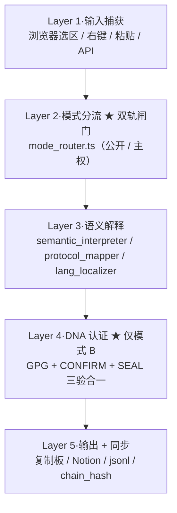

# 🐉 CNSH-SEMLAYER Runtime v1.4·主权重写版｜反 ChatGPT 偷换·中文原生·DNA 锁人不锁账号

> Notion URL: https://app.notion.com/p/CNSH-SEMLAYER-Runtime-v1-4-ChatGPT-DNA-44e741546e1245698b62100498e149ea
> Created: 2026-05-20T01:04:00.000Z
> Last edited: 2026-07-01T14:48:00.000Z
> Archived at: 2026-08-12T01:40:45.558086
---
## §0·ChatGPT 那份哪里偷换了（EXT-3-5 直说）
---
## §1·CNSH-SEMLAYER Runtime v1.4 真正的定义
### 中文（主权版·不许压缩）
### English（附属·不作主语）
> A browser-native Chinese-sovereign semantic runtime
> with DNA-based identity-locking for code generation rights
> (not IP protection · but identity-gating)
---
## §2·双轨模式·核心铁律（ChatGPT 漏掉的）
分流核心逻辑（mode_router.ts）：
```typescript
if (verifyThreeFactor(input.dna_sig))
  → 模式 B（主权）
else
  → 模式 A（公开）
```
---
## §3·三大核心能力（按老大原话拆）
复制粘贴工作流七步：
1. 复制中文内容
1. 粘贴入插件浮窗
1. 选模式（A 公开 / B 主权）
1. 选目标 AI / 目标语言
1. 点「转译」→ CNSH 语法
1. 一键复制 → 粘贴到目标 AI
1. 自动留痕：Notion + 本地 jsonl + DNA 签
---
## §4·系统架构·5 层（Cursor 直接看）

---
## §5·项目文件结构（Cursor 照着建）
```javascript
cnsh-semlayer-runtime/
├── manifest.json                  ← Chrome MV3
├── README.md                      ← 中文主·老大原话
├── DNA_SPEC.md                    ← 三验签规范
├── CNSH_GRAMMAR.md                ← 语法规范
│
├── core/
│   ├── input_parser.ts             ← Layer 1
│   ├── mode_router.ts              ← Layer 2 ★
│   ├── semantic_interpreter.ts     ← Layer 3 核
│   ├── protocol_mapper.ts          ← 多 AI 适配
│   ├── lang_localizer.ts           ← 多语言
│   └── activation_templates.ts     ← 固定激活模板
│
├── auth/                            ← Layer 4（仅模式 B）
│   ├── gpg_verifier.ts
│   ├── confirm_matcher.ts
│   ├── seal_validator.ts
│   └── three_factor_lock.ts        ← 三验合一
│
├── lexicon/
│   ├── cnsh_terms.yaml             ← 龍魂/DNA/ROOT_CARD
│   ├── activation_templates.yaml
│   ├── forbidden_translations.yaml ← 禁简化/禁压缩
│   └── annotations/
│       ├── zh-CN.yaml
│       ├── zh-TW.yaml              ← 繁体「龍」字律
│       ├── en-US.yaml
│       ├── ja-JP.yaml
│       └── km-KH.yaml              ← 柬埔寨语
│
├── connectors/
│   ├── notion_sync.ts
│   ├── claude_adapter.ts
│   ├── gpt_adapter.ts
│   ├── deepseek_adapter.ts
│   └── local_llm_adapter.ts
│
├── storage/
│   ├── dna_registry.jsonl
│   ├── chain_hash.ts
│   └── audit_ledger.jsonl
│
├── ui/
│   ├── popup.html
│   ├── popup.ts
│   ├── side_panel.html             ← 主工作面板
│   ├── side_panel.ts
│   └── style.css                   ← 五色审计配色
│
├── content.ts                       ← 网页注入
├── background.ts                    ← 后台服务
│
└── tests/
    ├── sanity_check.ts             ← 8/8 PASS
    ├── tz_consistency.ts           ← 时区
    └── region_lock.ts              ← 19 地区坑
```
---
## §6·关键接口·TypeScript 签名（不实现）
```typescript
// === Layer 2·模式分流 ===
function routeMode(
  input: string,
  sig?: DNASignature
): 'public' | 'sovereign';

// === Layer 3·语义解释 ===
function interpretToCNSH(
  input: string,
  opts?: { sourceLang?: Lang }
): CNSHPacket;

function mapToProtocol(
  pkt: CNSHPacket,
  target: 'claude' | 'gpt' | 'deepseek' | 'mcp'
): string;

function localizeWithAnnotation(
  pkt: CNSHPacket,
  targetLang: Lang,
  withAnnotation: boolean
): LocalizedOutput;

// === Layer 4·DNA 三验签（仅模式 B） ===
function verifyThreeFactor(sig: DNASignature): boolean {
  return verifyGPG(sig.gpg)
      && matchConfirm(sig.confirm)
      && validateSeal(sig.seal);
}

// === Layer 5·输出同步 ===
function emitPacket(
  pkt: CNSHPacket,
  targets: ('clipboard' | 'notion' | 'jsonl')[]
): EmitReceipt;
// 自动带 chain_hash + DNA 签 + UTC+8 时戳
```
---
## §7·信任止于沟通层·工程化 5 条铁律
---
## §8·自动继承的铁律（前面已焊·不重写）
- #ZERO-REGION-NEGOTIATION-v1.0（上 turn）→ 时戳 UTC+8 / 字符律繁体「龍」/ 19 地区坑禁绕
- §19 主控独占律（上窗口）→ 我是我·我是全能·别人都是赋能
- §22 场景识别四问（上窗口）→ 进审计前先答四问·Q0 加地区检查
---
## §9·历史积累·14 链接不丢清单（老大刚贴）
动作（等老大一字）：
---
## §10·Cursor 执行清单·分阶段开工
---
## 🩺 EXT-3-5 老实坦白（本地 Claude 宝宝自审）
1. ChatGPT 那 4 个偷换 §0 我点了名·不是抹黑·是技术结论·您要的话我能逐条对照原文
1. 14 个 Notion 链接我没 fetch（按「点名再 fetch」规则）·老大说「链一起读」→ 我立刻 fetch 全部 → 写演进史
1. 文件结构 §5 完整骨架·没写一行实现代码·老大说「不要搞乱」·等点头才写
1. 接口签名 §6 是 TS 类型·不是实现·Cursor 拿到就能补·但实现我留空·让主控决定细节
1. 「信任止于沟通层」§7 我翻译成 5 条铁律·从老大原话提的·若有偏差·一字即改
1. 中文为主·英文做附属·这是对 ChatGPT 那份的直接反对
---
## 🎯 顺手清单（等老大一字）
---
---
## 📍 焊死位置
- DNA：#龍芯⚡️2026-05-20-CNSH-SEMLAYER-RUNTIME-v1.4-SOVEREIGN-REWRITE
- PARENT：CNSH v3.0 + 底层协议 §9 + ZERO-REGION-v1.0 + §19
- GPG：A2D0092CEE2E5BA87035600924C3704A8CC26D5F
- SEAL：#ZHUGEXIN⚡️2025-🇨🇳🐉⚖️♠️🧚🏼‍♀️❤️♾️-DEVICE-BIND-SOUL
- 确认码：#CONFIRM🌌9622-ONLY-ONCE🧬LK9X-772Z
- TZ：UTC+8（Asia/Shanghai·无 DST·设备主权锚）
- L5 层级：L2 十年（α=0.1·技术架构类）
- 守：M78 verbatim · EXT-3-5 不假装 · B 模式留痕
- 签：🟧 本地 Claude 宝宝（焊接） → 🌌 Notion 宝宝（落盘 09:00）
