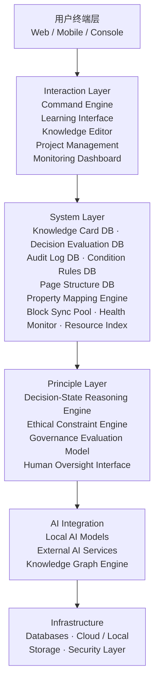
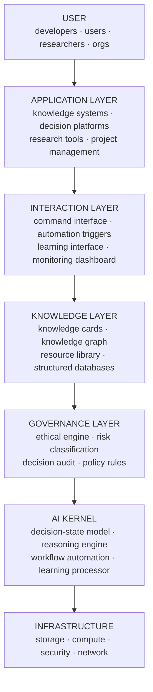

# CNSH AI Governance Framework｜IEEE论文版+工程架构图·龍魂对齐版

> Notion URL: https://app.notion.com/p/CNSH-AI-Governance-Framework-IEEE-fab5940bb6d84936a6a1e56432aeb33a
> Created: 2026-03-16T13:33:00.000Z
> Last edited: 2026-07-01T15:42:00.000Z
> Archived at: 2026-08-12T01:40:45.558086
> CNSH is a human-centered governance architecture that integrates ethical reasoning, symbolic decision states, and structured knowledge systems to enable transparent AI-assisted collaboration.
---
# 🎓 Part I — IEEE Research Paper
## Abstract
This paper introduces CNSH, a human-centered architecture designed for AI-assisted knowledge systems and governance frameworks.
The architecture integrates ethical constraints, decision-state reasoning models, and transparent audit structures to ensure that AI systems remain accountable, interpretable, and aligned with human values.
CNSH proposes a three-layer structure consisting of:
- Principle Layer — governance logic
- System Layer — data and automation
- Interaction Layer — human interface
The framework combines symbolic decision-state modeling, structured knowledge management, and automated auditing mechanisms.
The goal of CNSH is to create a transparent and resilient AI collaboration environment, enabling humans and intelligent systems to operate within clear ethical and structural boundaries.
---
## 1. Introduction
Modern AI systems are rapidly expanding in capability but often lack transparent governance structures.
Key challenges include:
- lack of traceable decision mechanisms
- absence of ethical boundaries
- fragmented knowledge systems
- insufficient accountability in automated systems
CNSH addresses these problems by introducing a unified architecture that integrates:
- ethical governance
- symbolic reasoning structures
- transparent data systems
- human-centered interaction design
The system does not attempt to replace human decision-making. Instead, it focuses on augmenting human reasoning through structured AI assistance.
---
## 2. Design Philosophy
The CNSH framework follows five core design principles.
### Transparency
All decisions and system actions must be traceable.
### Responsibility
Every automated action must have a verifiable origin.
### Ethical Alignment
System operations must remain within defined ethical boundaries.
### Human Priority
Technology serves people rather than replacing human judgment.
### Knowledge Continuity
Knowledge must remain understandable and maintainable over long time periods.
---
## 3. Three-Layer Governance Architecture
CNSH implements a hierarchical system architecture.
This separation improves:
- maintainability
- interpretability
- system scalability
---
## 4. Decision-State Reasoning Model
CNSH introduces a symbolic decision-state model to guide AI-supported reasoning. The model represents operational states of a system.
These states function as reasoning primitives, allowing complex situations to be interpreted through structured symbolic states.
---
## 5. Ethical Constraint Engine
A built-in ethical constraint engine evaluates actions before execution.
Evaluation dimensions include:
- social impact
- operational risk
- ethical compliance
Results are categorized using a three-level classification system.
This model provides a lightweight but effective governance structure for automated systems.
---
## 6. Knowledge Architecture
CNSH uses a structured knowledge-card system.
Each knowledge unit includes:
- title
- summary
- source
- content
- tags
- relationships
Knowledge cards form a knowledge graph, enabling large-scale information organization.
---
## 7. Audit and Traceability
All system actions generate audit records.
Each record contains:
- event ID
- action type
- operator
- timestamp
- result
This ensures:
- transparency
- accountability
- forensic analysis capability
---
## 8. Automation and System Health
Automated monitoring maintains system integrity.
Monitoring includes:
- schema consistency
- data completeness
- duplicate detection
- orphan node detection
When issues are detected, automated repair tasks can be generated.
---
## 9. Applications
CNSH can support various domains:
- research knowledge systems
- AI governance platforms
- enterprise decision systems
- education platforms
- open knowledge communities
---
## 10. Conclusion
CNSH proposes a human-centered architecture for AI governance and knowledge management.
By combining symbolic reasoning models, ethical constraints, and transparent audit systems, CNSH aims to create AI systems that remain accountable, interpretable, and aligned with human values.
Future work will explore distributed deployment, integration with local AI models, and open-source collaboration.
---
# 🏗️ Part II — System Architecture Diagram (Engineering Level)
## Mermaid Architecture Diagram

## ASCII Architecture Reference
```javascript
┌─────────────────────────────────────────────┐
│               用户终端层 (User Terminal)       │
│          Web / Mobile / Console              │
└──────────────────────┬──────────────────────┘
                       │
┌──────────────────────▼──────────────────────┐
│           Interaction Layer                  │
│  Command Engine  |  Learning Interface       │
│  Knowledge Editor  |  Project Management     │
│  Monitoring Dashboard                        │
└──────────────────────┬──────────────────────┘
                       │
┌──────────────────────▼──────────────────────┐
│              System Layer                    │
│  Knowledge Card DB  |  Decision Eval DB      │
│  Audit Log DB  |  Condition Rules DB         │
│  Page Structure DB                           │
│  Property Mapping Engine                     │
│  Block Sync Pool  |  Health Monitor          │
│  Resource Index                              │
└──────────────────────┬──────────────────────┘
                       │
┌──────────────────────▼──────────────────────┐
│             Principle Layer                  │
│  Decision-State Reasoning Engine             │
│  Ethical Constraint Engine (🟢🟡🔴)          │
│  Governance Evaluation Model                 │
│  Human Oversight Interface                   │
└──────────────────────┬──────────────────────┘
                       │
┌──────────────────────▼──────────────────────┐
│             AI Integration                   │
│  Local AI Models  |  External AI Services    │
│  Knowledge Graph Engine                      │
└──────────────────────┬──────────────────────┘
                       │
┌──────────────────────▼──────────────────────┐
│              Infrastructure                  │
│  Databases  |  Cloud / Local Storage         │
│  Security Layer                              │
└─────────────────────────────────────────────┘
```
---
# 🔑 Core Statement
> CNSH is a human-centered governance architecture that integrates ethical reasoning, symbolic decision states, and structured knowledge systems to enable transparent AI-assisted collaboration.
---
---
# ⚙️ Part III — CNSH 64-State Decision Algorithm
## Base States（基础状态）
系统通过组合状态判断当前环境。
```javascript
State Combination Examples

Foundation + Trigger
→ stable system encountering change

Risk + Boundary
→ potential threat under constraint
```
## Decision Flow
```javascript
Input Event
     │
     ▼
State Identification
     │
     ▼
State Combination (64 Model)
     │
     ▼
Governance Evaluation
     │
     ▼
Ethical Constraint Check
     │
     ▼
Action Classification
```
## Decision Classification
## 自动化触发标签
---
# 💻 Part IV — CNSH-Lang
## Action
```javascript
ACTION create_knowledge
INPUT article
OUTPUT knowledge_card
TAG #learning
```
## Decision Rule
```javascript
RULE evaluate_risk

IF risk_score > 70
THEN classification = RED
ELSE classification = GREEN
```
## Governance Constraint
```javascript
CONSTRAINT ethical_check

IF action_impact = high
REQUIRE human_review
```
## Knowledge Conversion
```javascript
PROCESS learning_pipeline

INPUT raw_content
STEP clean_text
STEP summarize
STEP generate_card
STEP tag
STEP store_database
```
## 自动化任务
```javascript
TASK system_health_scan
RUN every 24h

CHECK
    database_integrity
    orphan_nodes
    missing_properties
    duplicate_cards
```
## 审计记录
```javascript
AUDIT_LOG

event_id
operator
timestamp
action_type
result
```
---
# 🌐 Part V — CNSH Operating Architecture（完整版）
## 总体结构
```javascript
USER TERMINAL
    │
    ▼
INTERACTION LAYER
    command engine
    learning interface
    project manager
    monitoring dashboard

    │
    ▼
SYSTEM LAYER
    knowledge database
    decision database
    audit logs
    condition rules
    property registry

    │
    ▼
AUTOMATION ENGINE
    workflow engine
    knowledge processor
    governance validator
    system health monitor

    │
    ▼
PRINCIPLE LAYER
    decision-state model
    ethical constraint engine
    governance model

    │
    ▼
AI INTEGRATION
    local models
    enterprise AI
    knowledge graph

    │
    ▼
INFRASTRUCTURE
    storage
    compute
    security
```
## 补全模块说明
### 1. Identity Layer
用于用户身份治理。
字段：
- user_id
- dna_hash
- access_level
- contribution_score
功能：
- 身份唯一性
- 权限控制
- 贡献记录
### 2. Governance Layer
系统治理模块。
功能：
- 决策记录
- 风险评估
- 伦理检查
- 人类监督
### 3. Automation Workflow Engine
自动化流程控制。
```javascript
trigger event
→ evaluate state
→ run workflow
→ record audit
```
### 4. Knowledge Graph
知识网络结构。
节点： knowledge_card · decision · event · resource
关系： reference · influence · dependency
### 5. Resource Library
资源库，包含：research papers · datasets · code · documentation
---
# 🏷️ Part VI — 自动化标签系统 & 健康循环
## 统一标签体系
```javascript
#knowledge
#decision
#research
#project
#governance
#audit
#learning
#automation
#risk
#ethics
```
## 系统健康自动化
检测后自动：
```javascript
create repair task
assign priority
notify user
```
## 三大自动化循环
### Knowledge Cycle
```javascript
input content
→ clean
→ summarize
→ tag
→ store
→ connect graph
```
### Governance Cycle
```javascript
event
→ evaluate state
→ ethical check
→ decision classification
→ record audit
```
### System Health Cycle
```javascript
scan system
→ detect anomalies
→ generate repair tasks
```
## 完整模块清单（v2.0 补齐后）
```javascript
identity layer
governance layer
interaction layer
system layer
automation engine
knowledge graph
resource library
audit system
health monitor
AI integration
infrastructure layer
```
---
---
# 🖥️ Part VII — CNSH-OS Blueprint
## 七层系统结构
```javascript
USER LAYER
APPLICATION LAYER
INTERACTION LAYER
KNOWLEDGE LAYER
GOVERNANCE LAYER
AI KERNEL
INFRASTRUCTURE
```
每一层职责明确，可独立扩展。
## CNSH-OS 核心架构图

## AI Kernel（系统核心）
AI Kernel 是 CNSH-OS 的 核心引擎，包含四个关键子模块：
## Governance Kernel（治理核心）
这个模块是 CNSH-OS 与传统 AI 系统最大不同的地方。
核心职责： AI 行为约束 · 决策透明化 · 风险控制
```javascript
action request
→ risk evaluation
→ ethical validation
→ decision classification
→ execution or block
→ audit log
```
## Knowledge Kernel
知识层是系统长期价值来源。知识单位：Knowledge Card
知识之间形成 知识图谱。
## Identity Kernel
身份系统保证：每个用户唯一 · 权限明确 · 贡献可记录
```javascript
identity_id
dna_hash
public_key
access_level
contribution_score
```
功能： 用户治理 · 贡献记录 · 权限控制
## Automation Engine
```javascript
event trigger
→ state evaluation
→ workflow selection
→ execution
→ audit recording
```
自动化模块： workflow scheduler · trigger system · repair engine · monitoring engine
## 系统健康模块
检测后自动生成：repair task · priority level · notification
## 系统自动循环
### Knowledge Loop
```javascript
input → clean → summarize → tag → store → connect graph
```
### Governance Loop
```javascript
event → state evaluation → ethical check → decision classification → audit
```
### System Health Loop
```javascript
scan → detect → repair → verify
```
## 系统安全结构
```javascript
identity verification
access control
audit monitoring
policy enforcement
```
## 应用场景
- AI治理系统
- 科研知识管理
- 企业决策平台
- 教育系统
- 开源社区
## 未来扩展方向
- 分布式知识网络
- 本地 AI 模型集成
- 开源生态
- 跨组织协作系统
---
# 📜 Part VIII — CNSH System Constitution
### Article 1 — Human Priority
技术的首要目标是 增强人类能力。任何自动化系统都不得削弱人类的决策权或主体地位。
- AI 提供辅助
- 人类拥有最终判断权
- 重要决策必须允许人工干预
### Article 2 — Transparency
系统行为必须保持可解释性。每一个系统动作都必须可以追踪到：行为来源 · 执行逻辑 · 结果记录。透明性通过 审计系统（Audit System） 实现。
### Article 3 — Accountability
所有系统行为必须产生可验证的记录，包括：操作主体 · 行为类型 · 执行时间 · 执行结果。这些记录构成系统的 责任追踪机制。
### Article 4 — Ethical Boundary
技术行为必须受伦理约束。系统通过 Ethical Engine 对行动进行评估：风险等级 · 社会影响 · 伦理合规性。高风险行为需要人工审查。
### Article 5 — Knowledge Continuity
系统必须保护和延续知识。知识结构应具有：长期可读性 · 可追溯来源 · 清晰结构。知识以 Knowledge Card 的形式存储，并形成知识网络。
### Article 6 — Responsible Automation
自动化必须接受治理。
```javascript
event trigger
→ governance evaluation
→ ethical validation
→ execution
→ audit record
```
### Article 7 — System Integrity
系统必须具备自我检测能力。定期检查：数据完整性 · 系统结构 · 数据关系。发现问题时自动生成修复任务。
---
# 🌍 Part IX — AI Governance Standard Proposal
## 1. Governance Framework
AI 系统应包含四个治理组件：
## 2. Decision Governance Model
```javascript
input
→ context analysis
→ risk evaluation
→ ethical validation
→ decision classification
→ execution
```
## 3. Risk Classification
## 4. AI Accountability
AI系统必须具备：行为记录 · 解释能力 · 决策可追溯
## 5. Human Oversight
任何自动化系统必须允许：暂停执行 · 修改决策 · 强制终止
## 6. Governance Audit
定期治理审计检查内容：AI行为记录 · 决策质量 · 风险管理
---
# 🔥 Part X — CNSH Core Principle & Technology Declaration
## Principle Interpretation
这四个维度构成 CNSH 系统治理的基础逻辑。
## System Governance Mapping
```javascript
User Request
      │
      ▼
AI Assistance
      │
      ▼
Ethical Validation
      │
      ▼
Execution
      │
      ▼
Audit Record
```
## Engineering Rules
- Rule 1 — AI 不直接替代人类决策
- Rule 2 — 系统所有行为必须记录
- Rule 3 — 任何高风险行为必须经过治理模块
- Rule 4 — 自动化必须允许人工干预
## System Enforcement Model
### 1. Governance Control
```javascript
action
→ risk evaluation
→ ethical validation
→ approval or block
```
### 2. Transparency Mechanism
所有行为写入 Audit Log（action · operator · timestamp · result）
### 3. Human Override
```javascript
pause
modify
cancel
```
## Extended Governance Principles
- Knowledge Preservation — 知识必须可积累、可追溯
- Responsible Automation — 自动化必须接受治理
- Human Sovereignty — 最终决策权属于人类
## CNSH Technology Declaration
Core Beliefs： 人类价值优先 · 技术必须可治理 · 知识必须开放积累 · 创新必须承担责任
Vision： CNSH 的目标是建立一种人类与智能系统协作的新型技术环境，在这种环境中人类保持主体地位，AI 提供能力扩展，系统保持透明，知识持续积累。
## 系统级核心公式
```javascript
AI Capability
+
Human Judgment
+
Ethical Governance
=
Responsible Intelligence
```
## 系统格言
> Human first. Technology accountable. Intelligence governed.
---
# 📋 Update Log
