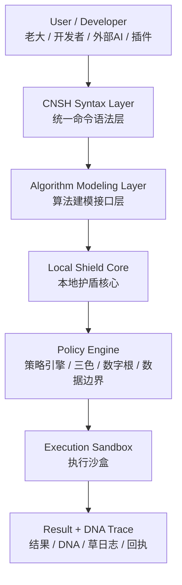
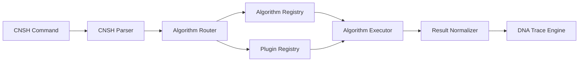
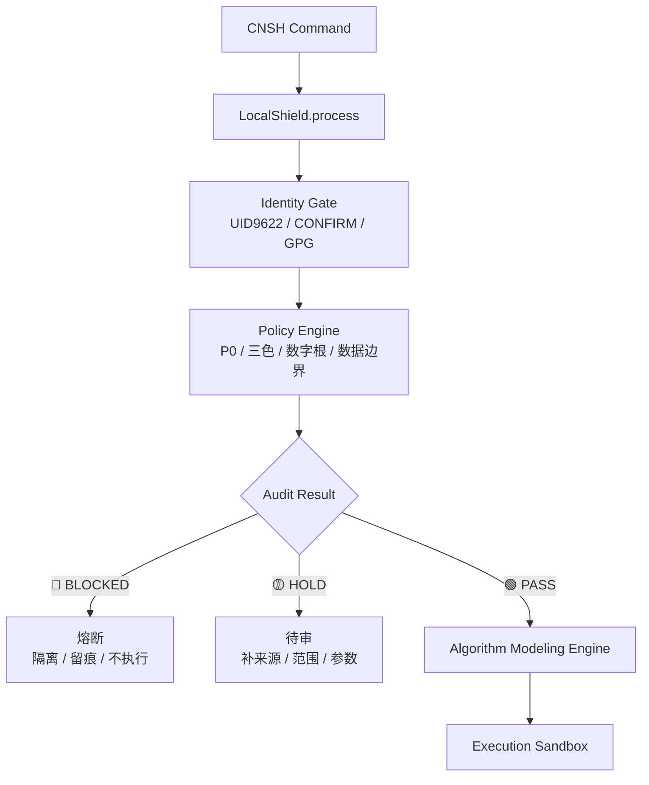
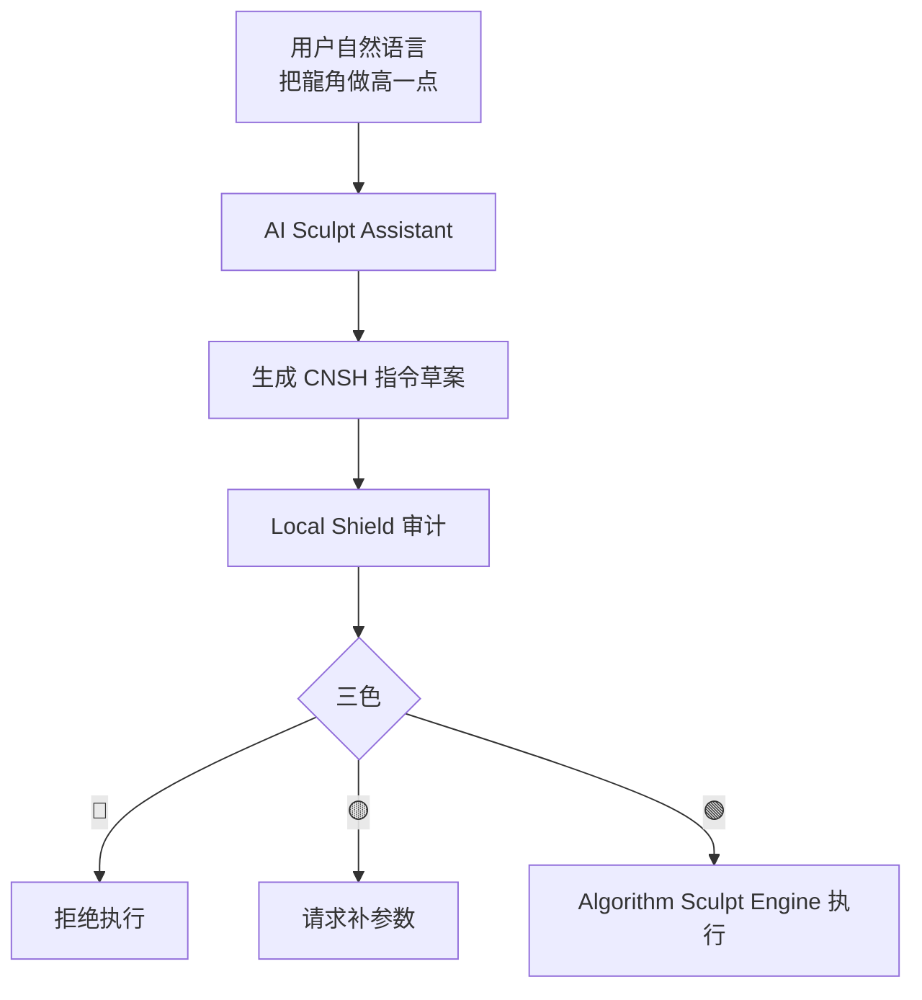
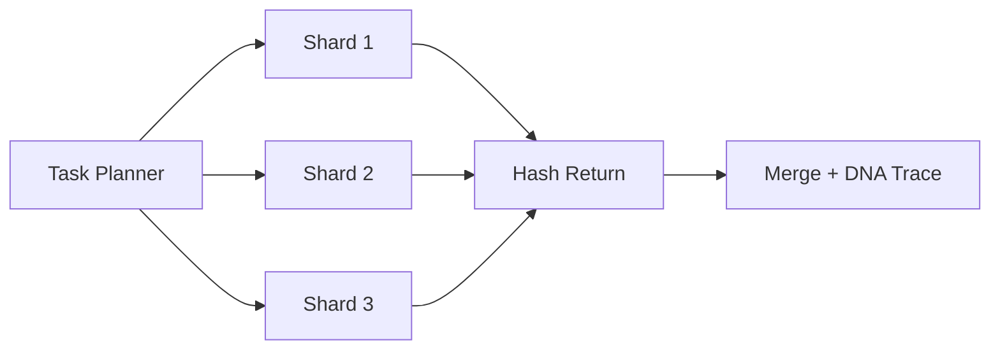

# CNSH Algorithm Runtime｜算法建模接口层工程规格书 v1.1

> Notion URL: https://app.notion.com/p/CNSH-Algorithm-Runtime-v1-1-c4082ed1122b41b08033c6ba11f427d1
> Created: 2026-05-07T06:08:00.000Z
> Last edited: 2026-07-01T15:29:00.000Z
> Archived at: 2026-08-12T01:40:45.558086
## 0. 一句话定盘
```plain text
CNSH Algorithm Runtime = 统一语法入口 + 算法建模接口层 + 本地护盾 + 执行沙盒 + DNA追溯。
```
目标：
```plain text
让算法、AI、插件都通过 CNSH 统一语法进入系统，不允许绕过护盾直接调用底层模块。
```
---
## 1. 总体架构位置

---
## 2. 洛书九宫挂位
---
## 3. CNSH 基础语法模型
### 3.1 标准指令结构
```plain text
@MODULE:ACTION
PARAMS{key=value, key2=value2}
SECURITY[level]
TRACE[dna]
CONTEXT{source=..., user=..., scope=...}
OUTPUT{format=json|text|file|mesh}
```
### 3.2 示例
```plain text
@SCULPT:RUN
PARAMS{mesh=dragon.obj, brush=inflate, intensity=0.7}
SECURITY[ENCRYPTED]
TRACE[AUTO]
CONTEXT{source=local, user=UID9622, scope=sandbox}
OUTPUT{format=mesh}
```
### 3.3 字段定义
---
## 4. Algorithm Modeling Layer
### 4.1 模块定位
```plain text
Algorithm Modeling Layer 是算法生态的总接口层。
它不直接代表某一个算法，而是负责：
1. 算法注册
2. 算法分类
3. 算法调用
4. 参数校验
5. 安全交给护盾
6. 结果交给 DNA 回流
```
### 4.2 核心组件

### 4.3 Algorithm Registry
```python
class AlgorithmRegistry:
    def __init__(self):
        self.algorithms = {}

    def register(self, name, func, meta=None):
        self.algorithms[name] = {
            "func": func,
            "meta": meta or {}
        }

    def exists(self, name):
        return name in self.algorithms

    def execute(self, name, **kwargs):
        if name not in self.algorithms:
            raise Exception("Algorithm not registered")
        return self.algorithms[name]["func"](**kwargs)
```
### 4.4 算法元信息标准
```yaml
algorithm:
  name: sculpt.inflate
  version: 1.0
  type: geometry
  security: LOCAL
  input:
    - mesh
    - intensity
  output:
    - mesh
  owner: UID9622
  palace: 7
  layer: L3
  dna: AUTO
```
---
## 5. Algorithm Sculpt Engine
### 5.1 模块定位
```plain text
Algorithm Sculpt Engine 是算法建模层下面的一个创新算法模块。
它借鉴 ZBrush 思路，但执行必须走 CNSH + Local Shield。
```
### 5.2 模块结构
```plain text
Algorithm Sculpt Engine
  ├── Mesh Loader
  ├── Brush Algorithms
  ├── Deformation Engine
  ├── Procedural Geometry
  ├── AI Sculpt Assistant
  └── Output Generator
```
### 5.3 核心接口
```python
class SculptEngine:
    def apply_brush(self, mesh, brush_type, intensity):
        if brush_type == "inflate":
            return self.inflate(mesh, intensity)

        if brush_type == "smooth":
            return self.smooth(mesh, intensity)

        if brush_type == "carve":
            return self.carve(mesh, intensity)

        raise Exception("Unsupported brush type")

    def inflate(self, mesh, k):
        # 顶点沿法线方向外扩
        for v in mesh.vertices:
            v.position += v.normal * k
        return mesh

    def smooth(self, mesh, k):
        # 简化示例：向邻居平均位置靠近
        for v in mesh.vertices:
            avg = average([n.position for n in v.neighbors])
            v.position = v.position * (1 - k) + avg * k
        return mesh
```
---
## 6. CNSH 与算法引擎连接
### 6.1 CNSH Parser
```python
class CNSHInterpreter:
    def parse(self, command_text):
        # 输入示例：
        # @SCULPT:RUN
        # PARAMS{mesh=dragon.obj, brush=inflate, intensity=0.7}
        # SECURITY[LOCAL]
        # TRACE[AUTO]

        parsed = {
            "module": None,
            "action": None,
            "params": {},
            "security": "LOCAL",
            "trace": "AUTO",
            "context": {},
            "output": {"format": "json"}
        }

        # 正式实现时使用 tokenizer，不用简单 split 硬切
        return parsed
```
### 6.2 安全执行入口
```python
def secure_execute(command_text):
    parsed = interpreter.parse(command_text)

    shield_result = local_shield.process(
        module=parsed["module"],
        action=parsed["action"],
        params=parsed["params"],
        security=parsed["security"],
        context=parsed["context"]
    )

    if shield_result["status"] == "BLOCKED":
        return {
            "status": "blocked",
            "reason": shield_result["reason"],
            "dna": dna_trace.create_blocked_trace(parsed, shield_result)
        }

    result = algorithm_runtime.execute(parsed)

    return dna_trace.wrap_result(parsed, result)
```
---
## 7. Local Shield Core
### 7.1 执行前硬闸
所有 CNSH 指令执行前，必须经过：
```plain text
1. 身份锚检查
2. 模块白名单检查
3. 参数边界检查
4. 数据安全级别检查
5. 插件签名检查
6. 沙盒权限检查
7. 三色审计
8. DNA追溯生成
```
### 7.2 护盾流程图

### 7.3 Policy Engine
```python
class PolicyEngine:
    def check(self, parsed):
        checks = [
            self.check_identity(parsed),
            self.check_module_allowlist(parsed),
            self.check_params(parsed),
            self.check_security_level(parsed),
            self.check_data_boundary(parsed),
            self.check_plugin_signature(parsed),
        ]

        if any(c.status == "red" for c in checks):
            return {"status": "BLOCKED", "audit": "🔴", "checks": checks}

        if any(c.status == "yellow" for c in checks):
            return {"status": "HOLD", "audit": "🟡", "checks": checks}

        return {"status": "PASS", "audit": "🟢", "checks": checks}
```
---
## 8. Execution Sandbox
### 8.1 沙盒职责
```plain text
Execution Sandbox 不负责判断，只负责隔离执行。
判断归 Local Shield。
调度归 Algorithm Modeling Layer。
留痕归 DNA Trace Engine。
```
### 8.2 沙盒限制
```yaml
sandbox:
  network: disabled_by_default
  file_read: scoped
  file_write: output_only
  secrets: forbidden
  env_access: forbidden
  max_runtime_sec: 30
  max_memory_mb: 512
  plugin_process: isolated
  output_hash: required
```
### 8.3 执行结果标准化
```json
{
  "status": "success",
  "module": "SCULPT",
  "action": "RUN",
  "result": {
    "mesh_id": "mesh_8821",
    "output_path": "outputs/dragon_inflate.obj"
  },
  "audit": "🟢",
  "dna": "#龍芯⚡️2026-05-07-ALG-RUNTIME-xxxx"
}
```
---
## 9. DNA 追溯设计
### 9.1 DNA 生成公式
```plain text
DNA_HASH = SHA256(
  previous_hash
  + module
  + action
  + canonical_params
  + security_level
  + timestamp
  + output_hash
)
```
### 9.2 DNA 返回结构
```json
RESULT {
  "status": "success",
  "module": "SCULPT",
  "action": "RUN",
  "dna": "#龍芯⚡️2026-05-07-ALG-RUNTIME-98211a",
  "previous_hash": "abc123",
  "output_hash": "def456",
  "audit": "🟢",
  "trace": {
    "identity": "UID9622",
    "shield": "PASS",
    "sandbox": "ISOLATED",
    "log": "created"
  }
}
```
### 9.3 回流规则
```plain text
每次算法运行必须产生：
1. M:: 机器验收
2. CNSH:: 路由签章
3. DNA hash
4. 输出 hash
5. 草日志摘要
6. 可复现参数快照
```
---
## 10. 插件开发接口
### 10.1 插件目录结构
```plain text
CNSH_PLUGIN/
  plugin.json
  plugin.py
  signature.gpg
  README.md
  tests/
  examples/
```
### 10.2 plugin.json
```json
{
  "name": "fractal_sculpt",
  "version": "1.0",
  "entry": "plugin.py",
  "security": "LOCAL",
  "permissions": {
    "network": false,
    "file_read": "scoped",
    "file_write": "output_only",
    "secrets": false
  },
  "cnsh": {
    "module": "SCULPT",
    "actions": ["RUN", "PREVIEW", "EXPORT"]
  },
  "signature": "signature.gpg"
}
```
### 10.3 插件接入铁律
```plain text
1. 无签名插件不加载。
2. 无权限声明插件不加载。
3. 申请 secrets / .env / 私钥访问，直接熔断。
4. 申请网络访问，默认待审。
5. 插件不能绕过 CNSH 指令入口。
6. 插件输出必须生成 output_hash。
7. 插件执行必须进入草日志和 DNA 回流。
```
---
## 11. AI Sculpt Assistant
### 11.1 定位
```plain text
AI Sculpt Assistant 不直接操作底层文件。
它只生成 CNSH 指令草案，再交给 Local Shield 审计。
```
### 11.2 AI 生成流程

### 11.3 示例
```plain text
用户：把龍角做高一点，力度别太大。

AI 生成：
@SCULPT:RUN
PARAMS{mesh=dragon.obj, brush=inflate, region=horn, intensity=0.25}
SECURITY[LOCAL]
TRACE[AUTO]
CONTEXT{source=ai_assistant, user=UID9622, scope=sandbox}
OUTPUT{format=mesh}
```
---
## 12. Procedural Geometry Engine
### 12.1 定位
```plain text
Procedural Geometry Engine 负责通过算法生成模型，不依赖人工逐点雕刻。
```
### 12.2 典型模块
```plain text
1. fractal_shape_generator
2. curve_to_mesh
3. particle_field_to_mesh
4. luoshu_grid_geometry
5. sancai_vector_shape
6. dragon_scale_generator
```
### 12.3 CNSH 示例
```plain text
@GEOMETRY:GENERATE
PARAMS{type=dragon_scale, count=9622, pattern=luoshu, symmetry=true}
SECURITY[LOCAL]
TRACE[AUTO]
OUTPUT{format=mesh}
```
---
## 13. Distributed Compute
### 13.1 定位
```plain text
Distributed Compute 让多设备参与计算，但默认不是开放网络计算。
必须先经过 Local Shield、设备签名、任务分片、结果哈希回收。
```
### 13.2 分布式最小闭环

### 13.3 硬闸
```plain text
1. 未登记设备不参与。
2. 无设备签名不参与。
3. 不下发私钥、token、.env。
4. 分片任务不得携带完整敏感数据。
5. 结果必须带 shard_hash。
6. 合并结果必须带 final_hash。
```
---
## 14. 开发者 SDK 设计
### 14.1 SDK 目标
```plain text
开发者不直接调用底层模块，只调用 CNSH SDK。
```
### 14.2 Python SDK 示例
```python
from cnsh_runtime import CNSHClient

client = CNSHClient(
    endpoint="local://cnsh-runtime",
    identity="UID9622",
)

result = client.run(
    module="SCULPT",
    action="RUN",
    params={
        "mesh": "dragon.obj",
        "brush": "inflate",
        "intensity": 0.7
    },
    security="LOCAL",
    trace="AUTO"
)

print(result["dna"])
```
### 14.3 SDK 返回标准
```json
{
  "status": "success|hold|blocked|error",
  "audit": "🟢|🟡|🔴",
  "message": "",
  "result": {},
  "dna": "",
  "m_acceptance": {},
  "cnsh_signature": {}
}
```
---
## 15. 目录建议
```plain text
cnsh_algorithm_runtime/
  README.md
  cnsh/
    parser.py
    schema.py
    interpreter.py
  shield/
    local_shield.py
    policy_engine.py
    data_boundary.py
    tri_color.py
  algorithms/
    registry.py
    runtime.py
    sculpt/
      engine.py
      mesh_loader.py
      brushes.py
  sandbox/
    executor.py
    permissions.py
    limits.py
  plugins/
    loader.py
    verifier.py
    examples/
  trace/
    dna.py
    hash.py
    receipt.py
  sdk/
    python/
      cnsh_runtime.py
  tests/
    test_parser.py
    test_shield.py
    test_registry.py
    test_sculpt.py
```
### 15.1 子运行时接口｜CNSH 折叠操作台
```plain text
结构归位：
CNSH Algorithm Runtime
  └── CNSH Folding Console / CNSH Font Runtime
      ├── Protocol Header
      ├── Global Config
      ├── LU Origin
      ├── LU Memory
      ├── LU Compress
      ├── LU FullSync
      ├── TriColor Audit
      ├── SVG Render
      └── DNA Receipt
```
### 15.2 子运行时接口·自适应调节器（M252 焊点·2026-05-29 23:23）
```plain text
结构归位：
CNSH Algorithm Runtime
  └── 自适应调节器·Tune Engine v2.0
      ├── 账本加载（~/.龍魂/規則帳本.jsonl·只读不动）
      ├── 观察窗口分析（默认 90 天·最小样本 20）
      ├── 趋势对比（半窗口前后对比·识别变好/变坏）
      ├── 三色 dr 判定（🟢dr=7 通行 / 🟡dr=6 待审 / 🔴dr=3·9 熔断）
      ├── 双向调整 + 滞回带 0.05（防边缘震荡）
      ├── 红线熔断（dr=3/9 拒绝保存·人工眼审）
      ├── SHA-256 哈希链（父→子可追溯·篡改即露）
      ├── 历史备份（~/.龍魂/微調歷史/）
      └── Markdown 审计报告（~/.龍魂/微調審計/）
```
### 15.2.1 与 §7 Local Shield Core 联动
### 15.2.2 M:: 验收追加
```json
M:: {
  "id": "M::ARCH-9622-20260529-TUNE-ENGINE-V2-INTEGRATION",
  "type": "runtime_subsystem",
  "ts": "2026-05-29T23:23:00+08:00",
  "status": "integrated",
  "refs": [
    "https://www.notion.so/b35faf462bc042aa9de5192520180728",
    "https://www.notion.so/d104533205b94143a2021e7a2346a1d8",
    "https://www.notion.so/a03f1fea3f514c76b8b0f1d8be1d4ddf"
  ],
  "payload": {
    "summary": "自适应调节器 v2.0 接入 CNSH Algorithm Runtime 子运行时·双向 + 滞回 + 趋势 + 回滚 + 三色 dr + 哈希链 + Markdown 审计·与 §7 Local Shield + §17 一票否决 + §9 DNA Trace 联动完成。",
    "result": {
      "tune_engine_v2": "integrated",
      "hash_chain": "sha256_parent_child",
      "safe_mode_default": true,
      "red_line_melt": "dr=3|9",
      "audit_report": "markdown_persistent"
    }
  }
}
```
### 15.2.3 CNSH:: 路由签章
```json
CNSH:: {
  "dna": "#龍芯⚡️20260529-23:23-TUNE-ENGINE-V2-CNSH-RUNTIME-LINK-v1.0",
  "parent_dna": "#龍芯⚡️2026-05-07-CNSH-ALGORITHM-RUNTIME-BLUEPRINT-v1.0",
  "runtime_dna": "#龍芯⚡️20260529-自适应参数-v2.0",
  "gate": "#CONFIRM🌌9622-ONLY-ONCE🧬LK9X-772Z",
  "seal": "#ZHUGEXIN⚡️2025-🇨🇳🐉⚖️♠️🧚🏼‍♀️❤️♾️-DEVICE-BIND-SOUL",
  "gpg": "A2D0092CEE2E5BA87035600924C3704A8CC26D5F",
  "route": "IPA-MAIN-CONTROL|CNSH-ALGORITHM-RUNTIME|TUNE-ENGINE-V2|LOCAL-SHIELD|DNA-TRACE",
  "audit": "🟢",
  "wuxing": "金",
  "layer": "L2十年|L3日常",
  "policy": "pass"
}
```
---
## 16. 分阶段落地计划
---
## 17. 一票否决
```plain text
🔴 失败：
- 算法绕过 CNSH 入口直接调用底层模块
- 插件绕过 Local Shield
- AI 直接执行底层动作，不生成 CNSH 指令草案
- 未签名插件加载
- 插件读取 token / .env / 私钥 / GitHub Secrets
- 沙盒越权读写
- 执行没有 M:: 验收
- 执行没有 CNSH:: 签章
- 执行没有 DNA 回流
- 结果无法复现参数快照
```
---
## 18. M:: 机器验收
```json
M:: {
  "id": "M::ARCH-9622-20260507-CNSH-ALGORITHM-RUNTIME-V1",
  "type": "architecture",
  "ts": "2026-05-07T14:06:38+08:00",
  "status": "configured",
  "refs": [
    "https://www.notion.so/2d87125a9c9f802889e2e18002f7cf4f",
    "https://www.notion.so/4649636d4d40411c926508a52a030be4",
    "https://www.notion.so/16422f7261e94a57b1539d8c003ab12c"
  ],
  "payload": {
    "summary": "CNSH语法体系与本地护盾架构已整合为算法建模接口层技术蓝图。",
    "result": {
      "cnsh_syntax_layer": "defined",
      "algorithm_modeling_layer": "defined",
      "local_shield_core": "required_before_execution",
      "execution_sandbox": "defined",
      "dna_trace": "required",
      "plugin_sdk": "defined",
      "ai_sculpt_assistant": "planned",
      "procedural_geometry": "planned",
      "distributed_compute": "planned"
    }
  }
}
```
---
## 19. CNSH:: 路由签章
```json
CNSH:: {
  "dna": "#龍芯⚡️2026-05-07-CNSH-ALGORITHM-RUNTIME-BLUEPRINT-v1.0",
  "gate": "#CONFIRM🌌9622-ONLY-ONCE🧬LK9X-772Z",
  "seal": "#ZHUGEXIN⚡️2025-🇨🇳🐉⚖️♠️🧚🏼‍♀️❤️♾️-DEVICE-BIND-SOUL",
  "gpg": "A2D0092CEE2E5BA87035600924C3704A8CC26D5F",
  "route": "IPA-MAIN-CONTROL|ORIGINAL-FLOWFIELD|CNSH-SYNTAX|ALGORITHM-MODELING|LOCAL-SHIELD|EXECUTION-SANDBOX|DNA-TRACE",
  "audit": "🟢",
  "wuxing": "金",
  "layer": "L2十年|L3日常",
  "policy": "pass"
}
```
