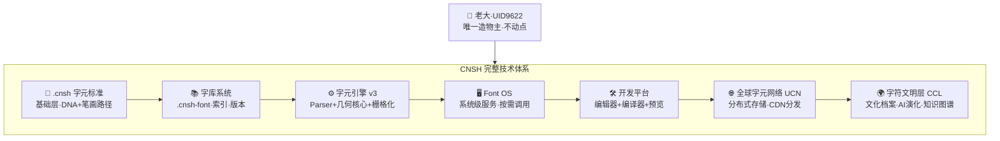
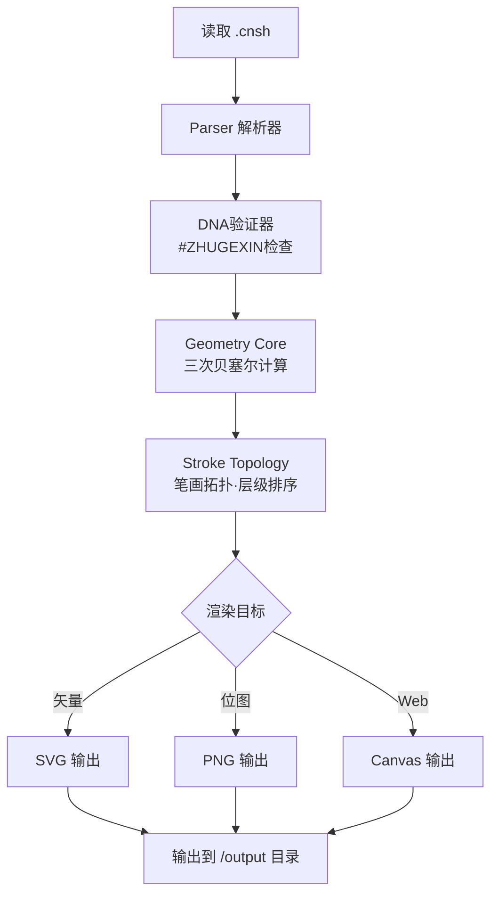
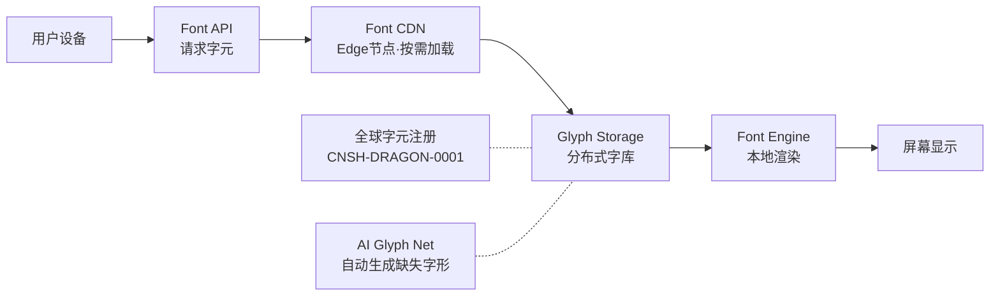
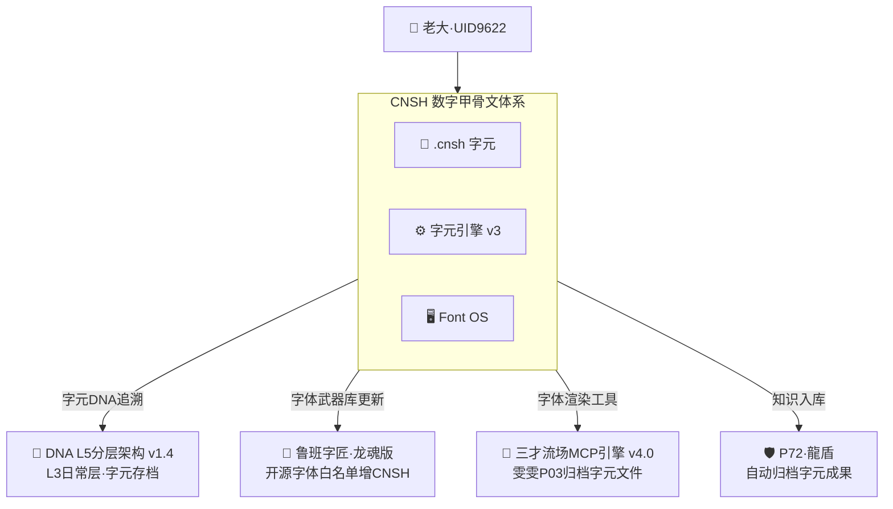

# 🀄 CNSH 数字甲骨文字元立碑工程·总系统 v1.0｜字元→引擎→OS→生态→文明层·UID9622

> Notion URL: https://app.notion.com/p/CNSH-v1-0-OS-UID9622-ca83c2fd3cd94adabe10159417f2ec67
> Created: 2026-03-31T10:31:00.000Z
> Last edited: 2026-07-01T15:30:00.000Z
> Archived at: 2026-08-12T01:40:45.558086
# 🀄 CNSH 数字甲骨文字元立碑工程·总系统 v1.0
> 《道德经》第一章："道可道，非常道；名可名，非常名。无名天地之始，有名万物之母。" —— CNSH不是在模仿别人的字体格式，是在用中国的根，重新定义什么是"字"。
---
## 一、🏗️ CNSH 完整技术体系（七层架构）

---
## 二、📄 .cnsh 字元格式标准（基础层）
> 《易经·系辞》："书不尽言，言不尽意" —— 所以我们不用文字描述字形，用数学路径定义字形。
### 2.1 完整字元定义结构
```json
{
  "来源标注": "#ZHUGEXIN⚡️ | UID9622 龙魂体系",
  "字体元信息_cnsh9622": {
    "名称": "龙魂字元库",
    "版本": "v2.0",
    "创建者": "UID9622",
    "DNA追溯码": "#ZHUGEXIN⚡️-CNSH-CORE"
  },
  "字元运行协议_cnsh9622": {
    "运行版本": "v1.0",
    "加载方式": "本地读取",
    "渲染模式": "数学渲染",
    "字体尺寸": 512,
    "坐标系统": "左上原点",
    "曲线算法": "三次贝塞尔"
  },
  "字元ID": "CNSH-DRAGON-0001",
  "字符集_cnsh9622": {
    "字符": "龙",
    "DNA追溯": {
      "创建者": "UID9622",
      "创建时间": "2026-03-31",
      "版本": "v2.0",
      "签名": "#ZHUGEXIN⚡️-CNSH-DRAGON-0001"
    },
    "笔画路径_cnsh9622": [
      { "类型": "移动到", "坐标": [120, 480], "层级": 1 },
      { "类型": "直线段", "终点": [220, 160], "力度": 18, "棱角": "断锋", "层级": 1 },
      { "类型": "三次曲线", "控制点": [[260, 120], [340, 120]], "终点": [380, 200], "力度": 14, "棱角": "平锋", "层级": 2 },
      { "类型": "直线段", "终点": [300, 320], "力度": 16, "棱角": "锐角", "层级": 3 }
    ]
  }
}
```
### 2.2 基础字元库（五核心字）
---
## 三、⚙️ CNSH 字元引擎 v3（核心计算层）
### 3.1 引擎架构

### 3.2 统一引擎核心代码（v3·完整版）
```python
# ═══════════════════════════════════════════════════════════
# 龍芯体系 | CNSH 字元引擎 v3·完整版
# ═══════════════════════════════════════════════════════════
# ENCODING: UTF-8
# FONT-INDEPENDENT: YES
# NO PROPRIETARY TOKENS
# ═══════════════════════════════════════════════════════════
# DNA追溯码：#ZHUGEXIN⚡️-CNSH-ENGINE-v3-2026-03-31
# GPG指纹：A2D0092CEE2E5BA87035600924C3704A8CC26D5F
# 创建者：💎 龍芯北辰｜UID9622
# 确认码：#CONFIRM🌌9622-ONLY-ONCE🧬LK9X-772Z
# ═══════════════════════════════════════════════════════════

import json
import os
import hashlib
import random


class CNSH字元引擎_v3_UID9622:
    """
    CNSH字元引擎 v3 · 完整版
    整合：力度 + 棱角 + 节奏 + 断续 + 侵蚀 + 层级 + DNA验证
    """

    def __init__(self):
        self.画布尺寸 = 512
        self.字元集_cnsh9622 = {}
        self.审计_cnsh9622 = {}
        self.组合规则_cnsh9622 = {}

    # ── 载入 ──
    def 载入_cnsh数据(self, 路径_cnsh9622):
        if not os.path.exists(路径_cnsh9622):
            raise FileNotFoundError(f"找不到文件: {路径_cnsh9622}")
        with open(路径_cnsh9622, "r", encoding="utf-8") as 文件:
            数据 = json.load(文件)
        self.字元集_cnsh9622 = 数据.get("字符集_cnsh9622", {})
        self.审计_cnsh9622 = 数据.get("三色审计_cnsh9622", {})
        self.组合规则_cnsh9622 = 数据.get("字元组合_cnsh9622", {})

    # ── 三色审计 ──
    def 执行三色审计(self):
        for 颜色, 内容 in self.审计_cnsh9622.items():
            if 内容.get("结果") != "通过":
                raise RuntimeError(f"三色审计未通过：{颜色}层")

    # ── DNA验证 ──
    def DNA验证(self, 字元数据):
        签名 = 字元数据.get("DNA追溯", {}).get("签名", "")
        if "ZHUGEXIN" not in 签名:
            raise ValueError(f"DNA签名异常：{签名}")
        return True

    # ── 棱角参数 ──
    def 棱角参数(self, 类型):
        映射 = {
            "断锋": ("butt", "miter"),
            "锐角": ("square", "miter"),
            "平锋": ("butt", "bevel"),
        }
        return 映射.get(类型, ("butt", "miter"))

    # ── 侵蚀扰动 ──
    def 侵蚀扰动(self, 数值, 强度):
        return 数值 + (random.random() - 0.5) * 强度 * 40

    # ── 路径生成（完整版：力度+棱角+节奏+断续+侵蚀+层级）──
    def 生成路径片段(self, 笔画列表):
        片段 = []
        当前点 = None
        for 动作 in sorted(笔画列表, key=lambda x: x.get("层级", 0)):
            类型 = 动作["类型"]
            力度 = 动作.get("力度", 12)
            棱角 = 动作.get("棱角", "平锋")
            停顿 = 动作.get("停顿", 0)
            断续 = 动作.get("断续")
            侵蚀 = 动作.get("侵蚀", 0)
            端点, 连接 = self.棱角参数(棱角)
            透明度 = max(0.2, 1 - 停顿)
            dash = ",".join(str(int(v * 100)) for v in 断续) if 断续 else ""
            dash属性 = f'stroke-dasharray="{dash}" ' if dash else ""

            if 类型 == "移动到":
                当前点 = 动作["坐标"][:]

            elif 类型 == "直线段" and 当前点:
                终点 = 动作["终点"]
                if 侵蚀:
                    x1 = self.侵蚀扰动(当前点[0], 侵蚀)
                    y1 = self.侵蚀扰动(当前点[1], 侵蚀)
                    x2 = self.侵蚀扰动(终点[0], 侵蚀)
                    y2 = self.侵蚀扰动(终点[1], 侵蚀)
                else:
                    x1, y1 = 当前点
                    x2, y2 = 终点
                片段.append(
                    f'<path d="M {x1} {y1} L {x2} {y2}" '
                    f'fill="none" stroke="black" stroke-width="{力度}" '
                    f'stroke-opacity="{透明度}" '
                    f'{dash属性}'
                    f'stroke-linecap="{端点}" stroke-linejoin="{连接}"/>'
                )
                当前点 = 终点[:]

            elif 类型 == "三次曲线" and 当前点:
                控制点 = 动作["控制点"]
                P3 = 动作.get("终点", 控制点[-1])
                if len(控制点) == 2:
                    P1, P2 = 控制点
                else:
                    P1 = P2 = 控制点[0]
                if 侵蚀:
                    P1 = [self.侵蚀扰动(P1[0], 侵蚀), self.侵蚀扰动(P1[1], 侵蚀)]
                    P2 = [self.侵蚀扰动(P2[0], 侵蚀), self.侵蚀扰动(P2[1], 侵蚀)]
                    P3 = [self.侵蚀扰动(P3[0], 侵蚀), self.侵蚀扰动(P3[1], 侵蚀)]
                片段.append(
                    f'<path d="M {当前点[0]} {当前点[1]} '
                    f'C {P1[0]} {P1[1]}, {P2[0]} {P2[1]}, {P3[0]} {P3[1]}" '
                    f'fill="none" stroke="black" stroke-width="{力度}" '
                    f'stroke-opacity="{透明度}" '
                    f'{dash属性}'
                    f'stroke-linecap="{端点}" stroke-linejoin="{连接}"/>'
                )
                当前点 = P3[:]
        return 片段

    # ── 单字元SVG输出 ──
    def 输出SVG(self, 字元, 输出路径):
        字元数据 = self.字元集_cnsh9622[字元]
        self.DNA验证(字元数据)
        片段 = self.生成路径片段(字元数据["笔画路径_cnsh9622"])
        svg内容 = (
            f'<svg xmlns="http://www.w3.org/2000/svg" viewBox="0 0 {self.画布尺寸} {self.画布尺寸}">'
            + "".join(片段)
            + "</svg>"
        )
        with open(输出路径, "w", encoding="utf-8") as 文件:
            文件.write(svg内容)

    # ── 批量渲染 ──
    def 执行渲染(self, 输出目录):
        if self.审计_cnsh9622:
            self.执行三色审计()
        os.makedirs(输出目录, exist_ok=True)
        for 字元 in self.字元集_cnsh9622:
            self.输出SVG(字元, os.path.join(输出目录, f"{字元}.svg"))
            print(f"✅ 已生成：{字元}.svg")

    # ── 组合渲染 ──
    def 渲染组合(self, 组合名, 输出路径):
        规则 = self.组合规则_cnsh9622[组合名]
        字元列表 = 规则["组成"]
        方向 = 规则["排布规则_cnsh9622"]["方向"]
        间距 = 规则["排布规则_cnsh9622"]["间距"]
        总片段 = []
        当前偏移 = 0
        for 字元 in 字元列表:
            笔画 = self.字元集_cnsh9622[字元]["笔画路径_cnsh9622"]
            偏移笔画 = []
            for 动作 in 笔画:
                新动作 = dict(动作)
                if 方向 == "横向":
                    偏移笔画.append({**新动作, **self._偏移动作(动作, 当前偏移, 0)})
                else:
                    偏移笔画.append({**新动作, **self._偏移动作(动作, 0, 当前偏移)})
            总片段.extend(self.生成路径片段(偏移笔画))
            当前偏移 += 间距
        svg内容 = (
            f'<svg xmlns="http://www.w3.org/2000/svg" viewBox="0 0 1200 600">'
            + "".join(总片段)
            + "</svg>"
        )
        with open(输出路径, "w", encoding="utf-8") as 文件:
            文件.write(svg内容)

    def _偏移动作(self, 动作, dx, dy):
        """给动作坐标加偏移（仅对坐标字段生效）"""
        新 = {}
        if "坐标" in 动作:
            新["坐标"] = [动作["坐标"][0] + dx, 动作["坐标"][1] + dy]
        if "终点" in 动作:
            新["终点"] = [动作["终点"][0] + dx, 动作["终点"][1] + dy]
        if "控制点" in 动作:
            新["控制点"] = [[p[0] + dx, p[1] + dy] for p in 动作["控制点"]]
        return 新
```
---
## 四、🖥️ CNSH Font OS（系统层）
### 4.1 系统架构
```javascript
CNSH_Font_OS
│
├─ Kernel Layer（内核层）
│   ├─ 字元引擎 v3          ← 字形计算核心
│   ├─ Geometry Core        ← 三次贝塞尔数学
│   └─ Glyph Scheduler      ← 渲染调度
│
├─ System Services（系统服务）
│   ├─ Font Loader           ← 加载 .cnsh 字库
│   ├─ Glyph Cache           ← 内存/GPU/磁盘三级缓存
│   ├─ Font API              ← 对外调用接口
│   └─ DNA Security Manager  ← 字元签名验证
│
├─ Font File System（字体文件系统）
│   ├─ /font/system/         ← 系统基础字库
│   ├─ /font/user/           ← 用户自定义字库
│   └─ /font/cache/          ← 字形缓存
│
└─ Application Layer（应用层）
    ├─ Web / Canvas / SVG
    ├─ App / GPU渲染
    └─ OS 系统字体
```
### 4.2 Font API 调用示例
```python
# 来源标注: #ZHUGEXIN⚡️ | UID9622 龙魂体系

引擎 = CNSH字元引擎_v3_UID9622()
引擎.载入_cnsh数据("data/characters/dragon.cnsh")

# 单字元渲染
引擎.输出SVG("龙", "output/svg/龙.svg")

# 批量渲染整个字库
引擎.执行渲染("output/svg/")

# 组合渲染（横向/纵向排布）
引擎.渲染组合("龙魂", "output/svg/龙魂.svg")
```
---
## 五、🌐 CNSH UCN 全球字元网络（网络层）

全球字元注册·CID格式：
```json
{
  "cid": "cnsh:han:龙:0001",
  "glyph_hash": "a91f23d2",
  "creator": "UID9622",
  "dna_sig": "#ZHUGEXIN⚡️-CNSH-DRAGON-0001",
  "version": "2.0"
}
```
---
## 六、🌍 CNSH CCL 字符文明层（最高层）
> 《易经·系辞》："形而上者谓之道，形而下者谓之器" —— 字形是器，文化是道，CNSH两者皆有。
字符文明层让每一个 .cnsh 字元不只是几何路径，而是文化资产：
---
## 七、📋 CNSH 工程目录结构（可直接建立）
```javascript
CNSH_Font_OS/
│
├─ engine/
│   ├─ cnsh_font_engine_v3_uid9622.py    ← 统一引擎（本页第三节）
│   ├─ cnsh_dna_validator.py
│   └─ cnsh_path_math.py
│
├─ data/
│   ├─ characters/
│   │   ├─ 龙.cnsh
│   │   ├─ 中.cnsh
│   │   ├─ 华.cnsh
│   │   ├─ 民.cnsh
│   │   ├─ 魂.cnsh
│   │   └─ 国.cnsh
│   ├─ combos/
│   │   ├─ 中华.cnsh
│   │   └─ 龙魂.cnsh
│   └─ library_index.json
│
├─ output/
│   ├─ svg/
│   └─ png/
│
├─ logs/
│   └─ cnsh_audit.jsonl              ← 三色审计日志·append-only
│
└─ README_CNSH_UID9622.md
```
---
## 八、🔬 三色审计·总系统自检
---
## 九、🚀 立即可执行·三步启动
第一步：建目录
```bash
mkdir -p CNSH_Font_OS/{engine,data/characters,data/combos,output/svg,logs}
```
第二步：复制引擎代码
把本页第三节的 CNSH字元引擎_v3_UID9622 代码保存为：
CNSH_Font_OS/engine/cnsh_font_engine_v3_uid9622.py
第三步：用样本字元测试
```python
# 测试脚本·test_cnsh_uid9622.py
import sys
sys.path.insert(0, "engine")
from cnsh_font_engine_v3_uid9622 import CNSH字元引擎_v3_UID9622

引擎 = CNSH字元引擎_v3_UID9622()
引擎.载入_cnsh数据("data/characters/龙.cnsh")
引擎.输出SVG("龙", "output/svg/龙.svg")
print("✅ 龙.svg 生成成功")
```
---
## 十、📊 CNSH × 龍魂系统·联动关系

---
