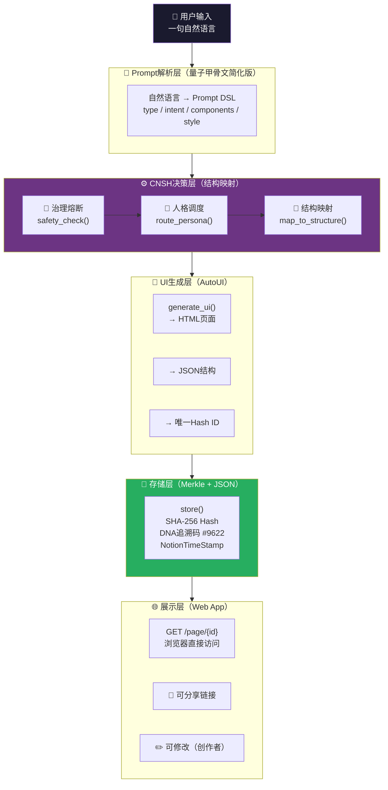

# ⚙️ CNSH × 龍魂系统·MVP v2.0｜可上线执行版·7天能跑·30天能用·90天成平台｜UID9622

> Notion URL: https://app.notion.com/p/CNSH-MVP-v2-0-7-30-90-UID9622-1543ceabbcb747d09bcaddd7fcb9d845
> Created: 2026-03-30T16:07:00.000Z
> Last edited: 2026-07-01T13:17:00.000Z
> Archived at: 2026-08-12T01:40:45.558086
---
## 零、⚡ 核心定义·一句话压缩
你现在已经有的：
- 世界观 ✅（三才流场·洛书引擎·龍魂系统）
- 结构 ✅（七维推演·Merkle存储·五人格调度）
- 逻辑 ✅（DNA追溯·向善四律·三色审计）
你缺的只有一个： 一个能让别人点一下就看到结果的入口。
---
## 一、📊 MVP v1 → v2 升级对照表
---
## 二、🏗️ MVP v2.0 总架构（工程版）

---
## 三、✅ MRU·最小可运行单元（先做这个）
```python
# MRU验证流程（伪代码·Day 1-2目标）
input_text = "做一个个人主页，有头像、简介、联系方式"

# Step 1: 解析
parsed = parse_input(input_text)
# → {"type": "app", "intent": "个人主页", "components": ["avatar", "bio", "contact"]}

# Step 2: 生成HTML
html = generate_ui(parsed)
# → <html>...</html>

# Step 3: 存储 + 获取ID
hash_id = store(html)
# → "a3f8c2d1e9b047..."

print(f"✅ 页面已生成：http://localhost:8000/page/{hash_id}")
```
---
## 四、🔧 六大模块·直接可开发
### 1️⃣ 输入协议（Prompt DSL）
```yaml
# Prompt DSL 标准格式
type: "app"           # app / page / form / dashboard
intent: "个人主页"    # 用户意图（自然语言描述）
components:
  - avatar            # 头像
  - bio               # 简介
  - contact           # 联系方式
style: "简约"         # 简约 / 科技 / 商务 / 极简
dna: "#9622"          # 归属标记
```
```python
def parse_input(user_text: str) -> dict:
    """自然语言 → DSL（初期用规则匹配，后期接LLM）"""
    # 关键词提取
    components = []
    if "头像" in user_text or "avatar" in user_text:
        components.append("avatar")
    if "简介" in user_text or "bio" in user_text:
        components.append("bio")
    if "联系" in user_text or "contact" in user_text:
        components.append("contact")
    if "登录" in user_text or "login" in user_text:
        components.append("login_form")
    
    return {
        "type": "app",
        "intent": user_text[:50],  # 截取前50字作为意图描述
        "components": components,
        "style": "简约",
        "dna": "#9622"
    }
```
### 2️⃣ 核心执行流（写死·不要改）
```python
def run_pipeline(user_input: str) -> str:
    """主执行流·N1→N6完整链路"""
    
    # 🔐 治理熔断（优先执行）
    if not safety_check(user_input):
        return {"status": "blocked", "reason": "触发治理熔断"}
    
    # 解析输入
    parsed = parse_input(user_input)        # N1: 输入解析
    
    # 人格调度
    persona = route_persona(user_input)     # N2: CNSH决策
    
    # 结构映射
    schema = map_to_structure(parsed)       # N3: 结构生成
    
    # UI生成
    ui = generate_ui(schema)                # N4: AutoUI
    
    # 存储
    hash_id = store(ui)                     # N5: Merkle存储
    
    return {
        "status": "success",
        "id": hash_id,
        "url": f"/page/{hash_id}",
        "persona_used": persona,
        "dna": "#CNSH-9622"
    }
```
### 3️⃣ UI生成引擎（第一版·够用就行）
```python
def generate_ui(schema: dict) -> str:
    """根据DSL生成HTML页面·v1极简版"""
    
    components_html = ""
    
    for comp in schema.get("components", []):
        if comp == "avatar":
            components_html += '<div class="avatar"></div>\n'
        elif comp == "bio":
            components_html += f'<div class="bio"><p>{schema.get("intent", "简介内容")}</p></div>\n'
        elif comp == "contact":
            components_html += '<div class="contact"><p>📧 email@example.com</p></div>\n'
        elif comp == "login_form":
            components_html += '<form><input type="text" placeholder="用户名"/><input type="password" placeholder="密码"/><button>登录</button></form>\n'
    
    html = f"""<!DOCTYPE html>
<html lang="zh">
<head>
    <meta charset="UTF-8">
    <title>{schema.get('intent', 'My Page')}</title>
    <meta name="dna" content="{schema.get('dna', '#9622')}">
    <style>
        body  font-family: -apple-system, sans-serif; max-width: 800px; margin: 0 auto; padding: 2rem; 
        .avatar img  width: 100px; border-radius: 50%; 
        .bio  margin: 1rem 0; color: #666; 
        .contact  color: #333; 
    </style>
</head>
<body>
    <h1>{schema.get('intent', 'My Page')}</h1>
    {components_html}
    <!-- DNA: {schema.get('dna', '#9622')} -->
</body>
</html>"""
    return html
```
### 4️⃣ 存储系统（Merkle DNA·核心优势）
```python
import hashlib
import json
from datetime import datetime

db = {}  # 初期用内存dict，后期换SQLite/Redis

def store(content: str) -> str:
    """Merkle DNA存储·核心优势点"""
    
    # SHA-256生成唯一ID（内容寻址·相同内容=相同ID）
    hash_id = hashlib.sha256(content.encode('utf-8')).hexdigest()[:16]  # 取前16位够用
    
    db[hash_id] = {
        "content": content,
        "timestamp": datetime.now().isoformat(),
        "dna": "#CNSH-9622",
        "version": 1,
        "parent": None,           # 版本树·初始为空
        "children": []            # 后续分叉用
    }
    
    # 写入本地JSON文件（持久化）
    with open(f"pages/{hash_id}.json", "w", encoding="utf-8") as f:
        json.dump(db[hash_id], f, ensure_ascii=False, indent=2)
    
    return hash_id

def load(hash_id: str) -> dict:
    """读取页面"""
    if hash_id in db:
        return db[hash_id]
    # 从文件读取
    with open(f"pages/{hash_id}.json", "r", encoding="utf-8") as f:
        return json.load(f)
```
### 5️⃣ API接口（FastAPI·对外必备）
```python
# main.py - FastAPI应用·直接可运行
from fastapi import FastAPI
from fastapi.responses import HTMLResponse
from pydantic import BaseModel
import uvicorn

app = FastAPI(title="CNSH MVP v2.0", version="2.0.0")

class GenerateRequest(BaseModel):
    input: str

@app.post("/generate")
def generate(req: GenerateRequest):
    """主生成接口·普通用户和开发者都用这个"""
    result = run_pipeline(req.input)
    return result

@app.get("/page/{page_id}", response_class=HTMLResponse)
def get_page(page_id: str):
    """获取生成的页面·浏览器直接访问"""
    try:
        data = load(page_id)
        return HTMLResponse(content=data["content"])
    except:
        return HTMLResponse(content="<h1>页面不存在</h1>", status_code=404)

@app.get("/health")
def health():
    return {"status": "ok", "dna": "#CNSH-9622", "version": "2.0.0"}

if __name__ == "__main__":
    uvicorn.run(app, host="0.0.0.0", port=8000)
```
### 6️⃣ 前端（极简版·三块就够）
```html
<!-- index.html - 极简前端·直接可用 -->
<!DOCTYPE html>
<html lang="zh">
<head>
    <meta charset="UTF-8">
    <title>CNSH · 一句话造一个东西</title>
    <style>
        * { box-sizing: border-box; margin: 0; padding: 0; }
        body { font-family: -apple-system, sans-serif; background: #0d0d1a; color: #fff; min-height: 100vh; display: flex; flex-direction: column; align-items: center; justify-content: center; padding: 2rem; }
        h1 { font-size: 2rem; margin-bottom: 0.5rem; }
        p { color: #888; margin-bottom: 2rem; }
        .input-area { width: 100%; max-width: 600px; }
        textarea { width: 100%; padding: 1rem; border-radius: 12px; border: 1px solid #333; background: #1a1a2e; color: #fff; font-size: 1rem; resize: none; height: 80px; }
        button { width: 100%; margin-top: 0.75rem; padding: 0.875rem; border-radius: 12px; border: none; background: linear-gradient(135deg, #6c3483, #c0392b); color: #fff; font-size: 1rem; font-weight: 600; cursor: pointer; }
        button:hover { opacity: 0.9; }
        #result { margin-top: 2rem; width: 100%; max-width: 600px; }
        .result-card { background: #1a1a2e; border: 1px solid #333; border-radius: 12px; padding: 1.5rem; }
        .result-link { color: #6c3483; text-decoration: none; font-weight: 600; font-size: 1.1rem; }
        .dna-tag { color: #555; font-size: 0.75rem; margin-top: 0.5rem; }
    </style>
</head>
<body>
    <h1>⚙️ CNSH</h1>
    <p>一句话 → 造一个东西</p>
    
    <!-- 输入框 -->
    <div class="input-area">
        <textarea id="userInput" placeholder="做一个个人主页，有头像、简介、联系方式..."></textarea>
        
        <!-- 生成按钮 -->
        <button onclick="generate()">🚀 生成</button>
    </div>
    
    <!-- 结果展示 -->
    <div id="result"></div>
    
    <script>
        async function generate() {
            const input = document.getElementById('userInput').value.trim();
            if (!input) return;
            
            document.getElementById('result').innerHTML = '<p style="color:#888">生成中...</p>';
            
            const res = await fetch('/generate', {
                method: 'POST',
                headers: {'Content-Type': 'application/json'},
                body: JSON.stringify({input})
            });
            const data = await res.json();
            
            if (data.status === 'success') {
                document.getElementById('result').innerHTML = `
                    <div class="result-card">
                        <a class="result-link" href="${data.url}" target="_blank">🌐 查看生成的页面 →</a>
                        <p class="dna-tag">ID: ${data.id} · DNA: ${data.dna}</p>
                    </div>
                `;
            } else {
                document.getElementById('result').innerHTML = `<p style="color:#e74c3c">❌ ${data.reason}</p>`;
            }
        }
    </script>
</body>
</html>
```
---
## 五、🛡️ 三大关键系统（v2核心·必须有）
### 🔐 1. 治理熔断（向善四律·最简版）
```python
def safety_check(input_text: str) -> bool:
    """
    治理熔断·对应洛书引擎向善四律L1-L4
    False = 熔断，True = 放行
    """
    # L1: 不伤人
    banned_harm = ["攻击", "伤害", "炸弹", "武器"]
    # L2: 不欺骗
    banned_fraud = ["诈骗", "钓鱼", "伪装", "骗局"]
    
    all_banned = banned_harm + banned_fraud
    
    for word in all_banned:
        if word in input_text:
            # 写入熔断日志（对应shield_burn.jsonl）
            log_fuse(input_text, word)
            return False
    
    return True

def log_fuse(input_text: str, trigger: str):
    """写入熔断日志"""
    import json
    with open("shield_burn.jsonl", "a", encoding="utf-8") as f:
        f.write(json.dumps({
            "timestamp": datetime.now().isoformat(),
            "trigger": trigger,
            "input_snippet": input_text[:100],
            "dna": "#CNSH-9622"
        }, ensure_ascii=False) + "\n")
```
### 🧬 2. 人格调度（五人格路由·龍魂版）
```python
def route_persona(task: str) -> str:
    """
    人格调度·对接龍魂五人格体系
    route_persona() → 返回负责人格Key
    """
    # 🛡️ 宝宝P72·龍盾：安全/熔断/守门
    if any(w in task for w in ["安全", "验证", "检查", "熔断", "审计"]):
        return "p72_guardian"         # 宝宝P72·龍盾
    
    # ⚙️ 架构师·构建者：结构/搭建/设计
    elif any(w in task for w in ["结构", "架构", "搭建", "设计", "系统"]):
        return "architect_builder"    # 架构师·构建者
    
    # 📦 同步官·数据管理员：存储/同步/数据
    elif any(w in task for w in ["存储", "同步", "数据", "保存", "备份"]):
        return "syncer_manager"       # 同步官·数据管理员
    
    # 🔍 侦察兵·信息猎手：搜索/查找/分析
    elif any(w in task for w in ["搜索", "查找", "分析", "检测", "扫描"]):
        return "scout_hunter"         # 侦察兵·信息猎手
    
    # 🔮 雯雯P03·技术整理师：整理/归档/优化（默认）
    else:
        return "wenwen_organizer"     # 雯雯P03·技术整理师（默认人格）
```
### 🔄 3. 版本系统（进化树基础）
```python
def create_version(content: str, parent_id: str = None) -> dict:
    """
    版本系统·后续可进化成：分叉/回滚/进化树
    """
    hash_id = hashlib.sha256(content.encode()).hexdigest()[:16]
    
    version_record = {
        "id": hash_id,
        "version": 1 if parent_id is None else get_version(parent_id) + 1,
        "parent": parent_id,          # null = 根节点
        "children": [],               # 分叉子版本
        "content": content,
        "timestamp": datetime.now().isoformat(),
        "dna": "#CNSH-9622"
    }
    
    # 更新父版本的children列表
    if parent_id and parent_id in db:
        db[parent_id]["children"].append(hash_id)
    
    db[hash_id] = version_record
    return version_record

# 版本进化路径示例：
# v1: {id: "abc123", version: 1, parent: null}
# v2: {id: "def456", version: 2, parent: "abc123"}
# 分叉: {id: "ghi789", version: 2, parent: "abc123"}  ← 同一父节点的不同分叉
```
---
## 六、👥 三类用户路径（必须明确）
---
## 七、📅 7天开发路线（现实可执行）
---
## 八、🚀 部署方案（Day 7 用这个）
```docker
# Dockerfile（备用·Day 7不需要）
FROM python:3.11-slim
WORKDIR /app
COPY requirements.txt .
RUN pip install -r requirements.txt
COPY . .
EXPOSE 8000
CMD ["uvicorn", "main:app", "--host", "0.0.0.0", "--port", "8000"]
```
```plain text
# requirements.txt
fastapi==0.104.0
uvicorn==0.24.0
python-multipart==0.0.6
```
---
## 九、🎯 三阶段目标
---
## 十、🌐 与龍魂系统的接入协议
---
## 十一、🛡️ 三色审计·v2.0验证
---
## 十二、📋 版本日志
- v2.0（2026-03-31 00:04）： CNSH × 龍魂系统 MVP v2.0 首发 · 六大模块完整代码 · 三大关键系统 · 7天路线 · 三阶段目标 · 龍魂接入协议 · 人格名按龍魂家族标准修正
---
