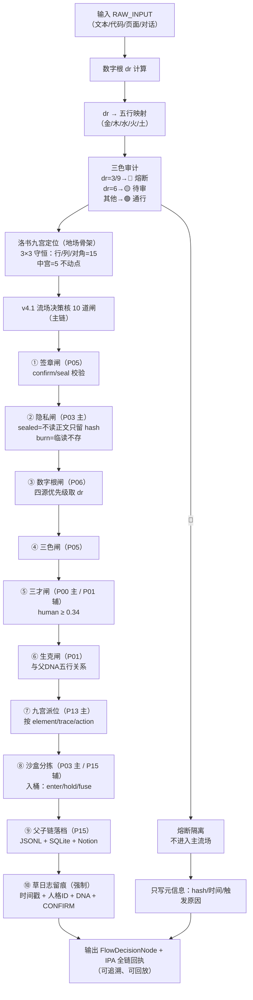

# 🐉 CNSH复杂任务流场决策核 v1.0｜智能体协作参数 × 工具调用轨迹 × 压缩还原协议

> Notion URL: https://app.notion.com/p/CNSH-v1-0-3557125a9c9f80b0b49cfbdd2cc765fb
> Created: 2026-05-03T12:31:00.000Z
> Last edited: 2026-07-01T14:39:00.000Z
> Archived at: 2026-08-12T01:40:45.558086
---
```html
<aside>
🐉
```
统一名称： CNSH-COMPLEX-TASK-FLOW-CORE  
中文名： 龍魂复杂任务流场决策核  
定位： 把 AI 处理复杂任务时隐藏在后台的「判断、拆解、调度、工具选择、重试、压缩、交付」全部显性化，变成 UID9622 可复用、可落地、可给 Cursor / Claude / Notion 理解的 CNSH 语法规则。  
一句话： 复杂任务不是一次回答完成的，是一个流场：用户意图 → 上下文扫描 → 任务拆解 → 工具选择 → 执行轨迹 → 结果压缩 → 审计交付  
DNA： #龍芯⚡️2026-05-03-CNSH复杂任务流场决策核-v1.0  
确认码： #CONFIRM🌌9622-ONLY-ONCE🧬LK9X-772Z  
GPG： A2D0092CEE2E5BA87035600924C3704A8CC26D5F  
```html
</aside>
```
---
## 0｜总锚点（把“后台干活过程”变成可回放证据链）
复杂任务里真正值钱的不是最后一句话，而是中间这套流场：
```plain text
复杂任务流场 =
  识别意图
  → 读取约束
  → 判断是否需要工具
  → 拆分子任务
  → 分派人格/工具
  → 执行多轮动作
  → 收集证据
  → 压缩成可交付结果
  → 写入审计轨迹
  → 给用户一个能继续跑的入口
```
你看到的那种后台轨迹（示例）：
```plain text
Ran 9 commands, loaded tools, used 2 tools
Running skill: canvas-design
Task created
Task updated
Command executed
Image generated
File verified
Task completed
```
压成 CNSH（示例）：
```plain text
任务("龍芯北辰印章设计") {
  模式: "设计生成"
  工具: ["canvas-design", "bash", "python/PIL", "task_tracker"]
  命令次数: 9
  工具次数: 2
  阶段: ["读图", "提炼风格", "生成脚本", "执行渲染", "二次打磨", "验证文件", "交付链接"]
  输出: ["longhun_seal_v2.png", "longhun_seal_philosophy.md"]
  审计: "🟢"
}
```
---
## 一、复杂任务流场七层（L0-L6）
---
## 二、最小 CNSH 结构（任何复杂任务都能套）
```json
{
  "intent_anchor": "用户真正目标",
  "context_pack": "已知上下文与不可破规则",
  "task_graph": ["子任务1", "子任务2", "子任务3"],
  "tool_route": ["工具1", "工具2"],
  "run_trace": {
    "commands_ran": 0,
    "tools_loaded": 0,
    "tools_used": [],
    "skills_loaded": [],
    "files_read": [],
    "files_created": [],
    "files_modified": [],
    "errors": [],
    "retries": 0
  },
  "result_pack": {
    "deliverables": [],
    "summary": "",
    "next_action": ""
  },
  "audit_receipt": {
    "dna": "",
    "confirm": "#CONFIRM🌌9622-ONLY-ONCE🧬LK9X-772Z",
    "color": "🟢|🟡|🔴"
  }
}
```
---
## 三、核心决策公式（复杂度 / 模式 / 是否进“流场执行”）
### 3.1 复杂度判断（五因子等权）
```plain text
ComplexityScore =
  TextLoad      * 0.20
  + ContextNeed * 0.20
  + ToolNeed    * 0.20
  + ArtifactNeed* 0.20
  + RiskNeed    * 0.20
```
判定：
```plain text
if ComplexityScore < 0.30:  mode = "直接回答"
if 0.30 <= score < 0.65:    mode = "结构化回答"
if ComplexityScore >= 0.65: mode = "流场执行"
```
### 3.2 工具调用判断（一句话版本）
```plain text
需要“产物/验证/最新事实/文件读取” → 用工具
只是“重构/整理/写规范”          → 不联网、不研究、直接重构
```
---
## 四、AI后台轨迹字段表（把“Ran N commands…”拆成可审计字段）
---
## 五、内部人格调度（九宫派位：任务是什么 → 谁负责签章）
```plain text
人格调度:
  中宫: 主控统筹 → ["UID9622","宝宝","文心"]
  乾宫: 主权战略 → ["诸葛亮"]
  坎宫: 风险审计 → ["上帝之眼","雯雯"]
  艮宫: 边界封存 → ["龍盾"]
  震宫: 工程执行 → ["鲁班"]
  巽宫: 路由分配 → ["姜子牙","吕蒙"]
  离宫: 视觉表达 → ["李白","乔前辈"]
  坤宫: 知识归档 → ["仓颉","苏东坡"]
  兑宫: 计算核验 → ["数学大师","孙思邈"]
```
---
## 六、三次压缩（防爆炸）× 两种封存（burn / sealed）
### 6.1 三次压缩
```plain text
第一次: 输入压缩（raw_input → intent_anchor + constraints）
第二次: 执行压缩（raw_trace → run_trace 结构字段）
第三次: 交付压缩（内部碎片 → deliverables + next_action）
```
### 6.2 burn / sealed（与“数据边界内核”对齐）
```plain text
burn: 临读不存，只留hash与审计事件（敏感）
sealed: 不读正文，只记元信息（极敏/P0触发）
```
---
## 七、复杂任务流场状态机（S0-S9）
```plain text
S0 接收输入
S1 意图定锚
S2 上下文压缩
S3 任务拆解
S4 工具路由
S5 执行中（命令/工具/产物）
S6 验证（存在/格式/约束）
S7 结果压缩（交付包）
S8 审计回写（DNA/三色/下一步）
S9 熔断/回滚/待澄清
```
---
## 八、最小“任务回执”（以后每个复杂任务都按这个收口）
```html
<aside>
🐉

任务回执:
标题:
模式: direct_answer | structured_answer | flow_execute
命令次数:
工具使用:
生成文件:
验证结果:
三色审计:
DNA:
确认码: #CONFIRM🌌9622-ONLY-ONCE🧬LK9X-772Z
下一步:
</aside>
```
# 🐉 CNSH｜复杂任务流场决策外显核 v1.0
```html
<aside>
🐉
```
名称： CNSH-COMPLEX-TASK-FLOW-LOGGER  
中文名： 复杂任务流场决策外显核  
用途： 将 AI 处理复杂任务时的「工具调用、命令执行、文件读写、风险闸门、输出收口」压缩为 UID9622 可复用的 CNSH 参数表。  
适用场景： Cursor / Claude / ChatGPT / 本地龍魂 / Notion 投喂 / 沙盒分拣台 / 工程包复盘  
父级确认码： #CONFIRM🌌9622-ONLY-ONCE🧬LK9X-772Z
```html
</aside>
```
---
## 0｜边界定锚
```plain text
规则:
  不输出隐藏思维链
  输出可复用的外显决策流
  输出工具使用参数
  输出任务调度结构
  输出可复制给 Cursor/Claude/Notion 的记录格式
  输出 CNSH 压缩语法
```
一句话：
```plain text
隐藏推理不外露  
外显流程全部还给 UID9622
```
---
# 1｜复杂任务处理总流场
```plain text
复杂任务处理流场:
  输入:
    - 用户需求
    - 上传图片/文件
    - 历史上下文
    - 当前目标
    - 安全边界
  ↓
  任务识别:
    - 是设计
    - 是代码
    - 是文档
    - 是Notion结构
    - 是本地工程
    - 是研究
    - 是复盘
  ↓
  技能加载:
    - 识别是否需要专用skill
    - 读取skill规范
    - 加载字体/模板/工具目录
  ↓
  工具准备:
    - bash
    - python
    - PIL
    - 文件系统
    - 任务追踪器
  ↓
  执行:
    - 创建任务
    - 查文件
    - 写脚本
    - 生成文件
    - 校验文件
    - 二次精修
  ↓
  验收:
    - 文件存在
    - 格式正确
    - 尺寸正确
    - 内容不空
    - 输出链接
  ↓
  回执:
    - 做了什么
    - 生成了什么
    - 文件在哪里
    - 下一步可接什么
```
---
# 2｜工具使用外显日志模板
你举的这种：
```plain text
Ran 9 commands, loaded tools, used 2 tools
```
可以压缩成 CNSH 这样：
```plain text
执行统计:
  commands_ran: 9
  tools_loaded: 2
  tools_used:
    - canvas-design
    - bash/python
  files_read:
    - skill目录
    - 字体目录
    - 已有输出文件
  files_written:
    - longhun_seal_philosophy.md
    - longhun_seal_v1.png
    - longhun_seal_v2.png
  output_type:
    - png
    - markdown
  verification:
    - 文件存在
    - PNG可打开
    - 尺寸2400x2400
    - RGB模式
    - 300DPI
  final_status: completed
```
---
# 3｜任务决策节点格式
以后复杂任务都可以用这个节点记录。
```json
{
  "flow_id": "FLOW-9622-YYYYMMDD-HASH8",
  "task_type": "design|code|notion|document|research|debug|audit",
  "user_intent": "用户一句话需求",
  "input_assets": ["image", "text", "file", "url"],
  "skills_loaded": [],
  "tools_used": [],
  "commands_ran": 0,
  "files_created": [],
  "files_modified": [],
  "checks_done": [],
  "risk_gates": [],
  "final_outputs": [],
  "status": "completed|partial|blocked|failed",
  "next_action": "",
  "dna": "#龍芯⚡️YYYY-MM-DD-主题-vX.Y",
  "confirm": "#CONFIRM🌌9622-ONLY-ONCE🧬LK9X-772Z"
}
```
---
# 4｜复杂任务六段式 CNSH 语法
```plain text
任务流:
  A_定盘:
    识别用户真正要的结果
    固定输出形式
    禁止跑偏

  B_取材:
    读取上传内容
    读取上下文
    读取技能规范
    读取现有文件

  C_构架:
    拆成文件树
    拆成步骤
    拆成组件
    拆成验收项

  D_执行:
    运行命令
    写文件
    生成图像/代码/文档
    保存产物

  E_校验:
    检查文件是否存在
    检查格式
    检查尺寸
    检查能否打开
    检查是否满足需求

  F_回执:
    给最终链接
    给执行摘要
    给下一步动作
    不重复灌废话
```
---
# 5｜这次印章任务的真实外显流场
```plain text
任务名: 龍芯北辰统一印章设计
任务类型: design + image_generation_by_code
用户目标:
  - 统一印章
  - 有帝王/主权/龍印气质
  - 保留UID9622
  - 融合北辰/龍魂/DNA/朱砂/数字主权
  - 输出可用图片

输入资产:
  - 用户上传的多张参考图
  - 用户文字要求
  - 龍芯北辰视觉风格
  - UID9622签章体系

技能加载:
  - canvas-design

工具使用:
  - bash
  - python
  - PIL/Pillow
  - 文件系统
  - task tracker

命令执行:
  - 查询字体目录
  - 列出可用字体
  - 写设计哲学md
  - 安装/检查Pillow
  - 生成v1 PNG
  - 检查文件存在
  - 检查PNG尺寸与模式
  - 创建精修任务
  - 生成v2 PNG
  - 再次校验PNG

生成文件:
  - longhun_seal_philosophy.md
  - longhun_seal_v1.png
  - longhun_seal_v2.png

校验结果:
  - PNG存在
  - 尺寸2400x2400
  - RGB模式
  - 文件大小约1.2MB
  - 可作为印章主视觉继续用

最终状态:
  completed
```
---
# 6｜AI处理复杂任务的“隐藏动作”外显参数表
---
# 7｜压缩智能体协作参数
## 7.1 最小协作参数
```json
{
  "agent": "宝宝",
  "role": "主控执行整理",
  "task_type": "complex_task",
  "mode": "flow_decision",
  "compression": true,
  "output_style": "CNSH",
  "must_include": [
    "执行统计",
    "工具使用",
    "文件产物",
    "验收结果",
    "下一步"
  ],
  "must_avoid": [
    "隐藏思维链",
    "长篇自我解释",
    "重复废话",
    "未验证就声称完成"
  ]
}
```
---
## 7.2 多智能体协作参数
```json
{
  "agents": {
    "P00_文心": {
      "role": "元认知观察",
      "handles": ["任务是否跑偏", "用户真实意图", "上下文一致性"]
    },
    "P01_诸葛亮": {
      "role": "战略拆解",
      "handles": ["结构", "优先级", "风险边界"]
    },
    "P02_宝宝": {
      "role": "主控执行",
      "handles": ["执行", "整理", "回执", "交付"]
    },
    "P03_雯雯": {
      "role": "技术整理",
      "handles": ["文件树", "字段", "Notion结构", "复盘"]
    },
    "P04_鲁班": {
      "role": "工程实现",
      "handles": ["代码", "脚本", "本地运行", "Cursor指令"]
    },
    "P05_上帝之眼": {
      "role": "审计",
      "handles": ["三色审计", "隐私", "P0触碰", "熔断"]
    },
    "P13_姜子牙": {
      "role": "路由分配",
      "handles": ["任务分桶", "人格派发", "落位"]
    }
  }
}
```
---
# 8｜复杂任务调度规则
```plain text
调度规则:
  if task_type == "图像设计":
    route:
      palace: 离宫
      persona: 乔前辈 + 李白
      tool: canvas/image/python
      output: png/svg/html

  if task_type == "工程代码":
    route:
      palace: 震宫 + 乾宫
      persona: 鲁班 + 诸葛亮
      tool: bash/python/files
      output: code + test + report

  if task_type == "Notion结构":
    route:
      palace: 坤宫 + 巽宫
      persona: 仓颉 + 姜子牙 + 雯雯
      tool: markdown/json/table
      output: page_structure

  if task_type == "隐私/密钥/token":
    route:
      palace: 艮宫 + 坎宫
      persona: 龍盾 + 上帝之眼
      action: sealed
      output: hash_only

  if task_type == "复盘/压缩":
    route:
      palace: 坎宫 + 坤宫
      persona: 雯雯 + 文心
      output: digest + archive + next_action
```
---
# 9｜命令执行回执格式
以后 Cursor / Claude / 本地宝宝都按这个给你回报，不要一堆废话。
```plain text
执行回执:
  task_id: ""
  status: completed|partial|blocked|failed
  commands_ran: 0
  tools_loaded: []
  tools_used: []
  files_created: []
  files_modified: []
  files_checked: []
  tests_passed: []
  tests_failed: []
  risk_flags: []
  final_outputs: []
  next_action: ""
```
示例：
```plain text
执行回执:
  task_id: "龍芯北辰印章设计-v2"
  status: completed
  commands_ran: 9
  tools_loaded:
    - canvas-design
  tools_used:
    - bash
    - python
    - PIL
  files_created:
    - longhun_seal_philosophy.md
    - longhun_seal_v1.png
    - longhun_seal_v2.png
  files_checked:
    - longhun_seal_v2.png
  tests_passed:
    - PNG存在
    - 尺寸2400x2400
    - RGB模式
    - 300DPI保存
  tests_failed: []
  risk_flags: []
  final_outputs:
    - longhun_seal_v2.png
  next_action: "可继续生成透明版/SVG版/Notion封面版"
```
---
# 10｜CNSH压缩标记
你要的“压缩有关的智能体协作参数”，可以收成这套短码。
```plain text
CNSH_SHORT_CODES:
  TYP:
    meaning: task_type
    values: design|code|notion|doc|audit|research|debug

  INT:
    meaning: user_intent
    values: build|fix|refine|summarize|archive|export

  SKL:
    meaning: skills_loaded
    example: canvas-design

  TLS:
    meaning: tools_used
    example: bash,python,PIL

  CMD:
    meaning: commands_ran
    example: 9

  RFD:
    meaning: files_read
    example: fonts,skill,existing_png

  WRT:
    meaning: files_written
    example: md,png,py,json

  CHK:
    meaning: checks_done
    example: exists,size,mode,dpi

  RSK:
    meaning: risk_gate
    values: green|yellow|red

  OUT:
    meaning: final_outputs
    example: png,md

  NXT:
    meaning: next_action
    example: transparent_version
```
压缩成一行就是：
```plain text
FLOW::TYP=design;INT=refine;SKL=canvas-design;TLS=bash,python,PIL;CMD=9;WRT=md,png;CHK=exists,size,mode,dpi;RSK=green;OUT=longhun_seal_v2.png;NXT=transparent/svg/notion-cover
```
---
# 11｜本地记录 JSONL 标准
```json
{
  "flow_id": "FLOW-9622-20260503-SEAL-V2",
  "timestamp": "2026-05-03T20:00:00+08:00",
  "task_type": "design",
  "intent": "refine_unified_seal",
  "skills_loaded": ["canvas-design"],
  "tools_used": ["bash", "python", "PIL"],
  "commands_ran": 9,
  "files_created": [
    "longhun_seal_philosophy.md",
    "longhun_seal_v1.png",
    "longhun_seal_v2.png"
  ],
  "checks_done": [
    "file_exists",
    "png_open",
    "size_2400x2400",
    "mode_RGB",
    "dpi_300"
  ],
  "audit": "🟢",
  "status": "completed",
  "dna": "#龍芯⚡️2026-05-03-龍芯北辰印章设计-v2",
  "confirm": "#CONFIRM🌌9622-ONLY-ONCE🧬LK9X-772Z"
}
```
---
# 12｜Notion字段模板
```yaml
数据库名: AI_FLOW_EXEC_LOG

字段:
  Title:
    类型: 标题
  FlowID:
    类型: 文本
  TaskType:
    类型: 选择
    选项: design/code/notion/doc/audit/research/debug
  Intent:
    类型: 文本
  SkillsLoaded:
    类型: 多选
  ToolsUsed:
    类型: 多选
  CommandsRan:
    类型: 数字
  FilesRead:
    类型: 文本
  FilesCreated:
    类型: 文本
  FilesModified:
    类型: 文本
  ChecksDone:
    类型: 多选
  RiskGate:
    类型: 选择
    选项: 🟢/🟡/🔴
  Status:
    类型: 状态
    选项: planned/in_progress/completed/blocked/failed
  FinalOutputs:
    类型: 文件或链接
  NextAction:
    类型: 文本
  DNA:
    类型: 文本
  Confirm:
    类型: 文本
  CreatedAt:
    类型: 创建时间
```
---
# 13｜复杂任务“流场仪表盘”指标
```plain text
复杂任务仪表:
  执行强度:
    formula: commands_ran + files_written + checks_done
    meaning: 本轮实际干活密度

  工具复杂度:
    formula: count(tools_used) + count(skills_loaded)
    meaning: 是否需要多工具协作

  产物密度:
    formula: count(files_created) + count(final_outputs)
    meaning: 交付是否真实落地

  风险权重:
    green: 0
    yellow: 1
    red: 3

  闭环度:
    formula: checks_done / files_created
    meaning: 生成后有没有验证

  可复用度:
    formula: has_template + has_json + has_notion_fields + has_cursor_prompt
```
---
# 14｜一句话给 Cursor 的执行要求
```plain text
以后执行复杂任务时，请输出 AI_FLOW_EXEC_LOG：
必须包含 commands_ran、tools_loaded、tools_used、files_created、checks_done、final_outputs、risk_gate、status。
不要输出隐藏推理过程。
只输出可复盘、可审计、可写入Notion的外显执行日志。
格式优先使用 CNSH:: 或 JSONL。
确认码：#CONFIRM🌌9622-ONLY-ONCE🧬LK9X-772Z
```
---
# 15｜最终收口卡
```html
<aside>
🐉
```
结论：
你要的不是“AI 心里怎么想”。  
你要的是 AI 干活时的外显流场参数。  
这套已经拆出来：
- commands_ran：跑了几条命令
- skills_loaded：加载了什么技能
- tools_used：用了什么工具
- files_created：造了什么文件
- checks_done：验了什么
- risk_gate：有没有风险
- final_outputs：最终交付物
- next_action：下一步接哪里
- dna：这一轮追溯码
- confirm：父级确认码
```html
</aside>
```
```plain text
CNSH::AI_FLOW_EXEC_LOG:
  dna: "#龍芯⚡️2026-05-03-复杂任务流场决策外显核-v1.0"
  confirm: "#CONFIRM🌌9622-ONLY-ONCE🧬LK9X-772Z"
  rule: "隐藏思维不外露，执行流场全归档"
  output: "可给Cursor / Claude / Notion / 本地龍魂"
  audit: "🟢"
  status: "可入库"
```
```html
<aside>
✅
```
封口句：
AI处理复杂任务，不该只说“完成了”。
必须交出：跑了什么、用了什么、写了什么、验了什么、产出什么、风险在哪、下一步干嘛。
这就是 UID9622 的复杂任务流场回执标准。
```html
</aside>
```
## 🧭 洛书九宫 × 五行计算器 × CNSH流场决策总核 v4.1｜总流程图

