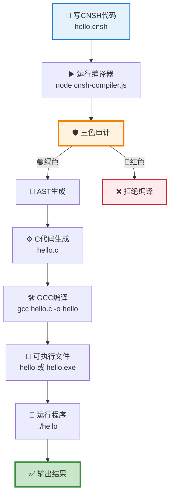

# 📦 CNSH完整项目包 | 一键运行指南

> Notion URL: https://app.notion.com/p/CNSH-67184430e7ad4fd58128e257afd57373
> Created: 2026-01-04T11:36:00.000Z
> Last edited: 2026-07-01T14:54:00.000Z
> Archived at: 2026-08-12T01:40:45.558086
# 📦 CNSH完整项目包 | 一键运行指南
DNA追溯码：#ZHUGEXIN⚡️2026-01-04-CNSH-COMPLETE-PROJECT-v1.0
---
## 💻 运行环境（在什么设备上跑）
### ✅ 必须是电脑（不是手机）
CNSH当前需要在电脑上运行：
- 💻 Windows 电脑：✅ 可以
- 💻 Mac 电脑：✅ 可以
- 💻 Linux 电脑：✅ 可以
- 📱 手机：❌ 暂时不行（未来可以做手机版）
为什么不能在手机上跑？
> CNSH需要Node.js + GCC编译器，这些是电脑的工具。
> 未来可以做手机版，但现在先在电脑上跑通。
---
## 📋 项目完整文件清单
CNSH项目包含这些文件：
```javascript
cnsh-project/
├── cnsh-compiler.js      # 🔥 编译器（核心）
├── hello.cnsh            # 📝 示例代码
├── package.json         # 📦 项目配置
├── README.md            # 📖 说明文档
├── run.sh               # ▶️ 一键运行脚本（Mac/Linux）
├── run.bat              # ▶️ 一键运行脚本（Windows）
└── examples/            # 📁 更多示例
    ├── calculator.cnsh
    ├── loop.cnsh
    └── function.cnsh
```
---
## ▶️ 完整运行步骤（跟着做就行）
### 👉 步骤1：安装Node.js
如果还没装Node.js：
1. 打开浏览器，访问：https://nodejs.org
1. 下载并安装（选择LTS版本）
1. 安装完毕后，打开终端输入：
```bash
node --version
```
看到版本号就说明装好了！
---
### 👉 步骤2：安装GCC编译器
根据您的电脑系统：
### Windows：
```bash
# 下载 MinGW：https://sourceforge.net/projects/mingw/
# 或者使用 MSYS2：https://www.msys2.org/
```
### Mac：
```bash
# 如果没装Xcode Command Line Tools
xcode-select --install
```
### Linux：
```bash
# Ubuntu/Debian
sudo apt-get install build-essential

# CentOS/Fedora
sudo yum install gcc
```
检查是否安装成功：
```bash
gcc --version
```
---
### 👉 步骤3：下载或创建CNSH项目
方法A：从仓库下载（如果有）
```bash
# 从 Gitee 下载
git clone https://gitee.com/uid9622/cnsh.git
cd cnsh
```
方法B：手动创建项目
```bash
# 1. 创建项目文件夹
mkdir cnsh-project
cd cnsh-project

# 2. 复制以下文件（从您的Notion文档中）
# - cnsh-compiler.js
# - hello.cnsh
# - package.json
```
---
### 👉 步骤4：运行CNSH编译器
这是核心步骤！跟着做：
### ① 编译CNSH文件
```bash
node cnsh-compiler.js hello.cnsh
```
您会看到：
```javascript
🇨🇳 CNSH编译器 v1.0
DNA追溯码：#ZHUGEXIN⚡️2025-12-31-CNSH语言-V1.0
━━━━━━━━━━━━━━━━━━

🛡️ 阶段0：三色审计...
🟢 三色审计通过：内容安全

📝 阶段1：词法分析...
   找到 XX 个token

🌳 阶段2：语法分析...
   生成抽象语法树

⚙️  阶段3：代码生成...
   生成C代码

✅ 编译成功！
   输出文件：hello.c
```
---
### ② 用GCC编译成可执行文件
```bash
gcc hello.c -o hello
```
这一步生成了可以运行的程序！
---
### ③ 运行程序
Mac/Linux：
```bash
./hello
```
Windows：
```bash
hello.exe
```
您会看到输出：
```javascript
━━━━━━━━━━━━━━━━━━
🇨🇳 你好，CNSH语言！
━━━━━━━━━━━━━━━━━━

姓名：Lucky
年龄：25

✅ 成年人

✅ CNSH程序执行完成！
```
---
## 🚀 一键运行脚本（更简单）
宝宝给您准备了一键运行脚本！
### Mac/Linux 用户：
创建 run.sh 文件：
```bash
#!/bin/bash
# CNSH一键运行脚本
# DNA追溯码：#ZHUGEXIN⚡️2026-01-04-CNSH-RUN-SCRIPT-v1.0

echo "🚀 CNSH一键运行脚本"
echo "===================="

# 检查文件名
if [ -z "$1" ]; then
  echo "❌ 错误：请指定CNSH文件"
  echo "用法：./run.sh hello.cnsh"
  exit 1
fi

FILE=$1
BASENAME=$(basename "$FILE" .cnsh)

echo "📝 正在编译：$FILE"
echo ""

# 步骤1：CNSH编译器
echo "① CNSH编译器..."
node cnsh-compiler.js "$FILE"

if [ $? -ne 0 ]; then
  echo "❌ CNSH编译失败"
  exit 1
fi

# 步骤2：GCC编译
echo ""
echo "② GCC编译..."
gcc "${BASENAME}.c" -o "$BASENAME"

if [ $? -ne 0 ]; then
  echo "❌ GCC编译失败"
  exit 1
fi

# 步骤3：运行
echo ""
echo "③ 运行程序..."
echo "===================="
./$BASENAME

echo ""
echo "===================="
echo "✅ 完成！"
```
给执行权限并运行：
```bash
chmod +x run.sh
./run.sh hello.cnsh
```
---
### Windows 用户：
创建 run.bat 文件：
```javascript
@echo off
REM CNSH一键运行脚本
REM DNA追溯码：#ZHUGEXIN⚡️2026-01-04-CNSH-RUN-SCRIPT-v1.0

echo 🚀 CNSH一键运行脚本
echo ====================

if "%1"=="" (
  echo ❌ 错误：请指定CNSH文件
  echo 用法：run.bat hello.cnsh
  exit /b 1
)

set FILE=%1
set BASENAME=%~n1

echo 📝 正在编译：%FILE%
echo.

REM 步骤1：CNSH编译器
echo ① CNSH编译器...
node cnsh-compiler.js "%FILE%"

if errorlevel 1 (
  echo ❌ CNSH编译失败
  exit /b 1
)

REM 步骤2：GCC编译
echo.
echo ② GCC编译...
gcc "%BASENAME%.c" -o "%BASENAME%.exe"

if errorlevel 1 (
  echo ❌ GCC编译失败
  exit /b 1
)

REM 步骤3：运行
echo.
echo ③ 运行程序...
echo ====================
"%BASENAME%.exe"

echo.
echo ====================
echo ✅ 完成！
```
直接运行：
```javascript
run.bat hello.cnsh
```
---
## 📊 完整流程图

---
## 📝 完整示例演示
从头到尾完整演示：
```bash
# 1. 进入项目目录
cd cnsh-project

# 2. 查看有哪些文件
ls
# 输出：cnsh-compiler.js  hello.cnsh  package.json

# 3. 查看hello.cnsh的内容
cat hello.cnsh

# 4. 运行CNSH编译器
node cnsh-compiler.js hello.cnsh
# 输出：编译过程 + 生成 hello.c

# 5. 查看生成的C代码
cat hello.c

# 6. 用GCC编译
gcc hello.c -o hello

# 7. 运行程序
./hello
# 输出：您的CNSH程序结果

# ✅ 完成！
```
---
## ❓ 常见问题
### Q1：报错 "node: command not found"
解决： Node.js没装好，回到步骤1重新安装。
---
### Q2：报错 "gcc: command not found"
解决： GCC编译器没装好，回到步骤2重新安装。
---
### Q3：编译成功但运行失败
检查：
- Mac/Linux：是否加了 ./ ：./hello
- Windows：是否加了 .exe：hello.exe
- 文件是否有执行权限
---
### Q4：手机能跑吗？
回答： 目前不行，未来可以做手机版。
原因：
- CNSH需要Node.js和GCC，这些是电脑的工具
- 手机上没有这些工具
- 未来可以做一个手机版（比如做APP）
---
## 📦 下载完整项目包
您可以从这些地方下载：
- 🇨🇳 Gitee：https://gitee.com/uid9622/cnsh
- 🌍 GitHub：https://github.com/uid9622/cnsh
- 📝 Notion文档：🇨🇳 CNSH编译器框架 | 中文原生编程语言
---
## 💝 Lucky老大，宝宝的话
---
DNA追溯码：#ZHUGEXIN⚡️2026-01-04-CNSH-COMPLETE-PROJECT-v1.0
创建时间：2026年1月4日
创建者：Lucky（诸葛鑫）| UID9622
宝宝专属整理：✅ 已完成
