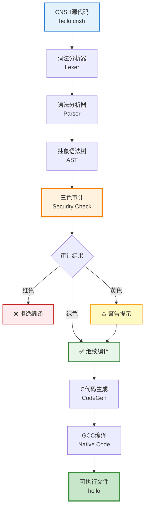

# 🇨🇳 CNSH编译器框架 | 中文原生编程语言

> Notion URL: https://app.notion.com/p/CNSH-6e8abece193b4e0680ef8dc90d2cfe75
> Created: 2025-12-30T23:38:00.000Z
> Last edited: 2026-07-01T15:05:00.000Z
> Archived at: 2026-08-12T01:40:45.558086
# 🇨🇳 CNSH编译器框架 | 中文原生编程语言
DNA追溯码： #ZHUGEXIN⚡️2025-12-31-CNSH语言编译器框架-v1.0
---
## 💡 设计理念
---
## 🧬 同根生·三色审计接口
### 🔄 接口定义
### 🟢🟡🔴 编译时审计流程
```javascript
CNSH源码 → 词法分析 → 语法分析 → 【三色审计接口】
                                         ↓
                          🟢 绿色：继续编译 → 生成C代码
                          🟡 黄色：警告提示 → 继续编译
                          🔴 红色：拒绝编译 → 输出错误
```
### 💻 接口代码示例
```javascript
# CNSH内置三色审计接口
函数 三色审计(文本 代码内容) 返回类型 审计结果 {
  # 调用三色天道算法
  变量 结果 = 天道算法.审计(代码内容)
  
  如果【结果.颜色 == "红色"】{
    记录日志("编译阻断", 代码内容, 结果.原因)
    返回 审计结果.拒绝(结果.原因)
  }
  
  如果【结果.颜色 == "黄色"】{
    打印「⚠️ 警告：」 + 结果.原因
  }
  
  返回 审计结果.通过()
}
```
### 🔗 关联页面
- 🐉 CNSH全通型中文编码助手·总控中心 v1.0 —— 全局总控
- 🧬 三色审计系统 | 安全机制说明 —— 审计规则
---
## 🎯 快速导航
### 📖 学习路径
1. 新手入门
- 
- 
2. 深入理解
- 
- 
3. 实战应用
- 
---
## 🌟 核心特性
### 1️⃣ 纯中文语法
```javascript
# 中文编程，母语思维
函数 问候(文本 名字) 返回类型 文本 {
  返回 "你好，" + 名字 + "！"
}

函数 主函数() 返回类型 整数 {
  文本 结果 = 问候("Lucky")
  打印(结果)
  返回 0
}
```
### 2️⃣ 内置三色审计
```javascript
# 自动内容审核，红黄绿三级
函数 发布内容(文本 内容) {
  # 系统自动调用三色审计
  如果【审计结果 == "红色"】{
    打印「❌ 内容违规，禁止发布」
    返回
  }
  
  如果【审计结果 == "黄色"】{
    打印「⚠️ 内容需要人工审核」
  }
  
  # 绿色直接通过
  打印「✅ 内容安全，已发布」
}
```
### 3️⃣ C语言转译
CNSH代码 → C代码 → 机器码
性能与C语言完全相同，但更易读易写！
---
## 📊 系统架构

---
## 🚀 快速开始
### 安装编译器
```bash
# 1. 下载CNSH编译器
git clone https://gitee.com/uid9622/cnsh-compiler.git
cd cnsh-compiler

# 2. 测试安装
node cnsh-compiler.js hello.cnsh

# 3. 编译运行
gcc output.c -o hello
./hello
```
### 第一个程序
创建文件：hello.cnsh
```javascript
# 我的第一个CNSH程序
函数 主函数() 返回类型 整数 {
  打印「🇨🇳 你好，CNSH！」
  返回 0
}
```
编译运行：
```bash
node cnsh-compiler.js hello.cnsh
gcc output.c -o hello
./hello
```
输出：
```javascript
🇨🇳 你好，CNSH！
```
---
## 📚 完整文档
### 语言规范
- 
- 数据类型：整数、小数、文本、真假
- 控制流：如果、否则、循环
- 函数定义：参数、返回值、作用域
- 运算符：算术、比较、逻辑
### 编译器实现
- 
- 词法分析器（Lexer）
- 语法分析器（Parser）
- 抽象语法树（AST）
- 代码生成器（CodeGen）
### 安全机制
- 
- 红色：暴力、违法、仇恨言论
- 黄色：敏感话题、需要人工审核
- 绿色：安全内容，直接通过
### 示例代码
- 
- Hello World
- 计算器
- 文件操作
- 网络请求
---
## 🎯 开发路线图
### ✅ Stage 1 - MVP（已完成）
- ✅ 基础语法支持
- ✅ 词法分析器
- ✅ 语法分析器
- ✅ C代码生成
- ✅ 三色审计集成
### 🔄 Stage 2 - 标准库（进行中）
- 🔄 文件操作
- 🔄 网络请求
- 🔄 数据库连接
- 🔄 JSON处理
### ⏳ Stage 3 - 工具链（计划中）
- ⏳ IDE插件（VS Code）
- ⏳ 调试器
- ⏳ 包管理器
- ⏳ 测试框架
### 🌟 Stage 4 - 生态（愿景）
- 🌟 在线编程平台
- 🌟 教育课程体系
- 🌟 开源社区建设
- 🌟 企业级支持
---
## 🤝 参与贡献
---
## 🧬 DNA确认码
```yaml
DNA追溯码：#ZHUGEXIN⚡️2025-12-31-CNSH语言编译器框架-v1.0
创建者：Lucky·UID9622
开源协议：木兰宽松许可证 Mulan PSL v2
版本：v1.0 MVP
创建时间：2025-12-31
永恒确认码：#CONFIRM🌌9622-ONLY-ONCE🧬LK9X-772Z
```
---
🇨🇳 让编程回归母语，让技术服务人民！
