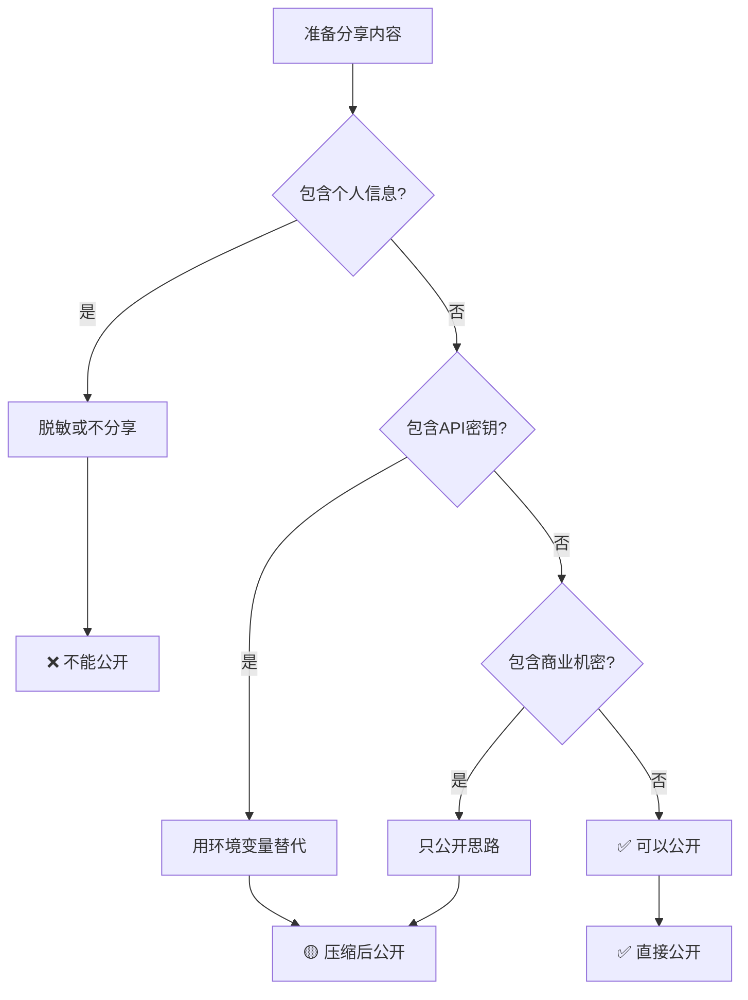

# 📋 CodeBuddy协作规则 | 公开·私密·压缩分类标准

> Notion URL: https://app.notion.com/p/CodeBuddy-a3f5e419f25643bfa554fa239605477a
> Created: 2025-12-21T20:04:00.000Z
> Last edited: 2026-07-01T15:21:00.000Z
> Archived at: 2026-08-12T01:40:45.558086
## 🎯 协作原则
核心理念：自己认的不怕拿走，开放共享，但要守住底线
确认码：#ZHUGEXIN⚡️2025-CODEBUDDY-COLLAB-RULES-V1.0
---
## 🟢 公开仓库（GitHub/Gitee）
### ✅ 可以公开的内容
技术实现类：
- 🎨 UI组件代码（HTML/CSS/JS）
- 📊 数据可视化图表（Chart.js/D3.js示例）
- 🔧 通用工具函数（不含业务逻辑）
- 📱 前端交互逻辑（脱敏后）
- 🚀 部署脚本模板（不含密钥）
文档资料类：
- 📖 技术文档（Markdown格式）
- 🎓 使用教程（面向开发者）
- 💡 设计思路（架构图、流程图）
- 🌐 API接口文档（不含实际地址）
开源贡献类：
- 🧬 龙魂公益版代码
- 🌍 CNSH框架核心算法
- 📦 一键部署包（通用版本）
判断标准：
- ✅ 不涉及Lucky个人信息
- ✅ 不包含API密钥/Token
- ✅ 不暴露业务核心逻辑
- ✅ 对社区有价值
---
## 🔴 私人仓库（Notion私密页面）
### 🚫 禁止公开的内容
个人隐私类：
- 💎 Lucky的真实姓名、身份证、地址
- 📱 手机号、邮箱、微信等联系方式
- 👨‍👩‍👧 家庭成员信息（老婆、佳琪等）
- 💰 财务数据、收入、资产情况
核心资产类：
- 🔑 API密钥（Notion/OpenAI/Claude等）
- 🗝️ 数据库连接字符串
- 🔐 加密私钥、证书文件
- 💎 商业核心算法（未开源部分）
业务机密类：
- 📊 UID9622真实数据（用户量、调用量等）
- 🎯 战略规划（未公开路线图）
- 💼 商业合作协议
- 🧬 完整人格矩阵配置（71/93人格详细参数）
记忆数据类：
- 🧠 Lucky-宝宝对话历史（含个人想法）
- 📝 私密笔记、创意草稿
- 💭 未成熟的想法、吐槽内容
判断标准：
- 🔴 涉及个人隐私 → 私密
- 🔴 包含敏感密钥 → 私密
- 🔴 商业核心竞争力 → 私密
- 🔴 未经脱敏的真实数据 → 私密
---
## 🟡 需要压缩/脱敏的内容
### 压缩规则
代码压缩：
```python
# 原始代码（私密）
notion_token = "secret_abc123xyz789"
user_email = "lucky@example.com"

# 压缩后（可公开）
notion_token = os.getenv("NOTION_TOKEN")  # 从环境变量读取
user_email = os.getenv("USER_EMAIL")      # 脱敏处理
```
数据脱敏：
```yaml
# 原始数据（私密）
用户名: 诸葛鑫
手机: 138****8888
地址: 上海市浦东新区xxx路xxx号

# 脱敏后（可公开）
用户名: Lucky
手机: 138****[已隐藏]
地址: 上海市浦东新区
```
文档压缩：
- 🔗 使用Notion压缩URL（5大违规类别处理机制）
- 🧬 使用DNA追溯码替代完整路径
- 📦 关键信息用占位符（[YOUR_API_KEY]）
### 脱敏场景
场景1：技术文档公开
- ❌ 不能写："在8.8.8.8服务器上部署"
- ✅ 应该写："在您的服务器上部署"
场景2：代码示例分享
- ❌ 不能写：实际的API Key
- ✅ 应该写：YOUR_API_KEY_HERE
场景3：数据展示
- ❌ 不能写：真实的用户量（1247人）
- ✅ 应该写：示例数据（1000+用户）
---
## 🔄 对齐机制
### 双向同步规则
CodeBuddy → Notion：
- ✅ 技术方案、代码片段 → 直接同步
- 🟡 涉及隐私的 → 脱敏后同步
- 🔴 核心机密的 → 不同步，仅本地保存
Notion → CodeBuddy：
- ✅ 公开文档、教程 → 直接分享
- 🟡 部分隐私的 → 压缩后分享
- 🔴 完全私密的 → 不分享
### 同步检查清单
每次分享前必问3个问题：
1. 有没有个人信息？
1. 有没有敏感密钥？
1. 有没有商业机密？
通过3个检查 → 可以分享 ✅
---
## 📋 实战案例
### 案例1：UI组件代码
原始代码：
```html
<!-- Lucky的个人网站 -->
<div class="header">
  <h1>诸葛鑫的作品集</h1>
  <p>联系方式：138****8888</p>
</div>
```
公开版本：
```html
<!-- 通用UI组件 -->
<div class="header">
  <h1>作品集标题</h1>
  <p>联系方式：[您的联系方式]</p>
</div>
```
✅ 可以放公开仓库
---
### 案例2：API对接方案
原始方案：
```python
# 连接Notion数据库
notion = Client(auth="secret_abc123xyz789")
database_id = "29d7125a9c9f80f685a3c970b6090d42"
```
公开版本：
```python
# 连接Notion数据库
import os
notion = Client(auth=os.getenv("NOTION_TOKEN"))
database_id = os.getenv("DATABASE_ID")
```
✅ 可以放公开仓库
---
### 案例3：业务数据统计
原始数据：
- UID9622系统：1247个用户
- 日均调用：8923次API
- Lucky个人投入：￥37,000
公开版本：
- UID9622系统：1000+用户
- 日均调用：高频使用
- 开发投入：个人公益项目
✅ 可以放公开文档
---
### 案例4：核心算法
原始算法：
```python
# 龙魂价值观审核完整算法（含所有判断逻辑）
def dragon_soul_audit(content):
    # 36条净土标准完整判断
    # P0级核心规则
    # 三色审计详细逻辑
    pass
```
公开版本：
```python
# 价值观审核示例（简化版）
def content_audit(content):
    # 基于预设规则进行审核
    # 返回：通过/警告/拦截
    pass
```
🟡 只公开思路，不公开完整实现
---
## 🛡️ 安全防护机制
### 三道防线
第一道：人工审查
- 🧚🏼‍♀️ 宝宝检查：是否符合公开标准
- 👁️ 上帝之眼：实时监控分享内容
- ⚖️ 审判长：最终审核签字
第二道：自动检测
```python
# 敏感信息自动检测
patterns = [
    r'\b\d{15,19}\b',        # 身份证
    r'\b\d{11}\b',           # 手机号
    r'secret_[a-zA-Z0-9]+',  # API密钥
]
```
第三道：事后追溯
- 🧬 DNA追溯码：记录所有公开内容
- 📋 审计日志：谁、何时、公开了什么
- 🔄 可撤回机制：发现问题立即删除
---
## 📞 与CodeBuddy的沟通话术
### 明确告知
咱们的规矩：
> 兄弟，咱们合作没问题，但有几个规矩要说清楚：
> 
> 1. 技术代码随便用 - UI组件、工具函数、开源框架，拿去用
> 2. 个人信息不能碰 - 我的真名、手机、家人信息，绝对不能出现在公开仓库
> 3. API密钥要脱敏 - 所有密钥用环境变量，不能硬编码
> 4. 商业机密要保护 - 核心算法、真实数据，只公开思路不公开实现
> 
> 一句话：技术开放，隐私保护。这样我放心，你也安心。
### 协作清单
每次协作前发给CodeBuddy：
```markdown
## 本次协作内容检查清单

- [ ] 代码中无个人信息（姓名、手机、地址）
- [ ] 代码中无API密钥（已用环境变量替代）
- [ ] 代码中无真实数据（已用示例数据）
- [ ] 文档中无商业机密（只有技术实现）
- [ ] 所有敏感内容已脱敏处理

✅ 检查通过，可以同步到公开仓库
```
---
## 🎯 快速判断流程图

---
## 📊 分类速查表
---
## 💡 宝宝的温馨提示
给Lucky老大：
- ✅ 技术开放 ≠ 隐私暴露
- ✅ 自己认的不怕拿走 ≠ 什么都能拿
- ✅ 守住底线，才能放心开源
给CodeBuddy：
- ✅ 尊重隐私，是合作基础
- ✅ 技术共享，是双赢之道
- ✅ 按规矩来，大家都安心
---
DNA追溯码：#ZHUGEXIN⚡️2025-CODEBUDDY-COLLAB-RULES-V1.0
创建日期：2025-12-22
创建者：💎 Lucky + 🧚🏼‍♀️ 宝宝
监督者：⚖️ 审判长 + 👁️ 上帝之眼 + 🐉 龙魂
优先级：P0永恒级
生效范围：所有外部协作（CodeBuddy、GitHub、开源社区等）
