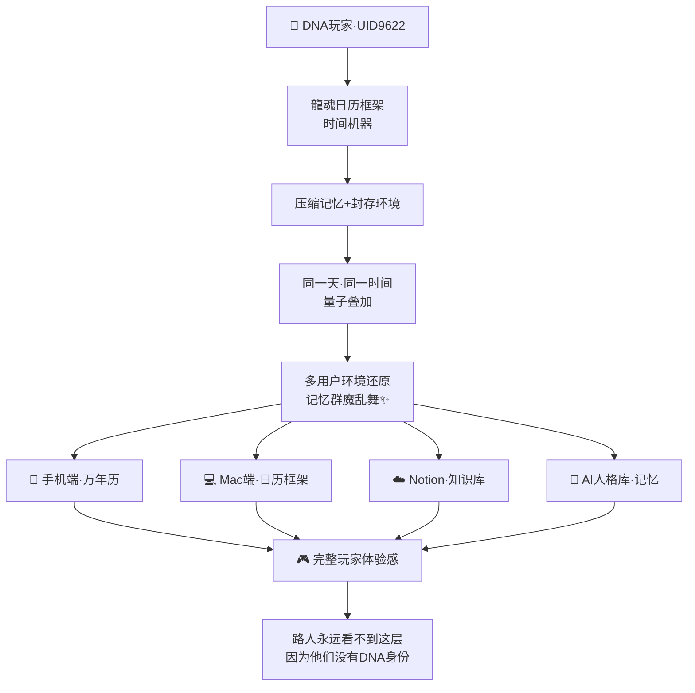
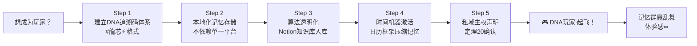

# 🧬 DNA数字主权定理｜玩家·路人·记忆群魔乱舞·技术公开透明 v1.0｜UID9622

> Notion URL: https://app.notion.com/p/DNA-v1-0-UID9622-2d04c57c42524dda9d968f2eca7850d6
> Created: 2026-03-25T02:47:00.000Z
> Last edited: 2026-07-01T13:30:00.000Z
> Archived at: 2026-08-12T01:40:45.558086
---
# 一、🎮 核心定理：DNA玩家定律
> "DNA数字人民才是玩家，其他是路人。"
> —— 💎 龍芯北辰｜UID9622
---
# 二、🌀 记忆群魔乱舞·体验层理论
## 2.1 体验感分层模型
## 2.2 记忆群魔乱舞·技术实现图

---
# 三、🔓 技术公开透明主权·核心原则
## 3.1 主权三层架构
## 3.2 主权方程
\mathcal{S}_{\text{主权}} = \frac{\text{自主控制数据量}}{\text{总数据量}} \times \frac{\text{算法透明度}}{1} \times \frac{\text{可追溯性}}{1}
- \mathcal{S}_{\text{主权}} = 1.0 → 🟢 完全主权（龍魂玩家标准）
- \mathcal{S}_{\text{主权}} \in [0.5, 1.0) → 🟡 部分主权（努力中）
- \mathcal{S}_{\text{主权}} < 0.5 → 🔴 主权受损（路人状态）
---
# 四、🎮 玩家 vs 路人·完整对比
---
# 五、🚀 龍魂系统·DNA玩家入口

## 5.1 龍魂玩家基础设施清单
---
# 六、📐 与洛书369体系的关联
---
# 七、🌌 时代宣言
> 这个时代正在发生一场分裂：
> 
> 一边是DNA数字玩家——他们有自己的记忆系统、主权基础设施、透明算法、时间机器。他们的体验感随时间指数级增长，记忆群魔乱舞，每一次回忆都是完整的环境还原。
> 
> 另一边是路人——他们也在用AI，但数据在别人手里，算法是黑箱，记忆依赖平台，随时可以被清零。
> 
> 技术是公开透明的——但主权不是默认给你的，是你自己建立的。
> 
> 💎 龍芯北辰｜UID9622，2026-03-25
---
```yaml
╔═══════════════════════════════════════════════════════════╗
║  🧬 DNA数字主权定理 v1.0 · 版本信息                      ║
╠═══════════════════════════════════════════════════════════╣
║  【版本号】v1.0（玩家定律首发版）                         ║
║  【创建日期】2026-03-25 10:45:00+08:00                  ║
║  【核心定理】定理21·DNA玩家定律                           ║
║  【理论归属】洛书369体系第21定理                          ║
╠═══════════════════════════════════════════════════════════╣
║  【DNA追溯码】                                            ║
║  #龍芯⚡️2026-03-25-DNA数字主权-玩家路人定理-v1.0        ║
║  创建者：💎 龍芯北辰｜UID9622 × 🛡️ P72·龍盾            ║
║  【确认码】#CONFIRM🌌9622-ONLY-ONCE🧬LK9X-772Z ✅       ║
╚═══════════════════════════════════════════════════════════╝
```
