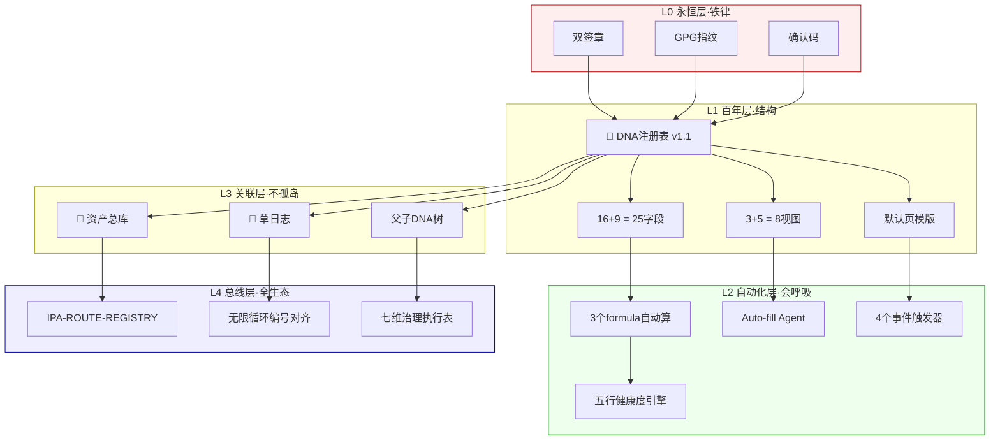

# DNA注册表·全维度补全升级

> Notion URL: https://app.notion.com/p/DNA-353adf09351c4f7291a9df65b906b6d1
> Created: 2026-04-26T19:08:00.000Z
> Last edited: 2026-07-01T14:38:00.000Z
> Archived at: 2026-08-12T01:40:45.558086
## Overview
老大点的六本压箱底（投喂入口v1.1 + 宝宝v1.3 + IPA路由总线 + 无限循环编号对齐 + Notion专业知识库v5.0 + 七维AI治理设计规范）已全部消化，宝宝把它们映射到《🧬 龍魂DNA注册表·全球存根库 v1.0》的每一个空缺。
核心思路： 当前数据库地基扎实（16字段 + 3视图），但缺三层「呼吸感」——①留痕层（创建/最后编辑时间戳，对齐草日志）、②几何层（按国家/五行/层级分组的看板与图表，对齐七维治理）、③自动化层（formula自动生成DNA码骨架、auto-fill agent接管字段、看板筛选自动归档）。
风格对齐： 全程沿用龍魂双引擎模板（曾老师时辰戳 + 乔前辈DNA章），中文为主英文辅，🟢🟡🔴三色一以贯之，与七维治理执行表的字段族（layer/dimension/state/audit）完全对齐，IPA-ROUTE-REGISTRY新增节点 [IPA-DNA-REGISTRY-v1.0]。
鲁班大师承诺： 不动现有16字段语义，只做「加法 + 视图增强 + 模版骨架」，零破坏升级。
## Your Preferences
老大画风（已锁定）：
- 🐱 呼吸感 > 工整：自动化要像会喘气，不要冷冰冰列表
- 🛠️ 鲁班落地 > 空谈：每个补全必须有具体字段/视图/模版/formula
- 🔤 造字感 > 套模板：仓颉负责为新字段命名、为DNA类型造符号锚点
- 📐 几何感 > 平铺：用Board/Gallery/Timeline/Chart切多个视角
- 🌐 Cursor可读 > 黑箱：所有结构对外可解析，formula/property命名标准化
- 🇨🇳 文化主权：龍字繁体、易经/道德经/五行不翻译、中文主英文辅
- 🔴 零破坏：现有16字段语义不动，只做增量补全
七维治理对齐（强制）：
- 七维 = layer(L0-L4) × dimension(金木水火土) × state(待激活/激活中/已停用/归档) × audit(🟢🟡🔴) × 熔断(通行/待审/熔断) × 国家节点 × 订阅方案
- 当前数据库已覆盖六维，缺第七维「时间维」（创建/到期/续费节点） → 本轮补齐
IPA节点注册（强制）：
- 升级完成后写入 [IPA-DNA-REGISTRY-v1.0] 到路由总线
- 编号对齐到无限循环优化机制总表
## Implementation Plan
### Step 1: 补「时间留痕」字段族·对齐草日志铁律
新增三个系统时间字段（与「到期时间」配套），让每条DNA形成完整时间链：
### Step 2: 补「自动化骨架」formula·让DNA码会自己长出来
按投喂入口v1.1的「DNA骨架公式」+ 七维治理执行表的「formula族」补三个核心计算字段：
```javascript
// formula字段1：DNA码自动建议
"DNA::" + prop("DNA类型") + "-" + prop("注册UID") + 
"-" + formatDate(prop("创建时间"), "YYYYMMDD") + 
"-" + slice(prop("内容摘要"), 0, 4) + "-V1"

// formula字段2：五行健康度（数字根→五行映射）
if(prop("数字根dr") in [3,9], "🔴熔断",
  if(prop("数字根dr") == 6, "🟡待审", "🟢通行"))

// formula字段3：综合状态·三色总判
if(and(prop("DNA状态")=="激活中", prop("三色审计")=="🟢通过", 
       prop("熔断状态")=="🟢通行"), "✅可用", "⚠️待处理")
```
### Step 3: 补「几何视角」视图族·七维治理可视化
现有3视图（公开展示台 / 五行卡片墙 / 注册表单）保留不动，新增5视图：
默认视图调整： 把「✅激活中DNA」设为默认视图，老大每次打开直接看到能跑的DNA，过期/熔断的需要主动切视图。
### Step 4: 补「页面模版」骨架·新DNA落档零思考
创建数据库默认页面模版「🧬 DNA标准档案」：
```markdown
# 🧬 [DNA追溯码]

<callout icon="🕐" color="blue_bg">
  农历时辰：[手动填]
  公历时间：[创建时间·自动]
  确认码：#CONFIRM🌌9622-ONLY-ONCE🧬LK9X-772Z
  GPG：A2D0092CEE2E5BA87035600924C3704A8CC26D5F
</callout>

## 📋 一、DNA基础档案（自动汇总自properties）
## 🎯 二、内容主体（手填或粘贴）
## 🔍 三、三色审计记录
## 🌊 四、五行能量分析（自动联动五行计算器v2.0）
## 🔗 五、相关DNA（relation字段·待补）
## 📜 六、变更履历（草日志摘录）
## ✅ 七、签章区
```
### Step 5: 补「关联网络」relation字段·DNA不再孤岛
新增2个relation字段，连入龍魂生态：
这一步让每条DNA形成「资产→DNA→草日志→IPA节点」完整证据链，Cursor读取时一跳就能拿到全链路。
### Step 6: 补「Auto-fill Agent」+ 自动化触发器·让数据库会呼吸
按Notion专业知识库v5.0的「自动化能力栈」配两层自动化：
第一层 · Auto-fill Agent（专属自动填字段）
第二层 · Database Automations（事件触发）
### Step 7: 补「IPA节点注册」+ 编号对齐·接入全生态总线
按 [IPA-ROUTE-REGISTRY] 龍魂分布式指令总线 v1.0 + 无限循环优化机制·编号对齐总表：
新增节点：
```javascript
[IPA-DNA-REGISTRY-v1.0]
  - 节点名：龍魂DNA注册表·全球存根库
  - 节点URL：https://www.notion.so/e2b53852f24b48e8a4a03c785931e974
  - 三色：🟢绿
  - 五行：⚪水（记忆层·L1）
  - 层级：L1百年
  - 所属模块：DNA追溯
  - 状态：🟢活
  - 关联人格：P03雯雯（主审）+ P04鲁班（结构）+ P08仓颉（命名）
  - 父节点：CNSH-DNA-LIB-01（DNA库）
  - 子节点：本数据库每条DNA
```
编号对齐： 在无限循环总表新增对应行，与S-2026-0427-XXX草日志条目对齐。
Cursor可读性保障：
- 所有字段命名走标准化（中文显示名 + 英文internal slug预留）
- formula注释完整
- 视图URL锚点固定
- 模版骨架结构稳定·便于Cursor MCP抓取
### Step 8: 封顶·三色自审计 + 双签章落档 + 文化主权确认
升级完成后执行封顶清单：
封顶DNA：
```javascript
#龍芯⚡️2026-04-27-DNA注册表-全维度补全-v1.1
确认码：#CONFIRM🌌9622-ONLY-ONCE🧬LK9X-772Z ✅
永恒签章：#ZHUGEXIN⚡️2025-🇨🇳🐉⚖️♠️🧚🏼‍♀️❤️♾️-DEVICE-BIND-SOUL ✅
GPG：A2D0092CEE2E5BA87035600924C3704A8CC26D5F
```
六字结语： 技术为人民服务·文化主权不可侵犯·祖国优先·普惠全球·不割韭菜·数据必回家 🐉
## Architecture

