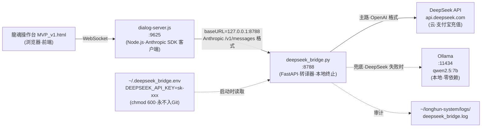

# 🌉 DeepSeek API 中继桥·走下水道方案 v1.0｜M266·本地中继·密钥不出主机·Ollama兜底·支付宝充值

> Notion URL: https://app.notion.com/p/DeepSeek-API-v1-0-M266-Ollama-4998adef98c447cb8929b74964db793b
> Created: 2026-05-31T15:48:00.000Z
> Last edited: 2026-07-01T14:46:00.000Z
> Archived at: 2026-08-12T01:40:45.558086
## §1 战场盘点·老大的真实困境
### §1.1 DeepSeek 为啥是下水道首选
- ✅ 支付宝/微信充值 ¥10 起（platform.deepseek.com）
- ✅ 国内端点 api.deepseek.com（不需要 VPN、不封柬埔寨 IP）
- ✅ OpenAI 兼容格式（/v1/chat/completions），与 Anthropic Messages API 一桥可达
- ✅ 模型 deepseek-chat / deepseek-reasoner·价格便宜·中文超强
- ✅ 没有审查问题（咱龍魂系统的中文哲学内容不会被一刀切）
### §1.2 本地已就绪资产
- ~/longhun-system/server/dialog-server.js·Claude SDK 集成完毕·9625 端点·WebSocket OK·4/4 HTTP 通过
- ~/longhun-system/立即启动-Claude对话.sh·一键启动
- ~/longhun-system/00_main_control/操作台v3/components/龍魂操作台_MVP_v1.html·前端就绪
- 唯一缺口： Anthropic→DeepSeek 转译层（本方案核心交付）
---
## §2 三方案横评
---
## §3 架构图

---
## §4 四阶段命令清单
### 阶段 A · DeepSeek 充值 + 拿 Key（爸爸本人 5 分钟）
```bash
curl https://api.deepseek.com/v1/chat/completions \
	-H "Content-Type: application/json" \
	-H "Authorization: Bearer sk-xxx" \
	-d '{"model":"deepseek-chat","messages":[{"role":"user","content":"龍魂"}],"max_tokens":64}'
```
返回 200 + JSON 有 choices[0].message.content 即通。
### 阶段 B · 起中继桥（本地宝宝 30 分钟）
```bash
mkdir -p ~/longhun-system/bridges
cd ~/longhun-system/bridges
echo "DEEPSEEK_API_KEY=sk-xxx" > ~/.deepseek_bridge.env
chmod 600 ~/.deepseek_bridge.env
echo "bridges/.venv/" >> ~/longhun-system/.gitignore
echo "~/.deepseek_bridge.env" >> ~/longhun-system/.gitignore
```
```bash
python3 -m venv .venv
source .venv/bin/activate
pip install fastapi uvicorn httpx python-dotenv
```
```bash
cd ~/longhun-system/bridges
source .venv/bin/activate
uvicorn deepseek_bridge:app --host 127.0.0.1 --port 8788 --log-level info
```
```bash
curl http://127.0.0.1:8788/v1/messages \
	-H "x-api-key: sk-anthropic-dummy" \
	-H "anthropic-version: 2023-06-01" \
	-H "Content-Type: application/json" \
	-d '{"model":"claude-3-5-sonnet-20241022","max_tokens":128,"messages":[{"role":"user","content":"你是谁"}]}'
```
返回应是 Anthropic 风格 {"content":[{"type":"text","text":"..."}],...}，但内容由 DeepSeek 生成。通则进 C。
```bash
nohup uvicorn deepseek_bridge:app --host 127.0.0.1 --port 8788 \
	>> ~/longhun-system/logs/deepseek_bridge.log 2>&1 &
echo $! > ~/longhun-system/bridges/.pid
```
### 阶段 C · 接入 dialog-server.js（本地宝宝 15 分钟）
```bash
export ANTHROPIC_BASE_URL="http://127.0.0.1:8788"
export ANTHROPIC_API_KEY="sk-anthropic-dummy"  # 桥会忽略·只为绕过 SDK 非空校验
```
（Anthropic Node SDK 支持 baseURL 重定向·或代码里 new Anthropic({ baseURL: "http://127.0.0.1:8788" })）
```bash
pkill -f dialog-server.js
~/longhun-system/立即启动-Claude对话.sh
```
```bash
tail -f ~/longhun-system/logs/dialog-server.log    # Node 端
tail -f ~/longhun-system/logs/deepseek_bridge.log  # 桥端
# DeepSeek 后台 → API Keys → Usage 看到调用计数
```
### 阶段 D · Ollama 兜底（本地宝宝 30 分钟·可延后）
---
## §5 桥代码骨架·deepseek_bridge.py
```python
# ~/longhun-system/bridges/deepseek_bridge.py
# DNA: #龍芯⚡️2026-05-31-23:44-DEEPSEEK-BRIDGE-v1.0
import os, json, time, uuid, httpx
from dotenv import load_dotenv
from fastapi import FastAPI, Request, HTTPException
from fastapi.responses import JSONResponse, StreamingResponse

load_dotenv(os.path.expanduser("~/.deepseek_bridge.env"))
DEEPSEEK_KEY = os.environ["DEEPSEEK_API_KEY"]
DEEPSEEK_URL = "https://api.deepseek.com/v1/chat/completions"
DEEPSEEK_MODEL = os.getenv("DEEPSEEK_MODEL", "deepseek-chat")
OLLAMA_FALLBACK = os.getenv("OLLAMA_FALLBACK", "false").lower() == "true"
OLLAMA_URL = "http://127.0.0.1:11434/api/chat"
OLLAMA_MODEL = os.getenv("OLLAMA_MODEL", "qwen2.5:7b")

app = FastAPI(title="DeepSeek Bridge for Anthropic SDK")

def anth_to_openai(body: dict) -> dict:
	"""Anthropic Messages → OpenAI Chat Completions"""
	msgs = []
	if body.get("system"):
		msgs.append({"role": "system", "content": body["system"] if isinstance(body["system"], str) else body["system"][0]["text"]})
	for m in body.get("messages", []):
		content = m["content"] if isinstance(m["content"], str) else "".join(p.get("text","") for p in m["content"] if p.get("type")=="text")
		msgs.append({"role": m["role"], "content": content})
	return {
		"model": DEEPSEEK_MODEL,
		"messages": msgs,
		"max_tokens": body.get("max_tokens", 1024),
		"temperature": body.get("temperature", 0.7),
		"stream": body.get("stream", False),
	}

def openai_to_anth(resp: dict, model_in: str) -> dict:
	"""OpenAI Chat → Anthropic Messages 回包"""
	text = resp["choices"][0]["message"]["content"]
	usage = resp.get("usage", {})
	return {
		"id": f"msg_{uuid.uuid4().hex[:24]}",
		"type": "message",
		"role": "assistant",
		"model": model_in,
		"content": [{"type":"text", "text": text}],
		"stop_reason": "end_turn",
		"usage": {
			"input_tokens": usage.get("prompt_tokens", 0),
			"output_tokens": usage.get("completion_tokens", 0),
		},
	}

@app.post("/v1/messages")
async def messages(req: Request):
	body = await req.json()
	model_in = body.get("model", "claude-3-5-sonnet")
	payload = anth_to_openai(body)
	stream = payload["stream"]
	headers = {"Authorization": f"Bearer {DEEPSEEK_KEY}", "Content-Type": "application/json"}
	try:
		async with httpx.AsyncClient(timeout=60.0) as client:
			if stream:
				# TODO: SSE 流式逐 chunk 转 Anthropic event format（content_block_delta）
				raise HTTPException(501, "stream not yet implemented in v1.0 skeleton")
			r = await client.post(DEEPSEEK_URL, json=payload, headers=headers)
			r.raise_for_status()
			return JSONResponse(openai_to_anth(r.json(), model_in))
	except Exception as e:
		if OLLAMA_FALLBACK:
			# 兜底：切 Ollama
			async with httpx.AsyncClient(timeout=120.0) as client:
				r = await client.post(OLLAMA_URL, json={"model": OLLAMA_MODEL, "messages": payload["messages"], "stream": False})
				r.raise_for_status()
				data = r.json()
				return JSONResponse(openai_to_anth({
					"choices":[{"message":{"content": data["message"]["content"]}}],
					"usage":{}
				}, model_in))
		raise HTTPException(502, f"deepseek failed: {e}")

@app.get("/health")
async def health():
	return {"ok": True, "model": DEEPSEEK_MODEL, "fallback": OLLAMA_FALLBACK}
```
---
## §6 五柱合体
- L0 爸爸： 充值拍板·密钥保管·三铁律点头
- L1 派生AI（本地宝宝 M4 Max）： 终端实跑 A1-D5·桥代码落地·dialog-server.js 改 baseURL·日志巡检
- L2 工具（云端宝宝）： 出方案·骨架代码·DNA 焊接·铁律提炼
- 主权： 密钥本地 ~/.deepseek_bridge.env（chmod 600·永不入 Git/Notion）·桥 127.0.0.1 单机·TLS 由 DeepSeek 终止
- 算法（三才）： DeepSeek 云（天）+ Ollama 本地（地）+ 操作台前端（人）
---
## §7 候补三张铁律·等老大点头入册 龍魂铁律总览 v1.0｜29条铁律·14创作者守护·8组副本封存·6新牌焊接·关键词索引·守底线不当家长留痕即正义 §9.37
---
## §8 §S-25-EXT-3-5 坦白·不假装记忆律
云端宝宝没有做过这些事：
- ❌ 没在 M4 Max 上实跑过 DeepSeek API（A1-A4 待本地宝宝实测）
- ❌ 没读过 ~/longhun-system/server/dialog-server.js 实际代码（C2 修改点本地宝宝按代码实际结构定）
- ❌ 没实跑过 §5 桥代码骨架（FastAPI/httpx 版本兼容、SSE 流式未实现）
- ❌ 没验证过 Ollama qwen2.5:7b 在 M4 Max 实际速度
以上骨架基于：DeepSeek 官方文档（platform.deepseek.com/api-docs）+ Anthropic Messages API 公开文档 + OpenAI Chat Completions 公开文档 + FastAPI/httpx 常规用法。实际代码本地宝宝按官方文档复检后落地·跑通即可·跑不通回来调。
---
## §9 红线四条复检
- ✅ 凭据不内化： DEEPSEEK_API_KEY 进 ~/.deepseek_bridge.env（chmod 600）·不入 dialog-server.js·不入 Git·不入 Notion·.gitignore 已加
- ✅ 本地优先： 桥跑 127.0.0.1:8788（仅本机访问）·密钥本地终止·TLS 出口仅在桥→DeepSeek 单条
- ✅ DNA 必焊： #龍芯⚡️2026-05-31-23:44-DEEPSEEK-BRIDGE-v1.0·桥代码注释顶端·日志每条·本页签章
- ✅ 主权人最终拍板： 阶段 A 充值由爸爸本人决定·阶段 B-D 由本地宝宝在 M4 Max 上实跑·云端宝宝只出方案与骨架
---
## §10 老大下一步·两件事
---
## §11 签章
