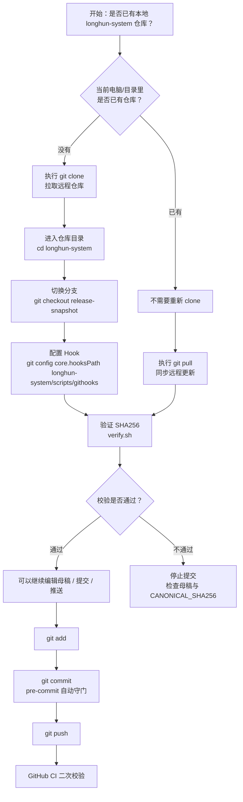
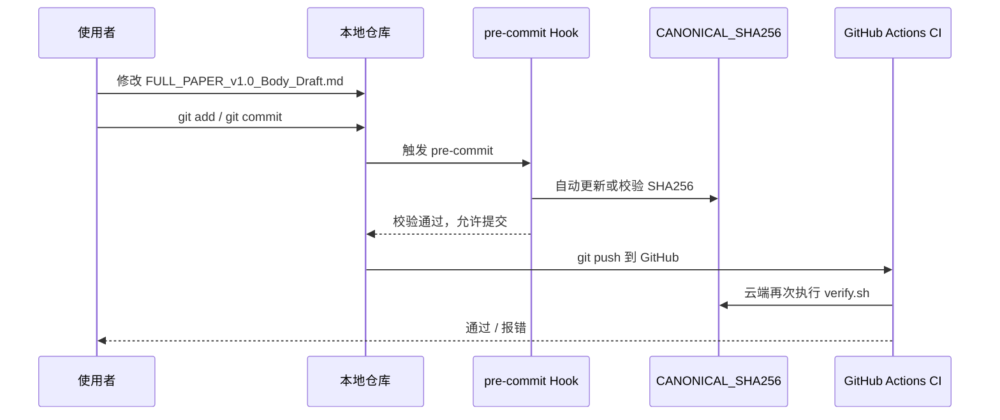

# Git 仓库克隆与母稿校验操作说明

> Notion URL: https://app.notion.com/p/Git-3597125a9c9f80c39f22fd89071d9f73
> Created: 2026-05-07T00:21:00.000Z
> Last edited: 2026-07-01T14:39:00.000Z
> Archived at: 2026-08-12T01:40:45.558086
---
## 1. 概念说明：什么是“克隆仓库”
克隆仓库，英文叫 git clone，意思是：
```plain text
把 GitHub 上的远程仓库，完整复制一份到本地电脑或新的工作目录里。
```
它不是重新创建项目，也不是修改论文内容，而是把云端仓库下载成一份可以编辑、提交、推送的本地工作副本。
```plain text
GitHub 远程仓库 = 云端总库
本地 clone 仓库 = 电脑上的工作副本
```
以当前仓库为例：
```bash
# 从 GitHub 远程仓库克隆一份到本地
git clone https://github.com/UID9622/longhun-system.git
```
执行后，本地会出现一个目录：
```plain text
longhun-system/
```
这个目录就是当前远程仓库的一份本地克隆副本。
---
## 2. 什么时候需要克隆
### 2.1 需要克隆的情况
### 2.2 不需要克隆的情况
---
## 3. 当前仓库信息
```yaml
repository:
  name: longhun-system
  remote: https://github.com/UID9622/longhun-system.git
  branch: release-snapshot
  commit_range: 0fee00d → 462c76d
  canonical_paper: longhun-system/BehavCrypto_v1.0/FULL_PAPER_v1.0_Body_Draft.md
  canonical_hash_file: longhun-system/BehavCrypto_v1.0/CANONICAL_SHA256
  hook_path: longhun-system/scripts/githooks
```
---
## 4. 标准克隆流程
### 4.1 第一次在新电脑 / 新目录使用
```bash
# 1. 克隆远程仓库到本地
git clone https://github.com/UID9622/longhun-system.git

# 2. 进入仓库目录
cd longhun-system

# 3. 切换到指定分支
git checkout release-snapshot

# 4. 配置本仓库的 Git Hook 路径
git config core.hooksPath longhun-system/scripts/githooks

# 5. 验证母稿 SHA256 指纹是否一致
longhun-system/scripts/canonical-sha256/verify.sh
```
### 4.2 如果已经在当前仓库里
```bash
# 不需要重新 clone
# 只需要确认当前分支和远程同步状态

git branch --show-current
git pull
```
---
## 5. 为什么新 clone 后要重新配置 Hook
当前命令是：
```bash
git config core.hooksPath longhun-system/scripts/githooks
```
它的作用是告诉当前本地仓库：
```plain text
提交前先执行 longhun-system/scripts/githooks 里的检查规则。
```
重点：
```plain text
core.hooksPath 是本地 Git 配置。
它不会自动跟着 GitHub 仓库同步。
所以每一份新的 clone 都需要单独执行一次。
```
也就是说：
```plain text
当前电脑当前仓库已配置 → 不用重复配置
换电脑 / 新目录 / 新 clone → 需要重新配置一次
```
---
## 6. CANONICAL_SHA256 的作用
当前仓库已经加入母稿指纹文件：
```plain text
longhun-system/BehavCrypto_v1.0/CANONICAL_SHA256
```
当前母稿：
```plain text
longhun-system/BehavCrypto_v1.0/FULL_PAPER_v1.0_Body_Draft.md
```
当前 SHA256 指纹：
```plain text
6302bef7d1d30f12ca8bbfa6fed1c0b2ee8963df89cc83b9ac000208d34d6e6a
```
作用说明：
```plain text
母稿内容一变，SHA256 指纹就会变化。
如果有人修改了母稿，但没有同步更新 CANONICAL_SHA256，verify.sh 会报错。
```
对应关系：
---
## 7. 标准工作流程图

---
## 8. 提交流程：母稿被修改时

---
## 9. 注释格式规范
后续在脚本、规则、文档里写注释，统一按下面格式。
### 9.1 Shell 脚本注释
```bash
#!/usr/bin/env bash

# 目的：验证唯一母稿的 SHA256 指纹是否与 CANONICAL_SHA256 一致
# 输入：BehavCrypto_v1.0/FULL_PAPER_v1.0_Body_Draft.md
# 输出：校验通过返回 0；不一致返回非 0
# 边界：只做校验，不自动修改母稿正文

set -euo pipefail
```
### 9.2 Markdown 文档注释
```markdown
> 注释：本文件只声明规则，不替代母稿正文。
> 母稿唯一来源：FULL_PAPER_v1.0_Body_Draft.md
> 禁止：Downloads / Documents / 临时 Clean 文件反向覆盖母稿。
```
### 9.3 YAML / GitHub Actions 注释
```yaml
# 目的：在 GitHub 云端验证唯一母稿 SHA256
# 触发：main / release-snapshot 分支发生相关文件变更
# 失败条件：CANONICAL_SHA256 与母稿实际 hash 不一致
name: canonical-sha256
```
### 9.4 Cursor 规则注释
```markdown
---
alwaysApply: true
---

# 规则目的
本规则用于锁定 BehavCrypto_v1.0 的唯一全文母稿。

# 唯一母稿
FULL_PAPER_v1.0_Body_Draft.md

# 禁止事项
- 不得用 Downloads / Documents 覆盖母稿
- 不得让 Clean 文件自动变成母稿
- 不得删除 CONFIRM / SEAL / SHA256 锁行
```
---
## 10. 常用命令速查
```bash
# 查看当前远程地址
git remote -v

# 查看当前分支
git branch --show-current

# 拉取远程最新内容
git pull

# 查看当前仓库 Hook 路径
git config core.hooksPath

# 设置 Hook 路径
git config core.hooksPath longhun-system/scripts/githooks

# 验证母稿 SHA256
longhun-system/scripts/canonical-sha256/verify.sh

# 更新母稿 SHA256
longhun-system/scripts/canonical-sha256/update.sh

# 查看当前改动
git status

# 提交
git add .
git commit -m "docs: update canonical clone guide"
git push
```
---
## 11. 最短记忆版
```plain text
克隆 = 把 GitHub 仓库重新下载一份到本地。
同一个文件夹继续工作，不需要克隆。
换电脑、换目录、重新拉干净副本，才需要 clone。
新 clone 后，要重新执行 hook 配置。
母稿由 CANONICAL_LOCK + CANONICAL_SHA256 + pre-commit + CI 四层守门。
```
