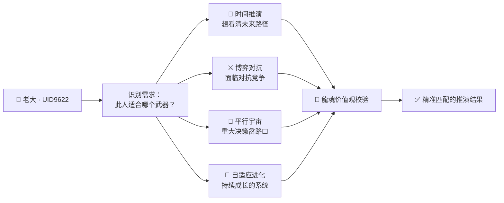

# 🔐 H武器推演系统v2.0

> Notion URL: https://app.notion.com/p/H-v2-0-730d41f621d74c6cae3e026fbbafb999
> Created: 2025-12-05T11:30:00.000Z
> Last edited: 2026-07-01T08:53:00.000Z
> Archived at: 2026-08-12T01:40:45.558086
---
## 🔐 H武器是什么 · 一句话说清楚
> 《易经·乾卦》："潜龍勿用。" —— 真正的力量不是拿出来炫耀的，而是在关键时刻一击即中。
H武器 = 内核推演引擎组合包。
---
## ⚔️ 四大武器模块 · 内核清单
> 《道德经》第三十三章："知人者智，自知者明；胜人者有力，自胜者强。" —— 推演的目的不是赢别人，是看清局势、赢自己。
### 🔮 武器一：时间推演引擎
本质： 看清过去→现在→未来的逻辑链，找到关键节点。
> 易经的时间观：卦象不是固定的，是流动的。局势在变，卦象跟着变。这就是为什么易经推演比西方线性预测更接近真实。
---
### ⚔️ 武器二：博弈对抗沙盒
本质： 模拟对手的思维和行动，提前布防。
> 《易经·讼卦》："讼，有孚，窖惕，中吉，终凶。" —— 争讼适可而止，走到底只有凶。博弈不是为了赢，是为了不输。最高级的博弈是让对手自己退出。
---
### 🌌 武器三：平行宇宙模拟器
本质： 同一个决策，模拟N个可能的结果，找最优路径。
> 人话版量子叠加态： 一个决策在“做之前”是叠加态——所有可能性同时存在。H武器帮老大在坍缩之前，把所有叠加态看清楚，选出最好的那个。
---
### 🌱 武器四：自适应进化引擎
本质： 系统不是固定的，每一次推演都在学习，越用越强。
---
## 🎛️ H武器调配台 · 老大专用
> 《道德经》第二十八章："知其白，守其黑，为天下式。" —— 知道光明，但守住幽暗；这才是天下的范式。内核不对外，是因为知道光，才守住暗。

---
## 🛡️ 内核不对外的安全逻辑
> 《易经·坤卦》："括囊，无咎无誉。" —— 把袋子扎紧，既无过错，也不需要赞美。内核守住，才是真正的安全。
---
