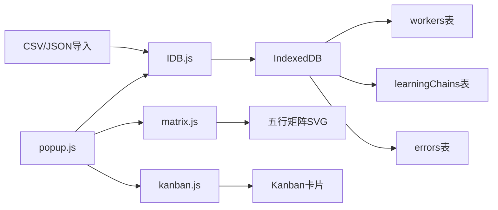

# LU-SYNC Dashboard浏览器扩展 | 完整架构

> Notion URL: https://app.notion.com/p/LU-SYNC-Dashboard-284ed2251f434c949c1dd141c2a25f15
> Created: 2025-12-13T05:04:00.000Z
> Last edited: 2026-07-01T13:25:00.000Z
> Archived at: 2026-08-12T01:40:45.558086
# LU-SYNC Dashboard | UI视觉震撼版（龙魂动效）
DNA确认码：#ZHUGEXIN⚡️2025-LU-SYNC-UI-VISUAL-EDITION-V0.2.0
## 📦 完整文件结构
```javascript
lu-sync-dashboard-ui/
├─ manifest.json              # Firefox扩展配置（Manifest V3）
├─ icons/
│  └─ icon-128.png           # 扩展图标
├─ popup/
│  ├─ popup.html            # 主界面HTML
│  ├─ popup.css             # 玄黑风格样式
│  └─ popup.js              # 主逻辑与数据绑定
├─ lib/
│  └─ idb.js                # IndexedDB封装
├─ render/
│  ├─ matrix.js             # 五行矩阵渲染
│  └─ kanban.js             # Kanban看板渲染
└─ README.md
```
## 🎯 核心功能
### 1️⃣ 太极展开动画（SVG旋转）
- SVG路径动画
- 持续旋转效果
- 渐变光晕
### 2️⃣ 五行矩阵交互
- 五行元素环形布局
- 点击节点显示详情
- 鼠标悬停放大效果
- 中心太极点
### 3️⃣ 错误炼化炉
- 火焰SVG动画
- 随机脉冲效果
- 炼化日志实时更新
### 4️⃣ 学习链进度环
- SVG圆环进度条
- 天层吸收率统计
- 动态颜色切换
### 5️⃣ Kanban看板
- 4状态分组：活跃/待优化/待处理/空闲
- 卡片翻页动画（爻变效果）
- 点击切换正反面
- 五行标签配色
### 6️⃣ 本地存储（IndexedDB）
- workers 表：Worker执行单元
- learningChains 表：学习链数据
- errors 表：错误日志
- 支持CSV/JSON导入
## 🎨 视觉设计
配色方案：
- 背景：玄黑 #060608
- 主色：朱砂 #d63b2d
- 强调：金属金 #e6c36a
- 五行色：木绿/火红/土棕/金黄/水蓝
动效特性：
- 毛玻璃效果（backdrop-filter: blur(6px)）
- 深度阴影（0 6px 20px rgba(0,0,0,0.6)）
- 卡片悬停抬起（translateY(-6px)）
- 平滑过渡（transition: transform .18s）
## 🚀 部署步骤（Firefox临时加载）
1. 创建文件夹并放入所有文件
1. 打开Firefox → about:debugging#/runtime/this-firefox
1. 点击 Load Temporary Add-on
1. 选择 manifest.json
1. 扩展图标出现在工具栏，点击打开
⚠️ 注意：临时加载会在浏览器重启后失效，永久使用需签名打包。
## 📊 数据流架构

## 🔄 后续增强路线图
A. WebGL Shader太极：更炫酷的3D旋转效果
B. Kanban拖拽持久化：卡片拖动即写DB，状态实时同步
C. 伏地魔炼化可视化：错误分类 → 炼化过程动画 → 生成新能力
D. 三经规则编辑器：道德经/兵法/黄帝内经规则可视化配置
E. XPI打包签名：完整Firefox扩展发布包
## 🔗 关联模块
- 🌌 UID9622·V9 龍魂智能体操作系统｜道术器用·脱胎换骨版
- 📋 本地claude和本地AI的学习清单
- 🎛️ 沙盒推演系统控制台 v3.0 - 全能升级版
## 🎯 技术要点总结
✅ 离线优先：IndexedDB本地存储，无需服务器
✅ 文化优先：太极/五行/易经元素深度融合
✅ 视觉震撼：SVG动画 + 毛玻璃 + 深度阴影
✅ 可扩展：模块化设计，后续可接engine引擎
✅ 性能优化：定时器控制刷新频率，避免卡顿
---
创建人：💖 文心 + 🎯 诸葛亮（代理执行）
审核：👁️ 上帝之眼 ✅ 通过
价值观审核：🐉 龙魂 ✅ 符合CNSH标准
